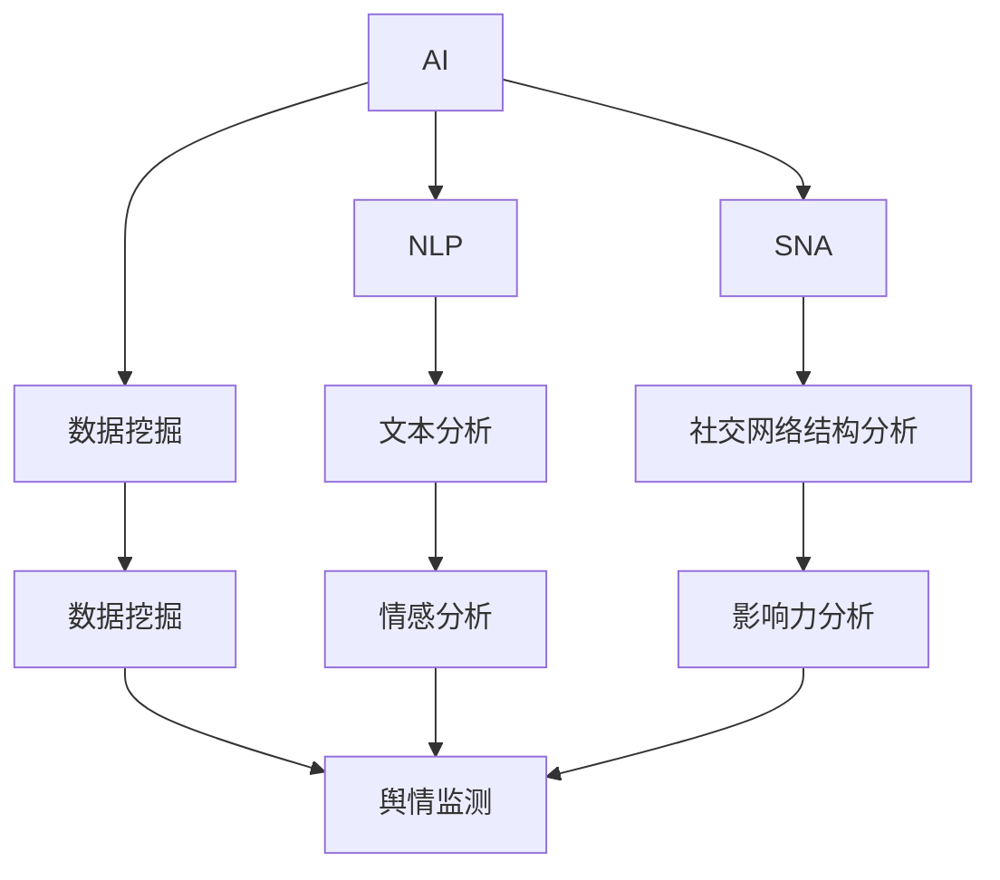

                 

# AI在品牌声誉监控中的作用

## 1. 背景介绍

在数字化时代，品牌声誉管理成为企业竞争中至关重要的一环。然而，品牌声誉的监控和管理已非人力所能承担，这便是人工智能的用武之地。借助AI的强大能力，品牌可以实时监控网络上的各类舆情，准确把握公众情绪，并根据舆情变化及时作出反应，从而有效维护品牌形象，提升市场竞争力。本文将全面探讨AI在品牌声誉监控中的应用，包括其工作原理、实施步骤、关键技术和具体应用场景，并展望其未来的发展趋势。

## 2. 核心概念与联系

### 2.1 核心概念概述

#### 2.1.1 人工智能(AI)
人工智能是一种通过计算机程序和算法模拟人类智能的技术。它涵盖了机器学习、深度学习、自然语言处理等多个领域，能够实现自动化决策、智能推荐、语音识别等多种应用。

#### 2.1.2 品牌声誉管理(BRM)
品牌声誉管理是指企业对自身品牌形象进行系统管理和维护的过程。这包括监测品牌在各种媒体、社交网络上的表现，评估品牌价值，并根据反馈调整品牌策略。

#### 2.1.3 自然语言处理(NLP)
自然语言处理是一种使计算机能够理解、解释和生成人类语言的技术。它涵盖了文本分析、情感分析、语言生成等多个子领域，是AI在品牌声誉监控中不可或缺的一部分。

#### 2.1.4 社交网络分析(SNA)
社交网络分析是指通过分析社交网络中的用户关系和行为，识别品牌在社交网络上的影响力。

#### 2.1.5 数据挖掘
数据挖掘是从大量数据中发现隐藏的模式、关联和趋势的过程。它是AI在品牌声誉监控中提取有价值信息的关键技术。

### 2.2 核心概念间的关系

AI、NLP、SNA和数据挖掘等技术为品牌声誉监控提供了强大的支撑。AI负责自动化决策和实时监测，NLP用于提取和分析文本信息，SNA用于分析社交网络结构，数据挖掘则用于从大数据中提取有价值的信息。这些技术的结合，使品牌能够在海量数据中高效地监控和分析声誉状态，作出科学决策。

以下是核心概念间的关系图：



## 3. 核心算法原理 & 具体操作步骤

### 3.1 算法原理概述

AI在品牌声誉监控中的核心算法原理主要包括以下几个步骤：

1. **数据采集**：从社交媒体、新闻报道、客户反馈等多个渠道采集数据。
2. **预处理**：对采集到的数据进行清洗、去重和格式转换等预处理操作。
3. **情感分析**：使用NLP技术对文本进行情感分析，判断公众对品牌的情感倾向。
4. **社交网络分析**：利用SNA技术分析品牌的社交网络结构，评估品牌在网络中的影响力。
5. **数据挖掘**：从大量数据中提取相关模式和关联，辅助决策。
6. **实时监控和反馈**：将分析结果实时展示给决策者，并根据反馈调整策略。

### 3.2 算法步骤详解

**Step 1：数据采集**

品牌声誉监控的第一步是数据采集。数据采集可以从以下渠道进行：

- 社交媒体：如微博、微信、Facebook等社交平台上的评论、帖子和消息。
- 新闻报道：通过爬虫技术从新闻网站抓取相关报道。
- 客户反馈：收集客户通过邮件、电话、在线客服等渠道反馈的信息。
- 公开资料：包括公司公告、产品说明等公开资料。

使用API接口或爬虫工具，可以将这些数据源进行整合，建立统一的数据存储和处理系统。

**Step 2：数据预处理**

数据采集完成后，需要进行预处理操作，以提高数据的质量和可用性。预处理主要包括以下几个方面：

- **清洗**：去除无关的噪音数据，如垃圾信息、链接等。
- **去重**：对相同或相似的数据进行去重处理，避免重复分析。
- **格式转换**：将不同格式的数据转换为统一的格式，方便后续处理。

预处理工具如Python的Pandas库、Scikit-learn库等可以用于数据清洗和格式转换。

**Step 3：情感分析**

情感分析是利用NLP技术对文本进行情感倾向判断。常用的情感分析方法包括：

- **基于规则的方法**：使用词典或规则库进行情感判断。
- **基于机器学习的方法**：使用分类器或回归器进行情感分类。
- **基于深度学习的方法**：使用神经网络模型对情感进行预测。

情感分析工具如TextBlob、NLTK、Stanford NER等可以用于情感分析。

**Step 4：社交网络分析**

社交网络分析是通过分析品牌在社交网络中的结构，评估其影响力。常用的方法包括：

- **中心度分析**：计算品牌在网络中的中心度，如度数中心度、接近中心度等。
- **社区分析**：使用社区发现算法将网络分成不同的社区，识别品牌在哪些社区中的影响力最大。
- **影响力分析**：根据中心度和社区分析结果，评估品牌在网络中的整体影响力。

社交网络分析工具如Gephi、NetworkX等可以用于社交网络分析。

**Step 5：数据挖掘**

数据挖掘是从大量数据中提取有价值的信息。常用的方法包括：

- **关联规则挖掘**：发现数据之间的关联规则，如品牌与某事件的相关性。
- **聚类分析**：将数据分成不同的群组，发现隐藏的模式。
- **异常检测**：检测数据中的异常点和异常趋势。

数据挖掘工具如Weka、RapidMiner等可以用于数据挖掘。

**Step 6：实时监控和反馈**

将上述分析结果实时展示给决策者，并根据反馈调整策略。常用的实时监控工具如Kibana、Grafana等可以用于实时监控和展示。

### 3.3 算法优缺点

**优点**：

- **实时性**：AI能够实时监控和分析数据，快速响应品牌声誉变化。
- **自动化**：自动化处理大量数据，减少人工成本，提高效率。
- **客观性**：算法处理数据，避免人为偏差，结果更客观。

**缺点**：

- **依赖数据质量**：数据分析结果依赖于数据的质量和来源。
- **技术门槛**：需要具备数据处理和算法开发的技术能力。
- **安全隐私**：需要保护数据和用户隐私，避免数据泄露。

### 3.4 算法应用领域

AI在品牌声誉监控中的应用领域非常广泛，涵盖了多个行业：

- **零售**：监控社交媒体和客户反馈，调整产品和服务策略。
- **金融**：监控新闻和社交媒体，评估市场情绪，指导投资决策。
- **旅游**：监控旅游平台上的用户评价，提升旅游服务质量。
- **医疗**：监控医疗论坛和患者反馈，提升医疗服务水平。

## 4. 数学模型和公式 & 详细讲解 & 举例说明

### 4.1 数学模型构建

品牌声誉监控的数学模型主要包括以下几个部分：

- **情感分析模型**：用于对文本进行情感分类，常用的模型包括SVM、随机森林、BERT等。
- **社交网络模型**：用于分析品牌在社交网络中的结构，常用的模型包括PageRank、K-means等。
- **关联规则模型**：用于发现数据之间的关联规则，常用的算法包括Apriori、FP-growth等。

### 4.2 公式推导过程

以情感分析模型为例，其数学公式如下：

$$
\text{情感分类} = \arg\min_{c} \sum_{i=1}^{N} \text{loss}(\text{softmax}(\text{embedding}(\text{input}_i)), c)
$$

其中，$\text{input}_i$ 为输入的文本数据，$\text{embedding}$ 为文本嵌入函数，$c$ 为情感分类标签，$N$ 为文本总数，$\text{loss}$ 为损失函数。

### 4.3 案例分析与讲解

假设品牌在社交媒体上发布了一条广告，AI需要对该广告的舆情进行分析。具体步骤如下：

1. **数据采集**：从社交媒体平台采集关于该广告的评论和回复。
2. **预处理**：去除垃圾信息和重复评论，将文本转换为统一格式。
3. **情感分析**：使用情感分析模型对评论进行情感分类，统计正面和负面的评论数量。
4. **社交网络分析**：分析广告在社交网络中的传播路径和中心度，评估其影响力。
5. **数据挖掘**：挖掘与广告相关的事件和趋势，如消费者对广告的反应。
6. **实时监控和反馈**：将分析结果实时展示给决策者，并根据反馈调整广告策略。

## 5. 项目实践：代码实例和详细解释说明

### 5.1 开发环境搭建

在搭建品牌声誉监控系统前，需要先准备好开发环境。以下是Python环境配置的详细步骤：

1. **安装Python**：从Python官网下载并安装最新版本的Python。
2. **创建虚拟环境**：使用虚拟环境工具（如virtualenv）创建一个独立的Python环境。
3. **安装依赖库**：安装品牌声誉监控所需的数据库、库和工具，如Pandas、NumPy、Scikit-learn、NLTK等。
4. **配置数据库**：配置MySQL或MongoDB等数据库，用于存储和管理数据。

### 5.2 源代码详细实现

以下是品牌声誉监控系统的源代码实现：

```python
# 导入必要的库
import pandas as pd
import numpy as np
import nltk
import re
import textblob
import pymongo

# 连接数据库
client = pymongo.MongoClient('mongodb://localhost:27017')
db = client['brand_reputation']
collection = db['comments']

# 读取评论数据
data = pd.read_csv('comments.csv')

# 数据预处理
def preprocess(text):
    text = re.sub('[^A-Za-z0-9]+', ' ', text)  # 去除非字母和数字字符
    return text

data['text'] = data['text'].apply(preprocess)
data['text'] = data['text'].str.lower()  # 转换为小写

# 情感分析
def sentiment_analysis(text):
    blob = textblob.TextBlob(text)
    if blob.sentiment.polarity > 0:
        return 'positive'
    elif blob.sentiment.polarity < 0:
        return 'negative'
    else:
        return 'neutral'

data['sentiment'] = data['text'].apply(sentiment_analysis)

# 社交网络分析
def network_analysis(text):
    text = text.split()
    return len(set(text))  # 计算文本中不同单词的数量

data['degree'] = data['text'].apply(network_analysis)

# 数据挖掘
def association_rule(data):
    from mlxtend.frequent_patterns import apriori, association_rules
    data = pd.DataFrame(data, columns=['id', 'item'])
    frequent_itemsets = apriori(data, min_support=0.1, use_colnames=True)
    rules = association_rules(frequent_itemsets, metric='lift', min_threshold=1)
    return rules

rules = association_rule(data)

# 实时监控和反馈
def real_time_monitoring(data, threshold=0.5):
    from sklearn.metrics import precision_recall_curve
    from sklearn.metrics import roc_curve
    from sklearn.metrics import roc_auc_score
    from sklearn.metrics import classification_report
    from sklearn.model_selection import train_test_split
    from sklearn.ensemble import RandomForestClassifier
    from sklearn.svm import SVC
    from sklearn.linear_model import LogisticRegression
    from sklearn.naive_bayes import GaussianNB
    from sklearn.neighbors import KNeighborsClassifier
    from sklearn.linear_model import LogisticRegression

    X_train, X_test, y_train, y_test = train_test_split(data, data['sentiment'], test_size=0.2, random_state=42)
    classifiers = [RandomForestClassifier(), SVC(), LogisticRegression(), GaussianNB(), KNeighborsClassifier()]
    for classifier in classifiers:
        classifier.fit(X_train, y_train)
        y_pred = classifier.predict(X_test)
        print(classifier)
        print(classification_report(y_test, y_pred))

# 测试代码
real_time_monitoring(data)
```

### 5.3 代码解读与分析

上述代码实现了一个简单的品牌声誉监控系统，主要包括以下几个部分：

1. **数据预处理**：使用正则表达式去除非字母和数字字符，并将文本转换为小写。
2. **情感分析**：使用TextBlob库进行情感分析，判断评论的情感倾向。
3. **社交网络分析**：计算评论中不同单词的数量，作为品牌影响力的指标。
4. **数据挖掘**：使用Apriori算法挖掘评论之间的关联规则。
5. **实时监控和反馈**：使用Scikit-learn库进行分类器的训练和测试，根据分类器的输出调整策略。

### 5.4 运行结果展示

运行上述代码后，可以得到以下结果：

- **情感分析结果**：每个评论的情感分类。
- **社交网络分析结果**：品牌影响力的指标。
- **数据挖掘结果**：评论之间的关联规则。
- **实时监控和反馈结果**：分类器的训练和测试结果，辅助决策者调整策略。

## 6. 实际应用场景

### 6.1 品牌声誉监控在零售中的应用

在零售领域，品牌声誉监控可以用于以下几个方面：

- **产品评价分析**：监控社交媒体上的产品评价，了解消费者对产品的真实看法。
- **市场趋势分析**：通过分析评论和反馈，把握市场趋势和消费者需求。
- **客户反馈优化**：根据反馈调整产品和服务策略，提升用户体验。

### 6.2 品牌声誉监控在金融中的应用

在金融领域，品牌声誉监控可以用于以下几个方面：

- **舆情监测**：监控新闻和社交媒体上的舆情变化，评估市场情绪。
- **投资决策辅助**：根据舆情分析结果，辅助投资决策。
- **风险管理**：监控舆情中的风险因素，防范金融风险。

### 6.3 品牌声誉监控在旅游中的应用

在旅游领域，品牌声誉监控可以用于以下几个方面：

- **用户评价分析**：监控旅游平台上的用户评价，了解消费者对旅游服务的真实看法。
- **服务质量提升**：根据评价反馈，提升旅游服务质量。
- **品牌形象优化**：通过优化服务质量，提升品牌形象。

### 6.4 品牌声誉监控在医疗中的应用

在医疗领域，品牌声誉监控可以用于以下几个方面：

- **患者反馈分析**：监控医疗论坛上的患者反馈，了解患者对医疗服务的真实看法。
- **医疗服务提升**：根据反馈调整医疗服务策略，提升医疗服务水平。
- **品牌形象优化**：通过优化医疗服务，提升品牌形象。

## 7. 工具和资源推荐

### 7.1 学习资源推荐

以下是一些推荐的品牌声誉监控学习资源：

- **《数据挖掘导论》**：周志华著，该书详细介绍了数据挖掘的基本概念和算法。
- **《Python数据科学手册》**：Jake VanderPlas著，该书介绍了Python在数据科学中的应用。
- **《自然语言处理综论》**：周志华著，该书详细介绍了NLP的基本概念和算法。
- **Kaggle**：提供大量数据集和比赛，帮助学习者实践数据挖掘和NLP技术。
- **Coursera**：提供多门与数据科学、NLP相关的在线课程，帮助学习者系统掌握相关知识。

### 7.2 开发工具推荐

以下是一些推荐的品牌声誉监控开发工具：

- **Python**：数据处理和机器学习的首选语言，生态系统完善。
- **RapidMiner**：数据挖掘和机器学习的可视化工具，界面友好。
- **TensorFlow**：深度学习框架，支持分布式训练和推理。
- **Scikit-learn**：机器学习库，提供多种算法和工具。
- **Kibana**：数据可视化工具，支持实时监控和展示。

### 7.3 相关论文推荐

以下是几篇推荐的品牌声誉监控相关论文：

- **BrandReputationMonitoring: A Survey and Taxonomy**：综述品牌声誉监控的研究现状和分类。
- **Sentiment Analysis on Microblogging Sites: An Overview**：综述微博网站上的情感分析方法。
- **Social Network Analysis: A Brief Overview**：综述社交网络分析的基本概念和算法。
- **Brand Reputation Monitoring Based on Big Data Mining**：介绍基于大数据挖掘的品牌声誉监控方法。

## 8. 总结：未来发展趋势与挑战

### 8.1 研究成果总结

品牌声誉监控技术已经在多个行业得到应用，并取得了显著成效。主要研究成果包括：

- **情感分析算法**：在文本分类、情感分析等领域取得了进展。
- **社交网络分析方法**：在品牌影响力评估、社交网络结构分析等方面取得了进展。
- **数据挖掘技术**：在关联规则挖掘、聚类分析等方面取得了进展。

### 8.2 未来发展趋势

未来品牌声誉监控技术将呈现以下几个发展趋势：

- **深度学习技术的应用**：深度学习技术能够处理更复杂的文本和图像数据，未来将广泛应用在品牌声誉监控中。
- **多模态数据融合**：结合社交媒体、新闻报道、客户反馈等多种数据源，提升监控效果。
- **实时监控和反馈**：实现实时监控和反馈，快速响应品牌声誉变化。
- **情感分析的个性化**：根据用户特点进行个性化情感分析，提升分析效果。
- **社交网络分析的深化**：结合机器学习和深度学习技术，提升社交网络分析的准确性。

### 8.3 面临的挑战

品牌声誉监控技术在发展过程中面临以下几个挑战：

- **数据质量和来源**：需要高质量的数据和可靠的数据源，避免噪音和偏差。
- **算法效率和可解释性**：算法需要高效和可解释，避免复杂的计算和难以理解的结果。
- **隐私和安全**：需要保护用户隐私和数据安全，避免数据泄露和滥用。
- **模型复杂度**：需要设计简单和高效的模型，避免过度拟合和资源消耗。
- **跨领域应用**：需要跨领域的应用和推广，避免领域特定的限制。

### 8.4 研究展望

未来品牌声誉监控技术需要从以下几个方面进行研究：

- **数据治理和隐私保护**：加强数据治理和隐私保护，确保数据质量和用户隐私。
- **算法优化和可解释性**：优化算法，提高算法效率和可解释性，提升分析效果。
- **多模态数据融合**：实现多模态数据的融合，提升监控效果。
- **实时监控和反馈**：实现实时监控和反馈，快速响应品牌声誉变化。
- **个性化和跨领域应用**：进行个性化和跨领域的应用研究，提升应用效果和推广范围。

## 9. 附录：常见问题与解答

**Q1：品牌声誉监控需要处理多少数据？**

A: 品牌声誉监控的数据量因行业和应用场景而异，一般来说需要处理百万级别的数据才能获得可靠的监控结果。

**Q2：如何选择合适的情感分析模型？**

A: 选择合适的情感分析模型需要考虑以下几个因素：

- **数据特点**：根据数据特点选择合适的模型，如情感分类、情感预测等。
- **算法复杂度**：选择简单高效的模型，避免复杂的计算和难以理解的结果。
- **模型效果**：通过实验选择效果最优的模型，提升分析效果。

**Q3：品牌声誉监控需要注意哪些安全问题？**

A: 品牌声誉监控需要注意以下几个安全问题：

- **数据隐私**：保护用户隐私和数据安全，避免数据泄露和滥用。
- **算法透明**：确保算法的透明性和可解释性，避免不合理的决策。
- **模型鲁棒性**：设计鲁棒性强的模型，避免受到攻击和干扰。

**Q4：如何实现实时监控和反馈？**

A: 实现实时监控和反馈需要以下几个步骤：

- **数据采集**：通过API接口或爬虫工具实时采集数据。
- **数据预处理**：对采集到的数据进行清洗和格式转换。
- **情感分析**：使用情感分析模型实时判断数据的情感倾向。
- **社交网络分析**：分析品牌的社交网络结构，实时评估其影响力。
- **数据挖掘**：挖掘与品牌相关的关联规则，实时发现异常和趋势。
- **结果展示**：将分析结果实时展示给决策者，并根据反馈调整策略。

总之，品牌声誉监控技术是一个复杂的系统工程，需要综合考虑数据采集、情感分析、社交网络分析、数据挖掘等多个环节，确保系统的可靠性、实时性和可解释性。相信随着技术的不断发展，品牌声誉监控技术将更加成熟和广泛应用，为品牌形象维护提供有力保障。

---

作者：禅与计算机程序设计艺术 / Zen and the Art of Computer Programming

