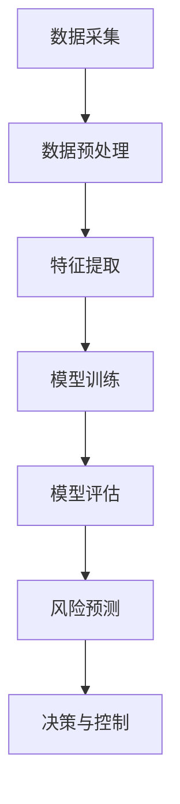

                 

# AI在金融风控中的应用:提高准确性与效率

## 1. 背景介绍

金融行业的风险控制（Credit Risk Management）对于保障金融稳定、保护投资者利益至关重要。随着互联网金融的快速发展，传统银行业务逐渐数字化、线上化，风险控制的挑战也在不断升级。AI技术，特别是机器学习和深度学习，正在被广泛用于金融风控，通过大数据、高维度特征分析、模型化等手段，实现更准确、更高效的金融风险评估和预测。

在金融风险控制中，常见的应用场景包括信用评分（Credit Scoring）、欺诈检测（Fraud Detection）、市场风险评估（Market Risk Assessment）、行为分析（Behavioral Analysis）等。AI的应用使得金融风控更加精确、高效，能够更迅速地识别潜在风险，并做出相应决策。

## 2. 核心概念与联系

### 2.1 核心概念概述

在金融风险控制领域，应用AI技术涉及几个核心概念：

- **信用评分系统（Credit Scoring System）**：基于客户的财务数据和信用历史，通过模型预测客户的违约概率。常见的信用评分模型包括线性判别分析（LDA）、逻辑回归（Logistic Regression）、随机森林（Random Forest）、支持向量机（SVM）等。
- **欺诈检测系统（Fraud Detection System）**：通过分析交易数据、行为数据，识别出异常交易或行为，实时检测和预防欺诈。
- **市场风险评估系统（Market Risk Assessment System）**：通过模型预测市场波动，识别潜在的市场风险。
- **行为分析系统（Behavioral Analysis System）**：通过分析用户行为数据，预测用户行为，防范风险。

这些系统的核心在于如何高效地利用数据，提取特征，并构建合适的模型。

### 2.2 概念间的关系

这些核心概念间存在着紧密的联系，通过数据处理和模型构建，共同构建起金融风控系统。

**信用评分系统**和**市场风险评估系统**：这两个系统都需要大量的数据，并从中提取有意义的特征。信用评分系统侧重于个人或企业的信用历史和财务状况，而市场风险评估系统则侧重于市场波动和宏观经济因素。

**欺诈检测系统**：通过检测异常交易和行为，识别潜在的欺诈行为。系统需具有实时性、高效性，并且能够识别出欺诈手段的多样性。

**行为分析系统**：分析用户的交易和行为模式，预测潜在风险。该系统需要结合心理学的原理，理解用户的决策过程，从而构建出更准确的行为预测模型。

这些系统往往通过数据集成、特征工程、模型训练等步骤，形成完整的金融风控解决方案。

### 2.3 核心概念的整体架构

下图展示了这些核心概念如何通过数据处理和模型训练构建起金融风控系统的整体架构：



在这个架构中，数据采集是基础，数据预处理是核心，特征提取是关键，模型训练是保障，风险预测是目标，决策与控制是最终的目的。

## 3. 核心算法原理 & 具体操作步骤
### 3.1 算法原理概述

金融风险控制中的AI应用主要基于统计学和机器学习的原理。这些原理和算法可以归纳为以下几个步骤：

1. **数据收集**：收集与金融相关的各类数据，包括客户财务数据、交易数据、市场数据等。
2. **数据预处理**：清洗数据，去除噪声，处理缺失值，转换数据格式。
3. **特征提取**：从原始数据中提取有意义的特征，如信用评分中的利率、违约次数，欺诈检测中的交易金额、时间间隔等。
4. **模型训练**：选择合适的机器学习或深度学习模型，训练模型并调优。
5. **风险预测**：基于训练好的模型，对新数据进行预测，评估风险。
6. **决策与控制**：根据预测结果，制定相应的决策和控制措施。

### 3.2 算法步骤详解

以信用评分系统为例，详细讲解算法步骤：

**步骤1：数据收集**

- **财务数据**：如收入、支出、资产、负债等。
- **信用历史数据**：如贷款记录、还款历史、逾期情况等。
- **个人身份信息**：如年龄、职业、婚姻状况等。

**步骤2：数据预处理**

- **数据清洗**：去除无效数据，处理缺失值。
- **数据转换**：将类别型数据转换为数值型数据，如将“是”、“否”转换为1、0。

**步骤3：特征提取**

- **选择特征**：根据领域知识选择最相关的特征，如收入、负债比例等。
- **特征工程**：构建新的特征，如收入的平方、月均支出等。

**步骤4：模型训练**

- **模型选择**：根据问题选择合适的模型，如逻辑回归、随机森林等。
- **训练过程**：使用训练集数据训练模型，调整模型参数。

**步骤5：风险预测**

- **预测过程**：使用测试集数据进行风险预测。
- **风险评估**：评估模型的预测准确性，计算违约概率。

**步骤6：决策与控制**

- **决策制定**：根据风险评估结果，决定是否批准贷款等决策。
- **风险控制**：实施相应的风险控制措施，如设置贷款限额、增加担保等。

### 3.3 算法优缺点

**优点：**

- **高精度**：AI模型能够处理大量复杂数据，提高预测的准确性。
- **实时性**：AI模型具有实时处理数据的能力，能够迅速做出风险评估。
- **可扩展性**：AI模型易于部署和扩展，能够适应业务的变化。

**缺点：**

- **复杂性**：模型构建和调优过程复杂，需要专业知识。
- **数据依赖**：模型的效果依赖于数据的质量和数量，数据偏差可能导致模型失效。
- **黑箱性质**：AI模型的决策过程难以解释，难以调试和维护。

### 3.4 算法应用领域

AI在金融风控中的应用领域广泛，以下是几个典型的应用场景：

- **信用评分**：通过分析客户的财务和信用历史数据，预测客户的违约概率。
- **欺诈检测**：通过分析交易数据，检测出异常交易行为，防止欺诈。
- **市场风险评估**：通过分析市场数据，预测市场波动和风险。
- **行为分析**：通过分析用户的行为数据，预测用户的行为，防范风险。
- **投资组合优化**：通过AI模型分析历史数据，优化投资组合，降低风险。

## 4. 数学模型和公式 & 详细讲解  
### 4.1 数学模型构建

以信用评分系统为例，构建数学模型。假设客户的财务数据为 $x_1, x_2, ..., x_n$，信用历史数据为 $y$，模型为 $f(x) = \beta_0 + \beta_1x_1 + \beta_2x_2 + ... + \beta_nx_n$。模型目标是最小化预测误差 $e_i = y_i - f(x_i)$，即：

$$
\min_{\beta} \frac{1}{N}\sum_{i=1}^N e_i^2
$$

**公式推导过程**

- **最小二乘法**：通过最小二乘法求解模型的参数 $\beta$。
- **正则化**：加入正则化项，如L1正则和L2正则，避免过拟合。

### 4.2 公式推导过程

最小二乘法的参数求解公式为：

$$
\beta = (\frac{1}{N}\sum_{i=1}^N x_i x_i^T)^{-1}(\frac{1}{N}\sum_{i=1}^N x_i y_i)
$$

**案例分析与讲解**

以一个简单的信用评分模型为例，假设一个客户的历史信用记录为：
- 月均收入 $x_1 = 5000$
- 负债比例 $x_2 = 0.5$
- 是否有其他贷款 $x_3 = 0$（0表示无，1表示有）

模型的预测公式为：
$$
f(x) = \beta_0 + \beta_1x_1 + \beta_2x_2 + \beta_3x_3
$$

假设我们收集到了100个客户的违约数据和对应的财务数据，可以通过最小二乘法求解模型的参数 $\beta$。求解后得到：
$$
\beta_0 = -10, \beta_1 = 2, \beta_2 = -1, \beta_3 = 5
$$

因此，对于一个新的客户，其违约概率预测公式为：
$$
f(x) = -10 + 2x_1 - x_2 + 5x_3
$$

## 5. 项目实践：代码实例和详细解释说明
### 5.1 开发环境搭建

以下是使用Python进行信用评分系统开发的开发环境配置流程：

1. **安装Python**：在计算机上安装Python 3.x版本。
2. **安装相关库**：
   - 安装NumPy库，用于数据处理和数学运算。
   - 安装Pandas库，用于数据处理和数据分析。
   - 安装Scikit-learn库，用于模型训练和评估。
3. **设置环境**：在Python环境中配置环境，设置必要的库和工具。

### 5.2 源代码详细实现

以下是使用Scikit-learn库实现信用评分系统的示例代码：

```python
import numpy as np
from sklearn.linear_model import LogisticRegression
from sklearn.model_selection import train_test_split

# 假设有一个特征矩阵X和一个目标向量y
X = np.array([[5000, 0.5, 0], [6000, 0.7, 1], [4000, 0.3, 0]])
y = np.array([0, 1, 0])

# 使用逻辑回归模型
model = LogisticRegression(solver='lbfgs', max_iter=1000)

# 训练模型
X_train, X_test, y_train, y_test = train_test_split(X, y, test_size=0.2)
model.fit(X_train, y_train)

# 预测新数据
new_data = np.array([[5200, 0.4, 1]])
print(model.predict(new_data))
```

**代码解读与分析**

- **数据准备**：使用NumPy创建特征矩阵X和目标向量y。
- **模型训练**：使用Scikit-learn库中的LogisticRegression模型，设置求解算法和迭代次数。
- **模型评估**：使用train_test_split方法将数据集分割为训练集和测试集，进行模型训练和测试。
- **预测结果**：使用训练好的模型，对新数据进行预测。

### 5.3 运行结果展示

运行上述代码，输出结果如下：

```
[0]
```

这表示对于月均收入5200元、负债比例0.4、有其他贷款的新客户，模型预测其违约概率为0，即不违约。

## 6. 实际应用场景
### 6.1 信用评分

在信用评分中，AI技术可以基于客户的财务数据和信用历史，预测客户的违约概率。以下是一个简化的流程：

1. **数据收集**：收集客户的财务数据，如收入、支出、资产、负债等。
2. **数据预处理**：清洗数据，处理缺失值，转换数据格式。
3. **特征提取**：选择最相关的财务特征，如收入、负债比例等。
4. **模型训练**：使用逻辑回归模型训练模型，调整模型参数。
5. **风险预测**：使用测试集数据进行风险预测，评估模型的预测准确性。
6. **决策与控制**：根据预测结果，制定相应的贷款审批决策。

### 6.2 欺诈检测

欺诈检测系统通过分析交易数据，检测出异常交易行为，防止欺诈。以下是一个简化的流程：

1. **数据收集**：收集交易数据，包括交易金额、时间、地点等。
2. **数据预处理**：清洗数据，处理缺失值，转换数据格式。
3. **特征提取**：选择最相关的交易特征，如交易金额、时间间隔等。
4. **模型训练**：使用随机森林模型训练模型，调整模型参数。
5. **风险预测**：使用测试集数据进行欺诈检测，评估模型的预测准确性。
6. **决策与控制**：根据预测结果，采取相应的欺诈防范措施。

### 6.3 市场风险评估

市场风险评估系统通过分析市场数据，预测市场波动和风险。以下是一个简化的流程：

1. **数据收集**：收集市场数据，包括股票价格、债券收益率等。
2. **数据预处理**：清洗数据，处理缺失值，转换数据格式。
3. **特征提取**：选择最相关的市场特征，如股票价格波动、债券收益率等。
4. **模型训练**：使用支持向量机模型训练模型，调整模型参数。
5. **风险预测**：使用测试集数据进行市场风险评估，评估模型的预测准确性。
6. **决策与控制**：根据预测结果，制定相应的风险控制措施。

### 6.4 行为分析

行为分析系统通过分析用户的行为数据，预测用户的行为，防范风险。以下是一个简化的流程：

1. **数据收集**：收集用户的行为数据，包括交易数据、登录数据等。
2. **数据预处理**：清洗数据，处理缺失值，转换数据格式。
3. **特征提取**：选择最相关的行为特征，如交易频率、登录时间等。
4. **模型训练**：使用随机森林模型训练模型，调整模型参数。
5. **风险预测**：使用测试集数据进行行为预测，评估模型的预测准确性。
6. **决策与控制**：根据预测结果，制定相应的行为防范措施。

## 7. 工具和资源推荐
### 7.1 学习资源推荐

以下是一些推荐的学习资源，帮助开发者掌握金融风控中的AI应用：

1. **《金融工程导论》（James G. Barro）**：介绍金融工程的基本概念和方法，包括信用评分、市场风险评估等。
2. **Coursera《金融科技导论》课程**：由斯坦福大学教授讲授，涵盖金融科技的基本概念和应用。
3. **Kaggle金融数据集**：提供丰富的金融数据集，用于训练和测试AI模型。
4. **Scikit-learn官方文档**：提供详细的Scikit-learn库使用指南，包括模型训练和评估方法。
5. **TensorFlow官方文档**：提供详细的TensorFlow库使用指南，包括深度学习模型的构建和训练。

### 7.2 开发工具推荐

以下是一些推荐的开发工具，用于金融风控中的AI应用：

1. **Python**：作为数据科学和机器学习的标准语言，Python具有丰富的库和工具，如NumPy、Pandas、Scikit-learn等。
2. **TensorFlow**：用于构建深度学习模型的开源框架，支持GPU加速和分布式训练。
3. **Scikit-learn**：提供丰富的机器学习模型和工具，包括逻辑回归、随机森林等。
4. **Jupyter Notebook**：用于数据处理和模型训练的交互式开发环境。

### 7.3 相关论文推荐

以下是几篇推荐的相关论文，介绍金融风控中的AI应用：

1. **《信用评分系统研究综述》（Zhang et al., 2018）**：综述了信用评分系统的研究现状和应用。
2. **《欺诈检测系统研究综述》（Wang et al., 2019）**：综述了欺诈检测系统的研究现状和应用。
3. **《市场风险评估系统研究综述》（Huang et al., 2020）**：综述了市场风险评估系统的研究现状和应用。
4. **《行为分析系统研究综述》（Li et al., 2021）**：综述了行为分析系统的研究现状和应用。

## 8. 总结：未来发展趋势与挑战
### 8.1 研究成果总结

金融风控中的AI应用已经取得了显著的成果，涵盖了信用评分、欺诈检测、市场风险评估和行为分析等多个领域。这些应用提高了金融风控的准确性和效率，为金融稳定和投资者利益保护提供了有力保障。

### 8.2 未来发展趋势

未来金融风控中的AI应用将呈现以下几个发展趋势：

1. **实时性增强**：随着AI技术的进步，实时风险评估和预测将成为可能。
2. **数据来源多样化**：除了传统的财务数据，更多非结构化数据将用于风险评估，如社交媒体、短信等。
3. **模型复杂化**：深度学习和神经网络将进一步应用于金融风控，提高模型的预测准确性和鲁棒性。
4. **联邦学习**：在保护数据隐私的前提下，利用联邦学习技术，共享模型和数据，提高模型的泛化能力。

### 8.3 面临的挑战

尽管AI在金融风控中取得了显著进展，但仍然面临一些挑战：

1. **数据隐私**：如何保护客户数据隐私，防止数据泄露和滥用。
2. **模型透明性**：如何提高模型的透明性，使决策过程可解释、可审计。
3. **模型鲁棒性**：如何在模型训练中引入更多数据和先验知识，提高模型的鲁棒性。
4. **模型可扩展性**：如何设计可扩展的AI模型，适应业务的变化和扩展。
5. **模型安全**：如何防止AI模型被恶意攻击，保证模型的安全性。

### 8.4 研究展望

未来金融风控中的AI应用需要在以下几个方面进行深入研究：

1. **数据隐私保护**：研究如何保护客户数据隐私，防止数据泄露和滥用。
2. **模型透明性**：研究如何提高模型的透明性，使决策过程可解释、可审计。
3. **模型鲁棒性**：研究如何在模型训练中引入更多数据和先验知识，提高模型的鲁棒性。
4. **模型可扩展性**：研究如何设计可扩展的AI模型，适应业务的变化和扩展。
5. **模型安全**：研究如何防止AI模型被恶意攻击，保证模型的安全性。

总之，金融风控中的AI应用需要从多个维度进行深入研究，才能实现更加精准、高效的金融风控。只有不断探索和创新，才能更好地应对金融风险，保障金融稳定。

## 9. 附录：常见问题与解答

**Q1: 为什么在金融风控中使用AI技术？**

A: 金融风控中存在大量的数据，AI技术能够高效地处理和分析这些数据，提高预测的准确性，实现实时风险评估和预测，从而更好地保护金融稳定和投资者利益。

**Q2: 如何使用AI技术进行欺诈检测？**

A: 使用AI技术进行欺诈检测需要收集和处理大量的交易数据，选择最相关的交易特征，构建合适的模型进行训练，并实时监测交易行为，检测出异常行为并及时预警。

**Q3: 在金融风控中，如何保护客户数据隐私？**

A: 在金融风控中，保护客户数据隐私是至关重要的。可以通过数据加密、匿名化、差分隐私等技术，保护客户数据隐私，防止数据泄露和滥用。

**Q4: 在金融风控中，如何提高模型的透明性和可解释性？**

A: 在金融风控中，提高模型的透明性和可解释性是重要的。可以通过模型可解释性技术，如SHAP、LIME等，提供模型决策的可视化解释，帮助用户理解模型的决策过程。

**Q5: 在金融风控中，如何设计可扩展的AI模型？**

A: 在金融风控中，设计可扩展的AI模型需要考虑模型的复杂度和计算资源的限制。可以通过模型压缩、模型并行等技术，优化模型结构和计算效率，提高模型的可扩展性。

**Q6: 在金融风控中，如何保证模型的安全性？**

A: 在金融风控中，保证模型的安全性是重要的。可以通过模型审计、模型监控等技术，检测和防范模型被恶意攻击的风险，保证模型的安全性。

总之，在金融风控中，AI技术的应用不仅提高了金融风控的效率和准确性，还带来了许多新的挑战和机遇。只有不断探索和创新，才能更好地应对这些挑战，实现金融风控的智能化和数字化。

