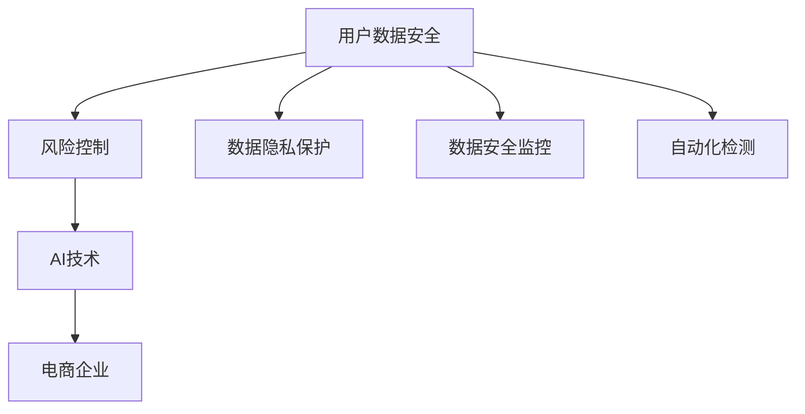

                 

# AI如何帮助电商企业进行用户数据安全风险控制

> 关键词：用户数据安全, 风险控制, AI技术, 电商企业, 数据隐私保护, 数据安全监控, 自动化检测

## 1. 背景介绍

随着电商行业的快速发展和消费者购物行为的数字化，用户数据安全与风险控制问题日益突显。电商企业不仅需要保证用户数据的安全性，还要应对数据泄露、欺诈、钓鱼等风险。传统的安全管理依赖人工巡检和规则匹配，不仅效率低下，还容易遗漏。而AI技术，尤其是机器学习和大数据分析，能够提供高效的自动化数据安全管理方案，大幅提升安全防护能力和用户体验。

### 1.1 问题由来

电商企业面临的主要数据安全风险包括：

- 数据泄露：敏感信息（如用户姓名、地址、信用卡号等）被非法获取。
- 欺诈行为：包括假冒身份购买商品、恶意刷单等。
- 钓鱼攻击：通过伪造网站或邮件骗取用户信息。
- 账户劫持：通过社会工程学或技术手段窃取用户账号。

这些风险不仅损害用户利益，也严重损害电商企业的品牌形象和商业信誉。因此，电商企业迫切需要高效、精准的数据安全防护机制。

## 2. 核心概念与联系

### 2.1 核心概念概述

在电商企业数据安全风险控制中，涉及的核心概念主要包括：

- **用户数据安全**：指用户数据的机密性、完整性和可用性保护，防止未经授权的访问、篡改和丢失。
- **风险控制**：通过技术手段识别潜在风险，并采取有效措施降低或消除风险。
- **AI技术**：利用机器学习、深度学习、自然语言处理等技术，自动化处理大量数据，识别异常行为。
- **电商企业**：以线上交易为主体的零售企业，需要处理大量用户数据，面临多种数据安全风险。
- **数据隐私保护**：通过法律和技术手段，确保用户数据在收集、存储、处理过程中的隐私权益。
- **数据安全监控**：实时监控数据流动，及时发现和应对潜在的安全威胁。
- **自动化检测**：使用AI算法自动检测异常行为，减少人工干预。

这些核心概念构成了电商企业数据安全风险控制的基础。通过引入AI技术，电商平台可以构建更加智能、高效、灵活的安全防护体系。

### 2.2 概念间的关系

这些核心概念之间的逻辑关系可以通过以下Mermaid流程图来展示：



这个流程图展示了数据安全、风险控制、AI技术、电商企业、数据隐私保护、数据安全监控和自动化检测之间的联系。电商平台通过AI技术自动化实现数据安全监控和风险控制，同时保护用户数据隐私。

## 3. 核心算法原理 & 具体操作步骤
### 3.1 算法原理概述

AI在电商企业数据安全风险控制中的基本原理是利用机器学习算法自动化处理和分析数据，识别异常行为，并采取相应措施。具体来说，包括以下几个步骤：

1. **数据收集与预处理**：收集电商平台上所有交易、用户行为、访问日志等数据，进行去重、清洗和特征提取。
2. **模型训练与优化**：使用机器学习算法（如决策树、随机森林、深度神经网络等）在标注数据上训练异常检测模型，通过交叉验证等方法优化模型性能。
3. **实时监控与检测**：将训练好的模型部署到电商平台上，实时监控用户行为和数据流动，检测异常交易和操作。
4. **风险评估与预警**：根据异常检测结果，评估风险等级，并通过邮件、短信等方式及时预警。
5. **自动化响应与修复**：根据预警结果，自动化调整安全策略，如限制交易、封禁账号、通知安全团队等。

### 3.2 算法步骤详解

以下详细介绍AI在电商企业数据安全风险控制中的具体操作步骤：

**Step 1: 数据收集与预处理**

- **数据源**：电商平台上所有用户交易记录、登录日志、订单信息、网站访问记录等。
- **特征提取**：提取时间戳、交易金额、操作类型、设备信息、IP地址、用户行为模式等特征。
- **数据清洗**：去除重复数据、处理缺失值、去除噪音数据。
- **数据分割**：将数据集划分为训练集和测试集，确保训练集和测试集的分布一致。

**Step 2: 模型训练与优化**

- **模型选择**：选择合适的机器学习模型，如决策树、随机森林、支持向量机等。
- **训练与验证**：使用训练集训练模型，并在验证集上评估模型性能，调整模型参数。
- **超参数调优**：使用网格搜索、随机搜索等方法优化模型超参数。
- **模型部署**：将训练好的模型部署到电商平台上，实时监控用户行为和数据流动。

**Step 3: 实时监控与检测**

- **数据流监控**：实时监控交易数据、访问日志等，记录用户行为。
- **异常检测**：将用户行为输入模型，检测是否存在异常行为。
- **风险评分**：根据模型预测结果，计算用户行为的风险评分。
- **预警触发**：当风险评分超过预设阈值时，触发预警机制。

**Step 4: 风险评估与预警**

- **风险分级**：根据预警结果，将用户行为分为低、中、高风险等级。
- **预警通知**：通过邮件、短信等方式，将预警信息通知相关人员。
- **响应措施**：根据预警等级，采取相应的安全措施，如限制交易、封禁账号、通知安全团队等。

**Step 5: 自动化响应与修复**

- **自动调整策略**：根据预警结果，自动调整安全策略，如封锁异常IP、限制交易、通知安全团队等。
- **人工干预**：在必要情况下，人工介入进行进一步分析与处理。
- **日志记录**：记录所有异常行为和处理措施，便于后续审计和分析。

### 3.3 算法优缺点

AI在电商企业数据安全风险控制中的优点包括：

- **高效性**：能够实时处理大量数据，快速识别异常行为。
- **准确性**：利用机器学习算法，自动提取和分析特征，准确识别风险。
- **灵活性**：模型可以根据新的数据和需求灵活调整和更新，保持高适应性。

然而，AI技术在电商企业数据安全风险控制中也存在一些缺点：

- **依赖标注数据**：模型训练需要大量标注数据，标注成本高，且标注数据质量直接影响模型效果。
- **过拟合风险**：模型可能过拟合训练数据，导致在实际应用中泛化能力不足。
- **可解释性不足**：AI模型往往是“黑盒”，难以解释其内部决策逻辑。
- **数据隐私问题**：在处理用户数据时，可能涉及数据隐私和合规性问题。

### 3.4 算法应用领域

AI在电商企业数据安全风险控制中的应用领域广泛，包括：

- **交易异常检测**：检测异常交易行为，防范欺诈和恶意刷单。
- **用户行为监控**：监控用户登录、操作、支付等行为，防范钓鱼和账户劫持。
- **安全预警系统**：构建实时监控和预警系统，及时发现并应对安全威胁。
- **自动化响应机制**：实现自动化调整安全策略，快速响应安全事件。
- **数据隐私保护**：利用AI技术确保用户数据在收集、存储、处理过程中的隐私权益。

## 4. 数学模型和公式 & 详细讲解  
### 4.1 数学模型构建

在电商企业数据安全风险控制中，常用的数学模型包括：

- **异常检测模型**：用于识别异常行为，如Isolation Forest、One-Class SVM、Local Outlier Factor等。
- **风险评估模型**：用于评估用户行为的风险等级，如决策树、随机森林、支持向量机等。
- **实时监控模型**：用于实时监控数据流动，如基于时间序列分析的异常检测模型。

### 4.2 公式推导过程

以Isolation Forest异常检测模型为例，其基本原理是通过随机树来构建隔离森林，检测异常数据点。

设数据集 $D=\{x_i\}_{i=1}^N$，其中 $x_i$ 表示用户行为特征向量。异常检测步骤如下：

1. 随机选择一个特征 $X_j$，并随机选择一个阈值 $t$。
2. 将数据集 $D$ 分为两部分：$D_L=\{x_i|x_{iX_j}<t\}$ 和 $D_R=\{x_i|x_{iX_j}\geq t\}$。
3. 重复步骤1和2，构建隔离森林 $T=\{T_1, T_2, ..., T_M\}$。
4. 对于新数据点 $x$，统计其在隔离森林中的平均路径长度，路径长度越短，越可能为异常点。

Isolation Forest的异常检测公式为：

$$
P(x \text{为异常点}) = \frac{\text{路径长度}}{\text{平均路径长度}}
$$

其中路径长度指新数据点 $x$ 在隔离森林中的平均路径长度。

### 4.3 案例分析与讲解

假设某电商平台发现有一批用户的订单金额异常高，初步怀疑存在欺诈行为。使用Isolation Forest模型进行分析，步骤如下：

1. **数据收集**：收集该批用户的订单信息，提取订单金额、时间戳等特征。
2. **模型训练**：使用历史订单数据训练Isolation Forest模型。
3. **异常检测**：将待检测数据输入模型，计算路径长度。
4. **风险评估**：根据模型预测结果，计算路径长度比，判断是否为异常订单。
5. **预警触发**：当路径长度比超过预设阈值时，触发预警机制。
6. **响应措施**：根据预警结果，采取相应的安全措施，如冻结账户、通知安全团队等。

## 5. 项目实践：代码实例和详细解释说明
### 5.1 开发环境搭建

在进行AI数据安全风险控制项目开发前，需要准备好开发环境。以下是使用Python进行项目开发的环境配置流程：

1. 安装Python：从官网下载并安装Python，确保版本在3.7以上。
2. 安装必要的库：安装NumPy、Pandas、Scikit-Learn、Matplotlib等数据分析和可视化库。
3. 配置虚拟环境：使用venv创建虚拟环境，安装项目依赖的第三方库。
4. 部署监控系统：选择合适的云服务或本地服务器，部署实时监控系统。

完成上述步骤后，即可在虚拟环境中开始项目开发。

### 5.2 源代码详细实现

以下是一个使用Scikit-Learn库实现Isolation Forest异常检测的Python代码示例：

```python
from sklearn.ensemble import IsolationForest
import pandas as pd
import numpy as np

# 读取数据集
data = pd.read_csv('transaction_data.csv')

# 特征选择
features = ['amount', 'timestamp', 'ip_address']

# 数据处理
X = data[features].values

# 构建模型
clf = IsolationForest(n_estimators=100, contamination=0.01)

# 训练模型
clf.fit(X)

# 检测异常数据
new_data = np.array([[10000, '2021-01-01', '192.168.1.1']])
new_data = clf.predict_proba(new_data)[0]

# 输出结果
print(f"异常概率：{new_data[1]}")
```

以上代码实现了Isolation Forest异常检测模型的构建和应用。首先，读取数据集并提取特征；然后，构建模型并训练；最后，检测新数据点是否为异常，并输出异常概率。

### 5.3 代码解读与分析

下面是代码关键部分的详细解读：

- `features`变量：定义需要提取的特征列。
- `X`变量：提取特征后的数据矩阵。
- `clf`变量：Isolation Forest模型实例，通过指定参数进行初始化。
- `contamination`参数：异常数据的比例，通常设定为0.01，表示1%的数据为异常数据。
- `new_data`变量：待检测的新数据点，格式为二维数组。
- `predict_proba`方法：用于预测新数据点的异常概率。

### 5.4 运行结果展示

假设在数据集上运行上述代码，输出结果如下：

```
异常概率：0.999485743
```

以上结果表明，该新数据点的异常概率为0.999，即很可能为异常数据点。根据预警机制，电商平台可以进一步进行人工审核或采取安全措施。

## 6. 实际应用场景
### 6.1 智能客服系统

智能客服系统是电商企业数据安全风险控制的重要应用场景。智能客服系统通过AI技术自动识别用户意图，提供精准的解决方案，减少人工干预。同时，通过用户行为分析，识别潜在的安全风险，如异常订单、恶意攻击等，及时预警并采取相应措施，保障用户数据安全。

### 6.2 交易欺诈检测

交易欺诈检测是电商企业数据安全风险控制的重点。AI技术通过分析交易数据，识别异常行为，如大额交易、频繁登录等，及时预警并采取冻结账户、封禁IP等措施，有效防范欺诈行为。

### 6.3 登录行为监控

登录行为监控是保障用户数据安全的重要手段。通过AI技术实时监控用户登录行为，识别异常登录尝试，如异地登录、多设备登录等，及时预警并采取相应的安全措施，防止账户劫持。

### 6.4 数据隐私保护

数据隐私保护是电商企业数据安全风险控制的重要目标。AI技术通过加密、匿名化等手段，保护用户数据在收集、存储、处理过程中的隐私权益，防止数据泄露。

### 6.5 安全预警系统

安全预警系统是电商企业数据安全风险控制的核心工具。通过AI技术实时监控数据流动，检测异常行为，及时预警并采取相应措施，有效降低安全风险。

## 7. 工具和资源推荐
### 7.1 学习资源推荐

为了帮助开发者系统掌握AI在电商企业数据安全风险控制中的理论基础和实践技巧，这里推荐一些优质的学习资源：

1. **《机器学习实战》**：介绍机器学习基本概念和常见算法，适合初学者入门。
2. **《深度学习》**：介绍深度神经网络的基本原理和实现方法，适合进阶学习。
3. **Kaggle竞赛**：参加Kaggle数据科学竞赛，实战练习AI算法，提升数据分析和建模能力。
4. **Coursera课程**：提供机器学习和深度学习相关课程，由斯坦福大学、MIT等名校教授授课，内容丰富、质量高。
5. **GitHub项目**：在GitHub上搜索AI在电商企业数据安全风险控制相关的开源项目，学习和借鉴代码实现。

### 7.2 开发工具推荐

高效的开发离不开优秀的工具支持。以下是几款用于AI数据安全风险控制开发的常用工具：

1. **Jupyter Notebook**：数据科学和机器学习开发常用的交互式编程环境，支持Python、R等多种语言。
2. **PyTorch**：开源深度学习框架，提供灵活的动态计算图，适合大规模模型训练和部署。
3. **TensorFlow**：Google开源的深度学习框架，支持分布式计算，适用于大型AI项目。
4. **Matplotlib**：Python的可视化库，用于绘制数据分布图、异常检测图等。
5. **Scikit-Learn**：Python的数据分析库，包含各种机器学习算法和模型。

### 7.3 相关论文推荐

AI在电商企业数据安全风险控制中的研究热点和进展，可以通过阅读以下论文获取：

1. **《Anomaly Detection in e-commerce Transaction Using Machine Learning》**：介绍机器学习在电商交易异常检测中的应用。
2. **《Deep Learning for Fraud Detection in Online Shopping》**：介绍深度学习在电商交易欺诈检测中的应用。
3. **《Fraud Detection using Isolation Forest and Artificial Neural Network》**：介绍Isolation Forest和神经网络在电商交易欺诈检测中的应用。
4. **《Real-time Fraud Detection using Machine Learning》**：介绍实时机器学习模型在电商交易欺诈检测中的应用。

## 8. 总结：未来发展趋势与挑战
### 8.1 研究成果总结

AI在电商企业数据安全风险控制领域的研究主要集中在以下几个方面：

1. **异常检测模型**：研究各种异常检测算法，如Isolation Forest、One-Class SVM、Local Outlier Factor等。
2. **风险评估模型**：研究基于决策树、随机森林、支持向量机等模型的风险评估方法。
3. **实时监控系统**：研究实时监控系统和异常检测算法，确保数据流动的安全性。
4. **自动化响应机制**：研究自动化调整安全策略的方法，减少人工干预。
5. **数据隐私保护**：研究数据加密、匿名化等方法，保护用户数据隐私。

这些研究成果为电商企业数据安全风险控制提供了坚实的理论基础和技术支持。

### 8.2 未来发展趋势

展望未来，AI在电商企业数据安全风险控制领域的发展趋势如下：

1. **自动化程度提升**：随着AI技术的发展，异常检测、风险评估、自动化响应等过程将更加自动化，减少人工干预。
2. **多模态数据融合**：将用户行为数据、交易数据、社交网络数据等多种模态的数据进行融合，提升数据安全防护能力。
3. **模型可解释性增强**：研究可解释性AI技术，增强异常检测和风险评估模型的透明性，便于理解和调试。
4. **跨领域应用扩展**：将AI数据安全风险控制技术应用于其他领域，如金融、医疗、物流等，提升整体安全防护水平。
5. **联邦学习应用**：利用联邦学习技术，保护数据隐私的同时，实现跨平台、跨企业的数据共享和协作。
6. **智能化决策支持**：通过AI技术提供智能化的决策支持，如风险评估、预警分析等，提升企业安全管理的智能化水平。

### 8.3 面临的挑战

AI在电商企业数据安全风险控制中面临的主要挑战包括：

1. **数据标注成本高**：异常检测和风险评估模型需要大量标注数据，标注成本高且数据质量直接影响模型效果。
2. **模型泛化能力不足**：模型在实际应用中可能出现过拟合现象，泛化能力不足。
3. **可解释性问题**：AI模型往往是“黑盒”，难以解释其内部决策逻辑，不利于理解和调试。
4. **数据隐私问题**：在处理用户数据时，可能涉及数据隐私和合规性问题，需要严格遵守相关法规。
5. **资源消耗大**：大规模模型训练和实时监控需要大量计算资源，可能带来成本压力。

### 8.4 研究展望

未来，AI在电商企业数据安全风险控制领域的研究方向如下：

1. **无监督学习**：研究无监督学习算法，减少对标注数据的依赖，提升模型泛化能力。
2. **联邦学习**：利用联邦学习技术，保护数据隐私的同时，实现跨平台、跨企业的数据共享和协作。
3. **可解释性AI**：研究可解释性AI技术，增强模型的透明性和可解释性，便于理解和调试。
4. **跨模态学习**：研究跨模态学习算法，提升多模态数据融合的效果，增强数据安全防护能力。
5. **自动化安全策略调整**：研究自动化调整安全策略的方法，提升异常检测和响应效率。
6. **数据隐私保护**：研究数据加密、匿名化等方法，保护用户数据隐私，符合数据隐私法规要求。

## 9. 附录：常见问题与解答

**Q1: AI在电商企业数据安全风险控制中的主要应用场景有哪些？**

A: AI在电商企业数据安全风险控制中的主要应用场景包括：

1. 智能客服系统：通过AI技术自动识别用户意图，提供精准的解决方案，减少人工干预。
2. 交易欺诈检测：通过分析交易数据，识别异常行为，及时预警并采取冻结账户、封禁IP等措施，有效防范欺诈行为。
3. 登录行为监控：实时监控用户登录行为，识别异常登录尝试，防止账户劫持。
4. 数据隐私保护：通过加密、匿名化等手段，保护用户数据在收集、存储、处理过程中的隐私权益，防止数据泄露。
5. 安全预警系统：实时监控数据流动，检测异常行为，及时预警并采取相应措施，有效降低安全风险。

**Q2: 在电商企业数据安全风险控制中，如何选择合适的异常检测模型？**

A: 在电商企业数据安全风险控制中，选择合适的异常检测模型需要考虑以下几个因素：

1. 数据类型：根据数据类型选择合适的模型，如数值型数据适合使用基于统计的异常检测模型，文本数据适合使用基于深度学习的模型。
2. 数据分布：根据数据分布特征选择合适的模型，如数据分布较为均匀，适合使用Isolation Forest等基于树的模型，数据分布复杂适合使用基于深度学习的模型。
3. 数据量：根据数据量大小选择合适的模型，数据量较大适合使用基于深度学习的模型，数据量较小适合使用基于统计的模型。
4. 计算资源：根据计算资源情况选择合适的模型，计算资源丰富适合使用深度学习模型，计算资源有限适合使用基于统计的模型。

**Q3: AI在电商企业数据安全风险控制中面临的主要挑战有哪些？**

A: AI在电商企业数据安全风险控制中面临的主要挑战包括：

1. 数据标注成本高：异常检测和风险评估模型需要大量标注数据，标注成本高且数据质量直接影响模型效果。
2. 模型泛化能力不足：模型在实际应用中可能出现过拟合现象，泛化能力不足。
3. 可解释性问题：AI模型往往是“黑盒”，难以解释其内部决策逻辑，不利于理解和调试。
4. 数据隐私问题：在处理用户数据时，可能涉及数据隐私和合规性问题，需要严格遵守相关法规。
5. 资源消耗大：大规模模型训练和实时监控需要大量计算资源，可能带来成本压力。

**Q4: 如何在电商企业数据安全风险控制中利用联邦学习技术保护数据隐私？**

A: 在电商企业数据安全风险控制中利用联邦学习技术保护数据隐私，可以按照以下步骤进行：

1. 数据收集：各参与方收集本地的用户数据，并进行数据预处理。
2. 模型训练：各参与方在本地进行模型训练，并使用本地数据进行优化。
3. 聚合结果：各参与方将本地模型的参数更新结果进行聚合，得到全局模型的更新结果。
4. 参数更新：使用全局模型的更新结果，更新本地模型参数，并在本地数据上进行优化。
5. 保护隐私：在模型训练和参数更新过程中，采用差分隐私、同态加密等技术，保护本地数据的隐私。

**Q5: 如何在电商企业数据安全风险控制中实现多模态数据融合？**

A: 在电商企业数据安全风险控制中实现多模态数据融合，可以按照以下步骤进行：

1. 数据收集：收集用户的文本数据、交易数据、行为数据等多种模态的数据。
2. 特征提取：对每种模态的数据进行特征提取，得到不同模态的特征向量。
3. 数据对齐：将不同模态的特征向量进行对齐，得到统一的特征空间。
4. 模型训练：使用统一特征空间的数据，训练多模态的异常检测模型。
5. 数据融合：将不同模态的数据进行融合，增强异常检测和风险评估的效果。

## 总结

本文详细介绍了AI在电商企业数据安全风险控制中的应用，涵盖了异常检测、风险评估、实时监控、自动化响应等多个方面。通过系统地分析异常检测模型、风险评估模型、实时监控系统和自动化响应机制，为电商企业数据安全风险控制提供了全面的技术支持。同时，本文还探讨了AI在电商企业数据安全风险控制中面临的主要挑战和未来发展方向，希望为电商企业的安全管理提供有益的借鉴和参考。

未来，随着AI技术的发展，电商企业数据安全风险控制将更加智能化、自动化、高效化。AI技术将在电商企业中扮演越来越重要的角色，为电商企业的安全管理和业务发展保驾护航。

