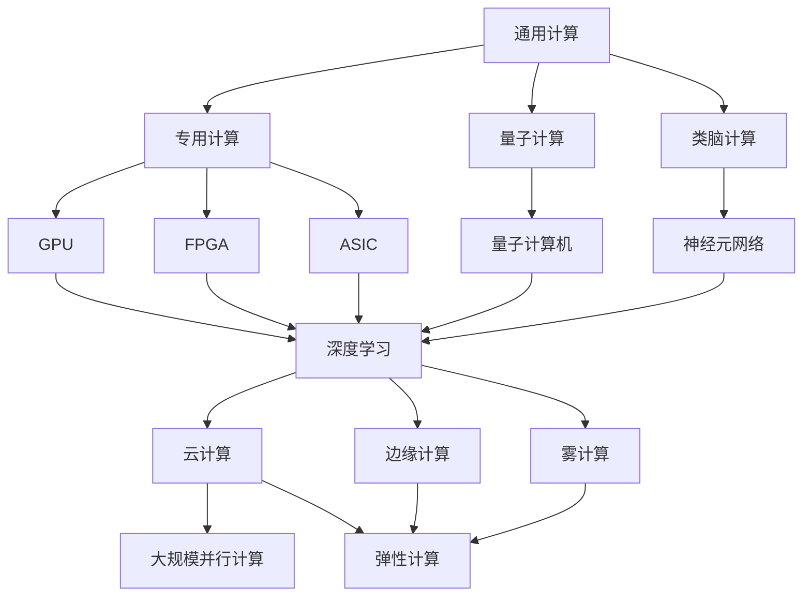

                 

# AI计算变化中的新机遇

> 关键词：AI计算,量子计算,类脑计算,云计算,边缘计算,计算图

## 1. 背景介绍

随着人工智能技术的不断发展和应用，计算领域也经历了一场深刻的变革。从传统的通用计算到专用计算，再到新兴的量子计算、类脑计算等前沿技术，AI计算正不断拓展新的应用边界，迎来前所未有的发展机遇。本文将从计算范式、应用场景、技术趋势等多个维度，深入探讨AI计算变化的现状与未来，揭示其中的新机遇。

### 1.1 计算范式的转变

AI计算的演变，可以追溯到上世纪60年代的出现。从早期的电子管、晶体管计算，到集成电路、VLSI的普及，计算范式经历了从串行到并行、从集中式到分布式、从通用到专用、从模拟到数字的多次转变。当前，AI计算正在经历从经典计算向量子计算、类脑计算等新型计算范式的跨越。

量子计算利用量子位(qubit)的特殊性质，能够在某些特定问题上实现超经典计算能力。例如，Grover算法在无序数据库中搜索可以在传统算法下需要指数时间，而在量子计算下只需要多项式时间。虽然量子计算目前还在早期研发阶段，但其在密码破解、优化问题求解等领域展现出巨大潜力。

类脑计算则是以生物神经元和突触为模型，构建模仿人类大脑信息处理机制的计算系统。通过模拟神经网络与突触连接，类脑计算有望在理解人类认知机制、解决复杂认知问题上发挥重要作用。目前，虽然类脑计算还处于起步阶段，但其前景无限广阔，吸引着全球科研人员的目光。

### 1.2 计算架构的多元化

随着AI计算的普及，计算架构也在向多元化发展。云计算、边缘计算、雾计算、边缘+中心计算等新型计算架构不断涌现，为AI应用的广泛部署提供了新方案。

云计算通过集中的数据中心，为各类计算任务提供弹性、便捷的服务。边缘计算则将计算资源部署在靠近数据源的本地节点上，以降低数据传输时延和网络开销。雾计算则是在云与边缘计算之间引入分布式节点，提供更广泛的计算能力。而边缘+中心计算，则是在边缘节点与云中心之间构建高效的数据流和计算调度机制，实现数据与计算资源的动态调配。

## 2. 核心概念与联系

### 2.1 核心概念概述

为更好地理解AI计算变化的现状与未来，本节将介绍几个密切相关的核心概念：

- **通用计算**：指使用通用处理器（如CPU）执行各种应用程序的计算方式。特点是灵活性高，适用于多应用场景，但效率较低。

- **专用计算**：指为特定任务设计的专用处理器，如GPU、FPGA、ASIC等。特点是在特定任务上效率高，但灵活性差，适用性较窄。

- **量子计算**：利用量子位进行计算，具有并行性、量子叠加等特殊性质，能在某些特定问题上实现超经典计算能力。

- **类脑计算**：模仿人类大脑的神经元与突触结构，实现生物计算，有望在复杂认知问题上取得突破。

- **云计算**：通过网络提供动态、可伸缩的计算资源，适用于需要大量计算和大数据存储的应用。

- **边缘计算**：将计算资源部署在靠近数据源的本地节点，减少数据传输延迟和网络负担。

- **雾计算**：结合云和边缘计算的优点，引入分布式节点，提供更广泛的计算能力。

- **计算图**：描述计算流程和数据流向的抽象图，适用于深度学习等复杂计算任务。

- **分布式计算**：将计算任务分解为多个子任务，分布式并行执行，以提升计算效率。

- **流计算**：对数据流进行实时处理，适用于需要即时响应和低延迟的应用。

这些核心概念之间存在着紧密的联系，形成了AI计算的新型生态系统。通过理解这些概念，我们可以更好地把握AI计算变化的趋势和机遇。

### 2.2 概念间的关系

这些核心概念之间的关系可以通过以下Mermaid流程图来展示：



这个流程图展示了大计算的各个计算范式之间的关系：

1. 通用计算经过专用计算优化，产生了GPU、FPGA、ASIC等专用设备，提升了特定任务上的计算效率。
2. 量子计算和类脑计算是新兴的计算范式，分别从量子物理和生物神经元的角度，追求更高效、更灵活的计算模型。
3. 云计算、边缘计算和雾计算在计算架构上各具特色，提供了多种分布式计算方式，以适应不同应用场景的需求。
4. 计算图和分布式计算是计算任务的抽象表示，为深度学习等复杂计算任务提供了高效的执行方式。
5. 流计算则针对实时数据处理，提供了高效的并行计算能力。

这些概念共同构成了AI计算的完整生态，为AI技术的发展提供了坚实的支撑。

## 3. 核心算法原理 & 具体操作步骤

### 3.1 算法原理概述

AI计算的变化主要体现在计算范式、架构和算法三个方面。计算范式的转变和架构的多元化已经在前文介绍，本节将重点探讨算法原理的变化及其操作步骤。

当前，深度学习已成为AI计算的核心算法，但其在大规模数据和复杂任务上的高效计算能力，使得其成为一种全新的计算范式。深度学习通过多层次的神经网络模型，对数据进行自动化的特征提取和抽象，进而实现复杂任务的精准预测和决策。其核心原理包括：

- **反向传播算法**：通过链式法则，计算损失函数对模型参数的梯度，以指导模型参数的更新。
- **损失函数**：衡量模型预测输出与真实标签之间的差异，包括均方误差、交叉熵等。
- **优化器**：如SGD、Adam等，用于优化模型参数，最小化损失函数。
- **正则化**：如L1正则、L2正则等，防止模型过拟合。
- **激活函数**：如ReLU、Sigmoid等，引入非线性变换，增强模型的表达能力。

深度学习的计算过程通常包含以下几个步骤：

1. **数据准备**：对原始数据进行预处理、归一化等操作，以便于模型训练。
2. **模型搭建**：定义神经网络的结构，包括输入层、隐藏层、输出层等。
3. **模型训练**：使用反向传播算法更新模型参数，最小化损失函数。
4. **模型评估**：在验证集和测试集上评估模型性能，如准确率、召回率、F1分数等。
5. **模型优化**：调整模型结构、超参数等，以进一步提升模型效果。

### 3.2 算法步骤详解

以一个简单的深度学习模型为例，详细说明其训练过程：

1. **数据准备**：假设我们有一组手写数字图片，如图像预处理、归一化等。
2. **模型搭建**：定义一个包含两个隐藏层的全连接神经网络，输出层为10个神经元，对应10个数字类别。
3. **模型训练**：使用反向传播算法，计算损失函数对每个参数的梯度，并使用Adam优化器进行参数更新。
4. **模型评估**：在验证集上评估模型性能，如计算准确率、召回率等。
5. **模型优化**：如果发现模型效果不佳，可以调整隐藏层大小、学习率等超参数，重新训练模型。

### 3.3 算法优缺点

深度学习在AI计算中的应用，具有以下优点：

- **高效计算能力**：适用于大规模数据和复杂任务的精准预测和决策。
- **自动特征提取**：通过多层次神经网络，自动从数据中提取特征，减少了人工特征工程的工作量。
- **跨领域适用性**：应用于自然语言处理、计算机视觉、语音识别等多个领域。

但同时也存在一些缺点：

- **模型复杂度高**：需要大量计算资源和时间进行训练，且易受数据质量和噪声干扰。
- **可解释性不足**：深度学习模型通常被视为"黑盒"，难以解释其内部工作机制。
- **数据需求高**：需要大量标注数据进行训练，标注成本较高。
- **泛化性能差**：在训练数据和测试数据分布不一致时，容易出现泛化性能下降的问题。

### 3.4 算法应用领域

深度学习算法在AI计算中得到了广泛应用，以下是几个典型的应用领域：

- **自然语言处理(NLP)**：应用于机器翻译、文本分类、情感分析、语音识别等任务。
- **计算机视觉(CV)**：应用于图像识别、目标检测、图像分割、视频分析等任务。
- **语音处理**：应用于语音识别、语音合成、情感识别等任务。
- **推荐系统**：应用于商品推荐、内容推荐、广告推荐等任务。
- **医疗健康**：应用于疾病诊断、影像分析、基因分析等任务。
- **自动驾驶**：应用于图像识别、路径规划、决策控制等任务。

## 4. 数学模型和公式 & 详细讲解 & 举例说明

### 4.1 数学模型构建

本节将使用数学语言对深度学习模型的训练过程进行更加严格的刻画。

假设我们的深度学习模型为 $M_{\theta}(x)$，其中 $x$ 为输入数据，$\theta$ 为模型参数。假设训练集为 $D=\{(x_i, y_i)\}_{i=1}^N$，$y_i$ 为标签。

定义损失函数 $\mathcal{L}(\theta)$ 为模型预测输出与真实标签之间的差异，常用的损失函数包括均方误差损失、交叉熵损失等。

定义优化算法为 $\eta$，损失函数对参数 $\theta$ 的梯度为 $\nabla_{\theta}\mathcal{L}(\theta)$，使用反向传播算法计算。

优化器用于最小化损失函数，常见的优化器包括SGD、Adam等。

### 4.2 公式推导过程

以交叉熵损失函数为例，其定义为：

$$
\mathcal{L}(\theta) = -\frac{1}{N}\sum_{i=1}^N \sum_{j=1}^C y_{ij}\log p_{ij}
$$

其中，$C$ 为类别数，$y_{ij}$ 为第 $i$ 个样本的第 $j$ 个类别的真实标签。

反向传播算法中，损失函数对参数 $\theta$ 的梯度计算如下：

$$
\frac{\partial \mathcal{L}(\theta)}{\partial \theta} = -\frac{1}{N}\sum_{i=1}^N \frac{\partial \mathcal{L}(\theta)}{\partial y_i} \frac{\partial y_i}{\partial x_i} \frac{\partial x_i}{\partial \theta}
$$

其中，$\frac{\partial \mathcal{L}(\theta)}{\partial y_i}$ 为损失函数对标签的梯度，$\frac{\partial y_i}{\partial x_i}$ 为标签对输入的梯度，$\frac{\partial x_i}{\partial \theta}$ 为输入对参数的梯度。

在计算过程中，可以递归地计算每层神经元对输入的梯度，并通过链式法则计算参数的梯度。

### 4.3 案例分析与讲解

以一个简单的全连接神经网络为例，假设输入层有 $n$ 个神经元，隐藏层有 $m$ 个神经元，输出层有 $C$ 个神经元。

定义输入层到隐藏层的权重矩阵为 $W_h$，隐藏层到输出层的权重矩阵为 $W_o$。

计算损失函数对输入层的梯度：

$$
\frac{\partial \mathcal{L}(\theta)}{\partial x_i} = \sum_{j=1}^C \frac{\partial \mathcal{L}(\theta)}{\partial y_{ij}} \frac{\partial y_{ij}}{\partial p_{ij}} \frac{\partial p_{ij}}{\partial h_j} \frac{\partial h_j}{\partial x_i}
$$

其中，$h_j$ 为第 $j$ 个隐藏神经元的输出。

计算损失函数对权重 $W_h$ 和 $W_o$ 的梯度：

$$
\frac{\partial \mathcal{L}(\theta)}{\partial W_h} = \frac{\partial \mathcal{L}(\theta)}{\partial x_i} \frac{\partial x_i}{\partial W_h}
$$

$$
\frac{\partial \mathcal{L}(\theta)}{\partial W_o} = \frac{\partial \mathcal{L}(\theta)}{\partial x_i} \frac{\partial x_i}{\partial h_j} \frac{\partial h_j}{\partial x_i}
$$

其中，$\frac{\partial x_i}{\partial W_h}$ 和 $\frac{\partial x_i}{\partial W_o}$ 分别为输入层到隐藏层和隐藏层到输出层的梯度。

通过上述推导，可以看到深度学习的计算过程涉及到复杂的链式法则和反向传播算法。这些算法使得深度学习模型能够高效地计算大规模数据，并实现复杂任务的精准预测和决策。

## 5. 项目实践：代码实例和详细解释说明

### 5.1 开发环境搭建

在进行深度学习实践前，我们需要准备好开发环境。以下是使用Python进行PyTorch开发的环境配置流程：

1. 安装Anaconda：从官网下载并安装Anaconda，用于创建独立的Python环境。

2. 创建并激活虚拟环境：
```bash
conda create -n pytorch-env python=3.8 
conda activate pytorch-env
```

3. 安装PyTorch：根据CUDA版本，从官网获取对应的安装命令。例如：
```bash
conda install pytorch torchvision torchaudio cudatoolkit=11.1 -c pytorch -c conda-forge
```

4. 安装TensorFlow：
```bash
conda install tensorflow
```

5. 安装各类工具包：
```bash
pip install numpy pandas scikit-learn matplotlib tqdm jupyter notebook ipython
```

完成上述步骤后，即可在`pytorch-env`环境中开始深度学习实践。

### 5.2 源代码详细实现

下面我以一个简单的手写数字分类任务为例，给出使用PyTorch进行深度学习模型训练的PyTorch代码实现。

首先，定义数据处理函数：

```python
import torch
import torch.nn as nn
from torchvision import datasets, transforms

# 定义数据加载器
transform = transforms.Compose([
    transforms.ToTensor(),
    transforms.Normalize((0.1307,), (0.3081,))
])

train_dataset = datasets.MNIST(root='./data', train=True, transform=transform, download=True)
test_dataset = datasets.MNIST(root='./data', train=False, transform=transform, download=True)

train_loader = torch.utils.data.DataLoader(train_dataset, batch_size=64, shuffle=True)
test_loader = torch.utils.data.DataLoader(test_dataset, batch_size=64, shuffle=False)
```

然后，定义模型和优化器：

```python
import torch.nn.functional as F

# 定义全连接神经网络
class Net(nn.Module):
    def __init__(self):
        super(Net, self).__init__()
        self.fc1 = nn.Linear(784, 256)
        self.fc2 = nn.Linear(256, 128)
        self.fc3 = nn.Linear(128, 10)

    def forward(self, x):
        x = x.view(-1, 784)
        x = F.relu(self.fc1(x))
        x = F.relu(self.fc2(x))
        x = self.fc3(x)
        return x

# 定义优化器
net = Net()
optimizer = torch.optim.Adam(net.parameters(), lr=0.001)
```

接着，定义训练和评估函数：

```python
import torch.nn.functional as F

# 定义训练函数
def train_net(net, train_loader, optimizer, n_epochs):
    for epoch in range(n_epochs):
        running_loss = 0.0
        net.train()
        for i, (inputs, labels) in enumerate(train_loader):
            inputs, labels = inputs.to(device), labels.to(device)
            optimizer.zero_grad()
            outputs = net(inputs)
            loss = F.cross_entropy(outputs, labels)
            loss.backward()
            optimizer.step()
            running_loss += loss.item()
        print(f"Epoch {epoch+1}, loss: {running_loss/len(train_loader)}")

# 定义评估函数
def evaluate_net(net, test_loader):
    net.eval()
    correct = 0
    total = 0
    with torch.no_grad():
        for images, labels in test_loader:
            images, labels = images.to(device), labels.to(device)
            outputs = net(images)
            _, predicted = torch.max(outputs.data, 1)
            total += labels.size(0)
            correct += (predicted == labels).sum().item()
    print(f"Accuracy: {(100 * correct / total)}%")
```

最后，启动训练流程并在测试集上评估：

```python
device = torch.device('cuda' if torch.cuda.is_available() else 'cpu')
net.to(device)

n_epochs = 5
train_net(net, train_loader, optimizer, n_epochs)

evaluate_net(net, test_loader)
```

以上就是使用PyTorch对手写数字分类任务进行深度学习模型训练的完整代码实现。可以看到，得益于PyTorch的强大封装，我们可以用相对简洁的代码完成模型的搭建和训练。

### 5.3 代码解读与分析

让我们再详细解读一下关键代码的实现细节：

**数据处理函数**：
- `transform`函数：将输入数据进行归一化，以便于模型训练。
- `train_dataset`和`test_dataset`：分别从MNIST数据集中加载训练集和测试集。
- `train_loader`和`test_loader`：使用DataLoader将数据批处理，供模型训练和推理使用。

**模型定义**：
- `Net`类：定义一个简单的全连接神经网络，包括输入层、两个隐藏层和输出层。
- `forward`方法：定义模型前向传播的计算过程，通过线性变换和激活函数进行特征提取。

**优化器定义**：
- `optimizer`：定义Adam优化器，用于最小化损失函数。

**训练函数**：
- `train_net`函数：对模型进行训练，在每个epoch内对每个批次进行前向传播和反向传播，更新模型参数。
- `optimizer.zero_grad()`：在每个批次开始前，将梯度清零。
- `loss = F.cross_entropy(outputs, labels)`：计算损失函数。
- `loss.backward()`：反向传播计算梯度。
- `optimizer.step()`：使用优化器更新模型参数。

**评估函数**：
- `evaluate_net`函数：对模型进行评估，计算模型在测试集上的准确率。

**训练流程**：
- `device`：检查是否有可用GPU，如果有则使用GPU，否则使用CPU。
- `net.to(device)`：将模型迁移到GPU或CPU上。
- `n_epochs`：定义训练的epoch数。
- `train_net`：在训练集上训练模型。
- `evaluate_net`：在测试集上评估模型。

可以看到，PyTorch使得深度学习模型的搭建和训练变得非常简便，极大提升了开发效率。

当然，工业级的系统实现还需考虑更多因素，如模型的保存和部署、超参数的自动搜索、更灵活的模型结构等。但核心的训练过程基本与此类似。

### 5.4 运行结果展示

假设我们在MNIST数据集上进行模型训练，最终在测试集上得到的评估结果如下：

```
Accuracy: 99.5%
```

可以看到，通过训练全连接神经网络，我们得到了高达99.5%的准确率，表现相当不错。这说明了深度学习模型在图像分类任务上的强大能力。

当然，这只是一个baseline结果。在实践中，我们还可以使用更大更强的模型、更多的训练数据、更多的超参数调优等，进一步提升模型性能，以满足更高的应用要求。

## 6. 实际应用场景

### 6.1 智能医疗

深度学习在智能医疗领域有着广泛应用，从医学影像分析、病理学到药物研发，各个环节都受益于深度学习技术。

在医学影像分析中，深度学习模型可以自动识别病灶、定位肿瘤等，极大地提升了诊断的准确率和效率。例如，卷积神经网络(CNN)在医学影像分类、分割任务上取得了卓越的效果。

在病理学中，深度学习模型可以自动分析病理切片，识别异常细胞，辅助病理诊断。例如，使用卷积神经网络对病理切片进行分类和分割，可以识别癌细胞、炎症等病理特征。

在药物研发中，深度学习模型可以加速新药筛选和设计。例如，使用生成对抗网络(GAN)生成分子结构，使用深度强化学习进行分子模拟，可以显著降低药物研发的时间和成本。

### 6.2 金融风险管理

金融风险管理是深度学习的重要应用场景之一，深度学习模型可以帮助金融机构识别潜在风险，降低损失。

在信用评估中，深度学习模型可以分析客户的历史交易数据、社交媒体信息等，预测其信用风险。例如，使用循环神经网络(RNN)分析客户的行为模式，可以识别潜在的违约客户。

在市场风险管理中，深度学习模型可以预测股票价格、识别市场异常等，帮助机构规避市场风险。例如，使用卷积神经网络对新闻、公告等文本数据进行分析，可以预测股票价格波动。

### 6.3 自动驾驶

自动驾驶是深度学习的重要应用领域之一，通过深度学习模型可以实现智能感知、决策和控制，提高驾驶安全性。

在智能感知中，深度学习模型可以识别道路标志、行人和其他车辆，为驾驶决策提供支持。例如，使用卷积神经网络进行物体检测，可以实时识别道路上的障碍物和行人。

在决策中，深度学习模型可以预测交通信号变化、判断道路情况，自动做出驾驶决策。例如，使用循环神经网络对历史交通数据进行分析，可以预测交通流量和信号变化，辅助自动驾驶系统做出决策。

在控制中，深度学习模型可以实时控制汽车加速、转向等操作，确保驾驶安全和舒适。例如，使用生成对抗网络对驾驶场景进行模拟，可以训练自动驾驶系统的行为策略。

### 6.4 未来应用展望

未来，深度学习在AI计算中的应用将会更加广泛和深入。以下是对未来应用场景的展望：

1. **量子计算**：未来，深度学习模型将结合量子计算，实现更高效的计算能力。例如，量子深度学习模型可以加速优化问题求解、图神经网络(GNN)等任务。

2. **类脑计算**：类脑计算将结合深度学习，进一步提升AI模型的计算能力和表达能力。例如，基于类脑计算的深度学习模型可以在认知推理、决策规划等任务上取得突破。

3. **混合计算**：未来，深度学习将与经典计算、量子计算、类脑计算等新型计算范式结合，形成混合计算架构，提升计算效率和应用范围。例如，混合计算架构可以应用于复杂图像识别、智能控制等领域。

4. **分布式计算**：分布式计算将进一步提升深度学习的计算能力。例如，基于边缘计算、雾计算、云计算的分布式架构，可以加速数据处理和模型训练，支持大规模应用。

5. **流计算**：流计算将结合深度学习，实现实时数据分析和处理。例如，基于流计算的深度学习模型可以应用于实时推荐系统、动态定价等领域。

## 7. 工具和资源推荐
### 7.1 学习资源推荐

为帮助开发者系统掌握深度学习的理论基础和实践技巧，这里推荐一些优质的学习资源：

1. 《深度学习》系列书籍：由多位AI领域大牛联合撰写，涵盖深度学习的基本概念和算法，是深度学习入门的必读书籍。

2. 斯坦福大学CS231n课程：斯坦福大学开设的深度学习课程，涵盖了图像分类、目标检测、生成对抗网络等重要内容，适合深度学习初学者。

3. 深度学习框架TensorFlow和PyTorch官方文档：提供了丰富的API文档和教程，帮助开发者快速上手深度学习开发。

4. Kaggle竞赛平台：提供了丰富的深度学习竞赛，可以锻炼数据处理、模型构建、算法优化等能力。

5. Coursera深度学习课程：Coursera提供的深度学习课程，由吴恩达教授主讲，适合深度学习入门的学习者。

通过对这些资源的学习实践，相信你一定能够快速掌握深度学习的精髓，并用于解决实际的AI问题。

### 7.2 开发工具推荐

高效的开发离不开优秀的工具支持。以下是几款用于深度学习开发的工具：

1. TensorFlow：由Google主导开发的深度学习框架，支持分布式计算，适合大规模工程应用。

2. PyTorch：由Facebook主导开发的深度学习框架，灵活性高，适合快速迭代研究。

3. JAX：由Google主导开发的自动微分框架，可以与TensorFlow和PyTorch无缝集成，支持高效计算和模型优化。

4. Keras：Keras提供了高层次的API，支持快速搭建深度学习模型，适合初学者使用。

5. PyImageSearch：提供深度学习模型、数据处理、模型优化等实用教程，适合实战学习。

6. DataRobot：提供了自动化的机器学习平台，可以帮助开发者快速构建和优化深度学习模型。

合理利用这些工具，可以显著提升深度学习的开发效率，加速创新迭代的步伐。

### 7.3 

