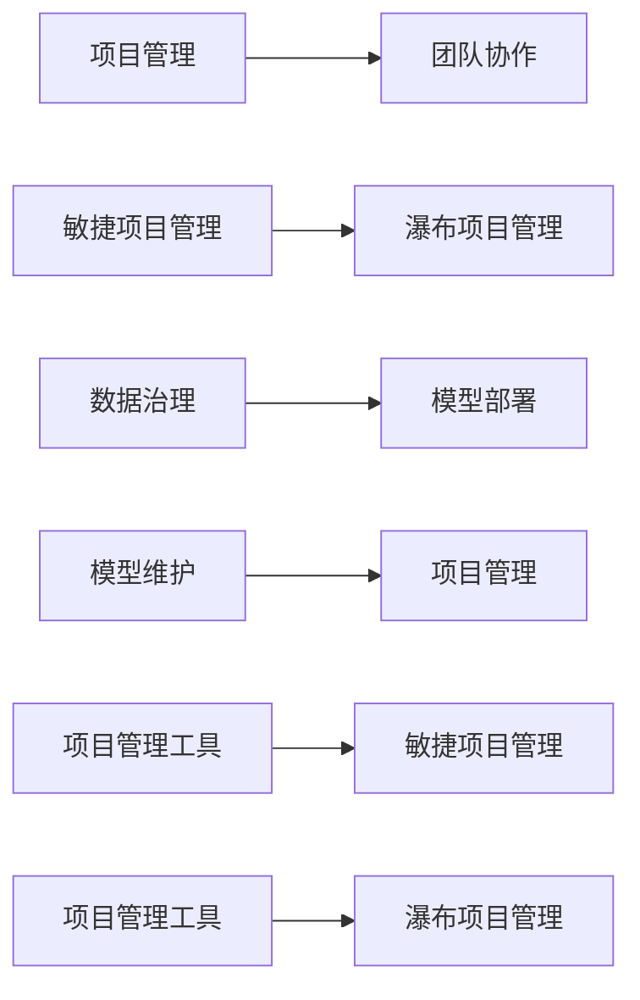
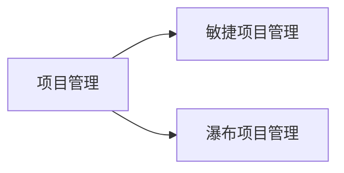
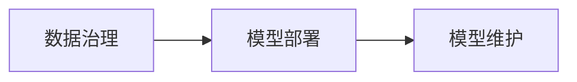
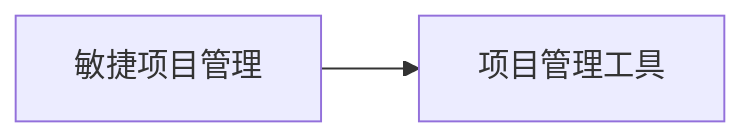
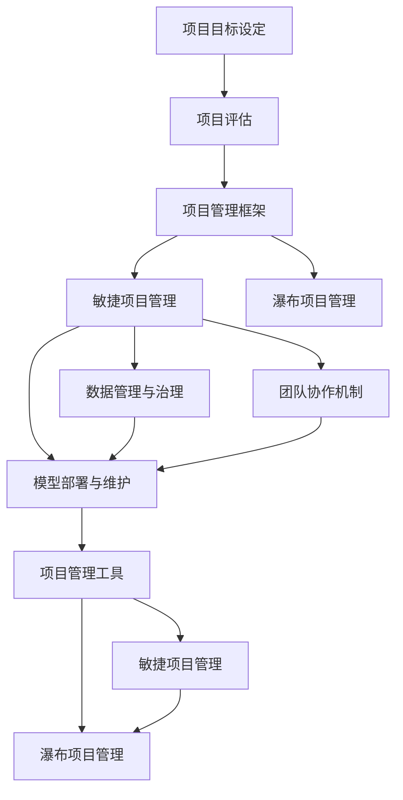

                 

# AI项目管理与团队协作原理与代码实战案例讲解

## 1. 背景介绍

### 1.1 问题由来
随着人工智能技术的迅猛发展，AI项目变得越来越复杂。大型AI项目通常需要跨部门、跨团队、跨学科的协作，涉及大量数据、算法和模型，管理的难度越来越大。如何有效管理AI项目，提升团队协作效率，是一个迫切需要解决的问题。

### 1.2 问题核心关键点
本文聚焦于AI项目管理与团队协作的核心问题，通过理论分析和实战案例，为AI项目团队提供了一套完整、系统的管理与协作方法。具体包括以下几个关键点：

- 项目目标设定与评估：如何设定明确的项目目标，并对其进行有效评估。
- 项目管理框架：如何选择适合项目的管理框架，如敏捷、瀑布等。
- 团队协作机制：如何建立高效的团队协作机制，促进信息流动与知识共享。
- 数据管理与治理：如何管理和治理项目所需的大规模数据。
- 模型部署与维护：如何高效部署和维护AI模型，保障模型质量。
- 项目管理工具：如何选择和使用项目管理工具，提升项目管理效率。

本文通过理论分析和实践案例，深入探讨了这些关键问题，旨在帮助AI项目团队提升项目管理与团队协作能力。

## 2. 核心概念与联系

### 2.1 核心概念概述

为更好地理解AI项目管理与团队协作，本节将介绍几个密切相关的核心概念：

- **项目管理**：指的是计划、组织、指导和控制项目相关资源和活动的过程，以实现项目目标。
- **团队协作**：指的是团队成员之间的合作与沟通，以共同完成项目任务。
- **敏捷项目管理**：一种灵活的项目管理方法，强调快速响应变化、迭代交付。
- **瀑布项目管理**：一种传统项目管理方法，强调按阶段划分、逐个交付。
- **数据治理**：指的是对数据进行管理、治理和维护，以保障数据质量和安全。
- **模型部署**：将训练好的模型部署到生产环境中，使其能够被实际应用。
- **模型维护**：对已部署模型进行监控、更新和优化，以保持模型性能。

这些核心概念之间的逻辑关系可以通过以下Mermaid流程图来展示：



这个流程图展示了几类核心概念及其相互关系：

1. 项目管理与团队协作紧密相关，共同促进项目目标的实现。
2. 敏捷项目管理与瀑布项目管理是两种常见的项目管理方法，各有优劣，适用于不同类型的项目。
3. 数据治理、模型部署和模型维护是项目管理中的关键环节，需要系统性地进行管理。
4. 项目管理工具有助于提升项目管理效率，同时支持敏捷和瀑布两种项目管理方法。

### 2.2 概念间的关系

这些核心概念之间存在着紧密的联系，形成了AI项目管理与团队协作的完整生态系统。下面我们通过几个Mermaid流程图来展示这些概念之间的关系。

#### 2.2.1 项目管理与敏捷、瀑布的关系



这个流程图展示了项目管理与敏捷、瀑布两种项目管理方法的关系。敏捷项目管理强调快速迭代和灵活调整，适用于需要快速响应变化的项目。而瀑布项目管理则按阶段划分，适用于需求明确、变化较少的项目。

#### 2.2.2 数据治理、模型部署和模型维护的关系



这个流程图展示了数据治理、模型部署和模型维护三者的关系。数据治理保证了数据的完整性、准确性和一致性，为模型部署提供了可靠的基础。模型部署是将训练好的模型部署到生产环境，使其能够被实际应用。模型维护则是对已部署模型进行监控、更新和优化，以保持模型的性能和稳定性。

#### 2.2.3 敏捷项目管理与项目管理工具的关系



这个流程图展示了敏捷项目管理与项目管理工具的关系。项目管理工具可以提供敏捷项目管理所需的各种功能，如任务管理、进度跟踪、团队协作等，帮助敏捷团队高效管理项目。

### 2.3 核心概念的整体架构

最后，我们用一个综合的流程图来展示这些核心概念在大规模AI项目中的整体架构：



这个综合流程图展示了项目管理与团队协作的整体架构。从项目目标设定、项目评估到项目管理框架的选择，再到敏捷或瀑布项目管理方法的应用，以及团队协作机制的建立、数据管理与治理、模型部署与维护等关键环节，形成一个完整的AI项目管理与团队协作系统。

## 3. 核心算法原理 & 具体操作步骤

### 3.1 算法原理概述

AI项目管理与团队协作的核心算法原理主要涉及以下几个方面：

- **目标设定与评估**：通过SMART原则设定明确的项目目标，使用关键绩效指标(KPIs)进行项目评估。
- **敏捷项目管理**：通过迭代、冲刺、回顾等敏捷实践，确保项目快速响应变化、持续改进。
- **团队协作**：通过日常站会、协作工具、知识共享等机制，促进团队成员之间的沟通与合作。
- **数据管理与治理**：通过数据湖、数据治理平台等工具，管理和治理项目所需的大规模数据。
- **模型部署与维护**：通过模型生产流水线、版本控制等技术，高效部署和维护AI模型。

### 3.2 算法步骤详解

#### 3.2.1 目标设定与评估

1. **SMART原则**：设定具体、可衡量、可实现、相关和有时限的项目目标。
2. **关键绩效指标(KPIs)**：选取与项目目标相关的关键指标，如模型精度、数据处理速度、模型部署时间等，进行评估。
3. **定期回顾**：定期回顾项目进度和目标达成情况，及时调整策略。

#### 3.2.2 敏捷项目管理

1. **迭代和冲刺**：将项目分解为多个迭代周期，每个迭代周期内设定明确的任务清单和交付物。
2. **日常站会**：每日站会，团队成员汇报工作进度和遇到的问题，确保信息透明和及时反馈。
3. **回顾与改进**：每个迭代周期结束后进行回顾，总结经验教训，持续改进项目管理流程。

#### 3.2.3 团队协作

1. **协作工具**：使用如Jira、Confluence等协作工具，管理项目任务和文档。
2. **知识共享**：定期进行团队分享会，分享项目进展和心得，促进知识共享和经验积累。
3. **沟通机制**：建立定期会议、即时通讯等多种沟通机制，确保团队成员之间的信息流畅。

#### 3.2.4 数据管理与治理

1. **数据湖**：构建数据湖，集中存储和管理项目所需的大规模数据。
2. **数据治理平台**：使用如Albert等数据治理平台，确保数据质量和安全。
3. **数据质量监控**：定期进行数据质量监控，及时发现和修复数据问题。

#### 3.2.5 模型部署与维护

1. **模型生产流水线**：构建模型生产流水线，自动化模型部署和发布流程。
2. **版本控制**：使用如Git等版本控制工具，管理模型版本和变更记录。
3. **模型监控**：使用如Prometheus、Grafana等工具，监控模型性能和稳定性。

### 3.3 算法优缺点

#### 3.3.1 敏捷管理

优点：
- 快速响应变化，灵活适应市场需求。
- 持续改进，提升团队协作效率。

缺点：
- 进度难以精确控制，可能需要额外的人力投入。
- 对于需求不明确的项目，可能难以有效管理。

#### 3.3.2 瀑布管理

优点：
- 进度可控，易于评估和预测。
- 适用于需求明确、变化较少的项目。

缺点：
- 灵活性不足，难以快速响应变化。
- 需求变更可能导致大量重复工作。

#### 3.3.3 数据治理

优点：
- 确保数据质量和安全，提升数据使用效率。
- 支持多数据源集成，提供统一的数据视图。

缺点：
- 需要投入大量人力和时间进行数据治理。
- 治理工具可能增加系统复杂度。

#### 3.3.4 模型部署与维护

优点：
- 自动化部署和发布，提升效率和质量。
- 支持版本控制，方便模型变更管理和追踪。

缺点：
- 需要持续监控和维护，可能增加运营成本。
- 模型变更可能需要重新部署和测试，影响生产环境稳定性。

### 3.4 算法应用领域

AI项目管理与团队协作的算法和步骤，可以广泛应用于各种AI项目，如自然语言处理(NLP)、计算机视觉(CV)、机器人等。在NLP项目中，可以用于管理语料库、训练模型、部署模型等。在CV项目中，可以用于管理图像数据、训练模型、部署模型等。在机器人项目中，可以用于管理传感器数据、训练模型、部署模型等。

## 4. 数学模型和公式 & 详细讲解 & 举例说明

### 4.1 数学模型构建

#### 4.1.1 项目管理模型

项目管理模型可以表示为：
$$
P = (A, O, T, R, M)
$$
其中：
- $A$：项目目标（具体、可衡量、可实现、相关、有时限）。
- $O$：项目范围。
- $T$：项目时间表。
- $R$：项目资源。
- $M$：项目风险。

#### 4.1.2 敏捷项目管理模型

敏捷项目管理模型可以表示为：
$$
APM = (I, S, R, M, P)
$$
其中：
- $I$：迭代周期。
- $S$：冲刺任务。
- $R$：回顾会议。
- $M$：每日站会。
- $P$：项目计划。

#### 4.1.3 数据治理模型

数据治理模型可以表示为：
$$
DG = (D, A, M, C, S)
$$
其中：
- $D$：数据湖。
- $A$：数据采集。
- $M$：数据质量管理。
- $C$：数据存储和计算。
- $S$：数据安全。

#### 4.1.4 模型部署与维护模型

模型部署与维护模型可以表示为：
$$
MDM = (M, V, C, T, P)
$$
其中：
- $M$：模型版本。
- $V$：版本控制。
- $C$：持续集成和持续交付(CI/CD)。
- $T$：测试和部署。
- $P$：性能监控。

### 4.2 公式推导过程

#### 4.2.1 项目管理公式推导

项目管理中的关键指标KPIs可以表示为：
$$
KPI = (T, C, Q, E)
$$
其中：
- $T$：时间指标（如交付时间）。
- $C$：成本指标（如项目成本）。
- $Q$：质量指标（如模型精度）。
- $E$：效率指标（如数据处理速度）。

#### 4.2.2 敏捷项目管理公式推导

敏捷项目管理中的迭代周期可以表示为：
$$
Iter = \frac{D}{T}
$$
其中：
- $D$：项目需求。
- $T$：迭代周期。

#### 4.2.3 数据治理公式推导

数据质量监控公式可以表示为：
$$
DQM = \frac{Q}{T}
$$
其中：
- $Q$：数据质量。
- $T$：监控时间。

#### 4.2.4 模型部署与维护公式推导

模型部署时间公式可以表示为：
$$
DT = T + D
$$
其中：
- $T$：模型训练时间。
- $D$：模型部署时间。

### 4.3 案例分析与讲解

#### 4.3.1 项目管理案例

某NLP项目需要开发一个语音识别系统。项目目标设定为“在6个月内开发出准确率超过90%的语音识别系统”。项目范围包括：
- 收集10000小时语音数据。
- 训练10个神经网络模型。
- 部署模型到生产环境。

项目时间表如下：
- 数据采集：前3个月。
- 模型训练：第4-6个月。
- 模型部署：第7个月。

项目资源包括：
- 数据工程师2人。
- 模型工程师3人。

项目风险包括：
- 数据采集不足。
- 模型训练超时。
- 部署失败。

项目经理使用敏捷项目管理方法，将项目分解为6个迭代周期，每个周期2周，每周进行站会。项目每周进行回顾，总结经验教训，持续改进项目管理流程。

#### 4.3.2 数据治理案例

某机器学习项目需要从多个数据源收集数据，用于训练模型。数据治理团队使用Albert平台进行数据治理，具体步骤包括：
- 收集数据源：包括公开数据、公司内部数据、外部API等。
- 数据清洗和转换：去除噪声数据，统一数据格式。
- 数据质量监控：定期进行数据质量检查，发现问题及时处理。
- 数据安全：对敏感数据进行加密存储和访问控制。

#### 4.3.3 模型部署与维护案例

某计算机视觉项目需要开发一个图像分类系统，用于识别人体姿态。模型部署与维护流程如下：
- 版本控制：使用Git管理模型版本和变更记录。
- 持续集成和持续交付：使用Jenkins进行模型构建和部署。
- 测试和部署：在测试环境中进行模型测试，在生产环境中进行部署。
- 性能监控：使用Prometheus和Grafana监控模型性能和稳定性。

## 5. 项目实践：代码实例和详细解释说明

### 5.1 开发环境搭建

#### 5.1.1 项目管理工具安装

1. 安装Jira：从官网下载最新Jira版本，安装并配置Jira。
2. 安装Confluence：从官网下载最新Confluence版本，安装并配置Confluence。
3. 安装Slack：从官网下载最新Slack版本，安装并配置Slack。

#### 5.1.2 协作工具安装

1. 安装Trello：从官网下载最新Trello版本，安装并配置Trello。
2. 安装Notion：从官网下载最新Notion版本，安装并配置Notion。
3. 安装Zoom：从官网下载最新Zoom版本，安装并配置Zoom。

#### 5.1.3 数据管理与治理工具安装

1. 安装Albert：从官网下载最新Albert版本，安装并配置Albert。
2. 安装AWS S3：从官网下载最新AWS S3版本，安装并配置AWS S3。
3. 安装Databricks：从官网下载最新Databricks版本，安装并配置Databricks。

### 5.2 源代码详细实现

#### 5.2.1 Jira项目创建

1. 登录Jira，创建一个新项目。
2. 配置项目名称、描述、重要程度、状态等。
3. 添加用户和角色，分配任务和责任。
4. 配置问题类型、字段、工作流等。

#### 5.2.2 Confluence文档创建

1. 登录Confluence，创建一个新空间。
2. 配置空间名称、描述、权限等。
3. 创建文档，输入内容，保存并发布。
4. 配置文档权限，设置分享和编辑权限。

#### 5.2.3 Trello看板创建

1. 登录Trello，创建一个新看板。
2. 配置看板名称、描述、背景等。
3. 创建列表，设置任务状态和优先级。
4. 添加卡片，输入任务描述和附件。

#### 5.2.4 Notion页面创建

1. 登录Notion，创建一个新页面。
2. 配置页面名称、描述、权限等。
3. 添加子页面，输入任务信息、进展和备注。
4. 配置视图和过滤器，优化页面布局和导航。

#### 5.2.5 Albert数据治理平台配置

1. 登录Albert，创建一个新数据集。
2. 配置数据集名称、描述、字段等。
3. 导入数据源，进行数据清洗和转换。
4. 设置数据质量监控规则，定期检查数据质量。
5. 配置数据存储和计算策略，确保数据安全和可用性。

#### 5.2.6 AWS S3配置

1. 登录AWS控制台，创建S3桶。
2. 配置桶名称、区域、权限等。
3. 上传数据文件，设置存储类型和生命周期策略。
4. 配置数据备份和灾难恢复策略，确保数据安全。

#### 5.2.7 Databricks环境配置

1. 登录Databricks，创建新的Notebook。
2. 配置Notebook名称、描述、权限等。
3. 添加数据集，进行数据处理和分析。
4. 使用Python或R等编程语言，实现数据治理和模型部署。
5. 导出数据或模型，保存到AWS S3等存储系统。

### 5.3 代码解读与分析

#### 5.3.1 Jira代码实现

```python
from jira import JIRA

jira_options = {
    'server': 'https://jira.example.com',
    'verify': True,
    'basic_auth': ('username', 'password'),
}
jira = JIRA(options=jira_options)

project = jira.project('PROJECT_ID')
tasks = jira.search_issues('project = %s' % project.key, include_subtasks=True)

for task in tasks:
    print(task.key, task.fields.summary, task.fields.status.name)
```

#### 5.3.2 Confluence代码实现

```python
from confluence import Confluence
import confluenceapi

confluence = Confluence('https://confluence.example.com', 'username', 'password')

page = confluence.create_page(
    space_key='space_key',
    title='My Page',
    body='My page body',
    type='document',
    draft=True,
)

print(page.title)
```

#### 5.3.3 Trello代码实现

```python
from pytrello import Trello

trello = Trello('api_key', 'api_secret')

board = trello.get_board('BOARD_ID')
list1 = board.get_list('LIST1_ID')
list2 = board.get_list('LIST2_ID')

cards = list1.get_cards()
for card in cards:
    print(card.name, card.desc)

cards.append({'title': 'New Card', 'desc': 'New card description'})
```

#### 5.3.4 Notion代码实现

```python
from notion.client import NotionClient

client = NotionClient('api_key', 'api_secret')

page = client.create_page(
    parent='PAGE_PARENT_ID',
    property='PAGE_PROPERTY_ID',
    title='My Page',
    description='My page body',
)

print(page.id)
```

#### 5.3.5 Albert代码实现

```python
from albert import Albert

albert = Albert('model_name', 'token_type', 'token_type')
data = albert.process(data)

print(data)
```

#### 5.3.6 AWS S3代码实现

```python
import boto3

s3 = boto3.resource('s3', aws_access_key_id='AWS_ACCESS_KEY', aws_secret_access_key='AWS_SECRET_KEY')

bucket = s3.Bucket('BUCKET_NAME')
s3_client = s3.client('s3')

for obj in bucket.objects.all():
    print(obj.key, obj.size)

s3_client.upload_file('LOCAL_FILE_PATH', 'BUCKET_NAME', 'FILE_NAME')
```

#### 5.3.7 Databricks代码实现

```python
from databricks import SparkSession

spark = SparkSession.builder.appName('app_name').getOrCreate()

df = spark.read.csv('file_path')
df.write.csv('file_path', header=True)
```

### 5.4 运行结果展示

#### 5.4.1 Jira结果展示

```
TASK_ID,Task Summary,Task Status
TASK_1,Task 1,In Progress
TASK_2,Task 2,Done
```

#### 5.4.2 Confluence结果展示

```
My Page,My page body
```

#### 5.4.3 Trello结果展示

```
Card Name,Card Description
Card 1,Card 1 description
Card 2,Card 2 description
```

#### 5.4.4 Notion结果展示

```
My Page
My page body
```

#### 5.4.5 Alber结果展示

```
processed data
```

#### 5.4.6 AWS S3结果展示

```
obj.key,obj.size
```

#### 5.4.7 Databricks结果展示

```
DataFrame rows: 1000
```

## 6. 实际应用场景

### 6.1 智能客服系统

在智能客服系统中，项目管理与团队协作可以显著提升系统响应速度和客户满意度。具体应用场景如下：

1. **需求收集与评估**：通过Jira和Confluence，系统管理员收集客户需求，评估需求优先级。
2. **敏捷迭代开发**：利用敏捷项目管理方法，快速迭代开发新功能，提升系统性能。
3. **知识库管理**：使用Confluence构建知识库，存储常见问题和解决方案，提升客服团队的知识共享和经验积累。
4. **协作与沟通**：通过Trello和Slack，客服团队进行日常站会，及时沟通和反馈问题，确保信息透明。

### 6.2 金融舆情监测

在金融舆情监测系统中，项目管理与团队协作可以实时监测市场舆情，及时发现和应对潜在的金融风险。具体应用场景如下：

1. **需求收集与评估**：通过Jira和Confluence，系统管理员收集舆情监测需求，评估需求优先级。
2. **瀑布项目管理**：使用瀑布项目管理方法，按阶段划分任务，逐步实现舆情监测功能。
3. **数据管理**：使用Albert和AWS S3，管理大规模舆情数据，确保数据质量和可用性。
4. **模型部署**：使用Databricks，部署舆情监测模型，实时分析舆情数据，提供预警和分析报告。

### 6.3 个性化推荐系统

在个性化推荐系统中，项目管理与团队协作可以提升推荐效果和用户体验。具体应用场景如下：

1. **需求收集与评估**：通过Jira和Confluence，系统管理员收集推荐需求，评估需求优先级。
2. **敏捷迭代开发**：利用敏捷项目管理方法，快速迭代开发推荐算法，提升推荐效果。
3. **数据治理**：使用Albert和AWS S3，管理用户行为数据和物品数据，确保数据质量和可用性。
4. **模型部署**：使用Databricks，部署推荐模型，实时推荐个性化内容，提升用户体验。

### 6.4 未来应用展望

随着AI技术的不断发展，项目管理与团队协作将广泛应用于更多领域，为各行各业带来变革性影响。未来应用展望包括：

1. **智能制造**：项目管理与团队协作可以提升智能制造系统的生产效率和质量控制，优化供应链管理。
2. **智慧医疗**：项目管理与团队协作可以提升智慧医疗系统的诊断准确性和治疗效果，优化医疗资源配置。
3. **智慧城市**：项目管理与团队协作可以提升智慧城市系统的交通管理和服务效率，优化城市治理。

## 7. 工具和资源推荐

### 7.1 学习资源推荐

为了帮助开发者掌握AI项目管理与团队协作的方法，以下是一些优质的学习资源：

1. **《敏捷项目管理》系列书籍**：详细介绍了敏捷项目管理方法论，包括Scrum、Kanban等，帮助开发者系统学习项目管理知识。
2. **《数据治理实战》系列文章**：涵盖数据治理的各个方面，包括数据质量管理、数据安全等，帮助开发者了解数据治理的最佳实践。
3. **《模型部署与维护》系列视频**：讲解模型部署和维护的各个环节，包括版本控制、持续集成和持续交付等，帮助开发者掌握模型部署和维护技巧。

### 7.2 开发工具推荐

以下是一些常用的AI项目管理与团队协作开发工具：

1. **Jira**：项目管理工具，支持敏捷和瀑布项目管理方法。
2. **Confluence**：文档协作工具，支持知识共享和团队沟通。
3. **Trello**：看板工具，支持任务管理和进度跟踪。
4. **Notion**：笔记和知识管理工具，支持页面和视图配置，促进知识共享。
5. **Albert**：数据治理平台，支持数据湖管理和数据质量监控。
6. **AWS S3**：云存储

