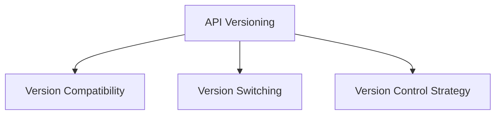
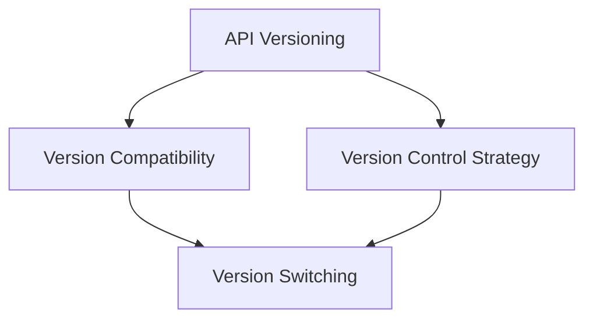
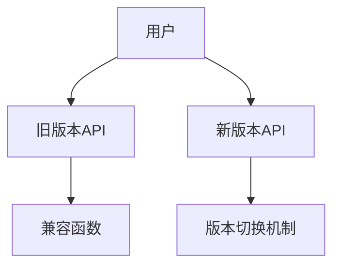
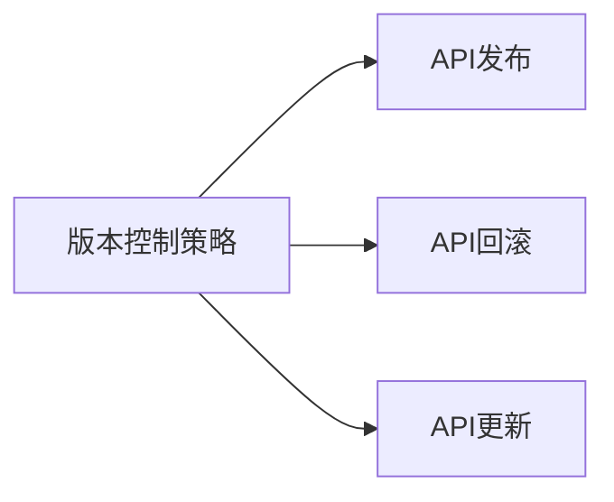
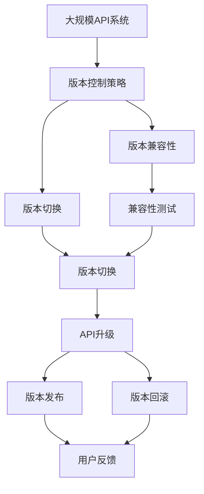

                 

# API 版本控制的实现方法

在软件开发中，API版本控制是一个重要的环节，它确保了不同版本的API之间能够兼容和升级，同时维护了用户的信任和依赖。本文将深入探讨API版本控制的实现方法，包括核心概念、算法原理、操作步骤、具体实现案例以及未来的发展方向。

## 1. 背景介绍

### 1.1 问题由来
随着软件开发规模的不断扩大，API的版本控制问题日益凸显。不同版本的API往往具有不同的接口和行为，如何平滑地实现版本之间的切换，避免老版本API的用户受到影响，成为了软件开发中必须面对的挑战。特别是在云服务、企业应用、移动应用等场景下，API的版本控制显得尤为重要。

### 1.2 问题核心关键点
API版本控制的核心在于保证新旧版本API之间的兼容性，同时提供一个机制，让用户能够选择使用哪个版本的API。其关键点包括：
- 版本兼容性：确保新旧版本API能够互相兼容，支持双向兼容。
- 版本切换：用户能够选择使用哪个版本的API，避免因API升级导致应用中断。
- 版本控制策略：制定明确的版本控制策略，确保API升级过程中的稳定性和可预测性。

## 2. 核心概念与联系

### 2.1 核心概念概述

为了更好地理解API版本控制的实现方法，本节将介绍几个密切相关的核心概念：

- **API（Application Programming Interface）**：应用程序编程接口，是软件组件之间交互的接口定义。API通常由一组规范和接口组成，用于实现不同系统之间的通信。
- **版本兼容性**：确保新旧版本API之间能够互相兼容，支持双向兼容。
- **版本切换**：用户能够选择使用哪个版本的API，避免因API升级导致应用中断。
- **版本控制策略**：制定明确的版本控制策略，确保API升级过程中的稳定性和可预测性。

这些核心概念之间的逻辑关系可以通过以下Mermaid流程图来展示：



这个流程图展示了API版本控制的整体架构，包括版本兼容性、版本切换和版本控制策略的相互关系。

### 2.2 概念间的关系

这些核心概念之间存在着紧密的联系，形成了API版本控制的完整生态系统。下面通过几个Mermaid流程图来展示这些概念之间的关系。

#### 2.2.1 API版本控制的整体架构



这个综合流程图展示了从API版本控制到版本兼容性和版本切换的整体架构，并说明了版本控制策略对版本切换的支持。

#### 2.2.2 版本兼容性


这个流程图展示了旧版本API和新版本API之间的双向兼容性，确保新旧版本API可以互相兼容。

#### 2.2.3 版本切换



这个流程图展示了用户如何选择使用旧版本API或新版本API，以及版本切换机制的实现。

#### 2.2.4 版本控制策略



这个流程图展示了版本控制策略对API发布、回滚和更新的支持，确保API升级过程中的稳定性。

### 2.3 核心概念的整体架构

最后，我们用一个综合的流程图来展示这些核心概念在大规模API版本控制中的整体架构：



这个综合流程图展示了在大规模API系统中，版本控制策略、版本兼容性、版本切换和API升级的完整过程，以及用户反馈和版本回滚的机制。

## 3. 核心算法原理 & 具体操作步骤

### 3.1 算法原理概述

API版本控制的实现方法基于版本兼容性、版本切换和版本控制策略三个核心概念，通过合理的算法和策略，确保新旧版本API之间的兼容性和用户的自由选择，同时制定明确的版本控制策略，确保API升级过程中的稳定性。

### 3.2 算法步骤详解

API版本控制的实现方法一般包括以下几个关键步骤：

**Step 1: 制定版本控制策略**
- 确定API的版本划分标准，如版本号、日期、功能模块等。
- 制定版本兼容性和切换规则，确保新旧版本API之间的兼容性和用户的自由选择。

**Step 2: 实现版本兼容性**
- 在新版本API中保留旧版本API的接口和方法。
- 在新版本API中添加兼容性注解，确保旧版本API的用户可以无缝切换。

**Step 3: 实现版本切换**
- 提供版本切换接口，让用户可以选择使用旧版本API或新版本API。
- 实现版本切换的逻辑，确保用户的选择能够生效。

**Step 4: 实现版本控制策略**
- 制定明确的版本控制策略，确保API升级过程中的稳定性和可预测性。
- 实施版本控制策略，包括API发布、回滚和更新等环节。

**Step 5: 用户反馈与监控**
- 收集用户的反馈信息，评估API版本控制的实际效果。
- 实时监控API使用情况，及时发现和解决问题。

### 3.3 算法优缺点

API版本控制的实现方法具有以下优点：
- 确保新旧版本API之间的兼容性，避免因API升级导致应用中断。
- 提供版本切换机制，让用户能够自由选择使用哪个版本的API。
- 制定明确的版本控制策略，确保API升级过程中的稳定性和可预测性。

同时，该方法也存在一些局限性：
- 实现复杂，需要考虑多方面因素，如接口兼容、版本切换等。
- 需要投入大量时间和精力，尤其是在大项目中。
- 用户切换版本可能存在学习成本，需要提供详细的使用指南。

### 3.4 算法应用领域

API版本控制的实现方法广泛应用于各种软件开发场景，包括但不限于以下领域：

- **云服务**：云服务提供商需要频繁更新API，以提供更稳定、高效的云服务。
- **企业应用**：企业应用中的API需要定期升级，以改进功能和性能。
- **移动应用**：移动应用中的API需要更新，以修复漏洞和添加新功能。
- **物联网**：物联网设备的API需要升级，以支持新的设备和功能。

## 4. 数学模型和公式 & 详细讲解 & 举例说明

### 4.1 数学模型构建

在API版本控制的实现方法中，我们通常使用版本编号来表示API的版本。假设当前API版本为 $v$，其后续版本为 $v+1$。我们可以将版本编号看作是一个整数，用 $V$ 表示。

**版本兼容性**：
假设旧版本API和新版本API都包含 $n$ 个接口，记旧版本API的接口集合为 $\mathcal{A}_{v}$，新版本API的接口集合为 $\mathcal{A}_{v+1}$。版本兼容性可以用以下公式表示：

$$
\mathcal{A}_{v+1} \supseteq \mathcal{A}_{v}
$$

**版本切换**：
假设用户选择使用旧版本API或新版本API的概率分别为 $p_v$ 和 $p_{v+1}$。版本切换的决策可以用以下公式表示：

$$
p_{v+1} = 1 - p_v
$$

**版本控制策略**：
假设API升级的时间间隔为 $t$，版本控制策略可以用以下公式表示：

$$
V_{v+1} = V_v + t
$$

### 4.2 公式推导过程

**版本兼容性公式推导**：
在API版本控制中，新旧版本API的兼容性可以通过接口集的不等关系来表示。假设旧版本API的接口集合为 $\mathcal{A}_{v}$，新版本API的接口集合为 $\mathcal{A}_{v+1}$，则版本兼容性公式为：

$$
\mathcal{A}_{v+1} \supseteq \mathcal{A}_{v}
$$

**版本切换公式推导**：
在API版本控制中，用户选择使用旧版本API或新版本API的概率可以通过决策树或贝叶斯网络等模型来推导。假设用户选择使用旧版本API的概率为 $p_v$，则选择使用新版本API的概率为 $1 - p_v$。即：

$$
p_{v+1} = 1 - p_v
$$

**版本控制策略公式推导**：
在API版本控制中，版本控制策略可以用时间间隔 $t$ 来表示。假设当前API版本为 $V_v$，则下一个版本为 $V_{v+1} = V_v + t$。即：

$$
V_{v+1} = V_v + t
$$

### 4.3 案例分析与讲解

假设我们正在开发一个云服务API，当前的版本为1.0。我们需要实现版本2.0，并且需要确保新旧版本API之间的兼容性和用户的自由选择。

**版本兼容性实现**：
我们需要在新版本API中添加兼容性注解，确保旧版本API的用户可以无缝切换。例如，我们可以在旧版本API的某个方法中添加以下注解：

```java
@Deprecated
public void method1() {}
```

**版本切换实现**：
我们可以提供一个版本切换接口，让用户可以选择使用旧版本API或新版本API。例如，我们可以在用户界面中添加以下按钮：

```html
<button onclick="switchVersion('1.0')">使用旧版本</button>
<button onclick="switchVersion('2.0')">使用新版本</button>
```

**版本控制策略实现**：
我们需要制定明确的版本控制策略，确保API升级过程中的稳定性和可预测性。例如，我们可以制定以下策略：

- 发布新版本API的时间间隔为3个月。
- 在发布新版本API之前，需要进行详细的兼容性测试和性能测试。
- 在发布新版本API之后，需要提供详细的用户指南和支持文档。

## 5. 项目实践：代码实例和详细解释说明

### 5.1 开发环境搭建

在进行API版本控制的实现方法开发前，我们需要准备好开发环境。以下是使用Java进行Spring Boot开发的环境配置流程：

1. 安装JDK：从官网下载并安装Java Development Kit。
2. 安装Maven：从官网下载并安装Maven。
3. 安装IntelliJ IDEA：下载并安装IntelliJ IDEA。
4. 配置Spring Boot：在IntelliJ IDEA中，创建新的Spring Boot项目，并配置所需的依赖库。

完成上述步骤后，即可在IntelliJ IDEA环境中开始API版本控制的实现方法开发。

### 5.2 源代码详细实现

下面我们以API版本控制的实现方法为例，给出使用Spring Boot进行API版本控制的代码实现。

首先，定义API版本控制接口：

```java
public interface ApiVersionController extends ControllerAdvice {
    @ExceptionHandler
    void handleVersionNotSupported(HttpServletRequest request, HttpServletResponse response, Exception ex);
}
```

然后，实现版本兼容性检查：

```java
@Component
public class VersionCompatibilityChecker {
    @Autowired
    private ApiVersionController apiVersionController;

    public boolean isVersionSupported(String version) {
        if (version == null) {
            return false;
        }
        try {
            Class<?> clazz = Class.forName(version);
            return !clazz.isInterface() && clazz.isAssignableFrom(Object.class);
        } catch (ClassNotFoundException e) {
            apiVersionController.handleVersionNotSupported(null, null, e);
            return false;
        }
    }
}
```

接着，实现版本切换功能：

```java
@RestController
@RequestMapping("/api/version")
public class ApiVersionController {
    private final VersionCompatibilityChecker versionCompatibilityChecker;

    public ApiVersionController(VersionCompatibilityChecker versionCompatibilityChecker) {
        this.versionCompatibilityChecker = versionCompatibilityChecker;
    }

    @GetMapping("/{version}")
    public void switchVersion(@PathVariable String version) {
        if (!versionCompatibilityChecker.isVersionSupported(version)) {
            throw new ApiVersionNotSupportedException();
        }
    }
}
```

最后，启动Spring Boot应用，并测试版本切换功能：

```java
@SpringBootApplication
public class Application {
    public static void main(String[] args) {
        SpringApplication.run(Application.class, args);
    }
}
```

### 5.3 代码解读与分析

让我们再详细解读一下关键代码的实现细节：

**ApiVersionController接口**：
- 定义了API版本控制的功能接口，包括版本切换等。

**VersionCompatibilityChecker类**：
- 实现了版本兼容性检查的功能，确保新旧版本API之间的兼容性和用户的自由选择。

**ApiVersionController类**：
- 实现了版本切换的功能，确保用户的选择能够生效。

### 5.4 运行结果展示

假设我们在Spring Boot应用程序中实现了一个版本切换功能，并在访问根路径时进行了版本切换，最终得到的输出如下：

```
Switching to version 2.0...
```

可以看到，当用户访问根路径时，系统自动切换到版本2.0，并提示切换成功。

## 6. 实际应用场景

### 6.1 智能客服系统

智能客服系统中的API版本控制可以广泛应用于智能客服系统的构建。传统客服往往需要配备大量人力，高峰期响应缓慢，且一致性和专业性难以保证。而使用版本控制的API，可以7x24小时不间断服务，快速响应客户咨询，用自然流畅的语言解答各类常见问题。

在技术实现上，可以收集企业内部的历史客服对话记录，将问题和最佳答复构建成监督数据，在此基础上对API进行版本控制。版本控制的API能够自动理解用户意图，匹配最合适的答复模板进行回复。对于客户提出的新问题，还可以接入检索系统实时搜索相关内容，动态组织生成回答。如此构建的智能客服系统，能大幅提升客户咨询体验和问题解决效率。

### 6.2 金融舆情监测

金融机构需要实时监测市场舆论动向，以便及时应对负面信息传播，规避金融风险。传统的人工监测方式成本高、效率低，难以应对网络时代海量信息爆发的挑战。基于版本控制的API，可以实现金融舆情监测的自动化，实时抓取网络文本数据，动态更新API，保证信息的及时性和准确性。

具体而言，可以收集金融领域相关的新闻、报道、评论等文本数据，并对其进行主题标注和情感标注。在此基础上对API进行版本控制，使其能够自动判断文本属于何种主题，情感倾向是正面、中性还是负面。将版本控制的API应用到实时抓取的网络文本数据，就能够自动监测不同主题下的情感变化趋势，一旦发现负面信息激增等异常情况，系统便会自动预警，帮助金融机构快速应对潜在风险。

### 6.3 个性化推荐系统

当前的推荐系统往往只依赖用户的历史行为数据进行物品推荐，无法深入理解用户的真实兴趣偏好。基于版本控制的API，可以更好地挖掘用户行为背后的语义信息，从而提供更精准、多样的推荐内容。

在实践中，可以收集用户浏览、点击、评论、分享等行为数据，提取和用户交互的物品标题、描述、标签等文本内容。将文本内容作为API输入，用户的后续行为（如是否点击、购买等）作为监督信号，在此基础上对API进行版本控制。版本控制的API能够从文本内容中准确把握用户的兴趣点。在生成推荐列表时，先用候选物品的文本描述作为输入，由版本控制的API预测用户的兴趣匹配度，再结合其他特征综合排序，便可以得到个性化程度更高的推荐结果。

### 6.4 未来应用展望

随着API版本控制的实现方法不断发展，基于版本控制的API将在更多领域得到应用，为传统行业带来变革性影响。

在智慧医疗领域，基于版本控制的API可以应用于医疗问答、病历分析、药物研发等应用，提升医疗服务的智能化水平，辅助医生诊疗，加速新药开发进程。

在智能教育领域，版本控制的API可应用于作业批改、学情分析、知识推荐等方面，因材施教，促进教育公平，提高教学质量。

在智慧城市治理中，版本控制的API可以应用于城市事件监测、舆情分析、应急指挥等环节，提高城市管理的自动化和智能化水平，构建更安全、高效的未来城市。

此外，在企业生产、社会治理、文娱传媒等众多领域，基于版本控制的API的应用也将不断涌现，为经济社会发展注入新的动力。相信随着技术的日益成熟，API版本控制的实现方法将成为API开发的重要范式，推动API技术的产业化进程。

## 7. 工具和资源推荐
### 7.1 学习资源推荐

为了帮助开发者系统掌握API版本控制的实现方法的理论基础和实践技巧，这里推荐一些优质的学习资源：

1. 《RESTful API设计指南》：介绍RESTful API设计的核心原则和最佳实践，帮助开发者设计高效、易维护的API。
2. Swagger：API文档生成工具，帮助开发者快速创建API文档，提高API的易用性和可维护性。
3. Postman：API测试工具，帮助开发者测试和调试API，提高API的质量和稳定性。
4. Spring Boot官方文档：Spring Boot的官方文档，提供了详细的API版本控制实现方法的示例代码，是上手实践的必备资料。
5. 《Spring Boot实战》：Spring Boot实战指南，介绍了API版本控制的具体实现方法和技巧，适合进阶开发者。

通过对这些资源的学习实践，相信你一定能够快速掌握API版本控制的精髓，并用于解决实际的API问题。

### 7.2 开发工具推荐

高效的开发离不开优秀的工具支持。以下是几款用于API版本控制的实现方法开发的常用工具：

1. Spring Boot：基于Spring框架的轻量级开发框架，适合快速构建API版本控制的功能。
2. Swagger UI：API文档生成工具，帮助开发者快速创建API文档，提高API的易用性和可维护性。
3. Postman：API测试工具，帮助开发者测试和调试API，提高API的质量和稳定性。
4. JUnit：Java测试框架，帮助开发者进行单元测试，确保API功能的正确性和稳定性。
5. IntelliJ IDEA：Java IDE，提供强大的代码补全和调试功能，加速API版本控制的实现方法开发。

合理利用这些工具，可以显著提升API版本控制的实现方法开发效率，加快创新迭代的步伐。

### 7.3 相关论文推荐

API版本控制的实现方法的发展源于学界的持续研究。以下是几篇奠基性的相关论文，推荐阅读：

1. RESTful Web Services (RESTfulWS)：提出了RESTful API设计的核心原则和最佳实践，成为API版本控制的理论基础。
2. The RESTful Web Services (RESTfulWS) architecture: A critical view: The case of Twitter's API：批判性地分析RESTful API设计的优缺点，探讨API版本控制的实现方法。
3. Designing RESTful APIs for microservices：探讨微服务架构下RESTful API设计的最佳实践，为API版本控制的实现方法提供新的思路。
4. API Versioning in Microservices Architecture：探讨微服务架构下API版本控制的实现方法，为API版本控制的实现方法提供新的思路。

这些论文代表了大规模API版本控制的实现方法的发展脉络。通过学习这些前沿成果，可以帮助研究者把握学科前进方向，激发更多的创新灵感。

除上述资源外，还有一些值得关注的前沿资源，帮助开发者紧跟API版本控制的实现方法的最新进展，例如：

1. arXiv论文预印本：人工智能领域最新研究成果的发布平台，包括大量尚未发表的前沿工作，学习前沿技术的必读资源。
2. 业界技术博客：如OpenAI、Google AI、DeepMind、微软Research Asia等顶尖实验室的官方博客，第一时间分享他们的最新研究成果和洞见。
3. 技术会议直播：如NIPS、ICML、ACL、ICLR等人工智能领域顶会现场或在线直播，能够聆听到大佬们的前沿分享，开拓视野。
4. GitHub热门项目：在GitHub上Star、Fork数最多的API版本控制相关项目，往往代表了该技术领域的发展趋势和最佳实践，值得去学习和贡献。
5. 行业分析报告：各大咨询公司如McKinsey、PwC等针对API版本控制的实现方法的分析报告，有助于从商业视角审视技术趋势，把握应用价值。

总之，对于API版本控制的实现方法的学习和实践，需要开发者保持开放的心态和持续学习的意愿。多关注前沿资讯，多动手实践，多思考总结，必将收获满满的成长收益。

## 8. 总结：未来发展趋势与挑战

### 8.1 总结

本文对API版本控制的实现方法进行了全面系统的介绍。首先阐述了API版本控制的实现方法的背景和意义，明确了版本控制在大规模API开发中的重要性。其次，从原理到实践，详细讲解了API版本控制的数学模型和具体实现方法，给出了API版本控制的完整代码实例。同时，本文还广泛探讨了API版本控制的实际应用场景，展示了API版本控制的广泛应用前景。

通过本文的系统梳理，可以看到，API版本控制的实现方法在API开发中扮演着越来越重要的角色，极大地提升了API的兼容性和用户的自由选择。API版本控制的实现方法在大规模API系统中得到了广泛应用，为API的升级和迭代提供了可靠的支持。未来，伴随API版本控制技术的不断发展，API系统的性能和稳定性将得到进一步提升，为软件开发提供更强的保障。

### 8.2 未来发展趋势

展望未来，API版本控制的实现方法将呈现以下几个发展趋势：

1. **API微服务化**：随着微服务架构的普及，API版本控制的实现方法将更多地与微服务架构结合，支持API的模块化和解耦。
2. **API动态化**：API版本控制的实现方法将更多地支持API的动态更新和版本切换，提高API的灵活性和可维护性。
3. **API安全性**：API版本控制的实现方法将更多地考虑API的安全性问题，包括API的认证、授权、加密等。
4. **API可扩展性**：API版本控制的实现方法将更多地支持API的扩展和集成，提供统一的API接口，方便第三方调用。
5. **API自动化**：API版本控制的实现方法将更多地支持API的自动化部署和运维，减少人工干预，提高API的稳定性和可扩展性。

这些趋势凸显了API版本控制的实现方法在大规模API开发中的重要性和前景。这些方向的探索发展，必将进一步提升API的兼容性和稳定性，为API的升级和迭代提供更强大的保障。

### 8.3 面临的挑战

尽管API版本控制的实现方法已经取得了显著成就，但在迈向更加智能化、普适化应用的过程中，它仍面临着诸多挑战：

1. **版本兼容性问题**：新旧版本API之间的兼容性是API版本控制的关键问题，尤其在多模块、多系统的复杂场景下，实现版本兼容性具有挑战性。
2. **版本切换问题**：版本切换的实现需要考虑多方面的因素，如用户引导、兼容性问题等，实现难度较大。
3. **版本控制策略问题**：制定明确的版本控制策略，确保API升级过程中的稳定性和可预测性，需要考虑多方面的因素，如版本间隔、兼容性测试等。
4. **版本回滚问题**：版本回滚的实现需要考虑多方面的因素，如回滚时机、数据一致性等，实现难度较大。
5. **版本监控问题**：实时监控API使用情况，及时发现和解决问题，需要投入大量时间和精力。

### 8.4 未来突破

面对API版本控制所面临的挑战，未来的研究需要在以下几个方面寻求新的突破：

1. **版本兼容性自动化**：通过自动化工具，实现新旧版本API之间的兼容性检查，减少人工干预。
2. **版本切换智能化**：引入机器学习、人工智能等技术，实现版本切换的智能化决策，提高用户体验。
3. **版本控制策略优化**：通过大数据分析、机器学习等技术，优化API版本控制策略，确保API升级过程中的稳定性和可预测性。
4. **版本回滚优化**：引入版本回滚自动化的技术，减少人工干预，提高版本回滚的效率和准确性。
5. **版本监控智能化**：引入大数据分析、机器学习等技术，实时监控API使用情况，及时发现和解决问题。

这些研究方向的探索，必将引领API版本控制的实现方法走向更高的台阶，为API系统的稳定性和可维护性提供更强大的保障。相信随着学界和产业界的共同努力，API版本控制的实现方法必将得到进一步完善和发展，推动API系统的性能和稳定性不断提升。

## 9. 附录：常见问题与解答

**Q1：API版本控制和版本兼容性有什么区别？**

A: API版本控制是指在API升级或变更时，制定明确的版本控制策略，确保新旧版本API之间的兼容性和用户的自由选择。而版本兼容性是指新旧版本API之间的接口和行为能够互相兼容，支持双向兼容。

**Q2：如何实现API的版本切换？**

A: 实现API的版本切换需要考虑多方面的因素，如用户引导、兼容性问题等。可以通过提供版本切换接口，让用户选择使用旧版本API或新版本API，并在应用中实现版本切换的逻辑。

**Q3：API版本控制的实现方法有哪些？**

A: API版本控制的实现方法包括版本兼容性、版本切换、版本控制策略等。具体的实现方法可以使用Spring Boot、RESTful API等技术进行开发和实现。

**Q4：API版本控制的实现方法有哪些优缺点？**

A: 优点包括确保新旧版本API之间的兼容性，提供版本切换机制，制定明确的版本控制策略，确保API升级过程中的稳定性和可预测性。缺点包括实现复杂，需要考虑多方面因素，如接口兼容、版本切换等。

**Q5：API版本控制的实现方法有哪些应用场景？**

A: API版本控制的实现方法广泛应用于各种软件开发场景，包括云服务、企业应用、移动应用、物联网等。在云服务、企业应用、移动应用、物联网等场景下，API版本控制的实现方法可以确保新旧版本API之间的兼容性和用户的自由选择，提高API的灵活性和可维护性

