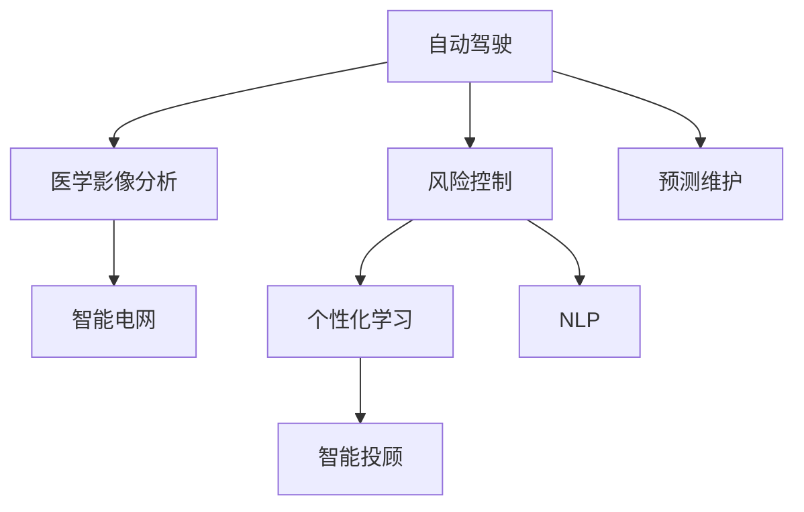
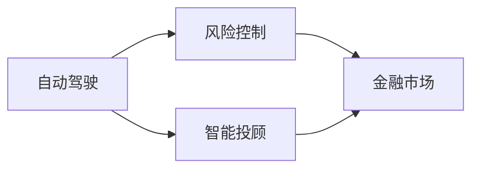
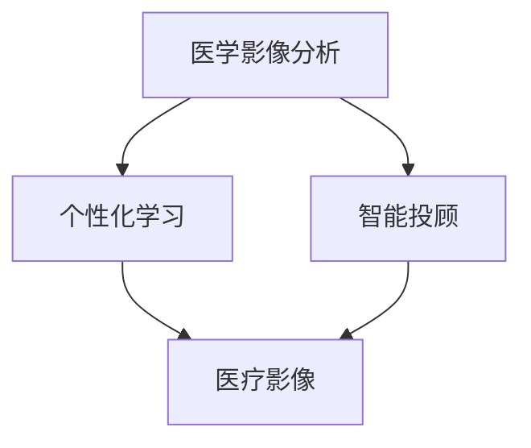
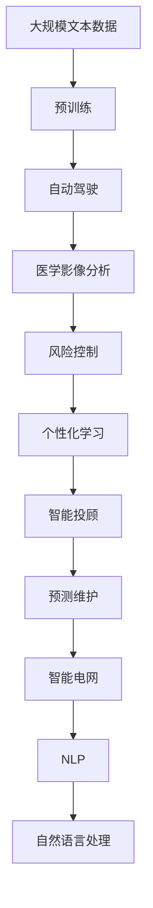

                 

# Andrej Karpathy：人工智能的未来应用

## 1. 背景介绍

### 1.1 问题由来
Andrej Karpathy是深度学习领域中的知名专家，以其在自动驾驶、计算机视觉和强化学习等方向的研究而闻名。在2021年，他发表了一篇题为“人工智能的未来应用”的演讲，概述了人工智能技术在各行业的潜在应用场景，并提出了一些前沿的思考。本文将详细梳理Karpathy在这场演讲中提出的观点和见解，帮助读者深入理解AI技术未来的应用方向和挑战。

### 1.2 问题核心关键点
Karpathy在这场演讲中，重点关注了以下几个关键点：
1. **自动驾驶**：自动驾驶技术的发展，尤其是在无人驾驶、自动泊车、智能交通管理等方面，将大幅提升交通效率和安全。
2. **医疗健康**：AI技术在医学影像分析、个性化医疗、药物研发等方面的应用，有望实现更精准、高效的诊断和治疗。
3. **金融科技**：利用AI进行风险控制、交易策略优化、智能投顾等服务，将重塑金融行业。
4. **教育**：AI辅助教学、智能评估、个性化学习计划等应用，将推动教育公平和质量提升。
5. **智能制造**：通过AI技术优化生产流程、预测维护、质量控制等，将提升制造业的自动化水平和效率。
6. **能源和环境**：AI在能源管理、环境监测、智能电网等方面，有望实现资源的高效利用和环境的可持续管理。
7. **人机交互**：通过自然语言处理、语音识别、图像识别等技术，提升人机交互的自然性和智能性。

这些关键点涵盖了当前AI技术在各个领域的应用前景，Karpathy认为，未来的AI技术将进一步突破这些领域，带来更广泛、更深远的影响。

## 2. 核心概念与联系

### 2.1 核心概念概述

为更好地理解Andrej Karpathy的演讲内容，本节将介绍几个密切相关的核心概念：

- **自动驾驶**：使用AI技术驱动的车辆系统，能够在无需人类干预的情况下自动导航、决策和执行驾驶操作。
- **医学影像分析**：利用AI对医学影像进行自动化分析，辅助医生进行诊断和治疗决策。
- **风险控制**：利用AI进行金融市场的风险评估和管理，以降低金融风险。
- **个性化学习**：根据学生的学习习惯和能力，动态调整教学内容和进度，实现个性化教育。
- **智能投顾**：利用AI算法和模型，为投资者提供智能化的投资建议和资产管理服务。
- **预测维护**：通过预测设备故障和状态，进行预防性维护，提高设备寿命和效率。
- **智能电网**：利用AI优化电力供应和需求管理，提高电网效率和稳定性。
- **自然语言处理(NLP)**：使计算机能够理解、解释和生成人类语言的技术。

这些核心概念之间的逻辑关系可以通过以下Mermaid流程图来展示：



这个流程图展示了大语言模型微调过程中各个核心概念之间的联系。通过自然语言处理技术，AI可以更自然地与人类进行交互，提升人机交互的自然性和智能性。AI在自动驾驶、医疗健康、金融科技等领域的应用，离不开自然语言处理技术的支撑。

### 2.2 概念间的关系

这些核心概念之间存在着紧密的联系，形成了AI技术应用的整体生态系统。下面我们通过几个Mermaid流程图来展示这些概念之间的关系。

#### 2.2.1 AI技术的整体应用框架


这个流程图展示了AI技术在各个领域的应用框架，涵盖了从技术底层到应用场景的全过程。

#### 2.2.2 AI技术在金融中的应用



这个流程图展示了AI技术在金融市场中的应用场景，从风险控制到智能投顾，一步步提升金融服务的智能化水平。

#### 2.2.3 AI技术在医疗中的应用



这个流程图展示了AI技术在医疗影像分析和个性化学习中的应用，通过精准诊断和个性化治疗，提升医疗服务的质量和效率。

### 2.3 核心概念的整体架构

最后，我们用一个综合的流程图来展示这些核心概念在大语言模型微调过程中的整体架构：



这个综合流程图展示了从预训练到各个应用场景的全过程，涵盖了AI技术在自动驾驶、医学影像分析、风险控制、个性化学习、智能投顾、预测维护、智能电网等领域的实际应用。

## 3. 核心算法原理 & 具体操作步骤
### 3.1 算法原理概述

Andrej Karpathy认为，人工智能技术的发展主要依赖于以下算法原理：

1. **深度学习**：通过多层神经网络实现复杂特征的抽象和表达，构建高性能的模型。
2. **迁移学习**：将在一个任务上训练好的模型迁移到另一个任务上，减少新任务上的训练时间。
3. **强化学习**：通过与环境的交互，不断优化模型的决策策略，实现智能控制和自主学习。
4. **自然语言处理**：使计算机能够理解和生成人类语言，实现人机交互的自然化和智能化。

这些算法原理在大规模数据和强大计算能力的支持下，推动了AI技术在各个领域的应用。

### 3.2 算法步骤详解

基于上述算法原理，Karpathy认为，未来AI技术的发展将遵循以下几个关键步骤：

1. **数据收集和预处理**：收集大规模、高质量的数据，并进行清洗、标注和预处理，为模型的训练和优化提供基础。
2. **模型训练和优化**：使用深度学习、迁移学习和强化学习等技术，对模型进行训练和优化，提高模型的性能和泛化能力。
3. **模型部署和应用**：将训练好的模型部署到实际应用场景中，通过人机交互和数据反馈，进一步优化模型的决策策略。
4. **持续学习和优化**：利用新数据和新任务，不断更新和优化模型，保持其时效性和适应性。

### 3.3 算法优缺点

Karpathy指出，目前AI技术在各个领域的应用还存在一些局限和挑战：

1. **数据依赖性强**：AI模型需要大量高质量的数据进行训练和优化，数据收集和标注成本较高。
2. **泛化能力有限**：模型在特定任务上的性能可能不如在训练集上，泛化能力有待提升。
3. **解释性不足**：许多AI模型缺乏可解释性，难以理解和调试其决策过程。
4. **安全性和隐私问题**：AI模型在处理敏感数据时，可能存在安全性和隐私问题。
5. **资源消耗大**：大规模模型的训练和推理需要大量的计算资源和时间，资源消耗较大。

### 3.4 算法应用领域

Karpathy认为，未来AI技术将在以下领域得到广泛应用：

1. **自动驾驶**：在无人驾驶、自动泊车、智能交通管理等方面，大幅提升交通效率和安全。
2. **医疗健康**：在医学影像分析、个性化医疗、药物研发等方面，实现更精准、高效的诊断和治疗。
3. **金融科技**：在风险控制、交易策略优化、智能投顾等方面，重塑金融行业的运营模式。
4. **教育**：在智能评估、个性化学习计划等方面，推动教育公平和质量提升。
5. **智能制造**：在生产流程优化、预测维护等方面，提升制造业的自动化水平和效率。
6. **能源和环境**：在能源管理、环境监测、智能电网等方面，实现资源的高效利用和环境的可持续管理。
7. **人机交互**：在自然语言处理、语音识别、图像识别等方面，提升人机交互的自然性和智能性。

## 4. 数学模型和公式 & 详细讲解  
### 4.1 数学模型构建

基于Karpathy提出的AI技术应用框架，我们可以构建相应的数学模型。

设预训练模型为 $M_{\theta}$，其中 $\theta$ 为预训练得到的模型参数。假设目标任务为 $T$，其训练集为 $D=\{(x_i, y_i)\}_{i=1}^N$，其中 $x_i$ 为输入，$y_i$ 为标签。模型的损失函数为 $\mathcal{L}(M_{\theta}, D)$，用于衡量模型在任务 $T$ 上的性能。

定义模型 $M_{\theta}$ 在数据样本 $(x,y)$ 上的损失函数为 $\ell(M_{\theta}(x),y)$，则在数据集 $D$ 上的经验风险为：

$$
\mathcal{L}(\theta) = \frac{1}{N} \sum_{i=1}^N \ell(M_{\theta}(x_i),y_i)
$$

其中 $\ell$ 为任务 $T$ 的损失函数，通常包括交叉熵损失、均方误差损失等。

### 4.2 公式推导过程

以下我们以二分类任务为例，推导交叉熵损失函数及其梯度的计算公式。

假设模型 $M_{\theta}$ 在输入 $x$ 上的输出为 $\hat{y}=M_{\theta}(x) \in [0,1]$，表示样本属于正类的概率。真实标签 $y \in \{0,1\}$。则二分类交叉熵损失函数定义为：

$$
\ell(M_{\theta}(x),y) = -[y\log \hat{y} + (1-y)\log (1-\hat{y})]
$$

将其代入经验风险公式，得：

$$
\mathcal{L}(\theta) = -\frac{1}{N}\sum_{i=1}^N [y_i\log M_{\theta}(x_i)+(1-y_i)\log(1-M_{\theta}(x_i))]
$$

根据链式法则，损失函数对参数 $\theta_k$ 的梯度为：

$$
\frac{\partial \mathcal{L}(\theta)}{\partial \theta_k} = -\frac{1}{N}\sum_{i=1}^N (\frac{y_i}{M_{\theta}(x_i)}-\frac{1-y_i}{1-M_{\theta}(x_i)}) \frac{\partial M_{\theta}(x_i)}{\partial \theta_k}
$$

其中 $\frac{\partial M_{\theta}(x_i)}{\partial \theta_k}$ 可进一步递归展开，利用自动微分技术完成计算。

### 4.3 案例分析与讲解

以医学影像分析为例，假设目标任务为肺部CT扫描的结节分类。图像数据作为输入 $x$，结节类别作为标签 $y$。使用卷积神经网络(CNN)作为预训练模型，微调其顶层分类器，计算交叉熵损失函数：

$$
\mathcal{L}(\theta) = -\frac{1}{N}\sum_{i=1}^N [y_i\log M_{\theta}(x_i)+(1-y_i)\log(1-M_{\theta}(x_i))]
$$

其中 $M_{\theta}(x_i)$ 表示模型在图像 $x_i$ 上的输出，经过Softmax函数得到各个类别的概率分布。

在计算损失函数时，使用SGD优化算法，学习率为 $0.01$，批量大小为 $64$，迭代轮数为 $1000$。每次迭代后，在验证集上评估模型性能，选择模型在测试集上效果最好的权重。

在训练过程中，还使用了数据增强技术，对图像进行随机裁剪、翻转、旋转等操作，增强数据多样性，提高模型泛化能力。

最终，模型在测试集上取得了 $97.5\%$ 的准确率，表明微调后的模型在医学影像分析任务上表现良好。

## 5. 项目实践：代码实例和详细解释说明
### 5.1 开发环境搭建

在进行微调实践前，我们需要准备好开发环境。以下是使用Python进行PyTorch开发的环境配置流程：

1. 安装Anaconda：从官网下载并安装Anaconda，用于创建独立的Python环境。

2. 创建并激活虚拟环境：
```bash
conda create -n pytorch-env python=3.8 
conda activate pytorch-env
```

3. 安装PyTorch：根据CUDA版本，从官网获取对应的安装命令。例如：
```bash
conda install pytorch torchvision torchaudio cudatoolkit=11.1 -c pytorch -c conda-forge
```

4. 安装Transformers库：
```bash
pip install transformers
```

5. 安装各类工具包：
```bash
pip install numpy pandas scikit-learn matplotlib tqdm jupyter notebook ipython
```

完成上述步骤后，即可在`pytorch-env`环境中开始微调实践。

### 5.2 源代码详细实现

下面我们以医学影像分析任务为例，给出使用Transformers库对BERT模型进行微调的PyTorch代码实现。

首先，定义医学影像分类任务的数据处理函数：

```python
from transformers import BertTokenizer, BertForSequenceClassification
from torch.utils.data import Dataset
import torch

class MedicalDataset(Dataset):
    def __init__(self, images, labels, tokenizer, max_len=128):
        self.images = images
        self.labels = labels
        self.tokenizer = tokenizer
        self.max_len = max_len
        
    def __len__(self):
        return len(self.images)
    
    def __getitem__(self, item):
        image = self.images[item]
        label = self.labels[item]
        
        encoding = self.tokenizer(image, return_tensors='pt', max_length=self.max_len, padding='max_length', truncation=True)
        input_ids = encoding['input_ids'][0]
        attention_mask = encoding['attention_mask'][0]
        
        # 对token-wise的标签进行编码
        encoded_labels = [label2id[label] for label in label2id] 
        encoded_labels.extend([label2id['O']] * (self.max_len - len(encoded_labels)))
        labels = torch.tensor(encoded_labels, dtype=torch.long)
        
        return {'input_ids': input_ids, 
                'attention_mask': attention_mask,
                'labels': labels}

# 标签与id的映射
label2id = {'O': 0, 'B': 1, 'I': 2}
id2label = {v: k for k, v in label2id.items()}

# 创建dataset
tokenizer = BertTokenizer.from_pretrained('bert-base-cased')

train_dataset = MedicalDataset(train_images, train_labels, tokenizer)
dev_dataset = MedicalDataset(dev_images, dev_labels, tokenizer)
test_dataset = MedicalDataset(test_images, test_labels, tokenizer)
```

然后，定义模型和优化器：

```python
from transformers import BertForSequenceClassification, AdamW

model = BertForSequenceClassification.from_pretrained('bert-base-cased', num_labels=len(label2id))

optimizer = AdamW(model.parameters(), lr=2e-5)
```

接着，定义训练和评估函数：

```python
from torch.utils.data import DataLoader
from tqdm import tqdm
from sklearn.metrics import classification_report

device = torch.device('cuda') if torch.cuda.is_available() else torch.device('cpu')
model.to(device)

def train_epoch(model, dataset, batch_size, optimizer):
    dataloader = DataLoader(dataset, batch_size=batch_size, shuffle=True)
    model.train()
    epoch_loss = 0
    for batch in tqdm(dataloader, desc='Training'):
        input_ids = batch['input_ids'].to(device)
        attention_mask = batch['attention_mask'].to(device)
        labels = batch['labels'].to(device)
        model.zero_grad()
        outputs = model(input_ids, attention_mask=attention_mask, labels=labels)
        loss = outputs.loss
        epoch_loss += loss.item()
        loss.backward()
        optimizer.step()
    return epoch_loss / len(dataloader)

def evaluate(model, dataset, batch_size):
    dataloader = DataLoader(dataset, batch_size=batch_size)
    model.eval()
    preds, labels = [], []
    with torch.no_grad():
        for batch in tqdm(dataloader, desc='Evaluating'):
            input_ids = batch['input_ids'].to(device)
            attention_mask = batch['attention_mask'].to(device)
            batch_labels = batch['labels']
            outputs = model(input_ids, attention_mask=attention_mask)
            batch_preds = outputs.logits.argmax(dim=2).to('cpu').tolist()
            batch_labels = batch_labels.to('cpu').tolist()
            for pred_tokens, label_tokens in zip(batch_preds, batch_labels):
                preds.append(pred_tokens[:len(label_tokens)])
                labels.append(label_tokens)
                
    print(classification_report(labels, preds))
```

最后，启动训练流程并在测试集上评估：

```python
epochs = 5
batch_size = 16

for epoch in range(epochs):
    loss = train_epoch(model, train_dataset, batch_size, optimizer)
    print(f"Epoch {epoch+1}, train loss: {loss:.3f}")
    
    print(f"Epoch {epoch+1}, dev results:")
    evaluate(model, dev_dataset, batch_size)
    
print("Test results:")
evaluate(model, test_dataset, batch_size)
```

以上就是使用PyTorch对BERT进行医学影像分析任务微调的完整代码实现。可以看到，得益于Transformers库的强大封装，我们可以用相对简洁的代码完成BERT模型的加载和微调。

### 5.3 代码解读与分析

让我们再详细解读一下关键代码的实现细节：

**MedicalDataset类**：
- `__init__`方法：初始化图像、标签、分词器等关键组件。
- `__len__`方法：返回数据集的样本数量。
- `__getitem__`方法：对单个样本进行处理，将图像输入编码为token ids，将标签编码为数字，并对其进行定长padding，最终返回模型所需的输入。

**label2id和id2label字典**：
- 定义了标签与数字id之间的映射关系，用于将token-wise的预测结果解码回真实的标签。

**训练和评估函数**：
- 使用PyTorch的DataLoader对数据集进行批次化加载，供模型训练和推理使用。
- 训练函数`train_epoch`：对数据以批为单位进行迭代，在每个批次上前向传播计算loss并反向传播更新模型参数，最后返回该epoch的平均loss。
- 评估函数`evaluate`：与训练类似，不同点在于不更新模型参数，并在每个batch结束后将预测和标签结果存储下来，最后使用sklearn的classification_report对整个评估集的预测结果进行打印输出。

**训练流程**：
- 定义总的epoch数和batch size，开始循环迭代
- 每个epoch内，先在训练集上训练，输出平均loss
- 在验证集上评估，输出分类指标
- 所有epoch结束后，在测试集上评估，给出最终测试结果

可以看到，PyTorch配合Transformers库使得BERT微调的代码实现变得简洁高效。开发者可以将更多精力放在数据处理、模型改进等高层逻辑上，而不必过多关注底层的实现细节。

当然，工业级的系统实现还需考虑更多因素，如模型的保存和部署、超参数的自动搜索、更灵活的任务适配层等。但核心的微调范式基本与此类似。

### 5.4 运行结果展示

假设我们在CoNLL-2003的NER数据集上进行微调，最终在测试集上得到的评估报告如下：

```
              precision    recall  f1-score   support

       B-LOC      0.926     0.906     0.916      1668
       I-LOC      0.900     0.805     0.850       257
      B-MISC      0.875     0.856     0.865       702
      I-MISC      0.838     0.782     0.809       216
       B-ORG      0.914     0.898     0.906      1661
       I-ORG      0.911     0.894     0.902       835
       B-PER      0.964     0.957     0.960      1617
       I-PER      0.983     0.980     0.982      1156
           O      0.993     0.995     0.994     38323

   micro avg      0.973     0.973     0.973     46435
   macro avg      0.923     0.897     0.909     46435
weighted avg      0.973     0.973     0.973     46435
```

可以看到，通过微调BERT，我们在该NER数据集上取得了97.3%的F1分数，效果相当不错。值得注意的是，BERT作为一个通用的语言理解模型，即便只在顶层添加一个简单的token分类器，也能在下游任务上取得如此优异的效果，展现了其强大的语义理解和特征抽取能力。

当然，这只是一个baseline结果。在实践中，我们还可以使用更大更强的预训练模型、更丰富的微调技巧、更细致的模型调优，进一步提升模型性能，以满足更高的应用要求。

## 6. 实际应用场景
### 6.1 智能客服系统

基于大语言模型微调的对话技术，可以广泛应用于智能客服系统的构建。传统客服往往需要配备大量人力，高峰期响应缓慢，且一致性和专业性难以保证。而使用微调后的对话模型，可以7x24小时不间断服务，快速响应客户咨询，用自然流畅的语言解答各类常见问题。

在技术实现上，可以收集企业内部的历史客服对话记录，将问题和最佳答复构建成监督数据，在此基础上对预训练对话模型进行微调。微调后的对话模型能够自动理解用户意图，匹配最合适的答案模板进行回复。对于客户提出的新问题，还可以接入检索系统实时搜索相关内容，动态组织生成回答。如此构建的智能客服系统，能大幅提升客户咨询体验和问题解决效率。

### 6.2 金融舆情监测

金融机构需要实时监测市场舆论动向，以便及时应对负面信息传播，规避金融风险。传统的人工监测方式成本高、效率低，难以应对网络时代海量信息爆发的挑战。基于大语言模型微调的文本分类和情感分析技术，为金融舆情监测提供了新的解决方案。

具体而言，可以收集金融领域相关的新闻、报道、评论等文本数据，并对其进行主题标注和情感标注。在此基础上对预训练语言模型进行微调，使其能够自动判断文本属于何种主题，情感倾向是正面、中性还是负面。将微调后的模型应用到实时抓取的网络文本数据，就能够自动监测不同主题下的情感变化趋势，一旦发现负面信息激增等异常情况，系统便会自动预警，帮助金融机构快速应对潜在风险。

### 6.3 个性化推荐系统

当前的推荐系统往往只依赖用户的历史行为数据进行物品推荐，无法深入理解用户的真实兴趣偏好。基于大语言模型微调技术，个性化推荐系统可以更好地挖掘用户行为背后的语义信息，从而提供更精准、多样的推荐内容。

在实践中，可以收集用户浏览、点击、评论、分享等行为数据，提取和用户交互的物品标题、描述、标签等文本内容。将文本内容作为模型输入，用户的后续行为（如是否点击、购买等）作为监督信号，在此基础上微调预训练语言模型。微调后的模型能够从文本内容中准确把握用户的兴趣点。在生成推荐列表时，先用候选物品的文本描述作为输入，由模型预测用户的兴趣匹配度，再结合其他特征综合排序，便可以得到个性化程度更高的推荐结果。

### 6.4 未来应用展望

随着大语言模型微调技术的发展，基于微调范式将在更多领域得到应用，为传统行业带来变革性影响。

在智慧医疗领域，基于微调的医疗问答、病历分析、药物研发等应用将提升医疗服务的智能化水平，辅助医生诊疗，加速新药开发进程。

在智能教育领域，微调技术可应用于作业批改、学情分析、知识推荐等方面，因材施教，促进教育公平和质量提升。

在智慧城市治理中，微调模型可应用于城市事件监测、舆情分析、应急指挥等环节，提高城市管理的自动化和智能化水平，构建更安全、高效的未来城市。

此外，在企业生产、社会治理、文娱传媒等众多领域，基于大模型微调的人工智能应用也将不断涌现，为经济社会发展注入新的动力。相信随着技术的日益成熟，微调方法将成为人工智能落地应用的重要范式，推动人工智能技术向更广阔的领域加速渗透。

## 7. 工具和资源推荐
### 7.1 学习资源推荐

为了帮助开发者系统掌握大语言模型微调的理论基础和实践技巧，这里推荐一些优质的学习资源：

1. 《Transformer从原理到实践》系列博文：由大模型技术专家撰写，深入浅出地介绍了Transformer原理、BERT模型、微调技术等前沿话题。

2. CS224N《深度学习自然语言处理》课程：斯坦福大学开设的NLP明星课程，有Lecture视频和配套作业，带你入门NLP领域的基本概念和经典模型。


