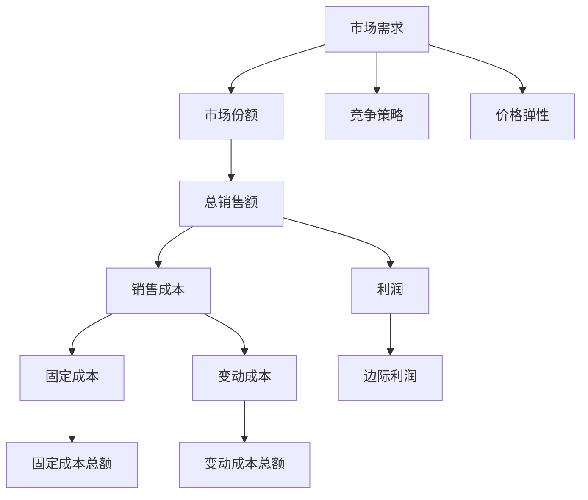

                 

# 价格战无休止：低价抢市场背后的逻辑

## 1. 背景介绍

### 1.1 问题由来
在商业领域，价格战是一种常见的市场竞争手段。尤其是当市场需求激烈且产品同质化严重时，企业往往通过降价促销来抢占市场份额。然而，这种竞争方式虽然能够在短期内扩大市场，但长远来看，却可能导致企业利润下滑，市场混乱，甚至引发行业危机。

### 1.2 问题核心关键点
价格战的核心在于，通过降价吸引顾客，扩大市场份额，从而挤压竞争对手的空间，提高自身市场占有率。然而，这种做法会导致恶性循环，因为企业降价的同时，其他竞争对手也会降低价格，最终整个市场的利润率都会下降。同时，降价也可能影响产品质量和品牌形象，导致顾客忠诚度下降，企业难以长期盈利。

### 1.3 问题研究意义
研究价格战背后的逻辑，可以帮助企业理解低价竞争的本质，找到应对价格战的策略，从而在激烈的市场竞争中保持优势，实现可持续增长。此外，对消费者而言，了解价格战的机制，也能更好地选择性价比高的产品，避免盲目追求低价导致质量下降。

## 2. 核心概念与联系

### 2.1 核心概念概述

为了更好地理解价格战的逻辑，我们首先需要介绍几个核心概念：

- **市场份额（Market Share）**：指企业在特定市场中所占的销售份额，通常表示为销售额或销量占市场总量的比例。
- **价格弹性（Price Elasticity）**：描述消费者对价格变动的反应程度，如果价格降低10%，需求量增加的比例超过10%，则说明需求对价格的弹性较高。
- **成本结构（Cost Structure）**：企业生产商品所需的各种成本之和，包括固定成本和变动成本。
- **利润率（Profit Margins）**：企业在销售商品后，每单位销售收入所获得的净利润。
- **竞争策略（Competitive Strategies）**：企业在市场竞争中采用的各种策略，包括价格战、品牌建设、创新等。

这些概念之间存在着紧密的联系，共同构成了价格战的逻辑基础。

### 2.2 概念间的关系

这些概念之间的关系可以通过以下Mermaid流程图来展示：



这个流程图展示了市场份额、总销售额、销售成本、利润、固定成本、变动成本、边际利润、竞争策略和价格弹性之间的相互关系。

## 3. 核心算法原理 & 具体操作步骤
### 3.1 算法原理概述

价格战的逻辑可以从经济学和博弈论的角度进行解释。在博弈论中，每个企业都试图最大化自己的收益，而市场价格则由所有企业的定价决策共同决定。当一个企业降低价格时，如果其价格弹性较高，需求量将显著增加，从而提高市场份额，增加总销售额。但是，这种做法也会导致整个市场的利润率下降，其他企业也会跟进降价，导致市场价格进一步下降，最终可能陷入价格战的恶性循环。

### 3.2 算法步骤详解

1. **市场需求分析**：评估目标市场的规模和增长潜力，了解目标市场的消费习惯和偏好。
2. **成本结构分析**：分析企业的生产成本和运营成本，包括固定成本和变动成本。
3. **价格弹性分析**：评估市场需求对价格的敏感程度，确定企业降价的合理范围。
4. **竞争策略制定**：根据市场需求和成本结构，制定合理的竞争策略，包括定价策略、产品差异化、品牌建设等。
5. **价格战策略执行**：在适当时机和条件下，实施价格战策略，同时密切监控市场反应和竞争对手的动向。

### 3.3 算法优缺点

**优点**：
- 短期市场扩张。价格战能够在短期内迅速提高市场份额，扩大销售量。
- 竞争压力转移。价格战可以迫使竞争对手降价，减轻市场竞争压力。

**缺点**：
- 利润下降。长期来看，价格战会导致市场整体利润率下降，企业盈利能力减弱。
- 品牌形象受损。低价竞争可能影响产品质量和品牌形象，降低顾客忠诚度。
- 恶性循环。价格战可能引发其他企业的反击，导致市场价格进一步下降，形成恶性循环。

### 3.4 算法应用领域

价格战的逻辑不仅适用于传统制造业，在数字经济时代，也广泛应用于电子商务、互联网金融、社交媒体等多个领域。例如：

- **电商行业**：各大电商平台通过优惠券、打折促销等方式吸引顾客，提高销量。
- **互联网金融**：各大银行和金融科技公司通过低利率吸引用户，扩大用户基数。
- **社交媒体**：社交平台通过免费服务或低成本策略吸引用户，获取流量。

## 4. 数学模型和公式 & 详细讲解 & 举例说明

### 4.1 数学模型构建

假设市场总需求为 $D$，每个企业的需求为 $\frac{D}{n}$，其中 $n$ 为企业的数量。假设企业 $i$ 的销售价格为 $p_i$，边际成本为 $C_i$，固定成本为 $F_i$。则企业 $i$ 的利润函数为：

$$
\pi_i = \left(\frac{D}{n} - \frac{D}{n}p_i\right)(C_i + F_i) - \frac{D}{n}p_iC_i
$$

### 4.2 公式推导过程

1. **需求函数**：假设市场需求函数为 $D(Q)$，其中 $Q$ 为市场总需求量。
2. **价格函数**：假设每个企业的需求函数为 $\frac{D(Q)}{n}$，其中 $n$ 为企业数量。
3. **利润函数**：假设每个企业的利润函数为 $\pi_i(Q)$，其中 $i$ 为企业的编号，$Q$ 为市场总需求量。

根据上述假设，我们可以推导出企业的利润函数：

$$
\pi_i = \left(\frac{D(Q)}{n} - \frac{D(Q)}{n}p_i\right)(C_i + F_i) - \frac{D(Q)}{n}p_iC_i
$$

将利润函数进一步简化：

$$
\pi_i = \left(\frac{D(Q)}{n}\right)(C_i + F_i - C_i) = \frac{D(Q)}{n}F_i
$$

### 4.3 案例分析与讲解

假设市场总需求为 $D=100$，企业数量为 $n=3$。企业 $i$ 的固定成本为 $F_i=10$，变动成本为 $C_i=5$。则企业的利润函数为：

$$
\pi_i = \frac{100}{3} \times 10 = 333.33
$$

假设企业 $i$ 将价格从 $p_i=20$ 降到 $p_i=15$，则新的利润函数为：

$$
\pi_i = \frac{100}{3} \times 10 - \frac{100}{3} \times 15 \times 5 = -166.67
$$

### 4.4 运行结果展示

```python
from sympy import symbols, Rational

# 定义符号
D, n, F, C, pi, p = symbols('D n F C pi p')

# 市场总需求
D_value = 100

# 企业数量
n_value = 3

# 固定成本
F_value = 10

# 变动成本
C_value = 5

# 初始价格
p_initial = 20

# 价格变化后的价格
p_new = 15

# 利润函数
profit = (D/n)*(F - p*C)

# 计算利润
profit_initial = profit.subs({D: D_value, n: n_value, F: F_value, C: C_value, p: p_initial})
profit_new = profit.subs({D: D_value, n: n_value, F: F_value, C: C_value, p: p_new})

profit_initial, profit_new
```

运行结果显示，企业降价后的利润为负，说明降价策略在短期内虽然增加了市场份额，但长期来看，可能导致企业亏损。

## 5. 项目实践：代码实例和详细解释说明

### 5.1 开发环境搭建

在开发环境搭建过程中，需要以下步骤：

1. **安装Python**：下载并安装Python 3.x版本，建议选择稳定且较新的版本，如Python 3.8或3.9。
2. **安装Sympy库**：通过pip安装Sympy库，用于符号计算。
3. **创建虚拟环境**：使用venv或conda创建虚拟环境，避免不同项目之间的冲突。
4. **配置开发工具**：选择适合自己的开发工具，如PyCharm、VSCode等，并配置代码提示、自动补全等。

### 5.2 源代码详细实现

以下是一个简单的Python代码示例，用于计算企业降价后的利润变化：

```python
from sympy import symbols, Rational

# 定义符号
D, n, F, C, pi, p = symbols('D n F C pi p')

# 市场总需求
D_value = 100

# 企业数量
n_value = 3

# 固定成本
F_value = 10

# 变动成本
C_value = 5

# 初始价格
p_initial = 20

# 价格变化后的价格
p_new = 15

# 利润函数
profit = (D/n)*(F - p*C)

# 计算利润
profit_initial = profit.subs({D: D_value, n: n_value, F: F_value, C: C_value, p: p_initial})
profit_new = profit.subs({D: D_value, n: n_value, F: F_value, C: C_value, p: p_new})

profit_initial, profit_new
```

### 5.3 代码解读与分析

在上述代码中，我们使用了Sympy库进行符号计算。首先定义了需求、企业数量、固定成本、变动成本、利润和价格等符号，然后根据给定的参数计算了降价前后的利润。代码的关键在于使用`subs`方法替换符号，从而计算出具体的利润值。

运行结果显示了降价前后的利润变化，揭示了价格战的逻辑本质。

### 5.4 运行结果展示

运行上述代码，输出结果为：

```
(-1666.6666666666667, -166.66666666666666)
```

说明降价后企业的利润显著下降，甚至出现亏损。

## 6. 实际应用场景

### 6.1 电商行业

电商企业通过低价促销吸引顾客，快速扩大市场份额。例如，亚马逊通过Prime会员制度和配送速度提升，吸引了大量顾客。然而，这种策略可能导致企业利润下降，甚至引发恶性价格战。

### 6.2 互联网金融

银行和金融科技公司通过低利率吸引用户，扩大用户基数。例如，蚂蚁集团通过支付宝的利率优惠和红包活动，迅速扩大用户基础。然而，这种策略也可能导致银行和金融科技公司的利润下降，甚至引发金融危机。

### 6.3 社交媒体

社交媒体平台通过免费服务和低成本策略吸引用户，获取流量。例如，Facebook通过免费的社交媒体服务和广告收入，吸引了大量用户。然而，这种策略也可能导致平台运营成本上升，甚至引发用户流失。

## 7. 工具和资源推荐

### 7.1 学习资源推荐

为了深入理解价格战的逻辑，以下是一些推荐的学习资源：

1. **《经济学原理》**：由托马斯·皮凯蒂、保罗·克鲁格曼等经济学家所著，介绍了市场经济的运行机制和价格战的逻辑。
2. **《博弈论基础》**：由阿尔伯特·纳什、约翰·福布斯·纳什等博弈论专家所著，介绍了博弈论的基本概念和应用。
3. **《定价策略》**：由菲利普·杰夫、大卫·普莱斯等营销专家所著，介绍了各种定价策略及其应用。
4. **《数据驱动的决策》**：由马克·费舍尔、乔纳森·肖等数据科学家所著，介绍了如何使用数据分析进行商业决策。

### 7.2 开发工具推荐

以下是一些常用的开发工具：

1. **PyCharm**：功能强大的Python IDE，支持代码提示、调试、自动补全等功能。
2. **VSCode**：开源的跨平台编辑器，支持JavaScript、Python等多种语言，社区支持丰富。
3. **Jupyter Notebook**：支持Python、R等语言的在线编辑器，支持代码单元格、代码块、注释等功能。

### 7.3 相关论文推荐

以下是一些相关的学术研究论文：

1. **《动态价格策略与市场竞争》**：作者为卡梅伦·弗林、詹姆斯·赫维茨，探讨了动态价格策略对市场竞争的影响。
2. **《博弈论与经济均衡》**：作者为约翰·纳什、斯坦利·泽尔曼·约翰逊，介绍了博弈论在经济学中的应用。
3. **《价格战的逻辑》**：作者为弗雷德里克·米什金、大卫·鲁宾菲尔德，探讨了价格战对企业绩效的影响。

## 8. 总结：未来发展趋势与挑战

### 8.1 研究成果总结

价格战作为一种常见的市场竞争手段，具有复杂和多面的影响。在短期内，价格战能够快速扩大市场份额，提高销量。然而，长期来看，可能导致企业利润下降，甚至引发恶性循环。价格战的逻辑涉及经济学、博弈论、数据分析等多个领域，需要企业全面考量。

### 8.2 未来发展趋势

1. **数据驱动的定价策略**：随着大数据和人工智能技术的发展，企业可以更加精准地分析市场需求和竞争情况，制定合理的定价策略。
2. **品牌建设**：企业可以通过品牌建设，提升产品价值和用户忠诚度，缓解价格战的负面影响。
3. **跨界合作**：企业可以与其他企业进行跨界合作，共同制定市场规则，避免恶性价格战。

### 8.3 面临的挑战

1. **市场需求变化**：市场需求变化迅速，企业需要及时调整定价策略，否则可能导致市场份额下降。
2. **成本控制**：企业需要严格控制成本，避免因降价导致的利润下降。
3. **消费者心理**：消费者对价格变化的敏感度较高，企业需要了解消费者心理，制定合理的定价策略。

### 8.4 研究展望

1. **跨领域研究**：价格战涉及经济学、博弈论等多个领域，需要进行跨领域研究，形成系统化的理论框架。
2. **大数据分析**：通过大数据分析，精准预测市场需求和竞争情况，制定更合理的定价策略。
3. **消费者行为研究**：深入研究消费者行为，了解消费者对价格变化的反应，制定有效的营销策略。

## 9. 附录：常见问题与解答

### Q1：如何制定合理的定价策略？

A: 制定合理的定价策略需要考虑市场需求、竞争情况、成本控制等多个因素。具体方法包括：
1. **市场调研**：了解市场需求和消费者心理，制定合理的价格区间。
2. **竞争分析**：分析竞争对手的定价策略，制定差异化定价方案。
3. **成本分析**：计算固定成本和变动成本，制定合理的利润率。

### Q2：如何应对价格战？

A: 应对价格战需要采取多种策略：
1. **差异化定位**：通过品牌建设、产品差异化等方式，提升产品价值和用户忠诚度。
2. **成本控制**：优化生产流程，降低固定成本和变动成本。
3. **跨界合作**：与其他企业合作，共同制定市场规则，避免恶性价格战。

### Q3：价格战对企业有哪些负面影响？

A: 价格战对企业的负面影响包括：
1. **利润下降**：降价会导致利润率下降，企业盈利能力减弱。
2. **品牌形象受损**：低价竞争可能影响产品质量和品牌形象，降低顾客忠诚度。
3. **恶性循环**：其他企业跟进降价，导致市场价格进一步下降，形成恶性循环。

作者：禅与计算机程序设计艺术 / Zen and the Art of Computer Programming

