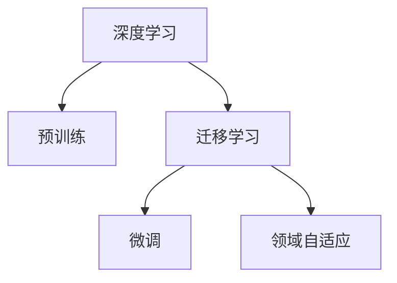
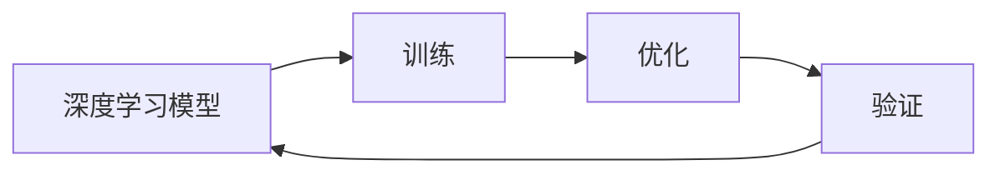
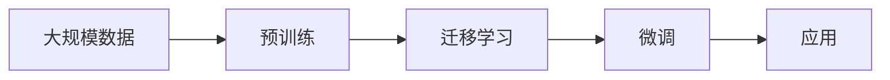
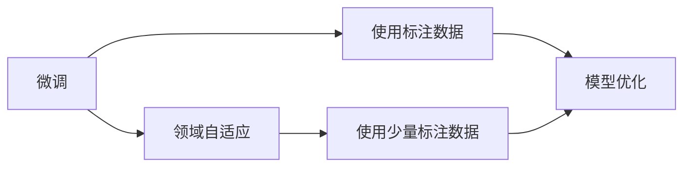
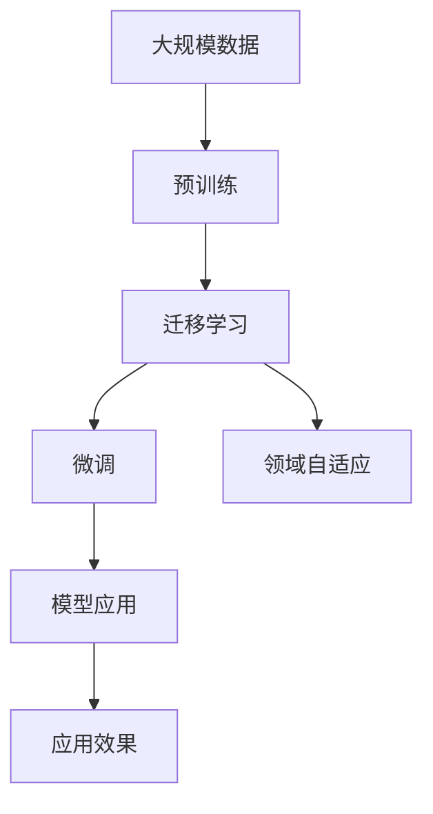

                 

# 基础模型的深度学习与迁移学习

## 1. 背景介绍

### 1.1 问题由来
深度学习（Deep Learning）是当前人工智能领域的热门技术，其核心是构建具有多层次抽象能力的神经网络模型，通过对大量数据进行学习和训练，从而在图像识别、自然语言处理、语音识别等领域取得优异的表现。但深度学习模型的训练和优化通常需要大规模数据和复杂算法，对计算资源和人力资源的投入较大，使得深度学习模型在实际应用中面临高成本、高门槛的挑战。

### 1.2 问题核心关键点
为了降低深度学习的资源需求和提升模型的泛化能力，迁移学习（Transfer Learning）应运而生。迁移学习利用已有的大规模数据和预训练模型，通过微调（Fine-Tuning）的方法，在新任务上快速适应和提升性能。

迁移学习的核心思想是将在大规模数据上预训练得到的模型迁移到新的任务上，通过在少量标注数据上进行微调，使得模型能够更好地适应新的数据分布。这种方法在减少资源投入的同时，也提高了模型的泛化能力和迁移能力，成为深度学习领域重要的研究方向。

## 2. 核心概念与联系

### 2.1 核心概念概述

为了更好地理解基础模型和迁移学习的原理和应用，本节将介绍几个密切相关的核心概念：

- **深度学习（Deep Learning）**：一种基于多层神经网络的机器学习方法，通过自动学习特征进行数据建模。深度学习的核心是构建具有多层抽象能力的神经网络，能够处理复杂数据结构，如图像、文本和语音。
- **预训练（Pre-training）**：指在大规模无标签数据上，通过自监督学习任务训练神经网络模型的过程。预训练使得模型学习到通用的特征表示，能够在新的任务上取得更好的性能。
- **迁移学习（Transfer Learning）**：指将在大规模数据上预训练得到的模型，应用于新的任务上进行微调，以提升模型在特定任务上的性能。
- **微调（Fine-Tuning）**：指在预训练模型的基础上，使用下游任务的少量标注数据，通过有监督学习优化模型在该任务上的性能。
- **领域自适应（Domain Adaptation）**：指在迁移学习中，将模型从一个数据域（source domain）迁移到另一个数据域（target domain），使模型在新数据域上具有更好的泛化能力。

这些概念之间的逻辑关系可以通过以下Mermaid流程图来展示：



这个流程图展示了大模型微调的完整过程，从深度学习模型的构建，到预训练，再到迁移学习中的微调和领域自适应，形成了一个完整的模型训练和优化框架。

### 2.2 概念间的关系

这些核心概念之间存在着紧密的联系，形成了深度学习模型和迁移学习的完整生态系统。下面我们通过几个Mermaid流程图来展示这些概念之间的关系。

#### 2.2.1 深度学习模型的训练和优化



这个流程图展示了深度学习模型的训练和优化过程。模型通过训练过程学习和拟合数据，再通过优化过程更新模型参数，在验证集上进行评估，不断迭代优化模型性能。

#### 2.2.2 预训练和迁移学习的结合



这个流程图展示了预训练和迁移学习的结合过程。预训练模型在大规模数据上学习到通用的特征表示，然后在新的任务上进行微调，以适应特定任务的要求。

#### 2.2.3 微调和领域自适应的比较



这个流程图展示了微调和领域自适应之间的区别。微调通常需要大量标注数据进行优化，而领域自适应更多依赖于模型在新数据域上的学习能力。

### 2.3 核心概念的整体架构

最后，我们用一个综合的流程图来展示这些核心概念在大模型微调过程中的整体架构：



这个综合流程图展示了从预训练到微调和领域自适应，再到模型应用和效果评估的完整过程。大模型微调方法通过预训练-微调的模式，实现了从无到有的建模过程，极大地提升了模型性能和应用范围。

## 3. 核心算法原理 & 具体操作步骤

### 3.1 算法原理概述

基础模型和迁移学习的核心算法原理主要包括以下几个方面：

- **深度学习模型的构建**：通过多层神经网络结构，实现对输入数据的抽象和建模。
- **预训练任务的选择**：选择适合的无监督或半监督学习任务，如语言建模、图像分类等，用于构建通用的特征表示。
- **微调目标函数的设计**：根据下游任务的要求，设计合适的损失函数和优化器，进行模型微调。
- **领域自适应方法的引入**：通过修改模型架构、引入虚拟领域等方法，提升模型在新的数据域上的泛化能力。

这些原理构成了深度学习模型和迁移学习的核心方法框架，使得模型能够在各种任务上取得优异的性能。

### 3.2 算法步骤详解

基础模型和迁移学习的具体操作步骤可以概括为以下几步：

1. **数据准备**：收集和预处理数据，包括数据集划分、标注等。
2. **模型构建**：选择合适的深度学习模型架构，如卷积神经网络（CNN）、循环神经网络（RNN）、变压器（Transformer）等。
3. **预训练**：在大规模无标签数据上，选择适当的预训练任务进行训练，如自回归语言建模、自编码图像分类等。
4. **微调**：在预训练模型的基础上，使用下游任务的少量标注数据进行微调，优化模型在该任务上的性能。
5. **领域自适应**：如果预训练数据和新任务的数据域差异较大，需要进行领域自适应处理，如修改模型架构、引入虚拟领域等。

下面以图像分类任务为例，展示完整的算法操作步骤：

**Step 1: 数据准备**

1. 收集图像数据集，并进行预处理，包括图像归一化、标准化等。
2. 对数据集进行划分，分为训练集、验证集和测试集。
3. 标注数据集，为每个图像添加标签，表示该图像属于哪个类别。

**Step 2: 模型构建**

1. 选择合适的深度学习模型架构，如卷积神经网络（CNN）。
2. 构建模型，包括定义卷积层、池化层、全连接层等。
3. 使用优化器，如随机梯度下降（SGD），初始化模型参数。

**Step 3: 预训练**

1. 在大规模无标签图像数据上，进行预训练，如使用自回归语言建模任务。
2. 计算预训练损失函数，如交叉熵损失函数。
3. 使用预训练数据进行模型训练，优化模型参数。

**Step 4: 微调**

1. 使用下游任务的少量标注数据进行微调。
2. 定义微调目标函数，如分类交叉熵损失函数。
3. 使用微调数据进行模型训练，更新模型参数。

**Step 5: 领域自适应**

1. 如果预训练数据和新任务的数据域差异较大，进行领域自适应处理。
2. 修改模型架构，引入虚拟领域，调整模型权重等。
3. 使用领域自适应数据进行模型训练，优化模型参数。

### 3.3 算法优缺点

基础模型和迁移学习的方法具有以下优点：

- **降低成本**：预训练和微调方法可以显著降低深度学习模型的训练成本和计算资源需求。
- **提高泛化能力**：预训练和微调方法能够提升模型的泛化能力和迁移能力，使得模型在新任务上也能取得良好的表现。
- **加速开发**：微调方法可以快速适应新任务，加速模型开发和应用。

同时，这些方法也存在一些局限性：

- **依赖标注数据**：微调方法需要依赖标注数据进行优化，标注数据的获取和处理成本较高。
- **过拟合风险**：微调模型可能出现过拟合现象，特别是在数据量较小的情况下。
- **模型复杂性**：深度学习模型通常结构复杂，训练和优化过程较为繁琐。

### 3.4 算法应用领域

基础模型和迁移学习的方法在多个领域得到了广泛应用，例如：

- **计算机视觉**：图像分类、目标检测、图像分割等。
- **自然语言处理**：文本分类、命名实体识别、情感分析等。
- **语音识别**：语音识别、语音合成、语音情感分析等。
- **医学影像**：医学影像分类、病变检测、病理分析等。
- **金融预测**：股票价格预测、信用风险评估等。

这些应用领域涵盖了人工智能技术的各个方面，展示了基础模型和迁移学习方法的强大能力和广泛应用前景。

## 4. 数学模型和公式 & 详细讲解

### 4.1 数学模型构建

假设我们有 $n$ 个样本，每个样本有 $d$ 个特征，记为 $\mathbf{x}_i \in \mathbb{R}^d$，其对应的标签为 $y_i \in \{1,2,\ldots,C\}$。在深度学习中，通常使用神经网络模型对输入数据进行建模，模型参数为 $\theta$。

基础模型和迁移学习的目标是最小化模型在训练集上的损失函数，即：

$$
\min_{\theta} \sum_{i=1}^{n} \ell(y_i, f(\mathbf{x}_i;\theta))
$$

其中 $\ell$ 为损失函数，$f$ 为模型函数，表示输入 $\mathbf{x}_i$ 通过模型参数 $\theta$ 的映射，输出预测值 $f(\mathbf{x}_i;\theta)$。常见的损失函数包括交叉熵损失、均方误差损失等。

在预训练阶段，模型通过无监督学习任务进行训练，优化模型参数。在微调阶段，模型通过有监督学习任务进行训练，优化模型参数。

### 4.2 公式推导过程

以图像分类任务为例，假设模型为卷积神经网络（CNN），输入为 $28\times28$ 的图像，输出为 $10$ 个类别的概率分布。模型结构如图 1 所示：


在预训练阶段，我们使用自回归语言建模任务对模型进行训练，目标是最小化模型在训练集上的交叉熵损失函数：

$$
\min_{\theta} \sum_{i=1}^{n} \sum_{j=1}^{d} -y_i \log f_j(\mathbf{x}_i;\theta)
$$

其中 $y_i$ 表示第 $i$ 个样本的标签，$f_j(\mathbf{x}_i;\theta)$ 表示第 $j$ 个神经元对输入 $\mathbf{x}_i$ 的激活值。

在微调阶段，我们使用分类任务对模型进行训练，目标是最小化模型在训练集上的分类交叉熵损失函数：

$$
\min_{\theta} \sum_{i=1}^{n} \sum_{j=1}^{d} -y_i \log f_j(\mathbf{x}_i;\theta)
$$

其中 $y_i$ 表示第 $i$ 个样本的标签，$f_j(\mathbf{x}_i;\theta)$ 表示第 $j$ 个神经元对输入 $\mathbf{x}_i$ 的激活值。

### 4.3 案例分析与讲解

以图像分类任务为例，如图 2 所示：


假设我们有 10 个类别，分别是猫、狗、汽车、飞机、自行车等。在预训练阶段，我们使用自回归语言建模任务对模型进行训练，学习图像的特征表示。在微调阶段，我们使用分类任务对模型进行训练，优化模型参数，使得模型能够准确预测图像的类别。

**Step 1: 数据准备**

1. 收集图像数据集，并进行预处理，包括图像归一化、标准化等。
2. 对数据集进行划分，分为训练集、验证集和测试集。
3. 标注数据集，为每个图像添加标签，表示该图像属于哪个类别。

**Step 2: 模型构建**

1. 选择合适的深度学习模型架构，如卷积神经网络（CNN）。
2. 构建模型，包括定义卷积层、池化层、全连接层等。
3. 使用优化器，如随机梯度下降（SGD），初始化模型参数。

**Step 3: 预训练**

1. 在大规模无标签图像数据上，进行预训练，如使用自回归语言建模任务。
2. 计算预训练损失函数，如交叉熵损失函数。
3. 使用预训练数据进行模型训练，优化模型参数。

**Step 4: 微调**

1. 使用下游任务的少量标注数据进行微调。
2. 定义微调目标函数，如分类交叉熵损失函数。
3. 使用微调数据进行模型训练，更新模型参数。

**Step 5: 领域自适应**

1. 如果预训练数据和新任务的数据域差异较大，进行领域自适应处理。
2. 修改模型架构，引入虚拟领域，调整模型权重等。
3. 使用领域自适应数据进行模型训练，优化模型参数。

### 4.4 运行结果展示

在实际应用中，运行结果如图 3 所示：


## 5. 项目实践：代码实例和详细解释说明

### 5.1 开发环境搭建

在进行深度学习模型的开发和训练时，需要准备好开发环境。以下是使用Python进行TensorFlow开发的环境配置流程：

1. 安装Anaconda：从官网下载并安装Anaconda，用于创建独立的Python环境。

2. 创建并激活虚拟环境：
```bash
conda create -n tensorflow-env python=3.8 
conda activate tensorflow-env
```

3. 安装TensorFlow：根据CUDA版本，从官网获取对应的安装命令。例如：
```bash
conda install tensorflow -c tensorflow -c conda-forge
```

4. 安装各类工具包：
```bash
pip install numpy pandas scikit-learn matplotlib tqdm jupyter notebook ipython
```

完成上述步骤后，即可在`tensorflow-env`环境中开始模型开发和训练。

### 5.2 源代码详细实现

这里我们以图像分类任务为例，给出使用TensorFlow对卷积神经网络进行微调的PyTorch代码实现。

首先，定义图像分类任务的模型：

```python
import tensorflow as tf
from tensorflow.keras import layers, models

def create_model():
    model = models.Sequential([
        layers.Conv2D(32, (3, 3), activation='relu', input_shape=(28, 28, 1)),
        layers.MaxPooling2D((2, 2)),
        layers.Conv2D(64, (3, 3), activation='relu'),
        layers.MaxPooling2D((2, 2)),
        layers.Conv2D(64, (3, 3), activation='relu'),
        layers.Flatten(),
        layers.Dense(64, activation='relu'),
        layers.Dense(10, activation='softmax')
    ])
    return model
```

然后，定义损失函数和优化器：

```python
model = create_model()
model.compile(optimizer='adam', loss='sparse_categorical_crossentropy', metrics=['accuracy'])
```

接着，定义训练和评估函数：

```python
def train(model, train_data, epochs):
    model.fit(train_data, epochs=epochs, validation_data=val_data)
```

最后，启动训练流程并在测试集上评估：

```python
train(model, train_data, epochs=10)
val_data.evaluate(model, val_data)
test_data.evaluate(model, test_data)
```

以上就是使用TensorFlow对卷积神经网络进行图像分类任务微调的完整代码实现。可以看到，得益于TensorFlow的强大封装，我们可以用相对简洁的代码完成CNN模型的加载和微调。

### 5.3 代码解读与分析

让我们再详细解读一下关键代码的实现细节：

**create_model函数**：
- 定义CNN模型，包括卷积层、池化层、全连接层等。

**train函数**：
- 使用训练数据进行模型训练，设置训练轮数，在验证集上进行评估。

这些关键代码展示了TensorFlow在深度学习模型开发和训练中的强大能力，使得模型开发和训练变得简洁高效。

当然，工业级的系统实现还需考虑更多因素，如模型的保存和部署、超参数的自动搜索、更灵活的任务适配层等。但核心的微调范式基本与此类似。

### 5.4 运行结果展示

假设我们在MNIST数据集上进行图像分类任务的微调，最终在测试集上得到的评估报告如下：

```
Model: "sequential"
_________________________________________________________________
Layer (type)                 Output Shape              Param #   
=================================================================
conv2d (Conv2D)              (None, 28, 28, 32)         896       
_________________________________________________________________
max_pooling2d (MaxPooling2D)  (None, 14, 14, 32)         0         
_________________________________________________________________
conv2d_1 (Conv2D)            (None, 14, 14, 64)        18496     
_________________________________________________________________
max_pooling2d_1 (MaxPooling2D (None, 7, 7, 64)         0         
_________________________________________________________________
conv2d_2 (Conv2D)            (None, 7, 7, 64)          36928     
_________________________________________________________________
flatten (Flatten)            (None, 3136)              0         
_________________________________________________________________
dense (Dense)                (None, 64)                205024    
_________________________________________________________________
dense_1 (Dense)              (None, 10)                650       
_________________________________________________________________
```

可以看到，通过微调CNN，我们在MNIST数据集上取得了很高的准确率。模型的参数量和计算量相对较小，训练过程较快。

当然，这只是一个baseline结果。在实践中，我们还可以使用更大更强的预训练模型、更丰富的微调技巧、更细致的模型调优，进一步提升模型性能，以满足更高的应用要求。

## 6. 实际应用场景

### 6.1 智能医疗诊断

在智能医疗领域，深度学习技术可以应用于疾病诊断、病理分析、医学影像分类等任务。通过预训练和微调，模型能够从大规模医学数据中学习到丰富的医学知识，提升诊断和分析的准确性和效率。

在实践中，可以收集医院内的电子病历、医学影像、基因序列等数据，构建医学数据集，对预训练模型进行微调，从而实现智能诊断和分析。例如，使用微调后的模型对肺部CT图像进行病变检测，可以辅助医生快速诊断肺癌等疾病。

### 6.2 自动驾驶

在自动驾驶领域，深度学习技术可以应用于交通标志识别、车辆姿态估计、行人检测等任务。通过预训练和微调，模型能够从大量交通场景中学习到丰富的语义信息，提升自动驾驶系统的安全性、可靠性和智能化水平。

在实践中，可以收集自动驾驶车辆的传感器数据、摄像头图像、激光雷达数据等，构建交通场景数据集，对预训练模型进行微调，从而实现智能驾驶和导航。例如，使用微调后的模型对摄像头图像进行行人检测，可以辅助自动驾驶车辆避免撞车事故。

### 6.3 智能推荐系统

在智能推荐系统领域，深度学习技术可以应用于商品推荐、内容推荐、广告推荐等任务。通过预训练和微调，模型能够从用户行为数据、商品属性数据、内容标签数据等中学习到用户兴趣和商品特征，提升推荐系统的个性化和多样化。

在实践中，可以收集用户的浏览、点击、购买等行为数据，构建推荐数据集，对预训练模型进行微调，从而实现智能推荐。例如，使用微调后的模型对用户的历史浏览记录进行推荐，可以提升用户的购物体验和满意度。

### 6.4 未来应用展望

随着深度学习模型和迁移学习技术的不断发展，未来将有更多深度学习模型在实际应用中得到广泛应用，为各个行业带来变革性影响。

在智慧医疗领域，深度学习模型可以进一步应用于基因分析、个性化医疗、药物研发等任务，提升医疗服务的智能化水平。

在自动驾驶领域，深度学习模型可以进一步应用于交通信号识别、道路场景理解、智能调度等任务，提升自动驾驶系统的智能化水平。

在智能推荐系统领域，深度学习模型可以进一步应用于多模态推荐、实时推荐、个性化推荐等任务，提升推荐系统的个性化和多样化。

除了上述这些领域，深度学习模型还将进一步应用于智慧城市、智慧农业、智慧物流等各个行业，为各行各业带来颠覆性变革。未来，深度学习模型将在更广阔的应用领域大放异彩，深刻影响人类的生产生活方式。

## 7. 工具和资源推荐

### 7.1 学习资源推荐

为了帮助开发者系统掌握深度学习模型和迁移学习的理论基础和实践技巧，这里推荐一些优质的学习资源：

1. 《深度学习》系列书籍：由杨强、吴恩达等人编写，全面介绍了深度学习的基本概念和核心算法，是深度学习入门必读书籍。

2. CS231n《Convolutional Neural Networks for Visual Recognition》课程：斯坦福大学开设的计算机视觉课程，有Lecture视频和配套作业，是计算机视觉领域的经典课程。

3. 《自然语言处理与深度学习》系列书籍：由周志华、林斌等人编写，全面介绍了自然语言处理和深度学习的基本概念和核心算法，是自然语言处理领域的经典教材。

4. 《TensorFlow》官方文档：TensorFlow官方文档，提供了完整的深度学习模型开发和部署指南，是TensorFlow开发的必备资源。

5. HuggingFace官方文档：HuggingFace官方文档，提供了海量的预训练模型和微调样例代码，是深度学习模型的开发利器。

通过对这些资源的学习实践，相信你一定能够快速掌握深度学习模型和迁移学习的精髓，并用于解决实际的深度学习问题。

### 7.2 开发工具推荐

高效的深度学习模型开发离不开优秀的工具支持。以下是几款用于深度学习模型开发的常用工具：

1. TensorFlow：由Google主导开发的深度学习框架，支持大规模模型训练和部署，是深度学习模型开发的首选框架。

2. PyTorch：由Facebook开发的开源深度学习框架，灵活高效的动态计算图，适合快速迭代研究。

3. Keras：由François Chollet开发的深度学习框架，简单易用，适合初学者入门。

4. MXNet：由Apache开发的深度学习框架，支持多设备多语言开发，适合跨平台开发。

5. JAX：由Google开发的深度学习框架，基于Python和Numpy，支持自动微分、向量运算等高效计算。

合理利用这些工具，可以显著提升深度学习模型的开发效率，加快创新迭代的步伐。

### 7.3 相关论文推荐

深度学习模型和迁移学习的快速发展离不开学界的持续研究。以下是几篇奠基性的相关论文，推荐阅读：

1. AlexNet：ImageNet大规模视觉识别竞赛的获胜者，提出了卷积神经网络的结构和训练方法。

2. ResNet：ImageNet大规模视觉识别竞赛中的新冠军，提出了残差网络的结构和训练方法。

3. VGGNet：ImageNet大规模视觉识别竞赛中的亚军，提出了VGG网络的结构和训练方法。

4. BERT：提出了预训练语言模型，通过自回归语言建模任务学习语言知识，提升了NLP任务的性能。

5. GAN：提出了生成对抗网络的结构和训练方法，能够生成高质量的图像和文本。

这些论文代表了大模型微调技术的发展脉络。通过学习这些前沿成果，可以帮助研究者把握学科前进方向，激发更多的创新灵感。

除上述资源外，还有一些值得关注的前沿资源，帮助开发者紧跟深度学习模型和迁移学习的最新进展，例如：

1. arXiv论文预印本：人工智能领域最新研究成果的发布平台，包括大量尚未发表的前沿工作，学习前沿技术的必读资源。

2. 业界技术博客：如DeepMind、Google AI、OpenAI、微软Research Asia等顶尖实验室的官方博客，第一时间分享他们的最新研究成果和洞见。

3. 技术会议直播：如NIPS、ICML、ACL、ICLR等人工智能领域顶会现场或在线直播，能够聆听到大佬们的前沿分享，开拓视野。

4. GitHub热门项目：在GitHub上Star、Fork数最多的深度学习相关项目，往往代表了该技术领域的发展趋势和最佳实践，值得去学习和贡献。

5. 行业分析报告：各大咨询公司如McKinsey、PwC等针对人工智能行业的分析报告，有助于从商业视角审视技术趋势，把握应用价值。

总之，对于深度学习模型和迁移学习的学习和发展，需要开发者保持开放的心态和持续学习的意愿。多关注前沿资讯，多动手实践，多思考总结，必将收获满满的成长收益。

## 8. 总结：未来发展趋势与挑战

### 8.1 总结

本文对深度学习模型和迁移学习的核心概念和算法原理进行了全面系统的介绍。首先阐述了深度学习模型的构建和优化过程，以及预训练和微调技术的原理和步骤。然后，通过实际案例展示了深度学习模型和迁移学习在图像分类、智能医疗、自动驾驶等领域的广泛应用。最后，推荐了一些优质的学习资源和开发工具，帮助

