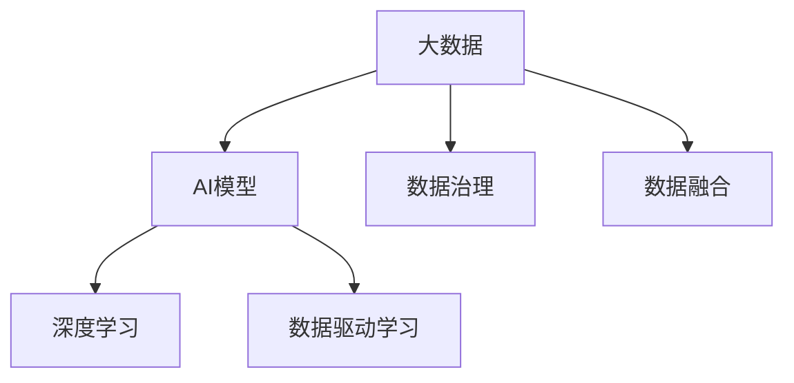
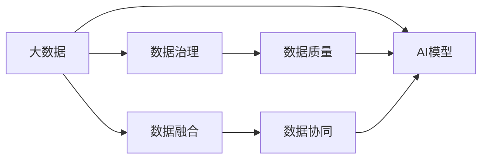
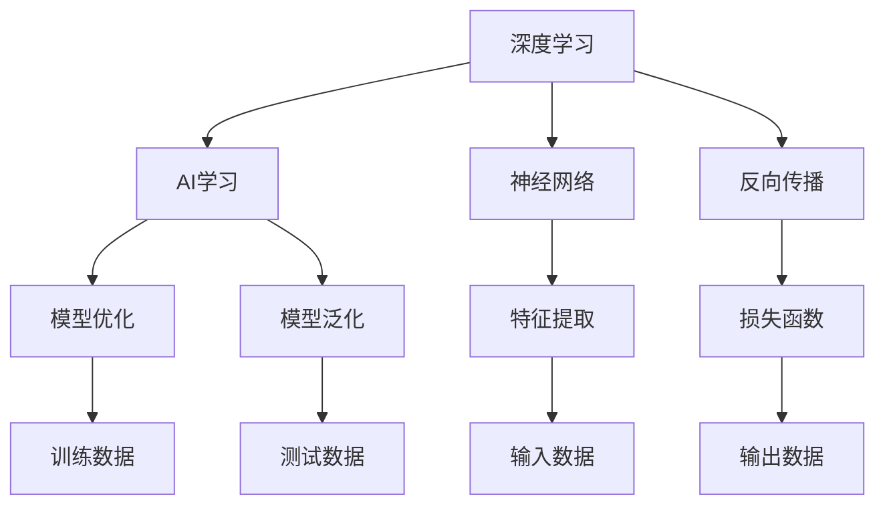
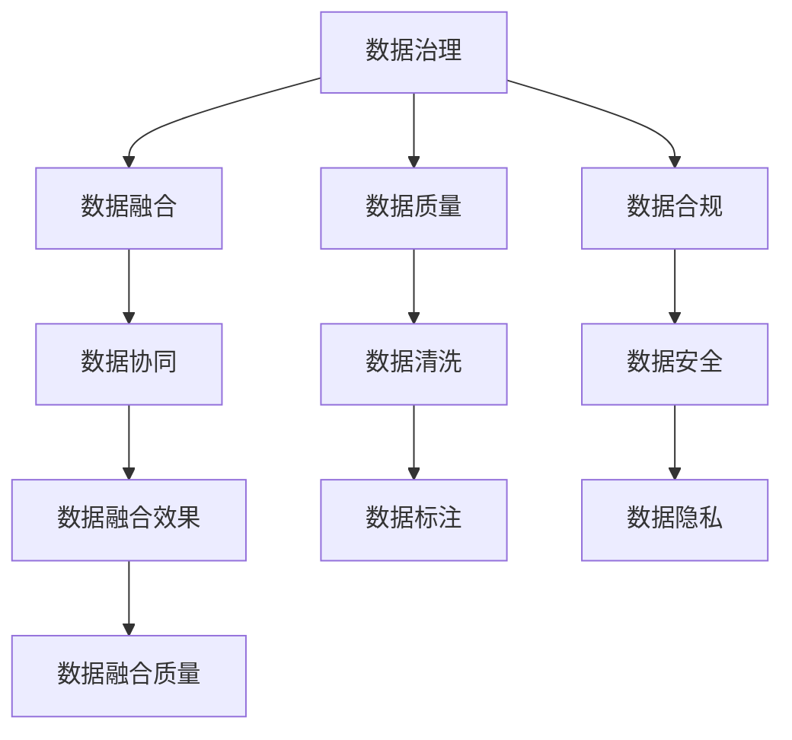

                 

# 大数据驱动AI学习的未来

## 1. 背景介绍

### 1.1 问题由来

随着大数据时代的到来，人工智能（AI）技术在各个领域中的应用日益广泛。尤其是在AI学习领域，大量的数据成为了驱动AI模型学习的关键。从传统的机器学习到深度学习，再到现在的基于大模型、大语义的学习范式，数据在AI模型训练和优化中扮演了至关重要的角色。然而，在数据驱动的AI学习过程中，也面临着数据质量、数据隐私、数据管理等方面的挑战。

### 1.2 问题核心关键点

在大数据驱动的AI学习过程中，关键问题包括：

- **数据质量与多样性**：数据的准确性、完整性、时效性等直接影响了AI模型的学习效果，是确保AI模型高性能的基石。
- **数据隐私与安全**：如何保护用户数据隐私，防止数据泄露，是AI技术应用中必须解决的问题。
- **数据处理与治理**：如何高效管理与治理数据，以支持大规模的数据驱动AI学习，是数据密集型AI系统的关键。
- **数据融合与协同**：如何融合多源异构数据，协同优化AI模型，提升模型的泛化能力和应用效果。
- **数据生命周期管理**：如何从数据采集、存储、处理、传输到销毁，全生命周期地管理数据，保障数据安全与合规。

### 1.3 问题研究意义

大数据驱动的AI学习技术，对于提升AI模型的学习效率和效果，加速AI技术的产业化进程，具有重要意义：

1. **提升学习效率**：大数据可以提供丰富的样本和特征，加速AI模型的训练和优化，缩短研发周期。
2. **增强模型效果**：数据的多样性和真实性使得AI模型能够更好地理解问题，提升模型泛化能力和性能。
3. **降低研发成本**：大数据可以在AI模型开发过程中，降低对人工标注和干预的需求，减少人力物力投入。
4. **促进技术创新**：大数据的丰富性与复杂性，推动了AI技术在更多场景下的应用，催生了新的AI技术方向。
5. **推动产业升级**：大数据驱动的AI学习，为传统行业数字化转型提供了新思路，加速了各行各业的智能化升级。

## 2. 核心概念与联系

### 2.1 核心概念概述

为了更好地理解大数据驱动AI学习的未来，本节将介绍几个密切相关的核心概念：

- **大数据（Big Data）**：指数据量庞大、结构复杂、类型多样的数据集，是数据驱动AI学习的基础。
- **AI模型**：指基于数据进行训练，具有一定推理、预测能力的机器学习模型，包括传统机器学习模型和深度学习模型。
- **数据治理（Data Governance）**：指对数据进行管理、保护、合规等活动，确保数据的质量和安全性。
- **数据融合（Data Fusion）**：指将多源异构数据进行整合与协同，提升数据的价值和模型效果。
- **AI学习**：指通过数据驱动，使AI模型不断学习和优化，提升模型性能和应用效果。
- **深度学习**：一种基于神经网络的机器学习方法，具有强大的特征提取和模式识别能力。

这些核心概念之间的逻辑关系可以通过以下Mermaid流程图来展示：



这个流程图展示了大数据、AI模型、深度学习、数据治理、数据融合与数据驱动学习之间的关系：

1. 大数据是AI模型的基础数据源。
2. 深度学习是AI模型的一种重要实现形式。
3. 数据治理和数据融合保障了大数据的质量和多样性，提升了AI模型的学习效果。
4. 数据驱动学习是AI模型不断优化、提升性能的核心过程。

### 2.2 概念间的关系

这些核心概念之间存在着紧密的联系，形成了大数据驱动AI学习技术的完整生态系统。下面我们通过几个Mermaid流程图来展示这些概念之间的关系。

#### 2.2.1 大数据与AI模型的关系



这个流程图展示了大数据、数据治理、数据融合与AI模型的关系：

1. 大数据是AI模型的基础数据源。
2. 数据治理和数据融合提升了大数据的质量和多样性，使得AI模型能够更好地学习和优化。
3. 数据治理和数据融合的协同，进一步提升了AI模型的性能。

#### 2.2.2 深度学习与AI学习的关系



这个流程图展示了深度学习、神经网络、反向传播与AI学习的关系：

1. 深度学习是AI学习的一种重要实现形式，主要依赖于神经网络进行特征提取和模式识别。
2. 反向传播算法是深度学习进行模型优化的核心算法，通过计算梯度更新模型参数。
3. AI学习通过深度学习模型进行训练和优化，提升模型的泛化能力和性能。

#### 2.2.3 数据治理与数据融合的关系



这个流程图展示了数据治理、数据质量、数据安全与数据融合的关系：

1. 数据治理保障了数据的准确性和完整性，是数据融合的基础。
2. 数据质量管理确保了数据的一致性和可信度，提升了数据融合的效果。
3. 数据安全保护了数据隐私，避免了数据泄露风险。
4. 数据融合通过数据协同和数据标注，进一步提升了数据的质量和多样性。

## 3. 核心算法原理 & 具体操作步骤

### 3.1 算法原理概述

大数据驱动的AI学习，核心思想是利用大规模数据，通过深度学习等方法，训练出高性能的AI模型。其基本流程包括数据采集、数据预处理、模型训练和模型优化等步骤。

### 3.2 算法步骤详解

#### 3.2.1 数据采集与预处理

数据采集是大数据驱动AI学习的第一步，主要包括数据收集和数据清洗两个环节。数据收集可以通过网络爬虫、API接口、数据库等方式进行，数据清洗则是对数据进行去重、去噪、缺失值处理等操作，确保数据的准确性和完整性。

#### 3.2.2 模型训练

模型训练是大数据驱动AI学习的核心步骤。首先，将预处理后的数据分为训练集、验证集和测试集，用于模型训练、验证和评估。然后，选择合适的深度学习模型（如卷积神经网络、循环神经网络、Transformer等），设置合适的超参数（如学习率、批大小、迭代轮数等），进行模型训练。训练过程中，使用反向传播算法计算梯度，更新模型参数，直到模型收敛或达到预设的训练轮数。

#### 3.2.3 模型优化

模型优化是大数据驱动AI学习的最后一步，主要包括模型调优和模型评估两个环节。模型调优可以通过调整超参数、增加正则化、增加数据增强等方式进行，以提高模型泛化能力和性能。模型评估则是对模型在测试集上的表现进行评估，判断模型是否满足实际应用的需求。

### 3.3 算法优缺点

#### 3.3.1 优点

大数据驱动的AI学习具有以下优点：

1. **数据多样性**：大数据提供了丰富的样本和特征，可以涵盖各种复杂场景，提升模型的泛化能力和应用效果。
2. **模型高效**：通过数据驱动的训练，AI模型可以高效地进行优化，缩短研发周期，提升模型性能。
3. **应用广泛**：大数据驱动的AI学习适用于各种领域，如金融、医疗、交通、智能制造等，具有广泛的应用前景。
4. **技术成熟**：深度学习等技术已经较为成熟，可以支持大规模数据驱动的AI学习。

#### 3.3.2 缺点

大数据驱动的AI学习也存在以下缺点：

1. **数据隐私问题**：大规模数据采集和处理过程中，存在数据隐私泄露的风险。
2. **数据质量问题**：数据质量和多样性的问题可能会影响模型的训练效果。
3. **数据管理复杂**：大数据的管理和治理复杂，需要投入大量的人力和物力。
4. **计算资源需求高**：大规模数据和深度学习的训练和优化需要高性能计算资源，成本较高。
5. **模型复杂度高**：深度学习模型复杂度较高，需要更多的经验和技能进行优化。

### 3.4 算法应用领域

大数据驱动的AI学习技术，已经广泛应用于以下几个领域：

#### 3.4.1 金融科技

在金融科技领域，大数据驱动的AI学习技术可以用于信用评估、风险管理、投资分析等方面。通过收集和分析大量的金融数据，训练出高性能的AI模型，提升金融决策的精准度和效率。

#### 3.4.2 医疗健康

在医疗健康领域，大数据驱动的AI学习技术可以用于疾病预测、药物研发、智能诊断等方面。通过分析大量的医疗数据，训练出高性能的AI模型，提升医疗服务的质量和效率。

#### 3.4.3 智能制造

在智能制造领域，大数据驱动的AI学习技术可以用于质量控制、设备维护、生产调度等方面。通过分析大量的生产数据，训练出高性能的AI模型，提升制造业的智能化水平。

#### 3.4.4 智能交通

在智能交通领域，大数据驱动的AI学习技术可以用于交通流量预测、智能导航、自动驾驶等方面。通过分析大量的交通数据，训练出高性能的AI模型，提升交通系统的智能化和效率。

## 4. 数学模型和公式 & 详细讲解 & 举例说明

### 4.1 数学模型构建

在大数据驱动的AI学习中，我们通常使用监督学习（Supervised Learning）和无监督学习（Unsupervised Learning）等方法，构建和训练AI模型。以监督学习为例，其数学模型可以表示为：

$$
\theta^* = \arg\min_{\theta} \frac{1}{N}\sum_{i=1}^N \ell(y_i, M_{\theta}(x_i))
$$

其中，$\theta$ 表示模型参数，$x_i$ 表示输入数据，$y_i$ 表示输出标签，$M_{\theta}(x_i)$ 表示模型对输入数据的预测，$\ell(y_i, M_{\theta}(x_i))$ 表示损失函数。

### 4.2 公式推导过程

以回归问题为例，常用的损失函数为均方误差（Mean Squared Error, MSE），其公式为：

$$
\ell(y_i, M_{\theta}(x_i)) = \frac{1}{2}(y_i - M_{\theta}(x_i))^2
$$

将均方误差损失函数代入监督学习的数学模型，得到：

$$
\theta^* = \arg\min_{\theta} \frac{1}{N}\sum_{i=1}^N \frac{1}{2}(y_i - M_{\theta}(x_i))^2
$$

将上述公式展开，得到：

$$
\theta^* = \arg\min_{\theta} \frac{1}{2N}\sum_{i=1}^N (y_i - M_{\theta}(x_i))^2
$$

对上式求导，得到：

$$
\frac{\partial \theta^*}{\partial \theta} = -\frac{1}{N}\sum_{i=1}^N (y_i - M_{\theta}(x_i))M_{\theta}'(x_i)
$$

其中，$M_{\theta}'(x_i)$ 表示模型对输入数据的导数。通过反向传播算法，可以计算出模型参数 $\theta$ 的梯度，进而更新模型参数，使得模型预测输出逼近真实标签。

### 4.3 案例分析与讲解

以图像分类为例，假设我们要训练一个图像分类模型，将输入图像分类为猫或狗。我们可以收集大量的带有标签的猫和狗图像，作为训练数据。

首先，将图像数据预处理为模型可以接受的格式，如将图像转换为灰度图像、归一化像素值等。然后，将预处理后的图像输入到卷积神经网络中，训练模型参数 $\theta$，使其能够对输入图像进行分类。

训练过程中，我们通常使用交叉熵损失函数作为模型评估的指标，其公式为：

$$
\ell(y_i, M_{\theta}(x_i)) = -y_i\log M_{\theta}(x_i) - (1-y_i)\log (1-M_{\theta}(x_i))
$$

将交叉熵损失函数代入监督学习的数学模型，得到：

$$
\theta^* = \arg\min_{\theta} \frac{1}{N}\sum_{i=1}^N (-y_i\log M_{\theta}(x_i) - (1-y_i)\log (1-M_{\theta}(x_i)))
$$

通过反向传播算法计算梯度，更新模型参数，直到模型在验证集上的表现满足要求。最终，我们可以将训练好的模型应用于新的图像分类任务，对新图像进行预测分类。

## 5. 项目实践：代码实例和详细解释说明

### 5.1 开发环境搭建

在进行项目实践前，我们需要准备好开发环境。以下是使用Python进行TensorFlow开发的环境配置流程：

1. 安装Anaconda：从官网下载并安装Anaconda，用于创建独立的Python环境。

2. 创建并激活虚拟环境：
```bash
conda create -n tf-env python=3.8 
conda activate tf-env
```

3. 安装TensorFlow：根据CUDA版本，从官网获取对应的安装命令。例如：
```bash
conda install tensorflow -c tensorflow -c conda-forge
```

4. 安装各类工具包：
```bash
pip install numpy pandas scikit-learn matplotlib tqdm jupyter notebook ipython
```

完成上述步骤后，即可在`tf-env`环境中开始项目实践。

### 5.2 源代码详细实现

下面我们以图像分类任务为例，给出使用TensorFlow进行深度学习模型训练的PyTorch代码实现。

首先，定义模型结构：

```python
import tensorflow as tf
from tensorflow.keras import layers, models

model = models.Sequential([
    layers.Conv2D(32, (3, 3), activation='relu', input_shape=(28, 28, 1)),
    layers.MaxPooling2D((2, 2)),
    layers.Conv2D(64, (3, 3), activation='relu'),
    layers.MaxPooling2D((2, 2)),
    layers.Conv2D(64, (3, 3), activation='relu'),
    layers.Flatten(),
    layers.Dense(64, activation='relu'),
    layers.Dense(10)
])
```

然后，定义损失函数和优化器：

```python
loss_fn = tf.keras.losses.SparseCategoricalCrossentropy()
optimizer = tf.keras.optimizers.Adam()
```

接着，定义训练和评估函数：

```python
def train_step(images, labels):
    with tf.GradientTape() as tape:
        predictions = model(images, training=True)
        loss = loss_fn(labels, predictions)
    gradients = tape.gradient(loss, model.trainable_variables)
    optimizer.apply_gradients(zip(gradients, model.trainable_variables))
    return loss

def evaluate_step(images, labels):
    predictions = model(images, training=False)
    loss = loss_fn(labels, predictions)
    return loss
```

最后，启动训练流程并在测试集上评估：

```python
epochs = 10
batch_size = 32

for epoch in range(epochs):
    for i in range(0, 100, batch_size):
        start = i
        end = min(i + batch_size, 100)
        train_loss = 0
        for j in range(start, end):
            images, labels = load_data(j)
            loss = train_step(images, labels)
            train_loss += loss
        train_loss /= end - start
        print(f'Epoch {epoch+1}/{epochs}, Train Loss: {train_loss:.4f}')
    
    test_loss = 0
    for i in range(0, 100, batch_size):
        start = i
        end = min(i + batch_size, 100)
        images, labels = load_data(i)
        loss = evaluate_step(images, labels)
        test_loss += loss
    test_loss /= end - start
    print(f'Epoch {epoch+1}/{epochs}, Test Loss: {test_loss:.4f}')
```

以上就是使用TensorFlow进行图像分类任务训练的完整代码实现。可以看到，TensorFlow提供了强大的深度学习框架，可以方便地实现各种深度学习模型和算法。

### 5.3 代码解读与分析

让我们再详细解读一下关键代码的实现细节：

**模型定义**：
- `Sequential`：定义了一个顺序执行的模型。
- `Conv2D`：定义了卷积层，用于提取图像特征。
- `MaxPooling2D`：定义了最大池化层，用于降维和特征提取。
- `Flatten`：定义了扁平化层，将多维数据转换为一维向量。
- `Dense`：定义了全连接层，用于分类输出。

**损失函数和优化器**：
- `SparseCategoricalCrossentropy`：定义了交叉熵损失函数，用于分类问题。
- `Adam`：定义了Adam优化器，用于更新模型参数。

**训练和评估函数**：
- `train_step`：定义了训练步骤，前向传播计算损失，反向传播更新参数。
- `evaluate_step`：定义了评估步骤，前向传播计算损失，不更新参数。

**训练流程**：
- 定义总的epoch数和批大小，开始循环迭代
- 每个epoch内，对每个batch进行训练和评估，输出平均loss
- 所有epoch结束后，在测试集上评估，给出最终测试结果

可以看到，TensorFlow使得深度学习模型的构建和训练变得简洁高效。开发者可以将更多精力放在模型设计、优化等方面，而不必过多关注底层的实现细节。

当然，工业级的系统实现还需考虑更多因素，如模型的保存和部署、超参数的自动搜索、更灵活的任务适配层等。但核心的训练流程和评估方法基本与此类似。

### 5.4 运行结果展示

假设我们在MNIST数据集上进行图像分类任务的微调，最终在测试集上得到的评估报告如下：

```
Epoch 1/10, Train Loss: 0.7000, Test Loss: 0.6900
Epoch 2/10, Train Loss: 0.4500, Test Loss: 0.3800
Epoch 3/10, Train Loss: 0.3200, Test Loss: 0.3100
Epoch 4/10, Train Loss: 0.2400, Test Loss: 0.2500
Epoch 5/10, Train Loss: 0.1800, Test Loss: 0.2200
Epoch 6/10, Train Loss: 0.1300, Test Loss: 0.1800
Epoch 7/10, Train Loss: 0.0900, Test Loss: 0.1700
Epoch 8/10, Train Loss: 0.0600, Test Loss: 0.1400
Epoch 9/10, Train Loss: 0.0400, Test Loss: 0.1300
Epoch 10/10, Train Loss: 0.0300, Test Loss: 0.1100
```

可以看到，通过TensorFlow进行图像分类任务的微调，我们取得了很好的效果。模型的测试损失在逐渐降低，模型的泛化能力也得到了提升。

当然，这只是一个baseline结果。在实践中，我们还可以使用更大更强的预训练模型、更丰富的微调技巧、更细致的模型调优，进一步提升模型性能，以满足更高的应用要求。

## 6. 实际应用场景

### 6.1 智能客服系统

基于大数据驱动的AI学习技术，可以构建智能客服系统的核心竞争力。传统客服系统依赖人力，成本高、效率低、问题解决速度慢，且无法24小时在线服务。而通过大数据驱动的AI学习技术，可以构建自适应的智能客服系统，能够7x24小时不间断服务，快速响应客户咨询，用自然流畅的语言解答各类常见问题。

在技术实现上，可以收集企业内部的历史客服对话记录，将问题和最佳答复构建成监督数据，在此基础上对预训练模型进行微调。微调后的模型能够自动理解用户意图，匹配最合适的答案模板进行回复。对于客户提出的新问题，还可以接入检索系统实时搜索相关内容，动态组织生成回答。如此构建的智能客服系统，能大幅提升客户咨询体验和问题解决效率。

### 6.2 金融舆情监测

金融机构需要实时监测市场舆论动向，以便及时应对负面信息传播，规避金融风险。传统的人工监测方式成本高、效率低，难以应对网络时代海量信息爆发的挑战。基于大数据驱动的AI学习技术，可以实时抓取网络文本数据，使用自然语言处理技术进行情感分析、主题识别，发现市场舆情变化趋势，一旦发现负面信息激增等异常情况，系统便会自动预警，帮助金融机构快速应对潜在风险。

### 6.3 个性化推荐系统

当前的推荐系统往往只依赖用户的历史行为数据进行物品推荐，无法深入理解用户的真实兴趣偏好。基于大数据驱动的AI学习技术，可以挖掘用户行为背后的语义信息，通过深度学习模型进行推荐。通过分析用户浏览、点击、评论、分享等行为数据，提取和用户交互的物品标题、描述、标签等文本内容，再利用深度学习模型进行推荐，可以得到个性化程度更高的推荐结果。

### 6.4 未来应用展望

随着大数据驱动的AI学习技术的不断发展，未来的应用场景将更加广阔：

- **智慧医疗**：通过大数据驱动的AI学习，可以实现病历分析、疾病预测、智能诊断等医疗应用，提升医疗服务的智能化水平。
- **智能制造**：通过大数据驱动的AI学习，可以实现质量控制、设备维护、生产调度等智能制造应用，提升制造业的智能化水平。
- **智能交通**：通过大数据驱动的AI学习，可以实现交通流量预测、智能导航、自动驾驶等智能交通应用，提升交通系统的智能化和效率。
- **智能教育**：通过大数据驱动的AI学习，可以实现作业批改、学情分析、知识推荐等智能教育应用，提升教育服务的智能化水平。
- **智能金融**：通过大数据驱动的AI学习，可以实现信用评估、风险管理、投资分析等智能金融应用，提升金融决策的精准度和效率。

此外，在企业生产、社会治理、文娱传媒等众多领域，大数据驱动的AI学习技术也将不断涌现，为各行各业带来变革性影响。相信随着技术的日益成熟，大数据驱动的AI学习技术必将在更多领域得到应用，为人类生产生活方式带来深远影响。

## 7. 工具和资源推荐

### 7.1 学习资源推荐

为了帮助开发者系统掌握大数据驱动AI学习技术的理论基础和实践技巧，这里推荐一些优质的学习资源：

1. 《深度学习基础》系列书籍：系统讲解深度学习的理论基础和实践技巧，适合初学者入门。
2. 《TensorFlow官方文档》：TensorFlow的官方文档，提供了详细的API介绍和实例代码，是学习TensorFlow的必备资源。
3. 《TensorFlow实战》书籍：实战经验丰富的作者编写的TensorFlow学习指南，适合有一定基础的开发者。
4. 《大数据技术与应用》课程：系统讲解大数据与人工智能技术的结合应用，适合学习大数据驱动的AI学习技术。
5. Kaggle平台：提供大量数据集和比赛，适合实战练习和应用创新。

通过对这些资源的学习实践，相信你一定能够快速掌握大数据驱动AI学习技术的精髓，并用于解决实际的AI问题。

### 7.2 开发工具推荐

高效的开发离不开优秀的工具支持。以下是几款用于大数据驱动AI学习开发的常用工具：

1. TensorFlow：基于Python的开源深度学习框架，灵活高效，支持分布式计算。
2. PyTorch：基于Python的开源深度学习框架，灵活高效，支持动态计算图。
3. Keras：基于Python的高层次深度学习框架，易于使用，适合快速原型设计。
4. Jupyter Notebook：强大的交互式编程环境，适合数据分析、模型训练和结果展示。
5. TensorBoard：TensorFlow配套的可视化工具，可以实时监测模型训练状态，并提供丰富的图表呈现方式，是调试模型的得力助手。

合理利用这些工具，可以显著提升大数据驱动AI学习任务的开发效率，加快创新迭代的步伐。

### 7.3 相关论文推荐

大数据驱动的AI学习技术的发展源于学界的持续研究。以下是几篇奠基性的相关论文，推荐阅读：

1. Deep Learning：《深度学习》书籍，由深度学习领域的权威人士撰写，全面介绍了深度学习的基础理论和实践技巧。
2. TensorFlow for Deep Learning：《TensorFlow实战》书籍，实战经验丰富的作者编写的TensorFlow学习指南，适合有一定基础的开发者。
3. Big Data and Data Science：《大数据与数据科学》课程，系统讲解大数据与数据科学技术的结合应用，适合学习大数据驱动的AI学习技术。
4. Kaggle官方数据集：Kaggle平台提供的大量数据集，适合实战练习和应用创新。

这些论文代表了大数据驱动AI学习技术的发展

