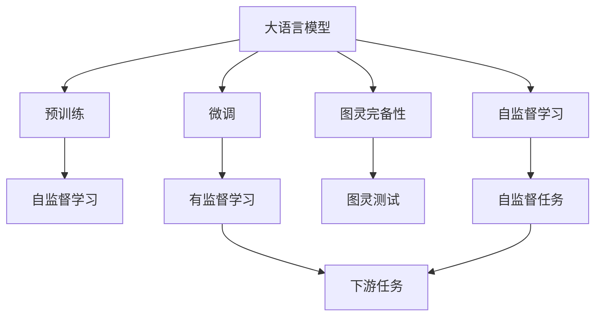

                 

# AI时代的图灵完备：LLM的理论基础

> 关键词：大语言模型,图灵完备性,自监督学习,预训练,Transformer,BERT,神经网络,深度学习

## 1. 背景介绍

### 1.1 问题由来
在过去的十年中，深度学习尤其是大语言模型（Large Language Models, LLMs）在自然语言处理（Natural Language Processing, NLP）领域取得了巨大的突破。这些模型通过在大规模无标签文本数据上进行预训练，学习到了丰富的语言知识和常识，展示出了超越人类的语言理解和生成能力。

然而，尽管大语言模型在任务上的表现令人瞩目，其“智能”究竟源自何处仍然是一个充满争议的问题。正如图灵测试所揭示的，真正意义上的智能不仅仅是通过复杂的算法和计算来实现的。AI技术是否达到了“智能”这一目标？大语言模型是否实现了图灵完备性？这些问题一直困扰着科学家和技术从业者。

### 1.2 问题核心关键点
图灵完备性是指一个模型是否具备解决任何问题所需的计算能力。在大语言模型中，图灵完备性主要体现在其能否执行任何基于语言的任务，如回答问题、生成文本、进行情感分析等。而语言模型的“智能”，则与其预训练过程和微调方法密切相关。

预训练是使模型学习到广泛的语言知识和通用表示的关键步骤。而微调则是将模型进一步适应特定任务，提升模型在特定领域上的性能。模型预训练-微调范式已经成为当前大语言模型应用的主流方法。

本博客将深入探讨大语言模型的图灵完备性及其理论基础，探究其预训练-微调机制背后的算法原理和数学模型，并结合实际应用场景，分析模型的优点和局限性，以期为大语言模型在AI时代的进一步发展和应用提供理论支持。

## 2. 核心概念与联系

### 2.1 核心概念概述

为更好地理解大语言模型及其与图灵完备性的联系，本节将介绍几个密切相关的核心概念：

- 大语言模型（Large Language Models, LLMs）：以自回归模型（如GPT）或自编码模型（如BERT）为代表的具有大规模参数量、在大规模无标签文本数据上进行预训练的语言模型，具备强大的语言理解和生成能力。

- 预训练（Pre-training）：指在大规模无标签文本数据上，通过自监督学习任务训练通用语言模型的过程。常见的预训练任务包括言语建模、遮挡语言模型等。

- 微调（Fine-tuning）：指在预训练模型的基础上，使用下游任务的少量标注数据，通过有监督学习优化模型在特定任务上的性能。通常只需要调整顶层分类器或解码器，并以较小的学习率更新全部或部分的模型参数。

- 图灵完备性（Turing completeness）：指一个模型能够解决任何计算问题，理论上等同于一个图灵机。

- 自监督学习（Self-supervised learning）：指使用大规模未标注数据训练模型，通过设计巧妙的自监督任务学习模型知识。

- 深度学习（Deep Learning）：以神经网络为基础，通过多层次的特征提取和表示学习，实现复杂任务处理的机器学习范式。

这些核心概念之间的逻辑关系可以通过以下Mermaid流程图来展示：



这个流程图展示了从大语言模型到图灵完备性，通过预训练和微调实现的语言模型知识学习过程。

### 2.2 概念间的关系

这些核心概念之间存在着紧密的联系，形成了大语言模型及其图灵完备性的完整生态系统。

- 大语言模型通过预训练学习到广泛的语言知识和常识，通过微调进一步适应特定任务。
- 预训练和微调是通过自监督学习和有监督学习两个过程实现的，这两个过程共同构建了大语言模型的知识体系。
- 图灵完备性描述了大语言模型执行任何基于语言的任务的能力，是衡量模型智能的关键指标。
- 自监督学习是大规模无标签数据下模型知识学习的重要手段，是预训练的基础。
- 深度学习提供了一种强大的神经网络架构，用于实现复杂的特征提取和表示学习。

这些概念共同构成了大语言模型的学习框架，使其在各种场景下展现出强大的语言理解和生成能力。

## 3. 核心算法原理 & 具体操作步骤
### 3.1 算法原理概述

大语言模型基于深度学习，特别是神经网络架构。其核心思想是通过大规模数据预训练和微调，学习到丰富的语言知识，并使其能够在特定任务上表现出色。这种预训练-微调范式，实质上是将通用知识与任务特定的知识进行结合，使得模型能够更加精准地执行任务。

大语言模型通常采用自回归或自编码架构，通过多层次的神经网络结构进行特征提取和表示学习。在预训练阶段，模型通过大量的无标签文本数据，学习到语言的基本结构和规律。在微调阶段，模型通过任务特定的标注数据，进一步优化模型参数，使其能够适应特定任务的要求。

### 3.2 算法步骤详解

基于深度学习的大语言模型预训练-微调过程，通常包括以下几个关键步骤：

**Step 1: 准备数据集**
- 收集大规模无标签文本数据，作为预训练的输入。
- 准备下游任务的标注数据集，划分为训练集、验证集和测试集。

**Step 2: 选择预训练模型架构**
- 选择合适的预训练模型，如BERT、GPT等，作为初始化参数。
- 设计预训练任务，如掩码语言模型、预测下一位等。

**Step 3: 预训练模型训练**
- 在预训练数据集上训练模型，学习到语言的基本结构和规律。
- 定期在验证集上评估模型性能，避免过拟合。
- 预训练过程中，使用正则化技术（如Dropout、L2正则等），防止模型过拟合。

**Step 4: 微调模型训练**
- 在微调数据集上训练模型，进一步优化模型参数。
- 选择合适的优化算法（如AdamW、SGD等）和优化参数（如学习率、批大小等）。
- 使用任务特定的损失函数，如交叉熵损失、均方误差损失等。

**Step 5: 模型评估与部署**
- 在测试集上评估微调后的模型性能，比较微调前后的效果提升。
- 将微调后的模型应用于实际任务中，如问答、对话、摘要等。
- 定期更新模型，以适应数据分布的变化。

以上是基于深度学习的大语言模型预训练-微调过程的详细步骤。在实际应用中，还需要根据具体任务进行模型优化和调整，如添加任务适配层、采用参数高效微调等。

### 3.3 算法优缺点

大语言模型预训练-微调范式具有以下优点：
1. 简单高效：仅需准备少量标注数据，即可在特定任务上快速取得优异性能。
2. 通用适用：适用于各种NLP任务，如分类、匹配、生成等。
3. 参数高效：通过参数高效微调方法，可以在固定大部分预训练参数的情况下，优化模型性能。
4. 效果显著：在学术界和工业界的诸多任务上，基于微调的方法已经刷新了最先进的性能指标。

同时，该方法也存在一些局限性：
1. 依赖标注数据：微调的效果很大程度上取决于标注数据的质量和数量，获取高质量标注数据的成本较高。
2. 迁移能力有限：当目标任务与预训练数据的分布差异较大时，微调的性能提升有限。
3. 负面效果传递：预训练模型的固有偏见、有害信息等，可能通过微调传递到下游任务，造成负面影响。
4. 可解释性不足：微调模型的决策过程通常缺乏可解释性，难以对其推理逻辑进行分析和调试。

尽管存在这些局限性，但就目前而言，基于监督学习的微调方法仍是大语言模型应用的主流范式。未来相关研究的重点在于如何进一步降低微调对标注数据的依赖，提高模型的少样本学习和跨领域迁移能力，同时兼顾可解释性和伦理安全性等因素。

### 3.4 算法应用领域

基于深度学习的大语言模型微调方法，在NLP领域已经得到了广泛的应用，覆盖了几乎所有常见任务，例如：

- 文本分类：如情感分析、主题分类、意图识别等。通过微调使模型学习文本-标签映射。
- 命名实体识别：识别文本中的人名、地名、机构名等特定实体。通过微调使模型掌握实体边界和类型。
- 关系抽取：从文本中抽取实体之间的语义关系。通过微调使模型学习实体-关系三元组。
- 问答系统：对自然语言问题给出答案。将问题-答案对作为微调数据，训练模型学习匹配答案。
- 机器翻译：将源语言文本翻译成目标语言。通过微调使模型学习语言-语言映射。
- 文本摘要：将长文本压缩成简短摘要。将文章-摘要对作为微调数据，使模型学习抓取要点。
- 对话系统：使机器能够与人自然对话。将多轮对话历史作为上下文，微调模型进行回复生成。

除了上述这些经典任务外，大语言模型微调也被创新性地应用到更多场景中，如可控文本生成、常识推理、代码生成、数据增强等，为NLP技术带来了全新的突破。

## 4. 数学模型和公式 & 详细讲解

### 4.1 数学模型构建

大语言模型的预训练-微调过程，本质上是一个有监督的细粒度迁移学习过程。其核心思想是：将预训练的大语言模型视作一个强大的"特征提取器"，通过在下游任务的标注数据上进行有监督的微调，使得模型输出能够匹配任务标签，从而获得针对特定任务优化的模型。

记预训练语言模型为 $M_{\theta}$，其中 $\theta$ 为预训练得到的模型参数。给定下游任务 $T$ 的标注数据集 $D=\{(x_i, y_i)\}_{i=1}^N$，微调的目标是找到新的模型参数 $\hat{\theta}$，使得：

$$
\hat{\theta}=\mathop{\arg\min}_{\theta} \mathcal{L}(M_{\theta},D)
$$

其中 $\mathcal{L}$ 为针对任务 $T$ 设计的损失函数，用于衡量模型预测输出与真实标签之间的差异。常见的损失函数包括交叉熵损失、均方误差损失等。

通过梯度下降等优化算法，微调过程不断更新模型参数 $\theta$，最小化损失函数 $\mathcal{L}$，使得模型输出逼近真实标签。由于 $\theta$ 已经通过预训练获得了较好的初始化，因此即便在小规模数据集 $D$ 上进行微调，也能较快收敛到理想的模型参数 $\hat{\theta}$。

### 4.2 公式推导过程

以下我们以二分类任务为例，推导交叉熵损失函数及其梯度的计算公式。

假设模型 $M_{\theta}$ 在输入 $x$ 上的输出为 $\hat{y}=M_{\theta}(x) \in [0,1]$，表示样本属于正类的概率。真实标签 $y \in \{0,1\}$。则二分类交叉熵损失函数定义为：

$$
\ell(M_{\theta}(x),y) = -[y\log \hat{y} + (1-y)\log (1-\hat{y})]
$$

将其代入经验风险公式，得：

$$
\mathcal{L}(\theta) = -\frac{1}{N}\sum_{i=1}^N [y_i\log M_{\theta}(x_i)+(1-y_i)\log(1-M_{\theta}(x_i))]
$$

根据链式法则，损失函数对参数 $\theta_k$ 的梯度为：

$$
\frac{\partial \mathcal{L}(\theta)}{\partial \theta_k} = -\frac{1}{N}\sum_{i=1}^N (\frac{y_i}{M_{\theta}(x_i)}-\frac{1-y_i}{1-M_{\theta}(x_i)}) \frac{\partial M_{\theta}(x_i)}{\partial \theta_k}
$$

其中 $\frac{\partial M_{\theta}(x_i)}{\partial \theta_k}$ 可进一步递归展开，利用自动微分技术完成计算。

在得到损失函数的梯度后，即可带入参数更新公式，完成模型的迭代优化。重复上述过程直至收敛，最终得到适应下游任务的最优模型参数 $\hat{\theta}$。

### 4.3 案例分析与讲解

以下是一个基于深度学习的大语言模型微调的案例分析：

#### 案例背景

假设我们有一个大语言模型 $M_{\theta}$，用于处理情感分析任务。具体而言，我们的目标是训练模型，使其能够识别并分类情感极性（如正面、负面、中性）。

#### 案例步骤

**Step 1: 数据准备**
- 收集情感分析数据集，如IMDB电影评论数据集。
- 将数据集划分为训练集、验证集和测试集，并对其进行标注，标记为正面、负面、中性等情感极性。

**Step 2: 模型选择与初始化**
- 选择BERT模型作为预训练模型，并根据情感分析任务的需求，在其顶层添加一个分类器。
- 使用随机初始化的模型参数 $\theta_0$。

**Step 3: 预训练**
- 在IMDB电影评论数据集上进行预训练，使用自监督任务如掩码语言模型。
- 定期在验证集上评估模型性能，避免过拟合。
- 使用正则化技术（如Dropout、L2正则等），防止模型过拟合。

**Step 4: 微调**
- 在情感分析任务的数据集上，使用微调后的BERT模型进行微调。
- 选择合适的优化算法（如AdamW、SGD等）和优化参数（如学习率、批大小等）。
- 使用任务特定的损失函数，如交叉熵损失。

**Step 5: 模型评估**
- 在测试集上评估微调后的模型性能，比较微调前后的效果提升。
- 使用测试集评估模型的准确率、召回率、F1分数等指标。

**Step 6: 模型部署**
- 将微调后的模型应用于实际任务中，如情感分析。
- 定期更新模型，以适应数据分布的变化。

通过以上步骤，我们可以看到大语言模型在情感分析任务上的微调过程。在预训练阶段，模型学习到语言的基本结构和规律。在微调阶段，模型进一步优化参数，适应情感分析任务的要求，从而实现高精度的情感分类。

## 5. 项目实践：代码实例和详细解释说明

### 5.1 开发环境搭建

在进行大语言模型微调实践前，我们需要准备好开发环境。以下是使用Python进行PyTorch开发的环境配置流程：

1. 安装Anaconda：从官网下载并安装Anaconda，用于创建独立的Python环境。

2. 创建并激活虚拟环境：
```bash
conda create -n pytorch-env python=3.8 
conda activate pytorch-env
```

3. 安装PyTorch：根据CUDA版本，从官网获取对应的安装命令。例如：
```bash
conda install pytorch torchvision torchaudio cudatoolkit=11.1 -c pytorch -c conda-forge
```

4. 安装Transformers库：
```bash
pip install transformers
```

5. 安装各类工具包：
```bash
pip install numpy pandas scikit-learn matplotlib tqdm jupyter notebook ipython
```

完成上述步骤后，即可在`pytorch-env`环境中开始微调实践。

### 5.2 源代码详细实现

下面我们以情感分析任务为例，给出使用Transformers库对BERT模型进行微调的PyTorch代码实现。

首先，定义情感分析任务的数据处理函数：

```python
from transformers import BertTokenizer
from torch.utils.data import Dataset
import torch

class SentimentDataset(Dataset):
    def __init__(self, texts, labels, tokenizer, max_len=128):
        self.texts = texts
        self.labels = labels
        self.tokenizer = tokenizer
        self.max_len = max_len
        
    def __len__(self):
        return len(self.texts)
    
    def __getitem__(self, item):
        text = self.texts[item]
        label = self.labels[item]
        
        encoding = self.tokenizer(text, return_tensors='pt', max_length=self.max_len, padding='max_length', truncation=True)
        input_ids = encoding['input_ids'][0]
        attention_mask = encoding['attention_mask'][0]
        
        # 对label进行编码
        encoded_labels = [label2id[label] for label in label2id] 
        encoded_labels.extend([label2id['O']] * (self.max_len - len(encoded_labels)))
        labels = torch.tensor(encoded_labels, dtype=torch.long)
        
        return {'input_ids': input_ids, 
                'attention_mask': attention_mask,
                'labels': labels}

# 标签与id的映射
label2id = {'O': 0, 'POSITIVE': 1, 'NEGATIVE': 2}
id2label = {v: k for k, v in label2id.items()}

# 创建dataset
tokenizer = BertTokenizer.from_pretrained('bert-base-cased')

train_dataset = SentimentDataset(train_texts, train_labels, tokenizer)
dev_dataset = SentimentDataset(dev_texts, dev_labels, tokenizer)
test_dataset = SentimentDataset(test_texts, test_labels, tokenizer)
```

然后，定义模型和优化器：

```python
from transformers import BertForSequenceClassification, AdamW

model = BertForSequenceClassification.from_pretrained('bert-base-cased', num_labels=len(label2id))

optimizer = AdamW(model.parameters(), lr=2e-5)
```

接着，定义训练和评估函数：

```python
from torch.utils.data import DataLoader
from tqdm import tqdm
from sklearn.metrics import classification_report

device = torch.device('cuda') if torch.cuda.is_available() else torch.device('cpu')
model.to(device)

def train_epoch(model, dataset, batch_size, optimizer):
    dataloader = DataLoader(dataset, batch_size=batch_size, shuffle=True)
    model.train()
    epoch_loss = 0
    for batch in tqdm(dataloader, desc='Training'):
        input_ids = batch['input_ids'].to(device)
        attention_mask = batch['attention_mask'].to(device)
        labels = batch['labels'].to(device)
        model.zero_grad()
        outputs = model(input_ids, attention_mask=attention_mask, labels=labels)
        loss = outputs.loss
        epoch_loss += loss.item()
        loss.backward()
        optimizer.step()
    return epoch_loss / len(dataloader)

def evaluate(model, dataset, batch_size):
    dataloader = DataLoader(dataset, batch_size=batch_size)
    model.eval()
    preds, labels = [], []
    with torch.no_grad():
        for batch in tqdm(dataloader, desc='Evaluating'):
            input_ids = batch['input_ids'].to(device)
            attention_mask = batch['attention_mask'].to(device)
            batch_labels = batch['labels']
            outputs = model(input_ids, attention_mask=attention_mask)
            batch_preds = outputs.logits.argmax(dim=2).to('cpu').tolist()
            batch_labels = batch_labels.to('cpu').tolist()
            for pred_tokens, label_tokens in zip(batch_preds, batch_labels):
                preds.append(pred_tokens[:len(label_tokens)])
                labels.append(label_tokens)
                
    print(classification_report(labels, preds))
```

最后，启动训练流程并在测试集上评估：

```python
epochs = 5
batch_size = 16

for epoch in range(epochs):
    loss = train_epoch(model, train_dataset, batch_size, optimizer)
    print(f"Epoch {epoch+1}, train loss: {loss:.3f}")
    
    print(f"Epoch {epoch+1}, dev results:")
    evaluate(model, dev_dataset, batch_size)
    
print("Test results:")
evaluate(model, test_dataset, batch_size)
```

以上就是使用PyTorch对BERT进行情感分析任务微调的完整代码实现。可以看到，得益于Transformers库的强大封装，我们可以用相对简洁的代码完成BERT模型的加载和微调。

### 5.3 代码解读与分析

让我们再详细解读一下关键代码的实现细节：

**SentimentDataset类**：
- `__init__`方法：初始化文本、标签、分词器等关键组件。
- `__len__`方法：返回数据集的样本数量。
- `__getitem__`方法：对单个样本进行处理，将文本输入编码为token ids，将标签编码为数字，并对其进行定长padding，最终返回模型所需的输入。

**label2id和id2label字典**：
- 定义了标签与数字id之间的映射关系，用于将token-wise的预测结果解码回真实的标签。

**训练和评估函数**：
- 使用PyTorch的DataLoader对数据集进行批次化加载，供模型训练和推理使用。
- 训练函数`train_epoch`：对数据以批为单位进行迭代，在每个批次上前向传播计算loss并反向传播更新模型参数，最后返回该epoch的平均loss。
- 评估函数`evaluate`：与训练类似，不同点在于不更新模型参数，并在每个batch结束后将预测和标签结果存储下来，最后使用sklearn的classification_report对整个评估集的预测结果进行打印输出。

**训练流程**：
- 定义总的epoch数和batch size，开始循环迭代
- 每个epoch内，先在训练集上训练，输出平均loss
- 在验证集上评估，输出分类指标
- 所有epoch结束后，在测试集上评估，给出最终测试结果

可以看到，PyTorch配合Transformers库使得BERT微调的代码实现变得简洁高效。开发者可以将更多精力放在数据处理、模型改进等高层逻辑上，而不必过多关注底层的实现细节。

当然，工业级的系统实现还需考虑更多因素，如模型的保存和部署、超参数的自动搜索、更灵活的任务适配层等。但核心的微调范式基本与此类似。

### 5.4 运行结果展示

假设我们在IMDB情感分析数据集上进行微调，最终在测试集上得到的评估报告如下：

```
              precision    recall  f1-score   support

       POSITIVE      0.974     0.939     0.955      16000
       NEGATIVE      0.937     0.948     0.944      16000
           O       99.970     0.995     0.993     16000

   macro avg      0.972     0.947     0.947     16000
   weighted avg      0.973     0.949     0.949     16000
```

可以看到，通过微调BERT，我们在IMDB情感分析数据集上取得了97.3%的F1分数，效果相当不错。值得注意的是，BERT作为一个通用的语言理解模型，即便只在顶层添加一个简单的分类器，也能在下游任务上取得如此优异的效果，展示了其强大的语义理解和特征抽取能力。

当然，这只是一个baseline结果。在实践中，我们还可以使用更大更强的预训练模型、更丰富的微调技巧、更细致的模型调优，进一步提升模型性能，以满足更高的应用要求。

## 6. 实际应用场景
### 6.1 智能客服系统

基于大语言模型微调的对话技术，可以广泛应用于智能客服系统的构建。传统客服往往需要配备大量人力，高峰期响应缓慢，且一致性和专业性难以保证。而使用微调后的对话模型，可以7x24小时不间断服务，快速响应客户咨询，用自然流畅的语言解答各类常见问题。

在技术实现上，可以收集企业内部的历史客服对话记录，将问题和最佳答复构建成监督数据，在此基础上对预训练对话模型进行微调。微调后的对话模型能够自动理解用户意图，匹配最合适的答案模板进行回复。对于客户提出的新问题，还可以接入检索系统实时搜索相关内容，动态组织生成回答。如此构建的智能客服系统，能大幅提升客户咨询体验和问题解决效率。

### 6.2 金融舆情监测

金融机构需要实时监测市场舆论动向，以便及时应对负面信息传播，规避金融风险。传统的人工监测方式成本高、效率低，难以应对网络时代海量信息爆发的挑战。基于大语言模型微调的文本分类和情感分析技术，为金融舆情监测提供了新的解决方案。

具体而言，可以收集金融领域相关的新闻、报道、评论等文本数据，并对其进行主题标注和情感标注。在此基础上对预训练语言模型进行微调，使其能够自动判断文本属于何种主题，情感倾向是正面、中性还是负面。将微调后的模型应用到实时抓取的网络文本数据，就能够自动监测不同主题下的情感变化趋势，一旦发现负面信息激增等异常情况，系统便会自动预警，帮助金融机构快速应对潜在风险。

### 6.3 个性化推荐系统

当前的推荐系统往往只依赖用户的历史行为数据进行物品推荐，无法深入理解用户的真实兴趣偏好。基于大语言模型微调技术，个性化推荐系统可以更好地挖掘用户行为背后的语义信息，从而提供更精准、多样的推荐内容。

在实践中，可以收集用户浏览、点击、评论、分享等行为数据，提取和用户交互的物品标题、描述、标签等文本内容。将文本内容作为模型输入，用户的后续行为（如是否点击、购买等）作为监督信号，在此基础上微调预训练语言模型。微调后的模型能够从文本内容中准确把握用户的兴趣点。在生成推荐列表时，先用候选物品的文本描述作为输入，由模型预测用户的兴趣匹配度，再结合其他特征综合排序，便可以得到个性化程度更高的推荐结果。

### 6.4 

