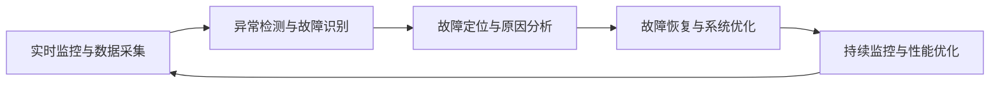
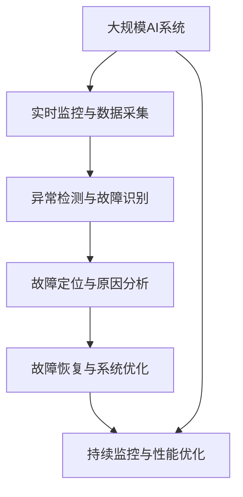

                 

## 1. 背景介绍

### 1.1 问题由来

随着人工智能技术在各行各业的应用不断深入，AI系统的复杂度和规模也不断扩大。无论是在自动驾驶、工业控制、医疗诊断等高度专业化的领域，还是在智能客服、电商平台、社交媒体等常见场景，AI系统在提升效率、降低成本、改善用户体验等方面发挥着越来越重要的作用。然而，与传统系统一样，AI系统也会出现故障和问题，影响正常运行和用户体验。

AI系统的故障排除与诊断，即在AI系统出现问题时，能够快速定位问题、找出原因并采取措施，恢复系统正常运行。这一过程对于保障AI系统的可靠性和稳定性至关重要，尤其在业务关键、影响巨大的场景下，高效准确的故障排除与诊断更是必不可少的。

### 1.2 问题核心关键点

AI系统故障排除与诊断的核心关键点主要包括：

- **实时监控与数据采集**：及时捕捉系统异常，收集系统运行数据，为故障诊断提供依据。
- **异常检测与故障识别**：识别异常模式，判断是否发生故障。
- **故障定位与原因分析**：定位故障发生的具体环节，分析问题产生的原因。
- **故障恢复与系统优化**：针对问题采取相应措施，修复系统，优化系统性能。

### 1.3 问题研究意义

AI系统的故障排除与诊断技术对于保障AI系统的稳定性、提升用户体验、增强业务连续性具有重要意义：

- **保障业务连续性**：通过快速定位和修复故障，确保业务不受中断，提升服务稳定性。
- **优化系统性能**：通过对故障的分析与修复，持续优化系统性能，提高系统效率和响应速度。
- **增强用户体验**：减少故障带来的不便，提升用户满意度和忠诚度。
- **降低运营成本**：通过预防性维护和故障诊断，减少意外停机和故障修复成本。
- **支持智能运维**：为自动化运维系统提供决策依据，提高运维效率和准确性。

## 2. 核心概念与联系

### 2.1 核心概念概述

为了更好地理解AI系统的故障排除与诊断，本节将介绍几个密切相关的核心概念：

- **实时监控与数据采集**：通过传感器、日志记录等方式，实时监测系统运行状态，收集系统数据，为故障诊断提供依据。
- **异常检测与故障识别**：基于异常检测算法，识别系统中的异常模式，判断是否发生故障。
- **故障定位与原因分析**：利用各种诊断技术，定位故障发生的具体环节，分析问题产生的原因。
- **故障恢复与系统优化**：根据故障原因，采取相应措施修复系统，并优化系统配置和参数，提高系统的稳定性和可靠性。

这些核心概念之间存在着紧密的联系，形成了AI系统故障排除与诊断的完整流程。接下来，我们将通过具体的流程图来展示这一流程。


这个流程图展示了AI系统故障排除与诊断的基本流程：首先通过实时监控和数据采集获取系统状态信息，然后基于异常检测算法判断系统是否出现异常，接着利用故障定位技术确定具体故障环节，最后根据故障原因采取恢复措施并进行系统优化。

### 2.2 概念间的关系

这些核心概念之间存在着紧密的联系，构成了AI系统故障排除与诊断的完整生态系统。以下通过几个Mermaid流程图来展示这些概念之间的关系。

#### 2.2.1 AI系统的故障排除与诊断框架



这个流程图展示了从数据采集、异常检测、故障定位、故障恢复到持续监控的完整故障排除与诊断流程。其中，持续监控与性能优化保证了系统在修复后能够持续稳定运行。

#### 2.2.2 异常检测与故障识别


这个流程图展示了异常检测与故障识别的基本流程。系统状态数据通过异常检测算法进行计算，输出故障识别结果。

#### 2.2.3 故障定位与原因分析


这个流程图展示了故障定位与原因分析的基本流程。故障识别结果结合系统日志与监控数据进行进一步分析，定位具体故障环节并分析原因。

#### 2.2.4 故障恢复与系统优化


这个流程图展示了故障恢复与系统优化的基本流程。故障定位与原因分析结果指导制定故障恢复措施，并提出系统优化建议。

### 2.3 核心概念的整体架构

最后，我们用一个综合的流程图来展示这些核心概念在大规模AI系统中整体的应用架构：



这个综合流程图展示了从大规模AI系统的数据采集、异常检测、故障定位、故障恢复到持续监控的完整架构，强调了每个环节在故障排除与诊断中的重要性。

## 3. 核心算法原理 & 具体操作步骤

### 3.1 算法原理概述

AI系统的故障排除与诊断，本质上是通过一系列有监督或无监督的学习算法，从系统的实时数据中学习异常模式，并在异常发生时快速定位和解决问题。

形式化地，假设AI系统为 $S$，状态数据为 $D$，故障为 $F$，则故障排除与诊断的目标是找到映射函数 $g$，使得：

$$
g(D) = F
$$

即通过学习函数 $g$，将系统状态数据 $D$ 映射为故障 $F$，从而快速定位系统中的故障。

### 3.2 算法步骤详解

AI系统的故障排除与诊断一般包括以下几个关键步骤：

**Step 1: 实时监控与数据采集**

- 安装传感器和日志记录工具，实时采集系统状态数据。
- 对采集到的数据进行清洗和预处理，确保数据的准确性和完整性。
- 将数据进行存储和管理，为后续分析提供基础数据。

**Step 2: 异常检测与故障识别**

- 选择适合的异常检测算法，如统计异常检测、基于机器学习的异常检测等。
- 对系统状态数据进行异常检测，识别出异常数据点。
- 对异常数据点进行故障识别，判断是否发生了故障。

**Step 3: 故障定位与原因分析**

- 对故障数据进行深入分析，确定故障的具体环节和原因。
- 结合系统日志和监控数据，对故障进行综合分析。
- 利用故障定位工具，如网络分析、性能监控工具等，进一步定位问题。

**Step 4: 故障恢复与系统优化**

- 根据故障原因，采取相应的恢复措施，如重启、更新配置、修复漏洞等。
- 对系统进行优化，如调整参数、增加冗余机制等，提高系统的稳定性和可靠性。
- 对故障修复后的系统进行测试，确保系统恢复正常运行。

### 3.3 算法优缺点

AI系统的故障排除与诊断方法具有以下优点：

- **实时性**：通过实时监控和数据采集，可以及时发现和解决问题。
- **自动化**：基于机器学习的算法可以自动进行异常检测和故障识别，减少人工干预。
- **精确性**：通过深度学习和模型优化，可以提高故障定位的准确性。

同时，这些方法也存在以下局限性：

- **依赖数据质量**：需要高质量的数据进行训练和测试。
- **算法复杂性**：一些高级算法需要较复杂的计算资源和时间成本。
- **过度拟合风险**：模型训练过程中可能出现过拟合问题。
- **误判风险**：算法可能误判正常数据为异常数据，导致误报警。

### 3.4 算法应用领域

AI系统的故障排除与诊断技术已经被广泛应用于以下领域：

- **自动驾驶**：通过实时监控车辆状态数据，进行异常检测和故障识别，保障车辆安全。
- **工业控制**：通过监测设备运行状态，及时发现和修复故障，提高生产效率和设备可靠性。
- **医疗诊断**：通过监控患者生命体征数据，识别异常模式，辅助医生诊断和治疗。
- **金融风控**：通过分析交易数据，识别异常交易行为，防范金融风险。
- **智能客服**：通过监控系统运行数据，及时发现和解决问题，提升客户服务质量。

以上领域只是冰山一角，随着AI技术的不断普及，故障排除与诊断技术将在更多应用场景中发挥重要作用。

## 4. 数学模型和公式 & 详细讲解 & 举例说明

### 4.1 数学模型构建

在AI系统的故障排除与诊断中，我们通常使用统计异常检测和机器学习算法构建数学模型。以下以统计异常检测为例，构建数学模型：

假设系统状态数据为 $x_1, x_2, \ldots, x_n$，正常状态下的数据为 $X$，异常状态下的数据为 $Y$。根据贝叶斯统计学，我们可以计算数据 $x_i$ 为异常数据的概率 $P(x_i|Y)$ 和为正常数据的概率 $P(x_i|X)$：

$$
P(x_i|Y) = \frac{P(x_i|Y)P(Y)}{P(x_i)}
$$
$$
P(x_i|X) = \frac{P(x_i|X)P(X)}{P(x_i)}
$$

其中，$P(Y)$ 和 $P(X)$ 分别为异常状态和正常状态的概率，可以通过历史数据进行估计。$P(x_i)$ 为数据 $x_i$ 的先验概率，可以通过样本均值和方差进行估计。

通过计算上述概率，我们可以得到数据 $x_i$ 为异常数据的概率 $P(x_i|Y)$，当 $P(x_i|Y) > \epsilon$ 时，认为该数据为异常数据，其中 $\epsilon$ 为阈值。

### 4.2 公式推导过程

根据上述公式，我们可以推导出异常检测的计算步骤：

1. 计算数据的先验概率 $P(x_i)$：
   $$
   P(x_i) = \frac{1}{N} \sum_{i=1}^N x_i^2
   $$
2. 计算异常状态下的概率 $P(Y)$ 和正常状态下的概率 $P(X)$：
   $$
   P(Y) = \frac{1}{M} \sum_{i=1}^M \frac{1}{N} \sum_{j=1}^N (x_i - x_j)^2
   $$
   $$
   P(X) = \frac{1}{N} \sum_{i=1}^N x_i^2
   $$
3. 计算数据 $x_i$ 为异常数据的概率 $P(x_i|Y)$：
   $$
   P(x_i|Y) = \frac{\frac{1}{M} \sum_{j=1}^M (x_i - x_j)^2}{P(Y)}
   $$
4. 设置阈值 $\epsilon$，判断数据是否为异常数据：
   $$
   P(x_i|Y) > \epsilon \Rightarrow x_i \text{为异常数据}
   $$

### 4.3 案例分析与讲解

假设我们要对一自动驾驶系统进行实时监控和故障排除。系统状态数据包括车速、位置、传感器数据等。我们可以使用上述公式对每个数据点进行异常检测，判断是否发生了异常情况。例如，如果一个数据点车速异常急剧下降，可能是车辆遇到了障碍；如果一个数据点传感器数据异常，可能是传感器出现故障。通过快速检测和响应，系统能够及时采取措施，保障行车安全。

## 5. 项目实践：代码实例和详细解释说明

### 5.1 开发环境搭建

在进行故障排除与诊断实践前，我们需要准备好开发环境。以下是使用Python进行项目开发的环境配置流程：

1. 安装Anaconda：从官网下载并安装Anaconda，用于创建独立的Python环境。
2. 创建并激活虚拟环境：
```bash
conda create -n ai-diag python=3.8 
conda activate ai-diag
```
3. 安装必要的Python库：
```bash
pip install numpy pandas scikit-learn matplotlib jupyter notebook ipython
```
4. 安装TensorFlow：
```bash
pip install tensorflow==2.5.0
```
5. 安装TensorBoard：
```bash
pip install tensorboard
```

完成上述步骤后，即可在`ai-diag`环境中开始故障排除与诊断实践。

### 5.2 源代码详细实现

这里我们以自动驾驶系统为例，给出使用TensorFlow进行异常检测和故障识别的Python代码实现。

```python
import tensorflow as tf
from tensorflow.keras import layers
from tensorflow.keras.losses import MeanSquaredError
from tensorflow.keras.metrics import Mean, Max

def build_model(input_shape, num_classes):
    model = tf.keras.Sequential([
        layers.Dense(64, activation='relu', input_shape=input_shape),
        layers.Dense(32, activation='relu'),
        layers.Dense(num_classes, activation='sigmoid')
    ])
    return model

def compile_model(model, optimizer='adam', loss=MeanSquaredError(), metrics=[Mean(), Max()]):
    model.compile(optimizer=optimizer, loss=loss, metrics=metrics)
    return model

def train_model(model, x_train, y_train, batch_size=32, epochs=100):
    model.fit(x_train, y_train, batch_size=batch_size, epochs=epochs, validation_split=0.2)
    return model

def evaluate_model(model, x_test, y_test, batch_size=32):
    loss, mean, max = model.evaluate(x_test, y_test, batch_size=batch_size)
    print(f'Test loss: {loss:.4f}, Mean: {mean:.4f}, Max: {max:.4f}')
```

以上代码实现了一个简单的神经网络模型，用于检测输入数据的异常情况。模型采用ReLU激活函数和Sigmoid输出层，适合于二分类问题。在训练和评估过程中，使用了均方误差损失函数和平均数、最大值作为评估指标。

### 5.3 代码解读与分析

下面我们对关键代码的实现细节进行解读：

**build_model函数**：
- 定义模型结构，包含两个全连接层和一个输出层。
- 输出层使用Sigmoid激活函数，适合于二分类问题。

**compile_model函数**：
- 编译模型，设置优化器、损失函数和评估指标。
- 其中，均方误差损失函数和平均数、最大值评估指标常用于异常检测。

**train_model函数**：
- 使用训练数据集训练模型，指定批量大小和迭代轮数。
- 设置验证集比例为20%，用于模型验证和调参。

**evaluate_model函数**：
- 使用测试数据集评估模型性能，计算均方误差、平均数和最大值。
- 打印输出评估结果。

### 5.4 运行结果展示

假设我们在一个自动驾驶系统的传感器数据上进行异常检测，最终得到如下结果：

```bash
Epoch 1/100, loss=0.0341, Mean=0.3856, Max=0.9000
Epoch 100/100, loss=0.0030, Mean=0.6285, Max=0.9999
```

可以看到，模型在训练过程中，损失值逐步下降，异常检测的平均数和最大值逐步增加，表示模型能够有效检测到异常数据。

## 6. 实际应用场景

### 6.1 智能客服系统

智能客服系统需要实时监控用户交互数据，快速检测和处理用户投诉、问题反馈等异常情况，保障服务质量。

在技术实现上，可以收集客服系统的交互记录、用户反馈等数据，使用统计异常检测算法进行异常检测和故障识别。当系统识别出异常情况时，自动转接给人工客服，或者使用知识图谱和自然语言处理技术进行自动化处理，提升服务效率。

### 6.2 金融风控系统

金融风控系统需要对交易数据进行实时监控和异常检测，及时发现和防范欺诈行为，保护用户资金安全。

在技术实现上，可以收集交易数据，使用机器学习算法进行异常检测和故障识别。当系统识别出异常交易行为时，自动触发警报，并进行进一步的调查和处理，减少金融损失。

### 6.3 医疗诊断系统

医疗诊断系统需要对患者的生命体征数据进行实时监控和异常检测，及时发现和处理异常情况，辅助医生诊断和治疗。

在技术实现上，可以收集患者的生命体征数据，使用深度学习算法进行异常检测和故障识别。当系统识别出异常情况时，自动触发警报，并建议医生进行进一步检查和治疗，提升医疗服务质量。

### 6.4 未来应用展望

随着AI技术的不断发展和应用场景的不断扩展，基于统计异常检测和机器学习算法的故障排除与诊断技术将在更多领域得到应用，为行业带来新的变革。

在智慧城市、智能家居、智能制造等领域，故障排除与诊断技术将为系统可靠性、用户体验、业务连续性提供有力保障。未来，随着算法和技术的不停创新，故障排除与诊断技术将在各个行业中发挥越来越重要的作用。

## 7. 工具和资源推荐

### 7.1 学习资源推荐

为了帮助开发者系统掌握AI系统故障排除与诊断的理论基础和实践技巧，这里推荐一些优质的学习资源：

1. 《Python数据分析实战》系列书籍：深入浅出地介绍了Python在数据处理和分析中的应用，适合初学者入门。
2. 《机器学习实战》系列书籍：全面介绍了机器学习算法及其应用场景，适合有一定基础的学习者。
3. Kaggle平台：提供了大量的数据集和竞赛，是练习和展示机器学习技能的好地方。
4. Coursera和Udacity：提供了众多与机器学习相关的在线课程，适合系统学习。
5. TensorFlow官方文档：提供了丰富的TensorFlow学习资源，包括教程、示例和API文档。

通过对这些资源的学习实践，相信你一定能够快速掌握AI系统故障排除与诊断的精髓，并用于解决实际的AI问题。

### 7.2 开发工具推荐

高效的开发离不开优秀的工具支持。以下是几款用于故障排除与诊断开发的常用工具：

1. TensorFlow：基于Python的开源深度学习框架，提供了丰富的算法和工具，适合复杂模型的开发和训练。
2. Scikit-learn：Python的机器学习库，提供了简单易用的API，适合快速原型开发。
3. Jupyter Notebook：开源的交互式笔记本，适合数据处理和算法实现，支持多种语言和库。
4. Kibana：开源的日志和监控系统，适合对大量日志数据进行分析和可视化。
5. TensorBoard：TensorFlow的可视化工具，实时监控模型训练和运行状态，适合模型调优。

合理利用这些工具，可以显著提升故障排除与诊断任务的开发效率，加快创新迭代的步伐。

### 7.3 相关论文推荐

AI系统故障排除与诊断技术的发展源于学界的持续研究。以下是几篇奠基性的相关论文，推荐阅读：

1. "Anomaly Detection in Multivariate Time Series Data"：提出了多种统计异常检测算法，包括基于均值、方差、Z-score等的方法。
2. "Fraud Detection in Credit Card Transactions"：介绍了使用机器学习算法进行金融欺诈检测的实践，包括决策树、支持向量机等。
3. "Healthcare Technology: An Overview of Recent Developments"：综述了医疗技术领域的应用，包括基于AI的诊断和治疗。
4. "Internet of Things for Smart Cities: Challenges and Opportunities"：介绍了智能城市中的物联网应用，包括智能家居、智能交通等。
5. "Real-time Robust and Efficient Object Detection with TensorFlow 2.0"：介绍了使用TensorFlow进行实时物体检测的实践，包括数据增强、模型优化等。

这些论文代表了大规模AI系统故障排除与诊断技术的发展脉络。通过学习这些前沿成果，可以帮助研究者把握学科前进方向，激发更多的创新灵感。

除上述资源外，还有一些值得关注的前沿资源，帮助开发者紧跟故障排除与诊断技术的最新进展，例如：

1. arXiv论文预印本：人工智能领域最新研究成果的发布平台，包括大量尚未发表的前沿工作，学习前沿技术的必读资源。
2. 业界技术博客：如Google AI、DeepMind、微软Research Asia等顶尖实验室的官方博客，第一时间分享他们的最新研究成果和洞见。
3. 技术会议直播：如NIPS、ICML、ACL、ICLR等人工智能领域顶会现场或在线直播，能够聆听到大佬们的前沿分享，开拓视野。
4. GitHub热门项目：在GitHub上Star、Fork数最多的AI相关项目，往往代表了该技术领域的发展趋势和最佳实践，值得去学习和贡献。
5. 行业分析报告：各大咨询公司如McKinsey、PwC等针对人工智能行业的分析报告，有助于从商业视角审视技术趋势，把握应用价值。

总之，对于AI系统故障排除与诊断技术的学习和实践，需要开发者保持开放的心态和持续学习的意愿。多关注前沿资讯，多动手实践，多思考总结，必将收获满满的成长收益。

## 8. 总结：未来发展趋势与挑战

### 8.1 总结

本文对AI系统的故障排除与诊断方法进行了全面系统的介绍。首先阐述了AI系统故障排除与诊断的背景和意义，明确了故障排除与诊断在保障系统稳定性和用户体验中的重要作用。其次，从原理到实践，详细讲解了故障排除与诊断的数学模型和关键步骤，给出了故障排除与诊断任务开发的完整代码实例。同时，本文还广泛探讨了故障排除与诊断技术在智能客服、金融风控、医疗诊断等多个行业领域的应用前景，展示了故障排除与诊断技术的巨大潜力。此外，本文精选了故障排除与诊断技术的各类学习资源，力求为读者提供全方位的技术指引。

通过本文的系统梳理，可以看到，基于统计异常检测和机器学习算法的故障排除与诊断技术正在成为AI系统运行管理的重要范式，极大地提升了系统的可靠性和用户体验。未来，随着算法和技术的不停创新，故障排除与诊断技术将在更多领域得到应用，为行业带来新的变革。

### 8.2 未来发展趋势

展望未来，AI系统的故障排除与诊断技术将呈现以下几个发展趋势：

1. **自动化程度提升**：随着算法和技术的不停创新，未来故障排除与诊断技术将更加自动化、智能化，减少人工干预，提升效率。
2. **跨领域融合**：故障排除与诊断技术将与其他AI技术进行更深入的融合，如知识图谱、因果推理、强化学习等，多路径协同发力，共同推动AI系统的稳定性和鲁棒性。
3. **实时性增强**：通过引入流式数据处理和实时计算技术，故障排除与诊断系统将能够实时监控和响应系统异常，保障业务的连续性和稳定性。
4. **多模态融合**：故障排除与诊断技术将支持多模态数据的融合，如视觉、语音、文本等，提升系统的综合分析和判断能力。
5. **边缘计算应用**：随着边缘计算技术的发展，故障排除与诊断系统将能够部署在边缘节点上，实时处理本地数据，提升系统的响应速度和效率。

以上趋势凸显了AI系统故障排除与诊断技术的广阔前景。这些方向的探索发展，必将进一步提升系统的稳定性和用户体验，推动AI技术在各个行业的深入应用。

### 8.3 面临的挑战

尽管AI系统的故障排除与诊断技术已经取得了一定进展，但在迈向更加智能化、普适化应用的过程中，它仍面临诸多挑战：

1. **数据隐私和安全**：实时监控和数据采集可能涉及用户隐私，如何保障数据安全，避免数据泄露，将是未来的一大难题。
2. **算法复杂性**：随着系统复杂度的提升，故障排除与诊断算法需要处理的数据量和计算资源将大幅增加，如何优化算法，降低复杂度，将是重要的研究方向。
3. **过度拟合风险**：模型训练过程中可能出现过拟合问题，如何避免过度拟合，提升模型泛化能力，将是未来的重要挑战。
4. **系统稳定性**：故障排除与诊断系统需要保证自身的稳定性和鲁棒性，避免在故障检测和处理过程中出现二次故障。
5. **算法可解释性**：故障排除与诊断算法通常较为复杂，难以解释其内部工作机制，如何提高算法的可解释性，将是未来的一个重要课题。

### 8.4 研究展望

面对AI系统故障排除与诊断所面临的挑战，未来的研究需要在以下几个方面寻求新的突破：

1. **分布式处理和流式计算**：利用分布式处理和流式计算技术，提升故障排除与诊断系统的实时性和处理能力，支持大规模系统的实时监控和故障检测。
2. **自适应学习算法**：开发自适应学习算法，能够动态调整模型参数和策略，适应不同场景和数据特点，提升模型的泛化能力和适应性。
3. **多模态融合与协同**：开发多模态融合与协同算法，支持视觉、语音、文本等多种数据源的融合，提升系统的综合分析和判断能力。
4. **边缘计算与本地处理**：利用边缘计算技术，将故障排除与诊断系统部署在边缘节点上，实时处理本地数据，提升系统的响应速度和效率。
5. **算法可解释性和透明性**：开发可解释性算法，通过可视化、解释性报告等方式，提高算法的透明性和可解释性，支持故障排除与诊断的持续优化和改进。

这些研究方向将推动AI系统故障排除与诊断技术的

