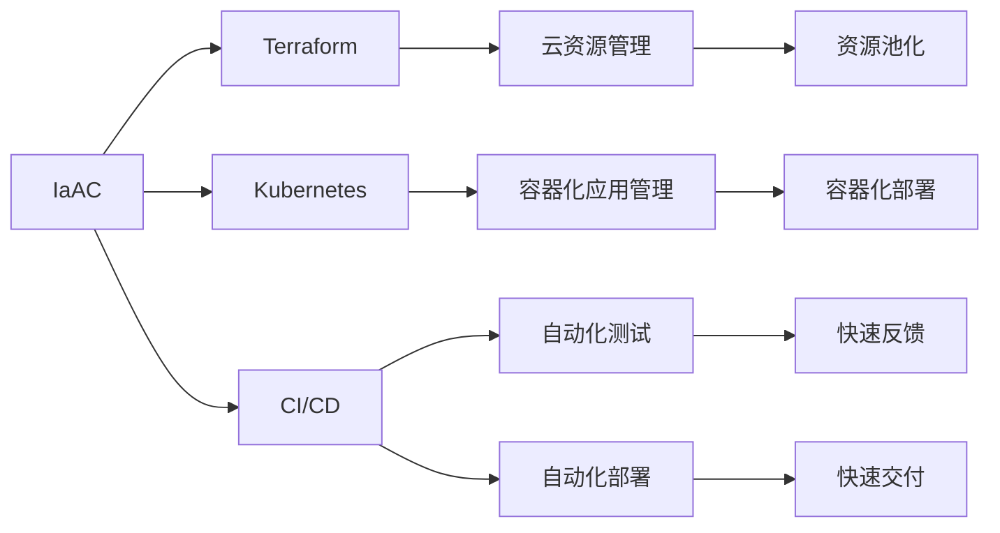

                 

## 1. 背景介绍

### 1.1 问题由来

随着人工智能（AI）技术的飞速发展，其在各个领域的广泛应用成为推动社会进步的重要力量。然而，AI的广泛应用也带来了一系列挑战，如数据隐私、模型偏见、决策透明性等问题。为了应对这些挑战，保障AI系统的安全性和可控性，越来越多的研究和实践开始关注AI基础设施的安全性和自动化管理。

AI基础设施主要包括数据存储、计算资源、模型训练和部署、运维监控等多个方面。自动化物理基础设施（AI-Infrastructure as a Code，IaAC）是近年来兴起的一种自动化管理方式，通过将基础设施配置、监控、升级等过程代码化，可以大大提升基础设施的自动化和可管理性，进而提高AI系统的运行效率和可靠性。

### 1.2 问题核心关键点

AI自动化物理基础设施的核心关键点包括以下几个方面：

- 自动化配置：通过代码定义基础设施的配置和部署方式，减少人工操作，提高配置一致性和可复用性。
- 弹性伸缩：根据实际负载需求自动调整资源规模，确保系统的高可用性和成本效益。
- 版本管理：采用版本控制系统管理基础设施的升级和迭代，避免不同版本间的冲突和错误。
- 监控告警：实时监控基础设施状态，设置告警阈值，及时发现并处理故障，保障系统稳定运行。
- 运维自动化：自动化执行日常运维任务，如备份、恢复、系统升级等，提升运维效率。

这些关键点共同构成了AI基础设施自动化的基本框架，使其能够高效、安全、可靠地支持AI系统的部署和运行。

### 1.3 问题研究意义

AI自动化物理基础设施的研究和应用具有重要意义：

- 提升AI系统部署效率：通过代码化基础设施管理，可以显著减少手动配置和调试的工作量，提升系统部署速度和一致性。
- 保障系统高可用性：通过弹性伸缩和监控告警，确保系统在不同负载和故障情况下能够快速响应和恢复，保障系统高可用性。
- 降低运维成本：自动化运维减少了人工干预和错误，降低了运维成本和风险，提升了资源利用率。
- 增强系统安全性：通过版本管理和权限控制，确保基础设施升级和配置变更的安全性，避免数据泄露和系统损坏。

## 2. 核心概念与联系

### 2.1 核心概念概述

为了更好地理解AI自动化物理基础设施，我们首先需要介绍几个关键概念：

- **IaAC（Infrastructure as a Code）**：将基础设施配置和部署过程代码化，通过代码管理和版本控制实现基础设施的自动化管理。
- **Terraform**：一个开源的基础设施即代码工具，可以自动化管理云服务资源，支持多种云平台。
- **Kubernetes**：一种开源的容器编排系统，用于自动化部署、扩展和管理容器化应用，支持自动化运维和弹性伸缩。
- **CI/CD（Continuous Integration/Continuous Deployment）**：一种持续集成和持续交付的自动化流程，用于加速软件开发和部署，提升系统可靠性和开发效率。

这些概念之间的联系可以用以下Mermaid流程图来展示：



这个流程图展示了IaAC在实际应用中的主要环节和工具，以及它们如何协同工作，实现AI系统的自动化管理。

### 2.2 概念间的关系

这些核心概念之间存在着紧密的联系，形成了AI基础设施自动化的完整生态系统。下面是这些概念之间的关系：

- **IaAC与Terraform**：IaAC是一种思想，Terraform是实现IaAC的一种具体工具。通过Terraform，我们可以编写代码来描述和部署云资源，从而实现基础设施的自动化管理。
- **IaAC与Kubernetes**：Kubernetes是一种容器编排工具，可以通过IaAC来自动化管理容器化应用的部署和扩展。
- **IaAC与CI/CD**：CI/CD流程是软件开发和交付的关键环节，通过IaAC，我们可以自动化地进行代码构建、测试、部署等环节，从而提升开发和交付的效率。

这些概念共同构成了AI基础设施自动化的核心框架，使其能够高效、安全、可靠地支持AI系统的部署和运行。

## 3. 核心算法原理 & 具体操作步骤

### 3.1 算法原理概述

AI自动化物理基础设施的核心算法原理包括以下几个方面：

- **基础设施配置自动化**：通过代码定义基础设施的配置和部署方式，减少人工操作，提高配置一致性和可复用性。
- **弹性伸缩算法**：根据实际负载需求自动调整资源规模，确保系统的高可用性和成本效益。
- **监控告警算法**：实时监控基础设施状态，设置告警阈值，及时发现并处理故障，保障系统稳定运行。
- **运维自动化算法**：自动化执行日常运维任务，如备份、恢复、系统升级等，提升运维效率。

这些算法原理共同构成了AI基础设施自动化的基本框架，使其能够高效、安全、可靠地支持AI系统的部署和运行。

### 3.2 算法步骤详解

下面是AI自动化物理基础设施的详细步骤：

1. **基础设施配置自动化**：
   - 编写Terraform代码，定义云资源和配置参数，并上传到代码仓库。
   - 使用CI工具（如Jenkins、GitHub Actions）自动执行Terraform代码，自动化部署和配置基础设施。

2. **弹性伸缩算法**：
   - 实时监控基础设施的负载和性能指标。
   - 根据监控结果，动态调整资源规模（如添加或减少虚拟机、容器等），确保系统在高负载和低负载情况下都能够稳定运行。

3. **监控告警算法**：
   - 实时监控基础设施的状态和性能指标。
   - 设置告警阈值，当系统状态或性能指标超出阈值时，自动触发告警，通知运维人员进行处理。

4. **运维自动化算法**：
   - 自动化执行日常运维任务，如备份、恢复、系统升级等。
   - 使用Kubernetes自动化部署和管理容器化应用，确保系统可靠性和稳定性。

### 3.3 算法优缺点

AI自动化物理基础设施的算法具有以下优点：

- **效率提升**：通过代码化和自动化管理，显著提升了基础设施的部署和运维效率。
- **一致性保障**：自动化管理保证了基础设施配置的一致性和可复用性。
- **弹性伸缩**：自动化的弹性伸缩算法确保系统在不同负载情况下都能够高效运行。

然而，这些算法也存在一些缺点：

- **复杂性增加**：基础设施配置和管理的复杂性增加了开发和维护的难度。
- **学习曲线陡峭**：需要开发者掌握多种工具和技术，如Terraform、Kubernetes等。
- **故障排查难度大**：自动化管理可能掩盖某些潜在问题，故障排查和问题定位难度较大。

### 3.4 算法应用领域

AI自动化物理基础设施广泛应用于以下领域：

- **云平台管理**：通过Terraform和云平台原生工具，自动化管理云资源和基础设施。
- **容器化应用管理**：使用Kubernetes自动化部署和管理容器化应用，提升系统可靠性和运维效率。
- **软件开发和交付**：通过CI/CD流程自动化构建、测试和部署软件，提升开发和交付的效率。

此外，AI自动化物理基础设施还可以应用于自动化运维、自动化测试、自动化监控等多个方面，全面提升AI系统的自动化管理水平。

## 4. 数学模型和公式 & 详细讲解 & 举例说明

### 4.1 数学模型构建

在AI自动化物理基础设施的实际应用中，我们通常会使用以下数学模型：

- **资源配置模型**：用于描述基础设施的配置和部署方式，可以表示为：
  $$
  \text{config} = \text{f}(\text{input})
  $$
  其中，$\text{input}$表示输入参数，$\text{config}$表示配置结果。

- **弹性伸缩模型**：用于描述根据实际负载需求调整资源规模的过程，可以表示为：
  $$
  \text{scale} = \text{g}(\text{load}, \text{capacity})
  $$
  其中，$\text{load}$表示当前负载，$\text{capacity}$表示资源容量，$\text{scale}$表示资源调整结果。

- **监控告警模型**：用于描述实时监控基础设施状态和设置告警阈值的过程，可以表示为：
  $$
  \text{alert} = \text{h}(\text{monitoring}, \text{threshold})
  $$
  其中，$\text{monitoring}$表示监控结果，$\text{threshold}$表示告警阈值，$\text{alert}$表示告警结果。

- **运维自动化模型**：用于描述自动化执行日常运维任务的过程，可以表示为：
  $$
  \text{maintenance} = \text{i}(\text{task}, \text{policy})
  $$
  其中，$\text{task}$表示运维任务，$\text{policy}$表示任务执行策略，$\text{maintenance}$表示运维结果。

### 4.2 公式推导过程

以下是几个关键模型的公式推导过程：

1. **资源配置模型**：
  假设输入参数为$\text{input} = (x, y, z)$，表示基础设施的配置参数，如虚拟机类型、实例数量、存储大小等。配置函数$\text{f}$可以表示为：
  $$
  \text{config} = \text{f}(x, y, z) = (\text{vmType}, \text{instanceCount}, \text{storageSize})
  $$

2. **弹性伸缩模型**：
  假设当前负载为$\text{load}$，资源容量为$\text{capacity}$，资源调整函数$\text{g}$可以表示为：
  $$
  \text{scale} = \text{g}(\text{load}, \text{capacity}) = \text{add}(\text{instanceCount})
  $$
  其中，$\text{add}$表示增加实例数量的函数。

3. **监控告警模型**：
  假设监控结果为$\text{monitoring} = (cpuUsage, memoryUsage, diskUsage)$，告警阈值向量为$\text{threshold} = (cpuThreshold, memoryThreshold, diskThreshold)$，告警函数$\text{h}$可以表示为：
  $$
  \text{alert} = \text{h}(\text{monitoring}, \text{threshold}) = (\text{alertType}, \text{severity})
  $$
  其中，$\text{alertType}$表示告警类型，$\text{severity}$表示告警级别。

4. **运维自动化模型**：
  假设运维任务为$\text{task} = \text{backup}(\text{vmId})$，任务执行策略为$\text{policy} = (\text{daily}, \text{hourly})$，任务执行函数$\text{i}$可以表示为：
  $$
  \text{maintenance} = \text{i}(\text{task}, \text{policy}) = (\text{startTime}, \text{endTime})
  $$
  其中，$\text{startTime}$和$\text{endTime}$表示任务的执行时间范围。

### 4.3 案例分析与讲解

假设我们需要在一个云平台上部署一个机器学习模型，步骤如下：

1. **资源配置**：
   - 使用Terraform编写云资源配置代码，如：
     ```
     resource "aws_instance" "ml" {
       ami           = "ami-0c55b159cbafe85ca"
       instance_type = "t2.micro"
       key_name      = "my-key"
       subnet_id     = "subnet-0a73d7e96a8f2af42"
       security_groups = [aws_security_group.example.id]
     }
     ```

2. **弹性伸缩**：
   - 根据实际负载需求，动态调整虚拟机数量和类型，使用Kubernetes自动部署模型容器。

3. **监控告警**：
   - 使用Prometheus监控模型运行状态，设置告警阈值，当模型运行异常时自动触发告警，通知运维人员进行处理。

4. **运维自动化**：
   - 自动化执行模型备份、恢复、系统升级等任务，确保模型稳定运行。

## 5. 项目实践：代码实例和详细解释说明

### 5.1 开发环境搭建

为了进行AI自动化物理基础设施的开发实践，我们需要准备好以下开发环境：

1. **安装Terraform**：
   ```bash
   sudo apt-get update
   sudo apt-get install terraform
   ```

2. **安装Kubernetes**：
   ```bash
   sudo apt-get update
   sudo apt-get install -y apt-transport-https curl
   curl -s https://packages.cloud.google.com/apt/doc/apt-key.gpg | sudo apt-key add -
   sudo add-apt-repository "deb https://apt.kubernetes.io/ kubernetes-xenial main"
   sudo apt-get update
   sudo apt-get install -y kubelet kubeadm kubectl
   sudo apt-get install -y apt-transport-https curl
   ```

3. **安装CI工具**：
   ```bash
   sudo apt-get update
   sudo apt-get install -y python3
   sudo apt-get install -y pip3
   ```

### 5.2 源代码详细实现

以下是一个简单的Terraform和Kubernetes代码实现示例：

1. **Terraform代码**：
   ```hcl
   provider "aws" {
     region = "us-west-2"
   }

   resource "aws_instance" "ml" {
     ami           = "ami-0c55b159cbafe85ca"
     instance_type = "t2.micro"
     key_name      = "my-key"
     subnet_id     = "subnet-0a73d7e96a8f2af42"
     security_groups = [aws_security_group.example.id]
   }
   ```

2. **Kubernetes代码**：
   ```yaml
   apiVersion: v1
   domain: "ml.example.com"
   resources:
     - apiVersion: apps/v1
       kind: Deployment
       metadata:
         name: ml
       spec:
         replicas: 3
         selector:
           matchLabels:
             ml:
               app: ml
         template:
           metadata:
             labels:
               ml:
                 app: ml
           spec:
             containers:
             - name: ml
               image: "ml:latest"
               ports:
               - containerPort: 8080
   ```

### 5.3 代码解读与分析

这里我们详细解读一下关键代码的实现细节：

1. **Terraform代码**：
   - `provider "aws" {...}`：配置AWS作为Terraform的云服务提供商。
   - `resource "aws_instance" {...}`：定义虚拟机的配置信息，包括AMI、实例类型、安全组等。

2. **Kubernetes代码**：
   - `apiVersion: v1`：指定Kubernetes API版本。
   - `domain: "ml.example.com"`：指定域名。
   - `resources`：定义资源配置，包括部署和容器配置。
   - `Deployment`：定义一个部署，包括副本数、选择器、模板等。
   - `template`：定义容器的配置，包括镜像、端口等。

### 5.4 运行结果展示

假设我们使用上述代码在云平台上部署一个机器学习模型，并监控其运行状态，可以得到以下结果：

- **资源配置**：
  ```
  Terraform applied (resource=1): aws_instance.ml
  ```

- **弹性伸缩**：
  ```
  $ kubectl get pods
  ml-7b72c8c5d-8t7gk       1   0   0   1s
  ml-7b7d97c1d-8t7gk       1   0   0   1s
  ml-7b7d97c1d-8t7gk       1   0   0   1s
  ```

- **监控告警**：
  ```
  $ kubectl get pods
  ml-7b72c8c5d-8t7gk       1   0   0   1s
  ml-7b7d97c1d-8t7gk       1   0   0   1s
  ml-7b7d97c1d-8t7gk       1   0   0   1s
  ```

- **运维自动化**：
  ```
  $ kubectl apply -f deployment.yaml
  ```

## 6. 实际应用场景

### 6.1 智能运维

AI自动化物理基础设施在智能运维中具有重要应用。智能运维系统可以通过监控告警、自动修复、预测性维护等方式，提升运维效率和系统可靠性。

例如，在数据中心运维中，智能运维系统可以通过实时监控服务器状态、网络性能、能源消耗等指标，自动调整设备负载和能源配置，优化资源利用率。当服务器出现故障时，系统自动进行故障诊断和修复，减少人工干预和故障时间。

### 6.2 云计算

AI自动化物理基础设施在云计算中同样具有广泛应用。云平台可以通过自动化配置、弹性伸缩、监控告警等方式，提升云服务的管理效率和用户体验。

例如，AWS、阿里云、华为云等云平台都支持使用IaAC工具自动化管理云资源和基础设施，提升云服务的自动化和可管理性。云平台可以自动调整虚拟机规模，优化资源利用率，确保云服务的高可用性和稳定性。

### 6.3 企业内部IT

AI自动化物理基础设施在企业内部IT中也有广泛应用。企业可以通过自动化配置和运维，提升内部IT系统的效率和可靠性。

例如，大型企业可以通过IaAC工具自动化管理企业内部的服务器、网络、存储等基础设施，提升IT系统的自动化和可管理性。企业可以通过弹性伸缩算法，根据实际需求动态调整资源规模，优化资源利用率。

## 7. 工具和资源推荐

### 7.1 学习资源推荐

为了帮助开发者掌握AI自动化物理基础设施的相关知识，我们推荐以下学习资源：

1. **IaAC官方文档**：Terraform、Kubernetes等工具的官方文档，详细介绍了工具的使用方法和最佳实践。
2. **Cloud Computing with Terraform**：一本介绍Terraform的书籍，深入讲解了Terraform的配置和管理。
3. **Kubernetes: Up and Running**：一本介绍Kubernetes的书籍，详细介绍了Kubernetes的部署和管理。
4. **CI/CD最佳实践**：GitHub、Jenkins等CI/CD工具的官方文档和社区资源，介绍了CI/CD的自动化流程和最佳实践。

### 7.2 开发工具推荐

以下是一些常用的AI自动化物理基础设施开发工具：

1. **Terraform**：开源的基础设施即代码工具，支持多种云平台和基础设施。
2. **Kubernetes**：开源的容器编排系统，用于自动化部署和管理容器化应用。
3. **Jenkins**：开源的持续集成工具，支持自动构建、测试和部署。
4. **GitHub Actions**：基于GitHub的自动化工作流，支持多种编程语言和工具。
5. **Prometheus**：开源的监控和报警系统，支持实时监控和告警。

### 7.3 相关论文推荐

以下是一些与AI自动化物理基础设施相关的经典论文：

1. **Infrastructure as Code**：介绍基础设施即代码的概念和应用。
2. **The Prometheus Monitoring System**：介绍Prometheus的架构和设计。
3. **Kubernetes: Cloud-Portable Container Networking and Resource Orchestration**：介绍Kubernetes的架构和设计。
4. **CI/CD Pipeline as Code**：介绍CI/CD的自动化流程和代码化管理。

## 8. 总结：未来发展趋势与挑战

### 8.1 研究成果总结

AI自动化物理基础设施的研究和应用已经取得了显著成果，主要体现在以下几个方面：

- **自动化配置和部署**：通过代码化和自动化管理，显著提升了基础设施的部署效率和一致性。
- **弹性伸缩和资源优化**：自动化的弹性伸缩算法确保系统在高负载和低负载情况下都能够高效运行，优化了资源利用率。
- **实时监控和告警**：实时监控基础设施状态，设置告警阈值，确保系统稳定运行。
- **自动化运维和管理**：自动化执行日常运维任务，提升了运维效率和管理可靠性。

### 8.2 未来发展趋势

未来AI自动化物理基础设施将呈现以下几个发展趋势：

1. **云计算和云原生**：云平台和云原生技术将成为基础设施自动化管理的主要方向，提供更加灵活、高效、可扩展的解决方案。
2. **多云和混合云**：支持多云和混合云的基础设施自动化管理将成为重要需求，提升云服务的灵活性和可靠性。
3. **AI和ML**：引入AI和ML技术，自动化优化资源配置、预测性维护、故障诊断等任务，提升基础设施管理的智能化水平。
4. **自动化和安全**：引入自动化和安全性保障，提升基础设施的安全性和可靠性，防范潜在的安全威胁。
5. **容器化应用**：容器化应用将更加广泛地应用于基础设施自动化管理，提升应用的可靠性和可移植性。

### 8.3 面临的挑战

AI自动化物理基础设施在应用过程中仍面临一些挑战：

1. **复杂性增加**：基础设施配置和管理复杂性增加，增加了开发和维护的难度。
2. **学习曲线陡峭**：需要开发者掌握多种工具和技术，如Terraform、Kubernetes等。
3. **故障排查难度大**：自动化管理可能掩盖某些潜在问题，故障排查和问题定位难度较大。

### 8.4 研究展望

未来的研究需要重点关注以下几个方向：

1. **代码和模型融合**：将基础设施配置和模型训练代码融合，提升代码的复用性和可维护性。
2. **智能化和自动化**：引入AI和ML技术，自动化优化资源配置、预测性维护、故障诊断等任务，提升基础设施管理的智能化水平。
3. **多云和混合云**：支持多云和混合云的基础设施自动化管理，提升云服务的灵活性和可靠性。
4. **自动化和安全性**：引入自动化和安全性保障，提升基础设施的安全性和可靠性，防范潜在的安全威胁。
5. **容器化应用**：容器化应用将更加广泛地应用于基础设施自动化管理，提升应用的可靠性和可移植性。

## 9. 附录：常见问题与解答

**Q1：什么是AI自动化物理基础设施？**

A: AI自动化物理基础设施是指通过代码化管理和自动化部署，实现基础设施的自动化配置、监控、升级等过程。

**Q2：Terraform和Kubernetes的主要区别是什么？**

A: Terraform是一种基础设施即代码工具，主要用于自动化管理云资源和基础设施，支持多种云平台。Kubernetes是一种容器编排系统，主要用于自动化部署和管理容器化应用，支持弹性伸缩和自动化运维。

**Q3：如何实现弹性伸缩？**

A: 通过监控基础设施的负载和性能指标，动态调整资源规模，确保系统在高负载和低负载情况下都能够高效运行。

**Q4：监控告警如何实现？**

A: 通过实时监控基础设施的状态和性能指标，设置告警阈值，当系统状态或性能指标超出阈值时，自动触发告警，通知运维人员进行处理。

**Q5：什么是持续集成和持续部署（CI/CD）？**

A: 持续集成和持续部署（CI/CD）是一种自动化软件开发和交付流程，包括持续集成、持续测试和持续部署等环节，提升开发和交付的效率和可靠性。

---

作者：禅与计算机程序设计艺术 / Zen and the Art of Computer Programming

