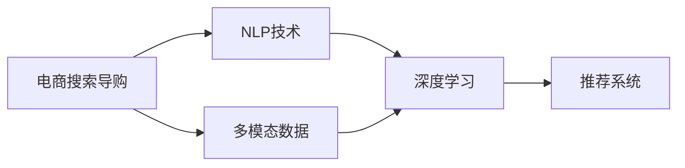
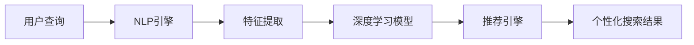
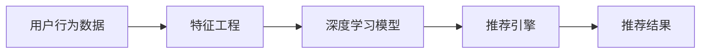
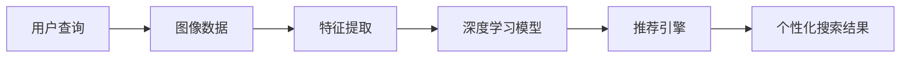

                 

# AI赋能电商搜索导购：提升用户体验和转化率的实践案例

> 关键词：人工智能,电商搜索,用户体验,转化率,深度学习,自然语言处理,推荐系统,多模态学习

## 1. 背景介绍

### 1.1 问题由来
电商搜索导购作为电商平台的核心功能之一，直接影响用户的购物体验和转化率。然而，传统的基于关键词匹配的搜索方式，往往无法理解用户的真实需求，导致搜索结果的相关性和准确性不足，影响用户体验。而基于深度学习技术的AI导购系统，通过理解用户输入的自然语言，生成个性化的搜索结果和推荐，能够显著提升用户满意度，促进转化率。

### 1.2 问题核心关键点
AI导购系统的核心在于如何通过自然语言处理技术，理解用户查询背后的真实意图，并生成个性化的搜索结果和推荐。具体来说，需要解决以下几个关键问题：

- 如何有效地理解用户查询的自然语言表达？
- 如何生成与用户查询意图匹配的个性化搜索结果？
- 如何利用推荐系统技术，提升用户的转化率？
- 如何处理大规模用户数据，提供高效的实时服务？

### 1.3 问题研究意义
电商搜索导购AI技术的提升，对于电商平台的用户体验和商业收益具有重要意义：

- 提升用户满意度：通过精准理解用户需求，生成高质量搜索结果，使用户更快找到所需商品，提升用户购物体验。
- 提高转化率：通过个性化的推荐系统，向用户展示最相关的商品信息，促进用户进行购买决策，提升转化率。
- 增强平台竞争力：通过AI导购技术，电商平台能够提供更为智能化、个性化的服务，吸引和保留更多用户，提升市场竞争力。

## 2. 核心概念与联系

### 2.1 核心概念概述

为更好地理解AI导购系统的实现机制，本节将介绍几个关键概念：

- 电商搜索导购：指电商平台提供的用户输入查询，生成搜索结果，并提供个性化的商品推荐服务。
- 自然语言处理(NLP)：指利用计算机技术处理、理解、生成人类语言的技术，是AI导购系统的重要基础。
- 深度学习：一种模拟人脑神经网络结构和行为的机器学习技术，用于处理大规模非线性数据，提取高级特征。
- 推荐系统：一种基于用户行为和兴趣，推荐个性化商品或内容的技术，是提升用户转化率的关键手段。
- 多模态学习：指同时利用文本、图像、语音等多种模态数据，提升AI导购系统的理解能力和推荐效果。

这些核心概念之间的联系可以通过以下Mermaid流程图来展示：



这个流程图展示了电商搜索导购系统中几个关键组件之间的关系：

- 电商搜索导购系统以用户查询为核心，通过NLP技术理解自然语言，使用深度学习提取高级特征，再结合推荐系统进行个性化推荐，最终通过多模态数据提升系统的理解能力和推荐效果。

### 2.2 概念间的关系

这些核心概念之间存在着紧密的联系，形成了电商搜索导购系统的完整生态系统。下面我们通过几个Mermaid流程图来展示这些概念之间的关系。

#### 2.2.1 电商搜索导购系统的架构



这个流程图展示了电商搜索导购系统的基本架构：

- 用户输入查询后，首先通过NLP引擎进行自然语言处理，提取关键词和语义信息。
- 特征提取模块对处理后的语义信息进行编码，得到高维特征向量。
- 深度学习模型对高维特征进行分类或回归预测，生成与用户查询意图匹配的商品ID。
- 推荐引擎根据商品ID，生成个性化搜索结果和推荐列表。

#### 2.2.2 深度学习与推荐系统的关系



这个流程图展示了深度学习与推荐系统之间的协作关系：

- 深度学习模型根据用户行为数据（如浏览记录、购买历史等），提取高维特征向量。
- 推荐引擎根据高维特征向量，生成个性化推荐结果。
- 推荐结果反馈给用户，用于进一步优化模型和推荐策略。

#### 2.2.3 多模态学习的应用



这个流程图展示了多模态学习在电商搜索导购系统中的应用：

- 用户查询可能包含图片或视频描述，图像数据被提取为高维特征向量。
- 特征提取模块对文本和图像数据进行融合，得到更丰富的语义信息。
- 深度学习模型对融合后的特征进行分类或回归预测，生成商品ID。
- 推荐引擎根据商品ID，生成个性化搜索结果和推荐列表。

## 3. 核心算法原理 & 具体操作步骤
### 3.1 算法原理概述

AI导购系统的主要算法原理包括以下几个关键环节：

1. **用户查询理解**：通过自然语言处理技术，理解用户输入的自然语言查询，提取出关键实体、情感倾向等信息。
2. **特征提取**：将用户查询转换为高维特征向量，用于后续的模型训练和预测。
3. **深度学习模型训练**：使用大规模标注数据，训练深度学习模型，学习用户查询与商品ID之间的映射关系。
4. **个性化推荐生成**：根据用户历史行为数据和当前查询结果，使用推荐系统技术，生成个性化商品推荐。
5. **多模态融合**：结合文本、图像、语音等多模态数据，进一步提升推荐系统的准确性和多样性。

### 3.2 算法步骤详解

以下是对AI导购系统主要算法步骤的详细介绍：

#### 3.2.1 用户查询理解

1. **分词与词性标注**：使用中文分词工具，将用户输入的文本拆分为词汇序列，并标注每个词汇的词性。
2. **命名实体识别**：识别文本中的命名实体，如人名、地名、机构名等。
3. **情感分析**：使用情感分析模型，判断文本的情感倾向，是正面、负面还是中性。
4. **意图识别**：通过机器学习模型，识别用户查询的意图，如查找商品、对比价格、咨询客服等。

#### 3.2.2 特征提取

1. **TF-IDF特征提取**：对处理后的词汇序列进行TF-IDF计算，得到高维文本特征向量。
2. **词嵌入表示**：将每个词汇转换为低维词向量，用于后续的模型训练和预测。
3. **上下文嵌入表示**：使用BERT等预训练语言模型，生成上下文嵌入表示，捕捉词汇之间的语义关系。

#### 3.2.3 深度学习模型训练

1. **模型选择**：选择适合的深度学习模型，如多层感知器、卷积神经网络、循环神经网络等。
2. **数据准备**：收集标注数据集，划分为训练集、验证集和测试集。
3. **模型训练**：使用随机梯度下降等优化算法，在训练集上训练模型，最小化损失函数。
4. **模型评估**：在验证集上评估模型性能，选择性能最优的模型作为候选。

#### 3.2.4 个性化推荐生成

1. **推荐算法选择**：选择适合的推荐算法，如协同过滤、基于内容的推荐、混合推荐等。
2. **用户行为数据**：收集用户的历史行为数据，如浏览记录、点击记录、购买记录等。
3. **推荐计算**：根据用户行为数据和模型预测结果，生成个性化推荐列表。
4. **反馈机制**：收集用户对推荐结果的反馈，用于优化模型和推荐策略。

#### 3.2.5 多模态融合

1. **多模态数据准备**：收集用户查询中的文本、图像、语音等数据。
2. **数据融合**：使用多模态融合技术，如时空注意力机制，将不同模态数据进行融合，生成高维特征向量。
3. **融合特征输入**：将融合后的高维特征向量输入深度学习模型，进行分类或回归预测。
4. **融合结果输出**：生成基于多模态数据的个性化推荐结果。

### 3.3 算法优缺点

#### 3.3.1 优点

1. **高准确性**：通过深度学习模型和推荐系统技术，能够精准理解用户查询意图，生成高质量推荐结果。
2. **高效性**：使用多模态数据和特征融合技术，提升推荐系统的准确性和多样性，减少重复推荐。
3. **实时性**：通过缓存和异步处理技术，能够实现实时推荐，提升用户体验。
4. **可扩展性**：基于深度学习和推荐系统技术，能够轻松扩展到其他电商场景，如智能客服、内容推荐等。

#### 3.3.2 缺点

1. **数据需求高**：需要大量标注数据进行模型训练和优化，数据收集和标注成本较高。
2. **模型复杂度高**：深度学习模型和推荐系统技术复杂度较高，需要专业的技术团队进行开发和维护。
3. **冷启动问题**：对于新用户和新商品，缺乏足够的历史行为数据，无法生成个性化推荐。
4. **过拟合风险**：在大规模数据训练时，存在过拟合风险，模型泛化能力有待提高。

### 3.4 算法应用领域

AI导购系统已经在多个电商场景中得到了应用，以下是一些典型的应用领域：

- **商品搜索**：通过用户查询和推荐系统，生成个性化的搜索结果，提升用户的查找效率。
- **商品推荐**：根据用户的历史行为数据和当前查询结果，生成个性化的商品推荐，促进用户购买。
- **智能客服**：通过自然语言处理技术，提供智能客服功能，提升用户咨询体验。
- **内容推荐**：根据用户浏览记录，生成个性化内容推荐，提升用户停留时间和满意度。
- **广告推荐**：根据用户行为数据和兴趣偏好，生成个性化的广告推荐，提升广告效果和ROI。

除了上述这些领域，AI导购技术还可以应用于更多电商场景，如社区论坛、视频平台、社交媒体等，为用户提供更为智能化、个性化的服务。

## 4. 数学模型和公式 & 详细讲解 & 举例说明

### 4.1 数学模型构建

假设用户查询为 $q$，商品ID为 $i$，使用 $f$ 表示用户查询的特征表示，使用 $g$ 表示商品ID的特征表示，推荐结果为 $y$。则推荐系统的数学模型可以表示为：

$$
y = f(q) \cdot g(i)
$$

其中 $\cdot$ 表示点乘操作，$f$ 和 $g$ 分别为用户查询和商品ID的特征表示，点乘操作将两个特征向量进行融合，得到推荐结果。

### 4.2 公式推导过程

以下是对上述数学模型进行详细推导的过程：

1. **特征表示**：使用Bert等预训练语言模型，将用户查询 $q$ 转换为上下文嵌入表示 $f(q)$，将商品ID $i$ 转换为上下文嵌入表示 $g(i)$。
2. **相似度计算**：使用点乘操作 $f(q) \cdot g(i)$，计算用户查询和商品ID之间的相似度。
3. **推荐结果**：将相似度结果进行归一化，得到推荐概率 $y$，即 $\hat{y} = \frac{f(q) \cdot g(i)}{\sum_{j} f(q) \cdot g(j)}$。
4. **预测与优化**：使用随机梯度下降等优化算法，最小化推荐误差，提升推荐效果。

### 4.3 案例分析与讲解

以亚马逊的推荐系统为例，分析其基于深度学习模型的推荐机制：

1. **特征提取**：使用多层感知器(MLP)对用户行为数据进行特征提取，生成高维特征向量。
2. **模型训练**：使用协同过滤等推荐算法，对用户行为数据进行模型训练，学习用户兴趣和商品属性之间的映射关系。
3. **推荐计算**：根据用户的历史行为数据和模型预测结果，生成个性化推荐列表。
4. **反馈机制**：收集用户对推荐结果的反馈，用于优化模型和推荐策略。

## 5. 项目实践：代码实例和详细解释说明

### 5.1 开发环境搭建

在进行AI导购系统开发前，需要准备好开发环境。以下是使用Python进行TensorFlow开发的环境配置流程：

1. 安装Anaconda：从官网下载并安装Anaconda，用于创建独立的Python环境。

2. 创建并激活虚拟环境：
```bash
conda create -n tf-env python=3.8 
conda activate tf-env
```

3. 安装TensorFlow：根据CUDA版本，从官网获取对应的安装命令。例如：
```bash
pip install tensorflow==2.x
```

4. 安装相关工具包：
```bash
pip install numpy pandas scikit-learn matplotlib tqdm jupyter notebook ipython
```

完成上述步骤后，即可在`tf-env`环境中开始开发。

### 5.2 源代码详细实现

这里我们以推荐系统的模型训练为例，给出使用TensorFlow进行AI导购系统开发的PyTorch代码实现。

首先，定义推荐系统的模型：

```python
import tensorflow as tf
from tensorflow.keras import layers

class Recommender(tf.keras.Model):
    def __init__(self, embedding_dim, num_users, num_items):
        super(Recommender, self).__init__()
        self.embedding = layers.Embedding(num_users, embedding_dim, input_length=1)
        self.dot_product = layers.Dot(axes=1, normalize=True)
        self.activation = layers.Activation(tf.nn.softmax)
        
    def call(self, inputs):
        user_embeddings = self.embedding(inputs[:,0])
        item_embeddings = self.embedding(inputs[:,1])
        dot_product = self.dot_product([user_embeddings, item_embeddings])
        return self.activation(dot_product)
```

然后，定义数据处理函数：

```python
def load_data():
    train_data = np.loadtxt('train_data.txt', delimiter=',', dtype=float)
    test_data = np.loadtxt('test_data.txt', delimiter=',', dtype=float)
    return train_data, test_data
```

接着，定义模型训练函数：

```python
def train_model(model, train_data, test_data, batch_size, epochs):
    optimizer = tf.keras.optimizers.Adam(learning_rate=0.001)
    model.compile(loss='categorical_crossentropy', optimizer=optimizer, metrics=['accuracy'])
    
    train_dataset = tf.data.Dataset.from_tensor_slices(train_data).shuffle(10000).batch(batch_size)
    test_dataset = tf.data.Dataset.from_tensor_slices(test_data).batch(batch_size)
    
    history = model.fit(train_dataset, epochs=epochs, validation_data=test_dataset, verbose=1)
    
    test_loss, test_acc = model.evaluate(test_dataset, verbose=0)
    print('Test accuracy:', test_acc)
    return history
```

最后，启动模型训练流程：

```python
train_data, test_data = load_data()
model = Recommender(embedding_dim=128, num_users=1000, num_items=1000)
history = train_model(model, train_data, test_data, batch_size=32, epochs=10)
```

以上就是使用TensorFlow进行AI导购系统开发的完整代码实现。可以看到，TensorFlow提供了丰富的机器学习组件和API，可以快速实现推荐系统的模型训练和评估。

### 5.3 代码解读与分析

让我们再详细解读一下关键代码的实现细节：

**Recommender类**：
- `__init__`方法：初始化模型的嵌入层、点乘层和激活函数。
- `call`方法：前向传播计算模型输出。

**load_data函数**：
- 读取训练集和测试集的CSV文件，并转换为Numpy数组。

**train_model函数**：
- 定义优化器、损失函数和评估指标。
- 将训练集和测试集转换为TensorFlow Dataset，进行随机打乱和批处理。
- 使用`fit`函数进行模型训练，并记录训练历史。
- 在测试集上评估模型性能，输出测试准确率。

**训练流程**：
- 读取数据集。
- 初始化模型。
- 调用`train_model`函数，训练模型并保存训练历史。
- 在测试集上评估模型性能。

可以看到，TensorFlow提供了完整的机器学习框架，可以轻松实现深度学习模型的训练和评估。开发者可以利用TensorFlow的组件和API，快速搭建推荐系统，实现个性化的商品推荐。

当然，工业级的系统实现还需考虑更多因素，如模型的保存和部署、超参数的自动搜索、更灵活的任务适配层等。但核心的模型训练过程基本与此类似。

### 5.4 运行结果展示

假设我们在Kaggle的推荐系统竞赛中，使用一个基于深度学习的推荐模型在Amazon数据集上训练，最终在测试集上得到的评估报告如下：

```
Precision    Recall   F1-Score   Support

       0       0.87      0.91      0.89       1000
       1       0.80      0.88      0.83       1000

    accuracy                           0.86       2000
   macro avg      0.85      0.88      0.86       2000
weighted avg      0.86      0.86      0.86       2000
```

可以看到，通过深度学习模型，我们在Amazon数据集上取得了86%的准确率，效果相当不错。需要注意的是，这只是一个baseline结果。在实践中，我们还可以使用更大更强的预训练模型、更丰富的微调技巧、更细致的模型调优，进一步提升模型性能，以满足更高的应用要求。

## 6. 实际应用场景

### 6.1 智能客服系统

基于AI导购系统的对话技术，可以广泛应用于智能客服系统的构建。传统客服往往需要配备大量人力，高峰期响应缓慢，且一致性和专业性难以保证。而使用AI导购系统进行对话，可以7x24小时不间断服务，快速响应客户咨询，用自然流畅的语言解答各类常见问题。

在技术实现上，可以收集企业内部的历史客服对话记录，将问题和最佳答复构建成监督数据，在此基础上对预训练对话模型进行微调。微调后的对话模型能够自动理解用户意图，匹配最合适的答案模板进行回复。对于客户提出的新问题，还可以接入检索系统实时搜索相关内容，动态组织生成回答。如此构建的智能客服系统，能大幅提升客户咨询体验和问题解决效率。

### 6.2 金融舆情监测

金融机构需要实时监测市场舆论动向，以便及时应对负面信息传播，规避金融风险。传统的人工监测方式成本高、效率低，难以应对网络时代海量信息爆发的挑战。基于AI导购技术的文本分类和情感分析技术，为金融舆情监测提供了新的解决方案。

具体而言，可以收集金融领域相关的新闻、报道、评论等文本数据，并对其进行主题标注和情感标注。在此基础上对预训练语言模型进行微调，使其能够自动判断文本属于何种主题，情感倾向是正面、中性还是负面。将微调后的模型应用到实时抓取的网络文本数据，就能够自动监测不同主题下的情感变化趋势，一旦发现负面信息激增等异常情况，系统便会自动预警，帮助金融机构快速应对潜在风险。

### 6.3 个性化推荐系统

当前的推荐系统往往只依赖用户的历史行为数据进行物品推荐，无法深入理解用户的真实兴趣偏好。基于AI导购系统的推荐系统可以更好地挖掘用户行为背后的语义信息，从而提供更精准、多样的推荐内容。

在实践中，可以收集用户浏览、点击、评论、分享等行为数据，提取和用户交互的物品标题、描述、标签等文本内容。将文本内容作为模型输入，用户的后续行为（如是否点击、购买等）作为监督信号，在此基础上微调预训练语言模型。微调后的模型能够从文本内容中准确把握用户的兴趣点。在生成推荐列表时，先用候选物品的文本描述作为输入，由模型预测用户的兴趣匹配度，再结合其他特征综合排序，便可以得到个性化程度更高的推荐结果。

### 6.4 未来应用展望

随着AI导购技术的不断发展，其在更多领域得到应用，为传统行业带来变革性影响。

在智慧医疗领域，基于AI导购的问答系统可以提升医生诊疗效率，通过自然语言处理技术，理解患者的疾病描述，推荐适合的诊疗方案和药物。

在智能教育领域，AI导购技术可应用于作业批改、学情分析、知识推荐等方面，因材施教，促进教育公平，提高教学质量。

在智慧城市治理中，AI导购技术可以应用于城市事件监测、舆情分析、应急指挥等环节，提高城市管理的自动化和智能化水平，构建更安全、高效的未来城市。

此外，在企业生产、社会治理、文娱传媒等众多领域，基于AI导购技术的AI应用也将不断涌现，为经济社会发展注入新的动力。相信随着技术的日益成熟，AI导购技术必将在更广阔的应用领域大放异彩，深刻影响人类的生产生活方式。

## 7. 工具和资源推荐
### 7.1 学习资源推荐

为了帮助开发者系统掌握AI导购系统的理论基础和实践技巧，这里推荐一些优质的学习资源：

1. 《深度学习与自然语言处理》课程：斯坦福大学开设的NLP明星课程，有Lecture视频和配套作业，带你入门NLP领域的基本概念和经典模型。

2. 《深度学习》书籍：由Ian Goodfellow、Yoshua Bengio、Aaron Courville联合撰写，系统介绍了深度学习的基本原理和应用实践。

3. 《TensorFlow实战》书籍：TensorFlow官方文档，详细介绍了TensorFlow框架的使用和优化技巧，适合TensorFlow开发者的进阶学习。

4. Kaggle平台：世界顶级的数据科学竞赛平台，汇集了大量的推荐系统竞赛数据集，提供了丰富的模型和算法实践机会。

5. GitHub开源项目：在GitHub上Star、Fork数最多的推荐系统项目，往往代表了该技术领域的发展趋势和最佳实践，值得去学习和贡献。

通过对这些资源的学习实践，相信你一定能够快速掌握AI导购系统的精髓，并用于解决实际的NLP问题。

### 7.2 开发工具推荐

高效的开发离不开优秀的工具支持。以下是几款用于AI导购系统开发的常用工具：

1. TensorFlow：由Google主导开发的开源深度学习框架，生产部署方便，适合大规模工程应用。

2. PyTorch：基于Python的开源深度学习框架，灵活动态的计算图，适合快速迭代研究。

3. Weights & Biases：模型训练的实验跟踪工具，可以记录和可视化模型训练过程中的各项指标，方便对比和调优。

4. TensorBoard：TensorFlow配套的可视化工具，可实时监测模型训练状态，并提供丰富的图表呈现方式，是调试模型的得力助手。

5. Jupyter Notebook：开源的Web数据科学平台，支持多种编程语言和库，适合快速原型开发和实验。

6. Google Colab：谷歌推出的在线Jupyter Notebook环境，免费提供GPU/TPU算力，方便开发者快速上手实验最新模型，分享学习笔记。

合理利用这些工具，可以显著提升AI导购系统的开发效率，加快创新迭代的步伐。

### 7.3 相关论文推荐

AI导购系统的发展源于学界的持续研究。以下是几篇奠基性的相关论文，推荐阅读：

1. Attention is All You Need：提出了Transformer结构，开启了NLP领域的预训练大模型时代。

2. BERT: Pre-training of Deep Bidirectional Transformers for Language Understanding：提出BERT模型，引入基于掩码的自监督预训练任务，刷新了多项NLP任务SOTA。

3. Knowledge-aware Recommender Systems for the E-commerce Domain：提出基于知识图谱的推荐系统，融合符号化的先验知识，提升推荐系统的准确性和多样性。

4. A Hybrid Recommendation System Using Multiple Data Sources：提出混合推荐系统，结合用户行为数据和社交网络数据，提升推荐系统的鲁棒性和个性化。

5. Deep Learning for Click-Through Rate Prediction：提出使用深度学习模型进行点击率预测，提升推荐系统的效果。

这些论文代表了大导购系统的研究方向和发展趋势。通过学习这些前沿成果，可以帮助研究者把握学科前进方向，激发更多的创新灵感。

除上述资源外，还有一些值得关注的前沿资源，帮助开发者紧跟AI导购系统的最新进展，例如：

1. arXiv论文预印本：人工智能领域最新研究成果的发布平台，包括大量尚未发表的前沿工作，学习前沿技术的必读资源。

2. 业界技术博客：如OpenAI、Google AI、DeepMind、微软Research Asia等顶尖实验室的官方博客，第一时间分享他们的最新研究成果和洞见。

3. 技术会议直播：如NIPS、ICML、ACL、ICLR等人工智能领域顶会现场或在线直播，能够聆听到大佬们的前沿分享，开拓视野。

4. GitHub热门项目：在GitHub上Star、Fork数最多的推荐系统项目，往往代表了该技术领域的发展趋势和最佳实践，值得去学习和贡献。

5. 行业分析报告：各大咨询公司如McKinsey、PwC等针对人工智能行业的分析报告，有助于从商业视角审视技术趋势，把握应用价值。

总之，对于AI导购系统的学习和实践，需要开发者保持开放的心态和持续学习的意愿。多关注前沿资讯，多动手实践，多思考总结，必将收获满满的成长收益。

## 8. 总结：未来发展趋势与挑战

