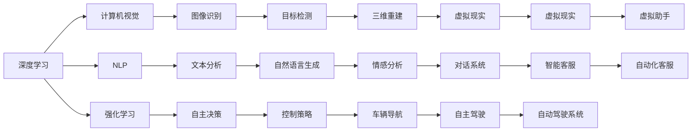
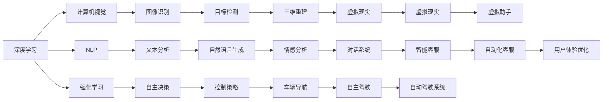
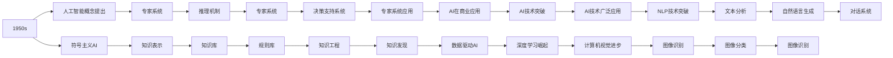
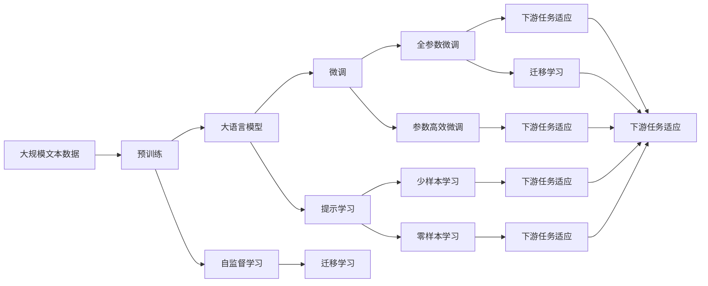

                 

## 1. 背景介绍

### 1.1 问题由来
人工智能（AI）技术的飞速发展正在改变各行各业的面貌。从自动驾驶、智慧医疗到智能客服、金融科技，AI技术的应用范围越来越广泛，影响力和渗透力日益增强。这一进程中，AI领域的技术进步与突破尤为引人注目。本文将系统介绍AI领域的一些关键技术进展，从深度学习、强化学习到自然语言处理（NLP）、计算机视觉等，探讨这些技术的发展历程、突破方向和未来趋势。

### 1.2 问题核心关键点
AI技术进步与突破的核心关键点包括但不限于以下几个方面：

- **深度学习**：通过神经网络模型实现对大规模数据的自动特征提取和预测，已应用于计算机视觉、自然语言处理等诸多领域。
- **强化学习**：通过试错过程逐步优化决策策略，广泛应用于机器人控制、游戏AI等领域。
- **自然语言处理（NLP）**：使计算机能够理解和处理自然语言，已实现机器翻译、智能问答、情感分析等。
- **计算机视觉**：使计算机能够“看”和“理解”图片、视频等视觉信息，已应用于人脸识别、智能监控等领域。
- **自动驾驶**：利用AI技术实现自动驾驶汽车，提高道路安全和交通效率。
- **智慧医疗**：通过AI技术辅助诊断、个性化治疗，提升医疗服务质量和效率。
- **金融科技**：利用AI进行风险评估、信用评分、自动化交易等，优化金融服务。
- **智能客服**：使用AI技术进行自动化客服和用户交互，提高客户满意度和效率。

这些核心技术推动了AI的广泛应用和深入发展，为人类社会带来了前所未有的变化。

### 1.3 问题研究意义
研究AI技术进步与突破，对于理解AI技术的未来发展方向、应对技术挑战、推动AI技术的产业化进程具有重要意义：

1. **加速技术迭代**：了解最新技术进展，推动产业应用和技术创新。
2. **提升应用效果**：通过技术进步，优化现有应用，提升用户体验。
3. **降低应用成本**：通过AI技术自动化和智能化，降低人工成本，提高生产效率。
4. **推动行业升级**：AI技术广泛应用，促进传统行业数字化转型和智能化升级。
5. **拓展应用边界**：推动AI技术向更多新兴领域渗透，如自动驾驶、智慧医疗等。
6. **增强社会福祉**：AI技术助力教育、医疗、环保等领域，提升社会福祉。

## 2. 核心概念与联系

### 2.1 核心概念概述

为更好地理解AI领域的技术进展与突破，本节将介绍几个密切相关的核心概念：

- **深度学习**：一种基于神经网络的学习方法，通过多层次的非线性变换实现对数据的复杂特征提取和预测。
- **强化学习**：通过智能体与环境的交互，利用奖励信号逐步优化策略，实现自主决策。
- **自然语言处理（NLP）**：使计算机能够理解和处理人类语言，包括语音识别、文本分析、机器翻译等。
- **计算机视觉**：使计算机能够分析和理解图像和视频，包括目标检测、图像分割、三维重建等。
- **自动驾驶**：通过感知、决策、控制等技术，实现车辆自主导航。
- **智慧医疗**：利用AI技术进行疾病诊断、个性化治疗、医疗影像分析等。
- **金融科技**：通过AI技术进行风险管理、交易分析、信用评分等，提升金融服务效率和安全性。
- **智能客服**：利用AI技术实现自动化客服和用户交互，提高客户满意度。

这些核心概念之间的逻辑关系可以通过以下Mermaid流程图来展示：



这个流程图展示了AI领域的核心概念及其之间的关系：

1. 深度学习、计算机视觉和自然语言处理是AI领域的基础技术。
2. 强化学习扩展了AI的应用边界，使机器能够进行自主决策。
3. 自动驾驶、智慧医疗和金融科技等应用场景展示了AI技术在实际中的广泛应用。
4. 智能客服和对话系统则是AI技术在用户交互中的具体体现。

### 2.2 概念间的关系

这些核心概念之间存在着紧密的联系，形成了AI技术的完整生态系统。下面我通过几个Mermaid流程图来展示这些概念之间的关系。

#### 2.2.1 AI领域的技术栈



这个流程图展示了AI领域的技术栈和不同技术之间的相互依赖关系。深度学习、计算机视觉和自然语言处理是AI的基础技术，而强化学习扩展了AI的应用边界。自动驾驶、智慧医疗和金融科技等应用场景展示了AI技术在实际中的广泛应用。智能客服和对话系统则是AI技术在用户交互中的具体体现。

#### 2.2.2 AI技术的发展历程



这个流程图展示了AI技术的发展历程，从1950年代的初步概念提出，到专家系统、知识库、推理机制等初步应用，再到深度学习、计算机视觉、自然语言处理等技术的崛起，AI技术不断进步，应用领域不断扩展。

### 2.3 核心概念的整体架构

最后，我们用一个综合的流程图来展示这些核心概念在大语言模型微调过程中的整体架构：



这个综合流程图展示了从预训练到微调，再到持续学习的完整过程。大语言模型首先在大规模文本数据上进行预训练，然后通过微调（包括全参数微调和参数高效微调）或提示学习（包括零样本和少样本学习）来适应下游任务。最后，通过持续学习技术，模型可以不断更新和适应新的任务和数据。

## 3. 核心算法原理 & 具体操作步骤
### 3.1 算法原理概述

AI领域的技术进步与突破离不开核心算法的创新与发展。以下将对深度学习、强化学习和自然语言处理等核心算法进行系统介绍。

### 3.2 算法步骤详解

#### 3.2.1 深度学习算法

深度学习算法的核心思想是通过神经网络模型实现对大规模数据的自动特征提取和预测。其基本步骤如下：

1. **数据预处理**：对原始数据进行清洗、标准化、归一化等处理。
2. **构建模型**：设计并构建神经网络模型，包括输入层、隐藏层、输出层等。
3. **损失函数设计**：选择或设计合适的损失函数，用于衡量模型预测与真实标签之间的差异。
4. **模型训练**：使用反向传播算法，根据损失函数对模型参数进行更新，最小化损失函数。
5. **模型评估**：使用测试集对训练好的模型进行评估，验证模型泛化能力。

#### 3.2.2 强化学习算法

强化学习算法的核心思想是通过智能体与环境的交互，利用奖励信号逐步优化策略，实现自主决策。其基本步骤如下：

1. **环境建模**：构建与实际环境相似的环境模型，定义状态空间、动作空间和奖励函数。
2. **策略选择**：选择或设计合适的策略，指导智能体在环境中采取行动。
3. **模型训练**：通过试错过程逐步优化策略，最小化累计奖励。
4. **探索与利用平衡**：在探索未知状态和利用已知状态之间进行平衡。
5. **模型评估**：在验证集或实际环境中评估策略的性能。

#### 3.2.3 自然语言处理（NLP）算法

自然语言处理算法的核心思想是通过机器学习技术使计算机能够理解和处理人类语言。其基本步骤如下：

1. **数据预处理**：对原始文本进行分词、去除停用词、词干提取等处理。
2. **特征提取**：使用词袋模型、TF-IDF等方法提取文本特征。
3. **模型训练**：使用监督学习或无监督学习算法训练模型，如SVM、朴素贝叶斯、深度学习等。
4. **模型评估**：使用准确率、召回率、F1分数等指标评估模型性能。
5. **应用部署**：将训练好的模型部署到实际应用中，如机器翻译、情感分析、智能客服等。

### 3.3 算法优缺点

#### 3.3.1 深度学习算法的优缺点

**优点**：
1. 强大的特征提取能力：能够自动学习数据中的复杂特征，无需手工设计。
2. 适用范围广：广泛应用于计算机视觉、自然语言处理、语音识别等领域。
3. 端到端训练：模型训练过程可以端到端完成，无需手工提取特征。

**缺点**：
1. 模型复杂度高：需要大量数据和计算资源进行训练，且容易过拟合。
2. 黑盒性质：深度学习模型通常难以解释其内部工作机制。
3. 参数量庞大：大规模神经网络模型的参数量巨大，训练和推理速度较慢。

#### 3.3.2 强化学习算法的优缺点

**优点**：
1. 自主决策：智能体能够自主学习并优化决策策略，适应复杂环境。
2. 探索与利用平衡：通过探索新状态和利用已知状态，智能体可以逐步优化决策。
3. 可扩展性强：适用于大规模、高维度、非线性系统。

**缺点**：
1. 训练时间较长：需要大量时间进行试错和优化。
2. 鲁棒性较差：强化学习模型对环境变化和噪声敏感。
3. 状态空间复杂：在高维状态空间中，强化学习模型容易陷入局部最优。

#### 3.3.3 自然语言处理（NLP）算法的优缺点

**优点**：
1. 处理自然语言能力：能够理解和处理自然语言，实现文本分类、情感分析、机器翻译等任务。
2. 模型精度高：通过深度学习等方法，可以实现较高的准确率和召回率。
3. 可扩展性强：适用于多种自然语言处理任务，如语义分析、文本生成等。

**缺点**：
1. 数据依赖性强：需要大量标注数据进行训练，标注成本较高。
2. 语言多样性：不同语言的数据量、特征和标注方式差异较大，模型迁移能力有限。
3. 模型复杂度高：大规模语言模型的参数量巨大，训练和推理速度较慢。

### 3.4 算法应用领域

深度学习、强化学习和自然语言处理等核心算法在多个领域得到了广泛应用，以下对几个典型应用领域进行详细阐述：

#### 3.4.1 计算机视觉

计算机视觉是使计算机能够分析和理解图像和视频的技术，广泛应用于人脸识别、图像分类、目标检测等领域。其主要应用包括：

1. **人脸识别**：通过深度学习模型对图像中的人脸进行识别，广泛应用于安全监控、身份验证等场景。
2. **图像分类**：使用深度学习模型对图像进行分类，如图片分类、场景分类等。
3. **目标检测**：通过深度学习模型对图像中的目标进行检测和定位，如行人检测、车辆检测等。
4. **图像分割**：通过深度学习模型对图像进行像素级别的分割，如医学图像分割、视频对象分割等。

#### 3.4.2 自然语言处理（NLP）

自然语言处理技术使计算机能够理解和处理人类语言，广泛应用于机器翻译、情感分析、智能客服等领域。其主要应用包括：

1. **机器翻译**：通过深度学习模型实现不同语言之间的自动翻译，如英中翻译、日中翻译等。
2. **情感分析**：使用自然语言处理技术对文本情感进行识别和分析，广泛应用于社交媒体、电商评论等。
3. **智能客服**：利用自然语言处理技术实现自动化客服和用户交互，提高客户满意度和效率。
4. **文本摘要**：通过深度学习模型对长篇文本进行摘要，提炼关键信息。
5. **问答系统**：使用自然语言处理技术构建智能问答系统，帮助用户获取信息。

#### 3.4.3 自动驾驶

自动驾驶技术通过感知、决策、控制等技术，实现车辆自主导航，广泛应用于智能交通、无人配送等领域。其主要应用包括：

1. **环境感知**：通过计算机视觉等技术对周围环境进行感知，识别交通标志、行人、车辆等。
2. **路径规划**：通过规划算法对行驶路径进行规划，避免障碍物。
3. **控制决策**：通过决策算法对车辆进行控制，实现自动驾驶。
4. **安全保障**：通过传感器、通信等技术保障自动驾驶的安全性。

#### 3.4.4 智慧医疗

智慧医疗技术利用AI技术辅助诊断、个性化治疗、医疗影像分析等，提升医疗服务质量和效率。其主要应用包括：

1. **疾病诊断**：使用深度学习模型对医疗影像进行分析和诊断，如X光、CT、MRI等。
2. **个性化治疗**：利用自然语言处理技术对患者数据进行分析，制定个性化治疗方案。
3. **医疗影像分析**：使用深度学习模型对医疗影像进行分析和诊断，如肺结节检测、眼底病变检测等。
4. **健康管理**：通过数据分析和预测，实现健康管理和预防。

#### 3.4.5 金融科技

金融科技利用AI技术进行风险评估、交易分析、信用评分等，提升金融服务效率和安全性。其主要应用包括：

1. **信用评分**：通过深度学习模型对客户信用进行评估，优化信贷审批流程。
2. **风险管理**：利用自然语言处理技术对金融市场进行分析和预测，防范金融风险。
3. **自动化交易**：使用自然语言处理技术对金融市场进行分析和预测，实现自动化交易。
4. **智能投顾**：利用AI技术对市场进行分析和预测，辅助投资决策。

## 4. 数学模型和公式 & 详细讲解 & 举例说明

### 4.1 数学模型构建

以下将对深度学习、强化学习和自然语言处理等核心算法进行数学模型的构建和详细讲解。

#### 4.1.1 深度学习数学模型

深度学习模型通常由多个神经网络层构成，包括输入层、隐藏层和输出层。以卷积神经网络（CNN）为例，其基本模型如下：

$$
f(x) = \sigma(Wx + b)
$$

其中，$x$为输入数据，$W$和$b$为模型参数，$\sigma$为激活函数，$f(x)$为输出。

#### 4.1.2 强化学习数学模型

强化学习模型通过智能体与环境的交互，逐步优化决策策略。以Q-learning算法为例，其数学模型如下：

$$
Q(s, a) = r + \gamma \max_{a'} Q(s', a')
$$

其中，$s$为状态，$a$为动作，$r$为奖励，$s'$为下一个状态，$Q(s, a)$为状态动作值函数，$\gamma$为折扣因子。

#### 4.1.3 自然语言处理（NLP）数学模型

自然语言处理模型通常使用词向量表示文本，并通过神经网络模型进行训练。以word2vec算法为例，其数学模型如下：

$$
w_t = \frac{1}{\sum_{i=1}^n w_i} \sum_{i=1}^n w_i \times \log \frac{p(x_i | w)}{q(x_i | w)}
$$

其中，$w_t$为文本向量，$w$为词向量，$x_i$为文本中第$i$个词，$p(x_i | w)$和$q(x_i | w)$为模型的概率分布。

### 4.2 公式推导过程

#### 4.2.1 深度学习公式推导

以深度学习中的反向传播算法为例，其推导过程如下：

1. **前向传播**：
$$
y = g(z)
$$

2. **计算损失函数**：
$$
L(y, y') = \frac{1}{2}(y - y')^2
$$

3. **反向传播**：
$$
\frac{\partial L}{\partial z} = \frac{\partial L}{\partial y} \frac{\partial y}{\partial z}
$$

4. **更新参数**：
$$
w \leftarrow w - \eta \frac{\partial L}{\partial w}
$$

其中，$z$为输入，$g(z)$为激活函数，$y$为输出，$y'$为真实标签，$\eta$为学习率，$\frac{\partial L}{\partial w}$为损失函数对参数的梯度。

#### 4.2.2 强化学习公式推导

以强化学习中的Q-learning算法为例，其推导过程如下：

1. **状态动作值函数**：
$$
Q(s, a) = \sum_{s'} P(s' | s, a) \max_{a'} Q(s', a')
$$

2. **更新Q值**：
$$
Q(s, a) \leftarrow Q(s, a) + \alpha(r + \gamma \max_{a'} Q(s', a') - Q(s, a))
$$

其中，$s$为状态，$a$为动作，$s'$为下一个状态，$P(s' | s, a)$为状态转移概率，$\alpha$为学习率，$Q(s, a)$为状态动作值函数，$r$为奖励，$\gamma$为折扣因子。

#### 4.2.3 自然语言处理（NLP）公式推导

以自然语言处理中的word2vec算法为例，其推导过程如下：

1. **计算概率**：
$$
p(x_i | w) = \frac{\exp(w_t \cdot w_i)}{\sum_{j=1}^n \exp(w_t \cdot w_j)}
$$

2. **计算概率**：
$$
q(x_i | w) = \frac{1}{\sum_{j=1}^n p(x_j | w)}
$$

3. **计算文本向量**：
$$
w_t = \sum_{i=1}^n p(x_i | w) w_i
$$

其中，$w_t$为文本向量，$w$为词向量，$x_i$为文本中第$i$个词，$p(x_i | w)$和$q(x_i | w)$为模型的概率分布。

### 4.3 案例分析与讲解

#### 4.3.1 深度学习案例

以图像分类为例，其案例分析如下：

1. **数据预处理**：对原始图像进行标准化、归一化等处理。
2. **构建模型**：设计并构建卷积神经网络模型，包括卷积层、池化层、全连接层等。
3. **损失函数设计**：使用交叉熵损失函数，衡量模型预测与真实标签之间的差异。
4. **模型训练**：使用反向传播算法，根据损失函数对模型参数进行更新，最小化损失函数。
5. **模型评估**：使用测试集对训练好的模型进行评估，验证模型泛化能力。

#### 4.3.2 强化学习案例

以机器人控制为例，其案例分析如下：

1. **环境建模**：构建与实际环境相似的环境模型，定义状态空间、动作空间和奖励函数。
2. **策略选择**：选择或设计合适的策略，指导机器人采取行动。
3. **模型训练**：通过试错过程逐步优化策略，最小化累计奖励。
4. **探索与利用平衡**：在探索未知状态和利用已知状态之间进行平衡。
5. **模型评估**：在验证集或实际环境中评估策略的性能。

#### 4.3.3 自然语言处理（NLP）案例

以机器翻译为例，其案例分析如下：

1. **数据预处理**：对原始文本进行分词、去除停用词、词干提取等处理。
2. **特征提取**：使用词向量表示文本，并通过神经网络模型进行训练。
3. **模型训练**：使用监督学习算法训练模型，如神经机器翻译模型。
4. **模型评估**：使用BLEU、ROUGE等指标评估模型性能。
5. **应用部署**：将训练好的模型部署到实际应用中，如实时翻译、对话系统等。

## 5. 项目实践：代码实例和详细解释说明

### 5.1 开发环境搭建

在进行项目实践前，我们需要准备好开发环境。以下是使用Python进行TensorFlow和PyTorch开发的环境配置流程：

1. 安装Anaconda：从官网下载并安装Anaconda，用于创建独立的Python环境。

2. 创建并激活虚拟环境：
```bash
conda create -n pytorch-env python=3.8 
conda activate pytorch-env
```

3. 安装TensorFlow：
```bash
pip install tensorflow tensorflow-addons
```

4. 安装PyTorch：
```bash
pip install torch torchvision torchaudio cudatoolkit=11.1 -c pytorch -c conda-forge
```

5. 安装各类工具包：
```bash
pip install numpy pandas scikit-learn matplotlib tqdm jupyter notebook ipython
```

完成上述步骤后，即可在`pytorch-env`环境中开始项目实践。

### 5.2 源代码详细实现

下面我们以深度学习模型在图像分类任务中的应用为例，给出TensorFlow和PyTorch的代码实现。

#### 5.2.1 TensorFlow实现

```python
import tensorflow as tf
from tensorflow.keras import datasets, layers, models

# 加载数据集
(train_images, train_labels), (test_images, test_labels) = datasets.cifar10.load_data()

# 数据预处理
train_images, test_images = train_images / 255.0, test_images / 255.0

# 构建模型
model = models.Sequential()
model.add(layers.Conv2D(32, (3, 3), activation='relu', input_shape=(32, 32, 3)))
model.add(layers.MaxPooling2D((2, 2)))
model.add(layers.Conv2D(64, (3, 3), activation='relu'))
model.add(layers.MaxPooling2D((2, 2)))
model.add(layers.Conv2D(64, (3, 3), activation='relu'))
model.add(layers.Flatten())
model.add(layers.Dense(64, activation='relu'))
model.add(layers.Dense(10))

# 编译模型
model.compile(optimizer='adam',
              loss=tf.keras.losses.SparseCategoricalCrossentropy(from_logits=True),
              metrics=['accuracy'])

# 训练模型
model.fit(train_images, train_labels, epochs=10, 
          validation_data=(test_images, test_labels))

# 评估模型
model.evaluate(test_images, test_labels, verbose=2)
```

#### 5.2.2 PyTorch实现

```python
import torch
import torch.nn as nn
import torch.optim as optim
import torchvision.transforms as transforms
import torchvision.datasets as datasets

# 加载数据集
transform = transforms.Compose([transforms.ToTensor(),
                               transforms.Normalize((0.5

