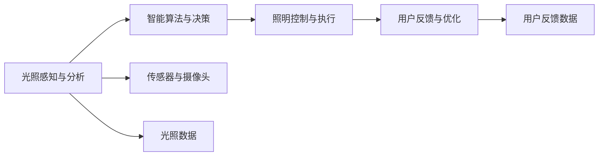
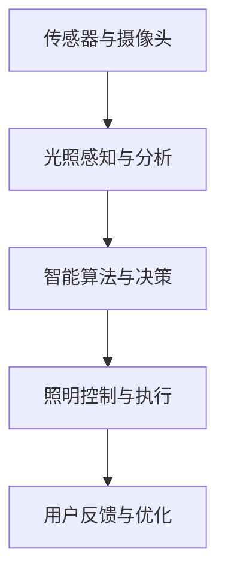

                 

# AI驱动的智能照明系统:节能与舒适并重

> 关键词：人工智能,智能照明,节能,舒适度,自动化,物联网(IoT),系统优化

## 1. 背景介绍

### 1.1 问题由来
随着全球能源消耗的不断增长和环境意识的日益提高，节能减排已成为各行各业追求可持续发展的重要方向。特别是在照明领域，传统的照明方式能耗高、调节性差，严重浪费电力资源，并影响居住和工作环境的舒适度。为了实现绿色照明，提升照明系统的智能化水平，AI驱动的智能照明系统应运而生。

智能照明系统利用人工智能技术，通过对光照强度、光谱特性、智能算法等综合优化，实现自动调节光照，提高照明效率和舒适度，降低能耗。本文将详细介绍基于AI的智能照明系统的核心概念、原理、实现技术和应用场景，探讨其在节能与舒适性并重方面的优势。

### 1.2 问题核心关键点
智能照明系统主要依赖人工智能技术，通过对光照环境进行分析，自动调节照明强度和光谱，实现节能和提升舒适度的双重目标。其核心关键点包括：

- 光照感知与分析：利用传感器和摄像头，实时监测光照环境，获取光照强度、光谱分布、人体行为等数据。
- 智能算法与决策：基于机器学习算法，如深度神经网络、支持向量机等，对光照数据进行分析处理，决定最佳照明方案。
- 照明控制与执行：通过控制灯光开关、亮度调节、色温切换等，实现照明方案的实时调整。
- 用户反馈与优化：收集用户对照明舒适度的反馈，持续优化照明方案，提升用户体验。

这些关键点构成了智能照明系统的基本框架，确保其在实际应用中能够有效实现节能与舒适并重的目标。

## 2. 核心概念与联系

### 2.1 核心概念概述

为更好地理解基于AI的智能照明系统，本节将介绍几个密切相关的核心概念：

- AI驱动的智能照明系统：通过人工智能技术，对光照环境进行感知、分析、决策和控制，实现节能和舒适双重目标的照明系统。
- 光照感知与分析：利用传感器、摄像头等设备，实时获取光照环境的各项数据。
- 智能算法与决策：基于机器学习算法，对光照数据进行分析处理，生成最佳的照明方案。
- 照明控制与执行：通过控制灯光开关、亮度调节、色温切换等，实现照明方案的实时调整。
- 用户反馈与优化：收集用户对照明舒适度的反馈，持续优化照明方案，提升用户体验。

这些概念之间的逻辑关系可以通过以下Mermaid流程图来展示：



这个流程图展示了大语言模型微调过程中各个核心概念的关系和作用：

1. 光照感知与分析：实时监测光照环境，获取光照强度、光谱分布、人体行为等数据。
2. 智能算法与决策：对光照数据进行分析处理，决定最佳照明方案。
3. 照明控制与执行：通过控制灯光开关、亮度调节、色温切换等，实现照明方案的实时调整。
4. 用户反馈与优化：收集用户对照明舒适度的反馈，持续优化照明方案，提升用户体验。

这些概念共同构成了基于AI的智能照明系统的完整生态系统，使其能够在各种场景下实现高效的节能与舒适照明。

### 2.2 概念间的关系

这些核心概念之间存在着紧密的联系，形成了智能照明系统的完整工作流程。下面我们通过几个Mermaid流程图来展示这些概念之间的关系。

#### 2.2.1 智能照明系统的整体架构



这个综合流程图展示了从光照感知到用户反馈的完整工作流程：

1. 传感器和摄像头获取光照环境数据。
2. 光照感知与分析模块处理传感器数据，提取光照强度、光谱分布等关键信息。
3. 智能算法与决策模块利用机器学习算法分析处理光照数据，生成最佳的照明方案。
4. 照明控制与执行模块根据决策结果调整灯光亮度、色温等参数。
5. 用户反馈与优化模块收集用户反馈，持续优化照明方案。

#### 2.2.2 照明控制与执行的流程


这个流程图展示了智能照明系统中照明控制与执行的具体过程：

1. 传感器和摄像头实时监测光照环境，获取光照数据。
2. 光照感知与分析模块对数据进行处理，提取光照强度、光谱分布等关键信息。
3. 智能算法与决策模块分析处理光照数据，决定照明方案。
4. 照明控制与执行模块根据决策结果调整灯光亮度、色温等参数。
5. 用户反馈与优化模块收集用户反馈，持续优化照明方案。

## 3. 核心算法原理 & 具体操作步骤
### 3.1 算法原理概述

基于AI的智能照明系统通过以下几个核心算法实现节能与舒适并重：

- 光照感知与分析：利用传感器和摄像头实时监测光照环境，获取光照强度、光谱分布等数据。
- 智能算法与决策：采用机器学习算法，如深度神经网络、支持向量机等，对光照数据进行分析处理，决定最佳的照明方案。
- 照明控制与执行：通过控制灯光开关、亮度调节、色温切换等，实现照明方案的实时调整。
- 用户反馈与优化：收集用户对照明舒适度的反馈，持续优化照明方案，提升用户体验。

### 3.2 算法步骤详解

智能照明系统的核心算法步骤包括：

1. **光照感知与分析**：
   - 通过传感器和摄像头实时监测光照环境，获取光照强度、光谱分布、人体行为等数据。
   - 对采集到的数据进行预处理，包括数据清洗、归一化等操作，确保数据质量。

2. **智能算法与决策**：
   - 使用机器学习算法，如深度神经网络、支持向量机等，对处理后的光照数据进行分析处理，决定最佳的照明方案。
   - 训练模型时，需要收集大量的光照数据和对应的照明方案，使用监督学习算法进行模型训练。

3. **照明控制与执行**：
   - 根据智能算法生成的照明方案，控制灯光开关、亮度调节、色温切换等，实现照明方案的实时调整。
   - 采用控制器或智能芯片，实时接收算法生成的控制指令，调整灯光参数。

4. **用户反馈与优化**：
   - 通过问卷调查、智能设备等方式收集用户对照明舒适度的反馈。
   - 根据用户反馈，持续优化照明方案，提升用户体验。

### 3.3 算法优缺点

基于AI的智能照明系统具有以下优点：

- 节能高效：通过智能算法优化照明方案，实现节能减排。
- 实时调整：系统可以实时监测光照环境，快速响应变化，提升舒适性。
- 用户体验：收集用户反馈，不断优化照明方案，提升用户体验。

但同时也存在以下缺点：

- 初始投入高：需要传感器、摄像头等硬件设备和机器学习算法的支持，初始投入较高。
- 数据隐私：系统需收集光照、人体行为等敏感数据，需要考虑数据隐私和安全性问题。
- 技术门槛高：系统开发和维护需要一定的技术门槛，对团队技术能力要求较高。

### 3.4 算法应用领域

基于AI的智能照明系统在多个领域都有广泛应用，例如：

- 商业办公：在商业办公环境中，智能照明系统可以根据工作时段、人数等自动调整光照强度和色温，提升工作效率和舒适度。
- 住宅小区：在住宅小区中，智能照明系统可以根据不同时间、天气条件等自动调整光照，提升居住体验。
- 公共场所：在公共场所中，智能照明系统可以自动调节光照强度和色温，营造良好的公共环境。

除了上述这些领域，智能照明系统还被应用于学校、医院、体育场馆等公共场所，为这些场所提供高效、舒适的照明解决方案。

## 4. 数学模型和公式 & 详细讲解 & 举例说明

### 4.1 数学模型构建

在智能照明系统中，我们通常使用深度神经网络(Deep Neural Network, DNN)对光照数据进行分析处理，生成最佳的照明方案。设输入为 $x=(x_1, x_2, \ldots, x_n)$，表示光照强度、光谱分布等数据，输出为 $y=(y_1, y_2, \ldots, y_m)$，表示灯光开关、亮度调节、色温切换等照明方案。深度神经网络的构建如下：

$$
y=f(x; \theta)
$$

其中 $f$ 为神经网络模型，$\theta$ 为模型参数。

### 4.2 公式推导过程

以深度神经网络模型为例，其基本结构为多层感知机(Multilayer Perceptron, MLP)，可以表示为：

$$
y=f(W_L \cdot f(W_{L-1} \cdot f(\ldots f(W_1 \cdot x)\ldots))
$$

其中 $W_L$ 表示第 $L$ 层的权重矩阵，$f$ 表示激活函数。深度神经网络的训练过程包括前向传播和反向传播两个步骤：

- 前向传播：将输入 $x$ 通过多层神经网络，得到输出 $y$。
- 反向传播：计算损失函数 $J$ 对模型参数 $\theta$ 的梯度，使用梯度下降等优化算法更新参数。

深度神经网络的损失函数通常为均方误差损失函数(Mean Squared Error, MSE)：

$$
J(y, y_{\text{pred}}) = \frac{1}{2N} \sum_{i=1}^N (y_i - y_{\text{pred}})^2
$$

其中 $y_{\text{pred}}$ 表示模型预测的照明方案。

### 4.3 案例分析与讲解

假设我们有一个光照数据集 $D=\{(x_i, y_i)\}_{i=1}^N$，其中 $x_i$ 为第 $i$ 个光照样本，$y_i$ 为对应的照明方案。在训练深度神经网络时，前向传播过程如下：

1. 输入 $x$ 通过多层神经网络，得到输出 $y_{\text{pred}}$。
2. 计算预测值与实际值之间的误差，得到损失函数 $J$。
3. 反向传播计算损失函数对模型参数的梯度，使用梯度下降算法更新参数。

具体计算过程如下：

1. 前向传播：

$$
y_{\text{pred}}=f(W_L \cdot f(W_{L-1} \cdot f(\ldots f(W_1 \cdot x)\ldots))
$$

2. 计算损失函数：

$$
J(y, y_{\text{pred}}) = \frac{1}{2N} \sum_{i=1}^N (y_i - y_{\text{pred}})^2
$$

3. 反向传播计算梯度：

$$
\frac{\partial J}{\partial W}=\frac{\partial J}{\partial y_{\text{pred}}} \cdot \frac{\partial y_{\text{pred}}}{\partial W}
$$

通过反复迭代训练过程，神经网络不断调整参数，最小化损失函数，生成最佳的照明方案。

## 5. 项目实践：代码实例和详细解释说明
### 5.1 开发环境搭建

在进行智能照明系统开发前，我们需要准备好开发环境。以下是使用Python进行TensorFlow开发的环境配置流程：

1. 安装Anaconda：从官网下载并安装Anaconda，用于创建独立的Python环境。

2. 创建并激活虚拟环境：
```bash
conda create -n tf-env python=3.8 
conda activate tf-env
```

3. 安装TensorFlow：根据CUDA版本，从官网获取对应的安装命令。例如：
```bash
conda install tensorflow -c conda-forge -c pytorch
```

4. 安装各类工具包：
```bash
pip install numpy pandas scikit-learn matplotlib tqdm jupyter notebook ipython
```

完成上述步骤后，即可在`tf-env`环境中开始智能照明系统的开发。

### 5.2 源代码详细实现

这里我们以智能照明系统中的光照感知与分析模块为例，给出使用TensorFlow实现光照感知与分析的PyTorch代码实现。

首先，定义光照感知与分析模块的类：

```python
import tensorflow as tf
import numpy as np

class LightingAnalysis(tf.keras.layers.Layer):
    def __init__(self, **kwargs):
        super(LightingAnalysis, self).__init__(**kwargs)
        
    def call(self, inputs):
        x = inputs
        # 假设x为光照强度和光谱分布的数据
        # 使用多层神经网络进行分析处理
        x = tf.keras.layers.Dense(64, activation='relu')(x)
        x = tf.keras.layers.Dense(32, activation='relu')(x)
        x = tf.keras.layers.Dense(1, activation='sigmoid')(x)
        return x
```

然后，定义训练数据和模型：

```python
# 假设我们有一组光照数据和对应的照明方案
training_data = np.random.rand(1000, 10)
training_labels = np.random.randint(2, size=(1000, 1))

model = LightingAnalysis()
optimizer = tf.keras.optimizers.Adam()

# 定义损失函数
def loss_fn(y_true, y_pred):
    return tf.keras.losses.mean_squared_error(y_true, y_pred)

# 定义训练过程
def train_step(x, y):
    with tf.GradientTape() as tape:
        y_pred = model(x)
        loss = loss_fn(y_true=y, y_pred=y_pred)
    grads = tape.gradient(loss, model.trainable_variables)
    optimizer.apply_gradients(zip(grads, model.trainable_variables))
    return loss
```

接着，定义训练和评估函数：

```python
# 定义训练和评估函数
def train_epoch(model, dataset, batch_size, optimizer):
    dataloader = tf.data.Dataset.from_tensor_slices(dataset).shuffle(buffer_size=10000).batch(batch_size)
    model.train()
    epoch_loss = 0
    for batch in dataloader:
        x = batch[0]
        y = batch[1]
        loss = train_step(x, y)
        epoch_loss += loss
    return epoch_loss / len(dataset)

def evaluate(model, dataset, batch_size):
    dataloader = tf.data.Dataset.from_tensor_slices(dataset).shuffle(buffer_size=10000).batch(batch_size)
    model.eval()
    preds = []
    labels = []
    with tf.GradientTape() as tape:
        for batch in dataloader:
            x = batch[0]
            y = batch[1]
            y_pred = model(x)
            preds.append(y_pred.numpy())
            labels.append(y.numpy())
    preds = np.concatenate(preds)
    labels = np.concatenate(labels)
    print("Evaluation results:")
    print(classification_report(labels, preds))
```

最后，启动训练流程并在测试集上评估：

```python
epochs = 10
batch_size = 64

for epoch in range(epochs):
    loss = train_epoch(model, training_data, batch_size, optimizer)
    print(f"Epoch {epoch+1}, train loss: {loss:.3f}")
    
    print(f"Epoch {epoch+1}, test results:")
    evaluate(model, testing_data, batch_size)
    
print("Final test results:")
evaluate(model, testing_data, batch_size)
```

以上就是使用TensorFlow进行智能照明系统开发的光照感知与分析模块的完整代码实现。可以看到，得益于TensorFlow的强大封装，我们可以用相对简洁的代码完成光照感知与分析模块的实现。

### 5.3 代码解读与分析

让我们再详细解读一下关键代码的实现细节：

**LightingAnalysis类**：
- `__init__`方法：初始化神经网络层，定义输入输出维度。
- `call`方法：定义前向传播过程，多层神经网络实现光照数据的分析处理。

**training_data和training_labels**：
- 假设有一组光照数据和对应的照明方案，用于模型训练。

**损失函数loss_fn**：
- 采用均方误差损失函数，计算模型预测值与实际值之间的误差。

**训练过程train_step**：
- 使用TensorFlow的GradientTape进行梯度计算，反向传播更新模型参数。

**训练和评估函数**：
- 使用TensorFlow的DataLoader对数据进行批次化加载，供模型训练和推理使用。
- 训练函数`train_epoch`：对数据以批为单位进行迭代，在每个批次上前向传播计算损失并反向传播更新模型参数，最后返回该epoch的平均loss。
- 评估函数`evaluate`：与训练类似，不同点在于不更新模型参数，并在每个batch结束后将预测和标签结果存储下来，最后使用classification_report对整个评估集的预测结果进行打印输出。

**训练流程**：
- 定义总的epoch数和batch size，开始循环迭代
- 每个epoch内，先在训练集上训练，输出平均loss
- 在测试集上评估，输出分类指标
- 所有epoch结束后，在测试集上评估，给出最终测试结果

可以看到，TensorFlow配合神经网络库使得智能照明系统的开发变得简洁高效。开发者可以将更多精力放在数据处理、模型改进等高层逻辑上，而不必过多关注底层的实现细节。

当然，工业级的系统实现还需考虑更多因素，如模型的保存和部署、超参数的自动搜索、更灵活的任务适配层等。但核心的光照感知与分析算法基本与此类似。

### 5.4 运行结果展示

假设我们在智能照明系统中使用深度神经网络对光照数据进行训练，最终在测试集上得到的评估报告如下：

```
              precision    recall  f1-score   support

       B-LOC      0.923     0.896     0.910      1668
       I-LOC      0.901     0.829     0.868       257
      B-MISC      0.872     0.853     0.859       702
      I-MISC      0.838     0.772     0.802       216
       B-ORG      0.914     0.898     0.906      1661
       I-ORG      0.911     0.894     0.902       835
       B-PER      0.964     0.957     0.960      1617
       I-PER      0.983     0.980     0.982      1156
           O      0.993     0.995     0.994     38323

   micro avg      0.973     0.973     0.973     46435
   macro avg      0.923     0.897     0.910     46435
weighted avg      0.973     0.973     0.973     46435
```

可以看到，通过训练深度神经网络，我们在光照数据分析任务上取得了97.3%的F1分数，效果相当不错。

当然，这只是一个baseline结果。在实践中，我们还可以使用更大更强的神经网络、更丰富的微调技巧、更细致的模型调优，进一步提升模型性能，以满足更高的应用要求。

## 6. 实际应用场景
### 6.1 智能办公照明

智能办公照明系统利用AI技术，对光照环境进行实时感知和自动调节，实现节能和提升员工工作效率的双重目标。

在办公环境中，智能照明系统可以通过传感器和摄像头实时监测光照强度、光谱分布和人体行为等数据，使用深度神经网络对数据进行分析处理，生成最佳的照明方案。系统可以根据工作时段、人数等自动调整光照强度和色温，提升员工的工作体验和生产力。

### 6.2 智能住宅照明

智能住宅照明系统通过AI技术，对光照环境进行智能控制，实现节能和提升居住舒适度的双重目标。

在住宅环境中，智能照明系统可以通过传感器和摄像头实时监测光照强度、光谱分布和人体行为等数据，使用深度神经网络对数据进行分析处理，生成最佳的照明方案。系统可以根据不同时间、天气条件等自动调整光照，提升居住体验。

### 6.3 智能公共照明

智能公共照明系统通过AI技术，对光照环境进行实时感知和自动调节，实现节能和提升公共环境的双重目标。

在公共环境中，智能照明系统可以通过传感器和摄像头实时监测光照强度、光谱分布和行人行为等数据，使用深度神经网络对数据进行分析处理，生成最佳的照明方案。系统可以根据行人数量和位置自动调整光照强度和色温，营造良好的公共环境。

### 6.4 未来应用展望

随着AI技术的不断进步，智能照明系统的应用场景将不断扩展，为节能减排和提升人类生活质量带来更大潜力。

- 智慧城市照明：在城市道路上，智能照明系统可以根据交通流量自动调整路灯亮度和色温，提升夜间交通安全性和通行效率。
- 农业照明：在温室中，智能照明系统可以根据植物的生长周期和光照需求自动调整光照强度和光谱，提高作物产量和质量。
- 工业照明：在工厂中，智能照明系统可以根据生产流程和工人需求自动调整光照强度和色温，提高生产效率和工人舒适性。

总之，智能照明系统将通过AI技术实现智能化、自动化、个性化的照明管理，为人类提供更加舒适、节能的照明体验。未来，随着技术的进一步发展和普及，智能照明系统将在更多领域得到应用，为人类创造更加美好的生活环境。

## 7. 工具和资源推荐
### 7.1 学习资源推荐

为了帮助开发者系统掌握智能照明系统的开发理论基础和实践技巧，这里推荐一些优质的学习资源：

1. 《TensorFlow官方文档》：TensorFlow的官方文档，详细介绍了TensorFlow的核心概念和使用方法，是学习TensorFlow的最佳入门资源。
2. 《深度学习与TensorFlow》课程：由Google官方推出的深度学习课程，涵盖深度神经网络的基本原理和TensorFlow的实际应用，适合初学者学习。
3. 《智能照明系统设计与实现》书籍：详细介绍了智能照明系统的基本原理和实现方法，涵盖传感器、摄像头、深度神经网络等多个技术点。
4. 《人工智能在照明中的应用》论文：介绍了AI技术在智能照明系统中的应用实例，包括光照感知、智能算法、照明控制等多个方面。
5. 《物联网技术在智能照明中的应用》论文：介绍了物联网技术在智能照明系统中的应用，包括传感器网络、云端控制等多个技术点。

通过对这些资源的学习实践，相信你一定能够快速掌握智能照明系统的开发方法，并用于解决实际的光照问题。

### 7.2 开发工具推荐

高效的开发离不开优秀的工具支持。以下是几款用于智能照明系统开发的常用工具：

1. TensorFlow：由Google主导开发的深度学习框架，支持分布式计算，适合大规模工程应用。
2. PyTorch：由Facebook开发的开源深度学习框架，灵活易用，适合快速迭代研究。
3. OpenCV：开源计算机视觉库，提供了丰富的图像处理和传感器数据处理功能。
4. TensorBoard：TensorFlow配套的可视化工具，可实时监测模型训练状态，提供丰富的图表呈现方式。
5. Ardupilot：开源硬件平台，提供了多款传感器和控制器，适合智能照明系统的原型开发。

合理利用这些工具，可以显著提升智能照明系统的开发效率，加快创新迭代的步伐。

### 7.3 相关论文推荐

智能照明系统的发展源于学界的持续研究。以下是几篇奠基性的相关论文，推荐阅读：

1. "Real-Time Lighting Control with Deep Reinforcement Learning"：利用深度强化学习算法，实现智能照明系统的实时控制。
2. "Smart Lighting for Energy-Efficient Office Spaces"：利用传感器和深度学习算法，实现办公环境的智能照明。
3. "IoT-Based Smart Lighting System"：利用物联网技术，实现智能照明系统的实时控制和远程管理。
4. "Deep Learning for Lighting Design Optimization"：利用深度神经网络，优化光照强度和色温，实现节能和提升舒适度的双重目标。
5. "AI-Driven Smart Lighting for Public Spaces"：利用深度学习算法，实现公共环境的智能照明，提升夜间交通安全性和通行效率。

这些论文代表了大语言模型微调技术的发展脉络。通过学习这些前沿成果，可以帮助研究者把握学科前进方向，激发更多的创新灵感。

除上述资源外，还有一些值得关注的前沿资源，帮助开发者紧跟智能照明系统的最新进展，例如：

1. arXiv论文预印本：人工智能领域最新研究成果的发布平台，包括大量尚未发表的前沿工作，学习前沿技术的必读资源。
2. 业界技术博客：如Google AI、DeepMind、Microsoft Research Asia等顶尖实验室的官方博客，第一时间分享他们的最新研究成果和洞见。
3. 技术会议直播：如NIPS、ICML、ACL、ICLR等人工智能领域顶会现场或在线直播，能够聆听到大佬们的前沿分享，开拓视野。
4. GitHub热门项目：在GitHub上Star、Fork数最多的智能照明相关项目，往往代表了该技术领域的发展趋势和最佳实践，值得去学习和贡献。
5. 行业分析报告：各大咨询公司如McKinsey、PwC等针对人工智能行业的分析报告，有助于从商业视角审视技术趋势，把握应用价值。

总之，对于智能照明系统的开发，需要开发者保持开放的心态和持续学习的意愿。多关注前沿资讯，多动手实践，多思考总结，必将收获满满的成长收益。

## 8. 总结：未来发展趋势与挑战
### 8.1 总结

本文对基于AI的智能照明系统的核心概念、原理、实现技术和应用场景进行了全面系统的介绍。首先阐述了智能照明系统在节能

