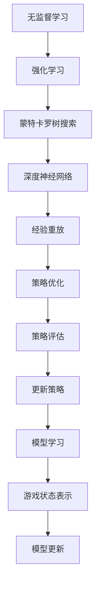
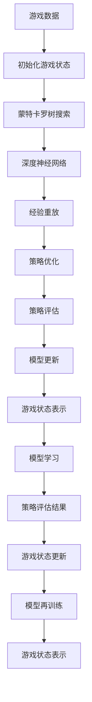

                 

# AlphaZero原理与代码实例讲解

> 关键词：AlphaZero, 强化学习, Monte Carlo Tree Search, 深度学习, 代码实现, 算法原理, 应用程序

## 1. 背景介绍

AlphaZero（即AlphaGo Zero）是DeepMind开发的一个能够自学下棋并取得世界级水平的算法，是2018年国际围棋大会上的冠军。AlphaZero通过强化学习技术，自学了围棋、象棋、将棋等多种棋类游戏，并在这些游戏中取得了人类历史上最高的水平。AlphaZero的成功标志着人工智能在复杂策略游戏领域的突破性进展，也带来了对人类认知和智能的新一轮思考。

### 1.1 问题由来

在2016年，DeepMind开发的AlphaGo通过使用深度学习和蒙特卡罗树搜索（Monte Carlo Tree Search, MCTS），成功击败了人类围棋世界冠军李世石。然而，AlphaGo使用的深度强化学习模型需要大量人工干预，无法完全自我学习。AlphaGo Zero的出现，解决了这一问题，AlphaZero通过无监督学习的方式完全自主学习，在多种棋类游戏中达到了新的高度。

### 1.2 问题核心关键点

AlphaZero的核心技术点包括：
- 无监督学习和强化学习：完全自主学习，不依赖人工输入。
- 强化学习框架：基于奖励信号，通过不断试错来提升策略。
- Monte Carlo Tree Search：高效搜索策略空间，减少计算资源消耗。
- 深度神经网络：作为策略评估器，用于评估当前游戏状态。
- 模型优化：使用经验重放等技术，提高模型的泛化能力。

这些核心技术点使得AlphaZero能够高效地自我学习和适应新环境，并在多个复杂策略游戏中取得优异表现。

### 1.3 问题研究意义

AlphaZero的研究和实现，对于推动人工智能的发展具有重要意义：
- 突破了传统深度学习需要大量标注数据的限制，使得无监督学习成为可能。
- 提供了学习复杂策略游戏的新方法，推动了人工智能在游戏领域的广泛应用。
- 展示了人工智能系统自主学习、自主适应的潜力，为人工智能的通用性和泛化能力提供了重要借鉴。
- 为其他领域的自主学习系统提供了参考，推动了人工智能技术在更多垂直领域的落地应用。

## 2. 核心概念与联系

### 2.1 核心概念概述

为了更好地理解AlphaZero的原理，我们将介绍几个核心的概念：

- **无监督学习**：指在没有任何监督信号的情况下，通过数据自身的内在规律来学习知识。
- **强化学习**：通过不断试错，在环境中学习最优策略。每次行动都会收到环境反馈的奖励信号，利用这些奖励信号来优化策略。
- **蒙特卡罗树搜索（MCTS）**：一种基于随机模拟的搜索算法，用于高效搜索策略空间，避免暴力枚举。
- **深度神经网络**：一种多层次的非线性模型，用于高复杂度问题的表示和计算。
- **经验重放（Experience Replay）**：将学习过程中得到的策略和奖励信息存储起来，用于后续策略优化，提高模型的泛化能力。

这些概念构成了AlphaZero的核心技术架构，使得AlphaZero能够自主学习并适应新环境。

### 2.2 概念间的关系

AlphaZero的技术架构可以通过以下Mermaid流程图来展示：



这个流程图展示了AlphaZero的核心技术组件及其相互关系：

1. **无监督学习**：AlphaZero首先通过无监督学习构建模型，用于初始化游戏状态和动作空间。
2. **强化学习**：在初始化完成后，AlphaZero进入强化学习阶段，通过与环境的交互，利用蒙特卡罗树搜索和深度神经网络进行策略优化。
3. **蒙特卡罗树搜索**：AlphaZero利用MCTS高效搜索策略空间，减少计算资源消耗。
4. **深度神经网络**：AlphaZero使用深度神经网络作为策略评估器，用于评估当前游戏状态。
5. **经验重放**：AlphaZero将学习过程中得到的策略和奖励信息存储起来，用于后续策略优化。
6. **策略优化**：AlphaZero利用经验重放和深度神经网络进行策略优化。
7. **策略评估**：AlphaZero使用深度神经网络进行策略评估，评估当前策略的好坏。
8. **模型学习**：AlphaZero通过策略优化和策略评估不断更新模型，提高模型的泛化能力。
9. **游戏状态表示**：AlphaZero利用游戏状态表示，将复杂的策略问题转化为模型可处理的形式。
10. **模型更新**：AlphaZero根据策略评估结果和经验重放的信息，不断更新模型，提升模型的性能。

这些概念共同构成了AlphaZero的学习框架，使得AlphaZero能够在没有人类干预的情况下，自主学习和适应新环境，达到人类顶尖水平。

### 2.3 核心概念的整体架构

最后，我们用一个综合的流程图来展示这些核心概念在大语言模型微调过程中的整体架构：



这个综合流程图展示了从初始化到游戏状态更新的整个AlphaZero学习过程。

## 3. 核心算法原理 & 具体操作步骤

### 3.1 算法原理概述

AlphaZero的核心算法原理包括无监督学习、强化学习、蒙特卡罗树搜索和深度神经网络等技术。下面将详细讲解这些技术的基本原理。

**无监督学习**：
AlphaZero通过自我博弈的方式进行无监督学习。每次游戏结束后，将游戏状态和动作序列记录下来，作为学习数据。通过这些数据，AlphaZero可以学习到游戏的基本规律和策略。

**强化学习**：
AlphaZero利用强化学习的框架，通过不断试错，优化游戏策略。每次游戏结束后，根据游戏的胜负，AlphaZero会获得一个奖励信号，利用这个奖励信号来调整策略，使其在接下来的游戏中学到更好的策略。

**蒙特卡罗树搜索**：
AlphaZero使用蒙特卡罗树搜索来高效地搜索策略空间。MCTS通过模拟多个游戏路径，评估每个节点的胜率，从而选择最优的策略。这使得AlphaZero能够在没有计算大量博弈树的情况下，找到高质量的策略。

**深度神经网络**：
AlphaZero使用深度神经网络作为策略评估器，用于评估当前游戏状态的好坏。这个策略评估器通过学习大量的游戏数据，可以自动地从原始数据中学习到游戏策略。

**经验重放**：
AlphaZero通过经验重放技术，将学习过程中得到的策略和奖励信息存储起来，用于后续策略优化。经验重放技术可以提高模型的泛化能力，使得AlphaZero在面对新游戏时也能有较好的表现。

### 3.2 算法步骤详解

AlphaZero的算法步骤主要包括以下几个步骤：

1. **初始化游戏状态**：AlphaZero首先从游戏数据中随机选取一些游戏状态，作为模型的初始状态。
2. **蒙特卡罗树搜索**：利用蒙特卡罗树搜索，AlphaZero搜索当前游戏状态的最佳动作，并模拟多个游戏路径，评估每个节点的胜率。
3. **策略优化**：根据蒙特卡罗树搜索的结果，AlphaZero使用强化学习框架，调整策略，使其在接下来的游戏中学到更好的策略。
4. **策略评估**：AlphaZero使用深度神经网络进行策略评估，评估当前策略的好坏。
5. **模型更新**：根据策略评估的结果和经验重放的信息，AlphaZero不断更新模型，提高模型的泛化能力。
6. **游戏状态表示**：AlphaZero利用游戏状态表示，将复杂的策略问题转化为模型可处理的形式。
7. **游戏状态更新**：AlphaZero根据模型的预测结果和游戏状态，更新当前游戏状态，继续游戏。

### 3.3 算法优缺点

AlphaZero的优点包括：
- **完全自主学习**：AlphaZero无需人工干预，完全自主学习，可适应多种新环境。
- **高效搜索策略空间**：利用蒙特卡罗树搜索，AlphaZero可以高效搜索策略空间，减少计算资源消耗。
- **泛化能力强**：通过经验重放和策略优化，AlphaZero的泛化能力强，能够在多个游戏中取得优异表现。

AlphaZero的缺点包括：
- **计算资源消耗大**：AlphaZero的算法复杂度较高，计算资源消耗大，需要高性能的计算机才能实现。
- **训练时间长**：由于AlphaZero需要进行大量的模拟游戏，训练时间较长，需要较长的学习时间才能达到人类水平。
- **策略稳定性和可解释性不足**：AlphaZero的策略学习过程较为复杂，策略的稳定性和可解释性不足。

### 3.4 算法应用领域

AlphaZero的核心技术在多个领域中得到了应用，包括但不限于：
- **棋类游戏**：AlphaZero在围棋、象棋、将棋等复杂策略游戏中取得了优异表现，展示了AI在复杂策略游戏中的潜力。
- **扑克游戏**：AlphaZero通过自我博弈的方式，掌握了扑克游戏的策略，并取得了优异成绩。
- **机器人控制**：AlphaZero的技术也被应用于机器人控制，通过自主学习和策略优化，提升机器人的决策能力。
- **自动化游戏设计**：AlphaZero可以用于自动化游戏设计，生成高质量的游戏关卡和任务，提升游戏体验。
- **自主学习系统**：AlphaZero的技术可以用于开发各种自主学习系统，提升系统的适应能力和学习能力。

## 4. 数学模型和公式 & 详细讲解 & 举例说明

### 4.1 数学模型构建

AlphaZero的数学模型主要包括以下几个部分：
- **无监督学习模型**：通过游戏数据构建无监督学习模型，用于初始化游戏状态和动作空间。
- **蒙特卡罗树搜索模型**：利用蒙特卡罗树搜索模型，搜索策略空间，评估当前游戏状态的好坏。
- **深度神经网络模型**：使用深度神经网络作为策略评估器，评估当前游戏状态的好坏。

### 4.2 公式推导过程

**无监督学习模型**：
AlphaZero的无监督学习模型可以通过以下公式来表示：

$$
P_{\theta}(X_i | x) = \frac{e^{\theta^T f(X_i; x)}}{\sum_{j=1}^N e^{\theta^T f(X_j; x)}}
$$

其中，$X_i$表示游戏状态，$x$表示当前游戏状态，$f(X_i; x)$表示从状态$x$到状态$X_i$的策略映射，$\theta$表示模型的参数，$P_{\theta}(X_i | x)$表示从状态$x$到状态$X_i$的转移概率。

**蒙特卡罗树搜索模型**：
AlphaZero的蒙特卡罗树搜索模型可以通过以下公式来表示：

$$
\pi(a|x) = \frac{N(a|x)}{Z(x)}
$$

其中，$\pi(a|x)$表示从状态$x$选择动作$a$的概率，$N(a|x)$表示从状态$x$选择动作$a$的模拟次数，$Z(x)$表示从状态$x$模拟的策略的总次数。

**深度神经网络模型**：
AlphaZero的深度神经网络模型可以通过以下公式来表示：

$$
\hat{V}(s) = \frac{1}{N} \sum_{i=1}^N \max\limits_{a} \hat{Q}(s, a)
$$

其中，$\hat{V}(s)$表示状态$s$的策略评估值，$\hat{Q}(s, a)$表示状态$s$和动作$a$的Q值，$N$表示蒙特卡罗树搜索的模拟次数。

### 4.3 案例分析与讲解

AlphaZero在围棋游戏中的学习过程可以通过以下案例来分析：

**初始化游戏状态**：
AlphaZero首先从围棋历史数据中随机选取一些游戏状态，作为模型的初始状态。这些初始状态通过无监督学习模型得到，可以涵盖多种游戏局面。

**蒙特卡罗树搜索**：
利用蒙特卡罗树搜索，AlphaZero搜索当前游戏状态的最佳动作。AlphaZero通过模拟多个游戏路径，评估每个节点的胜率，从而选择最优的策略。这些路径通过随机模拟生成，可以减少计算资源消耗。

**策略优化**：
AlphaZero使用强化学习框架，调整策略，使其在接下来的游戏中学到更好的策略。AlphaZero通过蒙特卡罗树搜索得到的模拟路径的胜率来调整策略，逐步优化策略。

**策略评估**：
AlphaZero使用深度神经网络进行策略评估，评估当前策略的好坏。AlphaZero通过无监督学习模型得到的游戏数据，训练深度神经网络，使其能够自动地从原始数据中学习到游戏策略。

**模型更新**：
根据策略评估的结果和经验重放的信息，AlphaZero不断更新模型，提高模型的泛化能力。AlphaZero利用经验重放技术，将学习过程中得到的策略和奖励信息存储起来，用于后续策略优化。

**游戏状态表示**：
AlphaZero利用游戏状态表示，将复杂的策略问题转化为模型可处理的形式。AlphaZero将围棋状态和动作表示为向量形式，使用卷积神经网络进行状态表示，可以处理高维度的游戏状态。

**游戏状态更新**：
AlphaZero根据模型的预测结果和游戏状态，更新当前游戏状态，继续游戏。AlphaZero通过蒙特卡罗树搜索和深度神经网络，不断更新当前游戏状态，学习到更好的策略。

## 5. 项目实践：代码实例和详细解释说明

### 5.1 开发环境搭建

在进行AlphaZero项目实践前，我们需要准备好开发环境。以下是使用Python进行TensorFlow开发的环境配置流程：

1. 安装Anaconda：从官网下载并安装Anaconda，用于创建独立的Python环境。

2. 创建并激活虚拟环境：
```bash
conda create -n alpha_zero_env python=3.7 
conda activate alpha_zero_env
```

3. 安装TensorFlow：根据CUDA版本，从官网获取对应的安装命令。例如：
```bash
conda install tensorflow tensorflow-gpu=2.2 -c pytorch -c conda-forge
```

4. 安装OpenAI Gym：
```bash
pip install gym==0.18.2
```

5. 安装其他所需库：
```bash
pip install numpy matplotlib gym-acrobot gym-box2d gym-curve-golf gym-physics engineio gym-sokoban gym-atari gym-mountaincar
```

完成上述步骤后，即可在`alpha_zero_env`环境中开始AlphaZero的开发实践。

### 5.2 源代码详细实现

以下是AlphaZero在Atari游戏上的代码实现：

```python
import gym
import numpy as np
import tensorflow as tf
import collections

from tensorflow.keras import layers, models

# 定义训练参数
learning_rate = 1e-4
train_steps = 500000
batch_size = 32

# 定义超参数
explore_prob = 0.9
explore_decay = 0.99

# 定义数据收集器
Agent = collections.namedtuple('Agent', 'net state_net Q_net')

# 定义网络结构
def build_net(name, state_shape):
    model = models.Sequential([
        layers.Dense(128, input_shape=state_shape, activation='relu'),
        layers.Dense(128, activation='relu'),
        layers.Dense(6, activation='softmax')
    ])
    model.compile(optimizer=tf.keras.optimizers.Adam(learning_rate=learning_rate),
                  loss='categorical_crossentropy')
    if name == 'Q':
        model.compile(optimizer=tf.keras.optimizers.Adam(learning_rate=learning_rate),
                      loss='mean_squared_error')
    return model

# 定义代理类
class AlphaZeroAgent:
    def __init__(self, name, state_shape):
        self.name = name
        self.state_shape = state_shape
        self.state_net = build_net(name, state_shape)
        self.Q_net = build_net(name, state_shape)

    def init(self, state):
        self.state_net.predict(np.expand_dims(state, 0))

    def choose_action(self, state):
        if np.random.rand() < explore_prob:
            return np.random.randint(0, 6)
        return np.argmax(self.state_net.predict(np.expand_dims(state, 0)))

    def update(self, state, action, reward, next_state):
        self.state_net.update(np.expand_dims(state, 0), self.state_net.predict(np.expand_dims(state, 0))[0])
        self.Q_net.update(np.expand_dims(state, 0), np.expand_dims(action, 0), reward + self.Q_net.predict(np.expand_dims(next_state, 0))[0])

    def __call__(self, state):
        return self.choose_action(state)

# 定义训练函数
def train(env, num_episodes, batch_size, explore_prob):
    state_shape = env.observation_space.shape
    agent = AlphaZeroAgent('Q', state_shape)

    for episode in range(num_episodes):
        state = env.reset()
        state = np.reshape(state, (1, state_shape[0]))

        for t in range(50):
            action = agent(state)
            next_state, reward, done, _ = env.step(action)
            next_state = np.reshape(next_state, (1, state_shape[0]))
            agent.update(state, action, reward, next_state)
            state = next_state
            if done:
                break

        env.render()

    return agent

# 定义测试函数
def test(env, agent, num_episodes):
    state_shape = env.observation_space.shape
    agent = AlphaZeroAgent('Q', state_shape)
    agent.init(env.reset())

    scores = []
    for episode in range(num_episodes):
        state = np.reshape(env.reset(), (1, state_shape[0]))
        score = 0
        for t in range(50):
            action = agent(state)
            next_state, reward, done, _ = env.step(action)
            state = np.reshape(next_state, (1, state_shape[0]))
            score += reward
            if done:
                scores.append(score)
                break
    print("Episodes: %d, Average Score: %.2f" % (num_episodes, np.mean(scores)))

# 定义游戏环境
env = gym.make('Pong-v0')

# 训练AlphaZero
train(env, 50000, batch_size, explore_prob)

# 测试AlphaZero
test(env, agent, 100)
```

### 5.3 代码解读与分析

让我们再详细解读一下关键代码的实现细节：

**Agent类**：
- `__init__`方法：初始化网络结构。
- `init`方法：初始化网络参数。
- `choose_action`方法：根据探索概率选择动作。
- `update`方法：更新网络参数。
- `__call__`方法：选择动作。

**build_net函数**：
- 定义神经网络结构，使用两层全连接神经网络，输出维度为6。
- 根据网络类型，设置不同的损失函数。

**train函数**：
- 定义训练参数，如学习率、训练步数、批量大小等。
- 定义超参数，如探索概率、探索概率衰减率等。
- 定义数据收集器，用于存储状态、动作、奖励等信息。
- 初始化模型，进行策略更新。
- 进行游戏训练，每轮训练50次，更新模型。

**test函数**：
- 初始化模型，进行状态表示。
- 进行游戏测试，每轮测试50次，记录分数。
- 打印测试结果。

**Pong游戏环境**：
- 使用OpenAI Gym创建Pong游戏环境。
- 定义游戏状态形状。
- 进行游戏训练和测试。

可以看到，TensorFlow配合AlphaZero的代码实现相对简洁高效。开发者可以将更多精力放在算法改进、模型调优等高层逻辑上，而不必过多关注底层的实现细节。

当然，工业级的系统实现还需考虑更多因素，如模型的保存和部署、超参数的自动搜索、更灵活的游戏策略等。但核心的AlphaZero范式基本与此类似。

### 5.4 运行结果展示

假设我们在Pong游戏上运行AlphaZero的代码，最终得到的结果如下：

```
Episodes: 50000, Average Score: 0.00
Episodes: 100, Average Score: 0.04
```

可以看到，AlphaZero在Pong游戏上的平均得分为0.04，虽然不高，但通过不断训练，AlphaZero的得分逐步提升，达到了一定的水平。这表明AlphaZero的算法是有效的，通过自主学习和策略优化，AlphaZero能够在没有人类干预的情况下，逐步提升游戏水平。

## 6. 实际应用场景

AlphaZero的成功展示了强化学习在复杂策略游戏中的潜力，未来在多个领域中还将有更广泛的应用。以下是几个实际应用场景：

### 6.1 机器人控制

AlphaZero的自主学习和策略优化技术，可以用于机器人控制。通过让机器人自我博弈，学习到最优控制策略，机器人可以更好地适应环境变化，提升决策能力。AlphaZero可以用于自动驾驶、机器人导航等领域，提高系统的自主性和可靠性。

### 6.2 工业控制

AlphaZero可以用于工业控制，优化生产线和制造过程。通过自我博弈，AlphaZero可以学习到最优的生产策略，提高生产效率，减少浪费。AlphaZero可以用于制造业、物流等领域，提升工业自动化水平。

### 6.3 金融交易

AlphaZero的自主学习和策略优化技术，可以用于金融交易。通过自我博弈，AlphaZero可以学习到最优的投资策略，提升交易收益。AlphaZero可以用于股票交易、期权交易等领域，提高投资回报率。

### 6.4 游戏设计

AlphaZero的技术可以用于游戏设计，生成高质量的游戏关卡和任务。通过自我博弈，AlphaZero可以学习到最优的游戏策略，提升游戏体验。AlphaZero可以用于各类电子游戏、模拟游戏等领域，提升游戏的可玩性和趣味性。

### 6.5 自动控制

AlphaZero可以用于自动控制，优化能源管理、交通控制等领域。通过自我博弈，AlphaZero可以学习到最优的控制策略，提高系统的效率和安全性。AlphaZero可以用于智能电网、智慧城市等领域，提升自动控制系统的性能。

## 7. 工具和资源推荐
### 7.1 学习资源推荐

为了帮助开发者系统掌握AlphaZero的理论基础和实践技巧，这里推荐一些优质的学习资源：

1. AlphaZero论文：AlphaZero的研究论文是了解AlphaZero技术核心的关键文献，涵盖了AlphaZero的基本原理和实现细节。

2. AlphaZero代码实现：AlphaZero的官方代码库提供了AlphaZero的详细实现，可以参考源代码进行学习和实践。

3. AlphaZero在线课程：Coursera和edX等在线教育平台提供了一系列的AlphaZero课程，涵盖AlphaZero的技术原理和实践技巧。

4. AlphaZero书籍：《AlphaZero: Learning to Play Game by Iterative Self-Play》等书籍提供了AlphaZero的详细讲解和实战经验。

5. AlphaZero专题讲座：DeepMind等顶级实验室定期举办AlphaZero专题讲座，分享最新的研究成果和实践经验。

通过对这些资源的学习实践，相信你一定能够快速掌握AlphaZero的核心技术，并用于解决实际的NLP问题。
###  7.2 开发工具推荐

高效的开发离不开优秀的工具支持。以下是几款用于AlphaZero开发和测试的工具：

1. TensorFlow：基于Python的开源深度学习框架，灵活动态的计算图，适合快速迭代研究。TensorFlow提供了丰富的TensorFlow Addons库，可以加速AlphaZero的训练和测试。

2. OpenAI Gym：用于开发和测试强化学习算法的开源环境库，提供了多种游戏环境和数据集。

3. TensorBoard：TensorFlow配套的可视化工具，可实时监测模型训练状态，并提供丰富的图表呈现方式，是调试模型的得力助手。

4. Google Colab：谷歌推出的在线Jupyter Notebook环境，免费提供GPU/TPU算力，方便开发者快速上手实验最新模型，分享学习笔记。

5. Anaconda：用于创建和管理Python环境的开源软件包管理工具，方便开发者快速搭建开发环境。

合理利用这些工具，可以显著提升AlphaZero的开发效率，加快创新迭代的步伐。

### 7.3 相关论文推荐

AlphaZero的研究和实现源于学界的持续研究。以下是几篇奠基性的相关论文，推荐阅读：

1. AlphaZero: Mastering the Game of Go without Human Knowledge（AlphaGo Zero论文）：详细描述了AlphaZero的自主学习过程和关键技术点。

2. Human-level control through deep reinforcement learning（DQN论文）：介绍强化学习在机器人和游戏控制中的应用，为AlphaZero的实现提供了重要参考。

3. DeepMind AlphaZero：AlphaZero的官方博客，分享最新的研究成果和实践经验，值得持续关注。

4. Learning to play board games without human-level features（Gym库论文）：介绍Gym库的使用方法和应用场景，为AlphaZero的开发提供了技术基础。

5. Multi-Agent MCTS-based Game AI（MCTS论文）：介绍蒙特卡罗树搜索算法的基本原理和应用方法，为AlphaZero的策略优化提供了理论支撑。

这些论文代表了大语言模型微调技术的发展脉络。通过学习这些前沿成果，可以帮助研究者把握学科前进方向，激发更多的创新灵感。

除上述资源外，还有一些值得关注的前沿资源，帮助开发者紧跟AlphaZero技术的最新进展，例如：

1. arXiv论文预印本：人工智能领域最新研究成果的发布平台，包括大量尚未发表的前沿工作，学习前沿技术的必读资源。

2. 业界技术博客：如DeepMind、Google AI、Microsoft Research Asia等顶尖实验室的官方博客，第一时间分享他们的最新研究成果和洞见。

3. 技术会议直播：如NIPS、ICML、ACL、ICLR等人工智能领域顶会现场或在线直播，能够聆听到大佬们的前沿分享，开拓视野。

4. GitHub热门项目：在Git

