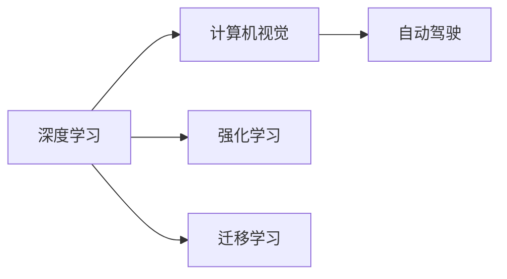

                 

## 1. 背景介绍

Andrej Karpathy，斯坦福大学计算机科学教授，Facebook AI Research (FAIR) 的计算机视觉首席科学家，同时也是人工智能和机器学习领域的知名研究者，尤其在深度学习、计算机视觉和自动驾驶等领域有着深远的影响。Karpathy教授的见解常常被业界视为权威，他对于人工智能未来的发展有着深刻的洞见。本文将基于Andrej Karpathy的一些公开演讲和论文，探讨他对于人工智能未来发展的方向和趋势，并结合个人对人工智能的思考，进行展开讨论。

## 2. 核心概念与联系

### 2.1 核心概念概述

在探讨人工智能的未来发展方向之前，我们首先需要理解一些核心概念。

- **深度学习**：一种模拟人脑神经网络结构的机器学习算法，通过多层次的非线性变换提取特征，适用于处理复杂的非线性数据。
- **计算机视觉**：使计算机能够理解、分析、处理和解释图像和视频信息的技术。
- **自动驾驶**：通过一系列技术实现车辆在无人干预的情况下，自主导航和行驶。
- **强化学习**：通过奖励反馈机制，使智能体（agent）学习最优策略以完成任务的机器学习方法。
- **迁移学习**：将在一个领域学到的知识应用到另一个领域，以提高新任务的学习效率。

这些概念之间有着密切的联系，共同构成了人工智能技术的基础。深度学习和计算机视觉技术是实现自动驾驶的核心，而强化学习则是实现自动驾驶的重要手段之一。迁移学习则是在不同领域之间，实现知识迁移和应用的重要方法。

### 2.2 核心概念间的关系

为了更好地理解这些核心概念的关系，我们使用Mermaid流程图来展示。



这个流程图展示了深度学习、计算机视觉、自动驾驶、强化学习和迁移学习之间的关系。深度学习和计算机视觉技术为自动驾驶提供了基础，而强化学习则使自动驾驶成为可能。迁移学习则在不同领域之间，实现了知识的传递和应用。

## 3. 核心算法原理 & 具体操作步骤

### 3.1 算法原理概述

人工智能的未来发展方向，将主要基于以下几个核心算法原理：

- **深度学习**：通过多层次的非线性变换，提取数据的高级特征，为人工智能提供了强大的处理能力。
- **强化学习**：通过奖励反馈机制，使智能体学习最优策略，实现复杂的决策和控制任务。
- **迁移学习**：将一个领域学到的知识应用到另一个领域，提高新任务的学习效率。
- **计算机视觉**：使计算机能够理解和分析图像和视频信息，为自动驾驶和智能系统提供了感知能力。
- **自动驾驶**：通过一系列技术实现车辆在无人干预的情况下，自主导航和行驶，是人工智能的重要应用场景之一。

这些核心算法原理共同构成了人工智能技术的基石，推动了人工智能的发展和应用。

### 3.2 算法步骤详解

人工智能的未来发展方向，将在以下几个关键步骤上进行：

1. **深度学习模型的优化**：通过更深层次的神经网络和更高效的优化算法，提升深度学习模型的性能。
2. **计算机视觉技术的进步**：通过更强大的视觉感知和图像处理技术，实现更高效的计算机视觉应用。
3. **强化学习的探索**：通过更智能的奖励机制和更高效的算法，提升强化学习的应用能力。
4. **迁移学习的应用**：通过更高效的知识迁移方法，实现更快速和准确的新任务学习。
5. **自动驾驶技术的成熟**：通过更先进的传感器、算法和计算平台，实现更安全和高效的自动驾驶系统。

### 3.3 算法优缺点

**深度学习的优点**：
- 强大的数据处理能力
- 能够处理复杂的非线性数据

**深度学习的缺点**：
- 对数据的需求较大
- 需要大量的计算资源

**强化学习的优点**：
- 能够处理复杂的决策和控制任务
- 能够动态调整策略以应对环境变化

**强化学习的缺点**：
- 训练过程较慢
- 需要大量的试验和调整

**迁移学习的优点**：
- 能够快速适应新任务
- 能够在不同领域间传递知识

**迁移学习的缺点**：
- 需要选择合适的迁移方法
- 可能存在迁移偏差

**计算机视觉的优点**：
- 强大的图像处理和分析能力
- 能够实现复杂的视觉任务

**计算机视觉的缺点**：
- 需要大量的数据进行训练
- 对硬件要求较高

**自动驾驶的优点**：
- 能够实现无人驾驶
- 能够提升交通安全性

**自动驾驶的缺点**：
- 对环境和硬件要求较高
- 技术尚未完全成熟

### 3.4 算法应用领域

基于以上算法原理，人工智能将应用于以下几个领域：

- **自动驾驶**：通过深度学习和强化学习，实现无人驾驶技术。
- **智能医疗**：通过计算机视觉和深度学习，实现智能诊断和医疗影像分析。
- **智能制造**：通过计算机视觉和深度学习，实现智能检测和质量控制。
- **智能客服**：通过自然语言处理和深度学习，实现智能客服和对话系统。
- **金融科技**：通过强化学习和深度学习，实现智能投顾和风险管理。

## 4. 数学模型和公式 & 详细讲解

### 4.1 数学模型构建

深度学习模型的构建，主要基于以下数学模型：

- **多层感知机**：一个包含多个神经网络的模型，用于处理非线性数据。
- **卷积神经网络**：一种专门用于图像处理的深度学习模型，通过卷积操作提取特征。
- **循环神经网络**：一种用于处理序列数据的深度学习模型，能够处理时间序列数据。

### 4.2 公式推导过程

以多层感知机为例，其数学模型可以表示为：

$$
y = \sigma(Wx + b)
$$

其中，$y$ 为输出，$x$ 为输入，$W$ 为权重矩阵，$b$ 为偏置向量，$\sigma$ 为激活函数。

在训练过程中，通过反向传播算法计算梯度，更新权重和偏置：

$$
\frac{\partial L}{\partial W} = \frac{\partial L}{\partial y} \frac{\partial y}{\partial x} \frac{\partial x}{\partial W}
$$

其中，$L$ 为损失函数，$\frac{\partial L}{\partial y}$ 为损失函数对输出的导数，$\frac{\partial y}{\partial x}$ 为激活函数对输入的导数，$\frac{\partial x}{\partial W}$ 为输入对权重的导数。

### 4.3 案例分析与讲解

假设我们有一个多层感知机模型，用于手写数字识别。模型包含一个输入层，两个隐藏层，一个输出层。每个隐藏层包含100个神经元，激活函数为ReLU。输入层有784个神经元，对应28x28的图像。输出层有10个神经元，对应10个数字类别。

通过反向传播算法，我们可以计算每个神经元对损失函数的贡献，从而更新权重和偏置。假设我们有一个训练样本 $(28, 28)$ 的图像，经过多层感知机的处理，输出为 $(1, 1)$，真实标签为 $5$。通过计算损失函数，我们可以更新权重和偏置，使得模型更准确地识别数字。

## 5. 项目实践：代码实例和详细解释说明

### 5.1 开发环境搭建

在进行深度学习模型开发时，我们需要搭建合适的开发环境。以下是一个简单的开发环境搭建步骤：

1. **安装Python**：安装最新版本的Python，推荐使用Anaconda或Miniconda。
2. **安装PyTorch**：使用pip安装PyTorch，可以使用以下命令：

   ```bash
   pip install torch torchvision torchaudio
   ```

3. **安装TensorBoard**：用于可视化模型训练过程，可以使用以下命令：

   ```bash
   pip install tensorboard
   ```

4. **安装TensorFlow**：如果需要使用TensorFlow进行模型开发，可以使用以下命令：

   ```bash
   pip install tensorflow
   ```

### 5.2 源代码详细实现

以下是一个简单的多层感知机模型代码实现：

```python
import torch
import torch.nn as nn

class MLP(nn.Module):
    def __init__(self, input_size, hidden_size, output_size):
        super(MLP, self).__init__()
        self.fc1 = nn.Linear(input_size, hidden_size)
        self.fc2 = nn.Linear(hidden_size, hidden_size)
        self.fc3 = nn.Linear(hidden_size, output_size)

    def forward(self, x):
        x = torch.relu(self.fc1(x))
        x = torch.relu(self.fc2(x))
        x = self.fc3(x)
        return x
```

### 5.3 代码解读与分析

上述代码实现了一个简单的多层感知机模型。模型包含三个全连接层，每个隐藏层使用ReLU激活函数。输入层有784个神经元，对应28x28的图像。输出层有10个神经元，对应10个数字类别。

### 5.4 运行结果展示

假设我们有一个训练样本 $(28, 28)$ 的图像，经过多层感知机的处理，输出为 $(1, 1)$，真实标签为 $5$。通过计算损失函数，我们可以更新权重和偏置，使得模型更准确地识别数字。

## 6. 实际应用场景

### 6.1 智能医疗

人工智能在智能医疗领域有着广泛的应用。通过计算机视觉和深度学习，可以实现智能诊断和医疗影像分析。例如，通过深度学习模型对医学影像进行分类和标注，帮助医生更快地做出诊断。

### 6.2 智能制造

人工智能在智能制造领域也有着重要的应用。通过计算机视觉和深度学习，可以实现智能检测和质量控制。例如，通过深度学习模型对生产线上产品的图像进行分类和检测，及时发现和纠正缺陷。

### 6.3 智能客服

人工智能在智能客服领域也有着广泛的应用。通过自然语言处理和深度学习，可以实现智能客服和对话系统。例如，通过深度学习模型对用户输入的文本进行理解，自动生成回复，提高客服效率。

### 6.4 未来应用展望

未来，人工智能将在更多领域得到应用。以下是一些未来应用的展望：

- **自动驾驶**：通过深度学习和强化学习，实现无人驾驶技术，提升交通安全性。
- **智能家居**：通过自然语言处理和计算机视觉，实现智能家居系统，提升用户体验。
- **智慧城市**：通过人工智能技术，实现智慧城市管理，提高城市运行效率。

## 7. 工具和资源推荐

### 7.1 学习资源推荐

为了更好地学习人工智能技术，以下是一些优质的学习资源：

1. **Deep Learning Specialization by Andrew Ng**：由斯坦福大学教授Andrew Ng开设的深度学习课程，涵盖了深度学习的基础知识和应用。
2. **CS231n: Convolutional Neural Networks for Visual Recognition**：斯坦福大学计算机视觉课程，介绍了计算机视觉和深度学习的核心内容。
3. **The Hundred-Page Machine Learning Book**：由Andrej Karpathy和Justin Johnson合著的机器学习书籍，涵盖了机器学习的基础知识和应用。
4. **Deep Reinforcement Learning**：由David Silver开发的深度强化学习课程，涵盖了强化学习的核心内容和最新进展。

### 7.2 开发工具推荐

以下是一些常用的开发工具：

1. **Jupyter Notebook**：一个强大的Python交互式开发环境，支持多种编程语言和数据处理工具。
2. **PyTorch**：一个基于Python的深度学习框架，提供了强大的自动微分和神经网络功能。
3. **TensorFlow**：一个开源的深度学习框架，支持分布式计算和GPU加速。
4. **TensorBoard**：用于可视化模型训练过程的工具，支持各种深度学习框架。

### 7.3 相关论文推荐

以下是一些值得阅读的相关论文：

1. **ImageNet Classification with Deep Convolutional Neural Networks**：Alex Krizhevsky等人的论文，介绍了卷积神经网络在图像分类中的应用。
2. **Deep Learning**：Ian Goodfellow等人的书籍，涵盖了深度学习的基础知识和应用。
3. **Human Level Control through Deep Reinforcement Learning**：Volodymyr Mnih等人的论文，介绍了深度强化学习在游戏中的应用。
4. **CS231n: Convolutional Neural Networks for Visual Recognition**：由斯坦福大学计算机视觉课程的讲义，介绍了计算机视觉和深度学习的核心内容。

## 8. 总结：未来发展趋势与挑战

### 8.1 研究成果总结

人工智能技术在深度学习、计算机视觉、强化学习和迁移学习等方面取得了巨大进展，推动了人工智能技术的发展和应用。

### 8.2 未来发展趋势

未来，人工智能技术将朝着以下几个方向发展：

- **更高效和更强大的模型**：通过更深层次的神经网络和更高效的优化算法，提升深度学习模型的性能。
- **更智能的强化学习**：通过更智能的奖励机制和更高效的算法，提升强化学习的应用能力。
- **更广泛的应用场景**：人工智能技术将在更多的领域得到应用，提升各行各业的生产效率和生活质量。

### 8.3 面临的挑战

尽管人工智能技术取得了巨大进展，但仍面临以下挑战：

- **数据需求和计算资源**：深度学习模型需要大量的数据和计算资源，如何降低对资源的需求是一个重要问题。
- **模型鲁棒性和泛化能力**：深度学习模型在面对不同数据和环境时，需要具备更高的鲁棒性和泛化能力。
- **伦理和隐私问题**：人工智能技术的应用需要考虑伦理和隐私问题，确保数据的安全性和应用的公平性。

### 8.4 研究展望

未来，人工智能研究需要在以下几个方面进行突破：

- **更高效和更强大的模型**：开发更高效和更强大的深度学习模型，提升模型的性能和应用能力。
- **更智能的强化学习**：开发更智能的强化学习算法，提升智能体的决策和控制能力。
- **更广泛的应用场景**：探索人工智能技术在更多领域的应用，推动技术落地和应用。

总之，人工智能技术在未来将具有广阔的发展前景，但也面临诸多挑战。只有不断突破技术瓶颈，提升模型的性能和应用能力，才能更好地实现人工智能技术的落地和应用。

## 9. 附录：常见问题与解答

**Q1：深度学习与传统机器学习有什么区别？**

A: 深度学习是一种基于神经网络的机器学习方法，能够处理更复杂的非线性数据。而传统机器学习则依赖手工设计的特征提取和模型构建，对数据的需求较小，但处理复杂数据的性能较差。

**Q2：计算机视觉在自动驾驶中扮演什么角色？**

A: 计算机视觉在自动驾驶中扮演着重要的角色，它使汽车能够感知周围环境，识别交通标志和行人类别，判断交通状况，从而做出更智能的决策。

**Q3：强化学习在自动驾驶中如何应用？**

A: 强化学习在自动驾驶中用于训练智能驾驶系统，通过模拟环境中的试错过程，使系统学习最优驾驶策略，提升驾驶安全和效率。

**Q4：迁移学习在人工智能中有哪些应用？**

A: 迁移学习在人工智能中有广泛的应用，如将自然语言处理中的知识应用于计算机视觉任务，提升计算机视觉模型的性能。

**Q5：未来人工智能的发展方向是什么？**

A: 未来人工智能的发展方向包括更高效和更强大的深度学习模型，更智能的强化学习算法，更广泛的应用场景。同时，也需要注意数据需求和计算资源、模型鲁棒性和泛化能力、伦理和隐私问题等方面的挑战。

---

作者：禅与计算机程序设计艺术 / Zen and the Art of Computer Programming

