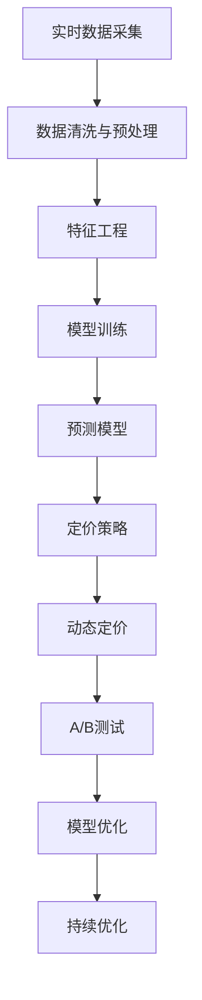

                 

# AI助力动态定价：优化收益和销售量

在现代商业世界中，动态定价策略已经成为企业提升竞争力和优化收益的关键手段。传统的静态定价策略通常基于固定的成本和收益模型，难以适应市场需求的变化。而动态定价则利用实时数据和先进的AI技术，动态调整价格以最大化收益和销售量。本文将深入探讨动态定价的AI技术基础，并给出具体的实施方案和案例分析。

## 1. 背景介绍

### 1.1 问题由来
随着电商、旅游、共享经济等行业的兴起，客户需求日益多样化，市场环境瞬息万变。在这种环境下，传统的定价策略很难跟上需求的变化，难以有效应对市场的波动和竞争。而动态定价策略通过实时数据分析和智能算法，能够更灵活地调整价格，提高市场响应速度和竞争力。

动态定价的典型应用场景包括：

- **电商平台的商品定价**：根据实时订单量、库存量、竞争对手定价等数据，动态调整商品价格，提高销售量和收益。
- **酒店房间定价**：根据不同时间段、节假日、入住率等因素，动态调整房间价格，优化客房利用率。
- **共享单车和汽车定价**：根据用户需求变化和市场供需情况，动态调整租用价格，提升用户体验和公司收益。
- **在线教育课程定价**：根据不同地区、学期和学生需求，动态调整课程价格，提升课程销售和满意度。

### 1.2 问题核心关键点
动态定价的核心在于实时数据处理和智能算法优化。具体关键点包括：

- **数据采集与处理**：实时采集订单、库存、价格、用户行为等数据，并进行清洗和特征工程。
- **模型训练与预测**：利用历史数据和机器学习模型，预测市场需求和用户响应。
- **策略制定与执行**：根据预测结果，动态调整价格策略，并在系统中部署执行。
- **效果评估与优化**：实时监控定价效果，收集用户反馈，进行策略优化和迭代。

## 2. 核心概念与联系

### 2.1 核心概念概述

动态定价涉及多个核心概念，以下对每个概念进行简要介绍：

- **实时数据采集与处理**：实时收集订单、库存、价格、用户行为等数据，并进行预处理、清洗和特征工程。
- **机器学习与预测模型**：利用历史数据训练预测模型，预测市场需求和用户响应，提供价格调整建议。
- **动态定价策略**：根据预测结果，制定和执行动态价格策略，优化收益和销售量。
- **A/B测试与模型优化**：通过A/B测试等手段，评估定价策略效果，持续优化模型和策略。

### 2.2 概念间的关系

这些核心概念之间的关系可以通过以下Mermaid流程图来展示：



这个流程图展示了动态定价的核心流程：实时数据采集、预处理、特征工程、模型训练、预测、策略制定与执行、A/B测试与模型优化，最终实现持续优化。

### 2.3 核心概念的整体架构

为了更好地理解动态定价的整体流程，下面给出更详细的架构图：


这个架构图展示了从数据采集到定价执行再到效果评估的完整流程。每个步骤都紧密关联，通过持续的反馈和优化，不断提升定价策略的精确性和有效性。

## 3. 核心算法原理 & 具体操作步骤

### 3.1 算法原理概述

动态定价的核心算法原理包括预测模型和定价策略两部分。

- **预测模型**：利用历史数据训练机器学习模型，预测市场需求和用户响应。常见模型包括线性回归、决策树、随机森林、神经网络等。
- **定价策略**：根据预测结果，制定和执行动态价格策略。策略可以是基于规则的简单策略，也可以是基于强化学习的复杂策略。

### 3.2 算法步骤详解

以下是动态定价的详细步骤：

1. **数据采集与处理**：实时采集订单、库存、价格、用户行为等数据，并进行清洗和特征工程。
2. **模型训练**：利用历史数据训练预测模型，通常采用监督学习的方法，如线性回归、决策树、随机森林等。
3. **预测**：输入实时数据到训练好的模型，预测市场需求和用户响应。
4. **定价策略制定**：根据预测结果，制定动态定价策略，如基于价格的折扣策略、基于时间的动态定价策略等。
5. **策略执行**：根据定价策略，实时调整产品价格。
6. **效果评估**：实时监控定价效果，收集用户反馈，进行策略优化和迭代。

### 3.3 算法优缺点

动态定价的AI算法具有以下优点：

- **实时性**：能够快速响应市场需求变化，实时调整价格。
- **灵活性**：可以根据用户行为、竞争对手定价等实时数据，灵活调整价格。
- **精确性**：通过机器学习模型预测市场需求和用户响应，提高定价的精确性。

但同时也存在以下缺点：

- **复杂度**：需要实时处理大量数据，系统复杂度较高。
- **模型偏差**：预测模型可能存在偏差，影响定价策略的准确性。
- **计算资源消耗**：实时训练和预测需要大量的计算资源，可能影响系统的性能。
- **用户行为多样性**：用户行为复杂多样，难以全面覆盖。

### 3.4 算法应用领域

动态定价技术已经被广泛应用于多个领域，包括但不限于：

- **电商**：电商平台的商品定价、促销活动、库存管理等。
- **旅游**：酒店房间定价、旅游套餐定价等。
- **共享经济**：共享单车和汽车定价、需求响应定价等。
- **在线教育**：课程定价、学生需求匹配等。
- **金融**：保险产品定价、金融衍生品定价等。
- **医疗**：医疗服务定价、药品定价等。

## 4. 数学模型和公式 & 详细讲解 & 举例说明

### 4.1 数学模型构建

动态定价的数学模型主要包括以下几个部分：

1. **需求预测模型**：预测市场需求和用户响应，常见模型包括线性回归、决策树、随机森林等。
2. **定价优化模型**：优化定价策略，最大化收益和销售量，常见模型包括线性规划、整数规划等。
3. **模型训练与评估**：利用历史数据训练模型，并在新数据上进行评估和优化。

### 4.2 公式推导过程

以下是需求预测模型的公式推导过程：

假设需求量 $D$ 为市场需求，价格 $P$ 为产品价格，特征 $X$ 为影响需求的特征（如时间、节假日、促销活动等），则需求预测模型可以表示为：

$$
D = f(P, X) = X\beta + \epsilon
$$

其中，$f$ 为线性函数，$\beta$ 为回归系数，$\epsilon$ 为误差项。通过最小化均方误差损失，可以估计 $\beta$ 的值：

$$
\beta = \arg\min_{\beta} \sum_{i=1}^n (D_i - f(P_i, X_i))^2
$$

在实际应用中，可以使用随机梯度下降等优化算法求解 $\beta$。

### 4.3 案例分析与讲解

以电商平台的商品定价为例，假设平台有 $N$ 个商品，每个商品的初始价格为 $p_i$，需求量为 $d_i$。平台的目标是最大化总收益 $R$：

$$
R = \sum_{i=1}^N p_i d_i
$$

假设每个商品的初始价格为 $p_i$，则需求量 $d_i$ 可以表示为：

$$
d_i = g(p_i) = \alpha - \beta p_i + \gamma
$$

其中，$g$ 为需求函数，$\alpha$、$\beta$、$\gamma$ 为需求函数的参数。平台可以通过调整 $p_i$，使总收益最大化。

使用拉格朗日乘数法，可以求解最优解：

$$
\lambda_i = - \frac{\partial R}{\partial p_i}
$$

代入总收益公式，得到：

$$
\lambda_i = d_i = \alpha - \beta p_i + \gamma
$$

将 $\lambda_i$ 代入需求函数，求解 $p_i$：

$$
p_i = \frac{\alpha - \gamma}{\beta}
$$

通过上述公式，平台可以动态调整每个商品的价格，最大化总收益。

## 5. 项目实践：代码实例和详细解释说明

### 5.1 开发环境搭建

在进行动态定价项目的开发前，需要准备好开发环境。以下是使用Python进行Pandas和TensorFlow开发的環境配置流程：

1. 安装Anaconda：从官网下载并安装Anaconda，用于创建独立的Python环境。

2. 创建并激活虚拟环境：
```bash
conda create -n dynamic_pricing python=3.8 
conda activate dynamic_pricing
```

3. 安装Pandas：
```bash
pip install pandas
```

4. 安装TensorFlow：
```bash
pip install tensorflow
```

5. 安装TensorBoard：
```bash
pip install tensorboard
```

6. 安装TensorFlow Addons：
```bash
pip install tensorflow-addons
```

完成上述步骤后，即可在`dynamic_pricing`环境中开始动态定价项目的开发。

### 5.2 源代码详细实现

以下是一个简单的电商商品动态定价项目的代码实现，具体步骤如下：

```python
import pandas as pd
import tensorflow as tf
from tensorflow.keras.models import Sequential
from tensorflow.keras.layers import Dense, Dropout
from sklearn.model_selection import train_test_split
from sklearn.preprocessing import StandardScaler

# 读取数据
data = pd.read_csv('sales_data.csv')

# 数据预处理
features = ['price', 'time', 'day_of_week', 'holiday']
target = 'sales'
X = data[features]
y = data[target]
scaler = StandardScaler()
X = scaler.fit_transform(X)

# 划分训练集和测试集
X_train, X_test, y_train, y_test = train_test_split(X, y, test_size=0.2, random_state=42)

# 构建模型
model = Sequential([
    Dense(64, activation='relu', input_shape=(len(features),)),
    Dropout(0.2),
    Dense(1)
])
model.compile(optimizer='adam', loss='mse')

# 训练模型
model.fit(X_train, y_train, epochs=10, validation_data=(X_test, y_test))

# 预测
X_new = [[100, 0, 1, 0]]
y_pred = model.predict(X_new)

# 输出结果
print(f'预测销售量为: {y_pred}')
```

在这个例子中，我们使用Pandas进行数据处理，TensorFlow进行模型训练和预测。具体步骤如下：

1. 读取数据：使用Pandas的`read_csv`方法读取销售数据。
2. 数据预处理：选取影响需求的关键特征，使用`StandardScaler`进行归一化处理。
3. 划分训练集和测试集：使用`train_test_split`方法划分训练集和测试集。
4. 构建模型：使用TensorFlow的Sequential模型，定义模型结构和损失函数。
5. 训练模型：使用`fit`方法训练模型。
6. 预测：使用训练好的模型进行预测，输出预测结果。

### 5.3 代码解读与分析

以下是代码的详细解读：

- **数据读取**：使用Pandas的`read_csv`方法读取数据，方便进行数据处理和分析。
- **数据预处理**：选择影响需求的关键特征，并进行归一化处理。
- **模型构建**：使用TensorFlow的Sequential模型，定义模型结构和损失函数。
- **模型训练**：使用`fit`方法训练模型，并在测试集上进行验证。
- **模型预测**：使用训练好的模型进行预测，输出预测结果。

## 6. 实际应用场景

### 6.1 电商平台的动态定价

在电商平台上，商品定价是一个非常重要的环节。通过动态定价，平台可以最大化收益和销售量。例如，对于不同时间段和促销活动的商品，平台可以根据市场需求和用户响应，动态调整价格。

假设平台有A、B两个商品，每个商品的初始价格为$100$元。平台希望在节假日（如春节、双十一）进行促销活动，最大化总收益。根据历史数据，商品A的需求量和价格关系为：

$$
d_A = 2000 - 0.5 p_A + 1000
$$

商品B的需求量和价格关系为：

$$
d_B = 1500 - 0.3 p_B + 800
$$

在节假日期间，平台可以采取以下策略：

1. 对商品A进行10%的折扣，价格变为90元。
2. 对商品B进行5%的折扣，价格变为95元。
3. 实时监控市场需求和用户响应，根据实际情况调整价格。

通过上述策略，平台可以在节假日期间最大化总收益和销售量。

### 6.2 酒店房间定价

酒店房间定价是动态定价的典型应用之一。在淡季和旺季，酒店房间的价格需要相应调整，以最大化收益和客房利用率。

假设酒店有A、B两个房间，每个房间的初始价格为$200$元。根据市场需求，房间A的需求量和价格关系为：

$$
d_A = 50 - 0.2 p_A + 20
$$

房间B的需求量和价格关系为：

$$
d_B = 30 - 0.1 p_B + 10
$$

在旺季期间，平台可以采取以下策略：

1. 对房间A进行15%的折扣，价格变为$170$元。
2. 对房间B进行10%的折扣，价格变为$190$元。
3. 实时监控市场需求和用户响应，根据实际情况调整价格。

通过上述策略，酒店可以在旺季期间最大化总收益和客房利用率。

### 6.3 共享单车和汽车定价

共享单车和汽车的定价也需要根据市场需求进行动态调整。在高峰期和低谷期，价格需要相应调整，以优化用户体验和公司收益。

假设共享单车有A、B两个车型，每个车型的初始价格为$1.5$元。根据市场需求，单车A的需求量和价格关系为：

$$
d_A = 10 - 0.05 p_A + 2
$$

单车B的需求量和价格关系为：

$$
d_B = 8 - 0.03 p_B + 1
$$

在高峰期（如上下班高峰期），平台可以采取以下策略：

1. 对单车A进行10%的折扣，价格变为$1.35$元。
2. 对单车B进行5%的折扣，价格变为$1.45$元。
3. 实时监控市场需求和用户响应，根据实际情况调整价格。

通过上述策略，平台可以在高峰期期间最大化总收益和单车利用率。

### 6.4 未来应用展望

动态定价技术在未来将有更广泛的应用前景。例如，在金融领域，保险公司可以根据市场需求和用户行为，动态调整保费和保单期限；在医疗领域，医院可以根据患者需求和医疗资源，动态调整诊疗费用。

随着AI技术的不断进步，动态定价将更加智能化和个性化。未来，可以结合多模态数据（如用户行为、社会事件、天气预报等）进行综合分析，制定更精准的定价策略。例如，在节假日期间，平台可以根据用户搜索行为和社交媒体热点，动态调整商品价格。

## 7. 工具和资源推荐

### 7.1 学习资源推荐

为了帮助开发者系统掌握动态定价的理论基础和实践技巧，这里推荐一些优质的学习资源：

1. **《动态定价：原理与实践》**：一本介绍动态定价原理和实践的书籍，涵盖需求预测、定价策略、算法实现等方面。
2. **Coursera《动态定价与收入管理》课程**：斯坦福大学开设的课程，详细讲解动态定价的理论和应用。
3. **Kaggle动态定价竞赛**：通过实际案例，学习动态定价的实践方法和技巧。
4. **Google Cloud动态定价API**：谷歌提供的动态定价API，可以快速部署和测试动态定价系统。

### 7.2 开发工具推荐

高效的开发离不开优秀的工具支持。以下是几款用于动态定价开发的常用工具：

1. **TensorFlow**：开源的深度学习框架，支持分布式计算和大规模数据处理，适合动态定价等复杂的机器学习任务。
2. **TensorBoard**：TensorFlow配套的可视化工具，可以实时监测模型训练和预测结果。
3. **TensorFlow Addons**：TensorFlow的扩展库，提供更多实用的功能，如归一化层、学习率调度器等。
4. **Pandas**：Python的数据处理库，方便进行数据清洗、特征工程和统计分析。
5. **Jupyter Notebook**：交互式的数据分析工具，方便进行模型训练和可视化。

### 7.3 相关论文推荐

动态定价的研究涉及多个领域，以下是几篇奠基性的相关论文，推荐阅读：

1. **《动态定价理论基础》**：详细讲解动态定价的理论基础和算法原理。
2. **《机器学习在动态定价中的应用》**：介绍机器学习在动态定价中的实践方法和案例。
3. **《强化学习在动态定价中的应用》**：探索强化学习在动态定价中的应用，提升定价策略的智能化水平。
4. **《多模态数据在动态定价中的应用》**：探讨多模态数据（如用户行为、社交媒体等）在动态定价中的综合应用。

## 8. 总结：未来发展趋势与挑战

### 8.1 总结

本文对动态定价的AI技术基础进行了全面系统的介绍。首先阐述了动态定价的理论基础和应用场景，明确了动态定价在优化收益和销售量方面的独特价值。其次，从原理到实践，详细讲解了动态定价的数学模型和具体步骤，给出了动态定价任务开发的完整代码实例。同时，本文还广泛探讨了动态定价技术在电商、酒店、共享经济等多个行业领域的应用前景，展示了动态定价技术的巨大潜力。最后，本文精选了动态定价技术的各类学习资源，力求为读者提供全方位的技术指引。

通过本文的系统梳理，可以看到，动态定价技术已经成为企业优化收益和销售量的重要手段。动态定价在实时性、灵活性和精确性方面表现优异，能够快速响应市场需求变化，最大化收益和销售量。未来，伴随AI技术的不断进步，动态定价技术将更加智能化和个性化，为各行各业带来更多创新和突破。

### 8.2 未来发展趋势

展望未来，动态定价技术将呈现以下几个发展趋势：

1. **智能化和个性化**：结合多模态数据和机器学习技术，动态定价将更加智能化和个性化，提高定价策略的精确性和有效性。
2. **实时化和高频化**：动态定价技术将实时处理高频交易数据，支持高频定价策略的实现。
3. **自适应和自优化**：动态定价系统将具备自适应能力，根据用户反馈和市场变化，实时优化定价策略。
4. **跨领域和跨平台**：动态定价技术将跨越不同领域和平台，实现全渠道、全场景的优化。
5. **自动化和自动化优化**：动态定价系统将自动化处理大量数据和复杂模型，自动优化定价策略。

### 8.3 面临的挑战

尽管动态定价技术已经取得了显著进展，但在迈向更加智能化和自动化应用的过程中，仍面临诸多挑战：

1. **数据获取和处理**：实时数据采集和处理是动态定价的基础，但数据获取和处理过程可能存在延迟和误差。
2. **模型复杂度**：动态定价模型需要处理大量复杂数据和多个优化目标，模型复杂度较高，难以实时处理。
3. **计算资源消耗**：实时训练和预测需要大量的计算资源，可能影响系统的性能和稳定性。
4. **用户行为多样性**：用户行为复杂多样，难以全面覆盖，可能导致定价策略的偏差和失效。
5. **系统鲁棒性**：动态定价系统需要具备高鲁棒性，避免在异常情况下出现故障。

### 8.4 研究展望

面对动态定价技术面临的诸多挑战，未来的研究需要在以下几个方面寻求新的突破：

1. **数据融合和预处理**：结合多模态数据和高级预处理技术，提高数据获取和处理的效率和准确性。
2. **模型简化和优化**：简化动态定价模型的结构和算法，提升实时处理和预测能力。
3. **计算资源优化**：优化动态定价系统的计算资源消耗，提升系统的性能和稳定性。
4. **用户行为分析**：深入分析用户行为模式和需求变化，提高定价策略的覆盖面和精确性。
5. **系统鲁棒性提升**：提升动态定价系统的鲁棒性和稳定性，确保系统在异常情况下仍能正常运行。

## 9. 附录：常见问题与解答

**Q1：动态定价的优点和缺点是什么？**

A: 动态定价的优点包括：

- **实时性**：能够快速响应市场需求变化，实时调整价格。
- **灵活性**：可以根据用户行为、竞争对手定价等实时数据，灵活调整价格。
- **精确性**：通过机器学习模型预测市场需求和用户响应，提高定价的精确性。

缺点包括：

- **复杂度**：需要实时处理大量数据，系统复杂度较高。
- **模型偏差**：预测模型可能存在偏差，影响定价策略的准确性。
- **计算资源消耗**：实时训练和预测需要大量的计算资源，可能影响系统的性能。

**Q2：如何评估动态定价的效果？**

A: 动态定价的效果评估通常通过以下几个指标：

- **收益最大化**：最大化总收益和净利润。
- **销售量最大化**：最大化总销售量和订单量。
- **用户满意度**：通过用户反馈和调查问卷，评估用户对定价策略的满意度。
- **市场竞争力**：通过市场份额和竞争对手表现，评估定价策略的市场竞争力。

**Q3：动态定价需要哪些数据？**

A: 动态定价需要以下数据：

- **订单数据**：历史和实时的订单数据，包括订单量、订单价格、订单时间等。
- **库存数据**：历史和实时的库存数据，包括库存量、库存位置等。
- **用户数据**：历史和实时的用户数据，包括用户行为、用户画像、用户反馈等。
- **市场数据**：历史和实时的市场数据，包括节假日、促销活动、天气预报等。

**Q4：如何设计动态定价策略？**

A: 动态定价策略的设计需要考虑以下几个因素：

- **市场需求**：分析市场需求的变化趋势，预测未来的市场需求。
- **竞争对手定价**：了解竞争对手的定价策略，避免价格战。
- **用户行为**：分析用户行为模式，制定合适的定价策略。
- **库存管理**：根据库存量调整定价策略，避免缺货和积压。

**Q5：动态定价系统的实现难点是什么？**

A: 动态定价系统的实现难点包括：

- **数据采集和处理**：实时数据采集和处理过程可能存在延迟和误差。
- **模型复杂度**：动态定价模型需要处理大量复杂数据和多个优化目标，模型复杂度较高。
- **计算资源消耗**：实时训练和预测需要大量的计算资源，可能影响系统的性能和稳定性。

通过上述分析和讨论，可以看到动态定价技术在优化收益和销售量方面的独特优势和巨大潜力。未来，伴随AI技术的不断进步，动态定价技术将更加智能化和自动化，为企业带来更多的创新和突破。

