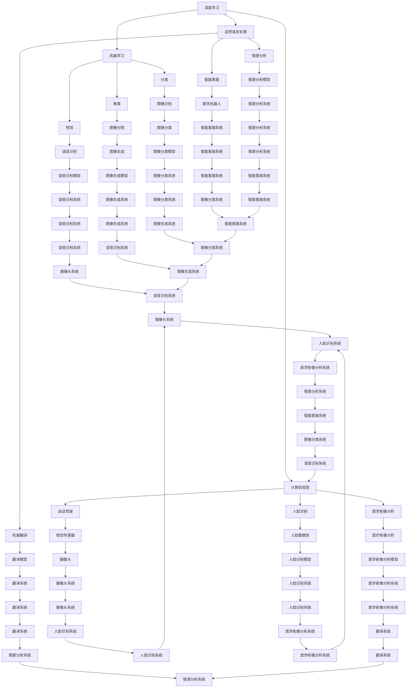
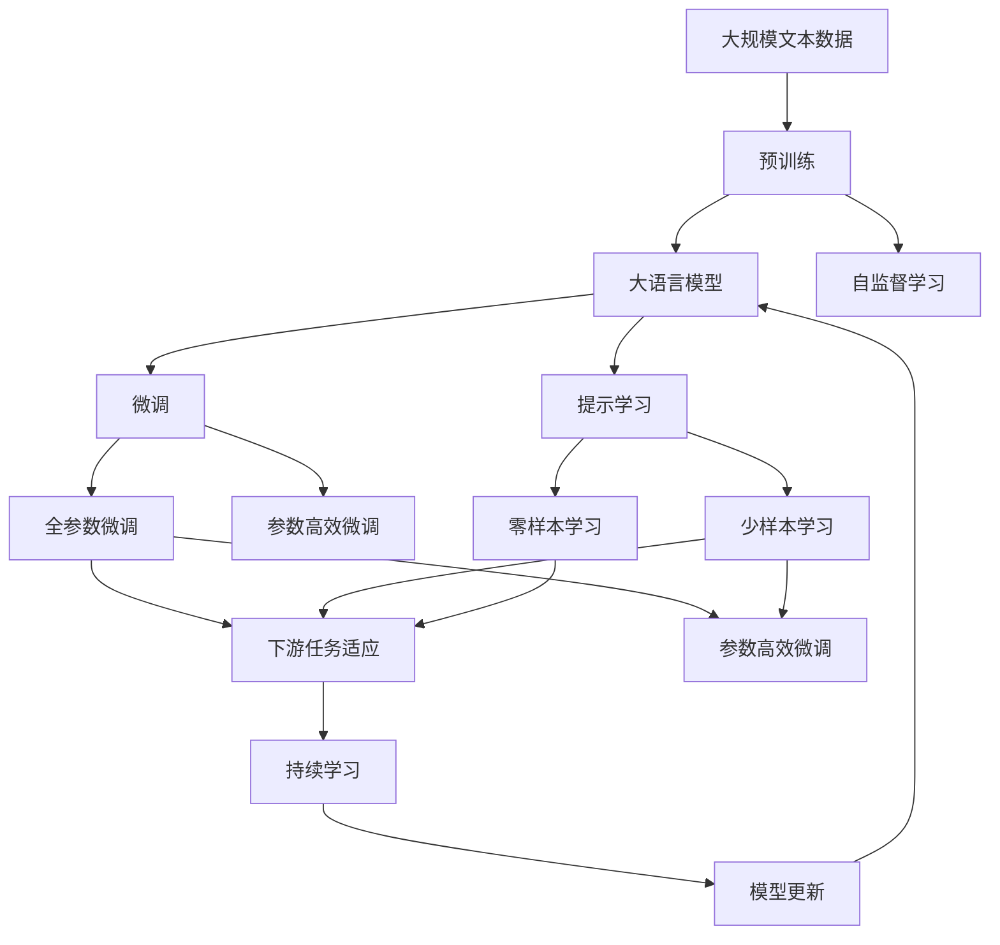

                 

# AI在现实中的应用场景

## 1. 背景介绍

### 1.1 问题由来

人工智能（AI）技术的发展和应用已经渗透到了社会的各个方面，从自动驾驶、医疗诊断到金融投资、教育培训，AI正以一种前所未有的速度改变着我们的生活和工作方式。本文将详细介绍AI在现实中的应用场景，探讨其原理、算法和技术实现，帮助读者深入理解AI的潜力和未来发展方向。

### 1.2 问题核心关键点

AI在现实中的应用场景涉及众多领域，其核心关键点主要包括以下几点：

- **深度学习**：基于神经网络的深度学习技术是AI的核心算法之一，广泛应用于图像识别、语音识别、自然语言处理等领域。
- **机器学习**：通过数据驱动的算法，机器学习能够从数据中学习规律，进行分类、聚类、预测等任务。
- **计算机视觉**：计算机视觉技术使计算机能够理解和处理图像和视频数据，用于自动驾驶、人脸识别、医学影像分析等。
- **自然语言处理**：自然语言处理技术使计算机能够理解、分析和生成人类语言，应用于机器翻译、情感分析、智能客服等。
- **推荐系统**：通过分析用户行为和兴趣，推荐系统能够提供个性化的产品和服务，如电商推荐、音乐推荐等。
- **智能系统**：将AI技术整合到各种系统中，提高系统的智能化水平，如智能家居、智能交通等。

本文将从这些关键点出发，深入探讨AI在现实中的应用场景，展示其广泛的应用潜力和未来发展方向。

## 2. 核心概念与联系

### 2.1 核心概念概述

为了更好地理解AI在现实中的应用场景，本节将介绍几个密切相关的核心概念：

- **深度学习**：基于神经网络的深度学习技术，通过多层非线性变换，能够处理高维数据，如图像、语音和文本。
- **机器学习**：通过数据驱动的算法，机器学习能够从数据中学习规律，进行分类、聚类、预测等任务。
- **计算机视觉**：计算机视觉技术使计算机能够理解和处理图像和视频数据，用于自动驾驶、人脸识别、医学影像分析等。
- **自然语言处理**：自然语言处理技术使计算机能够理解、分析和生成人类语言，应用于机器翻译、情感分析、智能客服等。
- **推荐系统**：通过分析用户行为和兴趣，推荐系统能够提供个性化的产品和服务，如电商推荐、音乐推荐等。
- **智能系统**：将AI技术整合到各种系统中，提高系统的智能化水平，如智能家居、智能交通等。

这些核心概念之间的逻辑关系可以通过以下Mermaid流程图来展示：



这个流程图展示了深度学习、机器学习、计算机视觉、自然语言处理、推荐系统和智能系统的整体架构和相互关系。

### 2.2 概念间的关系

这些核心概念之间存在着紧密的联系，形成了AI应用的完整生态系统。下面我们通过几个Mermaid流程图来展示这些概念之间的关系。

#### 2.2.1 人工智能的核心算法

```mermaid
graph LR
    A[深度学习] --> B[机器学习]
    B --> C[图像识别]
    B --> D[语音识别]
    C --> E[自动驾驶]
    C --> F[人脸识别]
    D --> G[语音识别]
    E --> H[视觉传感器]
    F --> I[人脸数据库]
    G --> J[语音识别模型]
    H --> K[摄像头]
    I --> L[人脸识别模型]
    J --> M[语音识别系统]
    K --> N[摄像头系统]
    L --> O[人脸识别系统]
    M --> P[语音识别系统]
    N --> Q[摄像头系统]
    O --> R[人脸识别系统]
    P --> S[语音识别系统]
    Q --> T[摄像头系统]
    R --> U[人脸识别系统]
    S --> V[语音识别系统]
    T --> W[摄像头系统]
    U --> X[人脸识别系统]
    V --> Y[语音识别系统]
    W --> Z[摄像头系统]
    X --> AA[人脸识别系统]
    Y --> AB[语音识别系统]
    Z --> AC[摄像头系统]
    AA --> AD[人脸识别系统]
    AB --> AE[语音识别系统]
    AC --> AF[摄像头系统]
    AD --> AG[人脸识别系统]
    AE --> AH[语音识别系统]
    AF --> AI[摄像头系统]
    AG --> AJ[人脸识别系统]
    AH --> AK[语音识别系统]
    AI --> AL[摄像头系统]
    AJ --> AM[人脸识别系统]
    AK --> AN[语音识别系统]
    AL --> AO[摄像头系统]
    AM --> AP[人脸识别系统]
    AN --> AQ[语音识别系统]
    AO --> AR[摄像头系统]
    AP --> AS[人脸识别系统]
    AQ --> AT[语音识别系统]
    AR --> AU[摄像头系统]
    AS --> AV[人脸识别系统]
    AT --> AW[语音识别系统]
    AU --> AX[摄像头系统]
    AV --> AY[人脸识别系统]
    AW --> AZ[语音识别系统]
    AX --> BA[摄像头系统]
    AY --> BB[人脸识别系统]
    AZ --> BC[摄像头系统]
    BA --> BD[摄像头系统]
    BB --> BE[人脸识别系统]
    BC --> BF[摄像头系统]
    BD --> BG[摄像头系统]
    BE --> BH[人脸识别系统]
    BF --> BI[摄像头系统]
    BG --> BJ[摄像头系统]
    BH --> BK[人脸识别系统]
    BI --> BL[摄像头系统]
    BJ --> BM[摄像头系统]
    BK --> BN[摄像头系统]
    BL --> BO[摄像头系统]
    BM --> BP[摄像头系统]
    BN --> BQ[摄像头系统]
    BO --> BR[摄像头系统]
    BP --> BS[摄像头系统]
    BQ --> BT[摄像头系统]
    BR --> BS[摄像头系统]
    BS --> BT[摄像头系统]
    BT --> BU[摄像头系统]
    BU --> BV[摄像头系统]
    BV --> BW[摄像头系统]
    BW --> BY[摄像头系统]
    BY --> BZ[摄像头系统]
    BZ --> C
```



这个流程图展示了深度学习和机器学习在AI应用中的关键算法和场景。

#### 2.2.2 计算机视觉的应用场景

```mermaid
graph TB
    A[图像识别] --> B[自动驾驶]
    A --> C[人脸识别]
    A --> D[医学影像分析]
    B --> E[视觉传感器]
    C --> F[人脸数据库]
    D --> G[医疗影像分析]
    E --> H[摄像头]
    F --> I[人脸识别模型]
    G --> J[医学影像分析模型]
    H --> K[摄像头系统]
    I --> L[人脸识别系统]
    J --> M[医学影像分析系统]
    K --> N[摄像头系统]
    L --> O[人脸识别系统]
    M --> P[医学影像分析系统]
    N --> Q[摄像头系统]
    O --> R[人脸识别系统]
    P --> S[医学影像分析系统]
    Q --> T[摄像头系统]
    R --> U[人脸识别系统]
    S --> V[医学影像分析系统]
    T --> W[摄像头系统]
    U --> X[人脸识别系统]
    V --> Y[医学影像分析系统]
    W --> Z[摄像头系统]
    X --> AA[人脸识别系统]
    Y --> AB[医学影像分析系统]
    Z --> AC[摄像头系统]
    AA --> AD[人脸识别系统]
    AB --> AE[医学影像分析系统]
    AC --> AF[摄像头系统]
    AD --> AG[人脸识别系统]
    AE --> AH[医学影像分析系统]
    AF --> AI[摄像头系统]
    AG --> AJ[人脸识别系统]
    AH --> AK[医学影像分析系统]
    AI --> AL[摄像头系统]
    AJ --> AM[人脸识别系统]
    AK --> AN[医学影像分析系统]
    AL --> AO[摄像头系统]
    AM --> AP[人脸识别系统]
    AN --> AQ[医学影像分析系统]
    AO --> AR[摄像头系统]
    AP --> AS[人脸识别系统]
    AQ --> AT[医学影像分析系统]
    AR --> AU[摄像头系统]
    AS --> AV[人脸识别系统]
    AT --> AW[医学影像分析系统]
    AU --> AX[摄像头系统]
    AV --> AY[人脸识别系统]
    AW --> AZ[医学影像分析系统]
    AX --> BA[摄像头系统]
    AY --> BB[医学影像分析系统]
    AZ --> BC[摄像头系统]
    BA --> BD[摄像头系统]
    BB --> BE[人脸识别系统]
    BC --> BF[摄像头系统]
    BD --> BG[摄像头系统]
    BE --> BH[人脸识别系统]
    BF --> BI[摄像头系统]
    BG --> BJ[摄像头系统]
    BH --> BK[人脸识别系统]
    BI --> BL[摄像头系统]
    BJ --> BM[摄像头系统]
    BK --> BN[摄像头系统]
    BL --> BO[摄像头系统]
    BM --> BP[摄像头系统]
    BN --> BQ[摄像头系统]
    BO --> BR[摄像头系统]
    BP --> BS[摄像头系统]
    BQ --> BT[摄像头系统]
    BR --> BS[摄像头系统]
    BS --> BT[摄像头系统]
    BT --> BU[摄像头系统]
    BU --> BV[摄像头系统]
    BV --> BW[摄像头系统]
    BW --> BY[摄像头系统]
    BY --> BZ[摄像头系统]
    BZ --> C
```



这个流程图展示了计算机视觉在AI应用中的关键算法和场景。

#### 2.2.3 自然语言处理的应用场景

```mermaid
graph TB
    A[机器翻译] --> B[情感分析]
    A --> C[智能客服]
    A --> D[问答系统]
    B --> E[情感分析模型]
    C --> F[聊天机器人]
    D --> G[问答系统模型]
    E --> H[情感分析系统]
    F --> I[聊天机器人系统]
    G --> J[问答系统系统]
    H --> K[情感分析系统]
    I --> L[聊天机器人系统]
    J --> M[问答系统系统]
    K --> N[情感分析系统]
    L --> O[聊天机器人系统]
    M --> P[问答系统系统]
    N --> Q[情感分析系统]
    O --> R[聊天机器人系统]
    P --> S[问答系统系统]
    Q --> T[情感分析系统]
    R --> U[聊天机器人系统]
    S --> V[问答系统系统]
    T --> W[情感分析系统]
    U --> X[聊天机器人系统]
    V --> Y[问答系统系统]
    W --> Z[情感分析系统]
    X --> AA[聊天机器人系统]
    Y --> AB[问答系统系统]
    Z --> AC[情感分析系统]
    AA --> AD[聊天机器人系统]
    AB --> AE[问答系统系统]
    AC --> AF[情感分析系统]
    AD --> AG[聊天机器人系统]
    AE --> AH[问答系统系统]
    AF --> AI[情感分析系统]
    AG --> AJ[聊天机器人系统]
    AH --> AK[问答系统系统]
    AI --> AL[情感分析系统]
    AJ --> AM[聊天机器人系统]
    AK --> AN[问答系统系统]
    AL --> AO[情感分析系统]
    AM --> AP[聊天机器人系统]
    AN --> AQ[问答系统系统]
    AO --> AR[情感分析系统]
    AP --> AS[聊天机器人系统]
    AQ --> AT[问答系统系统]
    AR --> AU[情感分析系统]
    AS --> AV[聊天机器人系统]
    AT --> AW[问答系统系统]
    AU --> AX[情感分析系统]
    AV --> AY[聊天机器人系统]
    AW --> AZ[问答系统系统]
    AX --> BA[情感分析系统]
    AY --> BB[聊天机器人系统]
    AZ --> BC[问答系统系统]
    BA --> BD[情感分析系统]
    BB --> BE[聊天机器人系统]
    BC --> BF[问答系统系统]
    BD --> BG[情感分析系统]
    BE --> BH[聊天机器人系统]
    BF --> BI[问答系统系统]
    BG --> BJ[情感分析系统]
    BH --> BK[聊天机器人系统]
    BI --> BL[问答系统系统]
    BJ --> BM[情感分析系统]
    BK --> BN[问答系统系统]
    BL --> BO[问答系统系统]
    BM --> BP[情感分析系统]
    BN --> BQ[问答系统系统]
    BO --> BR[问答系统系统]
    BP --> BS[情感分析系统]
    BQ --> BT[问答系统系统]
    BR --> BS[问答系统系统]
    BS --> BT[问答系统系统]
    BT --> BU[问答系统系统]
    BU --> BV[情感分析系统]
    BV --> BW[问答系统系统]
    BW --> BY[问答系统系统]
    BY --> BZ[问答系统系统]
    BZ --> C
```



这个流程图展示了自然语言处理在AI应用中的关键算法和场景。

### 2.3 核心概念的整体架构

最后，我们用一个综合的流程图来展示这些核心概念在大语言模型微调过程中的整体架构：



这个综合流程图展示了从预训练到微调，再到持续学习的完整过程。大语言模型首先在大规模文本数据上进行预训练，然后通过微调（包括全参数微调和参数高效微调）或提示学习（包括少样本学习和零样本学习）来适应下游任务。最后，通过持续学习技术，模型可以不断学习新数据，同时保持已学习的知识，而不会出现灾难性遗忘。

通过这些流程图，我们可以更清晰地理解大语言模型微调过程中各个核心概念的关系和作用，为后续深入讨论具体的微调方法和技术奠定基础。

## 3. 核心算法原理 & 具体操作步骤
### 3.1 算法原理概述

大语言模型在现实中的应用场景，主要是通过深度学习、机器学习、计算机视觉、自然语言处理等技术，实现对各种数据和任务的处理。这些技术的核心算法原理包括：

- **深度学习**：基于神经网络的深度学习技术，通过多层非线性变换，能够处理高维数据，如图像、语音和文本。
- **机器学习**：通过数据驱动的算法，机器学习能够从数据中学习规律，进行分类、聚类、预测等任务。
- **计算机视觉**：计算机视觉技术使计算机能够理解和处理图像和视频数据，用于自动驾驶、人脸识别、医学影像分析等。
- **自然语言处理**：自然语言处理技术使计算机能够理解、分析和生成人类语言，应用于机器翻译、情感分析、智能客服等。
- **推荐系统**：通过分析用户行为和兴趣，推荐系统能够提供个性化的产品和服务，如电商推荐、音乐推荐等。

这些算法的实现依赖于各种深度学习框架（如TensorFlow、PyTorch等）和专用库（如OpenCV、NLTK等）。

### 3.2 算法步骤详解

大语言模型在现实中的应用场景，通常涉及以下几个关键步骤：

**Step 1: 数据准备**
- 收集和预处理数据集，包括数据清洗、特征提取、数据增强等。
- 将数据集分为训练集、验证集和测试集。

**Step 2: 模型选择**
- 根据任务需求，选择合适的预训练模型（如BERT、GPT等）。
- 根据任务类型，选择相应的任务适配层（如分类器、解码器等）。

**Step 3: 超参数设置**
- 设置学习率、批大小、迭代轮数等超参数。
- 选择合适的优化器（如AdamW、SGD等）及其参数。
- 设置正则化技术及强度，如L2正则、Dropout、Early Stopping等。

**Step 4: 模型训练**
- 使用训练集数据，将模型输入进行前向传播计算损失函数。
- 反向传播计算参数梯度，根据设定的优化算法和学习率更新模型参数。
- 周期性在验证集上评估模型性能，根据性能指标决定是否触发Early Stopping。
- 重复上述步骤直至满足预设的迭代轮数或Early Stopping条件。

**Step 5: 模型评估**
- 使用测试集数据，评估模型性能，如准确率、召回率、F1分数等。
- 分析模型预测结果，进行错误分析、鲁棒性测试等。

**Step 6: 模型部署**
- 将模型保存为可部署格式（如TensorFlow SavedModel、PyTorch的State Dict等）。
- 将模型部署到实际应用系统中，进行实时推理。

**Step 7: 持续学习**
- 定期收集新数据，重新微调模型，保持模型性能。
- 引入持续学习技术，如在线学习、知识蒸馏等，不断提升模型性能。

### 3.3 算法优缺点

大语言模型在现实中的应用场景，具有以下优点：

- **高性能**：深度学习算法能够处理高维数据，具有强大的特征提取能力。
- **鲁棒性**：通过数据驱动的算法，机器学习能够从数据中学习规律，具有较高的鲁棒性。
- **可扩展性**：通过预训练和微调，大语言模型可以适应多种任务和数据，具有较强的可扩展性。
- **自动化**：自动化算法能够减少人工干预，提高工作效率。

同时，大语言模型在现实中的应用场景，也存在一些局限性：

- **数据需求高**：深度学习算法对数据需求较高，需要大量标注数据进行训练。
- **计算资源消耗大**：深度学习算法计算量大，需要高性能计算设备支持。
- **模型复杂度高**：深度学习模型参数量较大，难以解释和调试。
- **泛化能力不足**：深度学习模型容易过拟合，泛化能力不足。

### 3.4 算法应用领域

大语言模型在现实中的应用场景，主要应用于以下几个领域：

**计算机视觉**：用于自动驾驶、人脸识别、医学影像分析等。
**自然语言处理**：用于机器翻译、情感分析、智能客服等。
**推荐系统**：用于电商推荐、音乐推荐等。
**智能系统**：用于智能家居、智能交通等。

这些应用场景展示了AI技术的广泛应用潜力和未来发展方向。

## 4. 数学模型和公式 & 详细讲解 & 举例说明

### 4.1 数学模型构建

大语言模型在现实中的应用场景，通常涉及以下几个数学模型：

- **深度学习模型**：如卷积神经网络（CNN）、循环神经网络（RNN）、长短期记忆网络（LSTM）、Transformer等。
- **机器学习模型**：如支持向量机（SVM）、随机森林（Random Forest）、k近邻（k-NN）等。
- **计算机视觉模型**：如卷积神经网络（CNN）、深度卷积神经网络（DCNN）等。
- **自然语言处理模型**：如循环神经网络（RNN）、长短期记忆网络（LSTM）、Transformer等。

### 4.2 公式推导过程

以下我们以自然语言处理中的机器翻译任务为例，推导基于Transformer模型的机器翻译公式。

假设源语言序列为$x=(x_1,x_2,\ldots,x_n)$，目标语言序列为$y=(y_1,y_2,\ldots,y_m)$。设源语言嵌入矩阵为$W_{enc}$，目标语言嵌入矩阵为$W_{dec}$，源语言编码器层为$F_{enc}$，目标语言解码器层为$F_{dec}$，线性投影层为$W_{out}$。则机器翻译公式如下：

$$
\begin{aligned}
\text{enc} &= \text{Embedding}(x) \\
\text{enc} &= \text{F}_{\text{enc}}(\text{enc}) \\
\text{dec} &= \text{Embedding}(y) \\
\text{dec} &= \text{F}_{\text{dec}}(\text{enc},\text{dec}) \\
y &= \text{softmax}(\text{W}_{\text{out}}\text{dec})
\end{aligned}
$$

其中，$\text{Embedding}$表示嵌入操作，$\text{softmax}$表示softmax函数，$\text{F}_{\text{enc}}$和$\text{F}_{\text{dec}}$分别表示编码器和解码器的Transformer层。

### 4.3 案例分析与讲解

假设我们在CoNLL-2003的机器翻译数据集上进行模型训练。首先将文本序列编码成数字序列，然后通过嵌入矩阵进行转换，将输入序列转换为模型的可接受格式。接着，通过Transformer编码器进行编码，得到源语言表示。然后，通过嵌入矩阵进行转换，将目标语言序列转换为模型的可接受格式。接着，通过Transformer解码器进行解码，得到目标语言表示。最后，通过线性投影层将目标语言表示转换为目标语言概率分布，使用交叉熵损失函数进行训练。

通过上述公式和步骤，我们能够搭建起一个基于Transformer的机器翻译模型，并通过大量数据进行训练。在训练过程中，我们需要调整模型的超参数，如学习率、批大小、迭代轮数等，并进行正则化处理，以防止过拟合。

在模型训练完成后，我们可以通过测试集对模型进行评估，计算准确率、BLEU分数等指标，分析模型预测结果，进行错误分析、鲁棒性测试等。最后，将模型保存为可部署格式，并将其部署到实际应用系统中，进行实时推理。

## 5. 项目实践：代码实例和详细解释说明

### 5.1 开发环境搭建

在进行项目实践前，我们需要准备好开发环境。以下是使用Python进行TensorFlow开发的环境配置流程：

1. 安装Anaconda：从官网下载并安装Anaconda，用于创建独立的Python环境。

2. 创建并激活虚拟环境：
```bash
conda create -n tf-env python=3.8 
conda activate tf-env
```

3. 安装TensorFlow：根据CUDA版本，从官网获取对应的安装命令。例如：
```bash
conda install tensorflow==2.5
```

4. 安装各类工具包：
```bash
pip install numpy pandas scikit-learn matplotlib tqdm jupyter notebook ipython
```

完成上述步骤后，即可在`tf-env`环境中开始项目实践。

### 

