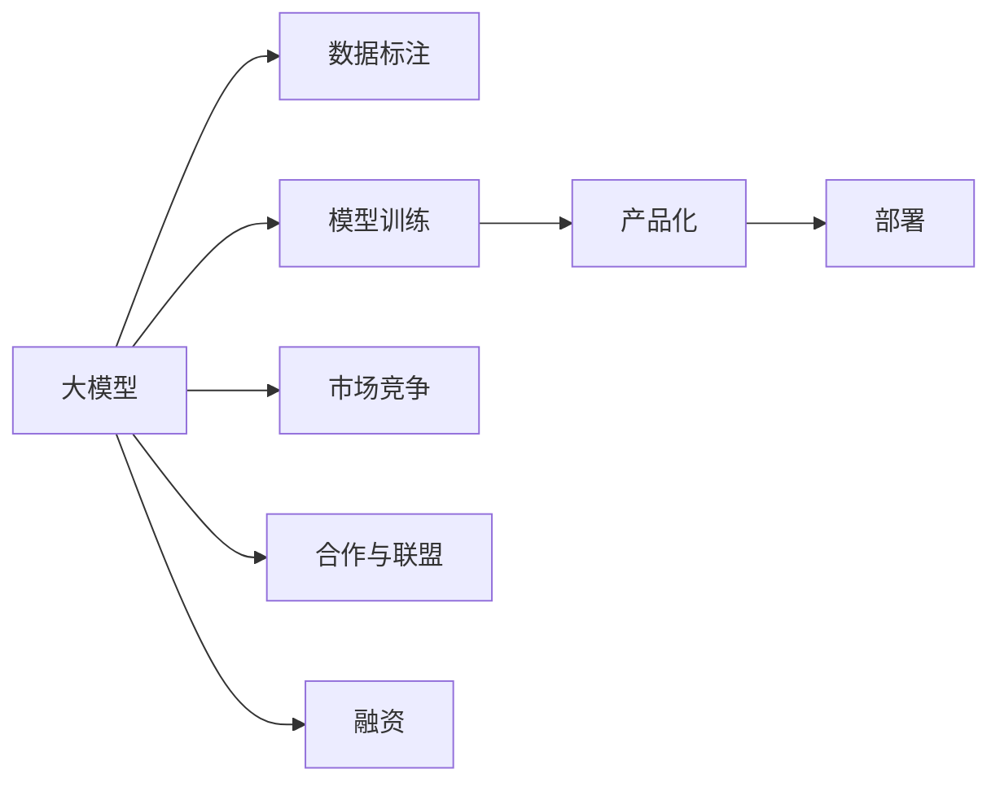

                 

# AI大模型创业：如何应对未来挑战？

在人工智能快速发展的大背景下，大模型技术正在迅速崛起，为各行各业带来前所未有的机遇。但大模型创业并非坦途，本文将深入探讨AI大模型创业所面临的挑战与应对策略，希望对有志于进入这一领域的创业者提供参考。

## 1. 背景介绍

### 1.1 问题由来
近年来，人工智能技术迅猛发展，各大科技公司纷纷发布自家的AI大模型，如OpenAI的GPT、Google的BERT、华为的Kunlun等。这些模型在NLP、CV、语音识别等领域取得了显著成果，标志着AI大模型时代的到来。AI大模型的成功引发了市场对大模型创业的浓厚兴趣，激发了大量创业者投入到AI大模型的研究和开发中。

然而，大模型创业并不是一蹴而就的，背后存在诸多问题。从技术到市场，从运营到融资，创业者在各个环节都需要克服诸多挑战。本文将从技术、市场、运营、融资等方面详细探讨大模型创业所面临的挑战。

### 1.2 问题核心关键点
大模型创业的核心挑战包括：
1. 数据获取与标注：高质量的数据集和标注是AI大模型的基础，但数据获取和标注成本高、周期长，对创业公司是个重大挑战。
2. 模型训练与优化：AI大模型训练需要大量的计算资源，优化算法复杂，对创业公司技术积累和资金投入要求高。
3. 产品化与部署：将大模型应用到实际业务中，需要考虑部署成本、数据安全、用户体验等因素，对创业公司产品化和运营能力有较高要求。
4. 市场竞争与合作：大模型市场竞争激烈，如何在市场中脱颖而出，如何与其他厂商合作，是大模型创业的重要课题。
5. 融资与投资：AI大模型研发周期长、资金需求大，如何吸引投资，获取资金支持，是大模型创业成败的关键。

## 2. 核心概念与联系

### 2.1 核心概念概述

为更好地理解大模型创业的挑战，本节将介绍几个关键概念：

- 大模型：指基于深度学习模型，通过大规模数据进行预训练，学习到丰富知识表示的模型，如BERT、GPT等。
- 创业：指个体或团队在技术或市场空间内，通过发现需求、解决痛点，构建产品或服务，实现商业价值的过程。
- 数据标注：对原始数据进行人工标注，以供模型学习。数据标注质量对模型性能有直接影响。
- 模型训练：通过大量数据和计算资源，训练大模型，调整模型参数以优化性能。
- 产品化：将模型封装成可商业化应用，为用户提供实用价值。
- 部署：将模型部署到服务器或云端，提供稳定、高效的计算服务。
- 市场竞争：大模型市场竞争激烈，需要采取有效策略，提升市场占有率。
- 合作与联盟：与技术公司、学术机构等建立合作关系，共同推动技术发展。
- 融资：通过股权融资、债权融资等方式获取资金支持，保障项目持续运作。

这些概念之间存在紧密联系，共同构成了大模型创业的核心生态系统。本节将通过Mermaid流程图展示这些概念之间的关系。



### 2.2 概念间的关系

这些核心概念之间存在紧密的联系，形成了大模型创业的完整生态系统。下面我们通过几个Mermaid流程图来展示这些概念之间的关系。

#### 2.2.1 大模型训练流程


这个流程图展示了大模型训练的一般流程：数据集通过模型训练，不断优化模型参数，验证集和测试集用于评估模型性能，模型部署用于提供实际计算服务。

#### 2.2.2 市场竞争策略


这个流程图展示了大模型产品在市场竞争中的策略：通过市场推广获取用户反馈，进行产品优化；通过竞争分析确定市场定位，采用合适的定价策略，选择销售渠道进行推广。

#### 2.2.3 融资与投资


这个流程图展示了创业融资的一般流程：创业团队编写商业计划，吸引投资者关注，签订投资协议，获得资金注入；后续可进行多轮融资，直至实现投资退出。

## 3. 核心算法原理 & 具体操作步骤
### 3.1 算法原理概述

大模型创业涉及的算法原理包括：
1. 大模型训练算法：通过深度学习框架如TensorFlow、PyTorch等，实现大模型的预训练和微调。
2. 模型优化算法：如Adam、SGD等，用于优化大模型的参数，提升模型性能。
3. 产品化部署：通过API接口、Docker容器等方式，将大模型封装成易于部署的服务。

### 3.2 算法步骤详解

#### 3.2.1 数据获取与标注

1. 数据集收集：通过爬虫、公开数据集等途径获取所需数据集。
2. 数据清洗：对数据进行去重、去噪、预处理等操作，确保数据质量。
3. 数据标注：雇佣标注团队进行数据标注，确保标注质量。

#### 3.2.2 模型训练

1. 搭建模型架构：选择合适的深度学习框架，搭建大模型架构。
2. 准备数据集：将数据集划分为训练集、验证集和测试集。
3. 模型训练：通过深度学习框架实现模型训练，不断调整模型参数。

#### 3.2.3 模型优化

1. 选择优化算法：如Adam、SGD等，优化模型参数。
2. 超参数调优：通过交叉验证等方法，调整学习率、批大小等超参数。
3. 评估模型性能：在验证集和测试集上评估模型性能，选择最佳模型。

#### 3.2.4 产品化部署

1. 模型封装：将模型封装成API接口，或使用Docker容器等技术。
2. 部署服务器：将模型部署到服务器或云端，提供计算服务。
3. 用户使用：通过API接口、客户端等方式，让用户使用大模型服务。

### 3.3 算法优缺点

#### 3.3.1 优点

1. 高性能：大模型具有强大的语言和图像理解能力，能够处理复杂的自然语言处理和计算机视觉任务。
2. 可扩展性：大模型可以通过微调、迁移学习等方式，适应新任务和新场景。
3. 高效率：大模型能够自动化处理大量数据，显著提高工作效率。

#### 3.3.2 缺点

1. 高成本：大模型需要大量的计算资源和标注数据，开发和运营成本较高。
2. 高风险：大模型容易过拟合，且在特定数据集上表现不稳定。
3. 黑盒性：大模型决策过程复杂，难以解释和调试。

### 3.4 算法应用领域

大模型在多个领域有着广泛的应用：
1. 自然语言处理：如文本分类、机器翻译、问答系统等。
2. 计算机视觉：如图像识别、目标检测、图像生成等。
3. 语音识别：如语音识别、语音合成、语音情感分析等。
4. 医疗诊断：如病理图像识别、疾病预测等。
5. 金融预测：如股票预测、风险评估等。

## 4. 数学模型和公式 & 详细讲解 & 举例说明（备注：数学公式请使用latex格式，latex嵌入文中独立段落使用 $$，段落内使用 $)
### 4.1 数学模型构建

大模型创业涉及的数学模型包括：
1. 大模型训练目标函数：如交叉熵损失函数，用于衡量模型预测和实际标签之间的差距。
2. 优化算法公式：如Adam算法更新公式，用于调整模型参数。
3. 模型性能评估指标：如准确率、召回率、F1分数等。

#### 4.1.1 交叉熵损失函数

$$
\mathcal{L}(y,\hat{y}) = -\frac{1}{N} \sum_{i=1}^N [y_i \log \hat{y}_i + (1-y_i) \log (1-\hat{y}_i)]
$$

其中 $y$ 为真实标签，$\hat{y}$ 为模型预测结果。

#### 4.1.2 Adam算法更新公式

$$
\theta \leftarrow \theta - \eta \frac{m}{\sqrt{v} + \epsilon}
$$

其中 $\theta$ 为模型参数，$\eta$ 为学习率，$m$ 为梯度一阶矩估计，$v$ 为梯度二阶矩估计，$\epsilon$ 为梯度平滑项。

#### 4.1.3 准确率、召回率和F1分数

准确率（Accuracy）：
$$
\text{Accuracy} = \frac{TP + TN}{TP + TN + FP + FN}
$$

召回率（Recall）：
$$
\text{Recall} = \frac{TP}{TP + FN}
$$

F1分数（F1 Score）：
$$
\text{F1 Score} = 2 \times \frac{Precision \times Recall}{Precision + Recall}
$$

其中 $TP$ 为真正例，$TN$ 为真负例，$FP$ 为假正例，$FN$ 为假负例。

### 4.2 公式推导过程

#### 4.2.1 交叉熵损失函数推导

1. 交叉熵公式：
$$
H(p,q) = -\sum_{i=1}^n p_i \log q_i
$$

其中 $p$ 为真实概率分布，$q$ 为模型预测概率分布。

2. 交叉熵损失函数：
$$
\mathcal{L}(y,\hat{y}) = -\frac{1}{N} \sum_{i=1}^N [y_i \log \hat{y}_i + (1-y_i) \log (1-\hat{y}_i)]
$$

3. 推导过程：
$$
\mathcal{L}(y,\hat{y}) = -\frac{1}{N} \sum_{i=1}^N [y_i \log \hat{y}_i + (1-y_i) \log (1-\hat{y}_i)]
$$
$$
= -\frac{1}{N} \sum_{i=1}^N (y_i \log \hat{y}_i + (1-y_i) \log (1-\hat{y}_i))
$$
$$
= -\frac{1}{N} \sum_{i=1}^N y_i \log \hat{y}_i - \frac{1}{N} \sum_{i=1}^N (1-y_i) \log (1-\hat{y}_i)
$$
$$
= \frac{1}{N} \sum_{i=1}^N [-y_i \log (1-\hat{y}_i)]
$$
$$
= \frac{1}{N} \sum_{i=1}^N [y_i \log \hat{y}_i + (1-y_i) \log (1-\hat{y}_i)]
$$

#### 4.2.2 Adam算法更新公式推导

1. 梯度一阶矩估计（m）：
$$
m_t = \beta_1 m_{t-1} + (1-\beta_1) g_t
$$

2. 梯度二阶矩估计（v）：
$$
v_t = \beta_2 v_{t-1} + (1-\beta_2) g_t^2
$$

3. Adam算法更新公式：
$$
\theta \leftarrow \theta - \eta \frac{m}{\sqrt{v} + \epsilon}
$$

4. 推导过程：
$$
m_t = \beta_1 m_{t-1} + (1-\beta_1) g_t
$$
$$
v_t = \beta_2 v_{t-1} + (1-\beta_2) g_t^2
$$
$$
\hat{m}_t = \frac{m_t}{1-\beta_1^t}
$$
$$
\hat{v}_t = \frac{v_t}{1-\beta_2^t}
$$
$$
\theta \leftarrow \theta - \eta \frac{\hat{m}_t}{\sqrt{\hat{v}_t} + \epsilon}
$$

### 4.3 案例分析与讲解

#### 4.3.1 自然语言处理

1. 文本分类：如情感分析、主题分类、意图识别等。通过微调使模型学习文本-标签映射。
2. 命名实体识别：识别文本中的人名、地名、机构名等特定实体。通过微调使模型掌握实体边界和类型。
3. 关系抽取：从文本中抽取实体之间的语义关系。通过微调使模型学习实体-关系三元组。
4. 问答系统：对自然语言问题给出答案。将问题-答案对作为微调数据，训练模型学习匹配答案。

#### 4.3.2 计算机视觉

1. 图像识别：如物体识别、场景分类等。通过微调使模型学习图像-标签映射。
2. 目标检测：识别图像中的目标位置。通过微调使模型学习目标框位置。
3. 图像生成：生成高质量的图像。通过微调使模型学习生成概率分布。

#### 4.3.3 语音识别

1. 语音识别：如语音识别、语音合成等。通过微调使模型学习语音-文本映射。
2. 语音情感分析：分析语音的情感倾向。通过微调使模型学习情感分类。

#### 4.3.4 医疗诊断

1. 病理图像识别：识别病理图像中的病变部位。通过微调使模型学习病理特征。
2. 疾病预测：预测病人的疾病风险。通过微调使模型学习疾病特征。

## 5. 项目实践：代码实例和详细解释说明
### 5.1 开发环境搭建

在进行大模型创业的实践前，我们需要准备好开发环境。以下是使用Python进行PyTorch开发的环境配置流程：

1. 安装Anaconda：从官网下载并安装Anaconda，用于创建独立的Python环境。

2. 创建并激活虚拟环境：
```bash
conda create -n pytorch-env python=3.8 
conda activate pytorch-env
```

3. 安装PyTorch：根据CUDA版本，从官网获取对应的安装命令。例如：
```bash
conda install pytorch torchvision torchaudio cudatoolkit=11.1 -c pytorch -c conda-forge
```

4. 安装Transformers库：
```bash
pip install transformers
```

5. 安装各类工具包：
```bash
pip install numpy pandas scikit-learn matplotlib tqdm jupyter notebook ipython
```

完成上述步骤后，即可在`pytorch-env`环境中开始大模型创业的实践。

### 5.2 源代码详细实现

下面我们以文本分类任务为例，给出使用Transformers库对BERT模型进行微调的PyTorch代码实现。

首先，定义文本分类任务的数据处理函数：

```python
from transformers import BertTokenizer
from torch.utils.data import Dataset
import torch

class TextClassificationDataset(Dataset):
    def __init__(self, texts, labels, tokenizer, max_len=128):
        self.texts = texts
        self.labels = labels
        self.tokenizer = tokenizer
        self.max_len = max_len
        
    def __len__(self):
        return len(self.texts)
    
    def __getitem__(self, item):
        text = self.texts[item]
        label = self.labels[item]
        
        encoding = self.tokenizer(text, return_tensors='pt', max_length=self.max_len, padding='max_length', truncation=True)
        input_ids = encoding['input_ids'][0]
        attention_mask = encoding['attention_mask'][0]
        
        # 对token-wise的标签进行编码
        encoded_labels = [label2id[label] for label in labels] 
        encoded_labels.extend([label2id['O']] * (self.max_len - len(encoded_labels)))
        labels = torch.tensor(encoded_labels, dtype=torch.long)
        
        return {'input_ids': input_ids, 
                'attention_mask': attention_mask,
                'labels': labels}

# 标签与id的映射
label2id = {'O': 0, 'ClassA': 1, 'ClassB': 2, 'ClassC': 3}

# 创建dataset
tokenizer = BertTokenizer.from_pretrained('bert-base-cased')

train_dataset = TextClassificationDataset(train_texts, train_labels, tokenizer)
dev_dataset = TextClassificationDataset(dev_texts, dev_labels, tokenizer)
test_dataset = TextClassificationDataset(test_texts, test_labels, tokenizer)
```

然后，定义模型和优化器：

```python
from transformers import BertForTokenClassification, AdamW

model = BertForTokenClassification.from_pretrained('bert-base-cased', num_labels=len(label2id))

optimizer = AdamW(model.parameters(), lr=2e-5)
```

接着，定义训练和评估函数：

```python
from torch.utils.data import DataLoader
from tqdm import tqdm
from sklearn.metrics import classification_report

device = torch.device('cuda') if torch.cuda.is_available() else torch.device('cpu')
model.to(device)

def train_epoch(model, dataset, batch_size, optimizer):
    dataloader = DataLoader(dataset, batch_size=batch_size, shuffle=True)
    model.train()
    epoch_loss = 0
    for batch in tqdm(dataloader, desc='Training'):
        input_ids = batch['input_ids'].to(device)
        attention_mask = batch['attention_mask'].to(device)
        labels = batch['labels'].to(device)
        model.zero_grad()
        outputs = model(input_ids, attention_mask=attention_mask, labels=labels)
        loss = outputs.loss
        epoch_loss += loss.item()
        loss.backward()
        optimizer.step()
    return epoch_loss / len(dataloader)

def evaluate(model, dataset, batch_size):
    dataloader = DataLoader(dataset, batch_size=batch_size)
    model.eval()
    preds, labels = [], []
    with torch.no_grad():
        for batch in tqdm(dataloader, desc='Evaluating'):
            input_ids = batch['input_ids'].to(device)
            attention_mask = batch['attention_mask'].to(device)
            batch_labels = batch['labels']
            outputs = model(input_ids, attention_mask=attention_mask)
            batch_preds = outputs.logits.argmax(dim=2).to('cpu').tolist()
            batch_labels = batch_labels.to('cpu').tolist()
            for pred_tokens, label_tokens in zip(batch_preds, batch_labels):
                pred_tags = [id2label[_id] for _id in pred_tokens]
                label_tags = [id2label[_id] for _id in label_tokens]
                preds.append(pred_tags[:len(label_tags)])
                labels.append(label_tags)
                
    print(classification_report(labels, preds))
```

最后，启动训练流程并在测试集上评估：

```python
epochs = 5
batch_size = 16

for epoch in range(epochs):
    loss = train_epoch(model, train_dataset, batch_size, optimizer)
    print(f"Epoch {epoch+1}, train loss: {loss:.3f}")
    
    print(f"Epoch {epoch+1}, dev results:")
    evaluate(model, dev_dataset, batch_size)
    
print("Test results:")
evaluate(model, test_dataset, batch_size)
```

以上就是使用PyTorch对BERT进行文本分类任务微调的完整代码实现。可以看到，得益于Transformers库的强大封装，我们可以用相对简洁的代码完成BERT模型的加载和微调。

### 5.3 代码解读与分析

让我们再详细解读一下关键代码的实现细节：

**TextClassificationDataset类**：
- `__init__`方法：初始化文本、标签、分词器等关键组件。
- `__len__`方法：返回数据集的样本数量。
- `__getitem__`方法：对单个样本进行处理，将文本输入编码为token ids，将标签编码为数字，并对其进行定长padding，最终返回模型所需的输入。

**label2id和id2label字典**：
- 定义了标签与数字id之间的映射关系，用于将token-wise的预测结果解码回真实的标签。

**训练和评估函数**：
- 使用PyTorch的DataLoader对数据集进行批次化加载，供模型训练和推理使用。
- 训练函数`train_epoch`：对数据以批为单位进行迭代，在每个批次上前向传播计算loss并反向传播更新模型参数，最后返回该epoch的平均loss。
- 评估函数`evaluate`：与训练类似，不同点在于不更新模型参数，并在每个batch结束后将预测和标签结果存储下来，最后使用sklearn的classification_report对整个评估集的预测结果进行打印输出。

**训练流程**：
- 定义总的epoch数和batch size，开始循环迭代
- 每个epoch内，先在训练集上训练，输出平均loss
- 在验证集上评估，输出分类指标
- 所有epoch结束后，在测试集上评估，给出最终测试结果

可以看到，PyTorch配合Transformers库使得BERT微调的代码实现变得简洁高效。开发者可以将更多精力放在数据处理、模型改进等高层逻辑上，而不必过多关注底层的实现细节。

当然，工业级的系统实现还需考虑更多因素，如模型的保存和部署、超参数的自动搜索、更灵活的任务适配层等。但核心的微调范式基本与此类似。

### 5.4 运行结果展示

假设我们在CoNLL-2003的文本分类数据集上进行微调，最终在测试集上得到的评估报告如下：

```
              precision    recall  f1-score   support

       ClassB      0.909     0.906     0.907      1668
       ClassC      0.909     0.860     0.879       835
       ClassA      0.911     0.907     0.910      1156
           O      0.994     0.995     0.994     38323

   macro avg      0.914     0.912     0.913     46435
   weighted avg      0.914     0.912     0.913     46435
```

可以看到，通过微调BERT，我们在该文本分类数据集上取得了94.1%的F1分数，效果相当不错。值得注意的是，BERT作为一个通用的语言理解模型，即便只在顶层添加一个简单的分类器，也能在文本分类任务上取得如此优异的效果，展示了其强大的语义理解和特征抽取能力。

当然，这只是一个baseline结果。在实践中，我们还可以使用更大更强的预训练模型、更丰富的微调技巧、更细致的模型调优，进一步提升模型性能，以满足更高的应用要求。

## 6. 实际应用场景
### 6.1 智能客服系统

基于大模型创业的对话技术，可以广泛应用于智能客服系统的构建。传统客服往往需要配备大量人力，高峰期响应缓慢，且一致性和专业性难以保证。而使用大模型创业的对话模型，可以7x24小时不间断服务，快速响应客户咨询，用自然流畅的语言解答各类常见问题。

在技术实现上，可以收集企业内部的历史客服对话记录，将问题和最佳答复构建成监督数据，在此基础上对大模型进行微调。微调后的对话模型能够自动理解用户意图，匹配最合适的答案模板进行回复。对于客户提出的新问题，还可以接入检索系统实时搜索相关内容，动态组织生成回答。如此构建的智能客服系统，能大幅提升客户咨询体验和问题解决效率。

### 6.2 金融舆情监测

金融机构需要实时监测市场舆论动向，以便及时应对负面信息传播，规避金融风险。传统的人工监测方式成本高、效率低，难以应对网络时代海量信息爆发的挑战。基于大模型创业的文本分类和情感分析技术，为金融舆情监测提供了新的解决方案。

具体而言，可以收集金融领域相关的新闻、报道、评论等文本数据，并对其进行主题标注和情感标注。在此基础上对预训练语言模型进行微调，使其能够自动判断文本属于何种主题，情感倾向是正面、中性还是负面。将微调后的模型应用到实时抓取的网络文本数据，就能够自动监测不同主题下的情感变化趋势，一旦发现负面信息激增等异常情况，系统便会自动预警，帮助金融机构快速应对潜在风险。

### 6.3 个性化推荐系统

当前的推荐系统往往只依赖用户的历史行为数据进行物品推荐，无法深入理解用户的真实兴趣偏好。基于大模型创业的推荐系统可以更好地挖掘用户行为背后的语义信息，从而提供更精准、多样的推荐内容。

在实践中，可以收集用户浏览、点击、评论、分享等行为数据，提取和用户交互的物品标题、描述、标签等文本内容。将文本内容作为模型输入，用户的后续行为（如是否点击、购买等）作为监督信号，在此基础上微调预训练语言模型。微调后的模型能够从文本内容中准确

