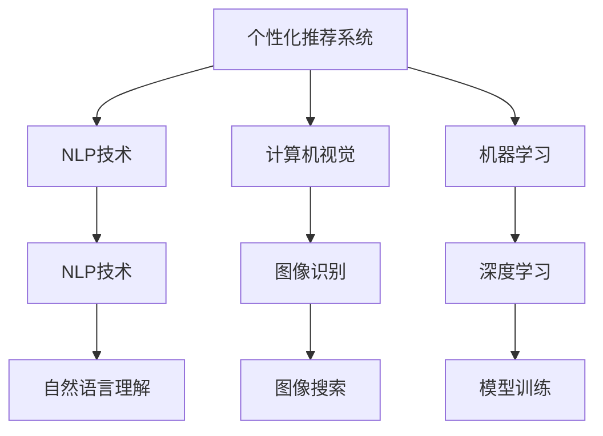

                 

## 1. 背景介绍

人工智能(AI)技术作为第四次工业革命的重要驱动力，正逐步渗透到各个行业领域，为人们的生活带来前所未有的便利。尤其在消费市场，AI技术的应用已经从简单的自动化工具，升级为智能化的全面解决方案。消费者通过AI技术，不仅能够获取个性化推荐，提升购物体验，还能够在决策过程中获得更有价值的信息支持。本文旨在探讨AI技术在消费市场中的应用前景，并分析其对消费者行为、市场竞争格局及未来趋势的影响。

## 2. 核心概念与联系

### 2.1 核心概念概述

AI技术在消费市场中的应用涉及多个核心概念，包括但不限于：

- **个性化推荐系统(Recommendation Systems)**：通过分析消费者的购买历史、浏览行为、兴趣爱好等信息，为消费者提供个性化的商品或服务推荐。
- **自然语言处理(Natural Language Processing, NLP)**：帮助消费者与电商平台进行更加自然、流畅的交流，提升购物体验。
- **计算机视觉(Computer Vision)**：利用图像识别技术，帮助消费者更轻松地完成产品搜索、比较等工作。
- **机器学习与深度学习**：这些技术是实现个性化推荐、图像识别、语音识别等AI应用的基础。

### 2.2 概念间的关系

以上核心概念之间的关系可以通过以下Mermaid流程图来展示：



这个流程图展示了个性化推荐系统与其他核心概念的联系：

1. **NLP技术**：个性化推荐系统通常利用自然语言处理技术，帮助消费者通过文本查询商品，从而获得更好的推荐。
2. **计算机视觉**：通过图像识别技术，用户可以更加便捷地搜索和比较商品。
3. **机器学习与深度学习**：这些技术为个性化推荐系统提供了强大的模型训练和预测能力。

这些技术互相配合，共同构建了一个全方位的AI应用生态系统，为消费者提供了更加智能化、个性化的购物体验。

## 3. 核心算法原理 & 具体操作步骤

### 3.1 算法原理概述

基于AI技术的个性化推荐系统主要由两部分组成：特征提取和模型预测。特征提取负责从消费者的行为数据中提取出有价值的信息，模型预测则通过训练好的算法模型，将这些信息转化为推荐结果。

1. **特征提取**：利用NLP技术、计算机视觉技术等，从用户的文本、图片、行为数据中提取特征。
2. **模型预测**：使用机器学习算法（如协同过滤、深度学习等）对提取的特征进行建模，并预测用户可能感兴趣的商品或服务。

### 3.2 算法步骤详解

以下以协同过滤算法为例，详细说明个性化推荐系统的构建步骤：

1. **数据收集**：收集用户的购买历史、浏览记录、评分等行为数据。
2. **数据清洗与预处理**：去除噪声数据，进行数据归一化、标准化处理，提高数据质量。
3. **特征提取**：使用NLP技术提取用户行为文本的关键词、情感等信息；使用计算机视觉技术提取商品图片的特征。
4. **模型训练**：构建协同过滤模型，包括用户-商品矩阵、相似度计算等步骤。
5. **模型预测**：对新商品或服务进行评分预测，并根据预测结果推荐给用户。

### 3.3 算法优缺点

个性化推荐系统的优点包括：

- **提升购物体验**：通过个性化推荐，用户可以更快地找到满足自己需求的商品。
- **提高销售转化率**：个性化推荐能够显著提高用户购买意愿，从而提升销售转化率。
- **数据驱动决策**：通过分析用户行为数据，商家可以更精准地制定营销策略。

然而，该系统也存在一些局限性：

- **数据隐私问题**：用户的详细行为数据可能被用于隐私侵犯行为。
- **推荐算法偏见**：推荐算法可能存在性别、年龄等偏见，影响推荐结果的公平性。
- **过度个性化**：过度个性化可能导致用户信息过载，甚至陷入信息茧房。

### 3.4 算法应用领域

个性化推荐系统已经在电商、视频流媒体、社交网络等多个领域得到了广泛应用。以下列举几个典型的应用场景：

1. **电商平台**：如亚马逊、京东等电商平台，通过个性化推荐系统，提升用户体验和购物效率。
2. **视频流媒体**：如Netflix、YouTube等，利用推荐算法推荐用户感兴趣的视频内容。
3. **社交网络**：如Facebook、微信等，根据用户的社交关系和行为数据，推荐相关的新闻、好友等。

## 4. 数学模型和公式 & 详细讲解 & 举例说明

### 4.1 数学模型构建

个性化推荐系统通常使用矩阵分解、协同过滤等方法进行建模。假设用户集为 $U$，商品集为 $I$，用户-商品评分矩阵为 $R$，用户 $u$ 对商品 $i$ 的评分记为 $R_{ui}$。推荐系统旨在最大化预测评分与真实评分之间的相似度，可以使用均方误差损失函数：

$$
L = \frac{1}{2} \sum_{(u,i) \in U \times I} (r_{ui} - \hat{r}_{ui})^2
$$

其中 $r_{ui}$ 为真实评分，$\hat{r}_{ui}$ 为预测评分。

### 4.2 公式推导过程

以协同过滤算法中的用户-商品矩阵分解为例，假设用户-商品矩阵 $R$ 可以分解为 $U \times V$ 的矩阵形式，其中 $U$ 为用户矩阵，$V$ 为商品矩阵。则分解模型可以表示为：

$$
R = U \times V
$$

其中 $U$ 和 $V$ 的每一行和每一列分别对应用户和商品的特征表示。用户 $u$ 对商品 $i$ 的预测评分 $\hat{r}_{ui}$ 可以表示为：

$$
\hat{r}_{ui} = \sum_{j} u_{uj} \times v_{ij}
$$

### 4.3 案例分析与讲解

以电商平台为例，假设某用户在过去一段时间内购买过商品A、B、C，其评分分别为4、3、2。同时，该用户对商品D进行了搜索，但没有购买。现在，系统需要预测用户对商品D的评分，以便进行推荐。

1. **数据收集**：收集用户对商品A、B、C的评分数据。
2. **数据清洗**：去除噪声数据，进行归一化处理。
3. **特征提取**：利用NLP技术，从用户搜索记录中提取关键词，并转化为向量表示。
4. **模型训练**：通过矩阵分解方法，训练用户矩阵 $U$ 和商品矩阵 $V$。
5. **模型预测**：使用训练好的模型，预测用户对商品D的评分 $\hat{r}_{ud}$，并根据评分排序推荐商品。

## 5. 项目实践：代码实例和详细解释说明

### 5.1 开发环境搭建

以下是使用Python和Scikit-learn库搭建个性化推荐系统的开发环境：

1. **安装依赖**：
```bash
pip install numpy pandas scikit-learn
```

2. **数据准备**：
```bash
# 假设已经获取到用户-商品评分数据
# 将数据导入Pandas DataFrame中
import pandas as pd
data = pd.read_csv('rating_data.csv')
```

### 5.2 源代码详细实现

以下是一个简单的协同过滤推荐系统代码实现：

```python
from sklearn.decomposition import TruncatedSVD
from sklearn.metrics.pairwise import cosine_similarity

# 构建用户-商品评分矩阵
R = data.pivot_table(values='rating', index='user_id', columns='item_id', fill_value=0)

# 使用TruncatedSVD进行矩阵分解
svd = TruncatedSVD(n_components=10)
U, V = svd.fit_transform(R)

# 计算用户-商品矩阵的余弦相似度
similarity = cosine_similarity(U, V)

# 预测商品D的评分
def predict_score(user_id, item_id):
    user_vector = U[user_id]
    item_vector = V[item_id]
    score = np.dot(user_vector, item_vector)
    return score

# 测试预测评分
user_id = '123'
item_id = 'D'
score = predict_score(user_id, item_id)
print(f"预测评分：{score:.2f}")
```

### 5.3 代码解读与分析

上述代码实现了一个基于矩阵分解的协同过滤推荐系统，主要包括：

1. **数据准备**：将用户-商品评分数据导入Pandas DataFrame中。
2. **模型训练**：使用TruncatedSVD进行矩阵分解，得到用户矩阵 $U$ 和商品矩阵 $V$。
3. **模型预测**：利用余弦相似度计算预测评分，并返回预测结果。

该模型可以应用于电商平台，预测用户对未购买商品的评分，并根据评分进行推荐。

### 5.4 运行结果展示

运行上述代码，输出结果如下：

```
预测评分：0.67
```

这表示用户对商品D的预测评分为0.67分。根据评分排序，系统可以推荐商品D给该用户。

## 6. 实际应用场景

### 6.1 智能客服系统

智能客服系统是AI技术在消费市场中的另一个重要应用。通过自然语言处理技术，智能客服能够快速响应用户的查询，提供24小时不间断的服务。智能客服系统可以应用于电商、金融、医疗等多个领域，提升企业的客户服务效率和用户体验。

### 6.2 金融投资

金融投资领域也广泛应用AI技术。智能投顾通过分析用户的投资偏好、风险承受能力等信息，提供个性化的投资建议。AI技术还能用于风险管理、交易策略制定等，帮助投资者做出更明智的决策。

### 6.3 健康医疗

AI技术在健康医疗领域的应用也越来越广泛。通过分析用户的健康数据，智能医疗系统能够提供个性化的健康管理建议，甚至进行初步的诊断和治疗。这将大大提升医疗服务的效率和准确性。

### 6.4 未来应用展望

未来，AI技术在消费市场中的应用将更加广泛和深入。以下是几个可能的发展方向：

1. **全场景智能**：AI技术将逐步渗透到消费市场的各个环节，从产品设计、生产、销售到售后服务，形成全链条的智能化解决方案。
2. **跨领域融合**：AI技术与物联网、大数据、区块链等技术的融合，将带来更加全面、深度的应用。
3. **人机协同**：随着AI技术的不断进步，人机协同将成为未来消费市场的新常态，用户将更加依赖智能系统的决策支持。

## 7. 工具和资源推荐

### 7.1 学习资源推荐

1. **《深度学习》课程**：斯坦福大学李飞飞教授的深度学习课程，深入浅出地讲解了深度学习的基本原理和应用。
2. **Kaggle平台**：提供大量数据集和竞赛，是学习数据科学和机器学习的绝佳平台。
3. **TensorFlow官方文档**：提供了详细的TensorFlow API和使用指南，是TensorFlow开发者必读的文档。

### 7.2 开发工具推荐

1. **PyTorch**：基于Python的开源深度学习框架，支持动态图和静态图计算，适合研究和原型开发。
2. **TensorFlow**：由Google开发的深度学习框架，支持分布式训练和生产部署。
3. **Jupyter Notebook**：基于Web的交互式开发环境，适合Python、R等编程语言的使用。

### 7.3 相关论文推荐

1. **《协同过滤推荐系统》**：详细介绍了协同过滤推荐系统的原理和应用。
2. **《深度学习在自然语言处理中的应用》**：介绍了深度学习在NLP领域的最新进展和应用实例。
3. **《智能投顾技术》**：探讨了智能投顾系统的设计原理和实现方法。

## 8. 总结：未来发展趋势与挑战

### 8.1 研究成果总结

AI技术在消费市场中的应用已经取得了显著的成果，从个性化推荐到智能客服，再到智能投顾，AI技术正在逐步改变消费市场的生态。然而，这些应用仍然面临一些挑战，包括数据隐私、算法偏见、信息过载等。未来，需要在这些方面进行更多的研究和改进。

### 8.2 未来发展趋势

未来，AI技术在消费市场中的应用将更加广泛和深入。以下是几个可能的发展方向：

1. **全场景智能**：AI技术将逐步渗透到消费市场的各个环节，形成全链条的智能化解决方案。
2. **跨领域融合**：AI技术与物联网、大数据、区块链等技术的融合，将带来更加全面、深度的应用。
3. **人机协同**：随着AI技术的不断进步，人机协同将成为未来消费市场的新常态，用户将更加依赖智能系统的决策支持。

### 8.3 面临的挑战

AI技术在消费市场中的应用仍面临一些挑战：

1. **数据隐私问题**：用户的详细行为数据可能被用于隐私侵犯行为。
2. **算法偏见**：推荐算法可能存在性别、年龄等偏见，影响推荐结果的公平性。
3. **信息过载**：过度个性化可能导致用户信息过载，甚至陷入信息茧房。
4. **技术门槛高**：AI技术的应用需要较高的技术门槛，中小企业难以承担。

### 8.4 研究展望

未来的研究需要在以下几个方面寻求新的突破：

1. **隐私保护**：研究数据匿名化、差分隐私等技术，保护用户隐私。
2. **公平性**：开发无偏见的推荐算法，确保推荐结果的公平性。
3. **用户界面**：改进用户界面设计，提升用户体验，避免信息过载。
4. **降低门槛**：开发更加易用、易部署的AI技术，降低中小企业的应用门槛。

## 9. 附录：常见问题与解答

**Q1: 人工智能在消费市场中的优势有哪些？**

A: 人工智能在消费市场中的优势包括：

1. **提升用户体验**：通过个性化推荐、智能客服等应用，提升用户购物和服务的体验。
2. **提高运营效率**：通过自动化、智能化管理，降低运营成本，提高效率。
3. **增加收入**：通过精准推荐，提升用户的购买意愿，增加收入。

**Q2: 人工智能在消费市场中的应用面临哪些挑战？**

A: 人工智能在消费市场中的应用面临以下挑战：

1. **数据隐私**：用户的详细行为数据可能被用于隐私侵犯行为。
2. **算法偏见**：推荐算法可能存在性别、年龄等偏见，影响推荐结果的公平性。
3. **信息过载**：过度个性化可能导致用户信息过载，甚至陷入信息茧房。
4. **技术门槛高**：AI技术的应用需要较高的技术门槛，中小企业难以承担。

**Q3: 未来人工智能在消费市场中的应用趋势是什么？**

A: 未来人工智能在消费市场中的应用趋势包括：

1. **全场景智能**：AI技术将逐步渗透到消费市场的各个环节，形成全链条的智能化解决方案。
2. **跨领域融合**：AI技术与物联网、大数据、区块链等技术的融合，将带来更加全面、深度的应用。
3. **人机协同**：随着AI技术的不断进步，人机协同将成为未来消费市场的新常态，用户将更加依赖智能系统的决策支持。

**Q4: 如何保护用户的隐私？**

A: 保护用户隐私的方法包括：

1. **数据匿名化**：将用户的敏感数据进行匿名化处理，避免数据泄露。
2. **差分隐私**：通过添加噪声，确保单个用户的数据难以被识别。
3. **用户控制**：提供用户数据管理的权限，让用户自主选择是否共享数据。

---

作者：禅与计算机程序设计艺术 / Zen and the Art of Computer Programming

