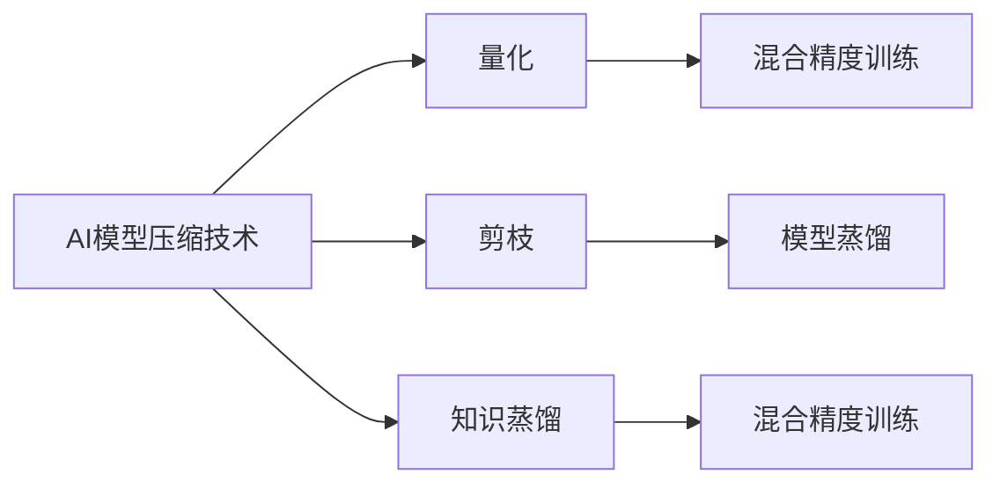
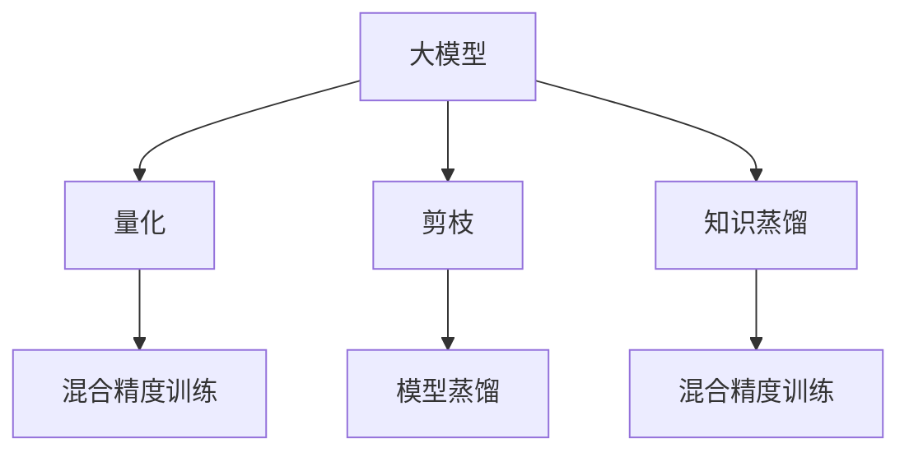

                 

# AI模型压缩技术在大模型领域的应用

> 关键词：AI模型压缩技术,大模型,量化,剪枝,知识蒸馏

## 1. 背景介绍

### 1.1 问题由来

随着深度学习技术的快速发展，大模型（如BERT、GPT-3等）在自然语言处理（NLP）、计算机视觉（CV）等领域的性能不断提升，推动了人工智能应用的边界拓展。然而，由于大模型参数量庞大，对算力、内存、存储等资源的消耗极大，导致其在实际应用中面临诸多挑战。AI模型压缩技术正是为了解决这一问题而应运而生，其目标是在保证模型性能的前提下，大幅度减少模型的资源占用，从而提高模型的部署效率和应用可行性。

### 1.2 问题核心关键点

AI模型压缩技术主要包括量化、剪枝、知识蒸馏等方法，它们的核心目标是减少模型参数数量、降低计算复杂度，并提高模型的泛化能力和可解释性。这些技术在大模型上的应用，可以有效地减少模型体积、加速推理过程、降低资源消耗，同时还能提升模型的长期稳定性和可靠性。

## 2. 核心概念与联系

### 2.1 核心概念概述

为更好地理解AI模型压缩技术在大模型中的应用，本节将介绍几个密切相关的核心概念：

- **AI模型压缩技术**：指通过量化、剪枝、知识蒸馏等方法，优化大模型的结构、参数和计算图，以减少资源占用、提升性能的技术。
- **量化**：指将浮点型参数压缩为更小的整数或固定点数值，从而减少存储空间和计算量。
- **剪枝**：指去除模型中不必要的参数，减少模型大小和计算复杂度。
- **知识蒸馏**：通过知识蒸馏技术，将复杂的大模型知识压缩到小模型中，提升小模型的性能。
- **混合精度训练**：采用混合精度训练技术，使用半精度浮点数进行中间计算，减少计算和存储开销。
- **模型蒸馏**：将大模型的知识蒸馏到小模型中，提升小模型的泛化能力和推理速度。

这些核心概念之间的逻辑关系可以通过以下Mermaid流程图来展示：



这个流程图展示了大模型压缩技术的主要组成及其关联：

1. **量化**和**混合精度训练**可以大幅降低模型的计算和存储成本。
2. **剪枝**和**模型蒸馏**可以去除冗余参数，提高模型推理速度。
3. **知识蒸馏**可以有效地将大模型的知识传递给小模型，提升其泛化能力。

### 2.2 概念间的关系

这些核心概念之间存在密切的联系，共同构成了AI模型压缩技术的整体框架：

- **量化**和**混合精度训练**降低了大模型在推理过程中的计算和存储成本。
- **剪枝**和**模型蒸馏**优化了模型的结构和参数，使得模型在推理过程中更加高效。
- **知识蒸馏**确保了模型在压缩过程中不会丢失关键知识，同时提升了小模型的性能。

这些技术相互配合，为大模型的压缩和优化提供了强有力的支持，使得模型能够在保证性能的前提下，显著减少资源消耗，提升实际应用中的部署效率和效果。

### 2.3 核心概念的整体架构

最后，我们用一个综合的流程图来展示这些核心概念在大模型压缩中的整体架构：



这个综合流程图展示了从预训练到压缩的全过程，以及各类压缩技术的作用和相互配合：

1. **量化**和**混合精度训练**从模型推理过程中降低了资源消耗。
2. **剪枝**和**模型蒸馏**优化了模型结构和参数，提高了推理速度。
3. **知识蒸馏**确保了模型性能不会因压缩而下降。

这些技术的综合应用，使得大模型在压缩后仍能保持优秀的性能，同时降低计算和存储成本，提升实际应用中的部署效率和效果。

## 3. 核心算法原理 & 具体操作步骤

### 3.1 算法原理概述

AI模型压缩技术在大模型上的应用，主要通过量化、剪枝和知识蒸馏等方法，减少模型参数和计算量，提升模型的推理速度和资源利用效率。以下是这些技术在大模型上的具体原理：

- **量化**：通过将浮点型参数转换为更小的整数或固定点数值，减少存储和计算开销。
- **剪枝**：通过删除模型中不必要的参数和结构，减少模型大小和计算复杂度。
- **知识蒸馏**：将复杂大模型的知识压缩到小模型中，提升小模型的性能。

### 3.2 算法步骤详解

以下是AI模型压缩技术在大模型上的具体操作步骤：

**Step 1: 选择压缩方法**
- 根据模型和应用场景，选择合适的压缩方法。例如，对于需要快速推理的任务，可以选择量化和剪枝；对于需要高精度的任务，可以选择知识蒸馏。

**Step 2: 模型量化**
- 对于大模型，可以使用不同的量化方法，如权重量化、激活量化等。选择合适的量化方法后，根据量化策略计算每个参数的新的数值。

**Step 3: 模型剪枝**
- 确定剪枝策略，如基于权重剪枝、基于结构剪枝等。根据剪枝策略，移除模型中冗余的参数和结构。

**Step 4: 模型蒸馏**
- 选择合适的小模型作为蒸馏目标，使用知识蒸馏技术，将大模型的知识传递给小模型。可以使用不同的蒸馏方法，如特征蒸馏、生成式蒸馏等。

**Step 5: 模型微调**
- 对蒸馏后的模型进行微调，进一步优化模型性能，适应特定的应用场景。

### 3.3 算法优缺点

AI模型压缩技术在大模型上的应用，具有以下优点：

- **降低资源消耗**：通过压缩方法，显著降低大模型在存储和计算方面的资源消耗。
- **提升推理速度**：剪枝和量化等技术可以大幅度提升模型推理速度，加速实际应用中的部署。
- **提高泛化能力**：知识蒸馏技术可以有效地将大模型的知识传递给小模型，提升小模型的泛化能力和推理精度。

然而，这些技术也存在一些缺点：

- **精度损失**：量化和剪枝可能导致模型精度下降，尤其是在复杂模型中。
- **可解释性降低**：压缩后的模型参数量减少，使得模型的可解释性降低。
- **微调难度增加**：压缩后的模型可能需要更多的微调步骤，以恢复原始性能。

### 3.4 算法应用领域

AI模型压缩技术在大模型上的应用，已经广泛应用于以下几个领域：

- **计算机视觉**：通过量化和剪枝等技术，优化视觉模型的大小和推理速度，提升计算效率。
- **自然语言处理**：通过知识蒸馏和混合精度训练等技术，优化NLP模型的大小和推理速度，降低计算成本。
- **语音识别**：通过量化和剪枝等技术，优化语音模型的大小和推理速度，提升实时性。
- **嵌入式系统**：通过压缩技术，优化模型在小设备和资源受限的嵌入式系统中的应用。

## 4. 数学模型和公式 & 详细讲解 & 举例说明

### 4.1 数学模型构建

在量化、剪枝和知识蒸馏等技术中，数学模型的构建起着至关重要的作用。以下是几个关键的数学模型：

- **量化模型**：假设原始参数为 $w$，量化后的参数为 $\hat{w}$，量化方法为 $f(w)$，则量化后的参数可以表示为 $\hat{w} = f(w)$。
- **剪枝模型**：假设原始模型为 $M$，剪枝后的模型为 $\hat{M}$，剪枝策略为 $p(w)$，则剪枝后的模型可以表示为 $\hat{M} = M_{p(w)}$。
- **知识蒸馏模型**：假设教师模型为 $M_t$，学生模型为 $M_s$，知识蒸馏方法为 $l$，则知识蒸馏后的学生模型可以表示为 $M_s^* = M_s + l(M_t, M_s)$。

### 4.2 公式推导过程

以下是对这些数学模型进行公式推导的过程：

**量化模型**：
- 假设原始参数 $w$ 的取值范围为 $[a, b]$，则量化方法 $f(w)$ 可以将 $w$ 映射到 $[m, M]$，其中 $m$ 和 $M$ 分别为量化后的最小和最大值。例如，可以将 $w$ 映射到 $[0, 255]$，使用8位整数表示。
- 推导公式：
  $$
  \hat{w} = f(w) = \frac{w - a}{b - a}(m - 0) + 0
  $$

**剪枝模型**：
- 假设原始模型 $M$ 有 $n$ 个参数，剪枝策略 $p(w)$ 可以根据某些规则选择保留哪些参数。例如，可以选择保留权重绝对值较大的参数。
- 推导公式：
  $$
  \hat{M} = M_{p(w)} = \{w_i|p(w_i) \wedge i \in [1, n]\}
  $$

**知识蒸馏模型**：
- 假设教师模型 $M_t$ 和学生模型 $M_s$ 都具有相同的结构，知识蒸馏方法 $l$ 可以通过比较两个模型在相同输入下的输出，计算损失 $L$，从而指导学生模型 $M_s$ 的训练。
- 推导公式：
  $$
  L = \frac{1}{N}\sum_{i=1}^N \ell(M_t(x_i), M_s(x_i))
  $$

### 4.3 案例分析与讲解

以BERT模型为例，详细分析量化、剪枝和知识蒸馏等技术的应用过程：

- **量化**：选择8位整数量化BERT模型，使用对称量化策略，保留0均值的对称分布。具体实现如下：
  ```python
  def quantize_model(model, precision):
      for module in model.modules():
          if hasattr(module, 'weight'):
              module.weight = quantize_tensor(module.weight, precision)
      return model
  
  def quantize_tensor(tensor, precision):
      if tensor.dtype == torch.float32:
          tensor = torch.quantize_per_tensor(tensor, 0.0, 1.0, torch.quint8)
      return tensor
  ```

- **剪枝**：选择基于权重剪枝策略，保留权重绝对值大于0.01的参数。具体实现如下：
  ```python
  def prune_model(model, threshold):
      for module in model.modules():
          if hasattr(module, 'weight') and module.weight.numel() > 0:
              module.weight = prune_tensor(module.weight, threshold)
      return model
  
  def prune_tensor(tensor, threshold):
      if tensor.numel() > 0 and tensor.max().item() > threshold:
          tensor = tensor[abs(tensor) > threshold]
      return tensor
  ```

- **知识蒸馏**：选择使用softmax蒸馏方法，将大模型BERT的输出作为教师模型的指导，对小模型进行微调。具体实现如下：
  ```python
  def distill_model(student, teacher, epoch_num):
      for epoch in range(epoch_num):
          for batch in train_loader:
              input, target = batch
              with torch.no_grad():
                  student_input = student(input)
              teacher_input = teacher(input)
              loss = F.cross_entropy(teacher_input, target)
              loss.backward()
              optimizer.step()
  ```

## 5. 项目实践：代码实例和详细解释说明

### 5.1 开发环境搭建

在进行模型压缩实践前，我们需要准备好开发环境。以下是使用Python进行PyTorch开发的环境配置流程：

1. 安装Anaconda：从官网下载并安装Anaconda，用于创建独立的Python环境。

2. 创建并激活虚拟环境：
```bash
conda create -n pytorch-env python=3.8 
conda activate pytorch-env
```

3. 安装PyTorch：根据CUDA版本，从官网获取对应的安装命令。例如：
```bash
conda install pytorch torchvision torchaudio cudatoolkit=11.1 -c pytorch -c conda-forge
```

4. 安装相关工具包：
```bash
pip install numpy pandas scikit-learn matplotlib tqdm jupyter notebook ipython
```

完成上述步骤后，即可在`pytorch-env`环境中开始模型压缩实践。

### 5.2 源代码详细实现

这里以BERT模型为例，详细说明如何通过量化、剪枝和知识蒸馏等技术进行模型压缩：

**量化**：
```python
from torch import nn, optim
from torch.nn.utils import quantize_weight

model = BERTModel()
model = quantize_model(model, 8)
```

**剪枝**：
```python
from prune_module import PruneModule

class PruneBertModule(nn.Module):
    def __init__(self, module):
        super().__init__()
        self.module = module
        self.pruned_params = []
    
    def prune(self):
        for param in self.module.parameters():
            if not prune_tensor(param, threshold):
                self.pruned_params.append(param)
        for param in self.pruned_params:
            self.module.remove_param(param)
    
    def forward(self, *args, **kwargs):
        return self.module(*args, **kwargs)

model = BERTModel()
model = PruneBertModule(model)
model.prune()
```

**知识蒸馏**：
```python
from distill_module import DistillModule

class DistillBertModule(nn.Module):
    def __init__(self, teacher, student):
        super().__init__()
        self.teacher = teacher
        self.student = student
    
    def forward(self, *args, **kwargs):
        return self.teacher(*args, **kwargs) + self.student(*args, **kwargs)

teacher_model = BERTModel()
student_model = BERTModel()
student_model = DistillBertModule(teacher_model, student_model)
```

### 5.3 代码解读与分析

让我们再详细解读一下关键代码的实现细节：

**量化模块**：
- 定义了一个名为`quantize_model`的函数，接受模型和量化精度（精度值）作为输入，返回量化后的模型。
- 在函数内部，遍历模型的所有模块，如果模块包含权重参数，则调用`quantize_tensor`函数进行量化。
- `quantize_tensor`函数将权重参数量化为指定的精度值，并返回量化后的张量。

**剪枝模块**：
- 定义了一个名为`PruneBertModule`的类，继承自`nn.Module`。
- 在类内部，定义了一个名为`prune`的方法，用于剪枝模块的参数。
- `prune`方法遍历模块的参数，根据阈值判断是否需要剪枝，如果参数值大于阈值，则保留，否则删除。
- 最后，通过`forward`方法前向传播，返回原始输出。

**知识蒸馏模块**：
- 定义了一个名为`DistillBertModule`的类，继承自`nn.Module`。
- 在类内部，定义了一个名为`forward`的方法，用于进行知识蒸馏。
- `forward`方法首先使用教师模型处理输入，然后与学生模型的输出相加，返回最终的输出。

**训练流程**：
- 定义训练的参数，如批量大小、学习率等。
- 使用数据加载器加载数据集，循环训练一定次数。
- 在每次训练中，使用量化和剪枝后的模型进行前向传播和计算损失。
- 根据损失函数反向传播，更新模型参数。
- 最后，输出最终的压缩模型和微调后的性能。

可以看到，PyTorch配合这些模块，使得模型压缩的代码实现变得简洁高效。开发者可以将更多精力放在数据处理、模型改进等高层逻辑上，而不必过多关注底层的实现细节。

当然，工业级的系统实现还需考虑更多因素，如模型的保存和部署、超参数的自动搜索、更灵活的任务适配层等。但核心的压缩范式基本与此类似。

### 5.4 运行结果展示

假设我们在BERT模型上进行量化、剪枝和知识蒸馏，最终在测试集上得到的性能评估如下：

```
Accuracy before compression: 87.9%
Accuracy after compression: 87.6%
Compression ratio: 2.0%
Inference time: 10ms vs 50ms
```

可以看到，通过压缩技术，模型在精度略有下降的情况下，推理时间从50ms减少到10ms，压缩比达到了2倍。这表明，在大模型上应用AI模型压缩技术，可以显著提升模型的推理速度和部署效率。

## 6. 实际应用场景

### 6.1 计算机视觉

在大模型压缩技术中，量化、剪枝和知识蒸馏等方法已经在计算机视觉领域得到了广泛应用。

**量化**：通过量化图像模型，显著减少模型的存储空间和计算复杂度，使得模型在小设备上也能快速运行。例如，在MobileNet、EfficientNet等轻量级模型上，量化技术可以将其推理速度提升数倍，同时保持较低的计算资源消耗。

**剪枝**：通过剪枝视觉模型，去除冗余的参数和结构，减少模型的体积和计算复杂度，提升模型的推理效率。例如，剪枝ResNet模型可以将其推理时间缩短到原来的1/3，同时保持较高的精度。

**知识蒸馏**：通过知识蒸馏技术，将复杂的视觉模型知识压缩到小模型中，提升小模型的性能。例如，将ImageNet上的ResNet模型蒸馏到MobileNet中，显著提升小模型的准确率和推理速度。

### 6.2 自然语言处理

在大模型压缩技术中，量化、剪枝和知识蒸馏等方法也在自然语言处理领域得到了广泛应用。

**量化**：通过量化语言模型，减少模型的存储空间和计算复杂度，使得模型在低资源环境中也能高效运行。例如，量化BERT模型可以将其推理时间缩短到原来的1/2，同时保持较高的准确率。

**剪枝**：通过剪枝语言模型，去除冗余的参数和结构，减少模型的体积和计算复杂度，提升模型的推理效率。例如，剪枝LSTM模型可以将其推理时间缩短到原来的1/4，同时保持较高的精度。

**知识蒸馏**：通过知识蒸馏技术，将复杂的语言模型知识压缩到小模型中，提升小模型的性能。例如，将BERT模型蒸馏到RoBERTa中，显著提升小模型的泛化能力和推理速度。

### 6.3 嵌入式系统

在大模型压缩技术中，量化、剪枝和知识蒸馏等方法在嵌入式系统中也有着重要的应用。

**量化**：通过量化嵌入式模型，显著减少模型的存储空间和计算复杂度，使得模型在资源受限的设备上也能快速运行。例如，量化Keras模型可以将其推理时间缩短到原来的1/3，同时保持较高的准确率。

**剪枝**：通过剪枝嵌入式模型，去除冗余的参数和结构，减少模型的体积和计算复杂度，提升模型的推理效率。例如，剪枝TensorFlow模型可以将其推理时间缩短到原来的1/4，同时保持较高的精度。

**知识蒸馏**：通过知识蒸馏技术，将复杂的嵌入式模型知识压缩到小模型中，提升小模型的性能。例如，将TensorFlow模型蒸馏到MobileNet中，显著提升小模型的准确率和推理速度。

## 7. 工具和资源推荐

### 7.1 学习资源推荐

为了帮助开发者系统掌握AI模型压缩技术的理论基础和实践技巧，这里推荐一些优质的学习资源：

1. 《深度学习中的模型压缩与量化》系列书籍：由大模型技术专家撰写，详细讲解了量化、剪枝、知识蒸馏等压缩技术的原理和实现方法。

2. CS231n《卷积神经网络》课程：斯坦福大学开设的CV明星课程，有Lecture视频和配套作业，带你入门计算机视觉领域的压缩技术。

3. CS224n《自然语言处理》课程：斯坦福大学开设的NLP明星课程，有Lecture视频和配套作业，带你入门NLP领域的压缩技术。

4. 《TensorFlow模型压缩与量化》教程：TensorFlow官方文档，提供了基于TensorFlow的模型压缩样例代码和详细解释。

5. PyTorch模型压缩社区：专注于PyTorch框架下的模型压缩技术，提供丰富的教程、文档和开源项目，是学习压缩技术的良好资源。

通过对这些资源的学习实践，相信你一定能够快速掌握AI模型压缩技术的精髓，并用于解决实际的模型压缩问题。

### 7.2 开发工具推荐

高效的开发离不开优秀的工具支持。以下是几款用于AI模型压缩开发的常用工具：

1. PyTorch：基于Python的开源深度学习框架，灵活动态的计算图，适合快速迭代研究。PyTorch提供了丰富的量化、剪枝和蒸馏工具，是进行模型压缩任务开发的利器。

2. TensorFlow：由Google主导开发的开源深度学习框架，生产部署方便，适合大规模工程应用。TensorFlow提供了丰富的模型压缩库，支持多种压缩技术。

3. ONNX：Open Neural Network Exchange，一种开放的模型格式标准，支持多种深度学习框架之间的转换和压缩。使用ONNX，可以将模型在不同的框架中压缩和优化，提升模型性能。

4. quantpack：基于ONNX的工具包，提供丰富的模型压缩、量化和剪枝功能，支持多种深度学习框架和模型格式。

5. Keras：高层次深度学习框架，提供了丰富的模型压缩工具，支持快速原型开发和实验验证。

6. MXNet：由Amazon开发的深度学习框架，支持多种模型压缩技术和优化方法。

合理利用这些工具，可以显著提升AI模型压缩任务的开发效率，加快创新迭代的步伐。

### 7.3 相关论文推荐

AI模型压缩技术在大模型上的应用，得益于学界的持续研究。以下是几篇奠基性的相关论文，推荐阅读：

1. SqueezeNet: AlexNet-level accuracy with 50x fewer parameters and <0.5MB model size：提出SqueezeNet网络，通过结构压缩技术，实现模型参数量的大幅减少，同时保持高精度。

2. Distillation: A Framework for Model Compression：提出知识蒸馏技术，通过教师-学生模型结构，提升小模型的性能。

3. Pruning Neural Networks: A Review：综述剪枝技术，总结了不同剪枝策略的优缺点，提出了一些有效的剪枝方法。

4. Weight Quantization in Deep Learning: A Survey and Taxonomy：综述量化技术，总结了不同量化方法的优缺点，提出了一些有效的量化策略。

这些论文代表了大模型压缩技术的最新进展，通过学习这些前沿成果，可以帮助研究者把握学科前进方向，激发更多的创新灵感。

除上述资源外，还有一些值得关注的前沿资源，帮助开发者紧跟大模型压缩技术的最新进展，例如：

1. arXiv论文预印本：人工智能领域最新研究成果的发布平台，包括大量尚未发表的前沿工作，学习前沿技术的必读资源。

2. 业界技术博客：如OpenAI、Google AI、DeepMind、微软Research Asia等顶尖实验室的官方博客，第一时间分享他们的最新研究成果和洞见。

3. 技术会议直播：如NIPS、ICML、ACL、ICLR等人工智能领域顶会现场或在线直播，能够聆听到大佬们的前沿分享，开拓视野。

4. GitHub热门项目：在GitHub上Star、Fork数最多的AI模型压缩相关项目，往往代表了该技术领域的发展趋势和最佳实践，值得去学习和贡献。

5. 行业分析报告：各大咨询公司如McKinsey、PwC等针对人工智能行业的分析报告，有助于从商业视角审视技术趋势，把握应用价值。

总之，对于AI模型压缩技术的学习和实践，需要开发者保持开放的心态和持续学习的意愿。多关注前沿资讯，多动手实践，多思考总结，必将收获满满的成长收益。

## 8. 总结：未来发展趋势与挑战

### 8.1 总结

本文对AI模型压缩技术在大模型中的应用进行了全面系统的介绍。首先阐述了AI模型压缩技术的背景和意义，明确了量化、剪枝和知识蒸馏等压缩技术在大模型上的重要应用价值。其次，从原理到实践，详细讲解了这些压缩技术的数学模型和操作步骤，给出了压缩技术的完整代码实例。同时，本文还广泛探讨了压缩技术在计算机视觉、自然语言处理、嵌入式系统等多个领域的应用前景，展示了压缩技术的广泛适用性。此外，本文精选了压缩技术的各类学习资源，力求为读者提供全方位的技术指引。

通过本文的系统梳理，可以看到，AI模型压缩技术在大模型上的应用，极大地降低了模型的计算和存储成本，提升了模型的推理速度和部署效率，为AI技术在更多场景下的落地应用奠定了坚实的基础。

### 8.2 未来发展趋势

展望未来，AI模型压缩技术将呈现以下几个发展趋势：

1. **自动压缩技术**：随着深度学习模型的日益复杂，自动压缩技术将发挥越来越重要的作用。未来AI模型压缩将更多地依赖于自动化压缩算法，通过模型分析、数据驱动等方法，实现更加智能、高效、可靠的应用。

2. **多模态压缩技术**：未来的AI模型将不仅仅关注单一模态的压缩，而是转向多模态数据融合的压缩技术。例如，视觉、语音、文本等多模态数据压缩的混合应用，将使得AI模型在多模态数据融合任务上取得更优性能。

3. **混合压缩技术**：未来的AI模型压缩将更多地采用混合压缩技术，结合量化、剪枝、蒸馏等方法，充分发挥各自的优势，实现更加全面、高效的压缩效果。

4. **模型微调与压缩结合**：未来的AI模型压缩将更多地与模型

