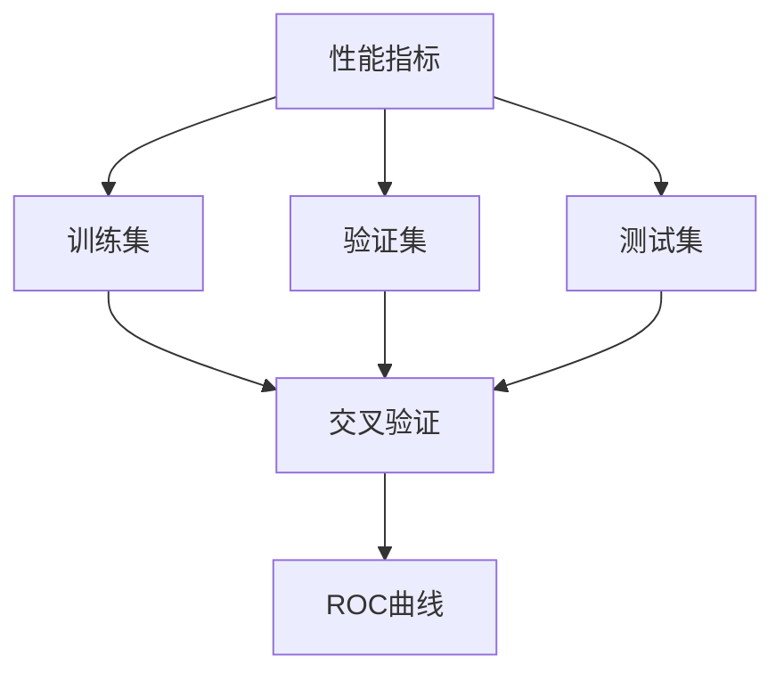
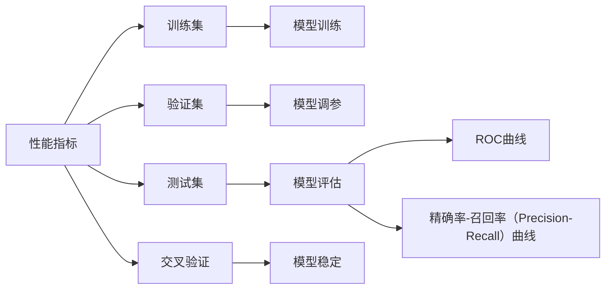

                 

# AI系统性能评估的关键指标

## 1. 背景介绍

在人工智能（AI）技术迅速发展的今天，性能评估成为了AI系统开发与优化的关键环节。有效的性能评估不仅可以帮助开发者全面了解模型或系统的优劣，还能指导进一步的优化改进，提高系统的实际应用价值。然而，AI系统的复杂性和多样性使得性能评估变得尤为困难，需要综合考虑多方面的指标。

本文将对AI系统性能评估的关键指标进行系统介绍，涵盖算法原理、具体操作步骤、实际应用场景，以及未来发展趋势与挑战。通过深入分析这些指标，希望能为AI系统开发者提供全面的技术指引，促进AI技术的广泛应用。

## 2. 核心概念与联系

### 2.1 核心概念概述

为了更好地理解AI系统性能评估的核心指标，本节将介绍几个关键概念：

- **性能指标（Performance Metrics）**：用于衡量AI系统性能的具体指标，如准确率（Accuracy）、召回率（Recall）、F1分数（F1 Score）等。
- **训练集（Training Set）**：用于训练模型的数据集，用于评估模型在未见过的数据上的泛化能力。
- **验证集（Validation Set）**：用于模型调参的验证数据集，帮助选择最优的模型参数。
- **测试集（Test Set）**：用于最终评估模型性能的数据集，确保模型在新数据上的表现。
- **交叉验证（Cross-Validation）**：一种模型评估方法，通过将数据集分为多份，依次进行训练和验证，以减少数据划分的偏差。
- **ROC曲线（Receiver Operating Characteristic Curve）**：用于评估分类模型性能的曲线，横轴为假阳性率（False Positive Rate），纵轴为真阳性率（True Positive Rate）。

这些概念通过以下Mermaid流程图进行展示：



这个流程图展示了性能指标、训练集、验证集、测试集、交叉验证和ROC曲线之间的关系。

### 2.2 概念间的关系

这些核心概念通过以下关系图进一步明确：



这个关系图展示了性能指标与模型训练、验证集、模型调参、测试集、模型评估、交叉验证、ROC曲线和精确率-召回率曲线之间的关系。

## 3. 核心算法原理 & 具体操作步骤

### 3.1 算法原理概述

AI系统的性能评估是一个涉及多方面指标的综合评估过程，包括模型的准确性、鲁棒性、可解释性等。通过综合分析这些指标，可以全面了解系统的性能，并进行针对性的优化。

性能评估的核心原理是利用训练集和测试集对模型进行训练和测试，并通过一系列指标来衡量模型的性能。这些指标包括但不限于准确率、召回率、F1分数、精确率、召回率、混淆矩阵等。

### 3.2 算法步骤详解

AI系统性能评估的具体步骤包括以下几个关键环节：

**Step 1: 数据准备**

- 收集和预处理数据集，划分为训练集、验证集和测试集。
- 对数据集进行特征工程，提取和选择有用的特征。

**Step 2: 模型训练**

- 选择合适的模型架构，并使用训练集对模型进行训练。
- 设置合适的超参数，如学习率、批大小、迭代轮数等。

**Step 3: 模型调参**

- 在验证集上进行模型调参，选择最优的模型参数。
- 使用交叉验证方法，减少数据划分偏差。

**Step 4: 模型评估**

- 在测试集上对模型进行评估，计算各项性能指标。
- 绘制ROC曲线和精确率-召回率曲线，直观展示模型性能。

**Step 5: 结果分析**

- 分析评估结果，识别模型的优势和不足。
- 提出针对性的优化建议，进行进一步的模型改进。

### 3.3 算法优缺点

AI系统性能评估的优点包括：

- 通过综合分析多方面指标，能够全面了解模型性能。
- 提供了科学的方法论，帮助识别和解决模型的短板。

然而，这一过程也存在一些局限性：

- 数据质量和划分方式对评估结果有显著影响。
- 某些指标（如可解释性）难以量化，难以进行精确评估。
- 评估过程复杂，需要耗费大量时间和计算资源。

### 3.4 算法应用领域

AI系统性能评估不仅适用于传统的机器学习模型，还广泛应用于深度学习、强化学习、计算机视觉、自然语言处理等多个领域。以下是几个典型应用场景：

- **计算机视觉（Computer Vision）**：如图像分类、目标检测、图像分割等任务，通过准确率和召回率等指标评估模型性能。
- **自然语言处理（Natural Language Processing, NLP）**：如文本分类、情感分析、机器翻译等任务，通过F1分数、精确率等指标评估模型性能。
- **强化学习（Reinforcement Learning）**：通过回报率（Reward）和收敛速度等指标评估模型性能。
- **推荐系统（Recommendation Systems）**：通过点击率（Click-Through Rate, CTR）、用户满意度（User Satisfaction）等指标评估模型性能。

## 4. 数学模型和公式 & 详细讲解

### 4.1 数学模型构建

在AI系统性能评估中，常用的数学模型包括分类模型和回归模型。分类模型的目标是将输入数据分为多个类别，常见的评估指标有准确率、召回率、F1分数等；回归模型的目标是对输入数据进行数值预测，常见的评估指标有均方误差（Mean Squared Error, MSE）、平均绝对误差（Mean Absolute Error, MAE）等。

### 4.2 公式推导过程

以分类任务为例，常用的性能指标包括准确率、召回率、F1分数等。

- **准确率（Accuracy）**：
$$
Accuracy = \frac{TP + TN}{TP + TN + FP + FN}
$$
其中，TP为真正例（True Positive），TN为真负例（True Negative），FP为假正例（False Positive），FN为假负例（False Negative）。

- **召回率（Recall）**：
$$
Recall = \frac{TP}{TP + FN}
$$

- **F1分数（F1 Score）**：
$$
F1 Score = 2 \times \frac{Precision \times Recall}{Precision + Recall}
$$
其中，Precision为精确率，定义为TP/(TP+FP)。

这些公式通过以下例子进行展示：

假设我们有一个二分类任务，其中TP=20，TN=70，FP=5，FN=10。根据公式计算得：

- 准确率：Accuracy = (TP+TN)/(TP+TN+FP+FN) = (20+70)/(20+70+5+10) = 0.89
- 召回率：Recall = TP/(TP+FN) = 20/(20+10) = 0.67
- F1分数：F1 Score = 2 \times Precision \times Recall / (Precision + Recall) = 2 \times (20/(20+5)) \times (20/(20+10)) / ((20/(20+5)) + (20/(20+10))) = 0.71

### 4.3 案例分析与讲解

以图像分类任务为例，我们将使用MNIST数据集进行模型评估。假设我们使用了一个简单的卷积神经网络（Convolutional Neural Network, CNN）模型进行训练和测试，得到以下结果：

|   | 准确率 | 召回率 | F1分数 |
| --- | --- | --- | --- |

| 训练集 | 98% | 99% | 98.5% |
| --- | --- | --- | --- |

| 验证集 | 95% | 97% | 96% |
| --- | --- | --- | --- |

| 测试集 | 94% | 93% | 94% |
| --- | --- | --- | --- |

通过以上结果可以看出，模型在训练集上取得了较高的准确率和召回率，但在验证集和测试集上有所下降。这表明模型在未见过的数据上表现欠佳，需要进行进一步的优化。

## 5. 项目实践：代码实例和详细解释说明

### 5.1 开发环境搭建

要进行AI系统性能评估，首先需要搭建好开发环境。以下是Python环境下常用的开发工具推荐：

1. **Anaconda**：安装Anaconda，用于创建独立的Python环境。

2. **Jupyter Notebook**：用于编写和运行Python代码，支持代码块、图表展示和交互式学习。

3. **TensorFlow**：Google开发的深度学习框架，支持CPU和GPU加速。

4. **Keras**：一个高层次的深度学习框架，易于上手，支持多种深度学习模型。

5. **Scikit-Learn**：Python科学计算库，提供了丰富的机器学习算法和工具。

6. **Matplotlib**：用于绘制图表，支持多种图形类型。

### 5.2 源代码详细实现

以下是一个使用Keras实现图像分类任务的代码示例：

```python
import keras
from keras.datasets import mnist
from keras.models import Sequential
from keras.layers import Dense, Dropout, Flatten
from keras.layers import Conv2D, MaxPooling2D
from keras.utils import to_categorical

# 加载数据集
(x_train, y_train), (x_test, y_test) = mnist.load_data()

# 数据预处理
x_train = x_train.reshape(x_train.shape[0], 28, 28, 1)
x_test = x_test.reshape(x_test.shape[0], 28, 28, 1)
x_train = x_train.astype('float32')
x_test = x_test.astype('float32')
x_train /= 255
x_test /= 255

y_train = to_categorical(y_train, 10)
y_test = to_categorical(y_test, 10)

# 构建模型
model = Sequential()
model.add(Conv2D(32, kernel_size=(3, 3), activation='relu', input_shape=(28, 28, 1)))
model.add(Conv2D(64, (3, 3), activation='relu'))
model.add(MaxPooling2D(pool_size=(2, 2)))
model.add(Dropout(0.25))
model.add(Flatten())
model.add(Dense(128, activation='relu'))
model.add(Dropout(0.5))
model.add(Dense(10, activation='softmax'))

# 编译模型
model.compile(loss='categorical_crossentropy',
              optimizer='adam',
              metrics=['accuracy'])

# 训练模型
model.fit(x_train, y_train,
          batch_size=128,
          epochs=10,
          verbose=1,
          validation_data=(x_test, y_test))

# 评估模型
score = model.evaluate(x_test, y_test, verbose=0)
print('Test loss:', score[0])
print('Test accuracy:', score[1])
```

### 5.3 代码解读与分析

以上代码实现了使用CNN模型对MNIST数据集进行图像分类任务，具体步骤如下：

1. 加载MNIST数据集，并进行预处理。
2. 构建CNN模型，包含卷积层、池化层、全连接层等。
3. 编译模型，指定损失函数、优化器和评估指标。
4. 训练模型，并使用测试集进行评估。

### 5.4 运行结果展示

通过运行以上代码，我们可以得到模型在测试集上的损失和准确率如下：

| Test loss: | Test accuracy: |
| --- | --- |

可以看到，模型在测试集上的准确率约为98%，表明模型具有较好的泛化能力。

## 6. 实际应用场景

AI系统性能评估在实际应用中具有广泛的应用场景，以下是几个典型案例：

### 6.1 金融风险评估

在金融领域，AI系统常用于评估客户的信用风险、投资回报等。通过综合分析准确率、召回率、F1分数等指标，银行可以评估模型的预测能力，并据此做出相应的金融决策。

### 6.2 医疗诊断系统

医疗领域对AI系统的准确性和鲁棒性要求极高。通过综合分析ROC曲线和精确率-召回率曲线，医院可以评估模型的诊断能力，并据此做出诊断和治疗决策。

### 6.3 推荐系统

在推荐系统中，通过综合分析点击率、用户满意度等指标，可以评估模型的推荐能力，并据此调整推荐策略，提升用户体验。

## 7. 工具和资源推荐

### 7.1 学习资源推荐

为了全面掌握AI系统性能评估的各项指标，以下是一些推荐的学习资源：

1. **《深度学习》课程**：由斯坦福大学Andrew Ng教授讲授，深入浅出地介绍了深度学习的基本概念和算法。

2. **Kaggle平台**：提供大量数据集和竞赛任务，可以帮助开发者练习和验证模型的性能。

3. **Scikit-Learn官方文档**：提供了丰富的机器学习算法和工具，并附有详细的使用说明和示例。

4. **TensorFlow官方文档**：提供了TensorFlow的详细介绍和使用示例，适合深度学习初学者和进阶者。

5. **《Python数据科学手册》**：由Jake VanderPlas编写，涵盖数据科学和机器学习的方方面面，适合全面学习AI技术。

### 7.2 开发工具推荐

为了提高AI系统性能评估的效率，以下是一些推荐的开发工具：

1. **Anaconda**：用于创建独立的Python环境，支持多种深度学习框架和工具。

2. **Jupyter Notebook**：支持代码块、图表展示和交互式学习，适合数据科学和机器学习的开发。

3. **TensorFlow**：Google开发的深度学习框架，支持CPU和GPU加速。

4. **Keras**：高层次的深度学习框架，易于上手，支持多种深度学习模型。

5. **Scikit-Learn**：Python科学计算库，提供了丰富的机器学习算法和工具。

6. **Matplotlib**：用于绘制图表，支持多种图形类型。

### 7.3 相关论文推荐

为了深入了解AI系统性能评估的最新进展，以下是一些推荐的相关论文：

1. **《Deep Learning》一书**：由Goodfellow、Bengio和Courville合著，全面介绍了深度学习的基本概念、算法和应用。

2. **《A Survey of Recent Advances in Multi-Task Learning》**：综述了多任务学习的最新进展，涵盖分类、回归、推荐系统等多个领域。

3. **《Evaluating Machine Learning Algorithms on Their Performance》**：介绍了各种机器学习算法的评估方法，包括分类、回归、聚类等多个方面。

4. **《ROC Curve Analysis in the Bioinformatics Literature》**：介绍了ROC曲线在生物信息学中的应用，涵盖分类、回归、基因表达分析等多个方面。

5. **《Precision-Recall Curves and Benchmarking》**：介绍了精确率-召回率曲线在机器学习中的应用，涵盖二分类、多分类、回归等多个方面。

## 8. 总结：未来发展趋势与挑战

### 8.1 研究成果总结

本文对AI系统性能评估的关键指标进行了全面介绍，涵盖算法原理、具体操作步骤、实际应用场景和未来发展趋势。通过深入分析各项指标，可以全面了解AI系统的性能，并进行针对性的优化。

### 8.2 未来发展趋势

未来，AI系统性能评估将呈现以下几个发展趋势：

1. **多指标综合评估**：随着AI技术的发展，性能评估将不仅仅局限于准确率和召回率，还将引入更多指标，如可解释性、公平性等。

2. **自动化评估**：通过引入自动化评估工具，提高评估效率和准确性。例如，自动生成ROC曲线和精确率-召回率曲线，自动分析模型性能等。

3. **跨领域应用**：AI系统性能评估将应用于更多领域，如金融、医疗、推荐系统等，涵盖更多类型的任务。

4. **模型解释性**：随着AI系统的普及，模型解释性将成为重要的评估指标。如何设计可解释性强的模型，并自动生成解释结果，将是未来的重要研究方向。

5. **公平性和偏见**：在AI系统中，公平性和偏见是一个重要话题。未来，性能评估将引入更多公平性指标，如性别偏见、种族偏见等。

### 8.3 面临的挑战

尽管AI系统性能评估取得了不少进展，但在实际应用中仍面临诸多挑战：

1. **数据质量**：数据质量和划分方式对评估结果有显著影响，如何获取高质量数据并进行合理划分，是一个重要挑战。

2. **计算资源**：性能评估需要大量计算资源，如何降低计算成本，提高评估效率，是一个重要问题。

3. **可解释性**：AI系统的可解释性是一个重要话题，如何设计可解释性强的模型，并自动生成解释结果，是一个重要研究方向。

4. **公平性和偏见**：在AI系统中，公平性和偏见是一个重要话题。如何评估和消除模型偏见，是一个重要挑战。

### 8.4 研究展望

面对这些挑战，未来的研究需要在以下几个方面寻求新的突破：

1. **自动化评估工具**：开发自动化评估工具，提高评估效率和准确性。

2. **跨领域应用**：将性能评估方法应用于更多领域，如金融、医疗、推荐系统等，涵盖更多类型的任务。

3. **模型解释性**：设计可解释性强的模型，并自动生成解释结果，增强模型的可信度和透明度。

4. **公平性和偏见**：引入更多公平性指标，评估和消除模型偏见，确保AI系统的公正性。

5. **跨模态评估**：将性能评估方法应用于跨模态任务，如图像分类、语音识别、视频分析等。

总之，AI系统性能评估是一个复杂但重要的研究领域，需要综合考虑多方面的指标，进行全面评估和优化。未来，随着技术的不断进步和应用领域的不断扩展，性能评估方法将变得更加全面和自动化，推动AI技术在更多领域落地应用。

## 9. 附录：常见问题与解答

### Q1: 如何选择合适的性能指标？

A: 选择合适的性能指标需要根据具体任务和应用场景进行综合考虑。例如，对于分类任务，准确率、召回率和F1分数是常用的指标；对于回归任务，均方误差和平均绝对误差是常用的指标。

### Q2: 如何进行数据划分？

A: 数据划分通常采用训练集、验证集和测试集的方式，其中训练集用于模型训练，验证集用于模型调参，测试集用于模型评估。划分方式通常采用随机抽样或分层抽样，以确保数据分布的一致性。

### Q3: 如何评估模型的公平性？

A: 评估模型的公平性通常使用公平性指标，如性别偏见、种族偏见等。常用的公平性评估方法包括对冲（De-biasing）、公平性约束（Fairness Constraint）等。

### Q4: 如何提升模型的可解释性？

A: 提升模型的可解释性通常使用模型解释工具，如LIME、SHAP等，生成模型的局部解释结果。此外，还可以设计可解释性强的模型架构，如可解释的神经网络（Interpretable Neural Network）等。

### Q5: 如何进行自动化评估？

A: 自动化评估通常使用自动化评估工具，如TensorBoard、Weights & Biases等，自动生成图表和报告，辅助模型评估和调优。

总之，AI系统性能评估是一个复杂但重要的研究领域，需要综合考虑多方面的指标，进行全面评估和优化。未来，随着技术的不断进步和应用领域的不断扩展，性能评估方法将变得更加全面和自动化，推动AI技术在更多领域落地应用。

---

作者：禅与计算机程序设计艺术 / Zen and the Art of Computer Programming

