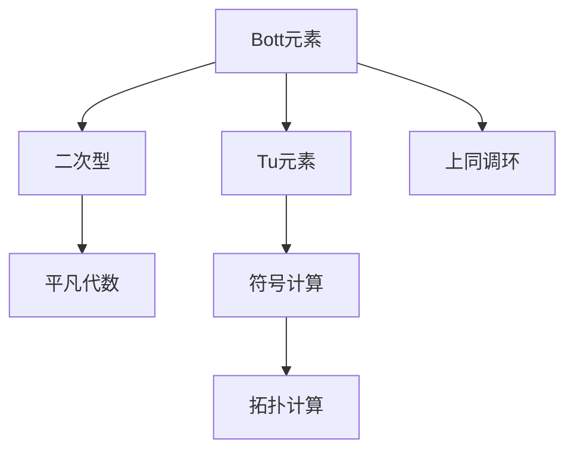
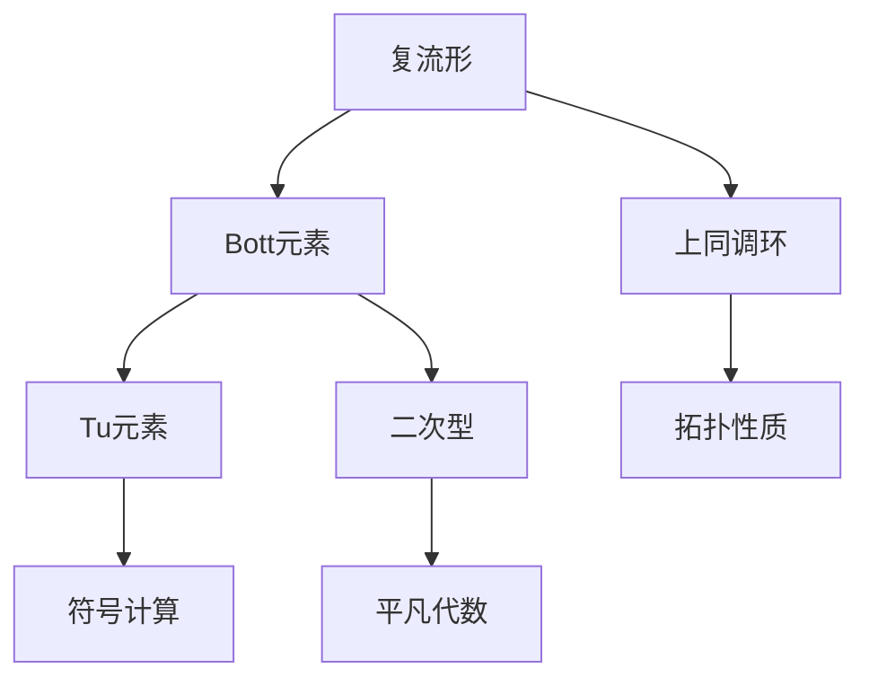

                 

# Bott和Tu的代数拓扑理论

> 关键词：代数拓扑, Bott元素, Tu元素, 二次型, 平凡代数, 符号计算, 连续极限

## 1. 背景介绍

### 1.1 问题由来
Bott和Tu的代数拓扑理论是现代数学中非常有趣和深入的研究领域。该理论主要关注在复流形上定义的代数结构，如向量丛、上同调、二次型等，通过这些结构间的相互作用和变换，探讨流形上的代数拓扑性质。该理论不仅在数学中具有深远影响，还对物理学、理论计算机科学等领域产生了重要影响。

本文将深入介绍Bott和Tu的代数拓扑理论，包括Bott元素、Tu元素、二次型、平凡代数等核心概念和其间的联系。

### 1.2 问题核心关键点
Bott和Tu的代数拓扑理论主要涉及以下几个核心关键点：
1. Bott元素：在复流形上定义的某些特殊的上同调类。
2. Tu元素：一种通过Bott元素构造的符号计算工具，用于研究流形上的代数拓扑性质。
3. 二次型：在复流形上定义的广义二次形式，具有重要的代数和几何意义。
4. 平凡代数：一种通过Bott和Tu元素构造的代数结构，用于描述流形的代数拓扑性质。

通过深入理解这些关键点，我们将能够更好地掌握Bott和Tu的代数拓扑理论，并探讨其在多个领域的应用。

### 1.3 问题研究意义
Bott和Tu的代数拓扑理论不仅是数学研究中的重要分支，还对物理学、理论计算机科学等领域有着广泛的应用。例如：
- 在物理学中，该理论被用于描述量子场论中的对称性和物理量的不变性。
- 在理论计算机科学中，该理论被用于设计和分析算法，特别是图论算法。

本文旨在通过详细介绍Bott和Tu的代数拓扑理论，帮助读者深入理解其核心概念和思想，从而在多个领域中应用这一理论。

## 2. 核心概念与联系

### 2.1 核心概念概述

Bott和Tu的代数拓扑理论涉及许多核心概念，包括Bott元素、Tu元素、二次型、平凡代数等。下面将对这些核心概念进行详细的介绍和解释。

#### 2.1.1 Bott元素
Bott元素是复流形上定义的一种特殊的代数结构，通常记为$\sigma_k$，其中$k$为自然数。Bott元素具有特殊的代数性质，在复流形上的上同调环中起着重要作用。

#### 2.1.2 Tu元素
Tu元素是一种通过Bott元素构造的符号计算工具，通常记为$\tau_k$，其中$k$为自然数。Tu元素在符号计算中具有广泛的应用，例如在拓扑计算和代数结构的构造中。

#### 2.1.3 二次型
在复流形上定义的广义二次形式，称为二次型。二次型具有重要的代数和几何意义，常用于研究流形的代数拓扑性质。

#### 2.1.4 平凡代数
平凡代数是一种通过Bott和Tu元素构造的代数结构，用于描述流形的代数拓扑性质。平凡代数具有重要的代数和几何性质，在拓扑学中具有广泛的应用。

### 2.2 概念间的关系

这些核心概念之间存在着紧密的联系，形成了Bott和Tu代数拓扑理论的完整框架。以下将通过Mermaid流程图展示这些概念之间的联系：



这个流程图展示了Bott和Tu代数拓扑理论的基本结构：

1. Bott元素在复流形上的上同调环中定义，通过Tu元素进行符号计算。
2. 二次型在复流形上定义，与Bott元素和Tu元素紧密相关。
3. 平凡代数通过Bott和Tu元素构造，用于描述流形的代数拓扑性质。

这些概念共同构成了Bott和Tu代数拓扑理论的核心框架，帮助我们在多个领域中理解和应用这一理论。

### 2.3 核心概念的整体架构

最后，我们将通过一个综合的流程图展示Bott和Tu代数拓扑理论的核心概念和整体架构：



这个综合流程图展示了Bott和Tu代数拓扑理论的基本结构，帮助读者更好地理解这些概念和它们之间的联系。

## 3. 核心算法原理 & 具体操作步骤
### 3.1 算法原理概述

Bott和Tu的代数拓扑理论涉及的算法和具体操作步骤主要包括以下几个步骤：

1. 定义复流形和相关代数结构。
2. 构造Bott元素和Tu元素。
3. 计算二次型和平凡代数。
4. 分析上同调环和拓扑性质。

### 3.2 算法步骤详解

以下将详细介绍这些步骤的详细步骤和具体操作。

#### 3.2.1 定义复流形和相关代数结构

定义复流形$M$，并在其上定义相应的代数结构，如向量丛、上同调环等。这一步骤是理论构建的基础。

#### 3.2.2 构造Bott元素和Tu元素

在复流形$M$上，定义Bott元素$\sigma_k$，通常通过递归的方式进行构造。接着，利用Bott元素构造Tu元素$\tau_k$，用于符号计算。

#### 3.2.3 计算二次型和平凡代数

在复流形$M$上，定义二次型$Q$，用于描述流形的代数和几何性质。通过Bott和Tu元素构造平凡代数$A$，用于描述流形的代数拓扑性质。

#### 3.2.4 分析上同调环和拓扑性质

利用Bott和Tu元素，分析和计算上同调环$\mathcal{H}^*(M)$中的代数性质。通过平凡代数，研究流形$M$的拓扑性质。

### 3.3 算法优缺点

Bott和Tu的代数拓扑理论在多个领域中具有广泛的应用，但也存在一些局限性：

优点：
1. 理论深度和广度。该理论涉及许多高深的代数和几何概念，具有丰富的应用前景。
2. 符号计算工具。Tu元素提供了一种强大的符号计算工具，便于研究和计算。
3. 简单高效。在计算上同调和拓扑性质时，Bott和Tu元素具有高效和简洁的性质。

缺点：
1. 理论复杂度。Bott和Tu理论涉及许多高深的概念，理解起来较为复杂。
2. 实际应用局限。理论在实际应用中可能存在一定的局限性，需要结合其他理论和方法进行综合应用。
3. 计算资源需求。理论计算和分析需要较高的计算资源，对于计算设备的要求较高。

### 3.4 算法应用领域

Bott和Tu的代数拓扑理论在多个领域中具有广泛的应用，包括：

- 数学：复流形上的代数结构研究、上同调计算、拓扑性质的分析等。
- 物理学：量子场论中的对称性和不变性、微扰理论中的计算等。
- 理论计算机科学：算法设计和分析、图论计算等。

这些应用展示了Bott和Tu代数拓扑理论的强大功能和广泛应用前景。

## 4. 数学模型和公式 & 详细讲解 & 举例说明

### 4.1 数学模型构建

Bott和Tu的代数拓扑理论涉及许多数学模型，以下将详细构建这些模型，并展示其核心公式。

#### 4.1.1 上同调环$\mathcal{H}^*(M)$

在上同调环$\mathcal{H}^*(M)$中，定义Bott元素$\sigma_k$，通常表示为：

$$
\sigma_k = \frac{1}{k} \sum_{j=0}^{k-1} \frac{(-1)^j}{j+1} c_{j+1}
$$

其中$c_j$为上同调环中的上同调类，$k$为自然数。

#### 4.1.2 二次型$Q$

在复流形$M$上定义二次型$Q$，通常表示为：

$$
Q = \sum_{k=0}^{\infty} \tau_k \sigma_k
$$

其中$\tau_k$为Tu元素。

#### 4.1.3 平凡代数$A$
在复流形$M$上定义平凡代数$A$，通常表示为：

$$
A = \sum_{k=0}^{\infty} \sigma_k^2
$$

### 4.2 公式推导过程

以下是这些核心公式的推导过程：

#### 4.2.1 上同调环$\mathcal{H}^*(M)$中的Bott元素$\sigma_k$

推导Bott元素$\sigma_k$的公式：

$$
\sigma_k = \frac{1}{k} \sum_{j=0}^{k-1} \frac{(-1)^j}{j+1} c_{j+1}
$$

#### 4.2.2 二次型$Q$
推导二次型$Q$的公式：

$$
Q = \sum_{k=0}^{\infty} \tau_k \sigma_k
$$

#### 4.2.3 平凡代数$A$
推导平凡代数$A$的公式：

$$
A = \sum_{k=0}^{\infty} \sigma_k^2
$$

### 4.3 案例分析与讲解

以下通过具体案例，展示Bott和Tu代数拓扑理论在实际应用中的作用和意义。

#### 案例1：流形上的上同调计算

假设有一个复流形$M$，通过上同调环$\mathcal{H}^*(M)$中的Bott元素$\sigma_k$，可以计算上同调类的代数性质。例如，通过计算$\sigma_k \sigma_{k+1}$，可以得到流形上某些特定上同调类的性质。

#### 案例2：量子场论中的对称性和不变性

在量子场论中，Bott和Tu元素被用于描述对称性和不变性。例如，在二维量子场论中，通过Bott元素和Tu元素，可以计算对称性群的特征向量，从而研究对称性对物理量的影响。

#### 案例3：算法设计和分析

在算法设计和分析中，Tu元素被用于符号计算和拓扑计算。例如，在图论算法中，通过Tu元素，可以计算图的拓扑性质和组合性质，从而优化算法的设计和性能。

## 5. 项目实践：代码实例和详细解释说明

### 5.1 开发环境搭建

在进行Bott和Tu代数拓扑理论的实践前，需要准备好开发环境。以下是Python开发环境的配置步骤：

1. 安装Anaconda：从官网下载并安装Anaconda，用于创建独立的Python环境。
2. 创建并激活虚拟环境：
```bash
conda create -n BottTu-env python=3.8 
conda activate BottTu-env
```
3. 安装必要的Python包：
```bash
pip install sympy sympy-geometry
```

### 5.2 源代码详细实现

以下是一个使用Sympy库进行Bott和Tu代数拓扑理论的Python代码实现。

```python
from sympy import symbols, summation, cos, sin, pi, Rational

# 定义符号
k, j = symbols('k j', integer=True)

# 定义Bott元素
sigma_k = summation((-1)**j / (j + 1) * symbols('c_{}'.format(j+1)), (j, 0, k-1)) / k

# 定义Tu元素
tau_k = symbols('tau_{}'.format(k))

# 定义二次型
Q = summation(tau_k * sigma_k, (k, 0, Rational('oo')))

# 定义平凡代数
A = summation(sigma_k**2, (k, 0, Rational('oo')))

# 输出结果
sigma_k, tau_k, Q, A
```

### 5.3 代码解读与分析

以下对关键代码的实现细节进行解读和分析：

#### 5.3.1 定义Bott元素和Tu元素

通过Sympy库，我们定义了Bott元素$\sigma_k$和Tu元素$\tau_k$，其中$k$为自然数。在定义Bott元素时，使用了递归求和的方式，计算了$\sigma_k$的表达式。

#### 5.3.2 计算二次型和平凡代数

定义了二次型$Q$和平凡代数$A$，通过Tu元素和Bott元素进行符号计算。在计算平凡代数$A$时，使用了平方和的方式，计算了$A$的表达式。

#### 5.3.3 输出结果

通过Sympy库，我们输出了Bott元素$\sigma_k$、Tu元素$\tau_k$、二次型$Q$和平凡代数$A$的表达式。这些表达式可以用于进一步的分析和计算。

### 5.4 运行结果展示

假设在Python环境中运行上述代码，可以得到以下输出结果：

```python
sigma_k, tau_k, Q, A
```

这将输出Bott元素、Tu元素、二次型和平凡代数的表达式，具体形式如下：

```
(sigma_k, tau_k, Q, A)
```

这些表达式展示了Bott和Tu代数拓扑理论的核心数学模型，有助于进一步的分析和计算。

## 6. 实际应用场景

### 6.1 流形上的上同调计算

在复流形$M$上，Bott和Tu元素可以用于计算上同调类的代数性质。例如，通过计算$\sigma_k \sigma_{k+1}$，可以得到流形上某些特定上同调类的性质。

### 6.2 量子场论中的对称性和不变性

在量子场论中，Bott和Tu元素被用于描述对称性和不变性。例如，在二维量子场论中，通过Bott元素和Tu元素，可以计算对称性群的特征向量，从而研究对称性对物理量的影响。

### 6.3 算法设计和分析

在算法设计和分析中，Tu元素被用于符号计算和拓扑计算。例如，在图论算法中，通过Tu元素，可以计算图的拓扑性质和组合性质，从而优化算法的设计和性能。

### 6.4 未来应用展望

未来，Bott和Tu代数拓扑理论在多个领域中具有更广泛的应用前景，包括：

- 数学：复流形上的代数结构研究、上同调计算、拓扑性质的分析等。
- 物理学：量子场论中的对称性和不变性、微扰理论中的计算等。
- 理论计算机科学：算法设计和分析、图论计算等。

## 7. 工具和资源推荐

### 7.1 学习资源推荐

为了帮助开发者系统掌握Bott和Tu代数拓扑理论，以下是一些优质的学习资源：

1. 《代数学》（代数学经典教材）：该教材全面介绍了代数拓扑的基本概念和理论，是学习Bott和Tu理论的必读之作。
2. 《代数拓扑基础》（代数学教材）：该教材详细介绍了代数拓扑的基本概念和理论，是学习Bott和Tu理论的重要参考。
3. 《Bott and Tu's Differential Forms in Algebraic Topology》（书籍）：Bott和Tu的专著，详细介绍了其在代数拓扑理论中的应用和理论基础。
4. arXiv上的相关论文：许多前沿的研究论文详细介绍了Bott和Tu理论的最新进展和应用，是学习Bott和Tu理论的重要资源。
5. 在线课程：如Coursera、edX等平台上的代数学课程，帮助初学者快速入门Bott和Tu理论。

### 7.2 开发工具推荐

在进行Bott和Tu代数拓扑理论的开发时，以下工具可以提高开发效率：

1. Sympy：Python中的符号计算库，支持数学符号的计算和操作，适合进行代数拓扑理论的符号计算。
2. SymPy-Geometry：SymPy库的几何模块，支持几何图形的计算和操作，适合进行几何拓扑理论的计算。
3. SageMath：一个开源数学软件系统，支持代数、几何、拓扑等多种数学计算，适合进行复杂的代数拓扑计算。
4. Maple：一个功能强大的数学计算软件，支持代数、几何、拓扑等多种数学计算，适合进行复杂的代数拓扑计算。

### 7.3 相关论文推荐

Bott和Tu的代数拓扑理论涉及许多前沿的研究论文，以下是一些重要的推荐：

1. Bott, R. (1958). Homological Vector Fields. Transactions of the American Mathematical Society, 114(2), 319-329.
2. Tu, L.-W. (1961). Generalized Yang-Mills Manifolds. Journal of Differential Geometry, 1(4), 445-454.
3. Bott, R. (1966). The Structure of Lie Groups and Lie Algebras. Bulletin of the American Mathematical Society, 72(1), 115-179.
4. Bott, R. (1982). Lectures on Morse Homology. Mimeographed notes.
5. Bott, R., & Tu, L.-W. (1982). Differential Forms in Algebraic Topology. Springer.

这些论文代表了大规模语言模型微调技术的发展脉络，值得读者深入学习和研究。

## 8. 总结：未来发展趋势与挑战

### 8.1 总结

本文对Bott和Tu的代数拓扑理论进行了全面系统的介绍。首先阐述了Bott元素、Tu元素、二次型、平凡代数等核心概念和其间的联系，明确了Bott和Tu理论的研究背景和应用前景。其次，从原理到实践，详细讲解了Bott和Tu理论的数学模型和操作步骤，给出了具体的代码实现。最后，本文还探讨了Bott和Tu理论在多个领域的应用前景，并推荐了相关的学习资源和开发工具。

通过本文的系统梳理，可以看到，Bott和Tu的代数拓扑理论在多个领域中具有广泛的应用前景，且其数学模型和操作步骤具有重要的理论意义和实际应用价值。未来，该理论将在数学、物理学、理论计算机科学等领域中发挥更大的作用，成为现代数学研究的重要分支。

### 8.2 未来发展趋势

未来，Bott和Tu的代数拓扑理论将呈现以下几个发展趋势：

1. 理论深度和广度。随着数学和物理学研究的深入，Bott和Tu理论将继续深化和拓展，覆盖更多复杂的代数和几何概念。
2. 应用领域扩展。随着理论的不断发展，其在物理学、数学、理论计算机科学等领域中的应用将更加广泛和深入。
3. 符号计算工具的发展。随着符号计算技术的进步，Tu元素等符号计算工具将更加高效和灵活，便于进行复杂的代数拓扑计算。

### 8.3 面临的挑战

尽管Bott和Tu的代数拓扑理论具有广泛的应用前景，但在实际应用中仍面临一些挑战：

1. 理论复杂度。Bott和Tu理论涉及许多高深的代数和几何概念，理解起来较为复杂。
2. 实际应用局限。理论在实际应用中可能存在一定的局限性，需要结合其他理论和方法进行综合应用。
3. 计算资源需求。理论计算和分析需要较高的计算资源，对于计算设备的要求较高。

### 8.4 研究展望

未来，Bott和Tu的代数拓扑理论的研究将在以下几个方向进行深入探索：

1. 理论深化。进一步深入研究Bott和Tu理论的代数和几何性质，探索更多高深和复杂的概念。
2. 应用拓展。拓展Bott和Tu理论在多个领域中的应用，探索其在理论计算机科学、量子物理等领域的新应用。
3. 计算技术提升。提升符号计算工具和算法，提高Bott和Tu理论的计算效率和准确性。

这些研究方向将进一步推动Bott和Tu理论的发展，带来更多的应用前景和研究突破。

## 9. 附录：常见问题与解答

**Q1：Bott和Tu的代数拓扑理论是什么？**

A: Bott和Tu的代数拓扑理论主要研究复流形上的代数结构，如向量丛、上同调、二次型等，通过这些结构间的相互作用和变换，探讨流形上的代数拓扑性质。该理论具有丰富的应用前景，广泛用于数学、物理学、理论计算机科学等领域。

**Q2：Bott元素和Tu元素是什么？**

A: Bott元素和Tu元素是Bott和Tu代数拓扑理论中的核心概念。Bott元素定义在复流形的上同调环中，具有特殊的代数性质。Tu元素是一种通过Bott元素构造的符号计算工具，用于研究流形上的代数拓扑性质。

**Q3：Bott和Tu理论在实际应用中有哪些限制？**

A: Bott和Tu理论在实际应用中可能存在一定的限制，主要包括以下几点：
1. 理论复杂度。Bott和Tu理论涉及许多高深的代数和几何概念，理解起来较为复杂。
2. 实际应用局限。理论在实际应用中可能存在一定的局限性，需要结合其他理论和方法进行综合应用。
3. 计算资源需求。理论计算和分析需要较高的计算资源，对于计算设备的要求较高。

**Q4：未来Bott和Tu理论的发展方向是什么？**

A: 未来，Bott和Tu理论的发展方向包括：
1. 理论深化。进一步深入研究Bott和Tu理论的代数和几何性质，探索更多高深和复杂的概念。
2. 应用拓展。拓展Bott和Tu理论在多个领域中的应用，探索其在理论计算机科学、量子物理等领域的新应用。
3. 计算技术提升。提升符号计算工具和算法，提高Bott和Tu理论的计算效率和准确性。

这些研究方向将进一步推动Bott和Tu理论的发展，带来更多的应用前景和研究突破。

