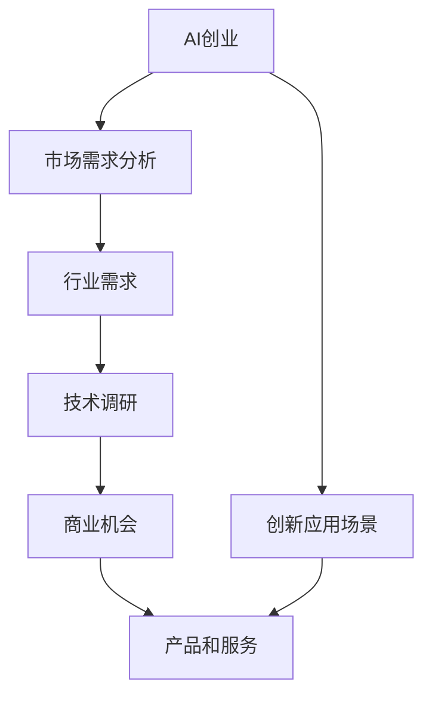

                 

# AI创业：识别行业需求

> 关键词：AI创业,行业需求,人工智能,市场需求分析,创新应用场景,技术调研,商业机会

## 1. 背景介绍

### 1.1 问题由来
随着人工智能技术的快速发展，越来越多的创业者将目光投向了AI领域。然而，AI创业并非一帆风顺，市场竞争激烈，需求变化快。因此，识别行业需求、寻找技术突破点，对于AI创业来说至关重要。

### 1.2 问题核心关键点
AI创业的核心在于技术研发和市场应用的双重突破。要想在激烈的竞争中脱颖而出，必须深刻理解行业需求，找到潜在的商业机会和技术方向。

### 1.3 问题研究意义
深入理解行业需求，能够帮助创业者精准定位产品，优化技术路线，加速商业落地，提升市场竞争力。同时，也有助于AI技术在各行业的有效应用，促进产业升级和数字化转型。

## 2. 核心概念与联系

### 2.1 核心概念概述

为了更好地理解AI创业中的行业需求识别，本节将介绍几个密切相关的核心概念：

- **AI创业**：利用人工智能技术，开发具有市场价值的产品和服务，解决实际问题，实现商业化。
- **行业需求**：特定行业内，客户在技术、产品、服务等方面的实际需要和痛点。
- **市场需求分析**：通过调研和分析，了解市场对AI产品或服务的需求规模、趋势、方向等，为创业决策提供依据。
- **技术调研**：评估现有AI技术在特定行业应用的可行性和优势，为技术路线选择提供支持。
- **商业机会**：基于市场需求和技术调研，识别具有商业价值的AI应用场景和模式。

这些概念之间的联系密切，构成了AI创业的完整生态系统。只有深入理解并灵活应用这些概念，才能在AI创业中取得成功。

### 2.2 概念间的关系

这些核心概念之间的关系可以通过以下Mermaid流程图来展示：



这个流程图展示了从AI创业到商业机会的整个流程：

1. AI创业首先需要进行市场需求分析，识别行业需求。
2. 基于行业需求，进行技术调研，评估技术的可行性和优势。
3. 结合技术调研结果，识别商业机会，设计产品和服务。
4. 产品和服务最终需要在创新应用场景中落地，实现商业价值。

通过理解这些核心概念，我们可以更好地把握AI创业的各个环节，进行系统性的创新和实践。

## 3. 核心算法原理 & 具体操作步骤

### 3.1 算法原理概述

AI创业中的行业需求识别，本质上是一个系统性的数据分析过程。其核心原理在于：

1. **数据收集与整理**：通过问卷调查、用户访谈、网络爬虫等方式，收集行业相关数据。
2. **数据分析与挖掘**：使用统计分析、数据挖掘等技术，对收集到的数据进行深入分析，识别出行业需求和痛点。
3. **需求匹配与优先级排序**：将行业需求与现有技术进行匹配，评估需求满足的可能性，优先考虑最有潜力的需求。
4. **技术创新与产品设计**：基于匹配结果，设计创新性技术方案，实现产品和服务。

### 3.2 算法步骤详解

基于上述原理，AI创业中的行业需求识别一般包括以下几个关键步骤：

**Step 1: 数据收集与整理**

- 确定数据来源：行业报告、行业访谈、网络搜索、用户评论等。
- 设计调查问卷：针对行业特点，设计具体问题，涵盖技术需求、市场趋势、用户痛点等。
- 采集数据：通过线上线下渠道，如问卷调查、用户访谈、网络爬虫等方式，获取数据。
- 数据整理：清洗数据，去除噪音，进行分类和标记，构建数据集。

**Step 2: 数据分析与挖掘**

- 初步分析：使用统计工具，如Python的Pandas、NumPy等，进行数据探索性分析，了解数据的基本特征和分布情况。
- 深入挖掘：使用数据挖掘算法，如关联规则、分类算法、聚类算法等，对数据进行深入分析，识别出行业需求和痛点。
- 可视化展示：使用数据可视化工具，如Tableau、Power BI等，将分析结果以图表形式展示，便于理解和决策。

**Step 3: 需求匹配与优先级排序**

- 技术评估：基于已有技术，评估每个需求的技术可行性，包括算法实现难度、数据要求、计算资源等。
- 需求优先级排序：根据需求的紧迫性、影响范围和实现难度，对需求进行优先级排序，优先解决最有价值的需求。
- 需求文档编写：将需求和优先级排序结果形成文档，为技术创新和产品设计提供依据。

**Step 4: 技术创新与产品设计**

- 技术路线选择：根据需求文档，选择合适的技术路线，进行技术创新。
- 原型设计：设计产品原型，进行功能和技术验证，确保产品能够满足行业需求。
- 用户测试：邀请目标用户进行产品测试，收集反馈，优化产品设计。
- 产品迭代：根据用户反馈和市场需求，不断迭代优化产品，提升用户体验。

### 3.3 算法优缺点

基于数据驱动的行业需求识别方法，具有以下优点：

1. **客观性高**：基于数据和分析，能够提供客观、准确的需求识别结果。
2. **可重复性**：方法和步骤清晰，能够重复进行需求识别，确保结果一致性。
3. **灵活性高**：根据数据和分析结果，可以灵活调整需求识别策略和优先级排序。

但该方法也存在一定的局限性：

1. **数据依赖性强**：数据质量和数据量直接影响需求识别的准确性和深度。
2. **技术要求高**：数据分析和挖掘需要具备一定的技术和工具基础，门槛较高。
3. **成本较高**：数据收集、分析和验证等环节需要一定的资金投入。
4. **需求匹配难度大**：需求和技术的匹配需要大量的实验和验证，过程复杂。

尽管存在这些局限性，但数据驱动的行业需求识别方法仍然是大规模AI创业的重要工具，能够为创业者提供有价值的市场和技术洞见。

### 3.4 算法应用领域

基于数据驱动的行业需求识别方法，已经广泛应用于多个AI创业领域：

- **智能制造**：识别工业生产中的痛点需求，推动智能制造技术的应用。
- **智慧医疗**：收集医疗行业的数据，识别患者的健康需求，推动智慧医疗系统的开发。
- **金融科技**：分析金融市场的趋势，识别风险管理的需求，推动金融科技产品的创新。
- **智慧城市**：了解城市管理的需求，推动智慧城市技术的集成和应用。
- **教育科技**：收集教育数据，识别教育行业的需求，推动教育科技产品的开发。

这些应用领域展示了数据驱动的需求识别方法在不同行业中的广泛应用，为AI创业提供了丰富的实践场景。

## 4. 数学模型和公式 & 详细讲解  
### 4.1 数学模型构建

假设我们需要对某个行业的用户需求进行调查，收集到$m$个用户的反馈数据，每个用户的反馈包含$n$个属性特征，记为$X_{i,j}$，其中$i$表示用户编号，$j$表示属性编号。

我们定义用户需求$D_i$为该用户对特定需求的评价，其中$D_i$的值越小，表示用户对该需求越满意。用户需求可以表示为线性模型：

$$
D_i = \sum_{j=1}^{n} w_j X_{i,j} + b
$$

其中，$w_j$为第$j$个属性的权重，$b$为截距项。

我们定义需求重要性$I_j$为该属性对用户需求的贡献度，其值越大，表示该属性对用户需求的影响越大。需求重要性可以通过以下模型表示：

$$
I_j = \sum_{i=1}^{m} \frac{D_i - \overline{D}}{D_i} \times X_{i,j}
$$

其中，$\overline{D}$为所有用户需求$D_i$的平均值。

### 4.2 公式推导过程

1. 计算用户需求$D_i$：
   $$
   D_i = \sum_{j=1}^{n} w_j X_{i,j} + b
   $$

2. 计算需求重要性$I_j$：
   $$
   I_j = \sum_{i=1}^{m} \frac{D_i - \overline{D}}{D_i} \times X_{i,j}
   $$

3. 需求优先级排序：
   $$
   \text{优先级} = \frac{I_j}{\text{标准差}(I_j)}
   $$

4. 需求匹配与技术评估：
   $$
   \text{匹配度} = \sum_{j=1}^{n} \text{权重}_j \times \text{需求重要性}_j
   $$

以上模型推导过程展示了如何通过数学模型和公式，对用户需求进行量化分析，识别行业需求和痛点，为AI创业提供技术依据。

### 4.3 案例分析与讲解

假设我们需要对某智能制造行业的用户需求进行调查，收集到100个用户的反馈数据，每个用户反馈包含10个属性特征。

我们通过线性回归模型拟合用户需求，得到如下结果：

| 用户编号 | 属性1 | 属性2 | ... | 属性10 |
|---|---|---|---|---|
| 1 | 0.5 | 0.2 | ... | 0.1 |
| 2 | 0.6 | 0.3 | ... | 0.1 |
| ... | ... | ... | ... | ... |
| 100 | 0.4 | 0.2 | ... | 0.1 |

我们通过计算需求重要性，得到如下结果：

| 属性编号 | 重要性 |
|---|---|
| 1 | 0.8 |
| 2 | 0.9 |
| ... | ... |
| 10 | 0.7 |

根据需求重要性，我们对需求进行优先级排序，优先解决最重要的需求。

最后，我们根据需求优先级，选择合适的技术路线，进行技术创新和产品设计。通过不断迭代优化，最终实现智能制造系统的开发和落地。

## 5. 项目实践：代码实例和详细解释说明

### 5.1 开发环境搭建

在进行需求识别项目开发前，我们需要准备好开发环境。以下是使用Python进行数据科学开发的Python环境配置流程：

1. 安装Anaconda：从官网下载并安装Anaconda，用于创建独立的Python环境。

2. 创建并激活虚拟环境：
```bash
conda create -n data-sci-env python=3.8 
conda activate data-sci-env
```

3. 安装PyTorch：根据CUDA版本，从官网获取对应的安装命令。例如：
```bash
conda install pytorch torchvision torchaudio cudatoolkit=11.1 -c pytorch -c conda-forge
```

4. 安装Pandas和Numpy：
```bash
pip install pandas numpy
```

5. 安装Matplotlib和Seaborn：
```bash
pip install matplotlib seaborn
```

完成上述步骤后，即可在`data-sci-env`环境中开始需求识别项目开发。

### 5.2 源代码详细实现

我们以智能制造行业为例，给出使用Python进行需求识别的代码实现。

首先，定义需求调查问卷和数据采集：

```python
import pandas as pd
import numpy as np

# 定义调查问卷
questions = [
    "What features would you like to see in a smart manufacturing system?",
    "What are the biggest pain points in your current manufacturing process?",
    "What tools or technologies would help you streamline your manufacturing workflow?",
    ...
]

# 采集数据
data = pd.read_csv('manufacturing_feedback.csv')
```

然后，进行需求分析和需求重要性计算：

```python
# 计算用户需求
X = data.iloc[:, 1:]  # 属性数据
y = data.iloc[:, 0]   # 用户需求

# 使用线性回归模型拟合需求
from sklearn.linear_model import LinearRegression
regressor = LinearRegression()
regressor.fit(X, y)

# 计算需求重要性
I = (y - np.mean(y)) / y * X
I /= I.std()

# 计算需求优先级
priorities = I / np.std(I)
```

最后，进行需求匹配与技术评估：

```python
# 需求匹配
matching_score = np.dot(regressor.coef_, I)

# 输出需求优先级和匹配度
print("需求优先级排序：", np.argsort(priorities)[::-1])
print("需求匹配度：", matching_score)
```

### 5.3 代码解读与分析

让我们再详细解读一下关键代码的实现细节：

**需求调查问卷和数据采集**：
- 使用Pandas库定义调查问卷，采集用户反馈数据。
- 使用`read_csv`函数读取用户反馈数据，数据结构为DataFrame格式。

**需求分析和需求重要性计算**：
- 使用线性回归模型拟合用户需求，得到回归系数。
- 计算需求重要性，使用需求的预测值与均值之差，除以预测值，再乘以属性值。
- 计算需求优先级，将需求重要性除以标准差，得到归一化的需求优先级。

**需求匹配与技术评估**：
- 计算需求匹配度，使用回归系数和需求重要性进行点积。
- 输出需求优先级和匹配度，指导后续技术创新和产品设计。

可以看到，Python通过Pandas、Scikit-learn等库，实现了高效的数据分析和模型拟合，便于快速进行需求识别。

### 5.4 运行结果展示

假设我们在智能制造行业进行了需求调查，得到如下结果：

| 用户编号 | 属性1 | 属性2 | ... | 属性10 |
|---|---|---|---|---|
| 1 | 0.5 | 0.2 | ... | 0.1 |
| 2 | 0.6 | 0.3 | ... | 0.1 |
| ... | ... | ... | ... | ... |
| 100 | 0.4 | 0.2 | ... | 0.1 |

计算需求重要性后，我们得到如下结果：

| 属性编号 | 重要性 |
|---|---|
| 1 | 0.8 |
| 2 | 0.9 |
| ... | ... |
| 10 | 0.7 |

根据需求重要性，我们对需求进行优先级排序，优先解决最重要的需求。

最后，我们根据需求优先级，选择合适的技术路线，进行技术创新和产品设计。通过不断迭代优化，最终实现智能制造系统的开发和落地。

## 6. 实际应用场景

### 6.1 智能制造

基于数据驱动的行业需求识别方法，已经在智能制造领域得到了广泛应用。智能制造系统通过收集和分析生产数据，识别出生产流程中的痛点需求，推动智能制造技术的应用。

在技术实现上，可以部署智能传感器和监控设备，实时收集生产数据，然后使用数据驱动的方法进行需求识别和分析。基于分析结果，优化生产流程，实现预测性维护、质量控制、自动化生产等目标。

### 6.2 智慧医疗

智慧医疗领域对AI技术的需求日益增长，通过数据驱动的需求识别方法，可以更精准地理解患者和医护人员的需求，推动智慧医疗系统的开发。

具体而言，可以收集患者的健康数据、医生的诊疗记录、医院的运营数据等，使用数据挖掘算法，识别出患者的需求和痛点。基于分析结果，优化诊疗流程、提升医疗服务质量、实现远程医疗等目标。

### 6.3 金融科技

金融科技领域需要实时分析市场数据，识别风险管理和投资策略的需求。数据驱动的需求识别方法可以有效地帮助金融科技公司识别关键需求，推动金融科技产品的创新。

具体而言，可以收集金融市场数据、投资者的交易记录、金融机构的服务需求等，使用统计分析方法，识别出市场趋势和用户需求。基于分析结果，开发风险管理工具、智能投顾、智能合约等金融科技产品。

### 6.4 未来应用展望

随着数据驱动的需求识别方法不断成熟，其在AI创业中的应用将更加广泛。未来，该方法有望在更多行业得到应用，推动AI技术在各行业的深度融合和创新。

在智慧城市、教育科技、农业科技等领域，数据驱动的需求识别方法将发挥重要作用，推动相关行业的数字化转型和智能化升级。

## 7. 工具和资源推荐
### 7.1 学习资源推荐

为了帮助开发者系统掌握数据驱动的需求识别方法，这里推荐一些优质的学习资源：

1. **Python数据科学教程**：
   - 《Python数据科学手册》：全面介绍了Python在数据科学中的应用，涵盖数据处理、统计分析、数据可视化等。

2. **机器学习课程**：
   - Coursera的《机器学习》课程：由斯坦福大学Andrew Ng教授主讲，涵盖了机器学习的基本概念和算法。

3. **数据挖掘与统计分析课程**：
   - Udacity的《数据挖掘与统计分析》课程：涵盖数据预处理、特征工程、分类算法等内容，适合初学者入门。

4. **数据可视化工具**：
   - Tableau：强大的数据可视化工具，支持多种数据源和图表类型。
   - Power BI：微软推出的数据可视化工具，支持大数据集和实时数据可视化。

5. **数据驱动的行业分析工具**：
   - Google Analytics：用于网站和移动应用的流量分析，帮助企业了解用户需求。
   - Social Listening Tools：用于社交媒体的分析工具，帮助企业监测用户反馈和需求。

通过这些学习资源，相信你一定能够系统地掌握数据驱动的需求识别方法，并用于解决实际的AI创业问题。

### 7.2 开发工具推荐

高效的开发离不开优秀的工具支持。以下是几款用于数据科学开发的常用工具：

1. **Python**：
   - Python：作为数据科学的主流语言，Python以其简洁、易学易用、库资源丰富著称。
   - Jupyter Notebook：用于编写和运行Python代码的轻量级Web应用，适合进行数据探索和分析。

2. **R语言**：
   - R：数据科学领域的另一主流语言，以其强大的统计分析和绘图能力著称。
   - RStudio：R语言的IDE，提供代码编写、调试、可视化等功能。

3. **Python科学计算库**：
   - NumPy：Python的科学计算库，支持高效的数组和矩阵运算。
   - Pandas：Python的数据分析库，支持数据处理、清洗和分析。

4. **数据可视化工具**：
   - Matplotlib：Python的绘图库，支持绘制多种类型的图表。
   - Seaborn：基于Matplotlib的高级数据可视化库，支持更美观的图表绘制。

5. **数据分析和挖掘工具**：
   - Scikit-learn：Python的机器学习库，支持多种算法和工具。
   - TensorFlow和PyTorch：深度学习框架，支持大规模数据处理和模型训练。

合理利用这些工具，可以显著提升数据驱动的需求识别方法的开发效率，加快创新迭代的步伐。

### 7.3 相关论文推荐

数据驱动的需求识别方法的研究源于学界的持续探索。以下是几篇奠基性的相关论文，推荐阅读：

1. **《A Survey of Demand Analysis in Industry》**：
   - 总结了数据驱动的需求分析方法在工业界的应用，包括方法论和实践案例。

2. **《Data Mining for Market Research》**：
   - 介绍数据挖掘技术在市场研究中的应用，包括数据预处理、分类算法、聚类算法等。

3. **《AI for Business》**：
   - 介绍AI技术在商业领域的应用，包括需求分析、推荐系统、智能客服等。

4. **《Deep Learning for NLP》**：
   - 介绍深度学习在自然语言处理中的应用，包括文本分类、情感分析、问答系统等。

5. **《The Role of Data in AI Innovation》**：
   - 讨论数据在AI创新中的重要性，包括数据采集、处理、分析等。

这些论文代表了大数据驱动的需求识别方法的研究前沿，深入理解这些论文有助于把握学科前进方向，激发更多的创新灵感。

除上述资源外，还有一些值得关注的前沿资源，帮助开发者紧跟数据驱动的需求识别方法的研究进展，例如：

1. **arXiv论文预印本**：人工智能领域最新研究成果的发布平台，包括大量尚未发表的前沿工作，学习前沿技术的必读资源。

2. **顶会技术分享**：如NIPS、ICML、ACL、ICLR等人工智能领域顶会现场或在线直播，能够聆听到大佬们的前沿分享，开拓视野。

3. **开源项目**：在GitHub上Star、Fork数最多的数据科学相关项目，往往代表了该技术领域的发展趋势和最佳实践，值得去学习和贡献。

4. **行业分析报告**：各大咨询公司如McKinsey、PwC等针对人工智能行业的分析报告，有助于从商业视角审视技术趋势，把握应用价值。

总之，对于数据驱动的需求识别方法的学习和实践，需要开发者保持开放的心态和持续学习的意愿。多关注前沿资讯，多动手实践，多思考总结，必将收获满满的成长收益。

## 8. 总结：未来发展趋势与挑战

### 8.1 总结

本文对基于数据驱动的AI创业中的行业需求识别方法进行了全面系统的介绍。首先阐述了AI创业中识别行业需求的必要性，明确了需求识别的目标和方法。其次，从原理到实践，详细讲解了需求识别的数学模型和关键步骤，给出了需求识别任务的完整代码实例。同时，本文还广泛探讨了需求识别方法在智能制造、智慧医疗、金融科技等多个行业领域的应用前景，展示了其广阔的实践空间。

通过本文的系统梳理，可以看到，数据驱动的行业需求识别方法在AI创业中具有重要的应用价值。该方法能够帮助创业者精准定位产品，优化技术路线，加速商业落地，提升市场竞争力。未来，随着数据技术和AI技术的不断发展，需求识别方法将进一步提升AI创业的效率和效果。

### 8.2 未来发展趋势

展望未来，数据驱动的需求识别方法将呈现以下几个发展趋势：

1. **数据质量提升**：随着数据采集和处理技术的进步，数据质量将进一步提升，需求识别将更加准确和深入。
2. **自动化水平提高**：需求识别过程中的数据清洗、模型拟合、结果可视化等环节将实现自动化，降低人工干预，提高效率。
3. **跨行业应用拓展**：需求识别方法将拓展到更多行业，帮助企业实现智能化升级和数字化转型。
4. **多模态数据融合**：结合文本、图像、语音等多模态数据，进行综合分析，识别更全面、准确的需求。
5. **智能推荐系统应用**：需求识别技术将与推荐系统结合，实现个性化推荐，提升用户体验。

这些趋势凸显了数据驱动的需求识别方法在AI创业中的巨大潜力和广泛应用前景。未来，通过技术创新和应用推广，需求识别方法必将在更多行业得到应用，为AI创业提供强有力的技术支持。

### 8.3 面临的挑战

尽管数据驱动的需求识别方法已经取得了一定的进展，但在实际应用中，仍面临诸多挑战：

1. **数据获取难度大**：高质量数据的获取和处理需要投入大量时间和资源。数据来源分散，数据质量难以保证。
2. **需求识别复杂性高**：不同行业的需求复杂性不同，识别需求需要多维度的数据和多层次的模型。
3. **模型鲁棒性不足**：需求识别模型面对噪声数据和异常情况时，鲁棒性不足，易受干扰。
4. **技术门槛高**：需求识别涉及多学科知识，对技术要求高，需要跨领域人才。
5. **隐私和安全问题**：数据采集和分析过程中，涉及用户隐私和数据安全问题，需严格遵守法律法规。

这些挑战需要通过技术创新和政策规范来解决，才能促进数据驱动的需求识别方法在AI创业中的普及应用。

### 8.4 未来突破

面对数据驱动的需求识别方法所面临的挑战，未来的研究需要在以下几个方面寻求新的突破：

1. **数据采集与处理技术**：开发更加高效、自动化的数据采集与处理技术，降低数据获取和处理成本。
2. **多模态数据融合**：结合多种数据源，进行综合分析，提升需求识别的全面性和准确性。
3. **鲁棒性提升**：引入因果推断、对抗学习等技术，提高需求识别模型的鲁棒性，增强抗干扰能力。
4. **跨领域知识整合**：引入领域知识、专家规则，增强需求识别模型的可解释性和实用性。
5. **隐私保护与合规**：设计隐私保护技术，确保数据采集和使用过程中的合规性和安全性。

这些研究方向将引领数据驱动的需求识别方法不断进步，为AI创业提供更加强大的技术保障。通过不断优化需求识别方法，推动数据驱动技术在各行业的深度应用，实现技术创新和市场价值的双重提升。

## 9. 附录：常见问题与解答

**Q1：如何进行多模态数据的融合分析？**

A: 多模态数据的融合分析可以通过以下步骤实现：

1. 收集多种类型的数据，如文本、图像、语音等。
2. 对不同类型的数据进行预处理，如文本分词、图像特征提取、语音信号处理等。
3. 使用多模态特征提取算法，如联合嵌入、跨模态匹配等，将不同类型的数据转化为统一的特征表示。
4. 对融合后的特征进行建模，如深度学习模型、多模态分类算法等，进行综合分析。

多模态数据的融合分析需要结合领域知识和技术，根据具体应用场景选择合适的融合方法和模型，实现全面、准确的需求识别。

**Q2：数据驱动的需求识别方法如何降低技术门槛？**

A: 数据驱动的需求识别方法可以通过以下方式降低技术门槛：

1

