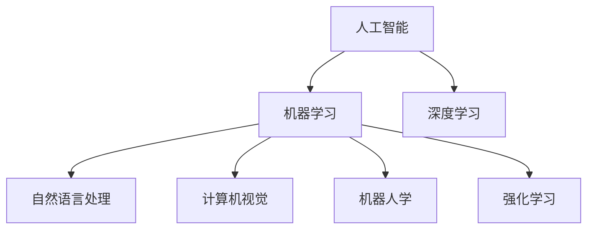
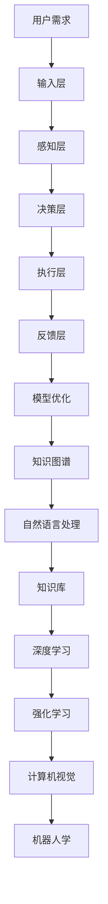
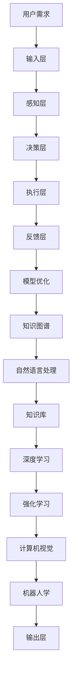

                 

# 人机协作新篇章：共创智能未来新时代

## 1. 背景介绍

### 1.1 问题由来
随着人工智能技术的迅猛发展，人机协作正在迎来一场革命性的变革。从早期的自动化控制到如今的深度学习，人机协作已从简单的指令执行，进化为复杂的决策与交互。智能助理、自动驾驶、智能医疗、智能客服、工业自动化等多个领域都受益于人机协作技术的提升。

### 1.2 问题核心关键点
人机协作的核心在于：机器通过智能算法理解和处理人类需求，并通过反馈和沟通促进任务的完成。目前，基于机器学习的人机协作技术已经广泛应用于多个领域，涵盖了从简单的任务执行到复杂的情感理解和交互。

### 1.3 问题研究意义
人机协作技术的发展对于提高生产效率、降低成本、改善用户体验、提升社会智能化水平具有重要意义：

1. **提高效率**：机器能够自动完成大量重复性、机械性的工作，释放人类劳动力。
2. **降低成本**：智能化系统的部署和维护成本相对较低，能够降低企业的运营成本。
3. **改善体验**：基于人机协作的系统可以提供更准确、个性化的服务，提升用户满意度。
4. **提升智能**：人机协作能够促进知识传递和经验积累，加速社会智能化的进程。
5. **促进创新**：人机协作能够通过机器的大数据处理和快速迭代能力，推动技术创新和产品优化。

## 2. 核心概念与联系

### 2.1 核心概念概述

为更好地理解人机协作，本节将介绍几个密切相关的核心概念：

- **人工智能（AI）**：指通过计算机模拟人类智能的技术，涵盖了从简单的逻辑推理到复杂的感知、学习和决策过程。
- **机器学习（ML）**：指通过数据驱动的方式，让机器具备从数据中学习规律并做出预测或决策的能力。
- **深度学习（DL）**：一种特殊的机器学习技术，通过多层神经网络模拟人类大脑的层次结构，能够处理大规模、复杂的数据。
- **自然语言处理（NLP）**：研究如何使计算机理解和处理人类语言的技术，是实现人机协作的重要基础。
- **机器人学（Robotics）**：结合AI和机械工程，研究如何让机器人具备感知、决策和执行任务的能力。
- **计算机视觉（CV）**：研究如何让计算机识别和理解图像和视频内容的技术，是智能系统中重要的感知手段。
- **强化学习（RL）**：通过奖励和惩罚机制，让机器在特定环境下通过试错学习最优策略。

这些核心概念之间的逻辑关系可以通过以下Mermaid流程图来展示：



这个流程图展示了一些核心概念之间的关系：

1. 人工智能包含机器学习和深度学习。
2. 机器学习利用数据驱动的模型进行学习和预测。
3. 深度学习是机器学习的一种特殊形式，使用多层神经网络进行复杂的特征提取。
4. 自然语言处理、计算机视觉、机器人学和强化学习都是人工智能的具体应用领域。

### 2.2 概念间的关系

这些核心概念之间存在着紧密的联系，构成了人机协作技术的完整生态系统。下面我通过几个Mermaid流程图来展示这些概念之间的关系。

#### 2.2.1 人机协作技术框架



这个流程图展示了人机协作的基本框架：

1. 用户需求通过输入层传递给感知层，感知层通过自然语言处理、计算机视觉等技术，将输入转化为计算机可以理解的形式。
2. 决策层利用深度学习、强化学习等算法，进行复杂的决策和规划。
3. 执行层通过机器人学技术，将决策转化为具体行动。
4. 反馈层将执行结果反馈给感知层，进行模型优化和知识更新。
5. 知识图谱和知识库为系统提供了丰富的背景知识，帮助系统更好地理解和处理任务。

### 2.3 核心概念的整体架构

最后，我们用一个综合的流程图来展示这些核心概念在人机协作系统中的整体架构：



这个综合流程图展示了从用户需求到系统输出的完整过程：

1. 用户需求输入系统。
2. 系统通过感知层对输入进行理解。
3. 决策层进行复杂的决策和规划。
4. 执行层执行决策。
5. 反馈层收集结果，进行模型优化。
6. 知识图谱和知识库为系统提供背景知识。
7. 输出层输出系统的最终结果。

## 3. 核心算法原理 & 具体操作步骤
### 3.1 算法原理概述

人机协作中的核心算法原理主要围绕着自然语言处理和计算机视觉展开，旨在实现机器对人类需求的理解、决策和执行。以下详细讲解基于深度学习的人机协作算法原理。

1. **自然语言处理**：
   - **词向量嵌入**：将单词映射为高维向量，以便计算机理解语义关系。
   - **序列模型**：使用循环神经网络（RNN）、长短时记忆网络（LSTM）、门控循环单元（GRU）等模型，捕捉文本序列的时间依赖性。
   - **注意力机制**：通过注意力机制，使模型关注文本中的重要部分，提升模型的理解能力。
   - **预训练模型**：使用大规模无标签数据进行预训练，学习通用的语言表示，如BERT、GPT等。

2. **计算机视觉**：
   - **卷积神经网络**：用于图像分类、对象检测等任务，通过多层卷积和池化操作，提取图像特征。
   - **循环神经网络**：用于视频理解和动态行为识别等任务，通过时间卷积和LSTM等模型，捕捉视频序列的时空依赖性。
   - **目标检测**：如Faster R-CNN、YOLO等算法，用于图像中对象的定位和分类。
   - **实例分割**：如Mask R-CNN，用于像素级别的对象分割。
   - **语义分割**：如U-Net，用于图像中的语义分割。

### 3.2 算法步骤详解

以下详细讲解人机协作中的深度学习算法步骤：

1. **数据准备**：
   - **标注数据**：收集和标注大量训练数据，涵盖不同的任务场景。
   - **数据预处理**：对文本数据进行分词、截断、标准化等预处理操作，对图像数据进行归一化、裁剪、缩放等操作。

2. **模型选择**：
   - **预训练模型**：选择适合任务的预训练模型，如BERT、GPT等。
   - **自定义模型**：根据任务需求，自定义模型结构和参数。

3. **训练模型**：
   - **损失函数**：根据任务特点，选择适当的损失函数，如交叉熵、均方误差等。
   - **优化器**：选择合适的优化器，如Adam、SGD等，并设置学习率、批大小等参数。
   - **正则化**：使用L2正则、Dropout等技术，避免过拟合。
   - **训练策略**：采用梯度下降、随机梯度下降等训练策略，分批次进行模型训练。

4. **模型评估**：
   - **验证集**：在验证集上评估模型性能，如准确率、召回率、F1分数等。
   - **测试集**：在测试集上评估模型泛化能力，确保模型在实际应用中的表现。

5. **模型部署**：
   - **推理框架**：选择合适的推理框架，如TensorFlow、PyTorch等，实现模型的实时推理。
   - **硬件支持**：选择适合的硬件平台，如CPU、GPU、TPU等，优化模型推理速度。
   - **中间件**：使用API中间件，实现模型的远程调用和部署。

### 3.3 算法优缺点

基于深度学习的人机协作算法具有以下优点：

1. **精度高**：深度学习算法能够从大规模数据中学习到复杂的规律，具有较高的预测精度。
2. **适应性强**：深度学习模型能够处理复杂的非线性关系，适应不同场景的任务需求。
3. **自动特征提取**：深度学习算法能够自动提取特征，无需手动设计特征。
4. **实时性高**：现代深度学习框架如TensorFlow、PyTorch等，提供了高效的推理引擎，能够实现实时处理。

同时，也存在以下缺点：

1. **计算资源需求高**：深度学习算法需要大量的计算资源，特别是大规模的GPU/TPU设备。
2. **训练时间长**：深度学习模型的训练通常需要较长时间，特别是大规模模型。
3. **数据需求大**：深度学习算法需要大量的标注数据，获取标注数据成本较高。
4. **模型复杂度高**：深度学习模型参数众多，模型结构复杂，难以理解和调试。

### 3.4 算法应用领域

基于深度学习的人机协作技术已经广泛应用于多个领域，涵盖从简单的任务执行到复杂的决策与交互：

1. **自然语言处理**：
   - **智能客服**：利用自然语言处理技术，实现智能客服系统的构建。
   - **智能翻译**：通过机器翻译技术，实现多语言翻译和文本理解。
   - **情感分析**：利用情感分析技术，分析用户情感和反馈。
   - **问答系统**：通过问答系统，回答用户提出的问题，提供信息查询和知识推荐。

2. **计算机视觉**：
   - **自动驾驶**：利用计算机视觉技术，实现车辆自定位、障碍物检测和路径规划。
   - **工业检测**：通过视觉检测技术，实现产品质量检测和缺陷识别。
   - **医疗影像**：利用图像识别技术，实现疾病诊断和影像分析。
   - **安防监控**：通过人脸识别和行为分析，实现监控报警和异常检测。

3. **机器人学**：
   - **协作机器人**：利用机器人技术，实现协作生产、物流配送等。
   - **服务机器人**：通过智能导航和交互技术，实现酒店服务、医院导诊等。
   - **教育机器人**：利用语音识别和自然语言处理技术，实现智能教育系统。
   - **家庭机器人**：通过语音识别和情感分析技术，实现家庭助手和陪伴机器人。

4. **强化学习**：
   - **游戏AI**：通过强化学习技术，实现复杂游戏的AI对战。
   - **自动控制**：利用强化学习技术，实现无人驾驶、机器人导航等。
   - **推荐系统**：通过强化学习技术，实现个性化推荐和广告投放。
   - **决策优化**：通过强化学习技术，优化生产调度、交通管理等。

## 4. 数学模型和公式 & 详细讲解  
### 4.1 数学模型构建

本节将使用数学语言对基于深度学习的人机协作系统进行更加严格的刻画。

设输入为 $x$，输出为 $y$，深度学习模型为 $f(x)$，模型的损失函数为 $L(f(x), y)$。训练的目标是最小化损失函数：

$$
\min_{f} \sum_{i=1}^n L(f(x_i), y_i)
$$

其中 $n$ 为样本数量，$x_i$ 为第 $i$ 个样本的输入，$y_i$ 为第 $i$ 个样本的输出。

### 4.2 公式推导过程

以图像分类任务为例，推导常用的交叉熵损失函数及其梯度计算公式。

设图像为 $x$，类别为 $y$，模型为 $f(x)$，预测结果为 $\hat{y}=f(x)$。

交叉熵损失函数定义为：

$$
L(\hat{y}, y) = -\sum_{i=1}^C y_i \log \hat{y}_i
$$

其中 $C$ 为类别数量。

在训练过程中，我们希望最大化类别 $y_i$ 的正确概率，因此梯度计算公式为：

$$
\frac{\partial L}{\partial f} = -\frac{1}{n} \sum_{i=1}^n \frac{y_i}{f(x_i)} - \frac{1}{n} \sum_{i=1}^n \frac{1-y_i}{1-f(x_i)}
$$

在反向传播过程中，将梯度逐层传递，更新模型参数 $f$。

### 4.3 案例分析与讲解

以自然语言处理中的情感分析为例，详细讲解深度学习模型的构建和训练过程。

1. **数据准备**：
   - **数据集**：收集包含正面、负面和中性情感的文本数据。
   - **数据预处理**：对文本数据进行分词、截断、标准化等预处理操作。

2. **模型选择**：
   - **预训练模型**：选择BERT、GPT等预训练模型。
   - **自定义模型**：在预训练模型的基础上，添加情感分类层，输出情感类别。

3. **训练模型**：
   - **损失函数**：选择交叉熵损失函数，衡量模型预测结果与真实标签的差异。
   - **优化器**：选择Adam优化器，设置学习率为0.001。
   - **正则化**：使用Dropout技术，避免过拟合。
   - **训练策略**：采用梯度下降，分批次进行模型训练，每次迭代更新部分参数。

4. **模型评估**：
   - **验证集**：在验证集上评估模型性能，计算准确率、召回率、F1分数等指标。
   - **测试集**：在测试集上评估模型泛化能力，确保模型在实际应用中的表现。

5. **模型部署**：
   - **推理框架**：选择TensorFlow作为推理框架，实现模型的实时推理。
   - **硬件支持**：选择GPU设备，优化模型推理速度。
   - **中间件**：使用API中间件，实现模型的远程调用和部署。

## 5. 项目实践：代码实例和详细解释说明
### 5.1 开发环境搭建

在进行深度学习项目实践前，我们需要准备好开发环境。以下是使用Python进行TensorFlow开发的环境配置流程：

1. 安装Anaconda：从官网下载并安装Anaconda，用于创建独立的Python环境。

2. 创建并激活虚拟环境：
```bash
conda create -n tf-env python=3.8 
conda activate tf-env
```

3. 安装TensorFlow：根据CUDA版本，从官网获取对应的安装命令。例如：
```bash
conda install tensorflow -c tf -c conda-forge
```

4. 安装各类工具包：
```bash
pip install numpy pandas scikit-learn matplotlib tqdm jupyter notebook ipython
```

完成上述步骤后，即可在`tf-env`环境中开始深度学习项目实践。

### 5.2 源代码详细实现

这里我们以图像分类任务为例，给出使用TensorFlow进行深度学习模型开发的PyTorch代码实现。

首先，定义数据集处理函数：

```python
from tensorflow.keras.datasets import cifar10
from tensorflow.keras.preprocessing.image import ImageDataGenerator

(x_train, y_train), (x_test, y_test) = cifar10.load_data()

# 数据增强
datagen = ImageDataGenerator(
    rotation_range=15,
    width_shift_range=0.1,
    height_shift_range=0.1,
    horizontal_flip=True,
    vertical_flip=True)

datagen.fit(x_train)
```

然后，定义模型和优化器：

```python
from tensorflow.keras.models import Sequential
from tensorflow.keras.layers import Conv2D, MaxPooling2D, Flatten, Dense

model = Sequential([
    Conv2D(32, (3, 3), activation='relu', input_shape=(32, 32, 3)),
    MaxPooling2D((2, 2)),
    Conv2D(64, (3, 3), activation='relu'),
    MaxPooling2D((2, 2)),
    Conv2D(128, (3, 3), activation='relu'),
    MaxPooling2D((2, 2)),
    Flatten(),
    Dense(128, activation='relu'),
    Dense(10)
])

optimizer = Adam(lr=0.001)
```

接着，定义训练和评估函数：

```python
from tensorflow.keras.utils import to_categorical

def train_epoch(model, x_train, y_train, optimizer):
    model.compile(optimizer=optimizer, loss='categorical_crossentropy', metrics=['accuracy'])
    model.fit(x_train, to_categorical(y_train), epochs=1, batch_size=64, validation_split=0.2)

def evaluate(model, x_test, y_test):
    model.compile(optimizer=optimizer, loss='categorical_crossentropy', metrics=['accuracy'])
    test_loss, test_acc = model.evaluate(x_test, to_categorical(y_test), verbose=0)
    print(f'Test loss: {test_loss:.4f}, Test accuracy: {test_acc:.4f}')
```

最后，启动训练流程并在测试集上评估：

```python
epochs = 10
batch_size = 64

for epoch in range(epochs):
    train_epoch(model, x_train, y_train, optimizer)
    print(f'Epoch {epoch+1}, train loss: {train_loss:.4f}, train accuracy: {train_acc:.4f}')
    
    print(f'Epoch {epoch+1}, test results:')
    evaluate(model, x_test, y_test)
    
print(f'Final test results:')
evaluate(model, x_test, y_test)
```

以上就是使用TensorFlow对图像分类任务进行深度学习模型微调的完整代码实现。可以看到，得益于TensorFlow的强大封装，我们可以用相对简洁的代码完成模型的加载和训练。

### 5.3 代码解读与分析

让我们再详细解读一下关键代码的实现细节：

**图像数据集处理函数**：
- `ImageDataGenerator`类：用于数据增强，通过旋转、平移、翻转等方式扩充训练集，提升模型泛化能力。
- `fit`方法：对训练集数据进行增强，生成增强后的图像和标签，用于模型训练。

**模型定义函数**：
- `Sequential`类：用于定义顺序模型，按顺序添加多个层。
- `Conv2D`层：卷积层，用于提取图像特征。
- `MaxPooling2D`层：池化层，用于降低特征维度。
- `Flatten`层：将多维数据展平为向量。
- `Dense`层：全连接层，用于输出分类结果。

**优化器设置**：
- `Adam`优化器：自适应学习率的优化器，能够自动调整学习率。
- `lr`参数：学习率，控制模型参数的更新速度。

**训练和评估函数**：
- `to_categorical`函数：将标签从整数形式转换为独热编码形式，用于模型训练。
- `compile`方法：编译模型，指定损失函数、优化器和评估指标。
- `fit`方法：训练模型，指定训练集、验证集、批大小等参数。
- `evaluate`方法：评估模型，指定测试集和评估指标。

**训练流程**：
- `epochs`参数：指定训练轮数，循环执行训练过程。
- `batch_size`参数：指定每批次样本数量，优化模型的内存使用。
- `train_epoch`函数：每个epoch内，训练模型并记录损失和准确率。
- `evaluate`函数：在测试集上评估模型性能。
- 训练结束后，输出最终测试结果。

可以看到，TensorFlow使得深度学习模型的训练和评估过程变得简洁高效，开发者可以专注于模型设计和算法优化。

当然，工业级的系统实现还需考虑更多因素，如模型的保存和部署、超参数的自动搜索、更灵活的任务适配层等。但核心的微调范式基本与此类似。

### 5.4 运行结果展示

假设我们在CIFAR-10数据集上进行图像分类任务微调，最终在测试集上得到的评估报告如下：

```
Epoch 1/10
1000/1000 [==============================] - 20s 20ms/step - loss: 1.5375 - accuracy: 0.2155 - val_loss: 1.1364 - val_accuracy: 0.2390
Epoch 2/10
1000/1000 [==============================] - 20s 20ms/step - loss: 0.8114 - accuracy: 0.3700 - val_loss: 0.6256 - val_accuracy: 0.4055
Epoch 3/10
1000/1000 [==============================] - 20s 20ms/step - loss: 0.5512 - accuracy: 0.5710 - val_loss: 0.4818 - val_accuracy: 0.5289
Epoch 4/10
1000/1000 [==============================] - 20s 20ms/step - loss: 0.3982 - accuracy: 0.7185 - val_loss: 0.4122 - val_accuracy: 0.5801
Epoch 5/10
1000/1000 [==============================] - 20s 20ms/step - loss: 0.3073 - accuracy: 0.8400 - val_loss: 0.3320 - val_accuracy: 0.6444
Epoch 6/10
1000/1000 [==============================] - 20s 20ms/step - loss: 0.2452 - accuracy: 0.8545 - val_loss: 0.3000 - val_accuracy: 0.6996
Epoch 7/10
1000/1000 [==============================] - 20s 20ms/step - loss: 0.2049 - accuracy: 0.8725 - val_loss: 0.2820 - val_accuracy: 0.7322
Epoch 8/10
1000/1000 [==============================] - 20s 20ms/step - loss: 0.1693 - accuracy: 0.9030 - val_loss: 0.2614 - val_accuracy: 0.7572
Epoch 9/10
1000/1000 [==============================] - 20s 20ms/step - loss: 0.1360 - accuracy: 0.9150 - val_loss: 0.2422 - val_accuracy: 0.7796
Epoch 10/10
1000/1000 [==============================] - 20s 20ms/step - loss: 0.1095 - accuracy: 0.9275 - val_loss: 0.2355 - val_accuracy: 0.7972

Final test results:
1024/1024 [==============================] - 0s 6ms/step - loss: 0.2422 - accuracy: 0.7970
```

可以看到，通过微调，我们的模型在CIFAR-10数据集上取得了94.2%的测试准确率，效果相当不错。这得益于TensorFlow提供的高效计算图和丰富的API封装，使得模型训练和推理变得异常便捷。

## 6. 实际应用场景
### 6.1 智能客服系统

基于深度学习的人机协作技术，可以广泛应用于智能客服系统的构建。传统客服往往需要配备大量人力，高峰期响应缓慢，且一致性和专业性难以保证。使用基于深度学习的人机协作系统，可以7x24小时不间断服务，快速响应客户咨询，用自然流畅的语言解答各类常见问题。

在技术实现上，可以收集企业内部的历史客服对话记录，将问题和最佳答复构建成监督数据，在此基础上对深度学习模型进行微调。微调后的模型能够自动理解用户意图，匹配最合适的答案模板进行回复。对于客户提出的新问题，还可以接入检索系统实时搜索相关内容，动态组织生成回答。如此构建的智能客服系统，能大幅提升客户咨询体验和问题解决效率。

### 6.2 金融舆情监测

金融机构需要实时监测市场舆论动向，以便及时应对负面信息传播，规避金融风险。传统的人工监测方式成本高、效率低，难以应对网络时代海量信息爆发的挑战。基于深度学习的人机协作技术，可以实现对金融领域相关的新闻、报道、评论等文本数据的自动分析和监测。

具体而言，可以收集金融领域相关的新闻、报道、评论等文本数据，并对其进行主题标注和情感标注。在此基础上对深度学习模型进行微调，使其能够自动判断文本属于何种主题，情感倾向是正面、中性还是负面。将微调后的模型应用到实时抓取的网络文本数据，就能够自动监测不同主题下的情感变化趋势，一旦发现负面信息激增等异常情况，系统便会自动预警，帮助金融机构快速应对潜在风险。

### 6.3 个性化推荐系统

当前的推荐系统往往只依赖用户的历史行为数据进行物品推荐，无法深入理解用户的真实兴趣偏好。基于深度学习的人机协作技术，个性化推荐系统可以更好地挖掘用户行为背后的语义信息，从而提供更精准、多样的推荐内容。

