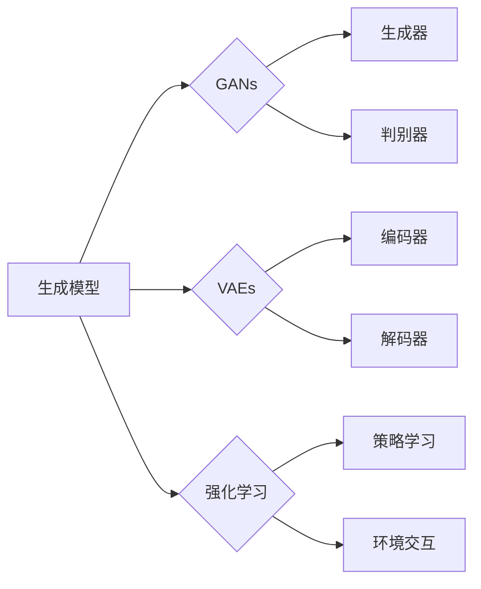

> 生成式AI, 生成模型, 自然语言生成, 图像生成, 强化学习, 模型可解释性, 安全性, 应用场景

# 生成式AI的实际应用与挑战

生成式人工智能（Generative AI）是近年来人工智能领域的热点研究方向。它通过模拟人类创造力的过程，让机器能够生成新的内容，如图像、文本、音乐等。本文将深入探讨生成式AI的实际应用与面临的挑战，旨在为读者提供一个全面的理解。

## 1. 背景介绍

生成式AI的研究可以追溯到20世纪70年代，但直到近年来，随着深度学习技术的突破，生成式AI才真正迎来了它的黄金时代。这一领域的研究目标是通过算法生成与训练数据高度相似的新内容，甚至能够创造全新的内容。

### 1.1 问题的由来

人类创造力的本质是什么？如何让机器模仿甚至超越人类的创造力？这些问题推动着生成式AI的研究。随着深度学习的快速发展，生成式AI在图像、文本、音乐等多个领域取得了显著进展。

### 1.2 研究现状

生成式AI的研究主要集中在以下几种模型：

- **生成对抗网络（GANs）**：通过对抗训练生成器与判别器，使生成器能够生成越来越接近真实数据的样本。
- **变分自编码器（VAEs）**：通过优化编码器和解码器的参数，学习数据的高斯分布，然后生成新的样本。
- **基于强化学习的生成模型**：通过强化学习训练生成器，使其在特定任务上生成高质量的内容。

### 1.3 研究意义

生成式AI的研究具有重要的理论意义和应用价值。它不仅能够帮助我们理解人类创造力的本质，还能够应用于各种实际场景，如艺术创作、科学研究、工业设计等。

### 1.4 本文结构

本文将分为以下几个部分：

- 核心概念与联系
- 核心算法原理 & 具体操作步骤
- 数学模型和公式 & 详细讲解 & 举例说明
- 项目实践：代码实例和详细解释说明
- 实际应用场景
- 工具和资源推荐
- 总结：未来发展趋势与挑战
- 附录：常见问题与解答

## 2. 核心概念与联系

### 2.1 核心概念

- **生成模型**：一种能够学习数据分布，并生成与训练数据相似的新样本的模型。
- **生成对抗网络（GANs）**：由生成器和判别器组成的对抗训练框架，生成器生成样本，判别器判断样本的真实性。
- **变分自编码器（VAEs）**：通过编码器和解码器学习数据分布，并生成新的样本。
- **强化学习**：一种通过与环境交互来学习最优策略的方法。

### 2.2 Mermaid 流程图



### 2.3 核心概念联系

生成模型是生成式AI的基础，GANs、VAEs和强化学习是三种主要的生成模型。GANs通过对抗训练生成器与判别器，VAEs通过编码器和解码器学习数据分布，强化学习则通过与环境交互来学习最优策略。

## 3. 核心算法原理 & 具体操作步骤

### 3.1 算法原理概述

#### 3.1.1 生成对抗网络（GANs）

GANs由生成器（Generator）和判别器（Discriminator）组成。生成器生成样本，判别器判断样本的真实性。训练过程中，生成器试图生成越来越接近真实数据的样本，而判别器则试图区分真实样本和生成样本。

#### 3.1.2 变分自编码器（VAEs）

VAEs通过编码器（Encoder）将数据压缩成潜在空间中的表示，通过解码器（Decoder）将潜在空间中的表示解码成数据。VAEs学习数据分布，并生成新的样本。

#### 3.1.3 强化学习

强化学习通过与环境交互来学习最优策略。在生成式AI中，强化学习可以用于训练生成器，使其在特定任务上生成高质量的内容。

### 3.2 算法步骤详解

#### 3.2.1 生成对抗网络（GANs）

1. 初始化生成器、判别器和解码器参数。
2. 判别器判断真实样本和生成样本的真实性。
3. 生成器生成样本。
4. 训练生成器和判别器参数，使生成器生成的样本更接近真实数据，判别器更难区分真实样本和生成样本。

#### 3.2.2 变分自编码器（VAEs）

1. 初始化编码器、解码器和解码器参数。
2. 编码器将数据压缩成潜在空间中的表示。
3. 解码器将潜在空间中的表示解码成数据。
4. 训练编码器和解码器参数，使解码器解码出的数据更接近原始数据。

#### 3.2.3 强化学习

1. 初始化策略学习参数。
2. 生成器生成样本。
3. 策略学习根据生成样本与环境交互，学习最优策略。
4. 更新策略学习参数。

### 3.3 算法优缺点

#### 3.3.1 生成对抗网络（GANs）

优点：

- 能够生成高质量、多样化的样本。
- 能够生成与真实数据分布高度相似的样本。

缺点：

- 训练过程不稳定，容易出现模式崩溃等问题。
- 模型可解释性差。

#### 3.3.2 变分自编码器（VAEs）

优点：

- 模型结构简单，易于实现。
- 可解释性强。

缺点：

- 生成样本的质量可能不如GANs。

#### 3.3.3 强化学习

优点：

- 能够学习复杂、动态的环境。
- 能够生成高质量的样本。

缺点：

- 训练过程可能非常耗时。
- 模型可解释性差。

### 3.4 算法应用领域

GANs、VAEs和强化学习在多个领域都有广泛的应用，如：

- **图像生成**：生成逼真的图像、视频、动画等。
- **文本生成**：生成文章、诗歌、对话等。
- **音乐生成**：生成旋律、歌曲等。
- **科学建模**：生成分子结构、生物序列等。

## 4. 数学模型和公式 & 详细讲解 & 举例说明

### 4.1 数学模型构建

#### 4.1.1 生成对抗网络（GANs）

GANs的数学模型如下：

$$
\begin{aligned}
\max_{G} \min_{D} V(G,D) &= \mathbb{E}_{z \sim p(z)}[V(D,G(z))] + \mathbb{E}_{x \sim p(x)}[V(D,x)] \\
V(G,D) &= \mathbb{E}_{x \sim p(x)}[\log D(x)] - \mathbb{E}_{z \sim p(z)}[\log D(G(z))]
\end{aligned}
$$

其中，$G$ 是生成器，$D$ 是判别器，$z$ 是噪声向量。

#### 4.1.2 变分自编码器（VAEs）

VAEs的数学模型如下：

$$
\begin{aligned}
\mathcal{L}_{\text{VAE}} &= D_{\theta}(x, \mu(x), \sigma^2(x)) + \frac{1}{2}\sum_{i=1}^{D} (\sigma^2(x) + (\mu(x) - x)^2) \\
D_{\theta}(x, \mu(x), \sigma^2(x)) &= \log \frac{1}{\sqrt{2\pi}\sigma(x)} \exp\left(-\frac{1}{2\sigma^2(x)}(x-\mu(x))^2\right)
\end{aligned}
$$

其中，$D_{\theta}$ 是编码器，$\mu(x)$ 和 $\sigma^2(x)$ 分别是编码器的均值和方差。

#### 4.1.3 强化学习

强化学习的数学模型如下：

$$
\begin{aligned}
J(\pi) &= \mathbb{E}_{\tau \sim \pi}[\sum_{t=0}^{T} \gamma^t R(s_t, a_t)] \\
\pi(a|s) &= \frac{\exp(\phi(\pi, s) a)}{\sum_{a' \in A(s)} \exp(\phi(\pi, s) a')}
\end{aligned}
$$

其中，$J(\pi)$ 是策略 $\pi$ 的期望奖励，$\tau$ 是时间步长，$R(s_t, a_t)$ 是在状态 $s_t$ 下执行动作 $a_t$ 的即时奖励，$\gamma$ 是折扣因子，$\phi(\pi, s)$ 是策略 $\pi$ 在状态 $s$ 下的特征向量。

### 4.2 公式推导过程

#### 4.2.1 生成对抗网络（GANs）

GANs的推导过程涉及概率论和优化理论，这里简要介绍其核心思想。生成器 $G$ 和判别器 $D$ 分别学习生成样本和区分样本的真实性。通过对抗训练，生成器试图生成越来越接近真实数据的样本，而判别器则试图区分真实样本和生成样本。

#### 4.2.2 变分自编码器（VAEs）

VAEs的推导过程基于变分推理和凸优化理论。通过优化编码器和解码器的参数，VAEs学习数据分布，并生成新的样本。

#### 4.2.3 强化学习

强化学习的推导过程涉及马尔可夫决策过程（MDP）和动态规划理论。通过强化学习，生成器能够在特定任务上生成高质量的内容。

### 4.3 案例分析与讲解

#### 4.3.1 GANs在图像生成中的应用

GANs在图像生成中取得了显著的成果。例如，CycleGAN可以将不同风格的图像转换为另一种风格，StyleGAN可以生成逼真的逼真图像。

#### 4.3.2 VAEs在文本生成中的应用

VAEs在文本生成中也取得了不错的成果。例如，GAN-Times可以生成高质量的文章。

#### 4.3.3 强化学习在游戏中的应用

强化学习在游戏领域取得了显著的成果。例如，AlphaGo可以战胜世界围棋冠军。

## 5. 项目实践：代码实例和详细解释说明

### 5.1 开发环境搭建

为了进行生成式AI的实践，我们需要搭建以下开发环境：

1. 操作系统：Windows、Linux或macOS。
2. 编程语言：Python。
3. 开发工具：PyCharm、VS Code等。
4. 依赖库：TensorFlow、PyTorch、NumPy、Pandas等。

### 5.2 源代码详细实现

以下是一个使用PyTorch实现GANs的简单示例：

```python
import torch
import torch.nn as nn

# 生成器
class Generator(nn.Module):
    def __init__(self):
        super(Generator, self).__init__()
        self.net = nn.Sequential(
            nn.Linear(100, 256),
            nn.ReLU(),
            nn.Linear(256, 512),
            nn.ReLU(),
            nn.Linear(512, 1024),
            nn.ReLU(),
            nn.Linear(1024, 784),
            nn.Tanh()
        )
    
    def forward(self, z):
        return self.net(z)

# 判别器
class Discriminator(nn.Module):
    def __init__(self):
        super(Discriminator, self).__init__()
        self.net = nn.Sequential(
            nn.Linear(784, 1024),
            nn.LeakyReLU(0.2),
            nn.Linear(1024, 512),
            nn.LeakyReLU(0.2),
            nn.Linear(512, 256),
            nn.LeakyReLU(0.2),
            nn.Linear(256, 1),
            nn.Sigmoid()
        )
    
    def forward(self, x):
        return self.net(x).view(-1, 1)

# 训练
def train(generator, discriminator, criterion, optimizer_G, optimizer_D, z_real, z_fake, epochs):
    for epoch in range(epochs):
        for i in range(z_real.size(0)):
            # 训练生成器
            optimizer_G.zero_grad()
            z = z_real[i].repeat(1, 1)
            fake = generator(z)
            g_loss = criterion(discriminator(fake), torch.ones_like(discriminator(fake)))
            g_loss.backward()
            optimizer_G.step()
            
            # 训练判别器
            optimizer_D.zero_grad()
            d_real = discriminator(z_real[i])
            d_fake = discriminator(fake.detach())
            d_loss_real = criterion(d_real, torch.ones_like(d_real))
            d_loss_fake = criterion(d_fake, torch.zeros_like(d_fake))
            d_loss = (d_loss_real + d_loss_fake) / 2
            d_loss.backward()
            optimizer_D.step()
            
            if i % 100 == 0:
                print(f"Epoch {epoch}, Step {i}, G_loss: {g_loss.item():.4f}, D_loss: {d_loss.item():.4f}")

# 主程序
if __name__ == "__main__":
    epochs = 1000
    batch_size = 64
    z_dim = 100
    lr = 0.0002
    
    z_real = torch.randn(batch_size, z_dim)
    
    generator = Generator().to(device)
    discriminator = Discriminator().to(device)
    
    optimizer_G = torch.optim.Adam(generator.parameters(), lr=lr)
    optimizer_D = torch.optim.Adam(discriminator.parameters(), lr=lr)
    
    criterion = nn.BCEWithLogitsLoss()
    
    train(generator, discriminator, criterion, optimizer_G, optimizer_D, z_real, z_fake, epochs)
```

### 5.3 代码解读与分析

上述代码实现了一个简单的GANs模型，用于生成手写数字图像。其中，`Generator` 和 `Discriminator` 分别是生成器和判别器的定义。`train` 函数用于训练生成器和判别器。主程序中设置了训练参数，并调用 `train` 函数进行训练。

### 5.4 运行结果展示

通过运行上述代码，我们可以生成一系列逼真的手写数字图像。这些图像的质量取决于模型参数和训练数据。

## 6. 实际应用场景

生成式AI在实际应用中具有广泛的应用场景，以下是一些典型的应用：

### 6.1 图像生成

- **艺术创作**：生成独特的艺术作品，如绘画、动画等。
- **图像修复**：修复损坏的图像，如老照片修复、图像去噪等。
- **图像编辑**：对图像进行编辑，如换脸、风格转换等。

### 6.2 文本生成

- **内容创作**：生成文章、诗歌、对话等。
- **机器翻译**：实现自动翻译，如机器翻译、机器写作等。
- **问答系统**：构建问答系统，如聊天机器人、客服机器人等。

### 6.3 音乐生成

- **音乐创作**：生成旋律、歌曲等。
- **音频编辑**：对音频进行编辑，如音频合成、音频去噪等。

### 6.4 科学研究

- **分子设计**：生成新的分子结构。
- **生物序列分析**：生成新的生物序列。

## 7. 工具和资源推荐

### 7.1 学习资源推荐

- **书籍**：
  - 《Deep Learning》
  - 《Generative Adversarial Nets》
  - 《Reinforcement Learning: An Introduction》
- **在线课程**：
  - Coursera的《Deep Learning Specialization》
  - Udacity的《Artificial Intelligence Nanodegree》

### 7.2 开发工具推荐

- **深度学习框架**：
  - TensorFlow
  - PyTorch
- **生成式AI库**：
  - TensorFlow.js
  - PyTorch Lightning

### 7.3 相关论文推荐

- **生成对抗网络**：
  - Generative Adversarial Nets
  - Improved Generative Adversarial Models
- **变分自编码器**：
  - Auto-Encoding Variational Bayes
  - Denoising Autoencoders Made Simple with Subsampling
- **强化学习**：
  - Deep Q-Networks
  - Asynchronous Advantage Actor-Critic

## 8. 总结：未来发展趋势与挑战

### 8.1 研究成果总结

生成式AI的研究取得了显著的成果，已经在图像、文本、音乐等多个领域取得了突破。然而，生成式AI仍然面临着诸多挑战。

### 8.2 未来发展趋势

- **模型可解释性**：提高模型的可解释性，使其更容易被人类理解和信任。
- **安全性**：确保生成的内容符合伦理道德标准，避免生成有害、歧视性的内容。
- **效率**：提高生成模型的效率，降低计算和存储需求。
- **跨模态生成**：实现跨模态生成，如图像-文本、图像-音频等。

### 8.3 面临的挑战

- **数据隐私**：如何保护用户数据隐私，避免数据泄露。
- **偏见和歧视**：如何避免生成式AI中的偏见和歧视问题。
- **版权问题**：如何解决生成式AI在版权问题上的争议。
- **伦理道德**：如何确保生成式AI的应用符合伦理道德标准。

### 8.4 研究展望

未来，生成式AI将在更多领域得到应用，为人类创造更多的价值。同时，我们也需要关注其潜在的风险，并采取措施确保其健康发展。

## 9. 附录：常见问题与解答

### 9.1 常见问题

1. 什么是生成式AI？
2. 生成式AI有哪些应用场景？
3. GANs和VAEs有什么区别？
4. 生成式AI的挑战有哪些？

### 9.2 解答

1. 生成式AI是一种能够学习数据分布，并生成与训练数据相似的新样本的模型。
2. 生成式AI的应用场景包括图像生成、文本生成、音乐生成、科学研究等。
3. GANs和VAEs都是生成式模型，但它们的原理和目标不同。GANs通过对抗训练生成样本，VAEs通过优化编码器和解码器的参数学习数据分布。
4. 生成式AI的挑战包括数据隐私、偏见和歧视、版权问题、伦理道德等。

---

作者：禅与计算机程序设计艺术 / Zen and the Art of Computer Programming