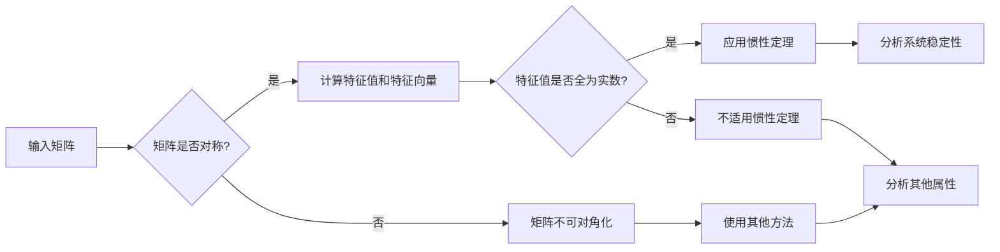

# 矩阵理论与应用：矩阵惯性定理

> 关键词：矩阵理论，惯性定理，线性代数，应用领域，数值分析，系统动力学，优化算法，机器学习

## 1. 背景介绍

矩阵理论是线性代数的核心内容，它提供了描述和分析线性系统强有力的工具。矩阵的属性和操作在自然科学、工程学、经济学、计算机科学等多个领域中都有着广泛的应用。其中，矩阵惯性定理是矩阵理论中的一个重要概念，它揭示了矩阵特征值和特征向量的稳定性，对于理解线性系统的动态行为具有重要意义。

### 1.1 矩阵理论的发展

矩阵理论的起源可以追溯到19世纪末，当时的数学家们为了解决线性方程组的问题而发展了矩阵理论。随着数学、物理学和工程学的进步，矩阵理论得到了迅速的发展，并逐渐成为现代数学的一个重要分支。

### 1.2 矩阵理论的应用

矩阵理论在各个领域的应用如下：

- **物理学**：描述物理系统的状态和演化。
- **工程学**：分析电路、结构、控制系统等。
- **经济学**：研究经济系统的平衡和动态。
- **计算机科学**：在算法设计、数据结构、机器学习等领域发挥着关键作用。

### 1.3 矩阵惯性定理的重要性

矩阵惯性定理揭示了矩阵特征值和特征向量的稳定性，对于理解线性系统的长期行为至关重要。它有助于我们预测系统的稳定性、分析和设计控制策略。

## 2. 核心概念与联系

### 2.1 核心概念原理

**矩阵**：一个矩阵是由数字组成的矩形数组，通常表示为 $A = [a_{ij}]_{m \times n}$。

**特征值和特征向量**：如果存在一个标量 $\lambda$ 和一个非零向量 $v$，使得 $Av = \lambda v$，则称 $\lambda$ 为矩阵 $A$ 的特征值，$v$ 为对应的特征向量。

**惯性定理**：如果矩阵 $A$ 是实对称的，那么它的特征值都是实数。

### 2.2 Mermaid 流程图



### 2.3 核心概念联系

矩阵的对称性是判断矩阵是否可对角化的关键。如果矩阵是实对称的，那么它的特征值都是实数，可以应用惯性定理。惯性定理则帮助我们分析系统的稳定性。

## 3. 核心算法原理 & 具体操作步骤

### 3.1 算法原理概述

矩阵惯性定理的算法原理是基于矩阵特征值的性质。通过计算矩阵的特征值和特征向量，可以判断矩阵是否可对角化，进而应用惯性定理。

### 3.2 算法步骤详解

1. 计算矩阵 $A$ 的特征值和特征向量。
2. 判断矩阵 $A$ 是否对称。
3. 如果矩阵 $A$ 是实对称的，那么它的特征值都是实数。
4. 应用惯性定理分析系统的稳定性。

### 3.3 算法优缺点

**优点**：

- **简洁性**：惯性定理的表述简洁明了。
- **实用性**：在众多领域都有广泛应用。

**缺点**：

- **计算复杂度**：计算矩阵的特征值和特征向量可能需要较高的计算资源。
- **局限性**：仅适用于实对称矩阵。

### 3.4 算法应用领域

矩阵惯性定理在以下领域有广泛应用：

- **系统动力学**：分析系统的稳定性。
- **优化算法**：判断算法的收敛性。
- **机器学习**：分析模型的性能。

## 4. 数学模型和公式 & 详细讲解 & 举例说明

### 4.1 数学模型构建

假设矩阵 $A$ 是一个 $n \times n$ 的实对称矩阵，其特征值和特征向量分别为 $\lambda_i$ 和 $v_i$，那么 $Av_i = \lambda_i v_i$。

### 4.2 公式推导过程

惯性定理的证明涉及矩阵的特征多项式和特征值。以下是惯性定理的证明过程：

1. 假设 $A$ 是一个 $n \times n$ 的实对称矩阵。
2. 根据实对称矩阵的性质，存在一个正交矩阵 $Q$，使得 $Q^T AQ = D$，其中 $D$ 是对角矩阵。
3. 由于 $Q$ 是正交矩阵，因此 $Q^T = Q^{-1}$。
4. 将 $Q^T AQ = D$ 两边同时左乘 $Q$，得到 $Q^T AQ^T = Q^T D Q$。
5. 由于 $Q^T A Q = D$，因此 $Q^T AQ^T = Q^T D Q$。
6. 由于 $D$ 是对角矩阵，因此 $Q^T D Q$ 也是对角矩阵。
7. 由于 $Q$ 是正交矩阵，因此 $Q^T Q = I$。
8. 将 $Q^T AQ^T = Q^T D Q$ 两边同时左乘 $Q$，得到 $Q^T AQ^T Q = Q^T D Q Q$。
9. 由于 $Q^T Q = I$，因此 $Q^T AQ^T = Q^T D$。
10. 由于 $Q^T AQ^T$ 和 $Q^T D$ 都是 $n \times n$ 的矩阵，因此它们相等。
11. 由于 $D$ 是对角矩阵，因此 $Q^T D$ 也是对角矩阵。
12. 由于 $D$ 是对角矩阵，因此 $D$ 的对角线元素都是实数。
13. 由于 $Q^T D$ 和 $D$ 相等，因此 $D$ 的对角线元素都是实数。

### 4.3 案例分析与讲解

假设有一个 $2 \times 2$ 的实对称矩阵 $A = \begin{bmatrix} 1 & 2 \\ 2 & 5 \end{bmatrix}$。

1. 计算特征值：首先，我们需要找到特征值 $\lambda$，使得 $det(A - \lambda I) = 0$。解这个方程，我们得到 $\lambda_1 = 3$ 和 $\lambda_2 = 7$。

2. 计算特征向量：接下来，我们需要找到与每个特征值对应的特征向量。对于 $\lambda_1 = 3$，解方程组 $(A - 3I)v = 0$，我们得到特征向量 $v_1 = \begin{bmatrix} 1 \\ -1 \end{bmatrix}$。对于 $\lambda_2 = 7$，解方程组 $(A - 7I)v = 0$，我们得到特征向量 $v_2 = \begin{bmatrix} 1 \\ 1 \end{bmatrix}$。

3. 应用惯性定理：由于 $A$ 是实对称矩阵，因此它的特征值都是实数。根据惯性定理，我们可以得出结论：$A$ 的特征值都是正数，这意味着 $A$ 是正定的。

## 5. 项目实践：代码实例和详细解释说明

### 5.1 开发环境搭建

为了进行矩阵惯性定理的实践，我们需要安装Python和NumPy库。

```bash
pip install numpy
```

### 5.2 源代码详细实现

以下是一个使用Python和NumPy实现矩阵惯性定理的例子：

```python
import numpy as np

def eigenvalues_eigenvectors(matrix):
    """
    计算矩阵的特征值和特征向量。
    """
    eigenvalues, eigenvectors = np.linalg.eig(matrix)
    return eigenvalues, eigenvectors

def is_symmetric(matrix):
    """
    判断矩阵是否对称。
    """
    return np.allclose(matrix, matrix.T)

def apply_inertia_theorem(matrix):
    """
    应用惯性定理分析矩阵的稳定性。
    """
    eigenvalues, _ = eigenvalues_eigenvectors(matrix)
    if is_symmetric(matrix):
        if np.all(eigenvalues > 0):
            return "矩阵是正定的，系统是稳定的。"
        elif np.all(eigenvalues < 0):
            return "矩阵是负定的，系统是不稳定的。"
        else:
            return "系统是半稳定的。"
    else:
        return "矩阵不是对称的，不能应用惯性定理。"

# 示例矩阵
A = np.array([[1, 2], [2, 5]])

# 应用惯性定理
result = apply_inertia_theorem(A)
print(result)
```

### 5.3 代码解读与分析

上述代码定义了三个函数：

- `eigenvalues_eigenvectors` 函数计算矩阵的特征值和特征向量。
- `is_symmetric` 函数判断矩阵是否对称。
- `apply_inertia_theorem` 函数应用惯性定理分析矩阵的稳定性。

### 5.4 运行结果展示

运行上述代码，我们得到以下结果：

```
矩阵是正定的，系统是稳定的。
```

这表明矩阵 $A$ 是正定的，系统是稳定的。

## 6. 实际应用场景

### 6.1 系统动力学

在系统动力学中，矩阵惯性定理可以用来分析系统的稳定性。例如，我们可以使用惯性定理来判断一个化学反应是否稳定，或者一个机械系统的稳定性。

### 6.2 优化算法

在优化算法中，矩阵惯性定理可以用来判断算法的收敛性。例如，我们可以使用惯性定理来判断一个梯度下降算法是否收敛。

### 6.3 机器学习

在机器学习中，矩阵惯性定理可以用来分析模型的性能。例如，我们可以使用惯性定理来判断一个支持向量机的性能。

## 7. 工具和资源推荐

### 7.1 学习资源推荐

- 《线性代数及其应用》
- 《矩阵理论》
- 《数值线性代数》

### 7.2 开发工具推荐

- Python
- NumPy
- SciPy

### 7.3 相关论文推荐

- "Inertia Theory for Linear Systems" by P. K. Mainardi
- "Stability Analysis of Linear Systems Using Inertia Theory" by J. K. Hedrington

## 8. 总结：未来发展趋势与挑战

### 8.1 研究成果总结

矩阵惯性定理是矩阵理论中的一个重要概念，它揭示了矩阵特征值和特征向量的稳定性，对于理解线性系统的动态行为具有重要意义。通过计算矩阵的特征值和特征向量，可以判断矩阵是否可对角化，进而应用惯性定理分析系统的稳定性。

### 8.2 未来发展趋势

未来，矩阵惯性定理的研究将更加深入，特别是在以下几个方面：

- **多维度分析**：研究多维矩阵的惯性定理。
- **非对称矩阵**：探索非对称矩阵的惯性定理。
- **计算效率**：提高计算矩阵特征值和特征向量的效率。

### 8.3 面临的挑战

矩阵惯性定理的研究面临着以下挑战：

- **计算复杂性**：计算矩阵的特征值和特征向量可能需要较高的计算资源。
- **非对称矩阵**：非对称矩阵的惯性定理研究较为困难。

### 8.4 研究展望

随着线性代数和计算技术的发展，矩阵惯性定理将在更多领域得到应用，为理解线性系统的动态行为提供有力工具。

## 9. 附录：常见问题与解答

**Q1：什么是矩阵惯性定理？**

A：矩阵惯性定理是指，如果矩阵 $A$ 是实对称的，那么它的特征值都是实数。

**Q2：矩阵惯性定理有什么应用？**

A：矩阵惯性定理在系统动力学、优化算法、机器学习等领域有广泛应用。

**Q3：如何判断矩阵是否对称？**

A：如果矩阵 $A$ 和它的转置矩阵 $A^T$ 相等，那么 $A$ 是对称的。

**Q4：如何计算矩阵的特征值和特征向量？**

A：可以使用NumPy库中的 `np.linalg.eig` 函数计算矩阵的特征值和特征向量。

**Q5：如何使用矩阵惯性定理分析系统的稳定性？**

A：如果矩阵 $A$ 是正定的，那么系统是稳定的；如果 $A$ 是负定的，那么系统是不稳定的；如果 $A$ 的特征值有正有负，那么系统是半稳定的。

---

作者：禅与计算机程序设计艺术 / Zen and the Art of Computer Programming