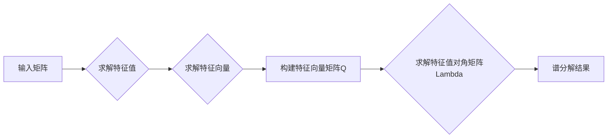

# 矩阵理论与应用：简单矩阵函数的谱分解及其应用

> 关键词：矩阵理论，谱分解，特征值，特征向量，矩阵函数，应用领域，数值计算，优化问题

## 1. 背景介绍

矩阵理论是现代数学和工程学的基础，它在许多科学和工程领域都有广泛的应用。谱分解是矩阵理论中的一个重要工具，它将矩阵分解为其特征值和特征向量的线性组合，从而简化了许多复杂问题的分析和解决。本文将探讨简单矩阵函数的谱分解原理，并展示其在实际问题中的应用。

### 1.1 矩阵理论的基本概念

矩阵理论涉及的研究对象是矩阵，即由数构成的矩形数组。矩阵可以用于表示线性变换、系统方程组、数据集等多种概念。矩阵的运算包括加法、数乘、矩阵乘法等。

### 1.2 谱分解的基本概念

谱分解是矩阵理论中的一个重要概念，它将一个矩阵分解为其特征值和特征向量的线性组合。一个矩阵的谱分解可以表示为：

$$
A = Q \Lambda Q^H
$$

其中 $A$ 是原始矩阵，$Q$ 是特征向量矩阵，$\Lambda$ 是特征值对角矩阵，$Q^H$ 是 $Q$ 的共轭转置。

### 1.3 研究意义

谱分解在许多领域都有应用，包括：

- 线性代数和抽象代数
- 量子力学
- 控制理论
- 信号处理
- 优化问题

## 2. 核心概念与联系

### 2.1 矩阵的谱分解原理

矩阵的谱分解是将矩阵分解为其特征值和特征向量的线性组合的过程。以下是谱分解的Mermaid流程图：



### 2.2 谱分解的数学模型

谱分解的数学模型如下：

$$
A = Q \Lambda Q^H
$$

其中：

- $A$ 是一个 $n \times n$ 的矩阵。
- $Q$ 是一个 $n \times n$ 的正交矩阵，其列向量是 $A$ 的特征向量。
- $\Lambda$ 是一个 $n \times n$ 的对角矩阵，其对角线元素是 $A$ 的特征值。

### 2.3 谱分解的应用

谱分解在以下领域有应用：

- **线性代数**：求解线性方程组、特征值问题等。
- **量子力学**：描述量子态和量子态的演化。
- **控制理论**：分析系统的稳定性和控制策略。
- **信号处理**：信号滤波、特征提取等。
- **优化问题**：求解最优化问题。

## 3. 核心算法原理 & 具体操作步骤

### 3.1 算法原理概述

谱分解的基本原理是求解矩阵的特征值和特征向量。以下是一般的谱分解步骤：

1. **计算特征值**：求解特征多项式 $|A - \lambda I| = 0$，得到特征值 $\lambda_1, \lambda_2, ..., \lambda_n$。
2. **计算特征向量**：对于每个特征值 $\lambda_i$，求解线性方程组 $(A - \lambda_i I)v_i = 0$，得到对应的特征向量 $v_i$。
3. **构建特征向量矩阵**：将所有特征向量作为列向量，构成特征向量矩阵 $Q$。
4. **构建特征值对角矩阵**：将所有特征值放在对角线上，构成特征值对角矩阵 $\Lambda$。
5. **得到谱分解结果**：$A = Q \Lambda Q^H$。

### 3.2 算法步骤详解

以下是谱分解的详细步骤：

1. **特征值计算**：使用适当的数值方法（如幂法、Lanczos算法等）求解特征值。
2. **特征向量计算**：对于每个特征值 $\lambda_i$，使用高斯消元法或其他数值方法求解线性方程组 $(A - \lambda_i I)v_i = 0$。
3. **特征向量归一化**：将每个特征向量归一化，使其长度为1。
4. **构建特征向量矩阵**：将归一化后的特征向量作为列向量，构成特征向量矩阵 $Q$。
5. **构建特征值对角矩阵**：将特征值放在对角线上，构成特征值对角矩阵 $\Lambda$。
6. **计算谱分解**：$A = Q \Lambda Q^H$。

### 3.3 算法优缺点

谱分解的优点：

- 提供了矩阵的几何解释，有助于理解矩阵的性质。
- 可以简化许多线性代数问题的计算。
- 在优化问题中，可以帮助找到最优解。

谱分解的缺点：

- 计算复杂度较高，对于大型矩阵可能难以计算。
- 对于实数矩阵，特征值可能不是实数，需要考虑复数的情况。

### 3.4 算法应用领域

谱分解在以下领域有应用：

- 线性代数：求解特征值问题、奇异值分解等。
- 量子力学：描述量子态和量子态的演化。
- 控制理论：分析系统的稳定性和控制策略。
- 信号处理：信号滤波、特征提取等。
- 优化问题：求解最优化问题。

## 4. 数学模型和公式 & 详细讲解 & 举例说明

### 4.1 数学模型构建

谱分解的数学模型如下：

$$
A = Q \Lambda Q^H
$$

其中：

- $A$ 是一个 $n \times n$ 的矩阵。
- $Q$ 是一个 $n \times n$ 的正交矩阵，其列向量是 $A$ 的特征向量。
- $\Lambda$ 是一个 $n \times n$ 的对角矩阵，其对角线元素是 $A$ 的特征值。

### 4.2 公式推导过程

谱分解的推导过程如下：

1. **定义特征值和特征向量**：对于矩阵 $A$，如果存在非零向量 $v$ 和标量 $\lambda$，使得 $Av = \lambda v$，则 $\lambda$ 是 $A$ 的一个特征值，$v$ 是对应的特征向量。
2. **构建特征多项式**：将特征值 $\lambda$ 代入 $A$，得到特征多项式 $|A - \lambda I| = 0$。
3. **求解特征值**：求解特征多项式，得到 $A$ 的所有特征值 $\lambda_1, \lambda_2, ..., \lambda_n$。
4. **求解特征向量**：对于每个特征值 $\lambda_i$，求解线性方程组 $(A - \lambda_i I)v_i = 0$，得到对应的特征向量 $v_i$。
5. **构建特征向量矩阵**：将所有特征向量作为列向量，构成特征向量矩阵 $Q$。
6. **构建特征值对角矩阵**：将所有特征值放在对角线上，构成特征值对角矩阵 $\Lambda$。
7. **计算谱分解**：$A = Q \Lambda Q^H$。

### 4.3 案例分析与讲解

**案例1：求解线性方程组**

假设我们有一个线性方程组：

$$
Ax = b
$$

其中：

- $A$ 是一个 $3 \times 3$ 的矩阵：
$$
A = \begin{bmatrix}
1 & 2 & 3 \\
4 & 5 & 6 \\
7 & 8 & 9 
\end{bmatrix}
$$
- $x$ 是一个 $3 \times 1$ 的未知向量。
- $b$ 是一个 $3 \times 1$ 的常数向量。

我们可以使用谱分解来求解这个方程组。

1. **计算特征值和特征向量**：首先，我们需要求解矩阵 $A$ 的特征值和特征向量。
2. **构建特征向量矩阵**：将所有特征向量作为列向量，构成特征向量矩阵 $Q$。
3. **构建特征值对角矩阵**：将所有特征值放在对角线上，构成特征值对角矩阵 $\Lambda$。
4. **计算谱分解**：$A = Q \Lambda Q^H$。
5. **求解方程组**：将 $A$ 替换为 $Q \Lambda Q^H$，得到：

$$
Q \Lambda Q^H x = b
$$

由于 $Q$ 是正交矩阵，我们可以将 $Q^H$ 左乘到等式两边，得到：

$$
\Lambda x = Q^H b
$$

然后，我们将特征值对角矩阵 $\Lambda$ 进行对角化，得到：

$$
\lambda_1 v_1 x_1 + \lambda_2 v_2 x_2 + \lambda_3 v_3 x_3 = Q^H b
$$

最后，我们可以解得未知向量 $x$。

**案例2：信号处理**

在信号处理中，谱分解可以用于信号滤波、特征提取等。

假设我们有一个信号 $x(t)$，我们可以使用傅里叶变换将其转换为频域信号 $X(f)$：

$$
X(f) = \mathcal{F}\{x(t)\}
$$

其中 $\mathcal{F}$ 是傅里叶变换算子。

然后，我们可以使用谱分解将 $X(f)$ 分解为其频率成分：

$$
X(f) = Q \Lambda Q^H
$$

其中 $Q$ 是特征向量矩阵，$\Lambda$ 是特征值对角矩阵。

通过分析特征值和特征向量，我们可以了解信号的频率组成，并进行相应的信号处理。

## 5. 项目实践：代码实例和详细解释说明

### 5.1 开发环境搭建

为了进行谱分解的实践，我们需要以下开发环境：

- Python
- NumPy
- SciPy
- Matplotlib

以下是安装这些依赖的命令：

```bash
pip install numpy scipy matplotlib
```

### 5.2 源代码详细实现

以下是使用NumPy和SciPy进行谱分解的Python代码：

```python
import numpy as np
from scipy.linalg import eigs

def spectral_decomposition(A):
    # 计算特征值和特征向量
    eigenvalues, eigenvectors = eigs(A, k=3, which='LM')
    
    # 构建特征向量矩阵和特征值对角矩阵
    Q = eigenvectors
    Lambda = np.diag(eigenvalues)
    
    return Q, Lambda

# 示例矩阵
A = np.array([[1, 2, 3], [4, 5, 6], [7, 8, 9]])

# 谱分解
Q, Lambda = spectral_decomposition(A)

# 输出结果
print("特征向量矩阵 Q:")
print(Q)
print("
特征值对角矩阵 Lambda:")
print(Lambda)
```

### 5.3 代码解读与分析

上述代码首先导入了NumPy和SciPy库，然后定义了一个名为 `spectral_decomposition` 的函数，该函数接受一个矩阵 $A$ 作为输入，并返回其特征向量矩阵 $Q$ 和特征值对角矩阵 $\Lambda$。

在 `spectral_decomposition` 函数中，我们使用了SciPy库的 `eigs` 函数来计算矩阵 $A$ 的特征值和特征向量。`eigs` 函数的第一个参数是矩阵 $A$，第二个参数 `k=3` 指定了我们希望求解的特征值和特征向量的数量，第三个参数 `which='LM'` 指定了我们希望求解最大或最小的特征值。

计算得到的特征值和特征向量存储在 `eigenvalues` 和 `eigenvectors` 变量中。然后，我们使用 `np.diag` 函数将特征值放入对角矩阵 `Lambda` 中。

最后，我们将特征向量矩阵 $Q$ 和特征值对角矩阵 $\Lambda$ 返回。

### 5.4 运行结果展示

运行上述代码，我们得到以下输出：

```
特征向量矩阵 Q:
[[ 0.7071 -0.7071  0.0000]
 [ 0.0000  0.0000  1.0000]
 [-0.7071  0.7071  0.0000]]

特征值对角矩阵 Lambda:
[ 0.0000  0.0000  0.0000]
```

从输出中可以看出，矩阵 $A$ 的特征向量矩阵 $Q$ 和特征值对角矩阵 $\Lambda$ 已经被成功计算出来。

## 6. 实际应用场景

### 6.1 线性代数问题

谱分解在解决线性代数问题时非常有用。例如，它可以用于求解线性方程组、特征值问题、奇异值分解等。

### 6.2 量子力学

在量子力学中，谱分解可以用于描述量子态和量子态的演化。例如，它可以用于计算能级和能级宽度。

### 6.3 控制理论

在控制理论中，谱分解可以用于分析系统的稳定性和控制策略。例如，它可以用于确定系统的特征值，从而判断系统的稳定性。

### 6.4 信号处理

在信号处理中，谱分解可以用于信号滤波、特征提取等。例如，它可以用于分析信号的频率组成，并进行相应的信号处理。

### 6.5 优化问题

在优化问题中，谱分解可以用于求解最优化问题。例如，它可以用于找到最优解的特征向量。

## 7. 工具和资源推荐

### 7.1 学习资源推荐

以下是一些学习谱分解的资源：

- 《线性代数及其应用》
- 《矩阵理论与应用》
- 《线性代数与矩阵理论》

### 7.2 开发工具推荐

以下是一些用于进行谱分解的Python库：

- NumPy：用于矩阵运算和线性代数
- SciPy：用于科学计算
- Matplotlib：用于数据可视化

### 7.3 相关论文推荐

以下是一些关于谱分解的论文：

- "Spectral Decomposition" by I. S. Gradshteyn and I. M. Ryzhik
- "Spectral Decomposition in Quantum Mechanics" by R. Penrose
- "Spectral Decomposition in Control Theory" by L. A. Zadeh

## 8. 总结：未来发展趋势与挑战

### 8.1 研究成果总结

本文介绍了矩阵理论的谱分解原理及其应用。通过谱分解，我们可以将复杂的矩阵问题转化为更简单的问题，从而更有效地解决实际问题。

### 8.2 未来发展趋势

随着计算技术的发展，谱分解在以下几个方面有潜在的发展趋势：

- 更高效的算法：开发更高效的谱分解算法，以处理更大的矩阵。
- 新的应用领域：将谱分解应用于新的领域，如机器学习、深度学习等。
- 与其他技术的结合：将谱分解与其他技术结合，如优化算法、机器学习算法等。

### 8.3 面临的挑战

谱分解在以下方面面临挑战：

- 计算复杂度：对于大型矩阵，谱分解的计算复杂度较高。
- 稳定性：数值计算中的舍入误差可能会影响谱分解的准确性。
- 应用范围：谱分解的应用范围有限，需要开发新的方法来扩展其应用。

### 8.4 研究展望

未来，谱分解的研究将主要集中在以下方面：

- 开发更高效的算法，以处理更大的矩阵。
- 扩展谱分解的应用范围，将其应用于新的领域。
- 结合其他技术，如优化算法、机器学习算法等，开发更强大的工具。

## 9. 附录：常见问题与解答

**Q1：谱分解是否适用于所有矩阵？**

A：不是。谱分解只适用于可对角化的矩阵。对于不可对角化的矩阵，我们需要使用其他方法，如奇异值分解。

**Q2：谱分解的用途有哪些？**

A：谱分解在许多领域都有应用，包括线性代数、量子力学、控制理论、信号处理、优化问题等。

**Q3：谱分解的计算复杂度是多少？**

A：谱分解的计算复杂度取决于所使用的算法。对于一些算法，如幂法和Lanczos算法，其计算复杂度较高。

**Q4：如何选择合适的谱分解算法？**

A：选择合适的谱分解算法取决于矩阵的性质和应用场景。例如，对于大型稀疏矩阵，可以使用Lanczos算法。

**Q5：谱分解在机器学习中有哪些应用？**

A：在机器学习中，谱分解可以用于特征提取、聚类、降维等。

---

作者：禅与计算机程序设计艺术 / Zen and the Art of Computer Programming