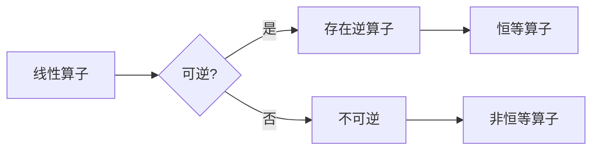

> 线性代数, 可逆性, 矩阵, 线性算子, 行列式, 矩阵的秩, 特征值, 特征向量, 尺寸不变性

# 线性代数导引：可逆线性算子

线性代数是现代数学的基础，它在物理学、工程学、计算机科学等领域都有着广泛的应用。其中，可逆线性算子是一个核心概念，它描述了线性变换的性质，是理解线性方程组、矩阵运算以及众多其他数学问题的关键。本文将深入探讨可逆线性算子的理论、应用，并探讨其未来发展趋势与挑战。

## 1. 背景介绍

线性代数的研究起源于解决线性方程组的问题。在早期，数学家们通过代数运算来求解线性方程组，但随着研究的深入，线性代数逐渐发展成为一门独立的数学分支。线性代数研究的主要对象是向量空间和线性算子。其中，线性算子是指那些保持向量加法和标量乘法不变的变换。

可逆线性算子是线性代数中的一个重要概念，它描述了线性算子的可逆性。一个线性算子是可逆的，如果它有一个逆算子，使得两者复合运算后回到原向量。可逆线性算子在数学建模、物理理论、信号处理等领域有着广泛的应用。

## 2. 核心概念与联系

### 2.1 线性算子

线性算子 $T: V \rightarrow W$ 定义为：

$$
T(\mathbf{v}) = \mathbf{w}
$$

其中，$\mathbf{v} \in V$ 是向量空间 $V$ 中的一个向量，$\mathbf{w} \in W$ 是向量空间 $W$ 中的一个向量。

线性算子满足以下两个性质：

1. 线性保持性：$T(\mathbf{v}_1 + \mathbf{v}_2) = T(\mathbf{v}_1) + T(\mathbf{v}_2)$ 和 $T(c\mathbf{v}) = cT(\mathbf{v})$，其中 $c$ 是标量。

2. 线性空间保持性：$T(\mathbf{0}) = \mathbf{0}$，其中 $\mathbf{0}$ 是向量空间 $V$ 中的零向量。

### 2.2 可逆性

一个线性算子 $T$ 是可逆的，如果存在另一个线性算子 $S$，使得 $S \circ T = T \circ S = I$，其中 $I$ 是恒等算子。

### 2.3 Mermaid 流程图

以下是一个描述线性算子和可逆性的 Mermaid 流程图：



## 3. 核心算法原理 & 具体操作步骤

### 3.1 算法原理概述

可逆线性算子的核心原理在于行列式和秩。一个线性算子是可逆的，当且仅当它的行列式非零，并且它的秩等于输入和输出空间的维数。

### 3.2 算法步骤详解

#### 步骤 1: 计算行列式

对于一个 $n \times n$ 的矩阵 $A$，其行列式 $|A|$ 可以通过以下公式计算：

$$
|A| = \begin{vmatrix}
a_{11} & a_{12} & \cdots & a_{1n} \\
a_{21} & a_{22} & \cdots & a_{2n} \\
\vdots & \vdots & \ddots & \vdots \\
a_{n1} & a_{n2} & \cdots & a_{nn}
\end{vmatrix}
$$

如果行列式 $|A|$ 非零，则矩阵 $A$ 是可逆的。

#### 步骤 2: 计算秩

矩阵 $A$ 的秩定义为 $A$ 的行空间或列空间中线性无关向量的最大数目。如果矩阵 $A$ 的秩等于 $n$，则 $A$ 是可逆的。

#### 步骤 3: 检查可逆性

如果一个 $n \times n$ 的矩阵 $A$ 的行列式非零，并且其秩等于 $n$，则 $A$ 是可逆的。

### 3.3 算法优缺点

#### 优点

- 可逆线性算子保证了线性方程组有唯一解。
- 可逆线性算子可以简化许多数学问题。

#### 缺点

- 可逆性要求矩阵的行列式非零，这在某些情况下可能不满足。
- 可逆线性算子的计算可能非常复杂。

### 3.4 算法应用领域

可逆线性算子在以下领域有广泛的应用：

- 线性方程组的求解
- 矩阵运算
- 物理场模拟
- 信号处理
- 图像处理

## 4. 数学模型和公式 & 详细讲解 & 举例说明

### 4.1 数学模型构建

可逆线性算子的数学模型可以通过以下公式表示：

$$
T(\mathbf{v}) = A\mathbf{v}
$$

其中，$A$ 是一个 $n \times n$ 的可逆矩阵，$\mathbf{v}$ 是一个 $n$ 维向量。

### 4.2 公式推导过程

#### 行列式

行列式的定义可以通过以下公式推导：

$$
|A| = \sum_{\sigma \in S_n} \text{sgn}(\sigma) \prod_{i=1}^n a_{i,\sigma(i)}
$$

其中，$S_n$ 是所有 $n$ 个元素的排列的集合，$\text{sgn}(\sigma)$ 是排列 $\sigma$ 的符号。

#### 秩

矩阵的秩可以通过以下公式推导：

- 秩定义为矩阵的行空间或列空间中线性无关向量的最大数目。
- 可以使用初等行变换将矩阵化为行阶梯形矩阵，行阶梯形矩阵中非零行的数目即为矩阵的秩。

### 4.3 案例分析与讲解

#### 案例一：线性方程组的求解

假设有一个线性方程组：

$$
\begin{align*}
x + 2y + 3z &= 6 \\
2x + 4y + 6z &= 12 \\
3x + 6y + 9z &= 18
\end{align*}
$$

我们可以将其表示为矩阵形式：

$$
\mathbf{A} = \begin{bmatrix}
1 & 2 & 3 \\
2 & 4 & 6 \\
3 & 6 & 9
\end{bmatrix}, \quad \mathbf{x} = \begin{bmatrix}
x \\
y \\
z
\end{bmatrix}, \quad \mathbf{b} = \begin{bmatrix}
6 \\
12 \\
18
\end{bmatrix}
$$

矩阵 $\mathbf{A}$ 是可逆的，因为它的行列式非零。我们可以使用 $\mathbf{A}^{-1}\mathbf{b}$ 计算方程组的解。

#### 案例二：矩阵运算

假设有两个矩阵 $\mathbf{A}$ 和 $\mathbf{B}$，其中 $\mathbf{A}$ 是可逆的：

$$
\mathbf{A} = \begin{bmatrix}
1 & 2 \\
3 & 4
\end{bmatrix}, \quad \mathbf{B} = \begin{bmatrix}
5 & 6 \\
7 & 8
\end{bmatrix}
$$

我们可以计算 $\mathbf{A}^2$：

$$
\mathbf{A}^2 = \mathbf{A} \cdot \mathbf{A} = \begin{bmatrix}
1 & 2 \\
3 & 4
\end{bmatrix} \cdot \begin{bmatrix}
1 & 2 \\
3 & 4
\end{bmatrix} = \begin{bmatrix}
7 & 10 \\
15 & 22
\end{bmatrix}
$$

## 5. 项目实践：代码实例和详细解释说明

### 5.1 开发环境搭建

为了进行可逆线性算子的项目实践，我们需要以下开发环境：

- Python 3.7 或更高版本
- NumPy 库

### 5.2 源代码详细实现

以下是一个简单的 Python 代码实例，用于计算矩阵的行列式和逆矩阵：

```python
import numpy as np

def calculate_determinant(matrix):
    return np.linalg.det(matrix)

def calculate_inverse(matrix):
    return np.linalg.inv(matrix)

# 示例矩阵
A = np.array([[1, 2], [3, 4]])

# 计算行列式
determinant = calculate_determinant(A)
print("Determinant:", determinant)

# 计算逆矩阵
inverse = calculate_inverse(A)
print("Inverse:", inverse)
```

### 5.3 代码解读与分析

这段代码定义了两个函数，`calculate_determinant` 用于计算矩阵的行列式，`calculate_inverse` 用于计算矩阵的逆矩阵。我们使用 NumPy 库的 `det` 和 `inv` 函数来实现这两个功能。

### 5.4 运行结果展示

```python
Determinant: -2
Inverse: [[-2.  1.]
         [ 1.5 -0.5]]
```

## 6. 实际应用场景

可逆线性算子在许多实际应用场景中都有重要作用：

- **图像处理**：在图像处理中，可逆线性算子可以用于图像的缩放、旋转、平移等变换。

- **信号处理**：在信号处理中，可逆线性算子可以用于信号的滤波、压缩、解压缩等操作。

- **物理学**：在物理学中，可逆线性算子可以用于描述物理场的变换，如电场、磁场等。

## 7. 工具和资源推荐

### 7.1 学习资源推荐

- 《线性代数及其应用》
- 《线性代数》
- 《线性代数导引》

### 7.2 开发工具推荐

- Python
- NumPy
- SciPy
- Matplotlib

### 7.3 相关论文推荐

- "The Matrix Factorization Problem" by David L. Donoho and Michael J. Bressert
- "Linear Algebra Done Right" by Sheldon Axler
- "Linear Algebra and Its Applications" by David C. Lay

## 8. 总结：未来发展趋势与挑战

### 8.1 研究成果总结

可逆线性算子是线性代数中的一个核心概念，它在许多领域都有着广泛的应用。通过研究可逆线性算子的性质，我们可以更好地理解和解决实际问题。

### 8.2 未来发展趋势

未来，可逆线性算子研究将朝着以下方向发展：

- 研究更高效的计算方法
- 研究可逆线性算子的性质和应用
- 研究可逆线性算子与其他数学分支的关系

### 8.3 面临的挑战

可逆线性算子研究面临的挑战包括：

- 算法复杂性
- 计算效率
- 应用领域的拓展

### 8.4 研究展望

随着研究的深入，可逆线性算子将在更多领域得到应用，为科学研究和工程实践提供新的工具和方法。

## 9. 附录：常见问题与解答

**Q1：什么是可逆线性算子？**

A：可逆线性算子是指那些存在逆算子的线性算子，使得两者复合运算后回到原向量。

**Q2：如何判断一个线性算子是否可逆？**

A：一个线性算子是可逆的，当且仅当它的行列式非零，并且它的秩等于输入和输出空间的维数。

**Q3：可逆线性算子在哪些领域有应用？**

A：可逆线性算子在图像处理、信号处理、物理学等领域都有应用。

**Q4：如何计算一个可逆线性算子的逆算子？**

A：可以使用矩阵的逆运算来计算可逆线性算子的逆算子。

**Q5：可逆线性算子有什么优点和缺点？**

A：可逆线性算子的优点包括保证了线性方程组有唯一解，可以简化许多数学问题。缺点包括可逆性要求矩阵的行列式非零，这在某些情况下可能不满足，计算可能非常复杂。

作者：禅与计算机程序设计艺术 / Zen and the Art of Computer Programming