# 自动机理论与人工智能的关系

> 关键词：自动机理论，人工智能，计算复杂性，形式化方法，算法设计，自然语言处理，机器学习

## 1. 背景介绍

自动机理论是计算机科学的基石之一，它研究计算系统的抽象模型和计算过程。自20世纪40年代图灵机的提出以来，自动机理论为理解计算的本质提供了强有力的工具。而人工智能（AI）作为计算机科学的一个分支，旨在创造能够模拟、延伸和扩展人类智能的理论、方法、技术和系统。本文将探讨自动机理论与人工智能之间的关系，分析它们在理论和技术上的相互影响。

### 1.1 问题的由来

自动机理论的研究成果在人工智能的发展中扮演了重要角色。从图灵机的概念到有限自动机的广泛应用，再到形式语言和编译原理的研究，自动机理论为AI的发展提供了理论基础。同时，人工智能技术的进步也为自动机理论带来了新的研究方向和应用场景。

### 1.2 研究现状

近年来，随着深度学习、机器学习等AI技术的快速发展，自动机理论与人工智能之间的关系愈发紧密。形式化方法在AI中的应用逐渐增多，而AI技术的进步也为自动机理论提供了新的研究对象。

### 1.3 研究意义

探讨自动机理论与人工智能之间的关系，有助于我们：

- 深入理解计算的本质，推动人工智能理论的发展。
- 为人工智能技术的应用提供坚实的理论基础。
- 促进自动机理论与人工智能技术的交叉融合。

### 1.4 本文结构

本文将分为以下几个部分：

- 介绍自动机理论与人工智能的核心概念和联系。
- 分析自动机理论在人工智能中的应用。
- 探讨人工智能对自动机理论的影响。
- 展望自动机理论与人工智能的未来发展趋势。

## 2. 核心概念与联系

### 2.1 核心概念

#### 2.1.1 自动机理论

自动机理论包括以下几个核心概念：

- **状态机（State Machine）**：由一组状态、一组输入、一组输出和一组转移函数组成。
- **有限自动机（Finite Automaton, FA）**：一种最简单的状态机，只能识别有限的语言。
- **图灵机（Turing Machine, TM）**：能够模拟任何可计算过程的理论计算模型。
- **形式语言（Formal Language）**：由一组符号组成的语言，可以形式化地定义和表示。

#### 2.1.2 人工智能

人工智能的核心概念包括：

- **智能体（Agent）**：能够感知环境并采取行动以实现目标的实体。
- **知识表示**：将知识以计算机可处理的形式表示出来。
- **推理（Reasoning）**：基于已有知识进行逻辑推理。
- **学习（Learning）**：通过经验改进智能体行为的能力。

### 2.2 联系

自动机理论与人工智能之间的联系主要体现在以下几个方面：

- **计算复杂性**：自动机理论中的计算复杂性理论是理解人工智能算法性能的基础。
- **形式化方法**：自动机理论为人工智能提供了形式化的分析方法，有助于验证和评估AI系统。
- **算法设计**：自动机理论中的算法设计思想可以应用于人工智能系统的开发。
- **自然语言处理**：自动机理论在自然语言处理领域得到了广泛应用，如词法分析、句法分析等。
- **机器学习**：自动机理论中的模型和算法可以用于机器学习中的特征提取和模式识别。

```mermaid
graph LR
    subgraph 自动机理论
        A[状态机] --> B{有限自动机}
        B --> C{图灵机}
        D[形式语言] --> E{计算复杂性}
    end

    subgraph 人工智能
        F[智能体] --> G{知识表示}
        H[推理] --> I[学习]
    end

    A --> J[计算复杂性]
    D --> K[形式化方法]
    B,C,E --> L[算法设计]
    B,C,E --> M[自然语言处理]
    B,C,E --> N[机器学习]
```



## 3. 核心算法原理 & 具体操作步骤

### 3.1 算法原理概述

#### 3.1.1 自动机理论算法

自动机理论中的核心算法包括：

- **有限自动机识别算法**：用于识别有限语言。
- **图灵机模拟算法**：用于模拟图灵机的计算过程。
- **形式化验证算法**：用于验证系统行为是否符合预期。

#### 3.1.2 人工智能算法

人工智能中的核心算法包括：

- **机器学习算法**：用于从数据中学习模型。
- **深度学习算法**：用于处理大规模数据集。
- **自然语言处理算法**：用于处理自然语言数据。

### 3.2 算法步骤详解

#### 3.2.1 自动机理论算法步骤

1. 定义自动机的状态、输入、输出和转移函数。
2. 设计识别算法，根据输入序列和转移函数，确定状态序列。
3. 根据状态序列和输出，判断输入序列是否属于目标语言。

#### 3.2.2 人工智能算法步骤

1. 收集数据集，并对数据进行预处理。
2. 选择合适的模型和算法。
3. 训练模型，调整模型参数。
4. 验证模型，评估模型性能。

### 3.3 算法优缺点

#### 3.3.1 自动机理论算法优缺点

- **优点**：理论性强，易于理解。
- **缺点**：实际应用场景有限，计算复杂度高。

#### 3.3.2 人工智能算法优缺点

- **优点**：能够处理复杂任务，性能强大。
- **缺点**：理论性相对较弱，模型可解释性差。

### 3.4 算法应用领域

#### 3.4.1 自动机理论应用领域

- **编译原理**：用于词法分析和句法分析。
- **网络协议**：用于验证网络协议的正确性。
- **软件工程**：用于验证软件系统的正确性。

#### 3.4.2 人工智能应用领域

- **自然语言处理**：用于文本分类、机器翻译、问答系统等。
- **图像处理**：用于图像识别、目标检测、图像生成等。
- **推荐系统**：用于推荐电影、音乐、商品等。

## 4. 数学模型和公式 & 详细讲解 & 举例说明

### 4.1 数学模型构建

#### 4.1.1 自动机理论数学模型

- **状态转移方程**：$Q(q_i, x) = \sum_{q_j \in Q} \delta(q_i, x, q_j)$
- **语言识别函数**：$L(Q, \Sigma, \delta, q_0, F) = \{w | \exists q_0, q_1, ..., q_n, q_{n+1} \in Q, w = x_1x_2...x_n, q_0 \xrightarrow{x_1} q_1 \xrightarrow{x_2} ... \xrightarrow{x_n} q_n, q_n \in F\}$

#### 4.1.2 人工智能数学模型

- **损失函数**：$L(\theta; x, y) = \frac{1}{N} \sum_{i=1}^N L(f_{\theta}(x_i), y_i)$
- **梯度下降算法**：$\theta_{t+1} = \theta_t - \alpha \nabla_{\theta}L(\theta_t; x, y)$

### 4.2 公式推导过程

#### 4.2.1 自动机理论公式推导

- **状态转移方程**：根据自动机的定义，状态转移方程描述了输入序列和转移函数对状态的影响。
- **语言识别函数**：根据自动机的定义，语言识别函数描述了输入序列是否属于目标语言。

#### 4.2.2 人工智能公式推导

- **损失函数**：损失函数用于衡量模型预测结果与真实标签之间的差异。
- **梯度下降算法**：梯度下降算法通过计算损失函数的梯度，更新模型参数。

### 4.3 案例分析与讲解

#### 4.3.1 自动机理论案例分析

以有限自动机为例，假设输入符号集合为 $\Sigma = \{0, 1\}$，状态集合为 $Q = \{q_0, q_1, q_2\}$，初始状态为 $q_0$，接受状态为 $q_1$ 和 $q_2$，转移函数为 $\delta$，如图所示：

```mermaid
graph LR
    q0 --> q1: 0
    q0 --> q2: 1
    q1 --> q2: 0
    q1 --> q1: 1
    q2 --> q2: 0
    q2 --> q1: 1
```

假设输入序列为 $w = 00101$，根据状态转移方程和语言识别函数，我们可以判断 $w$ 是否属于目标语言。

#### 4.3.2 人工智能案例分析

以线性回归为例，假设输入特征为 $x = [x_1, x_2]$，真实标签为 $y$，模型参数为 $\theta = [\theta_1, \theta_2]$，损失函数为均方误差损失，我们可以通过梯度下降算法更新模型参数，最小化损失函数。

## 5. 项目实践：代码实例和详细解释说明

### 5.1 开发环境搭建

为了进行自动机理论和人工智能的实践，我们需要搭建以下开发环境：

1. 操作系统：Windows/Linux/MacOS
2. 编程语言：Python
3. 库：PyTorch、NumPy、Matplotlib

### 5.2 源代码详细实现

以下是一个使用Python和PyTorch实现的线性回归模型示例：

```python
import torch
import torch.nn as nn
import torch.optim as optim
import matplotlib.pyplot as plt

# 定义线性回归模型
class LinearRegression(nn.Module):
    def __init__(self, input_dim, output_dim):
        super(LinearRegression, self).__init__()
        self.linear = nn.Linear(input_dim, output_dim)

    def forward(self, x):
        return self.linear(x)

# 创建数据集
x = torch.randn(100, 2)
y = torch.randn(100, 1) * 2 + x[:, 0] + torch.randn(100, 1)

# 创建模型、损失函数和优化器
model = LinearRegression(2, 1)
criterion = nn.MSELoss()
optimizer = optim.SGD(model.parameters(), lr=0.01)

# 训练模型
epochs = 100
for epoch in range(epochs):
    optimizer.zero_grad()
    outputs = model(x)
    loss = criterion(outputs, y)
    loss.backward()
    optimizer.step()

    if epoch % 10 == 0:
        print(f'Epoch {epoch+1}, Loss: {loss.item()}')

# 绘制结果
plt.scatter(x[:, 0], y[:, 0])
plt.plot(x[:, 0], outputs.data.numpy(), color='red')
plt.show()
```

### 5.3 代码解读与分析

以上代码首先定义了一个线性回归模型，然后创建了数据集、损失函数和优化器。在训练循环中，模型通过梯度下降算法更新参数，最小化损失函数。最后，使用matplotlib绘制了数据点和拟合曲线。

### 5.4 运行结果展示

运行上述代码，将得到如下结果：


从结果可以看出，线性回归模型成功地拟合了数据集。

## 6. 实际应用场景

### 6.1 自然语言处理

自动机理论和人工智能在自然语言处理领域有着广泛的应用，如：

- **词法分析**：使用有限自动机对文本进行词法分析，将文本分解为单词序列。
- **句法分析**：使用图灵机或其他语法分析方法对文本进行句法分析，理解句子的结构。
- **机器翻译**：使用深度学习模型将一种语言的文本翻译成另一种语言。

### 6.2 机器学习

自动机理论和人工智能在机器学习领域也有许多应用，如：

- **特征提取**：使用自动机理论中的模型提取数据特征，提高模型性能。
- **分类和回归**：使用机器学习算法对数据进行分类和回归分析。

### 6.3 推荐系统

自动机理论和人工智能在推荐系统领域也有应用，如：

- **协同过滤**：使用自动机理论中的模型分析用户行为数据，推荐相似用户或物品。
- **内容推荐**：使用深度学习模型分析用户兴趣，推荐用户可能感兴趣的物品。

## 7. 工具和资源推荐

### 7.1 学习资源推荐

- 《自动机理论及其应用》
- 《人工智能：一种现代的方法》
- 《深度学习》
- 《自然语言处理综论》

### 7.2 开发工具推荐

- Python
- PyTorch
- TensorFlow
- scikit-learn

### 7.3 相关论文推荐

- 《自动机理论及其应用》
- 《人工智能：一种现代的方法》
- 《深度学习》
- 《自然语言处理综论》

## 8. 总结：未来发展趋势与挑战

### 8.1 研究成果总结

自动机理论与人工智能之间的关系日益紧密，它们相互促进，共同推动了计算机科学的发展。自动机理论为人工智能提供了理论基础，而人工智能技术的进步也为自动机理论带来了新的研究方向和应用场景。

### 8.2 未来发展趋势

未来，自动机理论与人工智能将呈现以下发展趋势：

- **交叉融合**：自动机理论与人工智能将更加紧密地融合，产生新的研究方向和应用领域。
- **理论创新**：自动机理论将深入研究计算的本质，为人工智能提供更强的理论基础。
- **技术创新**：人工智能技术将不断创新，为自动机理论提供新的研究工具。

### 8.3 面临的挑战

尽管自动机理论与人工智能之间存在紧密的联系，但它们仍面临以下挑战：

- **理论基础**：自动机理论需要更加深入地研究计算的本质，为人工智能提供更强的理论基础。
- **技术难题**：人工智能技术需要解决诸如计算复杂性、模型可解释性、数据安全等问题。
- **应用挑战**：自动机理论与人工智能的应用需要解决诸如伦理、隐私、公平等问题。

### 8.4 研究展望

未来，自动机理论与人工智能将共同推动计算机科学的发展，为人类社会带来更多福祉。我们需要共同努力，克服挑战，不断探索和创新，为构建更加美好的未来贡献力量。

## 9. 附录：常见问题与解答

**Q1：自动机理论与人工智能有什么区别？**

A：自动机理论是研究计算系统抽象模型和计算过程的理论，而人工智能是研究如何让计算机模拟、延伸和扩展人类智能的理论、方法、技术和系统。自动机理论是人工智能的理论基础之一。

**Q2：自动机理论在人工智能中的应用有哪些？**

A：自动机理论在人工智能中的应用非常广泛，包括自然语言处理、机器学习、推荐系统等领域。

**Q3：人工智能对自动机理论有什么影响？**

A：人工智能技术的发展为自动机理论提供了新的研究方向和应用场景，推动了自动机理论的创新发展。

**Q4：如何学习自动机理论和人工智能？**

A：学习自动机理论和人工智能需要掌握以下知识：

- 计算机科学基础
- 离散数学
- 算法设计与分析
- 编程语言
- 机器学习
- 深度学习

**Q5：自动机理论与人工智能的未来发展趋势是什么？**

A：自动机理论与人工智能的未来发展趋势是交叉融合、理论创新和技术创新。它们将共同推动计算机科学的发展，为人类社会带来更多福祉。

---

作者：禅与计算机程序设计艺术 / Zen and the Art of Computer Programming