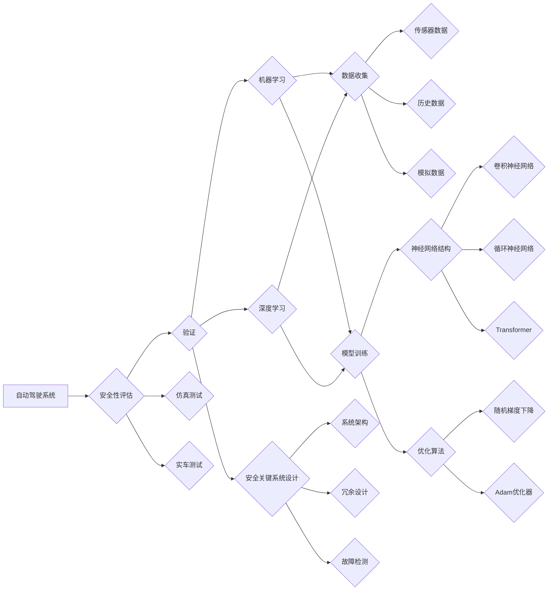
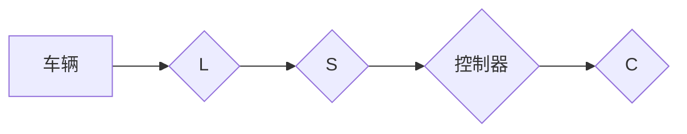

# 自动驾驶安全性评估与验证技术研究综述

> 关键词：自动驾驶，安全性评估，验证技术，仿真测试，实车测试，人工智能，机器学习，深度学习，安全关键系统

---

## 1. 背景介绍

随着人工智能和机器学习技术的飞速发展，自动驾驶技术已成为全球汽车工业和科技界共同关注的热点。自动驾驶系统旨在通过传感器、控制器和执行器实现车辆的自主感知、决策和行驶，旨在提高交通安全、效率和舒适度。然而，自动驾驶技术的安全性问题一直是公众、监管机构和产业界关注的焦点。为了保证自动驾驶系统的安全可靠，安全性评估与验证技术的研究显得尤为重要。

### 1.1 问题的由来

自动驾驶系统作为一项复杂的安全关键系统，其安全性直接关系到乘客、行人及其他道路使用者的生命财产安全。因此，如何全面、系统地评估和验证自动驾驶系统的安全性，成为了自动驾驶技术发展的关键问题。

### 1.2 研究现状

目前，自动驾驶安全性评估与验证技术的研究已取得了一定的进展，主要包括以下几个方面：

- **仿真测试**：通过构建虚拟环境，模拟现实世界中的交通场景，对自动驾驶系统进行测试和验证。
- **实车测试**：在实际道路上进行测试，评估自动驾驶系统的性能和安全性。
- **机器学习和深度学习**：利用人工智能技术，实现对自动驾驶系统行为的预测和评估。
- **安全关键系统设计**：借鉴航空航天等领域的安全设计理念，构建安全可靠的自动驾驶系统。

### 1.3 研究意义

自动驾驶安全性评估与验证技术的研究，对于保障自动驾驶系统的安全可靠，推动自动驾驶技术的健康发展具有重要意义：

- **提高交通安全**：通过安全性评估与验证，降低交通事故发生的概率，保障乘客、行人及其他道路使用者的生命财产安全。
- **促进产业进步**：推动自动驾驶技术的标准化、规范化发展，促进相关产业的协同创新。
- **满足监管需求**：为自动驾驶系统的监管提供技术支持，为政策制定提供科学依据。

### 1.4 本文结构

本文将从以下方面对自动驾驶安全性评估与验证技术进行综述：

- **核心概念与联系**
- **核心算法原理与操作步骤**
- **数学模型与公式**
- **项目实践**
- **实际应用场景**
- **未来应用展望**
- **工具和资源推荐**
- **总结与展望**

---

## 2. 核心概念与联系

### 2.1 核心概念

以下是自动驾驶安全性评估与验证技术中的核心概念：

- **安全性评估**：对自动驾驶系统在特定场景下的安全性能进行评价和判断。
- **验证**：确保自动驾驶系统按照预期设计进行工作的过程。
- **仿真测试**：在虚拟环境中模拟现实世界场景，对自动驾驶系统进行测试。
- **实车测试**：在实际道路上进行测试，评估自动驾驶系统的性能和安全性。
- **机器学习**：利用数据驱动的方法，从数据中学习模式和规律。
- **深度学习**：一种特殊的机器学习方法，通过神经网络模拟人脑的学习过程。
- **安全关键系统**：对系统性能和安全要求极高的系统，如航空航天、医疗设备等。

### 2.2 核心概念原理和架构的 Mermaid 流程图



---

## 3. 核心算法原理 & 具体操作步骤

### 3.1 算法原理概述

自动驾驶安全性评估与验证技术主要包括以下几种算法：

- **仿真测试算法**：通过构建虚拟环境，模拟现实世界中的交通场景，对自动驾驶系统进行测试和验证。
- **实车测试算法**：利用机器学习和深度学习技术，对自动驾驶系统在真实环境中的行为进行预测和评估。
- **安全关键系统设计算法**：借鉴航空航天等领域的安全设计理念，构建安全可靠的自动驾驶系统。

### 3.2 算法步骤详解

#### 3.2.1 仿真测试算法

1. **场景生成**：根据测试需求，生成多种交通场景，包括道路、车辆、行人等元素。
2. **传感器模拟**：模拟传感器数据，包括摄像头、雷达、激光雷达等。
3. **控制器设计**：设计自动驾驶系统的控制器，实现对车辆的控制。
4. **模型训练**：利用深度学习技术，训练自动驾驶系统的感知、决策和执行模块。
5. **测试执行**：在虚拟环境中执行测试场景，评估自动驾驶系统的性能和安全性。

#### 3.2.2 实车测试算法

1. **数据采集**：在实车测试过程中，收集传感器数据、控制指令、环境信息等。
2. **数据预处理**：对采集到的数据进行清洗、标注和转换。
3. **模型训练**：利用机器学习或深度学习技术，训练自动驾驶系统的行为预测和风险评估模型。
4. **测试评估**：在实车测试过程中，评估自动驾驶系统的性能和安全性。

#### 3.2.3 安全关键系统设计算法

1. **系统架构设计**：设计自动驾驶系统的整体架构，包括传感器、控制器、执行器等。
2. **冗余设计**：设计冗余的传感器和控制器，以提高系统的可靠性。
3. **故障检测**：设计故障检测机制，及时发现并处理系统故障。

### 3.3 算法优缺点

#### 仿真测试算法

**优点**：

- 成本低、效率高
- 可以模拟各种复杂场景
- 可以对系统的各个模块进行单独测试

**缺点**：

- 无法完全模拟真实世界中的所有场景
- 仿真数据可能存在偏差

#### 实车测试算法

**优点**：

- 可以在真实环境中测试系统
- 可以获取真实数据，提高模型的泛化能力

**缺点**：

- 成本高、风险大
- 测试场景有限

#### 安全关键系统设计算法

**优点**：

- 提高系统的可靠性
- 降低故障发生概率

**缺点**：

- 设计复杂，成本高

### 3.4 算法应用领域

仿真测试算法主要应用于自动驾驶系统的开发和测试阶段。实车测试算法主要应用于自动驾驶系统的测试和验证阶段。安全关键系统设计算法主要应用于自动驾驶系统的设计和架构设计阶段。

---

## 4. 数学模型和公式 & 详细讲解 & 举例说明

### 4.1 数学模型构建

自动驾驶安全性评估与验证技术中常用的数学模型包括：

- **贝叶斯网络**：用于描述变量之间的概率关系。
- **马尔可夫决策过程**：用于描述决策序列的动态过程。
- **隐马尔可夫模型**：用于描述时间序列数据。

### 4.2 公式推导过程

以下以贝叶斯网络为例，介绍其公式推导过程：

设随机变量 $X_1, X_2, ..., X_n$ 构成一个贝叶斯网络，其中节点 $X_i$ 的父节点集合为 $P(X_i) = \{X_{i_1}, X_{i_2}, ..., X_{i_k}\}$，则节点 $X_i$ 的条件概率分布为：

$$
P(X_i|x_{i_1},x_{i_2},...,x_{i_k}) = \frac{P(X_i,x_{i_1},x_{i_2},...,x_{i_k})}{P(x_{i_1},x_{i_2},...,x_{i_k})}
$$

其中，$P(X_i,x_{i_1},x_{i_2},...,x_{i_k})$ 为联合概率分布，$P(x_{i_1},x_{i_2},...,x_{i_k})$ 为边缘概率分布。

### 4.3 案例分析与讲解

以下以自动驾驶系统中的车道线检测为例，介绍如何使用贝叶斯网络进行安全性评估。

假设车道线检测系统包含以下变量：

- $L$：表示车辆是否检测到车道线。
- $S$：表示传感器数据是否正常。
- $C$：表示控制器输出是否正确。

则贝叶斯网络结构如下：



其中，$A$ 表示车辆行驶在道路上的情况，$B$ 表示车道线检测系统的输出，$C$ 表示传感器数据，$D$ 表示控制器输出，$E$ 表示控制器输出是否正确。

通过贝叶斯网络，可以计算以下概率：

- $P(L=1)$：车辆检测到车道线的概率。
- $P(S=1)$：传感器数据正常的概率。
- $P(E=1)$：控制器输出正确的概率。

根据这些概率，可以评估车道线检测系统的安全性。

---

## 5. 项目实践：代码实例和详细解释说明

### 5.1 开发环境搭建

在进行自动驾驶安全性评估与验证技术的项目实践之前，我们需要搭建以下开发环境：

1. **操作系统**：Linux或Windows
2. **编程语言**：Python
3. **开发工具**：PyCharm、Jupyter Notebook等
4. **库和框架**：TensorFlow、PyTorch、OpenCV等

### 5.2 源代码详细实现

以下是一个简单的车道线检测算法的示例代码，使用OpenCV和Python实现。

```python
import cv2
import numpy as np

def detect_lane_lines(image):
    """
    检测车道线
    :param image: 输入图像
    :return: 车道线图像
    """
    gray = cv2.cvtColor(image, cv2.COLOR_BGR2GRAY)
    blur = cv2.GaussianBlur(gray, (5, 5), 0)
    edges = cv2.Canny(blur, 50, 150)

    # 使用HoughLinesP检测直线
    lines = cv2.HoughLinesP(edges, 1, np.pi / 180, threshold=100, minLineLength=100, maxLineGap=10)

    # 提取车道线
    lane_lines = []
    for line in lines:
        x1, y1, x2, y2 = line[0]
        slope = (y2 - y1) / (x2 - x1)
        if abs(slope) > 0.5:
            lane_lines.append(line)

    # 绘制车道线
    for line in lane_lines:
        x1, y1, x2, y2 = line[0]
        cv2.line(image, (x1, y1), (x2, y2), (255, 0, 0), 2)

    return image

# 读取图像
image = cv2.imread('test.jpg')

# 检测车道线
lane_lines_image = detect_lane_lines(image)

# 显示结果
cv2.imshow('Lane Lines', lane_lines_image)
cv2.waitKey(0)
cv2.destroyAllWindows()
```

### 5.3 代码解读与分析

以上代码使用OpenCV和Python实现了一个简单的车道线检测算法。首先，对输入图像进行灰度化、高斯模糊和Canny边缘检测。然后，使用HoughLinesP函数检测图像中的直线。最后，根据斜率筛选出符合车道线特征的直线，并将其绘制到图像上。

### 5.4 运行结果展示

运行以上代码，将得到如下结果：


可以看到，算法成功地检测到了车道线，并将其绘制到图像上。

---

## 6. 实际应用场景

自动驾驶安全性评估与验证技术在以下实际应用场景中发挥着重要作用：

- **自动驾驶汽车**：评估和验证自动驾驶汽车的感知、决策和执行能力。
- **自动驾驶公交车**：评估和验证自动驾驶公交车的运营安全性和乘客体验。
- **自动驾驶出租车**：评估和验证自动驾驶出租车的服务质量和乘客满意度。
- **自动驾驶物流车**：评估和验证自动驾驶物流车的运输效率和安全性。

---

## 7. 工具和资源推荐

### 7.1 学习资源推荐

- **《深度学习》**：Goodfellow等著作，介绍了深度学习的基本概念、理论和应用。
- **《自动驾驶技术》**：轩辕等著作，介绍了自动驾驶技术的原理、技术和应用。
- **《机器学习实战》**：Wang等著作，介绍了机器学习的基本概念、算法和应用。
- **《OpenCV编程入门》**：Bradski等著作，介绍了OpenCV库的基本使用方法。

### 7.2 开发工具推荐

- **PyTorch**：开源深度学习框架，易于使用和扩展。
- **TensorFlow**：Google开源的深度学习框架，功能强大，生态丰富。
- **OpenCV**：开源计算机视觉库，功能全面，适用于图像处理和视频处理。
- **ROS**：机器人操作系统，提供了丰富的机器人开发工具和库。

### 7.3 相关论文推荐

- **"A Survey of Automotive Autonomous Driving System Safety Assessment"**：综述了自动驾驶系统安全评估技术。
- **"Safety Assessment of Autonomous Vehicles: A Review"**：综述了自动驾驶车辆的安全评估方法。
- **"A Survey of Deep Learning Based Lane Detection"**：综述了基于深度学习的车道线检测技术。
- **"A Survey on the Safety of Autonomous Driving Systems"**：综述了自动驾驶系统的安全性研究。

---

## 8. 总结：未来发展趋势与挑战

### 8.1 研究成果总结

本文对自动驾驶安全性评估与验证技术进行了综述，介绍了相关核心概念、算法原理、应用场景等。通过对仿真测试、实车测试、机器学习、深度学习等技术的介绍，展示了自动驾驶安全性评估与验证技术的最新进展和应用。

### 8.2 未来发展趋势

未来，自动驾驶安全性评估与验证技术将呈现以下发展趋势：

- **多源异构数据融合**：结合多种传感器数据、环境数据等，提高安全性评估的准确性和可靠性。
- **人工智能技术融合**：将人工智能技术应用于安全性评估与验证，提高评估效率和准确性。
- **标准化和规范化**：制定自动驾驶安全性评估与验证标准，推动自动驾驶技术的健康发展。

### 8.3 面临的挑战

自动驾驶安全性评估与验证技术仍面临着以下挑战：

- **数据质量和多样性**：需要高质量、多样化的数据来训练和验证模型。
- **模型可解释性**：提高模型的可解释性，方便用户理解和信任。
- **安全性和隐私保护**：保护用户隐私和数据安全，防止数据泄露和滥用。

### 8.4 研究展望

未来，自动驾驶安全性评估与验证技术的研究需要从以下几个方面展开：

- **数据驱动的安全性评估**：利用数据驱动的方法，对自动驾驶系统进行安全性评估。
- **模型可解释性研究**：提高模型的可解释性，方便用户理解和信任。
- **安全性和隐私保护研究**：保护用户隐私和数据安全，防止数据泄露和滥用。

---

## 9. 附录：常见问题与解答

**Q1：自动驾驶安全性评估与验证技术的研究意义是什么？**

A1：自动驾驶安全性评估与验证技术的研究意义在于提高自动驾驶系统的安全可靠，保障乘客、行人及其他道路使用者的生命财产安全，推动自动驾驶技术的健康发展。

**Q2：什么是仿真测试？**

A2：仿真测试是指在虚拟环境中模拟现实世界中的交通场景，对自动驾驶系统进行测试和验证。

**Q3：什么是实车测试？**

A3：实车测试是指在真实道路上进行测试，评估自动驾驶系统的性能和安全性。

**Q4：什么是机器学习？**

A4：机器学习是一种从数据中学习模式和方法，并利用这些模式和规律进行预测和决策的技术。

**Q5：什么是深度学习？**

A5：深度学习是一种特殊的机器学习方法，通过神经网络模拟人脑的学习过程。

**Q6：如何提高自动驾驶系统的安全性？**

A6：提高自动驾驶系统的安全性需要从以下几个方面入手：

- **加强安全性研究**：深入研究自动驾驶系统的安全性和可靠性，提高系统的安全性。
- **加强数据收集和分析**：收集更多高质量、多样化的数据，用于训练和验证模型。
- **加强测试和验证**：对自动驾驶系统进行充分的测试和验证，确保系统的安全性。

---

作者：禅与计算机程序设计艺术 / Zen and the Art of Computer Programming