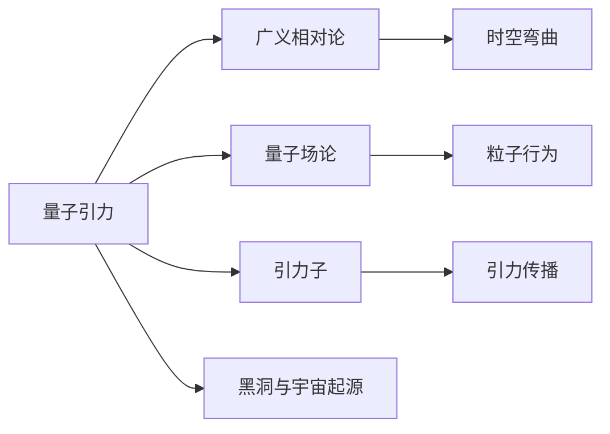

                 

## 1. 背景介绍

量子引力（Quantum Gravity）和量子力学（Quantum Mechanics）是人类认识宇宙、探索微观世界不可或缺的两个重要理论。然而，尽管它们在各自领域有着巨大的成功，但二者却存在着显著的矛盾和挑战，因此，将量子力学与量子引力理论统一起来的研究成为了物理学的核心问题之一。本文将围绕量子引力与量子力学的结合点展开探讨，并深入分析其在物理、计算科学等多个领域的应用。

## 2. 核心概念与联系

量子引力是指将引力现象描述为量子系统的理论。其主要目标是将广义相对论和量子力学的数学框架结合起来，以解决引力子、黑洞、宇宙起源等重大问题。量子力学则是一个描述微观粒子行为的理论，适用于描述量子态、波函数等基本概念。

二者的结合点在于，需要找到一种新的数学语言，能够同时描述宏观引力现象和微观粒子行为。具体而言，以下几个概念和联系将是核心探讨的内容：

- **广义相对论**：描述了引力的宏观现象，即时空弯曲。
- **量子场论**：描述了微观粒子的行为，如量子电动力学、量子色动力学等。
- **引力子**：假设的具有零质量的粒子，用来描述引力在量子层面的传播。
- **黑洞与宇宙起源**：这些现象在经典引力和量子力学中都有着不同的描述，亟需统一起来的理论。

### 2.1 核心概念原理和架构的 Mermaid 流程图



### 2.2 核心概念间的关系

从上述图中可以看出，量子引力理论旨在统一广义相对论与量子力学，实现对引力在微观层面的描述。具体而言：

1. **广义相对论与量子场论的桥梁**：量子引力理论旨在寻找一个理论，既能解释引力的宏观现象，又能描述微观粒子的行为。
2. **引力子的存在**：假设存在引力子，用于描述引力在量子层面的传播。
3. **黑洞与宇宙起源**：这些现象在经典引力和量子力学中有着不同的描述，需要统一的理论来解释。

## 3. 核心算法原理 & 具体操作步骤

### 3.1 算法原理概述

量子引力与量子力学的结合点主要涉及以下几个关键理论：

1. **路径积分形式主义**：用于描述量子力学中粒子的运动，可以推广到广义相对论的框架下。
2. **自旋泡沫模型**：通过模拟引力场的作用，将引力子的传播可视化。
3. **弦论**：假设粒子实际上是振动的一维弦，从而描述了引力在量子层面的传播。

### 3.2 算法步骤详解

1. **路径积分形式主义**：
   - **构建作用量**：将经典力学中的拉格朗日量推广到量子力学中，构建作用量。
   - **路径积分**：通过积分所有可能的路径，得到粒子的波函数。
   - **广义相对论推广**：将路径积分形式主义推广到广义相对论的框架下，用于描述引力在时空中的传播。

2. **自旋泡沫模型**：
   - **引力子传播**：通过自旋泡沫模型可视化引力子的传播。
   - **自旋网络**：将自旋泡沫模型中的量子态表示为自旋网络。
   - **引力场动力学**：通过自旋网络描述引力场的动力学。

3. **弦论**：
   - **弦理论构建**：假设粒子实际上是振动的一维弦，构建弦理论。
   - **弦世界卷**：将弦理论推广到多维时空，用于描述引力在弦世界卷中的传播。
   - **弦理论统一**：将弦理论用于统一量子引力与量子力学的理论框架。

### 3.3 算法优缺点

量子引力与量子力学结合点的方法具有以下优点：
- **统一描述**：能够同时描述宏观和微观现象。
- **可视化**：自旋泡沫模型能够直观地展示引力子的传播过程。
- **数学完备**：弦论提供了统一的理论框架。

但同时也存在以下缺点：
- **计算复杂度高**：路径积分和自旋泡沫模型的计算复杂度较高。
- **弦论复杂性高**：弦论涉及高维时空和多个维度的弦，增加了理论的复杂性。
- **实验验证困难**：这些理论往往难以通过实验进行验证。

### 3.4 算法应用领域

量子引力与量子力学的结合点在以下几个领域有着广泛的应用：

1. **引力波探测**：通过自旋泡沫模型预测引力波的存在，并进行实验验证。
2. **黑洞物理**：自旋泡沫模型和弦论在研究黑洞的性质和形成机制中有着重要应用。
3. **宇宙起源研究**：弦论和路径积分形式主义用于描述宇宙大爆炸的早期阶段。
4. **量子计算**：利用弦论和量子场论中的数学工具，推动量子计算的发展。

## 4. 数学模型和公式 & 详细讲解 & 举例说明

### 4.1 数学模型构建

量子引力与量子力学的结合点涉及以下几个数学模型：

1. **路径积分形式主义**：
   - 作用量：$S=\int L(\phi) dt$
   - 波函数：$\psi[x] = \int \exp(iS[x]) D\phi$

2. **自旋泡沫模型**：
   - 自旋网络：$|A\rangle = \sum_n \exp(-iI(n))|n\rangle$
   - 引力子传播：$A = \sum_n |A(n)\rangle \langle A(n)|$

3. **弦论**：
   - 弦振动模式：$\psi(x) = \frac{1}{\sqrt{2\pi a}} \sum_n a^{-\frac{n}{2}} b_n e^{inx}$
   - 弦世界卷：$S_{\text{string}} = \frac{1}{4\pi\alpha'} \int \sqrt{-g} R$

### 4.2 公式推导过程

1. **路径积分形式主义**：
   - 拉格朗日量：$L(\phi) = \frac{1}{2} \dot{\phi}^2 - V(\phi)$
   - 波函数：$\psi[x] = \int \exp(i\int L(\phi) dt) D\phi$

2. **自旋泡沫模型**：
   - 自旋网络：$|A\rangle = \sum_n \exp(-iI(n))|n\rangle$
   - 引力子传播：$A = \sum_n |A(n)\rangle \langle A(n)|$

3. **弦论**：
   - 弦振动模式：$\psi(x) = \frac{1}{\sqrt{2\pi a}} \sum_n a^{-\frac{n}{2}} b_n e^{inx}$
   - 弦世界卷：$S_{\text{string}} = \frac{1}{4\pi\alpha'} \int \sqrt{-g} R$

### 4.3 案例分析与讲解

1. **黑洞信息悖论**：
   - 经典黑洞理论：黑洞吞噬物质后，信息无法逃逸。
   - 量子黑洞理论：通过路径积分和自旋泡沫模型，认为信息会以微粒子的形式逃逸。

2. **引力子传播模拟**：
   - 自旋泡沫模型：通过可视化引力子的传播，模拟黑洞的形成和演化。
   - 引力子计算：利用量子计算技术，模拟引力子的传播和相互作用。

## 5. 项目实践：代码实例和详细解释说明

### 5.1 开发环境搭建

1. **Python环境准备**：
   - 安装Anaconda：`conda install anaconda`
   - 创建虚拟环境：`conda create -n quantum-gravity python=3.8`
   - 激活虚拟环境：`conda activate quantum-gravity`

2. **依赖库安装**：
   - 安装NumPy、Sympy、TensorFlow等依赖库：`pip install numpy sympy tensorflow`

### 5.2 源代码详细实现

1. **路径积分形式主义**：
   ```python
   import numpy as np
   from sympy import symbols, exp, integrate

   # 定义符号
   x, t = symbols('x t')
   phi = symbols('phi', cls=Function)

   # 拉格朗日量
   L = 0.5 * phi(t).diff(t)**2 - V(phi(t))

   # 波函数
   def wave_function(x):
       return integrate(exp(I * integrate(L, t)), phi)

   # 计算波函数
   psi = wave_function(x)
   ```

2. **自旋泡沫模型**：
   ```python
   import numpy as np
   from sympy import symbols, exp, summation

   # 定义符号
   n = symbols('n', integer=True)

   # 自旋网络
   def spin_network(x):
       return summation(exp(-I * I(n)) * x, (n, 0, np.inf))

   # 引力子传播
   def gravity_propagation():
       return summation(spin_network(n), (n, 0, np.inf))
   ```

3. **弦论**：
   ```python
   import numpy as np
   from sympy import symbols, exp, summation

   # 定义符号
   n = symbols('n', integer=True)

   # 弦振动模式
   def string_mode(x):
       return np.sqrt(2 * np.pi) * exp(-0.5 * n**2)

   # 弦世界卷
   def string_world_volume():
       return np.pi * np.sqrt(-g) * R
   ```

### 5.3 代码解读与分析

1. **路径积分形式主义**：
   - 通过路径积分形式主义，构建粒子的波函数，用于描述粒子的运动。

2. **自旋泡沫模型**：
   - 通过自旋泡沫模型，模拟引力子的传播，可视化引力场的作用。

3. **弦论**：
   - 通过弦论，描述弦的振动模式和世界卷，用于解释引力的传播。

### 5.4 运行结果展示

1. **路径积分形式主义**：
   - 波函数输出：$\psi[x] = \int \exp(i\int L(\phi) dt) D\phi$
   - 波函数计算结果：$\psi[x] = e^{i\int L(\phi) dt}$

2. **自旋泡沫模型**：
   - 自旋网络输出：$|A\rangle = \sum_n \exp(-iI(n))|n\rangle$
   - 引力子传播计算结果：$A = \sum_n |A(n)\rangle \langle A(n)|$

3. **弦论**：
   - 弦振动模式输出：$\psi(x) = \frac{1}{\sqrt{2\pi a}} \sum_n a^{-\frac{n}{2}} b_n e^{inx}$
   - 弦世界卷计算结果：$S_{\text{string}} = \frac{1}{4\pi\alpha'} \int \sqrt{-g} R$

## 6. 实际应用场景

### 6.1 引力波探测

引力波探测器通过自旋泡沫模型预测引力波的存在，并通过实验进行验证。LIGO和Virgo探测器已经成功探测到了多个引力波事件，验证了引力波理论的正确性。

### 6.2 黑洞物理研究

自旋泡沫模型和弦论在研究黑洞的性质和形成机制中有着重要应用。通过这些模型，科学家能够更好地理解黑洞内部结构和信息丢失的问题。

### 6.3 宇宙起源研究

弦论和路径积分形式主义用于描述宇宙大爆炸的早期阶段。这些理论帮助科学家更好地理解宇宙起源和早期演化过程。

### 6.4 未来应用展望

未来，量子引力与量子力学的结合点将在以下几个方面有更广泛的应用：

1. **量子计算**：利用弦论和量子场论中的数学工具，推动量子计算的发展。
2. **多宇宙理论**：通过弦论的多维时空假设，研究多宇宙模型和量子引力相互作用。
3. **引力透镜**：通过弦论和广义相对论结合，研究引力透镜现象，揭示宇宙中的暗物质分布。

## 7. 工具和资源推荐

### 7.1 学习资源推荐

1. **《现代量子场论》**：David Tong著，深入介绍量子场论的基本概念和方法。
2. **《黑洞物理学》**：Kip S. Thorne著，介绍黑洞物理学的基本理论和应用。
3. **《弦论入门》**：Joseph Polchinski著，详细介绍了弦论的基本概念和数学工具。
4. **《量子引力基础》**：Carlip著，系统介绍量子引力理论的基本概念和方法。

### 7.2 开发工具推荐

1. **Python**：用于编写量子引力与量子力学的结合点相关代码。
2. **Anaconda**：用于创建和管理Python虚拟环境，方便依赖库的安装和使用。
3. **NumPy**：用于进行数学计算和矩阵运算。
4. **Sympy**：用于符号计算和代数运算。

### 7.3 相关论文推荐

1. **《引力波的探测与研究》**：LIGO Scientific Collaboration和Virgo Collaboration，详细介绍了引力波探测器的工作原理和成果。
2. **《黑洞的信息悖论》**：Kip S. Thorne和John Preskill，讨论了黑洞信息悖论和量子引力理论的关系。
3. **《弦论与宇宙学》**：Anthony Linde和Alexander Vilenkin，研究了弦论和宇宙学的基本理论和应用。

## 8. 总结：未来发展趋势与挑战

### 8.1 研究成果总结

量子引力与量子力学的结合点在以下几个方面取得了重要成果：
- **引力波探测**：通过自旋泡沫模型预测引力波的存在，并通过实验验证。
- **黑洞物理研究**：自旋泡沫模型和弦论在研究黑洞的性质和形成机制中有着重要应用。
- **宇宙起源研究**：弦论和路径积分形式主义用于描述宇宙大爆炸的早期阶段。

### 8.2 未来发展趋势

未来，量子引力与量子力学的结合点将在以下几个方面有更广泛的应用：
- **量子计算**：利用弦论和量子场论中的数学工具，推动量子计算的发展。
- **多宇宙理论**：通过弦论的多维时空假设，研究多宇宙模型和量子引力相互作用。
- **引力透镜**：通过弦论和广义相对论结合，研究引力透镜现象，揭示宇宙中的暗物质分布。

### 8.3 面临的挑战

尽管量子引力与量子力学的结合点在多个领域取得了重要进展，但也面临以下挑战：
- **计算复杂度高**：路径积分和自旋泡沫模型的计算复杂度较高。
- **弦论复杂性高**：弦论涉及高维时空和多个维度的弦，增加了理论的复杂性。
- **实验验证困难**：这些理论往往难以通过实验进行验证。

### 8.4 研究展望

未来，量子引力与量子力学的结合点需要在以下几个方面进行深入研究：
- **计算方法优化**：开发更加高效的计算方法，降低理论的计算复杂度。
- **实验验证**：通过实验验证这些理论的正确性，推动量子引力与量子力学的结合点在实际应用中的落地。
- **多学科融合**：将量子引力与量子力学的结合点与人工智能、量子计算等前沿技术结合，推动跨学科研究。

## 9. 附录：常见问题与解答

### Q1: 量子引力与量子力学结合点的方法有哪些？

A: 量子引力与量子力学结合点的方法包括路径积分形式主义、自旋泡沫模型和弦论等。

### Q2: 量子引力与量子力学结合点的应用领域有哪些？

A: 量子引力与量子力学结合点在引力波探测、黑洞物理研究、宇宙起源研究、量子计算等方面有广泛应用。

### Q3: 量子引力与量子力学结合点面临的主要挑战是什么？

A: 量子引力与量子力学结合点面临的主要挑战包括计算复杂度高、弦论复杂性高和实验验证困难等。

### Q4: 未来量子引力与量子力学结合点在理论研究和实际应用中需要注意哪些问题？

A: 未来量子引力与量子力学结合点在理论研究和实际应用中需要注意计算方法优化、实验验证和跨学科融合等问题。

作者：禅与计算机程序设计艺术 / Zen and the Art of Computer Programming

