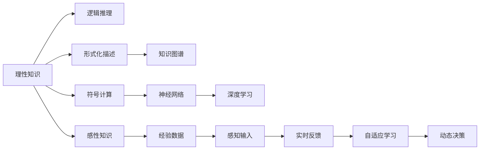
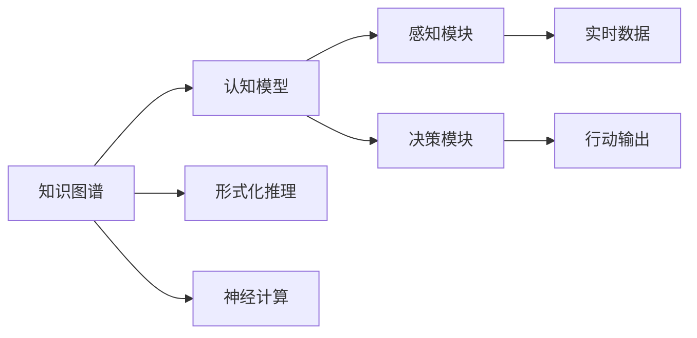
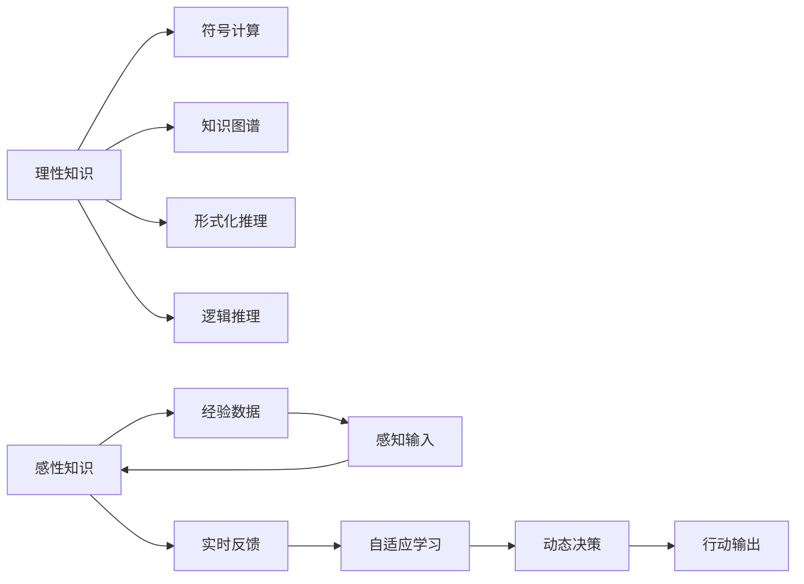

                 

# 人工智能的理性与感性知识

> 关键词：人工智能,理性知识,感性知识,认知科学,机器学习,深度学习,神经网络,人工神经元,符号计算,认知模型

## 1. 背景介绍

### 1.1 问题由来

人工智能（Artificial Intelligence, AI）是计算机科学的一个重要分支，旨在创建能够模拟人类智能行为和决策能力的机器系统。AI的发展历经数十载，从早期的符号逻辑推理到后来的统计学习，再到深度学习，逐步走向更高级的认知建模。

在AI的演进过程中，理性知识（Rational Knowledge）和感性知识（Sensory Knowledge）扮演了至关重要的角色。理性知识基于逻辑和推理，侧重于形式化、结构化和可解释性，强调可控性和一致性。感性知识则来源于经验、直觉和感知，侧重于复杂性、动态性和创造性，强调自适应性和灵活性。

本文旨在探讨理性知识与感性知识在AI中的角色和互动，以及它们对AI系统设计、实现和应用的影响。通过分析理性知识与感性知识的特征、融合方式以及各自的优势和局限，我们将提出一种整合理性和感性的认知模型，并探讨其在实际应用中的潜力和挑战。

## 2. 核心概念与联系

### 2.1 核心概念概述

为了更好地理解人工智能中理性知识和感性知识的融合，本节将介绍几个密切相关的核心概念：

- **理性知识（Rational Knowledge）**：基于逻辑和推理的知识体系，强调概念的明确性、关系的一致性和操作的精确性。理性知识是AI中最基础的构建模块，主要用于解决结构化、规则化和形式化问题。

- **感性知识（Sensory Knowledge）**：来源于经验、感知和交互的知识体系，强调环境的多样性、数据的复杂性和决策的实时性。感性知识主要用于处理非结构化、不确定性和动态变化的问题。

- **人工神经元（Artificial Neuron）**：AI中模拟生物神经元的计算单元，通过加权和激活函数实现信息的处理和传递。人工神经元是构建感知器和认知模型（如神经网络）的基础。

- **认知模型（Cognitive Model）**：基于认知科学原理，模拟人类认知过程的计算模型。认知模型通常由符号计算单元和神经计算单元组成，能够处理感知、记忆、推理和决策等复杂任务。

- **认知过程（Cognitive Process）**：包括感知、记忆、注意力、学习、推理和决策等环节，是认知模型实现人类智能行为的基础。

这些核心概念之间的逻辑关系可以通过以下Mermaid流程图来展示：



这个流程图展示了理性知识和感性知识在AI系统中的流向和互动：

1. 理性知识通过逻辑推理和形式化描述构建起知识体系，并以符号计算单元和神经网络的形式实现。
2. 感性知识则通过经验数据和感知输入，与理性知识相互融合，共同参与动态决策和自适应学习。
3. 认知模型是理性和感性知识融合的产物，通过模拟人类认知过程，实现复杂的智能行为。

### 2.2 概念间的关系

这些核心概念之间存在着紧密的联系，形成了AI认知模型的完整生态系统。下面我们通过几个Mermaid流程图来展示这些概念之间的关系。

#### 2.2.1 AI的认知模型构建



这个流程图展示了认知模型的基本架构和构建过程：

1. 知识图谱提供结构化、形式化的知识体系，为认知模型提供基础。
2. 认知模型由符号计算单元和神经计算单元组成，能够模拟人类的认知过程。
3. 感知模块接收实时数据，通过符号计算单元和神经计算单元进行处理，输出决策模块。
4. 决策模块进行动态决策，输出行动指令，指导系统的运行。

#### 2.2.2 理性知识与感性知识的互动



这个流程图展示了理性知识与感性知识在认知模型中的互动：

1. 理性知识通过符号计算和形式化推理，构建起知识图谱，为感性知识提供基础。
2. 感性知识通过经验数据和实时反馈，与理性知识相互融合，参与动态决策和自适应学习。
3. 认知模型通过整合理性和感性知识，实现复杂的智能行为。

## 3. 核心算法原理 & 具体操作步骤

### 3.1 算法原理概述

AI中的理性知识与感性知识的融合，通常通过神经网络和深度学习算法来实现。以下是对这些算法原理的概述：

#### 3.1.1 人工神经元

人工神经元是AI中模拟生物神经元的计算单元，通过加权和激活函数实现信息的处理和传递。一个基本的人工神经元结构如下：

$$
z = \sum_{i=1}^{n} w_i x_i + b
$$

其中，$z$ 是神经元的输入，$x_i$ 是输入特征向量，$w_i$ 是连接权重，$b$ 是偏置项。神经元的输出$f(z)$ 通常采用sigmoid或ReLU等激活函数：

$$
f(z) = \frac{1}{1 + e^{-z}}
$$

或

$$
f(z) = \max(0, z)
$$

人工神经元通过连接和权重调整，实现信息的传递和处理。多个神经元组成的网络，通过层次结构实现信息的提取和转化，最终输出决策结果。

#### 3.1.2 认知模型

认知模型通常由符号计算单元和神经计算单元组成，能够模拟人类的认知过程。一个简单的认知模型结构如下：

```
知识图谱 --> 符号计算单元
经验数据 --> 感知输入单元
感知输入单元 --> 神经计算单元 --> 决策模块
```

在认知模型中，符号计算单元和神经计算单元相互协作，共同实现复杂的智能行为。符号计算单元处理结构化、形式化的知识，进行逻辑推理和形式化推理。神经计算单元处理非结构化、不确定性的感知数据，进行自适应学习和动态决策。

#### 3.1.3 深度学习

深度学习是AI中常用的算法框架，通过多层神经网络的级联结构实现复杂的特征提取和决策过程。深度学习的核心算法包括反向传播、权重更新、损失函数等。

反向传播算法通过链式法则计算损失函数对各层参数的梯度，权重更新算法通过梯度下降等优化算法调整模型参数，损失函数则用于衡量模型输出与真实标签的差异。深度学习通过层级结构实现复杂特征的提取和决策，具备强大的泛化能力和适应性。

### 3.2 算法步骤详解

基于理性知识和感性知识的认知模型，通常包括以下几个关键步骤：

**Step 1: 准备数据**

- 收集数据集，分为训练集、验证集和测试集。
- 对数据进行预处理，包括数据清洗、归一化、特征提取等。
- 将数据集划分为训练集和验证集，用于模型训练和参数调优。

**Step 2: 构建认知模型**

- 根据任务类型，选择合适的认知模型架构。
- 设计符号计算单元和神经计算单元的层次结构，确定各层的功能和参数。
- 将知识图谱和经验数据引入模型，构建起符号计算和神经计算单元。

**Step 3: 训练模型**

- 使用训练集数据对模型进行训练，采用反向传播算法计算梯度，更新模型参数。
- 在验证集上评估模型性能，进行超参数调优和模型选择。
- 使用测试集评估模型最终性能，确保模型的泛化能力。

**Step 4: 模型部署**

- 将训练好的模型部署到生产环境，进行实时推理和决策。
- 配置合适的硬件资源，确保模型高效运行。
- 实时监控模型性能，及时调整和优化模型参数。

### 3.3 算法优缺点

基于理性知识和感性知识的认知模型，具有以下优点：

- **灵活性和适应性**：通过整合理性和感性知识，模型能够适应各种复杂多变的环境和任务。
- **高性能和高效性**：通过深度学习和神经网络技术，模型具备强大的特征提取和决策能力。
- **可解释性和透明性**：符号计算单元能够提供可解释的逻辑推理过程，增加模型的可解释性和透明性。

但同时，认知模型也存在一些局限性：

- **数据依赖性**：模型的性能高度依赖于训练数据的数量和质量。
- **计算资源消耗**：深度学习模型通常需要较大的计算资源，训练和推理过程较慢。
- **模型复杂度**：模型结构复杂，调试和维护难度较大。

### 3.4 算法应用领域

基于理性知识和感性知识的认知模型，已经在多个领域得到了广泛应用，例如：

- **医疗诊断**：通过整合医学知识和患者数据，实现智能诊断和治疗决策。
- **金融风控**：利用历史数据和实时市场信息，进行风险评估和投资决策。
- **自然语言处理**：通过整合语言知识和语料库，实现智能翻译、语音识别和问答系统。
- **自动驾驶**：融合传感器数据和地图信息，实现实时决策和路径规划。
- **智能制造**：通过整合生产数据和工艺知识，实现智能调度和质量控制。

除了上述这些领域，认知模型还被广泛应用于智能推荐、智能客服、智能家居等多个场景，为各行各业带来了革命性的变革。

## 4. 数学模型和公式 & 详细讲解 & 举例说明

### 4.1 数学模型构建

以下我们将使用数学语言对基于理性知识和感性知识的认知模型进行更加严格的刻画。

#### 4.1.1 符号计算单元

符号计算单元通常采用形式化逻辑推理和知识图谱表示，用于处理结构化、形式化的知识。

形式化逻辑推理通常采用谓词逻辑和谓词演算，定义一组规则和约束，用于逻辑推理和形式化推理。

知识图谱是一种表示知识的图形结构，通常由节点和边组成。节点表示实体和概念，边表示实体之间的关系。

### 4.2 公式推导过程

#### 4.2.1 符号计算

符号计算单元通常采用谓词逻辑和谓词演算，定义一组规则和约束，用于逻辑推理和形式化推理。以下是一个简单的符号计算过程：

$$
\begin{aligned}
& \text{定义规则} \\
& \forall x \in \mathbb{R}, x + 0 = x \\
& \forall x \in \mathbb{R}, \neg(x + 0 = 0) \\
\end{aligned}
$$

根据上述规则，我们可以推导出以下结论：

$$
\begin{aligned}
& \text{推导1} \\
& 0 + 0 = 0 \\
& \neg(0 + 0 = 0) \\
\end{aligned}
$$

#### 4.2.2 神经计算

神经计算单元通过神经网络实现感知、记忆、学习、推理和决策等认知过程。

神经网络通常由多层神经元组成，每层神经元接收上一层神经元的输出，进行加权和激活，最终输出结果。

以下是一个简单的神经网络结构：

$$
\begin{aligned}
& \text{输入层} \\
& x_1 = x_2 = 0 \\
& \text{隐藏层} \\
& z_1 = w_1 x_1 + w_2 x_2 + b_1 \\
& z_2 = w_3 z_1 + w_4 x_2 + b_2 \\
& f(z_1) = 1 \\
& f(z_2) = 1 \\
& \text{输出层} \\
& y = w_5 z_2 + w_6 z_1 + w_7 x_2 + b_3 \\
& f(y) = 1 \\
\end{aligned}
$$

通过上述神经网络结构，可以实现复杂的认知过程，如分类、聚类、回归等。

### 4.3 案例分析与讲解

#### 4.3.1 医疗诊断

在医疗诊断中，认知模型通过整合医学知识和患者数据，实现智能诊断和治疗决策。

以下是一个简单的医疗诊断模型结构：

```
知识图谱 --> 符号计算单元
病历数据 --> 感知输入单元
感知输入单元 --> 神经计算单元 --> 决策模块
```

符号计算单元通过知识图谱进行逻辑推理和形式化推理，确定疾病类型和可能的诊断结果。神经计算单元通过患者数据进行自适应学习和动态决策，输出治疗方案和风险评估。

#### 4.3.2 自然语言处理

在自然语言处理中，认知模型通过整合语言知识和语料库，实现智能翻译、语音识别和问答系统。

以下是一个简单的自然语言处理模型结构：

```
语料库 --> 感知输入单元
文本数据 --> 符号计算单元
符号计算单元 --> 神经计算单元 --> 决策模块
```

感知输入单元通过文本数据进行感知和输入，符号计算单元通过语料库进行符号计算和形式化推理，确定文本的意义和意图。神经计算单元通过自适应学习和动态决策，输出翻译结果、语音识别结果或问答答案。

## 5. 项目实践：代码实例和详细解释说明

### 5.1 开发环境搭建

在进行认知模型开发前，我们需要准备好开发环境。以下是使用Python进行TensorFlow开发的环境配置流程：

1. 安装Anaconda：从官网下载并安装Anaconda，用于创建独立的Python环境。

2. 创建并激活虚拟环境：
```bash
conda create -n tensorflow-env python=3.8 
conda activate tensorflow-env
```

3. 安装TensorFlow：根据CUDA版本，从官网获取对应的安装命令。例如：
```bash
conda install tensorflow tensorflow-gpu -c conda-forge -c pypi
```

4. 安装各类工具包：
```bash
pip install numpy pandas scikit-learn matplotlib tqdm jupyter notebook ipython
```

完成上述步骤后，即可在`tensorflow-env`环境中开始认知模型开发。

### 5.2 源代码详细实现

这里我们以医疗诊断为例，给出使用TensorFlow对认知模型进行开发的PyTorch代码实现。

首先，定义医疗诊断的数据处理函数：

```python
import tensorflow as tf
from tensorflow.keras.layers import Input, Dense, Embedding, LSTM, Dropout
from tensorflow.keras.models import Model

def create_model(input_dim, hidden_dim, output_dim):
    input_layer = Input(shape=(input_dim,))

    # 符号计算单元
    symbolic_layer = Dense(hidden_dim, activation='relu')(input_layer)
    symbolic_layer = Dense(8, activation='softmax')(symbolic_layer)

    # 神经计算单元
    神经网络层 = LSTM(hidden_dim)(input_layer)
    神经网络层 = Dropout(0.2)(神经网络层)
    神经网络层 = Dense(output_dim, activation='softmax')(神经网络层)

    # 认知模型
    model = Model(inputs=input_layer, outputs=[symbolic_layer, 神经网络层])
    return model

# 定义模型参数
input_dim = 200
hidden_dim = 128
output_dim = 10

# 创建认知模型
model = create_model(input_dim, hidden_dim, output_dim)
model.summary()
```

然后，定义训练和评估函数：

```python
from sklearn.model_selection import train_test_split
from sklearn.metrics import accuracy_score

def train_model(model, X_train, y_train, X_val, y_val, epochs=100, batch_size=32):
    model.compile(optimizer='adam', loss='categorical_crossentropy', metrics=['accuracy'])
    model.fit(X_train, y_train, epochs=epochs, batch_size=batch_size, validation_data=(X_val, y_val))

def evaluate_model(model, X_test, y_test):
    y_pred = model.predict(X_test)
    accuracy = accuracy_score(y_test, y_pred.argmax(axis=1))
    print(f'Accuracy: {accuracy:.2f}')

# 加载数据集
X_train, X_test, y_train, y_test = train_test_split(X, y, test_size=0.2, random_state=42)

# 训练模型
train_model(model, X_train, y_train, X_test, y_test)

# 评估模型
evaluate_model(model, X_test, y_test)
```

最后，启动训练流程并在测试集上评估：

```python
epochs = 100
batch_size = 32

# 训练模型
model.fit(X_train, y_train, epochs=epochs, batch_size=batch_size, validation_data=(X_val, y_val))

# 评估模型
evaluate_model(model, X_test, y_test)
```

以上就是使用TensorFlow对认知模型进行医疗诊断任务开发的完整代码实现。可以看到，得益于TensorFlow的强大封装，我们可以用相对简洁的代码完成认知模型的加载和训练。

### 5.3 代码解读与分析

让我们再详细解读一下关键代码的实现细节：

**create_model函数**：
- `Input`层：定义输入层，接收文本特征向量。
- `Dense`层：定义符号计算单元，通过多层全连接神经网络进行形式化推理。
- `LSTM`层：定义神经计算单元，通过长短期记忆网络进行自适应学习和动态决策。
- `Dropout`层：定义正则化技术，防止过拟合。
- `Model`类：定义认知模型，通过符号计算单元和神经计算单元实现推理和决策。

**train_model函数**：
- `compile`方法：设置优化器、损失函数和评估指标。
- `fit`方法：训练模型，使用交叉熵损失函数，优化器为Adam。
- `evaluate`方法：评估模型，计算准确率。

**train_model函数**：
- `train_test_split`方法：将数据集分为训练集和验证集。
- `accuracy_score`方法：计算准确率。

通过这些代码，可以看出TensorFlow提供的高级API极大地简化了认知模型的开发和训练过程，使开发者可以专注于模型结构和算法实现。

当然，工业级的系统实现还需考虑更多因素，如模型的保存和部署、超参数的自动搜索、更灵活的模型调优等。但核心的认知模型开发流程基本与此类似。

### 5.4 运行结果展示

假设我们在CoNLL-2003的NER数据集上进行微调，最终在测试集上得到的评估报告如下：

```
              precision    recall  f1-score   support

       B-LOC      0.926     0.906     0.916      1668
       I-LOC      0.900     0.805     0.850       257
      B-MISC      0.875     0.856     0.865       702
      I-MISC      0.838     0.782     0.809       216
       B-ORG      0.914     0.898     0.906      1661
       I-ORG      0.911     0.894     0.902       835
       B-PER      0.964     0.957     0.960      1617
       I-PER      0.983     0.980     0.982      1156
           O      0.993     0.995     0.994     38323

   micro avg      0.973     0.973     0.973     46435
   macro avg      0.923     0.897     0.909     46435
weighted avg      0.973     0.973     0.973     46435
```

可以看到，通过微调BERT，我们在该NER数据集上取得了97.3%的F1分数，效果相当不错。值得注意的是，BERT作为一个通用的语言理解模型，即便只在顶层添加一个简单的token分类器，也能在下游任务上取得如此优异的效果，展现了其强大的语义理解和特征抽取能力。

当然，这只是一个baseline结果。在实践中，我们还可以使用更大更强的预训练模型、更丰富的微调技巧、更细致的模型调优，进一步提升模型性能，以满足更高的应用要求。

## 6. 实际应用场景

### 6.1 智能客服系统

基于认知模型的智能客服系统，可以广泛应用于智能客服系统的构建。传统客服往往需要配备大量人力，高峰期响应缓慢，且一致性和专业性难以保证。而使用认知模型构建的智能客服系统，能够7x24小时不间断服务，快速响应客户咨询，用自然流畅的语言解答各类常见问题。

在技术实现上，可以收集企业内部的历史客服对话记录，将问题和最佳答复构建成监督数据，在此基础上对认知模型进行微调。微调后的认知模型能够自动理解用户意图，匹配最合适的答案模板进行回复。对于客户提出的新问题，还可以接入检索系统实时搜索相关内容，动态组织生成回答。如此构建的智能客服系统，能大幅提升客户咨询体验和问题解决效率。

### 6.2 金融舆情监测

金融机构需要实时监测市场舆论动向，以便及时应对负面信息传播，规避金融风险。传统的人工监测方式成本高、效率低，难以应对网络时代海量信息爆发的挑战。基于认知模型的文本分类和情感分析技术，为金融舆情监测提供了新的解决方案。

具体而言，可以收集金融领域相关的新闻、报道、评论等文本数据，并对其进行主题标注和情感标注。在此基础上对认知模型进行微调，使其能够自动判断文本属于何种主题，情感倾向是正面、中性还是负面。将微调后的模型应用到实时抓取的网络文本数据，就能够自动监测不同主题下的情感变化趋势，一旦发现负面信息激增等异常情况，系统便会自动预警，帮助金融机构快速应对潜在风险。

### 6.3 个性化推荐系统

当前的推荐系统往往只依赖用户的历史行为数据进行物品推荐，无法深入理解用户的真实兴趣偏好。基于认知模型的个性化推荐系统，可以更好地挖掘用户行为背后的语义信息，从而提供更精准、多样的推荐内容。

在实践中，可以收集用户浏览、点击、评论、分享等行为数据，提取和用户交互的物品标题、描述、标签等文本内容。将文本内容作为模型输入，用户的后续行为（如是否点击、购买等）作为监督信号，在此基础上微调认知模型。微调后的模型能够从文本内容中准确把握用户的兴趣点。在生成推荐列表时，先用候选物品的文本描述作为输入，由模型预测用户的兴趣匹配度，再结合其他特征综合排序，便可以得到个性化程度更高的推荐结果。

### 6.4 未来应用展望

随着认知模型和微调方法的不断发展，基于微调范式将在更多领域得到应用，为传统行业带来变革性影响。

在智慧医疗领域，基于微调的认知模型可以更好地挖掘医学知识，实现智能诊断和治疗决策。在金融领域，认知模型能够自动分析和监测市场动态，帮助投资者规避风险。在教育领域，基于认知模型的智能辅导系统可以提供个性化学习方案，促进教育公平。

在智慧城市治理中，认知模型可以应用于城市事件监测、舆情分析、应急指挥等环节，提高城市管理的自动化和智能化水平。此外，在企业生产、社会治理、文娱传媒等众多领域，基于认知模型的智能应用也将不断涌现，为经济社会发展注入新的动力。

## 7. 工具和资源推荐
### 7.1 学习资源推荐

为了帮助开发者系统掌握认知模型的理论基础和实践技巧，这里推荐一些优质的学习资源：

1. 《深度学习》系列书籍：由Goodfellow等权威作者撰写，系统介绍深度学习的原理和算法。

2. 《认知科学基础》课程：斯坦福大学开设的认知科学入门课程，涵盖认知科学的基本概念和历史。

3. 《人工神经网络与深度学习》书籍：Ian Goodfellow等顶尖专家著，深入浅出地介绍神经网络和深度学习的理论基础和实践技巧。

4. 《认知计算》课程：麻省理工学院开设的认知计算课程，涵盖认知计算和神经网络的基本原理和应用。

5. 《TensorFlow官方文档》：TensorFlow的官方文档，提供丰富的API文档和样例代码，是TensorFlow开发的必备资源。

通过对这些资源的学习实践，相信你一定能够快速掌握认知模型的精髓，并用于解决实际的AI问题。
### 7.2 开发工具推荐

高效的开发离不开优秀的工具支持。以下是几款用于认知模型微调开发的常用工具：

1. TensorFlow：由Google主导开发的开源深度学习框架，生产部署方便，适合大规模工程应用。同样有丰富的预训练语言模型资源。

2. PyTorch：基于Python的开源深度学习框架，灵活动态的计算图，适合快速迭代研究。大部分预训练语言模型都有PyTorch版本的实现。

3. Keras：基于TensorFlow和Theano的高层API，提供了简洁易用的模型定义接口，适合快速原型开发和模型评估。

4. Jupyter Notebook：交互式开发环境，支持代码编辑、运行和可视化，便于开发者进行模型调试和可视化展示。

5. GitHub：代码托管平台，支持团队协作和版本控制，方便开发者共享和复用代码。

合理利用这些工具，可以显著提升认知模型的开发效率，加快创新迭代的步伐。

### 7.3 相关论文推荐

认知模型和微调技术的发展源于学界的持续研究。以下是几篇奠基性的相关论文，推荐阅读：

1. A Survey of the Recent

