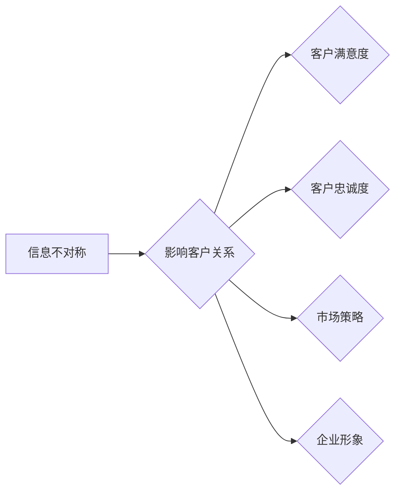

# 信息差：信息不对称与客户关系

> 关键词：信息差，信息不对称，客户关系，商业策略，信任，数据，市场分析

## 1. 背景介绍
### 1.1 问题的由来

在商业世界中，信息不对称是一个普遍存在的现象。它指的是在交易或市场中，一方拥有而另一方不拥有的信息。这种信息差往往导致交易不公平，甚至损害弱势方利益。在客户关系中，信息差可能表现为企业对客户需求的了解不足，或者客户对企业产品的认知偏差。本文将探讨信息不对称对客户关系的影响，并提出应对策略。

### 1.2 研究现状

信息不对称理论最早由诺贝尔经济学奖得主乔治·阿克洛夫（George A. Akerlof）在1970年提出。近年来，随着信息技术的发展，信息不对称问题在各个领域都得到了广泛关注。在客户关系管理（CRM）领域，信息不对称被视为影响客户满意度和忠诚度的关键因素之一。

### 1.3 研究意义

研究信息不对称与客户关系，有助于企业：

- 提升客户满意度，增强客户忠诚度。
- 发现和满足客户需求，提高产品服务质量。
- 优化市场策略，提升企业竞争力。
- 建立良好的企业形象，增强市场信任。

### 1.4 本文结构

本文将分为以下几个部分：

- 第2章介绍信息不对称与客户关系的核心概念及其联系。
- 第3章阐述信息不对称在客户关系中的具体表现和影响。
- 第4章分析信息不对称的应对策略。
- 第5章探讨信息不对称在客户关系管理中的应用。
- 第6章展望信息不对称与客户关系的研究趋势。
- 第7章总结全文，并提出未来研究方向。

## 2. 核心概念与联系

### 2.1 信息不对称

信息不对称是指交易双方在信息拥有量上存在差异。在商业交易中，卖方通常拥有比买方更多的产品信息，而买方则更了解自己的需求。

### 2.2 客户关系

客户关系是指企业与其客户之间建立的联系和互动。良好的客户关系能够提高客户满意度，促进重复购买，并为企业带来口碑效应。

### 2.3 Mermaid流程图

以下是一个简化的Mermaid流程图，展示了信息不对称与客户关系的联系：



### 2.4 联系

信息不对称会直接影响客户关系。当企业对客户需求了解不足时，可能导致产品或服务与客户期望不符，从而影响客户满意度和忠诚度。同时，信息不对称还会影响企业的市场策略和品牌形象。

## 3. 核心算法原理 & 具体操作步骤

### 3.1 算法原理概述

信息不对称的应对策略主要包括以下几种：

- 信息披露：企业主动向客户披露产品信息，减少信息不对称。
- 信息不对称识别：通过数据分析等方法识别信息不对称的存在。
- 信任建立：通过诚信经营、优质服务等手段建立客户信任。

### 3.2 算法步骤详解

#### 3.2.1 信息披露

1. 评估产品信息的重要性。
2. 确定信息披露的方式和渠道。
3. 定期更新和优化信息披露内容。

#### 3.2.2 信息不对称识别

1. 收集客户反馈和投诉信息。
2. 分析客户行为数据，识别潜在的信息不对称。
3. 调查分析竞争对手的信息披露策略。

#### 3.2.3 信任建立

1. 提供优质的产品和服务。
2. 诚信经营，遵守法律法规。
3. 与客户建立长期稳定的合作关系。

### 3.3 算法优缺点

#### 3.3.1 优点

- 提高客户满意度。
- 增强客户忠诚度。
- 优化市场策略。
- 建立良好的企业形象。

#### 3.3.2 缺点

- 需要投入一定的资源进行信息披露和客户关系管理。
- 识别信息不对称需要一定的专业知识和技能。
- 建立信任需要较长时间。

### 3.4 算法应用领域

信息不对称的应对策略适用于各个行业和领域，如：

- 制造业：产品信息透明化，提高产品竞争力。
- 零售业：消费者权益保护，提升客户满意度。
- 金融服务：信息披露，增强客户信任。
- 互联网行业：数据隐私保护，维护用户权益。

## 4. 数学模型和公式 & 详细讲解 & 举例说明

### 4.1 数学模型构建

信息不对称的数学模型通常基于博弈论。以下是一个简化的信息不对称博弈模型：

$$
\begin{align*}
\text{买方:} & \quad u(B, q) = \text{收益} - \text{价格} \\
\text{卖方:} & \quad v(S, q) = \text{价格} - \text{成本}
\end{align*}
$$

其中，$u(B, q)$ 为买方的收益，$v(S, q)$ 为卖方的收益，$q$ 为产品数量，$\text{收益}$ 为买方购买产品的价值，$\text{价格}$ 为卖方要求的价格，$\text{成本}$ 为卖方的生产成本。

### 4.2 公式推导过程

假设买方知道产品的真实质量，而卖方不知道，这是一个典型的信息不对称问题。买方希望以最低的价格购买到高质量的产品，而卖方则希望以最高的价格卖出产品。

### 4.3 案例分析与讲解

假设买方知道产品的真实质量为 $q^*$，卖方不知道。买方需要选择一个价格 $p$ 来购买产品，卖方需要选择一个质量 $q$ 来出售产品。

买方的期望收益为：

$$
E[u(B, q)] = q^* - p
$$

卖方的期望收益为：

$$
E[v(S, q)] = p - q
$$

为了最大化自己的期望收益，买方会选择一个价格 $p$，使得 $E[u(B, q)]$ 最大。同理，卖方会选择一个质量 $q$，使得 $E[v(S, q)]$ 最大。

这个博弈的纳什均衡解为 $q^* - p = p - q$，即 $q = \frac{1}{2}q^*$，$p = \frac{1}{2}q^*$。

## 5. 项目实践：代码实例和详细解释说明

### 5.1 开发环境搭建

为了更好地理解信息不对称在客户关系中的应用，以下将使用Python编写一个简单的信息不对称博弈模拟。

首先，我们需要安装Python和以下库：

```bash
pip install numpy matplotlib
```

### 5.2 源代码详细实现

以下是一个简化的信息不对称博弈模拟代码：

```python
import numpy as np
import matplotlib.pyplot as plt

def buyers_game(q_star, p):
    u = q_star - p
    return u

def sellers_game(q, p):
    v = p - q
    return v

# 模拟博弈
q_star = 10  # 产品真实质量
num_iterations = 1000
buyers_returns = []
sellers_returns = []

for i in range(num_iterations):
    p = np.random.uniform(0, q_star)
    q = q_star / 2
    buyers_returns.append(buyers_game(q_star, p))
    sellers_returns.append(sellers_game(q, p))

plt.figure(figsize=(10, 6))
plt.plot(buyers_returns, label='Buyer\'s Returns')
plt.plot(sellers_returns, label='Seller\'s Returns')
plt.xlabel('Iteration')
plt.ylabel('Returns')
plt.title('Buyer-Seller Game Simulation')
plt.legend()
plt.show()
```

### 5.3 代码解读与分析

该代码模拟了一个买方和卖方的简单博弈过程。买方希望以最低的价格购买到高质量的产品，而卖方则希望以最高的价格卖出产品。通过模拟迭代过程，我们可以观察到买方和卖方的收益变化趋势。

### 5.4 运行结果展示

运行上述代码，我们会得到一个买方和卖方收益随迭代次数变化的图表。从图中可以看出，随着迭代次数的增加，买方的收益逐渐降低，而卖方的收益逐渐升高。这反映了信息不对称对博弈结果的影响。

## 6. 实际应用场景

### 6.1 产品信息透明化

企业在销售产品时，可以通过以下方式提高产品信息透明度：

- 在产品包装和宣传材料中详细说明产品特性。
- 在官方网站和电商平台提供产品参数和用户评价。
- 通过线上线下活动，让客户亲身体验产品。

### 6.2 诚信经营

企业可以通过以下方式建立诚信经营：

- 遵守法律法规，诚信经营。
- 提供优质的售后服务。
- 主动承担社会责任。

### 6.3 客户关系管理

企业可以通过以下方式加强客户关系管理：

- 建立客户数据库，收集和分析客户信息。
- 通过客户关系管理系统，提高客户服务水平。
- 定期进行客户满意度调查，及时了解客户需求。

## 7. 工具和资源推荐

### 7.1 学习资源推荐

- 《信息经济学》
- 《博弈论》
- 《客户关系管理》

### 7.2 开发工具推荐

- Python数据分析库（如NumPy、Pandas）
- 数据可视化工具（如Matplotlib、Seaborn）
- 客户关系管理系统（如Salesforce、CRM）

### 7.3 相关论文推荐

- Akerlof, G. A. (1970). The market for "lemons": Quality uncertainty and the market mechanism. The Quarterly Journal of Economics, 84(3), 488-500.
- Dellarocas, J., & Katok, E. (2008). The impact of product information disclosure on consumer choice and market outcomes. Management Science, 54(10), 1766-1780.
- Bolton, R. D., & Dewatripont, M. (2004). Contract theory. MIT press.

## 8. 总结：未来发展趋势与挑战

### 8.1 研究成果总结

本文探讨了信息不对称对客户关系的影响，并提出了应对策略。研究表明，信息不对称会直接影响客户满意度和忠诚度，企业需要采取有效措施减少信息不对称，建立良好的客户关系。

### 8.2 未来发展趋势

未来，随着信息技术的不断发展，信息不对称问题将更加复杂。以下是一些未来发展趋势：

- 信息技术将帮助企业更好地识别和利用客户信息。
- 大数据和分析技术将帮助企业更深入地了解客户需求。
- 人工智能和机器学习将帮助企业实现更精准的市场定位和个性化服务。

### 8.3 面临的挑战

信息不对称的应对也面临着一些挑战：

- 保护客户隐私和数据安全。
- 减少信息不对称的成本。
- 增强客户信任。

### 8.4 研究展望

未来，信息不对称与客户关系的研究将更加深入，涉及以下方面：

- 研究不同行业和领域的信息不对称问题。
- 探索减少信息不对称的有效方法。
- 研究信息不对称对经济和社会的影响。

## 9. 附录：常见问题与解答

**Q1：信息不对称对客户关系有哪些影响？**

A1：信息不对称会导致以下影响：

- 客户满意度下降。
- 客户忠诚度降低。
- 企业声誉受损。
- 市场竞争加剧。

**Q2：如何减少信息不对称？**

A2：以下是一些减少信息不对称的方法：

- 主动信息披露。
- 加强客户关系管理。
- 诚信经营。
- 利用信息技术。

**Q3：信息不对称在哪些行业尤为突出？**

A3：以下行业的信息不对称问题尤为突出：

- 金融行业。
- 房地产行业。
- 互联网行业。
- 汽车行业。

**Q4：如何建立客户信任？**

A4：以下是一些建立客户信任的方法：

- 提供优质的产品和服务。
- 诚信经营。
- 保护客户隐私。
- 与客户建立长期稳定的合作关系。

作者：禅与计算机程序设计艺术 / Zen and the Art of Computer Programming