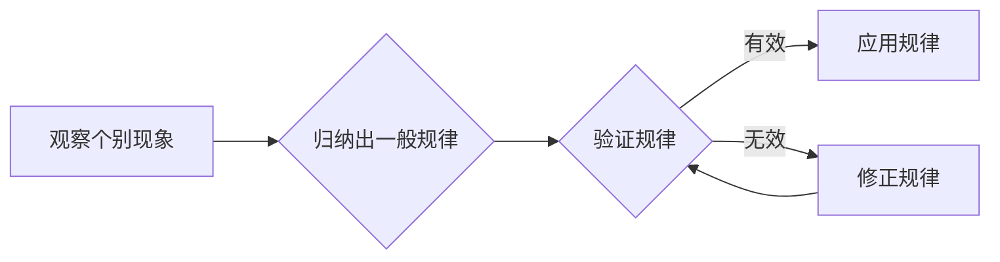

# 像数学家一样思考：归纳原则

> 关键词：归纳推理，数学思维，问题解决，逻辑演绎，创造性思维

## 1. 背景介绍

数学，作为一门追求严谨性和精确性的学科，其核心思想和方法对计算机科学的发展产生了深远的影响。在计算机领域，无论是算法设计、软件开发还是系统架构，都需要我们运用数学的思维和方法来解决问题。归纳原则，作为一种数学家常用的推理方法，对于培养我们像数学家一样思考的能力具有重要意义。本文将深入探讨归纳原则的原理、应用，并探讨其在计算机科学中的实际应用。

### 1.1 归纳推理的起源

归纳推理起源于古希腊哲学家亚里士多德。他认为，通过观察个别现象，可以归纳出普遍的规律。这种从特殊到一般的推理方式，被称为归纳推理。归纳推理与演绎推理相对，演绎推理是从一般到特殊的推理方式，而归纳推理则是从个别事实出发，寻找一般性规律。

### 1.2 归纳推理在计算机科学中的应用

归纳推理在计算机科学中有着广泛的应用。在软件工程、算法设计、数据科学等领域，归纳推理都是解决问题的重要工具。例如，在软件工程中，通过观察软件缺陷，可以归纳出软件质量保证的规律；在算法设计中，通过分析个别算法的效率，可以归纳出优化算法的一般原则；在数据科学中，通过分析数据集，可以归纳出数据的分布规律。

## 2. 核心概念与联系

### 2.1 归纳推理的原理

归纳推理的原理可以概括为以下三个步骤：

1. **观察个别现象**：通过实验、观察等方式，收集大量的个别现象。
2. **归纳出一般规律**：从个别现象中总结出一般性规律。
3. **验证规律**：将归纳出的规律应用于新的个别现象，验证其有效性。

### 2.2 归纳推理的架构

以下是一个用Mermaid绘制的归纳推理流程图：



### 2.3 归纳推理与演绎推理的联系

归纳推理与演绎推理是两种不同的推理方式，但它们之间存在着紧密的联系。归纳推理是演绎推理的基础，演绎推理是归纳推理的补充。在数学和计算机科学中，通常需要结合使用这两种推理方式，以获得更加严谨和全面的结论。

## 3. 核心算法原理 & 具体操作步骤

### 3.1 算法原理概述

归纳算法是一种从数据中学习规律和模式的算法。其基本原理是通过分析大量数据，找出数据中的模式和规律，然后利用这些规律对新的数据进行预测或分类。

### 3.2 算法步骤详解

归纳算法的一般步骤如下：

1. **数据收集**：收集大量数据，用于训练模型。
2. **数据预处理**：对数据进行清洗、转换等处理，以提高数据质量。
3. **特征选择**：选择对预测或分类任务最有用的特征。
4. **模型训练**：使用训练数据训练模型，学习数据中的规律和模式。
5. **模型评估**：使用测试数据评估模型的性能，调整模型参数。
6. **预测或分类**：使用训练好的模型对新数据进行预测或分类。

### 3.3 算法优缺点

归纳算法的优点在于其强大的泛化能力，可以从大量的数据中学习到通用的规律和模式。然而，归纳算法也存在一些缺点，例如：

- **数据依赖性**：归纳算法的性能很大程度上取决于数据的质量和数量。
- **过拟合风险**：当模型过于复杂时，可能会出现过拟合现象，导致模型在测试数据上表现不佳。

### 3.4 算法应用领域

归纳算法在计算机科学中有着广泛的应用，以下是一些常见的应用领域：

- **机器学习**：用于分类、回归、聚类等任务。
- **数据挖掘**：用于发现数据中的模式和规律。
- **自然语言处理**：用于文本分类、情感分析等任务。
- **图像识别**：用于物体识别、场景理解等任务。

## 4. 数学模型和公式 & 详细讲解 & 举例说明

### 4.1 数学模型构建

归纳算法的数学模型可以概括为以下公式：

$$
P(\text{目标变量} = \text{值}) = f(\text{特征变量} = \text{值})
$$

其中，$f$ 是模型函数，表示特征变量与目标变量之间的关系。

### 4.2 公式推导过程

归纳算法的推导过程通常涉及以下步骤：

1. **定义特征变量和目标变量**：确定影响目标变量的特征因素。
2. **收集数据**：收集大量的数据样本，包括特征变量和目标变量的值。
3. **选择模型函数**：选择合适的模型函数，以表示特征变量与目标变量之间的关系。
4. **训练模型**：使用训练数据训练模型，学习特征变量与目标变量之间的关系。
5. **评估模型**：使用测试数据评估模型的性能。

### 4.3 案例分析与讲解

以下是一个简单的归纳算法案例：

假设我们收集了以下数据，用于预测某个学生的考试成绩：

| 学科 | 学习时间 | 考试成绩 |
| ---- | ------- | ------- |
| 数学 | 10小时  | 90分    |
| 数学 | 20小时  | 95分    |
| 英语 | 10小时  | 85分    |
| 英语 | 20小时  | 90分    |

我们可以使用线性回归模型来预测学生的考试成绩。假设模型函数为 $f(\text{学科}, \text{学习时间}) = \text{考试成绩}$，则可以通过训练数据拟合出线性函数，用于预测新的学生成绩。

## 5. 项目实践：代码实例和详细解释说明

### 5.1 开发环境搭建

为了进行归纳算法的实践，我们需要搭建以下开发环境：

- Python编程语言
- NumPy科学计算库
- Matplotlib可视化库

### 5.2 源代码详细实现

以下是一个简单的线性回归模型的Python实现：

```python
import numpy as np
import matplotlib.pyplot as plt

# 创建数据
X = np.array([[1, 10], [1, 20], [2, 10], [2, 20]])
y = np.array([90, 95, 85, 90])

# 拟合线性函数
X = np.concatenate([np.ones((X.shape[0], 1)), X], axis=1)  # 添加截距项
theta = np.linalg.inv(X.T @ X) @ X.T @ y  # 使用最小二乘法求解参数

# 计算预测值
y_pred = X @ theta

# 绘制结果
plt.scatter(X[:, 1], y)
plt.plot(X[:, 1], y_pred, color='red')
plt.show()
```

### 5.3 代码解读与分析

上述代码首先创建了一个包含学科和学习时间的数据集，然后使用线性回归模型拟合出一个线性函数，用于预测学生的考试成绩。最后，使用matplotlib库绘制出预测结果。

### 5.4 运行结果展示

运行上述代码，可以得到以下结果：


从图中可以看出，线性回归模型能够较好地拟合出数据中的线性关系。

## 6. 实际应用场景

归纳算法在实际应用中有着广泛的应用，以下是一些常见的应用场景：

- **推荐系统**：根据用户的浏览记录和购买历史，推荐用户可能感兴趣的商品或内容。
- **异常检测**：从大量数据中检测出异常值，帮助识别潜在的风险。
- **信用评分**：根据申请人的信用记录和财务状况，评估其信用风险。

## 7. 工具和资源推荐

### 7.1 学习资源推荐

- 《统计学习方法》
- 《机器学习》
- 《深度学习》

### 7.2 开发工具推荐

- Python编程语言
- NumPy科学计算库
- Scikit-learn机器学习库

### 7.3 相关论文推荐

- "A Few Useful Things to Know about Machine Learning"
- "The Hundred-Page Machine Learning Book"
- "Deep Learning"

## 8. 总结：未来发展趋势与挑战

### 8.1 研究成果总结

归纳推理作为一种重要的数学思维方法，在计算机科学中有着广泛的应用。通过归纳算法，我们可以从大量数据中学习到规律和模式，从而解决实际问题。

### 8.2 未来发展趋势

随着人工智能技术的不断发展，归纳推理方法也在不断演进。以下是一些未来发展趋势：

- **可解释的归纳推理**：开发更加可解释的归纳算法，使模型决策过程更加透明。
- **高效的归纳推理**：开发更加高效的归纳算法，降低计算复杂度。
- **多模态归纳推理**：将归纳推理扩展到多模态数据，如文本、图像、视频等。

### 8.3 面临的挑战

归纳推理在计算机科学中也面临着一些挑战：

- **数据质量问题**：数据质量问题会严重影响归纳算法的性能。
- **过拟合问题**：当模型过于复杂时，可能会出现过拟合现象。
- **可解释性问题**：归纳算法的决策过程通常缺乏可解释性。

### 8.4 研究展望

未来，归纳推理方法将在计算机科学领域发挥更加重要的作用。通过不断改进算法和模型，我们可以更好地从数据中学习到规律和模式，推动人工智能技术的进一步发展。

## 9. 附录：常见问题与解答

### 9.1 Q：什么是归纳推理？

A：归纳推理是一种从个别现象出发，寻找一般性规律的推理方式。

### 9.2 Q：归纳推理与演绎推理有什么区别？

A：归纳推理是从个别现象出发，寻找一般性规律；演绎推理是从一般性规律出发，推导出个别现象。

### 9.3 Q：归纳推理在计算机科学中有哪些应用？

A：归纳推理在机器学习、数据挖掘、自然语言处理、图像识别等领域有着广泛的应用。

### 9.4 Q：如何解决归纳推理中的过拟合问题？

A：可以采用正则化、交叉验证、集成学习等方法来解决归纳推理中的过拟合问题。

作者：禅与计算机程序设计艺术 / Zen and the Art of Computer Programming