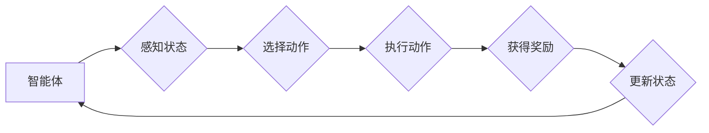

# 增强学习 原理与代码实例讲解

> 关键词：增强学习，强化学习，奖励，策略，价值函数，Q学习，SARSA，深度强化学习，DQN，DDPG

## 1. 背景介绍

增强学习（Reinforcement Learning，RL）是机器学习领域的一个重要分支，它通过智能体与环境的交互来学习最优策略。与监督学习和无监督学习不同，增强学习中的学习目标是最大化长期累积奖励。近年来，随着深度学习技术的快速发展，深度强化学习（Deep Reinforcement Learning，DRL）成为研究热点，并在游戏、机器人、自动驾驶等领域取得了显著的成果。

## 2. 核心概念与联系

### 2.1 核心概念原理

增强学习的核心概念包括：

- **智能体（Agent）**：执行动作、感知环境的主体，例如机器人、自动驾驶汽车、游戏玩家等。
- **环境（Environment）**：智能体所处的环境，提供状态信息、奖励和反馈。
- **状态（State）**：智能体在某个时刻所处的环境状态，通常用向量表示。
- **动作（Action）**：智能体可以执行的操作，例如移动、按键等。
- **奖励（Reward）**：智能体执行动作后从环境中获得的即时奖励，用于指导智能体的学习。
- **策略（Policy）**：智能体在给定状态下选择动作的规则，可以是确定性策略或概率性策略。
- **价值函数（Value Function）**：衡量智能体在特定状态下采取特定动作的期望奖励，用于评估策略的优劣。
- **模型（Model）**：对环境的动态和奖励函数的近似表示。

Mermaid 流程图如下：



### 2.2 核心概念联系

增强学习中的智能体通过与环境的交互，不断学习最优策略。策略决定了智能体在特定状态下选择哪个动作，而价值函数则用于评估策略的优劣。智能体通过最大化累积奖励来不断改进策略，最终实现目标。

## 3. 核心算法原理 & 具体操作步骤

### 3.1 算法原理概述

增强学习算法主要分为两大类：

- **值函数方法**：通过学习价值函数来评估策略，并直接优化策略。
- **策略梯度方法**：直接优化策略函数，使策略能够最大化累积奖励。

常见的增强学习算法包括：

- Q学习（Q-Learning）：通过学习Q值来优化策略，Q值是状态-动作值函数。
- SARSA（Sarsa）：类似于Q学习，但使用实时数据更新Q值。
- DQN（Deep Q-Network）：结合了深度学习和Q学习，用于解决高维空间问题。
- PPO（Proximal Policy Optimization）：一种策略梯度方法，能够有效地处理高维连续动作空间。

### 3.2 算法步骤详解

以下以Q学习为例，介绍增强学习算法的具体操作步骤：

1. 初始化Q值表Q(s,a)为随机值。
2. 选择初始状态s。
3. 根据策略π(s)选择动作a。
4. 执行动作a，进入新状态s'，并获得奖励r。
5. 更新Q值：$$Q(s,a) = Q(s,a) + \alpha [r + \gamma \max_{a'} Q(s',a') - Q(s,a)]$$
6. 返回步骤2，继续进行下一轮学习。

### 3.3 算法优缺点

- **Q学习**：易于实现和理解，但训练过程可能较慢，且容易陷入局部最优。
- **SARSA**：与Q学习类似，但使用实时数据更新Q值，更稳健。
- **DQN**：能够处理高维空间问题，但训练过程中需要存储大量的Q值，且容易出现过拟合。
- **PPO**：能够有效处理高维连续动作空间，但实现较为复杂。

### 3.4 算法应用领域

增强学习在各个领域都有广泛的应用，包括：

- 游戏人工智能：如Atari游戏、棋类游戏等。
- 机器人：如自动驾驶、无人机、机器人足球等。
- 电子商务：如推荐系统、价格优化等。
- 金融：如算法交易、风险评估等。

## 4. 数学模型和公式 & 详细讲解 & 举例说明

### 4.1 数学模型构建

增强学习中的数学模型主要包括：

- **Q值函数**：$$Q(s,a) = \sum_{s'} \pi(s'|s,a) \sum_{r} r \gamma^{T(s',a)}$$
- **策略函数**：$$\pi(a|s) = \frac{\exp(Q(s,a))}{\sum_{a'} \exp(Q(s,a'))}$$

### 4.2 公式推导过程

以下以Q值函数的推导为例：

假设智能体在状态s下执行动作a，进入状态s'，并获得奖励r。根据马尔可夫决策过程（MDP）的定义，有：

$$
P(s'|s,a) = P(s'|s,a_1)P(a_1|s) + P(s'|s,a_2)P(a_2|s) + \ldots + P(s'|s,a_n)P(a_n|s)
$$

其中，$a_1, a_2, \ldots, a_n$ 是所有可能动作的集合。

假设策略 $\pi$ 是概率性策略，即：

$$
\pi(a|s) = \sum_{a \in A(s)} \alpha(a|s)
$$

其中，$\alpha(a|s)$ 是动作a在状态s下的概率。

因此，Q值函数可以表示为：

$$
Q(s,a) = \sum_{s'} \pi(s'|s,a) \sum_{r} r \gamma^{T(s',a)}
$$

### 4.3 案例分析与讲解

以下以经典的Atari游戏“Space Invaders”为例，介绍DQN算法在游戏中的应用。

1. **数据预处理**：将游戏画面图像转换为灰度图，并裁剪成固定大小的图像。
2. **DQN网络结构**：使用卷积神经网络（CNN）作为特征提取器，输出状态-动作值函数。
3. **训练过程**：使用经验回放技术存储并复用经验数据，防止数据分布变化影响训练效果。
4. **评估与测试**：在Atari游戏平台上运行训练好的模型，评估其在不同游戏场景下的表现。

## 5. 项目实践：代码实例和详细解释说明

### 5.1 开发环境搭建

以下是使用Python和TensorFlow进行DQN算法开发的开发环境搭建步骤：

1. 安装Anaconda：从官网下载并安装Anaconda，用于创建独立的Python环境。
2. 创建并激活虚拟环境：
```bash
conda create -n dqn-env python=3.7
conda activate dqn-env
```
3. 安装TensorFlow和其他依赖库：
```bash
conda install tensorflow-gpu=2.2.0
pip install gym matplotlib
```
4. 安装OpenAI Gym，用于提供Atari游戏环境：
```bash
pip install gym
```

### 5.2 源代码详细实现

以下是一个使用TensorFlow实现DQN算法的代码示例：

```python
import gym
import tensorflow as tf
import numpy as np

# 构建DQN网络
class DQNNetwork(tf.keras.Model):
    def __init__(self, state_size, action_size):
        super(DQNNetwork, self).__init__()
        self.conv1 = tf.keras.layers.Conv2D(32, (8, 8), activation='relu', input_shape=(state_size, state_size, 1))
        self.conv2 = tf.keras.layers.Conv2D(64, (4, 4), activation='relu')
        self.conv3 = tf.keras.layers.Conv2D(64, (3, 3), activation='relu')
        self.flat = tf.keras.layers.Flatten()
        self.fc1 = tf.keras.layers.Dense(512, activation='relu')
        self.fc2 = tf.keras.layers.Dense(action_size)

    def call(self, x):
        x = self.conv1(x)
        x = self.conv2(x)
        x = self.conv3(x)
        x = self.flat(x)
        x = self.fc1(x)
        return self.fc2(x)

# 创建DQN实例
state_size = 210
action_size = 4
model = DQNNetwork(state_size, action_size)

# 训练DQN
def train_dqn(model, env, episodes=1000, gamma=0.99, epsilon=0.1):
    # 创建经验回放
    replay_buffer = []
    for e in range(episodes):
        state = env.reset()
        done = False
        total_reward = 0
        while not done:
            if np.random.rand() <= epsilon:
                action = env.action_space.sample()
            else:
                action = np.argmax(model(state))
            next_state, reward, done, _ = env.step(action)
            replay_buffer.append((state, action, reward, next_state, done))
            if len(replay_buffer) > 32:
                replay_buffer.pop(0)
            state, action, reward, next_state, done = random.sample(replay_buffer, 1)[0]
            target = reward
            if not done:
                target = reward + gamma * np.amax(model(next_state))
            target_f = model(state)
            target_f[0][action] = target
            model.fit(state, target_f, epochs=1, verbose=0)
            state = next_state
            total_reward += reward
        print(f"Episode {e} finished with reward: {total_reward}")

# 创建环境
env = gym.make("SpaceInvaders-v0")

# 训练DQN模型
train_dqn(model, env)
```

### 5.3 代码解读与分析

以上代码展示了使用TensorFlow实现DQN算法的基本步骤：

1. **构建DQN网络**：定义一个DQNNetwork类，包含三个卷积层和一个全连接层，用于提取特征和学习状态-动作值函数。
2. **创建DQN实例**：创建DQNNetwork实例，用于后续训练和推理。
3. **训练DQN**：定义train_dqn函数，负责训练DQN模型。函数中包含以下步骤：
    - 创建经验回放存储经验数据。
    - 循环迭代游戏回合，执行动作、收集经验、更新模型。
    - 使用经验回放存储的经验数据，更新模型参数。
4. **创建环境**：创建SpaceInvaders游戏环境。
5. **训练DQN模型**：调用train_dqn函数训练DQN模型。

通过以上代码，我们可以使用DQN算法在Atari游戏“Space Invaders”中学习玩游戏。当然，这只是一个简单的示例，实际应用中可能需要根据具体任务调整网络结构、优化训练过程等。

### 5.4 运行结果展示

在Atari游戏平台上运行训练好的DQN模型，可以看到模型在游戏中的表现逐渐提高。当然，这需要大量的训练时间，并且可能需要调整模型参数和训练策略以获得更好的效果。

## 6. 实际应用场景

增强学习在各个领域都有广泛的应用，以下列举一些典型应用场景：

- **游戏人工智能**：例如Atari游戏、棋类游戏、电子竞技等。
- **机器人**：例如自动驾驶、无人机、机器人足球等。
- **金融**：例如算法交易、风险评估、信用评分等。
- **工业**：例如生产线优化、设备故障预测、库存管理等。
- **医疗**：例如疾病诊断、药物研发、患者护理等。

## 7. 工具和资源推荐

### 7.1 学习资源推荐

- 《Reinforcement Learning: An Introduction》：这是增强学习领域的经典教材，详细介绍了增强学习的理论基础和实践方法。
- 《Deep Reinforcement Learning with Python》：使用Python实现DQN、PPO等深度强化学习算法的书籍。
- OpenAI Gym：提供各种增强学习实验环境的开源库。
- TensorFlow：提供强大的深度学习框架，支持增强学习算法的实现。
- PyTorch：提供灵活的深度学习框架，适用于各种增强学习算法。

### 7.2 开发工具推荐

- PyTorch：提供强大的深度学习框架，易于使用和扩展。
- TensorFlow：提供丰富的工具和库，支持增强学习算法的实现。
- OpenAI Gym：提供各种增强学习实验环境的开源库。
- Unity ML-Agents：提供基于Unity游戏引擎的增强学习实验平台。
- Google Colab：提供免费的GPU和TPU算力，方便进行增强学习实验。

### 7.3 相关论文推荐

- Deep Q-Networks (DQN)：提出DQN算法，使用深度神经网络来学习Q值函数。
- Asynchronous Advantage Actor-Critic (A3C)：提出A3C算法，通过异步方式训练多个智能体，提高训练效率。
- Proximal Policy Optimization (PPO)：提出PPO算法，通过优化策略梯度来提高训练稳定性。
- Soft Actor-Critic (SAC)：提出SAC算法，通过最大化熵来提高策略的探索能力。

## 8. 总结：未来发展趋势与挑战

### 8.1 研究成果总结

增强学习作为机器学习领域的一个重要分支，在各个领域都取得了显著的成果。随着深度学习技术的发展，深度强化学习成为研究热点，并在游戏、机器人、自动驾驶等领域取得了突破。然而，增强学习仍面临着诸多挑战，需要进一步研究。

### 8.2 未来发展趋势

- **多智能体增强学习**：研究多智能体之间的交互和学习，提高团队协作能力和群体智能。
- **强化学习与物理仿真**：将增强学习与物理仿真技术相结合，提高智能体在复杂环境中的适应性。
- **强化学习与元学习**：研究元学习在增强学习中的应用，提高智能体的泛化能力和迁移能力。
- **强化学习与知识表示**：将知识表示技术引入增强学习，提高智能体对复杂环境的理解和推理能力。

### 8.3 面临的挑战

- **样本效率**：增强学习通常需要大量的样本进行训练，如何提高样本效率是一个重要的研究方向。
- **稳定性**：增强学习算法的训练过程可能不稳定，如何提高训练稳定性是一个挑战。
- **可解释性**：增强学习模型的决策过程通常难以解释，如何提高模型的可解释性是一个重要的研究方向。
- **安全性**：增强学习模型可能会学习到有害的策略，如何保证模型的安全性是一个重要的挑战。

### 8.4 研究展望

未来，增强学习将在以下方面取得更多进展：

- **突破样本效率瓶颈**：通过迁移学习、元学习等技术，提高增强学习的样本效率。
- **提高训练稳定性**：通过优化算法、改进策略等技术，提高增强学习算法的训练稳定性。
- **增强模型可解释性**：通过可视化、解释模型等方法，提高增强学习模型的可解释性。
- **保证模型安全性**：通过安全性分析、对抗攻击等技术，保证增强学习模型的安全性。

增强学习作为人工智能领域的重要分支，将在未来发挥越来越重要的作用，为人类创造更加智能、高效、安全的智能系统。

## 9. 附录：常见问题与解答

**Q1：增强学习与监督学习有什么区别？**

A：增强学习通过智能体与环境的交互来学习，而监督学习通过标签数据进行学习。增强学习的目标是最大化长期累积奖励，而监督学习的目标是最小化损失函数。

**Q2：如何解决增强学习中的样本效率问题？**

A：可以通过以下方法解决样本效率问题：
- 使用迁移学习，利用已有知识来加速学习过程。
- 使用元学习，提高智能体的泛化能力和迁移能力。
- 使用强化学习与物理仿真技术相结合，减少真实环境中的实验次数。

**Q3：如何保证增强学习模型的安全性？**

A：可以通过以下方法保证增强学习模型的安全性：
- 进行安全性分析，识别模型中潜在的安全风险。
- 设计对抗攻击，测试模型的鲁棒性。
- 在模型训练过程中引入安全性约束，防止有害策略的学习。

**Q4：如何评估增强学习模型的效果？**

A：可以采用以下方法评估增强学习模型的效果：
- 使用指标如平均奖励、平均回合长度等来评估模型性能。
- 进行对比实验，将不同模型的性能进行比较。
- 在真实环境中进行测试，评估模型在实际应用中的表现。

**Q5：增强学习在哪些领域有应用？**

A：增强学习在各个领域都有广泛的应用，包括游戏人工智能、机器人、金融、工业、医疗等。