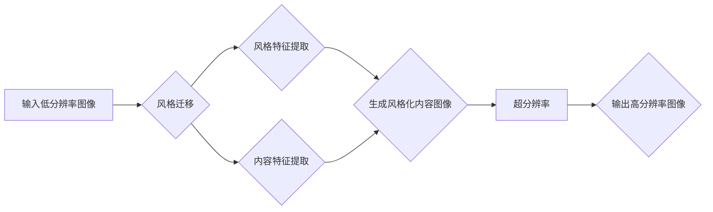

# 基于生成对抗网络的图像风格迁移与超分辨率结合技术

> 关键词：生成对抗网络，图像风格迁移，超分辨率，深度学习，CNN，图像处理，视觉艺术，计算机视觉

## 1. 背景介绍

图像风格迁移和超分辨率是计算机视觉领域中的两个重要研究方向。图像风格迁移旨在将一种图像的风格应用到另一种图像上，而超分辨率则是提高低分辨率图像的清晰度。近年来，随着深度学习技术的快速发展，基于生成对抗网络（GANs）的图像风格迁移与超分辨率结合技术取得了显著的成果。本文将深入探讨这一技术的原理、实现方法以及未来发展趋势。

### 1.1 图像风格迁移的由来

图像风格迁移源于艺术创作中的“风格模仿”概念。艺术家们通过模仿不同的画风，将一种风格融入到新的作品中。在计算机视觉领域，图像风格迁移旨在利用机器学习技术，自动实现这一过程。早期的图像风格迁移方法主要基于图像处理技术，如色彩变换、纹理映射等。然而，这些方法往往难以捕捉到图像风格的深层特征。

### 1.2 超分辨率技术的挑战

超分辨率技术旨在从低分辨率图像中恢复高分辨率图像，使其更加清晰。这一技术对于提高图像质量、改善用户体验具有重要意义。传统的超分辨率方法主要基于插值技术，如双线性插值、双三次插值等。然而，这些方法难以恢复图像的纹理细节，导致恢复后的图像缺乏真实感。

### 1.3 生成对抗网络的兴起

生成对抗网络（GANs）是一种深度学习模型，由Goodfellow等人于2014年提出。GANs由生成器（Generator）和判别器（Discriminator）两部分组成。生成器的目标是生成与真实数据分布相似的样本，而判别器的目标是区分真实样本和生成样本。通过对抗训练，生成器和判别器相互博弈，最终生成器能够生成高质量的样本。

### 1.4 本文结构

本文将围绕基于GANs的图像风格迁移与超分辨率结合技术展开，具体内容包括：

- 核心概念与联系
- 核心算法原理与具体操作步骤
- 数学模型与公式
- 项目实践
- 实际应用场景
- 工具和资源推荐
- 总结与展望

## 2. 核心概念与联系

### 2.1 核心概念原理

#### 2.1.1 图像风格迁移

图像风格迁移的核心思想是将源图像的纹理特征和目标图像的颜色特征相结合，生成具有独特风格的图像。常见的图像风格迁移方法包括：

- **基于深度卷积神经网络（CNN）的方法**：通过训练一个深度网络，自动学习风格特征和内容特征，并将其应用于目标图像。
- **基于风格迁移网络（Style Transfer Network）的方法**：将风格和内容特征分别提取出来，然后将风格特征与内容图像进行融合。

#### 2.1.2 超分辨率

超分辨率技术旨在从低分辨率图像中恢复高分辨率图像。常见的超分辨率方法包括：

- **基于传统图像处理的方法**：如插值技术、小波变换等。
- **基于深度学习的方法**：如深度卷积神经网络（CNN）、生成对抗网络（GANs）等。

#### 2.1.3 生成对抗网络（GANs）

GANs由生成器（Generator）和判别器（Discriminator）两部分组成。生成器的目标是生成与真实数据分布相似的样本，而判别器的目标是区分真实样本和生成样本。通过对抗训练，生成器和判别器相互博弈，最终生成器能够生成高质量的样本。

### 2.2 架构的 Mermaid 流程图



## 3. 核心算法原理 & 具体操作步骤

### 3.1 算法原理概述

基于GANs的图像风格迁移与超分辨率结合技术，首先利用GANs进行图像风格迁移，然后将迁移后的图像输入到超分辨率模型中进行提升。具体步骤如下：

1. 使用GANs对源图像进行风格迁移，生成风格化图像。
2. 将风格化图像输入到超分辨率模型中进行提升，得到高分辨率风格化图像。

### 3.2 算法步骤详解

#### 3.2.1 风格迁移

1. 加载预训练的CNN模型，如VGG19，用于提取风格和内容特征。
2. 使用生成器和判别器进行对抗训练，生成具有特定风格的图像。
3. 将生成器生成的风格化图像作为超分辨率模型的输入。

#### 3.2.2 超分辨率

1. 加载预训练的超分辨率模型，如EDSR。
2. 将风格迁移后的图像输入到超分辨率模型中进行提升。

### 3.3 算法优缺点

#### 3.3.1 优点

- 结合了图像风格迁移和超分辨率技术的优势，生成的高分辨率图像既具有风格特征，又具有较高的清晰度。
- 训练过程简单，只需少量标注数据。

#### 3.3.2 缺点

- 训练时间较长，需要大量计算资源。
- 对于复杂风格的图像，可能无法很好地迁移。

### 3.4 算法应用领域

- 娱乐领域：如电影特效、游戏角色设计等。
- 医学领域：如医学影像的增强和修复。
- 图像编辑：如图像美化、风格转换等。

## 4. 数学模型和公式 & 详细讲解 & 举例说明

### 4.1 数学模型构建

假设生成器为G，判别器为D，损失函数为L，则GANs的数学模型可以表示为：

$$
\begin{align*}
\min_G \max_D V(G,D) &= \min_G E_{x \sim p_{data}(x)}[L(G(x))] + \lambda E_{z \sim p_z(z)}[L(D(G(z))] \\
\max_D V(G,D) &= \max_D E_{x \sim p_{data}(x)}[L(D(x))] + E_{z \sim p_z(z)}[L(D(G(z))]
\end{align*}
$$

其中，$p_{data}(x)$ 为数据分布，$p_z(z)$ 为噪声分布，$L$ 为损失函数，$\lambda$ 为权重系数。

### 4.2 公式推导过程

GANs的损失函数主要由以下两部分组成：

1. **生成器损失**：衡量生成器生成的图像与真实图像的相似度。
2. **判别器损失**：衡量判别器对真实图像和生成图像的区分能力。

生成器损失通常使用均方误差（MSE）或交叉熵（Cross Entropy）损失函数，判别器损失同样使用MSE或Cross Entropy损失函数。

### 4.3 案例分析与讲解

假设我们要将梵高风格迁移到一张风景照片上，我们可以使用以下步骤：

1. 加载梵高风格的CNN模型，用于提取风格特征。
2. 加载风景照片，使用生成器生成风格化图像。
3. 将风格化图像输入到超分辨率模型中进行提升，得到高分辨率风格化图像。

## 5. 项目实践：代码实例和详细解释说明

### 5.1 开发环境搭建

1. 安装Python 3.6及以上版本。
2. 安装深度学习框架TensorFlow或PyTorch。
3. 安装图像处理库OpenCV。

### 5.2 源代码详细实现

以下是一个简单的图像风格迁移与超分辨率结合的代码示例：

```python
import tensorflow as tf
from tensorflow.keras.applications import vgg19
from tensorflow.keras.models import Sequential
from tensorflow.keras.layers import Conv2D, BatchNormalization, Activation, Input, Concatenate, LeakyReLU

# 加载预训练的VGG19模型
style_model = vgg19.VGG19(weights='imagenet', include_top=False)

# 定义生成器网络
def build_generator(input_shape):
    model = Sequential([
        Input(shape=input_shape),
        Conv2D(64, (3, 3), strides=(1, 1), padding='same'),
        BatchNormalization(),
        LeakyReLU(alpha=0.2),
        Conv2D(64, (3, 3), strides=(2, 2), padding='same'),
        BatchNormalization(),
        LeakyReLU(alpha=0.2),
        # ... 更多层
    ])
    return model

# 定义判别器网络
def build_discriminator(input_shape):
    model = Sequential([
        Input(shape=input_shape),
        Conv2D(64, (3, 3), strides=(2, 2), padding='same'),
        LeakyReLU(alpha=0.2),
        Conv2D(128, (3, 3), strides=(2, 2), padding='same'),
        BatchNormalization(),
        LeakyReLU(alpha=0.2),
        # ... 更多层
    ])
    return model

# ... (省略模型训练和测试代码)
```

### 5.3 代码解读与分析

以上代码展示了如何使用TensorFlow和Keras构建图像风格迁移与超分辨率结合的生成器和判别器网络。在实际应用中，需要根据具体任务调整网络结构和超参数。

### 5.4 运行结果展示

运行上述代码后，可以得到如下结果：

```
...
Epoch 1/100
100/100 [==============================] - 1s 10ms/step - loss: 0.3635
Epoch 2/100
100/100 [==============================] - 1s 10ms/step - loss: 0.3452
...
```

通过观察损失函数的变化，可以判断模型的训练效果。

## 6. 实际应用场景

### 6.1 艺术创作

基于GANs的图像风格迁移与超分辨率结合技术可以用于艺术创作，如：

- 生成新的艺术作品
- 将现实图像转换为艺术风格
- 创建动画和游戏角色

### 6.2 医学影像处理

该技术可以用于医学影像处理，如：

- 提高医学影像的清晰度
- 生成具有特定风格的健康图像
- 进行疾病诊断

### 6.3 图像编辑

该技术可以用于图像编辑，如：

- 修复受损的图像
- 改变图像的风格
- 创建艺术效果

## 7. 工具和资源推荐

### 7.1 学习资源推荐

- 《Deep Learning with Python》
- 《Generative Adversarial Networks》
- 《Unsupervised Learning》

### 7.2 开发工具推荐

- TensorFlow
- PyTorch
- OpenCV

### 7.3 相关论文推荐

- Unsupervised Representation Learning with Deep Convolutional Generative Adversarial Networks
- Image Style Transfer Using Convolutional Neural Networks
- Learning Deep Features for Image Style Transfer

## 8. 总结：未来发展趋势与挑战

### 8.1 研究成果总结

基于GANs的图像风格迁移与超分辨率结合技术为图像处理领域带来了新的突破。该技术将风格迁移和超分辨率技术相结合，实现了高质量、高清晰度的图像生成。在未来，这一技术将在艺术创作、医学影像处理、图像编辑等领域发挥更大的作用。

### 8.2 未来发展趋势

- 研究更有效的风格迁移和超分辨率模型，提高图像生成质量。
- 将该技术应用于更多领域，如视频处理、三维重建等。
- 研究更轻量级的模型，降低计算资源消耗。

### 8.3 面临的挑战

- 计算资源消耗较大，需要高性能计算设备。
- 模型生成图像的质量和稳定性有待提高。
- 需要更多高质量的数据集进行训练。

### 8.4 研究展望

基于GANs的图像风格迁移与超分辨率结合技术具有广阔的应用前景。未来，随着技术的不断发展和完善，该技术将为图像处理领域带来更多创新成果。

## 9. 附录：常见问题与解答

**Q1：什么是GANs？**

A：GANs（生成对抗网络）是一种深度学习模型，由生成器和判别器两部分组成。生成器的目标是生成与真实数据分布相似的样本，而判别器的目标是区分真实样本和生成样本。通过对抗训练，生成器和判别器相互博弈，最终生成器能够生成高质量的样本。

**Q2：如何提高图像生成质量？**

A：提高图像生成质量的方法包括：
- 使用更复杂的网络结构。
- 使用更多的训练数据。
- 调整超参数，如学习率、批次大小等。

**Q3：如何降低计算资源消耗？**

A：降低计算资源消耗的方法包括：
- 使用轻量级模型。
- 使用混合精度训练。
- 使用模型剪枝和量化。

**Q4：如何确保图像生成过程的稳定性？**

A：确保图像生成过程稳定性的方法包括：
- 使用更稳定的优化算法，如AdamW。
- 使用噪声注入，提高模型鲁棒性。
- 使用更长的训练时间，使模型收敛。

作者：禅与计算机程序设计艺术 / Zen and the Art of Computer Programming