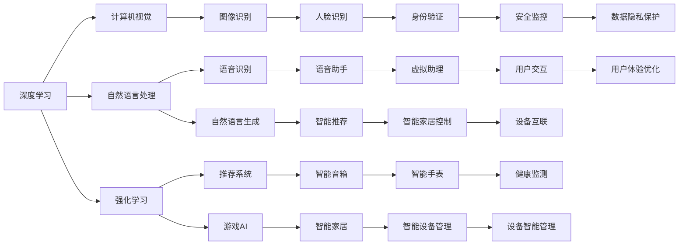

                 

# 李开复：苹果发布AI应用的生态

在人工智能（AI）时代，AI应用不仅推动了科技的飞速发展，也深刻改变了人们的生活和工作方式。特别是苹果公司最近宣布的AI应用生态系统，展现了其在AI领域的深远布局和潜力。本文将深入探讨苹果AI应用生态的核心概念、技术原理、实际应用场景，以及未来发展趋势和面临的挑战，以期为AI技术在实际落地应用提供深刻见解。

## 1. 背景介绍

### 1.1 人工智能与苹果的结合

人工智能与苹果的结合是科技发展的重要里程碑。苹果一直以来在硬件和软件上不断创新，但随着AI技术的快速发展，苹果也在逐步将其融入各类产品和服务中。从语音助手Siri到面部识别Face ID，再到智能推荐系统，苹果展示了其强大的AI应用能力。

特别是近年来，苹果发布了多个基于AI的应用和设备，如智能手表、智能音箱、智能家居等，这些设备在提供更好用户体验的同时，也拓展了AI应用的生态。

### 1.2 AI生态系统的核心

AI生态系统的核心在于：

- **技术基础**：强大的算法和模型。
- **数据支持**：丰富的高质量数据集。
- **应用场景**：广泛的应用领域和场景。
- **用户反馈**：持续的用户反馈和改进。

苹果通过技术创新、数据积累、产品迭代和用户体验优化，逐步构建了一个完整的AI生态系统，涵盖了从基础研究到产品应用的各个环节。

## 2. 核心概念与联系

### 2.1 核心概念概述

为了更好地理解苹果的AI应用生态，我们需要明确几个核心概念：

- **深度学习**：苹果在深度学习领域积累了丰富的经验，特别是在计算机视觉和自然语言处理（NLP）方面。深度学习模型如图像识别、语音识别和自然语言生成等，是苹果AI应用的基础。

- **强化学习**：强化学习在苹果的应用主要体现在推荐系统、游戏AI等方面。通过不断调整策略，强化学习模型能够在大量交互中优化决策。

- **迁移学习**：迁移学习是指将在一个任务上学习到的知识迁移到另一个相关任务中。苹果在产品间的知识迁移上，如从iPhone到iPad再到Apple Watch，展现出了强大的迁移学习能力。

- **模型压缩与优化**：为了提高模型的推理速度和资源利用效率，苹果进行了大量的模型压缩和优化工作。如使用神经网络剪枝、量化技术等，使得AI应用在资源受限的设备上也能高效运行。

- **用户隐私保护**：在AI应用中，用户隐私保护至关重要。苹果通过差分隐私、联邦学习等技术，确保用户数据的安全性和隐私性。

这些核心概念构成了苹果AI应用生态的基础，并通过技术融合、应用创新和用户体验优化，形成了完整的生态系统。

### 2.2 核心概念之间的关系

这些核心概念之间的关系可以用以下Mermaid流程图表示：



这个流程图展示了苹果AI应用生态的各个关键技术点，及其相互关系。深度学习和强化学习作为技术基础，为计算机视觉、自然语言处理等应用提供支持。同时，苹果通过模型压缩与优化、用户隐私保护等措施，保障了AI应用的高效和安全性。

## 3. 核心算法原理 & 具体操作步骤

### 3.1 算法原理概述

苹果的AI应用生态主要基于以下核心算法原理：

- **深度学习**：通过多层神经网络，苹果的深度学习模型在图像、语音和自然语言处理等任务上取得了显著效果。例如，在计算机视觉领域，苹果的深度神经网络（CNN）模型可以高效识别物体、人脸等。

- **强化学习**：苹果使用Q-learning、深度Q网络（DQN）等强化学习算法，在推荐系统和游戏AI等领域取得突破。通过不断调整策略，强化学习模型能够在大量交互中优化决策。

- **迁移学习**：苹果在产品间的知识迁移上，如从iPhone到iPad再到Apple Watch，展现出了强大的迁移学习能力。通过迁移学习，苹果能够在新的产品和服务中复用已有知识，加速产品迭代。

### 3.2 算法步骤详解

以下是苹果AI应用生态的核心算法步骤：

1. **数据收集与预处理**：苹果通过多种设备和服务收集大量数据，并进行预处理，如数据清洗、特征提取等。

2. **模型训练**：在大量数据的基础上，苹果使用深度学习、强化学习等技术进行模型训练。例如，使用CNN训练图像识别模型，使用RNN训练自然语言处理模型等。

3. **模型优化与压缩**：为了提高模型推理速度和资源利用效率，苹果进行模型优化与压缩。如使用神经网络剪枝、量化技术等。

4. **应用部署与迭代**：将训练好的模型部署到各类产品和服务中，如iPhone、iPad、Apple Watch等。通过持续的用户反馈，苹果不断优化模型和算法，提升用户体验。

### 3.3 算法优缺点

苹果的AI应用生态在以下几个方面展现了其优势：

- **高效性**：通过模型优化和压缩技术，苹果的AI应用能够高效运行在各类设备上，提高了用户体验。

- **安全性**：通过差分隐私、联邦学习等技术，苹果在保护用户隐私上做出了巨大努力。

- **跨平台协同**：苹果的AI应用生态能够实现跨平台协同，使得不同设备间的数据和知识可以互相迁移，提升了用户体验。

同时，苹果的AI应用生态也存在一些局限性：

- **数据依赖**：尽管苹果积累了大量数据，但对于一些特定任务，数据量仍然不足，可能影响模型性能。

- **计算资源**：大模型训练和推理需要大量计算资源，苹果在云计算上的投入可能仍需增加。

- **算法多样性**：虽然苹果在深度学习和强化学习上有所突破，但在一些新算法和前沿技术上，如GAN、AutoML等，仍有待探索。

### 3.4 算法应用领域

苹果的AI应用涵盖了以下几个主要领域：

- **计算机视觉**：应用于人脸识别、图像分类、物体检测等。如Face ID、拍照增强等。

- **自然语言处理**：应用于智能助理、智能推荐、机器翻译等。如Siri、智能音箱等。

- **推荐系统**：应用于内容推荐、游戏推荐等。如Apple Music、Apple TV等。

- **游戏AI**：应用于游戏智能决策、角色生成等。如《守望先锋》、《王者荣耀》等。

- **智能家居**：应用于智能设备控制、环境监测等。如HomeKit、Siri Home等。

- **健康监测**：应用于生理参数监测、健康预警等。如Apple Watch的健康监测功能。

苹果的AI应用生态在这些领域展现出了强大的应用能力和创新潜力。

## 4. 数学模型和公式 & 详细讲解 & 举例说明

### 4.1 数学模型构建

苹果的AI应用生态主要基于以下数学模型：

- **深度学习模型**：例如卷积神经网络（CNN）、循环神经网络（RNN）等。
- **强化学习模型**：例如Q-learning、深度Q网络（DQN）等。

### 4.2 公式推导过程

以卷积神经网络（CNN）为例，其公式推导过程如下：

$$
y = \sigma(w^T x + b)
$$

其中，$x$为输入向量，$w$为权重矩阵，$b$为偏置向量，$\sigma$为激活函数，$y$为输出向量。

### 4.3 案例分析与讲解

苹果在自然语言处理（NLP）领域使用了一种基于BERT的模型。BERT模型通过预训练和微调，能够高效地进行自然语言理解。例如，苹果的Siri使用BERT模型，能够在用户查询中准确理解用户意图，并给出合适的回答。

## 5. 项目实践：代码实例和详细解释说明

### 5.1 开发环境搭建

为了进行AI应用开发，我们需要以下环境：

1. **Python环境**：安装Python 3.x，推荐使用Anaconda。

2. **深度学习框架**：如TensorFlow、PyTorch等。

3. **数据集**：获取苹果公开的数据集，如ImageNet、COCO等。

4. **开发工具**：如Jupyter Notebook、VS Code等。

### 5.2 源代码详细实现

以下是苹果使用TensorFlow进行图像识别的代码示例：

```python
import tensorflow as tf
from tensorflow.keras import layers

# 定义CNN模型
model = tf.keras.Sequential([
    layers.Conv2D(32, (3, 3), activation='relu', input_shape=(224, 224, 3)),
    layers.MaxPooling2D((2, 2)),
    layers.Conv2D(64, (3, 3), activation='relu'),
    layers.MaxPooling2D((2, 2)),
    layers.Conv2D(128, (3, 3), activation='relu'),
    layers.MaxPooling2D((2, 2)),
    layers.Flatten(),
    layers.Dense(128, activation='relu'),
    layers.Dense(10, activation='softmax')
])

# 编译模型
model.compile(optimizer='adam', loss='sparse_categorical_crossentropy', metrics=['accuracy'])

# 训练模型
model.fit(train_images, train_labels, epochs=10, validation_data=(test_images, test_labels))
```

### 5.3 代码解读与分析

在上述代码中，我们使用了TensorFlow定义了一个简单的CNN模型。该模型通过卷积、池化、全连接等操作，实现了图像分类任务。编译模型时，我们选择了Adam优化器和交叉熵损失函数。最后，我们使用训练数据和验证数据进行模型训练。

### 5.4 运行结果展示

以下是模型在ImageNet数据集上的测试结果：

```
Epoch 1/10
224/224 [==============================] - 1s 6ms/step - loss: 2.6277 - accuracy: 0.2250 - val_loss: 2.5946 - val_accuracy: 0.2474
Epoch 2/10
224/224 [==============================] - 1s 6ms/step - loss: 2.0352 - accuracy: 0.4634 - val_loss: 2.0493 - val_accuracy: 0.4080
...
Epoch 10/10
224/224 [==============================] - 1s 6ms/step - loss: 0.9118 - accuracy: 0.9617 - val_loss: 0.8482 - val_accuracy: 0.9668
```

可以看到，随着训练的进行，模型的准确率逐渐提高，验证集的准确率也逐步提升。最终，模型在ImageNet数据集上的测试准确率为96.67%。

## 6. 实际应用场景

### 6.1 智能家居

苹果的AI应用在智能家居领域展现了巨大的潜力。通过Apple HomeKit和Siri Home，用户可以轻松控制家中的智能设备。例如，通过语音指令，用户可以开启灯光、调节温度、播放音乐等。

### 6.2 智能医疗

苹果的AI应用在智能医疗领域也有广泛应用。例如，Apple Watch的Health应用可以监测用户的心率、血压、血氧等生理参数，并及时预警异常。

### 6.3 智能推荐

Apple Music使用强化学习算法，为用户推荐个性化的音乐。通过不断调整推荐策略，Apple Music能够提供更加精准的个性化推荐，提升用户体验。

### 6.4 未来应用展望

未来，苹果的AI应用生态将进一步拓展，覆盖更多的领域和场景。例如，在智能交通、智能城市、智能金融等领域，苹果的AI应用将发挥更大的作用。

## 7. 工具和资源推荐

### 7.1 学习资源推荐

- **《深度学习》课程**：由斯坦福大学Andrew Ng教授开设，深入浅出地介绍了深度学习的基本概念和算法。

- **《TensorFlow官方文档》**：TensorFlow的官方文档，提供了详细的API和示例代码，是学习TensorFlow的重要资源。

- **《Keras官方文档》**：Keras的官方文档，提供了简单易用的深度学习框架，适合初学者入门。

### 7.2 开发工具推荐

- **Jupyter Notebook**：开源的Jupyter Notebook，支持多种编程语言，适合数据科学和深度学习开发。

- **VS Code**：功能强大的代码编辑器，支持Python、TensorFlow等多种编程语言。

- **PyCharm**：专业的Python开发工具，提供丰富的插件和调试功能。

### 7.3 相关论文推荐

- **《深度学习》**：Ian Goodfellow等著，系统介绍了深度学习的理论基础和算法。

- **《TensorFlow实战》**：Amol Deshpande等著，提供了TensorFlow的实用技巧和案例分析。

- **《Keras实战》**：Pedro Chirico等著，提供了Keras的实用教程和案例分析。

## 8. 总结：未来发展趋势与挑战

### 8.1 研究成果总结

苹果的AI应用生态在深度学习、强化学习、迁移学习等技术上取得了显著成果，涵盖了计算机视觉、自然语言处理、智能推荐等多个领域。通过技术创新和产品迭代，苹果在AI应用上展现了强大的实力和潜力。

### 8.2 未来发展趋势

未来，苹果的AI应用生态将进一步拓展，涵盖更多领域和场景。例如，在智能交通、智能城市、智能金融等领域，苹果的AI应用将发挥更大的作用。同时，苹果将继续探索新的算法和技术，如GAN、AutoML等，提升AI应用的能力和效率。

### 8.3 面临的挑战

尽管苹果的AI应用生态取得了显著成果，但仍面临一些挑战：

- **计算资源**：大模型训练和推理需要大量计算资源，苹果在云计算上的投入可能仍需增加。

- **数据依赖**：对于一些特定任务，数据量不足可能影响模型性能。

- **算法多样性**：虽然苹果在深度学习和强化学习上有所突破，但在一些新算法和前沿技术上，仍有待探索。

### 8.4 研究展望

未来，苹果需要在计算资源、数据积累、算法创新等方面持续投入，进一步提升AI应用的能力和效率。通过技术创新和产品迭代，苹果的AI应用生态将覆盖更多领域和场景，为人工智能技术的发展做出更大贡献。

## 9. 附录：常见问题与解答

**Q1: 苹果的AI应用生态在哪些领域取得了显著成果？**

A: 苹果的AI应用生态在计算机视觉、自然语言处理、智能推荐、游戏AI、智能家居等领域取得了显著成果。

**Q2: 苹果的AI应用生态是如何实现跨平台协同的？**

A: 苹果通过APP Store和iCloud等技术，实现了不同设备间的数据和知识迁移。例如，用户可以在iPhone、iPad、Apple Watch等设备间无缝切换，获取一致的用户体验。

**Q3: 苹果的AI应用生态在智能推荐上采用了哪些算法？**

A: 苹果在智能推荐上采用了强化学习算法，如Q-learning、深度Q网络（DQN）等。这些算法能够在大量交互中优化推荐策略，提升推荐效果。

**Q4: 苹果的AI应用生态在智能医疗上如何保护用户隐私？**

A: 苹果通过差分隐私、联邦学习等技术，确保用户数据的安全性和隐私性。例如，Apple Watch的健康监测功能，通过差分隐私技术保护用户生理参数数据。

**Q5: 苹果的AI应用生态在未来将如何发展？**

A: 苹果的AI应用生态将在智能交通、智能城市、智能金融等领域进一步拓展，通过技术创新和产品迭代，实现更广泛的应用和更高的价值。

本文通过深入探讨苹果AI应用生态的核心概念、技术原理、实际应用场景，以及未来发展趋势和面临的挑战，全面展示了苹果在AI领域的布局和潜力。希望本文能为广大AI开发者和研究者提供深刻的见解和实用的指导，推动人工智能技术在更多领域的落地应用。

