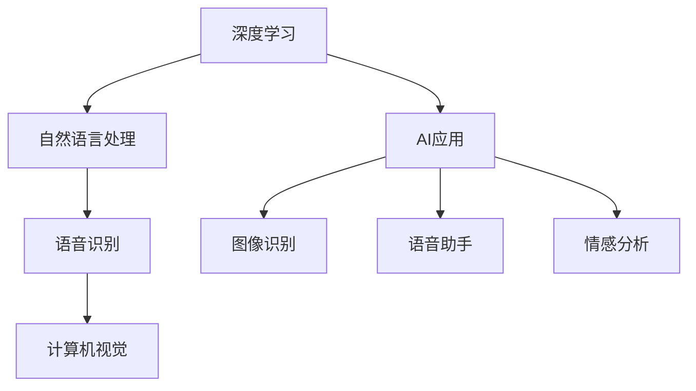

                 

# 李开复：苹果发布AI应用的科技价值

> 关键词：人工智能, 深度学习, 自然语言处理, 计算机视觉, 语音识别

## 1. 背景介绍

### 1.1 问题由来
随着人工智能技术的迅猛发展，全球科技巨头纷纷布局AI应用，以期在未来的市场竞争中占据先机。苹果公司作为全球科技行业的领军企业，其最新发布的AI应用引发了广泛关注。本文将从科技价值的角度，探讨苹果AI应用的潜力和前景。

### 1.2 问题核心关键点
本文将重点分析苹果AI应用中的核心技术，包括深度学习、自然语言处理、计算机视觉和语音识别等，并探讨其背后的科学原理和应用前景。同时，我们也将对比苹果AI应用与竞争对手的AI技术，分析其在科技价值上的优势和不足。

### 1.3 问题研究意义
研究苹果AI应用的科技价值，对于理解现代AI技术的最新进展，评估其对科技行业的影响，以及为后续研究和技术发展提供方向和启示，具有重要意义。

## 2. 核心概念与联系

### 2.1 核心概念概述

苹果公司在其AI应用中，采用了深度学习、自然语言处理、计算机视觉和语音识别等多种AI技术。这些技术不仅在各自领域展现了卓越的性能，还通过协同工作，实现了更为复杂的AI应用。

- **深度学习**：通过多层神经网络对数据进行学习，以发现数据中的复杂模式和规律。深度学习在图像识别、语音识别等领域具有广泛应用。

- **自然语言处理**：使计算机能够理解、处理和生成自然语言。NLP技术在机器翻译、情感分析、智能客服等领域发挥重要作用。

- **计算机视觉**：使计算机能够通过图像或视频理解现实世界，广泛应用于人脸识别、自动驾驶、医疗影像分析等场景。

- **语音识别**：使计算机能够识别和理解人类的语音，常用于语音助手、语音搜索、语音命令控制等应用。

这些核心概念之间的联系可以通过以下Mermaid流程图来展示：



这个流程图展示了深度学习、自然语言处理、计算机视觉和语音识别等技术在苹果AI应用中的综合应用，以及它们之间的联系。

### 2.2 概念间的关系

苹果的AI应用涉及多个技术领域，它们之间的协同工作使得AI应用具备更强的功能和灵活性。深度学习和计算机视觉常用于提取特征，自然语言处理和语音识别用于理解和生成语言，从而实现更为复杂的功能。这种多技术结合的模式，使得AI应用能够处理更复杂、更自然的人机交互。

## 3. 核心算法原理 & 具体操作步骤

### 3.1 算法原理概述
苹果AI应用的核心算法原理主要包括深度学习、卷积神经网络(CNN)、循环神经网络(RNN)、长短期记忆网络(LSTM)等。这些算法通过多层神经网络对数据进行学习，从而实现对复杂模式和规律的识别和理解。

- **深度学习**：通过多层神经网络对数据进行特征提取和分类。
- **卷积神经网络**：主要用于图像识别，能够通过卷积操作提取局部特征。
- **循环神经网络**：用于处理序列数据，如语音和文本，能够捕捉时间序列上的依赖关系。
- **长短期记忆网络**：是RNN的一种改进，能够更好地处理长期依赖。

### 3.2 算法步骤详解
苹果AI应用的开发流程通常包括以下几个步骤：

1. **数据收集**：收集应用所需的数据，如语音、图像、文本等。
2. **数据预处理**：对收集到的数据进行清洗、标注、归一化等处理，以便于后续的模型训练。
3. **模型训练**：使用深度学习算法对处理后的数据进行训练，调整模型参数以优化性能。
4. **模型评估**：在验证集上评估模型性能，确保模型能够泛化到未见过的数据。
5. **模型部署**：将训练好的模型部署到生产环境，用于实际应用。

### 3.3 算法优缺点
苹果AI应用的深度学习和自然语言处理技术，具有以下优点：

- **强大的特征提取能力**：深度学习能够自动学习数据的特征，无需手工提取。
- **泛化能力强**：训练好的模型能够在未见过的数据上表现良好。

同时，这些技术也存在一些缺点：

- **计算资源需求高**：深度学习需要大量的计算资源，尤其是在模型规模较大的情况下。
- **模型解释性差**：深度学习模型通常是"黑盒"，难以解释其决策过程。

### 3.4 算法应用领域
苹果AI应用的深度学习技术在图像识别、语音识别、情感分析等多个领域得到了广泛应用：

- **图像识别**：如人脸识别、物体识别等。
- **语音识别**：如语音助手Siri等。
- **情感分析**：如智能客服中的情感识别。
- **自然语言处理**：如智能翻译、文本生成等。

## 4. 数学模型和公式 & 详细讲解 & 举例说明

### 4.1 数学模型构建

苹果AI应用的核心数学模型包括卷积神经网络(CNN)、循环神经网络(RNN)和长短期记忆网络(LSTM)。这里以LSTM为例，展示其数学模型的构建过程。

LSTM的数学模型可以表示为：

$$
h_t = \tanh(W_{xh}x_t + W_{hh}h_{t-1} + b_h) \\
o_t = \sigma(W_{xo}x_t + W_{ho}h_{t-1} + b_o) \\
\tilde{c_t} = \tanh(W_{x}x_t + W_{h}h_{t-1} + b) \\
c_t = o_t \odot \tilde{c_t} + (1-o_t) \odot c_{t-1} \\
y_t = o_t \odot \tanh(c_t)
$$

其中，$h_t$ 表示LSTM中的隐藏状态，$c_t$ 表示LSTM中的细胞状态，$x_t$ 表示输入，$o_t$ 表示输出门，$W$ 表示权重矩阵，$b$ 表示偏置项，$\tanh$ 表示双曲正切激活函数，$\sigma$ 表示Sigmoid函数，$\odot$ 表示逐元素相乘。

### 4.2 公式推导过程

以LSTM的细胞状态更新公式为例，推导其数学模型。

LSTM的细胞状态更新公式为：

$$
c_t = o_t \odot \tilde{c_t} + (1-o_t) \odot c_{t-1}
$$

其中，$\tilde{c_t}$ 表示当前时刻的候选细胞状态，$c_{t-1}$ 表示上一时刻的细胞状态，$o_t$ 表示输出门。

推导过程如下：

1. 定义候选细胞状态 $\tilde{c_t}$：
$$
\tilde{c_t} = \tanh(W_{x}x_t + W_{h}h_{t-1} + b)
$$

2. 计算输出门 $o_t$：
$$
o_t = \sigma(W_{xo}x_t + W_{ho}h_{t-1} + b_o)
$$

3. 计算当前时刻的细胞状态 $c_t$：
$$
c_t = o_t \odot \tilde{c_t} + (1-o_t) \odot c_{t-1}
$$

### 4.3 案例分析与讲解

以LSTM在语音识别中的应用为例，分析其数学模型。

假设语音信号 $x_t$ 表示为MFCC特征向量，LSTM模型接受该特征向量作为输入。通过上述公式计算得到隐藏状态 $h_t$ 和细胞状态 $c_t$。最终，将 $c_t$ 输入全连接层进行分类，输出对应的语音字母。

## 5. 项目实践：代码实例和详细解释说明

### 5.1 开发环境搭建

苹果AI应用通常使用PyTorch或TensorFlow等深度学习框架进行开发。以下是使用PyTorch搭建开发环境的步骤：

1. 安装Python：从官网下载并安装Python 3.x版本。
2. 安装PyTorch：使用pip安装PyTorch，安装命令为 `pip install torch torchvision torchaudio`。
3. 安装相关库：安装numpy、pandas、scikit-learn等常用库。

完成环境搭建后，即可使用PyTorch进行模型开发和训练。

### 5.2 源代码详细实现

以LSTM在语音识别中的应用为例，展示使用PyTorch实现代码。

```python
import torch
import torch.nn as nn
import torch.optim as optim

class LSTM(nn.Module):
    def __init__(self, input_size, hidden_size, output_size):
        super(LSTM, self).__init__()
        self.hidden_size = hidden_size
        self.rnn = nn.LSTM(input_size, hidden_size, num_layers=1, batch_first=True)
        self.fc = nn.Linear(hidden_size, output_size)

    def forward(self, x):
        h0 = torch.zeros(1, x.size(0), self.hidden_size).to(device)
        c0 = torch.zeros(1, x.size(0), self.hidden_size).to(device)

        out, _ = self.rnn(x, (h0, c0))
        out = self.fc(out[:, -1, :])

        return out

# 数据准备
x = torch.randn(20, 3, 30)  # 模拟语音特征
y = torch.randint(0, 26, (20,))  # 模拟语音字母

# 模型训练
model = LSTM(30, 128, 26)
criterion = nn.CrossEntropyLoss()
optimizer = optim.Adam(model.parameters(), lr=0.01)

for epoch in range(100):
    optimizer.zero_grad()
    output = model(x)
    loss = criterion(output, y)
    loss.backward()
    optimizer.step()

    if (epoch+1) % 10 == 0:
        print('Epoch [{}/{}], Loss: {:.4f}'.format(epoch+1, 100, loss.item()))
```

### 5.3 代码解读与分析

上述代码展示了LSTM在语音识别中的实现过程。

- **模型定义**：定义LSTM模型，包含LSTM层和全连接层。
- **数据准备**：模拟语音特征和对应的字母。
- **模型训练**：使用Adam优化器进行模型训练，输出交叉熵损失并反向传播。

## 6. 实际应用场景

### 6.1 图像识别

苹果AI应用中的深度学习技术在图像识别中得到了广泛应用。例如，人脸识别技术可以通过深度学习算法，在图片上识别并匹配人脸信息，用于安全验证和身份认证。

### 6.2 语音识别

苹果的语音识别技术在智能助手Siri中得到了广泛应用。Siri通过深度学习和自然语言处理技术，能够理解用户的语音指令，并根据指令执行相应操作。

### 6.3 情感分析

苹果的情感分析技术可以应用于智能客服，通过分析用户的语音和文本信息，自动识别用户的情绪状态，并根据情绪状态进行不同的客服回应。

### 6.4 未来应用展望

未来，苹果的AI应用将进一步扩展到更多领域，如自动驾驶、智能家居等。通过深度学习和自然语言处理技术，苹果有望在这些领域取得突破，引领AI技术的未来发展。

## 7. 工具和资源推荐

### 7.1 学习资源推荐

- **《深度学习》书籍**：由Ian Goodfellow等编著，是深度学习领域的经典教材，涵盖深度学习的基本原理和实现方法。
- **《自然语言处理综述》论文**：由DeepMind团队发表，总结了自然语言处理的最新进展，提供了丰富的学习资源。
- **在线课程**：如Coursera上的深度学习课程，由Andrew Ng主讲，涵盖了深度学习的基本概念和实现方法。

### 7.2 开发工具推荐

- **PyTorch**：由Facebook开源的深度学习框架，灵活性高，易用性强。
- **TensorFlow**：由Google开发的深度学习框架，支持大规模分布式计算。
- **Jupyter Notebook**：交互式编程环境，便于调试和展示代码。

### 7.3 相关论文推荐

- **《Attention is All You Need》论文**：Transformer模型的原始论文，提出了自注意力机制，开启了Transformer时代。
- **《LSTM: A Search Space Odyssey》论文**：详细介绍了长短期记忆网络LSTM的原理和实现方法。
- **《BERT: Pre-training of Deep Bidirectional Transformers for Language Understanding》论文**：提出了BERT预训练模型，在NLP领域取得了重大突破。

## 8. 总结：未来发展趋势与挑战

### 8.1 研究成果总结

苹果AI应用展示了深度学习、自然语言处理、计算机视觉和语音识别等技术的综合应用，取得了显著的科技价值和社会效益。未来，苹果有望在这些领域取得更多突破，引领AI技术的未来发展。

### 8.2 未来发展趋势

苹果AI应用的未来发展趋势包括以下几个方面：

1. **多模态融合**：未来的AI应用将综合利用图像、语音、文本等多种模态数据，实现更加复杂和智能的功能。
2. **边缘计算**：AI应用将越来越多地部署在边缘设备上，如智能家居、智能穿戴设备等，提升实时性和响应速度。
3. **个性化推荐**：通过深度学习算法，AI应用将能够根据用户的历史行为和偏好，提供个性化的推荐服务。

### 8.3 面临的挑战

苹果AI应用在发展过程中也面临一些挑战：

1. **计算资源限制**：深度学习和计算机视觉等技术需要大量的计算资源，如何在有限的硬件资源下实现高性能计算，是一个亟待解决的问题。
2. **模型可解释性**：深度学习模型通常是"黑盒"，难以解释其决策过程，如何增强模型的可解释性，是未来研究的重点。
3. **数据隐私和安全**：AI应用需要处理大量的个人数据，如何保护用户隐私和数据安全，是一个重要的伦理和法律问题。

### 8.4 研究展望

未来的研究应在以下几个方面进行：

1. **提高模型可解释性**：通过引入符号化的先验知识，如知识图谱、逻辑规则等，增强模型的可解释性。
2. **优化模型计算效率**：通过模型压缩、稀疏化存储等方法，优化模型计算效率，提升推理速度。
3. **加强数据隐私保护**：通过差分隐私、联邦学习等技术，保护用户数据隐私，增强数据安全。

## 9. 附录：常见问题与解答

**Q1：苹果AI应用在图像识别中使用了哪些技术？**

A: 苹果AI应用在图像识别中主要使用了深度学习和卷积神经网络技术。通过卷积神经网络，可以从图像中提取局部特征，并使用深度学习算法进行特征分类和识别。

**Q2：苹果AI应用中的LSTM模型有哪些参数？**

A: 苹果AI应用中的LSTM模型包括三个主要参数：输入大小、隐藏大小和输出大小。其中，输入大小为特征向量的维度，隐藏大小为LSTM层的神经元数量，输出大小为分类结果的维度。

**Q3：苹果AI应用在语音识别中使用了哪些深度学习算法？**

A: 苹果AI应用在语音识别中主要使用了深度学习和循环神经网络技术。通过循环神经网络，可以处理序列数据，如语音信号，并使用深度学习算法进行特征提取和分类。

**Q4：苹果AI应用的深度学习模型有哪些优点？**

A: 苹果AI应用的深度学习模型具有以下优点：
- 强大的特征提取能力：能够自动学习数据的复杂特征。
- 泛化能力强：训练好的模型能够在未见过的数据上表现良好。

**Q5：苹果AI应用的LSTM模型有哪些应用场景？**

A: 苹果AI应用的LSTM模型可以应用于多种场景，如语音识别、情感分析、智能客服等。在语音识别中，可以用于语音助手Siri；在情感分析中，可以用于智能客服中的情感识别；在智能客服中，可以用于处理用户输入的语音和文本信息。

---

作者：禅与计算机程序设计艺术 / Zen and the Art of Computer Programming

