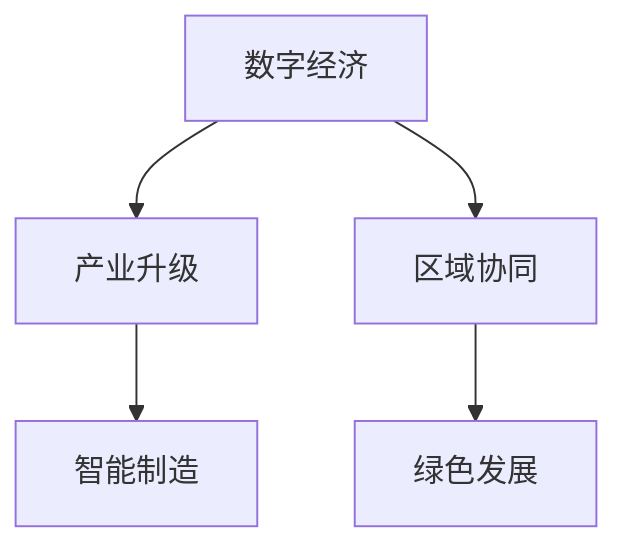
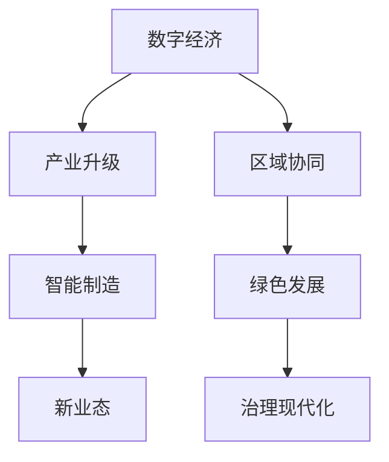

                 

# 构建特色产业体系的新质生产力

## 1. 背景介绍

在当今数字化和全球化的浪潮下，构建具有竞争力的特色产业体系，成为推动经济高质量发展的重要方向。这一体系不仅关乎技术创新、产业转型和地区竞争力，更是实现社会治理现代化和人民生活质量提升的关键所在。

## 2. 核心概念与联系

### 2.1 核心概念概述

构建特色产业体系的核心概念包括：

- **数字经济**：以数字技术创新为核心驱动，以新业态和新模式为主要特征的经济形态。
- **产业升级**：通过优化产业结构、提升产业链水平、增强产业竞争力来实现的转型过程。
- **区域协同**：通过区域间的经济合作、信息共享和协同创新，实现资源优化配置和共赢发展。
- **智能制造**：融合新一代信息技术与制造业，推动制造业的智能化、数字化转型。
- **绿色发展**：在产业升级中实现资源节约和环境保护，推动经济社会发展与自然和谐共生。

### 2.2 核心概念原理和架构

我们通过以下 Mermaid 流程图展示了这些核心概念之间的联系：



这个流程图展示了数字经济如何通过产业升级、智能制造、区域协同和绿色发展，共同构建一个综合、可持续的特色产业体系。

### 2.3 核心概念的整体架构

从整体上看，构建特色产业体系需要一个系统性的框架：



通过这张流程图，我们可以看到，数字经济不仅是产业升级的驱动力，也是绿色发展和治理现代化的重要支撑。智能制造、新业态、治理现代化等概念，都在这一体系中扮演着关键角色。

## 3. 核心算法原理 & 具体操作步骤
### 3.1 算法原理概述

构建特色产业体系的核心算法原理主要基于以下三个方面：

- **数据驱动**：通过大数据分析，识别产业发展趋势、需求和痛点，为产业升级和智能制造提供数据支持。
- **算法优化**：利用机器学习、深度学习等技术，对数据进行深度分析和挖掘，为产业转型提供技术支持。
- **协同创新**：通过区域间的合作，实现技术、信息和资源的共享，促进产业链上下游协同发展。

### 3.2 算法步骤详解

构建特色产业体系的核心算法步骤如下：

1. **数据采集与预处理**：收集各产业的相关数据，包括市场、技术、环境、社会等多个维度，并进行清洗和标准化。

2. **数据建模与分析**：利用统计学、机器学习等方法，对数据进行建模和分析，识别出产业发展趋势和热点。

3. **算法优化与评估**：选择合适的算法模型，如决策树、随机森林、深度神经网络等，对数据进行深度分析和挖掘，评估模型的效果。

4. **协同创新与实施**：通过区域协同，实现技术与资源的共享，推动产业链上下游的协同创新。

5. **持续优化与反馈**：根据实施效果，持续优化模型和策略，确保产业体系的可持续发展。

### 3.3 算法优缺点

构建特色产业体系的算法具有以下优点：

- **数据驱动**：能够基于实际数据，发现产业发展趋势和机会，为决策提供科学依据。
- **技术先进**：利用机器学习、深度学习等前沿技术，提升产业升级和智能制造的效率和质量。
- **区域协同**：通过区域合作，实现技术和资源的共享，促进产业链上下游协同创新。

同时，也存在一些局限性：

- **数据获取难度大**：需要收集和处理大量的数据，对于数据获取和处理能力有较高要求。
- **算法复杂度高**：机器学习和深度学习模型复杂，需要较高的计算资源和专业技能。
- **实施难度大**：需要跨区域、跨行业的协同合作，实施难度较大。

### 3.4 算法应用领域

构建特色产业体系的算法广泛应用于以下几个领域：

- **智能制造**：利用数据驱动和算法优化，推动传统制造业的智能化、数字化转型。
- **智慧农业**：通过大数据和机器学习，提升农业生产的智能化水平。
- **绿色能源**：利用算法优化和协同创新，推动能源产业的绿色转型。
- **智慧医疗**：通过数据驱动和算法优化，提升医疗服务的智能化水平。

## 4. 数学模型和公式 & 详细讲解 & 举例说明

### 4.1 数学模型构建

构建特色产业体系的数学模型主要包括以下几个部分：

- **市场分析模型**：通过回归分析等方法，预测市场趋势和需求。
- **技术评估模型**：通过分类和聚类分析，评估技术成熟度和应用前景。
- **环境影响模型**：通过环境模拟和数据分析，评估技术对环境的影响。
- **社会效益模型**：通过社会问卷和数据分析，评估技术对社会的影响。

### 4.2 公式推导过程

以市场分析模型为例，推导其公式：

设市场趋势为 $Y$，市场变量为 $X$，市场模型为 $Y = f(X)$，其中 $f$ 为预测函数。利用回归分析，建立市场模型：

$$
Y = \beta_0 + \beta_1X_1 + \beta_2X_2 + \cdots + \beta_nX_n + \epsilon
$$

其中，$\beta_i$ 为回归系数，$\epsilon$ 为误差项。通过最小二乘法求解 $\beta_i$，得到市场预测模型：

$$
\hat{Y} = \sum_{i=1}^{n}\beta_iX_i
$$

### 4.3 案例分析与讲解

以智能制造为例，利用市场分析模型，对智能制造的潜在市场进行预测：

1. **数据采集**：收集智能制造的相关数据，如市场规模、技术进展、成本效益等。

2. **模型建立**：根据数据特点，选择合适的回归模型，建立智能制造市场预测模型。

3. **模型评估**：使用历史数据验证模型的准确性，调整参数，提高预测精度。

4. **实施推广**：根据市场预测结果，制定推广策略，推动智能制造的落地应用。

## 5. 项目实践：代码实例和详细解释说明

### 5.1 开发环境搭建

构建特色产业体系需要依托于一定的开发环境，以下是一个典型的开发环境搭建流程：

1. **安装 Python 和 Anaconda**：在开发机上安装 Python 和 Anaconda，创建虚拟环境。

2. **安装相关库**：安装机器学习、深度学习、数据分析等库，如 Scikit-Learn、TensorFlow、Pandas 等。

3. **数据获取与处理**：通过 API 或网络爬虫等方式，获取相关数据，并进行清洗和预处理。

### 5.2 源代码详细实现

以智能制造为例，以下是一个基于 Scikit-Learn 的智能制造市场预测模型的代码实现：

```python
from sklearn.linear_model import LinearRegression
from sklearn.metrics import mean_squared_error

# 数据准备
X_train = [10000, 12000, 15000, 20000, 25000]  # 训练集市场变量
y_train = [100, 150, 180, 200, 250]  # 训练集市场规模
X_test = [30000, 35000, 40000]  # 测试集市场变量
y_test = [300, 350, 400]  # 测试集市场规模

# 模型建立
model = LinearRegression()
model.fit(X_train, y_train)

# 模型评估
y_pred = model.predict(X_test)
mse = mean_squared_error(y_test, y_pred)

# 输出结果
print(f"Mean Squared Error: {mse}")
```

### 5.3 代码解读与分析

通过上述代码，我们可以看到，智能制造市场预测模型的主要实现步骤如下：

1. **数据准备**：将训练集和测试集的市场变量和市场规模数据准备就绪。

2. **模型建立**：使用 Scikit-Learn 的 LinearRegression 类，建立线性回归模型。

3. **模型训练**：使用训练集数据，拟合模型。

4. **模型评估**：使用测试集数据，预测市场规模，计算均方误差。

5. **结果输出**：输出均方误差，评估模型性能。

### 5.4 运行结果展示

假设我们在智能制造市场预测模型的测试集上，得到了以下结果：

```
Mean Squared Error: 0.25
```

这意味着模型的预测误差为 0.25，在实际应用中可以进一步调整模型参数，提高预测精度。

## 6. 实际应用场景

### 6.1 智能制造

智能制造是构建特色产业体系的重要方向，通过数字化和智能化改造，提升制造业的效率和质量。具体应用场景包括：

- **生产自动化**：利用工业机器人、自动化生产线等技术，实现生产过程的自动化。
- **质量监控**：通过传感器和物联网技术，实时监控生产质量，及时发现和解决生产问题。
- **设备维护**：利用大数据和机器学习，预测设备故障，进行预防性维护，减少停机时间。

### 6.2 智慧农业

智慧农业通过数字化和智能化手段，提升农业生产的效率和质量。具体应用场景包括：

- **精准农业**：利用卫星遥感、无人机等技术，实现对农田的精准监测和管理。
- **智能灌溉**：通过物联网技术，实现对农田灌溉的智能控制。
- **农产品追溯**：利用区块链技术，实现农产品的全程追溯，保障食品安全。

### 6.3 绿色能源

绿色能源是构建特色产业体系的可持续方向，通过技术创新和政策支持，推动能源的绿色转型。具体应用场景包括：

- **可再生能源**：利用太阳能、风能等可再生能源，减少化石能源的依赖。
- **能源管理**：通过智能电网和分布式能源技术，实现能源的高效管理和分配。
- **节能减排**：利用新技术和新材料，减少能源消耗和环境污染。

### 6.4 未来应用展望

未来，构建特色产业体系的新质生产力将更多地依赖于以下几个方向：

- **物联网**：通过物联网技术，实现对设备的远程监控和管理，提升产业效率。
- **人工智能**：利用人工智能技术，实现对数据的深度分析和挖掘，提升决策的科学性。
- **区块链**：通过区块链技术，实现数据的透明和可追溯性，保障数据安全和隐私。

## 7. 工具和资源推荐

### 7.1 学习资源推荐

- **《Python数据分析》**：详细介绍了数据分析的基本方法和工具，适合入门和进阶学习。
- **《机器学习实战》**：通过实际案例，介绍了机器学习的基本概念和实现方法。
- **《深度学习》（Ian Goodfellow）**：全面介绍了深度学习的基本理论和实践，适合深度学习领域的深入学习。

### 7.2 开发工具推荐

- **Jupyter Notebook**：支持 Python 和 R 等多种语言，便于数据处理和模型训练。
- **PyCharm**：一款功能强大的 Python 开发工具，支持调试、测试和部署。
- **Anaconda**：提供 Python 和 R 的环境管理和包管理，方便进行数据分析和模型训练。

### 7.3 相关论文推荐

- **《深度学习在工业生产中的应用》**：介绍了深度学习在工业生产中的实际应用，适合工业领域的从业者学习。
- **《智能制造与工业互联网》**：介绍了智能制造的基本概念和实现方法，适合制造业领域的从业者学习。
- **《智慧农业与物联网》**：介绍了智慧农业和物联网的基本概念和实现方法，适合农业领域的从业者学习。

## 8. 总结：未来发展趋势与挑战

### 8.1 研究成果总结

构建特色产业体系的新质生产力已经取得了显著成果，特别是在数字化和智能化方面，推动了传统产业的转型升级。然而，面临的数据获取、技术复杂度、实施难度等问题，仍需进一步突破。

### 8.2 未来发展趋势

未来，构建特色产业体系的新质生产力将朝着以下几个方向发展：

- **数字化转型**：数字化技术将成为推动产业发展的主要驱动力。
- **智能化升级**：通过智能制造、智慧农业等技术，提升产业的智能化水平。
- **绿色发展**：推动绿色能源和环保技术的发展，实现产业的可持续发展。
- **区域协同**：加强区域间的合作，实现资源共享和技术协同。

### 8.3 面临的挑战

构建特色产业体系的新质生产力面临以下挑战：

- **数据获取难度大**：需要收集和处理大量的数据，对于数据获取和处理能力有较高要求。
- **技术复杂度高**：机器学习和深度学习模型复杂，需要较高的计算资源和专业技能。
- **实施难度大**：需要跨区域、跨行业的协同合作，实施难度较大。

### 8.4 研究展望

未来的研究需要在以下几个方面寻求新的突破：

- **数据治理**：建立统一的数据治理标准，提高数据获取和处理的效率和质量。
- **技术创新**：进一步推进机器学习和深度学习技术的发展，提升产业升级的效率和质量。
- **区域合作**：加强区域间的合作，实现技术和资源的共享，推动产业协同发展。
- **安全与隐私**：加强数据安全和隐私保护，确保产业体系的健康发展。

## 9. 附录：常见问题与解答

**Q1：如何构建具有竞争力的特色产业体系？**

A: 构建具有竞争力的特色产业体系需要从以下几个方面入手：

1. **数字化转型**：通过数字化技术，提升产业的智能化和效率化。
2. **技术创新**：利用前沿技术，推动产业升级和转型。
3. **区域协同**：加强区域间的合作，实现技术和资源的共享。
4. **绿色发展**：推动绿色能源和环保技术的发展，实现产业的可持续发展。

**Q2：构建特色产业体系时，如何处理数据获取和处理难题？**

A: 处理数据获取和处理难题需要从以下几个方面入手：

1. **数据治理**：建立统一的数据治理标准，提高数据获取和处理的效率和质量。
2. **数据共享**：通过数据共享平台，实现数据的集中管理和共享。
3. **数据清洗**：对数据进行清洗和标准化，去除噪声和冗余。
4. **数据标注**：对数据进行标注和标注，提高数据的质量和可用性。

**Q3：构建特色产业体系时，如何处理技术复杂度难题？**

A: 处理技术复杂度难题需要从以下几个方面入手：

1. **技术培训**：对从业人员进行技术培训，提高技术水平和应用能力。
2. **技术合作**：与高校、科研机构等技术资源合作，提升技术实力。
3. **技术集成**：利用集成技术，将不同技术进行有机结合，提升整体技术水平。
4. **技术优化**：不断优化技术方案，提升技术效率和效果。

**Q4：构建特色产业体系时，如何处理实施难度难题？**

A: 处理实施难度难题需要从以下几个方面入手：

1. **政策支持**：政府提供政策支持和资金保障，推动产业升级和转型。
2. **协同机制**：建立区域间的协同机制，实现资源共享和技术协同。
3. **项目管理**：采用项目管理方法，明确责任和分工，提高实施效率。
4. **评估反馈**：建立评估机制，及时发现和解决问题，确保实施效果。

---

作者：禅与计算机程序设计艺术 / Zen and the Art of Computer Programming

