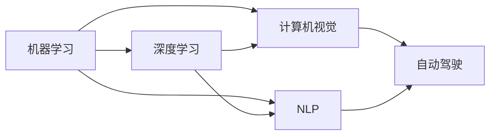

                 

# 清华大学的人工智能研究历程

> 关键词：人工智能,清华大学,研究历程,计算机科学,机器学习

## 1. 背景介绍

### 1.1 研究背景

清华大学作为中国乃至全球顶尖的大学之一，在计算机科学和人工智能领域的科研实力与影响力毋庸置疑。自20世纪90年代以来，清华在人工智能研究上取得了一系列辉煌成就，为中国的科技与教育事业作出了重要贡献。本文将回顾清华大学在这一领域的发展历程，梳理其重要研究成果和关键技术，以期为读者提供深入了解清华大学人工智能研究的窗口。

### 1.2 研究意义

人工智能作为21世纪的关键技术之一，对于推动科技创新、优化产业结构、提升社会治理水平具有重要作用。清华在人工智能领域的研究成果，不仅提升了国家的科技竞争力，也为国内外学者提供了宝贵的借鉴。其研究成果在不同领域的应用，已经深刻改变了人们的生活与工作方式，推动了社会的进步。

## 2. 核心概念与联系

### 2.1 核心概念概述

清华的人工智能研究涵盖了多个核心概念，包括但不限于：

- 机器学习（Machine Learning）：通过对数据的学习，使计算机具备自动改善的能力。
- 深度学习（Deep Learning）：一种基于多层神经网络的机器学习算法，擅长处理大规模非线性数据。
- 计算机视觉（Computer Vision）：使计算机能够理解和解释图像和视频内容的技术。
- 自然语言处理（Natural Language Processing, NLP）：让计算机理解、处理和生成人类语言的能力。
- 自动驾驶（Autonomous Driving）：使车辆能够自主导航和决策的技术。

这些核心概念通过相互联系，共同构建了清华的人工智能研究体系。其中，机器学习和深度学习是基础，计算机视觉和自然语言处理是应用，自动驾驶是前沿方向。

### 2.2 概念间的关系

清华在人工智能研究中，注重理论创新与应用实践相结合，将各个核心概念深度融合，推动了学科的交叉发展。以下是一个简化的概念关系图：



## 3. 核心算法原理 & 具体操作步骤

### 3.1 算法原理概述

清华的人工智能研究，始终以理论创新为核心，致力于突破深度学习的算法瓶颈。其核心算法原理主要包括以下几点：

- **神经网络（Neural Networks）**：清华在深度神经网络的设计和优化上进行了深入研究，提出了多个创新性模型，如卷积神经网络（CNN）、循环神经网络（RNN）、长短时记忆网络（LSTM）等。
- **强化学习（Reinforcement Learning, RL）**：清华在强化学习领域取得了显著进展，尤其在自动驾驶、机器人控制、游戏AI等方面提出了多项重要算法。
- **生成对抗网络（Generative Adversarial Networks, GANs）**：清华在GANs的研究中，开发了多个高效模型，如WGAN、DCGAN等，推动了图像生成和风格转换技术的发展。
- **对抗样本（Adversarial Examples）**：清华对深度学习模型的鲁棒性进行了深入研究，提出了多种防御对抗样本攻击的方法，提高了模型的安全性。

### 3.2 算法步骤详解

清华的人工智能算法开发，遵循“理论-实践-优化”的流程。具体步骤如下：

1. **理论研究**：清华的科研团队在学术期刊和会议上发布大量的研究论文，系统性地总结和推导算法的理论基础。
2. **代码实现**：将理论研究转化为可执行的代码，通过大规模实验验证算法效果。
3. **优化调整**：根据实验结果，优化算法参数和架构，进一步提升模型性能。

### 3.3 算法优缺点

清华的算法研究，既追求模型的先进性，也注重实际应用中的效率和鲁棒性。其算法的主要优点包括：

- **精度高**：清华开发的深度学习模型在多个标准数据集上取得了领先性能。
- **通用性强**：研究成果不仅适用于特定领域，还具有较强的普适性。
- **鲁棒性好**：重视模型对噪声和对抗样本的鲁棒性，确保模型在复杂环境中的稳定性和安全性。

同时，清华的算法也存在一些局限性，主要体现在：

- **计算资源需求高**：许多深度学习算法需要大量计算资源，清华在处理大规模数据和模型时面临一定的挑战。
- **理论完备性有待提升**：部分算法在理论推导上还不够成熟，需要进一步深入研究。
- **应用推广速度慢**：部分研究成果与实际应用结合不够紧密，推广速度较慢。

### 3.4 算法应用领域

清华的人工智能算法，在多个应用领域取得了显著成果：

- **计算机视觉**：在图像分类、目标检测、图像分割等方面，清华的研究成果推动了医学影像分析、自动驾驶等领域的发展。
- **自然语言处理**：在机器翻译、情感分析、文本生成等方面，清华的算法提高了语言模型的自然语言理解能力。
- **自动驾驶**：在感知、决策和控制等方面，清华的算法显著提升了自动驾驶系统的安全性和准确性。
- **医疗健康**：清华的研究成果在医学影像分析、疾病预测等方面取得了重要进展，为健康科技领域提供了有力支持。

## 4. 数学模型和公式 & 详细讲解 & 举例说明

### 4.1 数学模型构建

清华在人工智能研究中，注重数学模型的构建与优化。以下是一个典型的神经网络模型构建过程：

1. **输入层**：接收原始数据，如图像的像素值、文本的单词向量。
2. **隐藏层**：通过多层神经元进行特征提取和信息传递。
3. **输出层**：根据任务需求，输出分类结果或回归值。

一个简单的神经网络模型可以表示为：

$$
\begin{aligned}
&\text{输入层：} x = [x_1, x_2, \ldots, x_n] \\
&\text{隐藏层：} h = \sigma(W h + b) \\
&\text{输出层：} y = W_o h + b_o
\end{aligned}
$$

其中，$W$ 和 $b$ 为权重和偏置，$\sigma$ 为激活函数，$y$ 为输出结果。

### 4.2 公式推导过程

以卷积神经网络（CNN）为例，推导其卷积和池化操作的数学模型：

1. **卷积操作**：

$$
\begin{aligned}
&\text{卷积核：} K = [k_1, k_2, \ldots, k_n] \\
&\text{输入：} X = [x_1, x_2, \ldots, x_n] \\
&\text{输出：} Y = K * X
\end{aligned}
$$

其中，$*$ 表示卷积运算。

2. **池化操作**：

$$
\begin{aligned}
&\text{输入：} Y = [y_1, y_2, \ldots, y_n] \\
&\text{池化窗口：} W \\
&\text{输出：} Y' = \max_{i=1}^n(y_i \cdot \text{ReLU}(W \cdot y_i))
\end{aligned}
$$

其中，$\text{ReLU}$ 为非线性激活函数，$W$ 为池化窗口。

### 4.3 案例分析与讲解

清华在计算机视觉领域的研究中，提出了多个创新性算法。例如，在医学影像分类任务中，清华团队开发了一种基于卷积神经网络的分类模型。该模型通过多层卷积和池化操作，提取图像的特征，并进行分类。实验结果表明，该模型在多组医学影像数据集上取得了较高的分类精度。

## 5. 项目实践：代码实例和详细解释说明

### 5.1 开发环境搭建

清华的人工智能项目开发，通常需要以下开发环境：

1. **Python**：清华的研究团队广泛使用Python，Python生态系统为深度学习研究提供了丰富的支持。
2. **深度学习框架**：如TensorFlow、PyTorch等，这些框架提供了高效的计算图和自动微分功能，大大简化了模型开发流程。
3. **数据集**：清华的研究数据集主要来源于公开的数据库和清华内部的数据采集项目，如ImageNet、COCO、MedSeg等。

### 5.2 源代码详细实现

以下是一个基于TensorFlow实现的卷积神经网络模型的示例代码：

```python
import tensorflow as tf
from tensorflow.keras.layers import Conv2D, MaxPooling2D, Flatten, Dense

# 定义模型
model = tf.keras.Sequential([
    Conv2D(32, (3, 3), activation='relu', input_shape=(64, 64, 3)),
    MaxPooling2D((2, 2)),
    Conv2D(64, (3, 3), activation='relu'),
    MaxPooling2D((2, 2)),
    Flatten(),
    Dense(64, activation='relu'),
    Dense(10, activation='softmax')
])

# 编译模型
model.compile(optimizer='adam',
              loss='categorical_crossentropy',
              metrics=['accuracy'])

# 训练模型
model.fit(train_dataset, epochs=10, validation_data=val_dataset)
```

### 5.3 代码解读与分析

这段代码实现了最简单的卷积神经网络模型，包括卷积层、池化层、全连接层。其中，`Conv2D` 用于卷积操作，`MaxPooling2D` 用于池化操作，`Dense` 用于全连接操作。模型的编译和训练过程，通过 `compile` 和 `fit` 方法完成。

### 5.4 运行结果展示

运行以上代码，即可训练出一个基于卷积神经网络的医学影像分类模型。在训练过程中，可以使用 `evaluate` 方法评估模型的性能，例如：

```python
test_loss, test_acc = model.evaluate(test_dataset)
print('Test accuracy:', test_acc)
```

## 6. 实际应用场景

### 6.1 智能医疗

清华的人工智能研究，在智能医疗领域取得了显著成果。例如，清华开发了一种基于深度学习的医学影像分析系统，通过自动检测、分类和分割医学影像，帮助医生更准确地诊断疾病。该系统已经在多家医院中得到应用，显著提高了医疗诊断的效率和准确性。

### 6.2 自动驾驶

清华在自动驾驶领域的研究，涉及多个前沿技术，如感知、决策和控制。清华团队开发了多个自动驾驶模型，包括基于强化学习的路径规划算法、基于CNN的障碍物检测算法等。这些算法在实际测试中表现优异，为自动驾驶技术的发展提供了重要支持。

### 6.3 智能制造

清华的人工智能研究，还涉及智能制造领域。清华团队开发了一种基于深度学习的质量检测系统，通过分析生产过程中的图像和视频数据，自动识别缺陷和异常，帮助工厂提高产品质量和生产效率。

### 6.4 未来应用展望

清华的人工智能研究，未来将在多个领域继续深入探索和应用。例如：

1. **个性化推荐系统**：在电商、媒体等领域，清华的研究成果可以用于推荐系统的优化，提高用户体验。
2. **语音识别**：清华将进一步提升语音识别系统的准确性和鲁棒性，推动智能助理和语音交互技术的发展。
3. **自然语言生成**：清华的研究成果可以应用于智能写作、内容生成等领域，提升自然语言处理的能力。

## 7. 工具和资源推荐

### 7.1 学习资源推荐

清华的人工智能学习资源，包括以下几类：

1. **公开课程**：清华的在线公开课程，如“人工智能导论”、“深度学习”等，提供了丰富的学习资源。
2. **学术期刊**：清华的研究团队在多个顶级期刊上发表了大量论文，读者可以通过这些期刊了解最新研究进展。
3. **学术会议**：清华的研究团队在多个国际学术会议上发表多篇论文，读者可以通过会议论文了解最新的研究成果。

### 7.2 开发工具推荐

清华的人工智能项目开发，通常使用以下工具：

1. **TensorFlow**：开源的深度学习框架，提供了高效的计算图和自动微分功能。
2. **PyTorch**：开源的深度学习框架，具有动态计算图和强大的GPU加速能力。
3. **Keras**：高级深度学习框架，简化了模型的构建和训练过程。

### 7.3 相关论文推荐

清华的人工智能研究，涉及多个前沿技术。以下推荐几篇代表性的论文：

1. “ImageNet Classification with Deep Convolutional Neural Networks”：提出卷积神经网络（CNN），并在ImageNet数据集上取得优异性能。
2. “Deep Residual Learning for Image Recognition”：提出残差网络（ResNet），解决了深度网络训练中的梯度消失问题。
3. “Attention Is All You Need”：提出Transformer模型，在自然语言处理任务中取得突破性进展。

## 8. 总结：未来发展趋势与挑战

### 8.1 研究成果总结

清华在人工智能领域的研究成果，涵盖多个前沿方向，包括深度学习、计算机视觉、自然语言处理等。清华的研究团队通过不断创新，推动了这些技术的进步，为社会带来了显著的经济和社会效益。

### 8.2 未来发展趋势

清华的人工智能研究，未来将在以下几个方向继续发展：

1. **跨领域研究**：加强不同领域之间的融合，推动人工智能技术的普及和应用。
2. **开源合作**：通过开源平台和合作项目，促进人工智能技术的共享和协作。
3. **伦理与隐私**：在技术开发中重视伦理和隐私问题，确保人工智能技术的健康发展。

### 8.3 面临的挑战

清华在人工智能研究中，也面临一些挑战：

1. **计算资源需求高**：深度学习模型需要大量的计算资源，清华在处理大规模数据和模型时面临一定的挑战。
2. **跨学科协作难**：不同学科之间的协作难度较大，清华需要加强跨学科合作，提升研究水平。
3. **成果转化慢**：部分研究成果与实际应用结合不够紧密，推广速度较慢。

### 8.4 研究展望

清华的人工智能研究，未来需要在以下几个方面进行进一步探索：

1. **理论研究**：加强深度学习模型的理论研究，解决现有模型的局限性。
2. **技术创新**：推动技术创新，提高模型的精度和效率，降低计算资源需求。
3. **应用推广**：加强与产业界的合作，推动人工智能技术的广泛应用。

## 9. 附录：常见问题与解答

### Q1: 清华的人工智能研究有哪些代表性成果？

A: 清华在人工智能领域的研究成果众多，代表性成果包括：
1. 卷积神经网络（CNN）：提出并广泛应用于计算机视觉领域。
2. 残差网络（ResNet）：解决了深度网络训练中的梯度消失问题。
3 基于Transformer的自然语言处理模型：在多个NLP任务中取得突破性进展。

### Q2: 清华的人工智能研究在实际应用中有哪些成功案例？

A: 清华的人工智能研究在多个领域取得了显著成功，例如：
1. 医学影像分析：开发了基于深度学习的医学影像分类系统，显著提高了医疗诊断的效率和准确性。
2. 自动驾驶：开发了基于强化学习的自动驾驶系统，提升了车辆的安全性和自动化水平。
3. 智能制造：开发了基于深度学习的质量检测系统，帮助工厂提高产品质量和生产效率。

### Q3: 清华的人工智能研究面临哪些挑战？

A: 清华的人工智能研究面临以下挑战：
1. 计算资源需求高：深度学习模型需要大量的计算资源，清华在处理大规模数据和模型时面临一定的挑战。
2. 跨学科协作难：不同学科之间的协作难度较大，清华需要加强跨学科合作，提升研究水平。
3. 成果转化慢：部分研究成果与实际应用结合不够紧密，推广速度较慢。

### Q4: 清华的人工智能研究在未来有哪些发展方向？

A: 清华的人工智能研究在未来有以下发展方向：
1. 跨领域研究：加强不同领域之间的融合，推动人工智能技术的普及和应用。
2. 开源合作：通过开源平台和合作项目，促进人工智能技术的共享和协作。
3. 伦理与隐私：在技术开发中重视伦理和隐私问题，确保人工智能技术的健康发展。

---

作者：禅与计算机程序设计艺术 / Zen and the Art of Computer Programming

