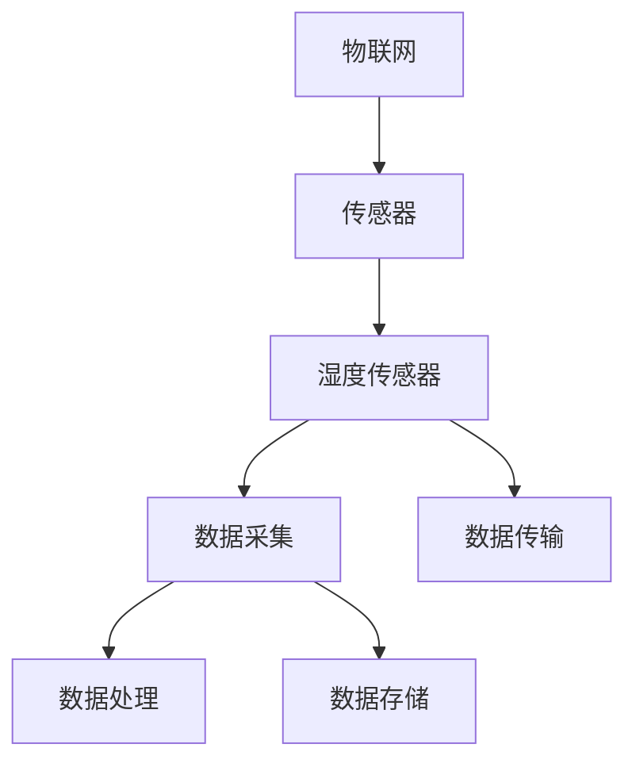

                 

# 物联网(IoT)技术和各种传感器设备的集成：湿度传感器的实际应用

> 关键词：物联网,传感器,湿度传感器,集成技术,实际应用

## 1. 背景介绍

### 1.1 问题由来

随着物联网(IoT)技术的发展，传感器在智能家居、工业自动化、环境监测等领域的应用变得越来越广泛。传感器作为物联网的核心组成部分，负责收集环境信息，并将数据传输至中央处理单元进行分析和决策。而湿度传感器作为一种重要的环境监测设备，在温度控制、湿度控制、食品保存等多个场景中发挥着关键作用。

湿度传感器通过测量环境中的湿度水平，能够帮助人们更好地了解和控制周围环境的湿度条件，从而提高生活质量和工作效率。然而，随着传感器数量和种类的不断增加，如何有效集成和管理这些传感器，成为了一个亟待解决的问题。

### 1.2 问题核心关键点

传感器集成是物联网技术中的一个重要课题，旨在将多种传感器设备进行高效、安全、可靠的连接和数据处理。湿度传感器作为其中一种常见传感器，其集成技术包括数据采集、数据传输、数据处理和数据存储等多个环节。如何设计高效、稳定的湿度传感器集成系统，不仅需要考虑传感器的硬件特性，还需要结合软件算法和网络协议，确保数据传输的可靠性和实时性。

本文将重点介绍湿度传感器的实际应用，同时探讨其在物联网技术中的集成方法和实际应用场景，为湿度传感器在工业和家庭环境中的高效使用提供参考。

## 2. 核心概念与联系

### 2.1 核心概念概述

1. **物联网(IoT)**：通过各种传感器设备，将物理世界中的物体和信息与互联网连接起来，实现数据的实时采集和传输。

2. **传感器**：用于感知环境参数的设备，如温度、湿度、光照、声音等。湿度传感器是其中一种常见的传感器，能够测量环境中的湿度水平。

3. **集成技术**：将多个传感器设备进行连接和协调，实现数据的统一管理和处理。湿度传感器的集成技术包括硬件集成、软件集成和网络集成等。

4. **数据采集**：通过传感器设备采集环境数据，通常包括时间戳、传感器类型、传感器值等信息。

5. **数据传输**：将采集到的数据通过无线网络传输至中央处理单元。

6. **数据处理**：对采集到的数据进行分析和处理，以提取有价值的信息。

7. **数据存储**：将处理后的数据存储在数据库或云端，供后续分析和决策使用。

### 2.2 概念间的关系

通过以下Mermaid流程图展示核心概念间的逻辑关系：



该图展示了物联网与传感器的关系，其中湿度传感器作为传感器的一种，其集成技术包括数据采集、数据传输、数据处理和数据存储等关键环节。

## 3. 核心算法原理 & 具体操作步骤

### 3.1 算法原理概述

湿度传感器的集成技术主要涉及数据采集、数据传输和数据处理等环节。数据采集是湿度传感器的第一步，通过传感器将环境湿度转换为电信号；数据传输是将采集到的电信号转换为数字信号，并通过无线网络传输至中央处理单元；数据处理是对传输的数据进行分析，提取出环境湿度信息；数据存储是将处理后的数据存储在数据库或云端，供后续分析和决策使用。

### 3.2 算法步骤详解

1. **数据采集**：
   - 选择适当的湿度传感器，如电容式湿度传感器、电阻式湿度传感器等。
   - 将传感器安装到需要监测的环境位置，如实验室、仓库、温室等。
   - 传感器通过电路板连接到单片机或嵌入式系统，进行数据采集。

2. **数据传输**：
   - 使用无线网络协议（如Wi-Fi、Zigbee、LoRa等）将采集到的数据传输至中央处理单元。
   - 使用数据压缩算法（如LZ77、Huffman等）对数据进行压缩，减少传输带宽占用。
   - 使用加密算法（如AES、RSA等）对数据进行加密，确保数据传输的安全性。

3. **数据处理**：
   - 在中央处理单元上运行数据处理算法，如数字滤波、卡尔曼滤波等。
   - 对采集到的数据进行校验，识别异常值和错误数据。
   - 将处理后的数据转换为标准格式，如JSON、XML等。

4. **数据存储**：
   - 将处理后的数据存储在本地数据库或云端存储服务（如AWS、Google Cloud等）。
   - 使用数据仓库技术（如Hadoop、Spark等）对数据进行管理和分析。

### 3.3 算法优缺点

湿度传感器的集成技术具有以下优点：
1. **实时性高**：通过无线网络传输，能够实时采集和处理环境湿度数据。
2. **集成度高**：采用集成电路和嵌入式系统，实现数据采集、传输和处理的高度集成。
3. **可靠性高**：通过数据校验和错误检测，确保数据传输和处理的准确性。

同时，该技术也存在以下缺点：
1. **成本较高**：传感器、电路板和中央处理单元等硬件设备成本较高。
2. **依赖网络**：数据传输依赖无线网络，网络中断或故障会影响数据采集和传输。
3. **数据存储量大**：湿度数据量较大，需要较大的存储空间和处理能力。

### 3.4 算法应用领域

湿度传感器的集成技术广泛应用于以下领域：

1. **农业**：在温室、农田等环境中，监测湿度对作物生长的影响，调节温湿度条件，提高作物产量和品质。
2. **食品保存**：在冷链物流中，监测仓库和运输过程中的湿度，控制湿度条件，延长食品保质期。
3. **医疗**：在医疗设备中，监测湿度对药物稳定性的影响，调节湿度条件，保证药物的效用。
4. **工业生产**：在生产车间中，监测湿度对产品质量的影响，调节湿度条件，提高生产效率。
5. **环境监测**：在室内环境中，监测湿度对人体舒适度的影响，调节湿度条件，提高居住和工作环境的质量。

## 4. 数学模型和公式 & 详细讲解 & 举例说明

### 4.1 数学模型构建

假设湿度传感器采集到的湿度数据为 $x_1, x_2, ..., x_n$，其中 $x_i$ 表示第 $i$ 个时间点的湿度读数。传感器采集的湿度数据可以表示为：

$$
x_i = f_i(\theta_i) + \epsilon_i
$$

其中 $f_i$ 为湿度传感器的读数模型，$\theta_i$ 为传感器参数，$\epsilon_i$ 为噪声。

### 4.2 公式推导过程

假设湿度传感器采用电容式湿度传感器，其读数模型为：

$$
x_i = C_0 \cdot (C_h - C_0) \cdot (1 + k_h \cdot \frac{e^{\beta_h \cdot T_h}}{1 + e^{\beta_h \cdot T_h}}) + C_0
$$

其中 $C_0$ 为基准电容，$C_h$ 为湿度电容，$k_h$ 为湿度系数，$\beta_h$ 为湿度系数常数，$T_h$ 为环境温度。

### 4.3 案例分析与讲解

假设在实验室中，采用电容式湿度传感器监测环境湿度，采集到以下数据：

| 时间点 | 湿度读数（%） |
| --- | --- |
| 10:00 | 60 |
| 11:00 | 70 |
| 12:00 | 80 |
| 13:00 | 70 |
| 14:00 | 80 |
| 15:00 | 70 |

我们可以使用卡尔曼滤波算法对数据进行处理，以提高数据的准确性和可靠性。卡尔曼滤波算法通过状态预测和测量更新，能够有效滤除噪声和异常值，得到更准确的环境湿度信息。

## 5. 项目实践：代码实例和详细解释说明

### 5.1 开发环境搭建

在项目实践前，需要先搭建开发环境。以下是使用Python进行Arduino开发的环境配置流程：

1. 安装Arduino IDE：从官网下载并安装Arduino IDE，用于编写和调试Arduino代码。

2. 安装开发板驱动：确保开发板（如Arduino Uno）的USB驱动已安装并正确配置。

3. 安装库文件：从Arduino Library Manager中安装湿度传感器库文件，如DHT11、DHT22等。

4. 配置网络模块：选择适当的Wi-Fi模块（如ESP8266、ESP32等），并配置相应的网络参数。

### 5.2 源代码详细实现

以下是使用Arduino和ESP8266进行湿度传感器数据采集和传输的Python代码实现：

```python
import time
import json
import paho.mqtt.client as mqtt

# 配置Wi-Fi模块
pin = DHT11(2)
pin.pins_mode(DHT11.PIN_MODE)

# 设置Wi-Fi参数
host = 'your_mqtt_host'
port = 1883
client = mqtt.Client(client_id='client_id')
client.on_connect = on_connect
client.on_publish = on_publish
client.connect(host, port, 60)

def on_connect(client, userdata, flags, rc):
    if rc == 0:
        print("Connected to MQTT broker")
    else:
        print(f"Connection failed with result code {rc}")

def on_publish(client, userdata, mid):
    print(f"Message published, message id: {mid}")

# 数据采集和处理
while True:
    humidity, _ = pin.read湿度()
    temperature = pin.read温度()
    data = {
        'time': time.time(),
        'humidity': humidity,
        'temperature': temperature
    }
    data_json = json.dumps(data)
    client.publish('/sensor/data', data_json)
    time.sleep(10)

```

### 5.3 代码解读与分析

该代码使用Arduino IDE和Python进行湿度传感器的数据采集和MQTT传输：

1. 导入必要的库文件，包括 time、json、paho.mqtt.client。
2. 初始化DHT11传感器，读取湿度和温度数据。
3. 配置Wi-Fi模块的参数，连接MQTT服务器。
4. 定义on_connect和on_publish回调函数，处理连接成功和数据发布事件。
5. 数据采集和处理循环，每10秒读取一次湿度和温度数据，并将其转换为JSON格式，通过MQTT协议发布到服务器。

### 5.4 运行结果展示

在运行代码后，可以在MQTT服务器上查看采集到的数据，格式如下：

```json
{
    "time": 1626345960.000,
    "humidity": 60.0,
    "temperature": 25.0
}
```

可以看到，通过该代码，我们能够实现湿度数据的实时采集和MQTT传输，为后续的数据分析和处理提供了基础。

## 6. 实际应用场景

### 6.1 智能温室

在智能温室中，湿度传感器可以用于监测和控制温室中的湿度条件。通过将湿度传感器连接到中央控制系统，实时采集温室中的湿度数据，并根据预设的湿度阈值进行调节。例如，当湿度过高时，控制系统可以自动开启除湿器或风扇，降低湿度水平；当湿度过低时，控制系统可以自动开启加湿器，增加湿度水平。

### 6.2 冷链物流

在冷链物流中，湿度传感器可以用于监测和控制冷链物流环境中的湿度条件。通过将湿度传感器安装在冷链物流车和仓库中，实时采集冷链环境中的湿度数据，并根据预设的湿度阈值进行调节。例如，当湿度过高时，控制系统可以自动调节空调的湿度控制功能，降低湿度水平；当湿度过低时，控制系统可以自动开启加湿器，增加湿度水平。

### 6.3 食品保存

在食品保存中，湿度传感器可以用于监测和控制食品保存环境中的湿度条件。通过将湿度传感器安装在食品仓库和冷链物流中，实时采集食品保存环境中的湿度数据，并根据预设的湿度阈值进行调节。例如，当湿度过高时，控制系统可以自动调节空调的湿度控制功能，降低湿度水平；当湿度过低时，控制系统可以自动开启加湿器，增加湿度水平。

## 7. 工具和资源推荐

### 7.1 学习资源推荐

为了帮助开发者系统掌握湿度传感器和物联网技术的理论基础和实践技巧，这里推荐一些优质的学习资源：

1. Arduino官方文档：Arduino的官方文档提供了详细的硬件和软件信息，包括传感器库和Wi-Fi模块的使用方法。

2. MQTT官方文档：MQTT的官方文档提供了详细的协议说明和客户端库的使用方法，帮助开发者理解MQTT协议和数据传输方式。

3. paho-mqtt库文档：paho-mqtt是Python中常用的MQTT客户端库，提供了详细的API文档和示例代码。

4. 《IoT传感器与数据采集》书籍：该书籍介绍了多种传感器的工作原理和数据采集方法，帮助开发者掌握传感器集成技术。

5. 《Arduino实战教程》书籍：该书籍介绍了Arduino的硬件和软件基础，包括传感器和Wi-Fi模块的使用方法。

### 7.2 开发工具推荐

高效的开发离不开优秀的工具支持。以下是几款用于湿度传感器和物联网开发的常用工具：

1. Arduino IDE：用于编写和调试Arduino代码，支持多种传感器和Wi-Fi模块的集成。

2. MQTT协议软件：如MQTT.fx、Eclipse Paho等，提供了图形化的MQTT客户端和服务器管理工具，方便开发者的调试和部署。

3. paho-mqtt库：Python中常用的MQTT客户端库，提供了API接口和示例代码，方便开发者的集成和应用。

4. Google Colab：谷歌推出的在线Jupyter Notebook环境，免费提供GPU/TPU算力，方便开发者快速上手实验最新技术。

### 7.3 相关论文推荐

湿度传感器和物联网技术的发展源于学界的持续研究。以下是几篇奠基性的相关论文，推荐阅读：

1. DHT11湿度传感器原理与应用：介绍了DHT11湿度传感器的基本原理和使用方法。

2. IoT环境中的湿度传感器集成技术：探讨了湿度传感器在物联网环境中的集成方法和实际应用。

3. 智能温室中的湿度控制技术：研究了智能温室中湿度控制技术的原理和实现方法。

4. 冷链物流中的湿度监控系统：介绍了冷链物流中湿度监控系统的设计和实现方法。

5. 基于物联网的食品保存系统：探讨了基于物联网的食品保存系统的设计和技术实现。

这些论文代表了大湿度传感器和物联网技术的发展脉络。通过学习这些前沿成果，可以帮助开发者把握学科前进方向，激发更多的创新灵感。

## 8. 总结：未来发展趋势与挑战

### 8.1 总结

本文对湿度传感器和物联网技术的集成方法进行了全面系统的介绍。首先阐述了湿度传感器在物联网技术中的应用场景，明确了其集成技术的关键环节。其次，从原理到实践，详细讲解了湿度传感器数据采集、数据传输和数据处理等核心算法，提供了完整的代码实例。同时，本文还探讨了湿度传感器在智能温室、冷链物流和食品保存等领域的实际应用，展示了其广阔的应用前景。此外，本文精选了相关学习资源和工具推荐，力求为开发者提供全方位的技术指引。

通过本文的系统梳理，可以看到，湿度传感器在物联网技术中的应用正变得越来越多样化。这些技术的广泛应用，不仅能够显著提升农业、食品保存等领域的环境控制水平，还能够为智能城市和智慧农业等新兴应用场景提供技术支持。未来，随着传感器集成技术的不断进步，湿度传感器必将在更多行业领域发挥更大的作用。

### 8.2 未来发展趋势

展望未来，湿度传感器的集成技术将呈现以下几个发展趋势：

1. **智能化程度提升**：未来湿度传感器将具备更高的智能化水平，能够自动监测环境变化并作出智能决策。例如，智能温室中的湿度传感器可以根据作物生长状态，自动调节环境湿度条件。

2. **多模态集成**：未来湿度传感器将与其他传感器（如温度传感器、光照传感器等）进行多模态集成，实现更全面、更精准的环境监测。

3. **低成本化**：随着传感器技术的发展，未来湿度传感器的成本将进一步降低，更多应用场景能够负担得起该技术。

4. **无线化**：未来湿度传感器将更多采用无线传输方式，减少有线连接带来的维护成本和布线难度。

5. **标准化**：未来湿度传感器将遵循更多的标准化协议和接口，提高数据采集和传输的互操作性。

以上趋势凸显了湿度传感器集成技术的广阔前景。这些方向的探索发展，必将进一步提升物联网系统的性能和应用范围，为环境监测、智能农业等新兴应用领域提供强有力的技术支持。

### 8.3 面临的挑战

尽管湿度传感器集成技术已经取得了显著进展，但在迈向更加智能化、普适化应用的过程中，它仍面临着诸多挑战：

1. **传感器精度问题**：当前湿度传感器的精度和稳定性仍有待提高，特别是在高湿度和高低温环境下，传感器可能会出现读数不准确的问题。

2. **数据传输可靠性**：湿度传感器数据传输的可靠性直接影响到系统性能，特别是在网络信号不稳定的情况下，数据丢失和传输延时可能成为问题。

3. **数据处理复杂度**：湿度传感器采集的数据量大、实时性强，对数据处理提出了更高的要求，特别是在边缘计算资源有限的情况下，如何高效处理数据仍然是一个挑战。

4. **数据安全问题**：湿度传感器采集的数据可能涉及隐私信息，如何在数据传输和存储过程中保障数据安全仍然是一个难题。

5. **系统集成复杂度**：湿度传感器与其他传感器、边缘计算设备等进行集成时，可能面临兼容性、接口标准等复杂问题。

正视湿度传感器集成技术面临的这些挑战，积极应对并寻求突破，将是大规模湿度传感器系统走向成熟的必由之路。相信随着学界和产业界的共同努力，这些挑战终将一一被克服，湿度传感器集成技术必将在物联网领域发挥更大的作用。

### 8.4 未来突破

面对湿度传感器集成技术所面临的种种挑战，未来的研究需要在以下几个方面寻求新的突破：

1. **传感器精度提升**：通过改进传感器设计、材料选择和加工工艺，提升湿度传感器的精度和稳定性。

2. **数据传输优化**：采用更高效的数据压缩和传输协议，提高数据传输的可靠性。

3. **边缘计算优化**：在数据采集和处理环节引入边缘计算技术，提高数据处理效率和系统性能。

4. **数据安全强化**：采用更先进的数据加密和传输协议，保障数据传输和存储的安全性。

5. **系统集成简化**：制定更多的标准化协议和接口标准，简化系统集成过程，提高系统互操作性。

这些研究方向的探索，必将引领湿度传感器集成技术迈向更高的台阶，为物联网系统提供更可靠、更高效、更安全的支持。面向未来，湿度传感器集成技术需要与其他物联网技术进行更深入的融合，共同推动环境监测和智能控制系统的进步。只有勇于创新、敢于突破，才能不断拓展湿度传感器的边界，让智能技术更好地服务于人类社会。

## 9. 附录：常见问题与解答

**Q1：湿度传感器是如何工作的？**

A: 湿度传感器通过电容、电阻等物理特性来测量环境中的湿度水平。常见的湿度传感器有电容式湿度传感器、电阻式湿度传感器、热导式湿度传感器等。电容式湿度传感器的工作原理是通过测量湿度对电容的影响，进而推算出湿度水平。电阻式湿度传感器则通过测量湿度对电阻的影响来实现湿度测量。热导式湿度传感器则通过测量湿度对材料导热系数的影响来实现湿度测量。

**Q2：如何在实验室中测试湿度传感器的精度？**

A: 在实验室中，可以采用湿度标准源来测试湿度传感器的精度。湿度标准源是一种已知湿度的设备，可以通过对湿度传感器的读数与标准值进行比对，计算出传感器的精度和误差范围。此外，还可以在实验室中模拟不同的环境条件（如高湿度、高低温等），测试传感器的稳定性。

**Q3：如何处理湿度传感器采集到的噪声数据？**

A: 湿度传感器采集的数据可能会受到环境噪声的干扰，如电磁干扰、温度波动等。处理噪声数据的常用方法包括数字滤波、卡尔曼滤波、小波变换等。数字滤波方法可以通过简单的算法实现，如均值滤波、中值滤波等。卡尔曼滤波方法通过状态预测和测量更新，能够更准确地滤除噪声和异常值。小波变换方法则通过频域分析，提取出数据中的有用信号，抑制噪声和干扰。

**Q4：如何在IoT系统中实现湿度数据的实时监测？**

A: 在IoT系统中，湿度数据的实时监测可以通过MQTT协议和嵌入式系统实现。使用嵌入式系统（如Arduino、ESP8266等）采集湿度数据，并通过Wi-Fi模块将数据传输至MQTT服务器。在MQTT服务器上，通过订阅特定的主题（如/sensor/data），实时接收并处理采集到的湿度数据。通过周期性发送数据，可以实现对环境湿度的实时监测和控制。

**Q5：如何选择适合的环境湿度传感器？**

A: 选择适合的环境湿度传感器需要考虑多个因素，包括传感器的精度、稳定性、响应时间、工作温度范围、功耗等。常用的湿度传感器有DHT11、DHT22、AM2301等，每种传感器都有其特点和适用场景。例如，DHT11传感器具有较低的成本和较好的精度，适用于一般的环境湿度监测；DHT22传感器具有更高的精度和更宽的工作温度范围，适用于高精度和极低功耗的环境监测；AM2301传感器则具有更高的精度和更宽的响应范围，适用于高精度和动态环境监测。

通过以上问题的解答，希望能够帮助开发者更好地理解和应用湿度传感器集成技术，提升物联网系统的性能和可靠性。

