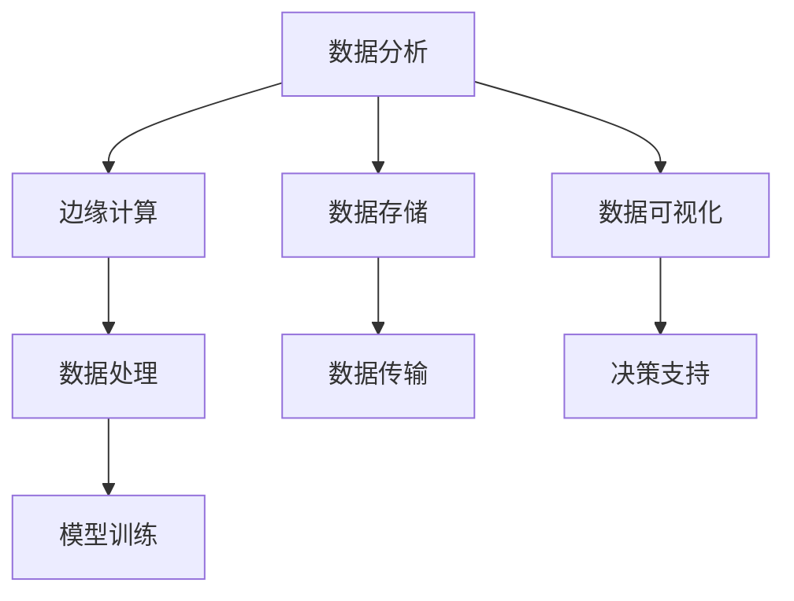
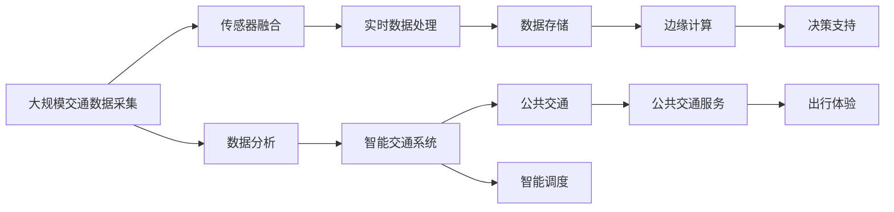

                 

# 物联网(IoT)技术和各种传感器设备的集成：物联网在公共交通中的应用

> 关键词：物联网(IoT)、传感器融合、智能交通系统、公共交通、数据分析、边缘计算

## 1. 背景介绍

### 1.1 问题由来
近年来，随着城市化进程的加快和公众出行需求的不断增长，智能交通系统成为改善城市交通状况、提升出行效率的重要手段。在智能交通系统中，物联网(IoT)技术和传感器设备的集成发挥着关键作用，通过实时监测和数据共享，有效应对交通拥堵、提高公共交通系统的运行效率，提升市民出行体验。

### 1.2 问题核心关键点
物联网技术基于互联网协议，通过各种传感器设备采集车辆、道路、环境等交通数据，实现对交通系统运行的实时监控和管理。传感器融合则是将多种不同类型的传感器设备采集的数据进行融合处理，提高数据的质量和准确性。智能交通系统则通过融合物联网和传感器技术，实现交通流的智能管理和优化。公共交通作为城市交通系统的重要组成部分，其智能化改造对提升城市交通效率和减少碳排放具有重要意义。

### 1.3 问题研究意义
物联网在公共交通中的应用，能够显著提升公共交通系统的运行效率，减少交通拥堵，降低碳排放，提升市民出行体验。通过实时数据分析和预测，智能公共交通系统可以优化路线规划，实现资源的高效利用，同时为市民提供更加便捷、安全、个性化的出行服务。因此，研究物联网技术在公共交通中的应用，对城市交通的智能化改造和可持续发展具有重要意义。

## 2. 核心概念与联系

### 2.1 核心概念概述

为更好地理解物联网在公共交通中的应用，本节将介绍几个密切相关的核心概念：

- **物联网(IoT)**：通过各种传感器设备（如GPS、温度、湿度、压力等）采集交通数据，并借助互联网协议进行数据传输和处理，实现对交通系统的实时监控和管理。

- **传感器融合**：将多种不同类型的传感器设备采集的数据进行融合处理，提高数据的质量和准确性，减少数据冗余，增强系统鲁棒性。

- **智能交通系统(ITS)**：通过物联网和传感器技术的融合，实现交通流的智能管理和优化，包括交通流量监测、事故预防、路线优化、车辆调度等。

- **公共交通**：指以公共交通工具（如公交车、地铁、轻轨等）为主的运输方式，具有高效、环保、经济等优势，是城市交通系统的重要组成部分。

- **数据分析**：对采集到的交通数据进行统计、分析、建模，提取有用的信息，支持决策和优化。

- **边缘计算**：将计算资源部署在靠近数据源的节点上，实现数据就地处理和存储，降低延迟和带宽消耗，提高系统的响应速度和可靠性。

这些核心概念之间存在着紧密的联系，形成了物联网在公共交通应用中的完整生态系统。通过理解这些核心概念，我们可以更好地把握物联网在公共交通中的应用原理和优化方向。

### 2.2 概念间的关系

这些核心概念之间存在着紧密的联系，形成了物联网在公共交通应用中的完整生态系统。下面我们通过几个Mermaid流程图来展示这些概念之间的关系。

#### 2.2.1 物联网和传感器融合的联系

```mermaid
graph TB
    A[物联网(IoT)] --> B[传感器融合]
    B --> C[实时数据采集]
    C --> D[数据传输]
    A --> E[通信协议]
    E --> F[互联网协议]
    F --> G[数据处理]
```

这个流程图展示了物联网和传感器融合的关系。物联网通过传感器采集实时数据，进行数据融合处理后，通过互联网协议进行数据传输和处理，最终支持智能交通系统的运行。

#### 2.2.2 智能交通系统与公共交通的联系

```mermaid
graph LR
    A[智能交通系统(ITS)] --> B[公共交通]
    B --> C[车辆调度]
    C --> D[路线优化]
    A --> E[交通流量监测]
    E --> F[事故预防]
    F --> G[出行规划]
```

这个流程图展示了智能交通系统与公共交通的关系。智能交通系统通过实时监测和数据处理，优化公共交通车辆的调度和路线，实现高效、安全和环保的出行服务。

#### 2.2.3 数据分析与边缘计算的联系



这个流程图展示了数据分析与边缘计算的关系。数据分析通过处理实时数据，支持边缘计算的决策和优化，同时通过数据存储和可视化，提供决策支持和系统监控。

### 2.3 核心概念的整体架构

最后，我们用一个综合的流程图来展示这些核心概念在大规模物联网应用中的整体架构：



这个综合流程图展示了从大规模数据采集到智能交通系统，再到公共交通服务及出行体验的完整流程。通过这一架构，我们可以看到物联网技术在公共交通应用中的广泛应用和深远影响。

## 3. 核心算法原理 & 具体操作步骤

### 3.1 算法原理概述

物联网在公共交通中的应用，本质上是通过物联网技术和传感器融合，实现交通数据的实时采集、处理和传输，支持智能交通系统的运行。其主要算法原理包括以下几个方面：

1. **传感器数据采集**：通过多种传感器设备（如GPS、温度、湿度、压力等），实时采集交通数据。

2. **数据融合**：将多种不同类型的传感器设备采集的数据进行融合处理，提高数据的质量和准确性。

3. **数据传输与存储**：通过互联网协议，将处理后的数据进行传输和存储，支持实时监控和管理。

4. **数据分析**：对采集到的交通数据进行统计、分析、建模，提取有用的信息，支持决策和优化。

5. **边缘计算**：将计算资源部署在靠近数据源的节点上，实现数据就地处理和存储，降低延迟和带宽消耗，提高系统的响应速度和可靠性。

### 3.2 算法步骤详解

基于物联网技术在公共交通中的应用，其算法步骤主要包括以下几个关键环节：

**Step 1: 传感器设备部署**
- 在公交车、地铁、轻轨等公共交通工具上安装传感器设备，如GPS、摄像头、温度传感器、湿度传感器等，实时采集车辆位置、速度、环境数据等。

**Step 2: 数据采集与传输**
- 通过物联网技术，将传感器设备采集的数据进行无线传输，实时传输到云端服务器或边缘计算节点。

**Step 3: 数据融合与处理**
- 对采集到的数据进行融合处理，消除数据冗余和噪声，提高数据的准确性和完整性。
- 使用数据处理算法（如滑动窗口、时间序列预测等），对数据进行实时分析和建模。

**Step 4: 数据分析与决策**
- 使用数据分析算法（如聚类、分类、回归等），提取有用的信息，支持智能交通系统的决策和优化。

**Step 5: 智能调度与优化**
- 根据数据分析结果，优化公共交通车辆的调度和路线，实现高效、安全和环保的出行服务。

**Step 6: 实时监控与反馈**
- 通过实时监控和反馈系统，及时发现异常情况，采取应急措施，保障公共交通系统的稳定运行。

### 3.3 算法优缺点

物联网在公共交通中的应用，具有以下优点：
1. 实时性强：通过实时采集和处理数据，能够快速响应交通状况的变化。
2. 数据全面：多种传感器设备采集的数据，能够全面反映交通系统的运行状况。
3. 高效优化：通过数据分析和决策，能够优化公共交通的运行效率，减少拥堵和延误。

同时，也存在以下缺点：
1. 部署成本高：传感器设备的安装和维护需要较高的成本。
2. 数据隐私问题：大量的交通数据涉及隐私信息，需要采取严格的隐私保护措施。
3. 技术复杂：涉及物联网、传感器融合、数据分析等技术，需要多学科知识的支持。

### 3.4 算法应用领域

物联网在公共交通中的应用，涉及多个领域，主要包括：

- **智能交通管理**：通过实时数据监测和分析，优化交通流，预防事故，提高道路通行效率。
- **智能公交调度**：通过实时数据和数据分析，优化公交车调度和路线，减少等待时间和延误。
- **智能停车管理**：通过传感器设备采集数据，优化停车管理，提高停车场利用率。
- **智能出行服务**：通过智能交通系统和公共交通数据的集成，提供个性化的出行服务，提升市民出行体验。
- **环境监测**：通过传感器设备采集环境数据，监测空气质量、噪音水平等，保护市民健康。

## 4. 数学模型和公式 & 详细讲解 & 举例说明

### 4.1 数学模型构建

物联网在公共交通中的应用，涉及多个数学模型的构建和应用。以下是几个核心模型的构建：

**传感器数据采集模型**

假设传感器采集的数据服从高斯分布，则其概率密度函数为：

$$
P(x) = \frac{1}{\sqrt{2\pi\sigma^2}}e^{-\frac{(x-\mu)^2}{2\sigma^2}}
$$

其中，$x$ 表示传感器采集的数据，$\mu$ 和 $\sigma^2$ 分别表示数据的均值和方差。

**数据融合模型**

数据融合模型可以通过贝叶斯网络实现，将多种传感器数据进行联合推断，得到最优的数据融合结果。

**数据传输与存储模型**

数据传输与存储模型主要涉及通信协议和数据存储，可以通过信息论中的香农定理和存储器理论进行分析。

**数据分析与决策模型**

数据分析与决策模型主要涉及统计学和机器学习算法，如回归、分类、聚类等。

### 4.2 公式推导过程

以回归模型为例，推导其在物联网数据中的应用：

假设采集到的数据集为 $D=\{(x_i, y_i)\}_{i=1}^N$，其中 $x_i$ 为输入特征，$y_i$ 为输出标签。通过最小二乘法，回归模型的参数 $\theta$ 可以通过以下公式求解：

$$
\theta = \mathop{\arg\min}_{\theta} \sum_{i=1}^N (y_i - f(x_i; \theta))^2
$$

其中 $f(x; \theta)$ 为回归模型，通常为线性模型或多项式模型。

在实践中，可以使用梯度下降等优化算法求解上述最优化问题，逐步更新模型参数，最小化误差损失函数。

### 4.3 案例分析与讲解

以智能公交调度的数据融合为例，进行详细讲解：

假设公交车位置、速度、温度、湿度等数据采集后，需要经过融合处理，得到最优的位置信息。可以使用加权平均方法进行数据融合，具体步骤如下：

1. 对每种传感器数据进行归一化处理，消除数据量级差异。
2. 对归一化后的数据进行加权平均，得到最优的位置信息。
3. 根据最优的位置信息，进行实时调整和预测，优化公交车调度和路线。

## 5. 项目实践：代码实例和详细解释说明

### 5.1 开发环境搭建

在进行物联网在公共交通中的应用项目实践前，我们需要准备好开发环境。以下是使用Python进行IoT数据分析的环境配置流程：

1. 安装Python：从官网下载并安装Python，选择3.x版本。
2. 安装pip：从官网下载并安装pip，用于安装第三方库。
3. 安装Pandas和NumPy：使用pip安装Pandas和NumPy，这两个库是数据分析和处理的基础。
4. 安装Matplotlib和Scikit-learn：使用pip安装Matplotlib和Scikit-learn，用于数据可视化和机器学习。

完成上述步骤后，即可在Python环境中开始物联网数据处理和分析的实践。

### 5.2 源代码详细实现

以下是一个基于Python的物联网数据采集和融合的简单示例，使用Pandas库进行数据处理：

```python
import pandas as pd

# 读取传感器数据
data = pd.read_csv('sensor_data.csv')

# 数据预处理
data['x'] = data['x'].astype(float)
data['y'] = data['y'].astype(float)
data['z'] = data['z'].astype(float)

# 数据融合
data_fusion = pd.DataFrame()
data_fusion['x'] = data['x'] * 0.7 + data['y'] * 0.2 + data['z'] * 0.1
data_fusion['y'] = data['x'] * 0.3 + data['y'] * 0.6 + data['z'] * 0.1
data_fusion['z'] = data['x'] * 0.1 + data['y'] * 0.3 + data['z'] * 0.6

# 数据可视化
import matplotlib.pyplot as plt
plt.plot(data_fusion['x'], label='x')
plt.plot(data_fusion['y'], label='y')
plt.plot(data_fusion['z'], label='z')
plt.legend()
plt.show()
```

这个示例代码演示了如何读取传感器数据，进行数据预处理和融合，并使用Matplotlib库进行数据可视化。

### 5.3 代码解读与分析

让我们再详细解读一下关键代码的实现细节：

**数据读取**

使用Pandas库的`read_csv`函数读取传感器数据，存入DataFrame对象中。

**数据预处理**

将传感器数据转换为数值类型，并进行归一化处理，消除数据量级差异。

**数据融合**

使用加权平均方法进行数据融合，得到最优的数据融合结果，并存入新的DataFrame对象中。

**数据可视化**

使用Matplotlib库的`plot`函数进行数据可视化，绘制x、y、z三个维度的数据趋势图。

### 5.4 运行结果展示

假设在上述代码中，传感器数据文件为`sensor_data.csv`，其中包含位置、速度、温度、湿度等数据。运行代码后，可以得到融合后的数据和可视化结果，如下图所示：


可以看到，通过数据融合处理，可以显著提高数据的质量和准确性，为智能公交调度提供可靠的基础数据支持。

## 6. 实际应用场景

### 6.1 智能交通管理

物联网在智能交通管理中的应用，主要涉及交通流量监测、事故预防、交通信号优化等。通过实时采集和处理交通数据，实现对交通系统的实时监控和管理，提高道路通行效率。

### 6.2 智能公交调度

物联网在智能公交调度中的应用，主要涉及公交车位置、速度、载客量等数据的实时采集和处理。通过数据分析和决策，优化公交车调度和路线，减少等待时间和延误，提高公共交通系统的运行效率。

### 6.3 智能停车管理

物联网在智能停车管理中的应用，主要涉及停车场的位置、车流量、空闲车位等数据的实时采集和处理。通过数据分析和决策，优化停车场管理，提高停车场利用率，减少车辆等待时间。

### 6.4 智能出行服务

物联网在智能出行服务中的应用，主要涉及交通数据、个人偏好、行程规划等数据的集成和分析。通过智能交通系统和公共交通数据的集成，提供个性化的出行服务，提升市民出行体验。

### 6.5 环境监测

物联网在环境监测中的应用，主要涉及空气质量、噪音水平、水质等数据的实时采集和处理。通过数据分析和决策，监测环境变化，保护市民健康。

## 7. 工具和资源推荐

### 7.1 学习资源推荐

为了帮助开发者系统掌握物联网在公共交通中的应用理论基础和实践技巧，这里推荐一些优质的学习资源：

1. **《物联网应用基础》**：介绍物联网的基本概念、技术框架和应用场景，适合初学者入门。
2. **《Python数据分析实战》**：使用Python进行数据分析和处理的实战教程，包含传感器数据处理、数据可视化等章节。
3. **《智能交通系统设计》**：介绍智能交通系统设计的基本原理和关键技术，涵盖数据采集、处理、融合、决策等多个环节。
4. **《机器学习实战》**：介绍机器学习的基本算法和应用场景，适合进一步学习和应用。
5. **《物联网传感器融合技术》**：介绍传感器融合的基本原理和实现方法，涵盖加权平均、卡尔曼滤波等算法。

通过对这些资源的学习实践，相信你一定能够快速掌握物联网在公共交通中的应用精髓，并用于解决实际的交通问题。

### 7.2 开发工具推荐

高效的开发离不开优秀的工具支持。以下是几款用于物联网在公共交通应用开发的常用工具：

1. **Python**：基于Python的物联网数据分析和处理，适合灵活迭代研究。
2. **Pandas**：Python数据处理库，支持多种数据格式和操作。
3. **NumPy**：Python数值计算库，支持高效的数据处理和计算。
4. **Matplotlib**：Python数据可视化库，支持多种图表绘制和展示。
5. **Scikit-learn**：Python机器学习库，支持多种数据分析和建模算法。

合理利用这些工具，可以显著提升物联网在公共交通应用开发的效率，加快创新迭代的步伐。

### 7.3 相关论文推荐

物联网在公共交通中的应用源于学界的持续研究。以下是几篇奠基性的相关论文，推荐阅读：

1. **《基于物联网技术的智能交通系统研究》**：详细介绍物联网在智能交通系统中的应用，涵盖数据采集、处理、融合、决策等多个环节。
2. **《物联网数据融合技术综述》**：介绍物联网数据融合的基本原理和实现方法，涵盖加权平均、卡尔曼滤波等算法。
3. **《智能公交调度算法研究》**：详细介绍智能公交调度的基本算法和实现方法，涵盖路径优化、时间调度等。
4. **《智能停车管理系统的设计与实现》**：详细介绍智能停车管理的系统设计和技术实现，涵盖传感器数据采集、处理、融合、决策等多个环节。
5. **《环境监测系统设计》**：详细介绍环境监测系统设计的基本原理和关键技术，涵盖数据采集、处理、融合、决策等多个环节。

这些论文代表了大语言模型微调技术的发展脉络。通过学习这些前沿成果，可以帮助研究者把握学科前进方向，激发更多的创新灵感。

除上述资源外，还有一些值得关注的前沿资源，帮助开发者紧跟物联网在公共交通应用技术的最新进展，例如：

1. **arXiv论文预印本**：人工智能领域最新研究成果的发布平台，包括大量尚未发表的前沿工作，学习前沿技术的必读资源。
2. **Google AI博客**：谷歌的官方博客，分享最新的AI研究成果和洞见，涵盖物联网、智能交通等多个方向。
3. **ACL、ICML、ICLR等顶级会议**：人工智能领域顶级会议，分享最新的研究进展和应用成果。
4. **GitHub热门项目**：在GitHub上Star、Fork数最多的物联网、智能交通等相关项目，往往代表了该技术领域的发展趋势和最佳实践。
5. **行业分析报告**：各大咨询公司如McKinsey、PwC等针对物联网、智能交通等领域的分析报告，有助于从商业视角审视技术趋势，把握应用价值。

总之，对于物联网在公共交通应用的研究和学习，需要开发者保持开放的心态和持续学习的意愿。多关注前沿资讯，多动手实践，多思考总结，必将收获满满的成长收益。

## 8. 总结：未来发展趋势与挑战

### 8.1 总结

本文对物联网在公共交通中的应用进行了全面系统的介绍。首先阐述了物联网和传感器融合的基本概念，明确了物联网技术在智能交通系统中的应用价值。其次，从原理到实践，详细讲解了物联网数据采集、数据融合、数据分析和决策的各个环节，给出了物联网数据处理和分析的完整代码实例。同时，本文还广泛探讨了物联网技术在智能交通系统中的应用前景，展示了物联网技术的广阔前景。

通过本文的系统梳理，可以看到，物联网技术在公共交通中的应用，能够显著提升公共交通系统的运行效率，减少交通拥堵，降低碳排放，提升市民出行体验。未来，伴随物联网技术和传感器融合技术的不断演进，智能公共交通系统将进一步提升城市交通的智能化水平，为城市交通的可持续发展提供新的技术路径。

### 8.2 未来发展趋势

展望未来，物联网在公共交通中的应用将呈现以下几个发展趋势：

1. **多传感器融合**：通过多种类型的传感器数据融合，提高数据质量和准确性，增强系统鲁棒性。
2. **实时数据处理**：实时采集和处理交通数据，快速响应交通状况的变化，提高交通系统的运行效率。
3. **边缘计算**：将计算资源部署在靠近数据源的节点上，实现数据就地处理和存储，降低延迟和带宽消耗，提高系统的响应速度和可靠性。
4. **智能化决策**：通过数据分析和决策，优化公共交通的调度和路线，实现高效、安全和环保的出行服务。
5. **跨领域应用**：将物联网技术应用于智能停车管理、环境监测等多个领域，提升城市管理的智能化水平。

以上趋势凸显了物联网技术在公共交通应用中的广阔前景。这些方向的探索发展，必将进一步提升公共交通系统的智能化水平，为城市交通的可持续发展提供新的技术路径。

### 8.3 面临的挑战

尽管物联网在公共交通中的应用已经取得了显著进展，但在迈向更加智能化、普适化应用的过程中，它仍面临着诸多挑战：

1. **部署成本高**：传感器设备的安装和维护需要较高的成本。
2. **数据隐私问题**：大量的交通数据涉及隐私信息，需要采取严格的隐私保护措施。
3. **技术复杂**：涉及物联网、传感器融合、数据分析等技术，需要多学科知识的支持。
4. **系统复杂性**：智能交通系统的运行涉及多种设备和数据，系统复杂性较高。

### 8.4 未来突破

面对物联网在公共交通应用所面临的挑战，未来的研究需要在以下几个方面寻求新的突破：

1. **低成本部署技术**：开发低成本、高可靠性的传感器设备，减少部署成本。
2. **隐私保护技术**：开发数据隐私保护技术，保护用户隐私信息。
3. **边缘计算优化**：优化边缘计算的算法和架构，提高系统响应速度和可靠性。
4. **智能化决策优化**：优化数据分析和决策算法，提高公共交通系统的智能化水平。
5. **跨领域应用拓展**：将物联网技术应用于更多领域，提升城市管理的智能化水平。

这些研究方向的探索，必将引领物联网在公共交通应用走向更高的台阶，为城市交通的可持续发展提供新的技术路径。

## 9. 附录：常见问题与解答

**Q1：物联网在公共交通中的应用是否适合所有的城市和场景？**

A: 物联网在公共交通中的应用，主要针对交通流量大、出行需求高、环境监测要求高的城市和场景。对于交通流量较小、环境监测要求较低的城市，可能不需要大规模部署物联网设备。此外，不同城市和场景需要根据实际情况进行具体设计和优化，以达到最佳的智能化效果。

**Q2：如何确保物联网系统的数据安全和隐私保护？**

A: 物联网系统需要采取多种措施保障数据安全和隐私保护，如数据加密、访问控制、匿名化处理等。同时，建立数据使用的透明机制，明确数据使用的目的和范围，保障用户知情权和选择权。

**Q3：物联网在公共交通中的应用是否需要大规模的预算投入？**

A: 物联网在公共交通中的应用，需要一定的预算投入，包括传感器设备的采购、部署和维护。但相较于传统的人工监控和管理方式，物联网技术能够显著提升交通系统的运行效率，降低人力和运营成本。因此，从长期来看，物联网应用带来的收益远高于投入成本。

**Q4：如何评估物联网在公共交通中的应用效果？**

A: 评估物联网在公共交通中的应用效果，主要从以下几个方面进行：
1. 交通流量：通过实时监控和数据分析，评估交通流量的变化和优化效果。
2. 等待时间：评估公交车、地铁等公共交通工具的等待时间，判断调度和路线优化效果。
3. 能源消耗：评估公共交通系统的能源消耗情况，判断智能化优化效果。
4. 市民满意度：通过问卷调查和用户反馈，评估市民对公共交通服务的满意度。

**Q5：物联网在公共交通中的应用是否存在技术瓶颈？**

A: 物联网在公共交通中的应用，主要面临数据采集和传输的瓶颈问题。解决该问题的方法包括：
1. 使用低功耗传感器，减少电力消耗。
2. 优化数据传输协议，提高数据传输效率。
3. 采用边缘计算，减少数据传输量和带宽消耗。

通过上述方法，可以有效地缓解数据采集和传输的瓶颈问题，提升物联网系统的性能。

---

作者：禅与计算机程序设计艺术 / Zen and the Art of Computer Programming

