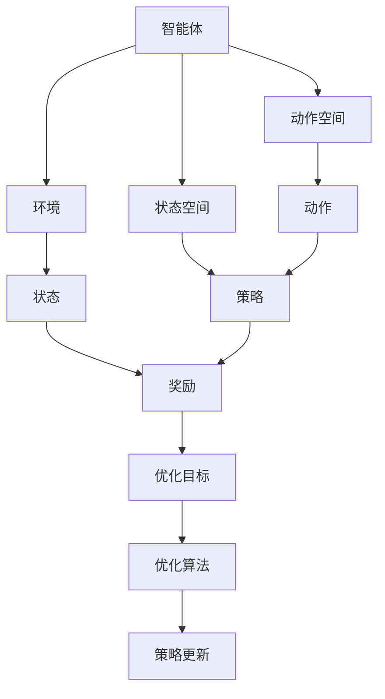
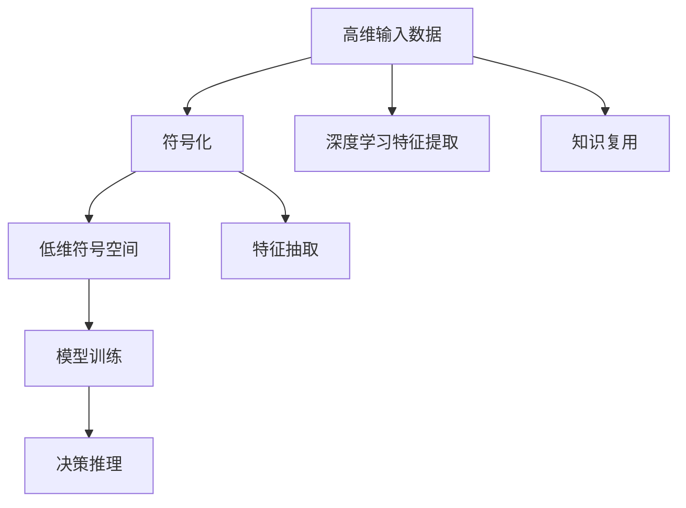
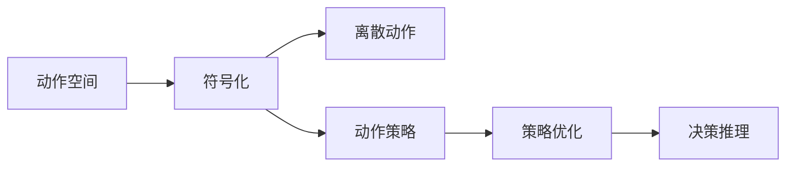
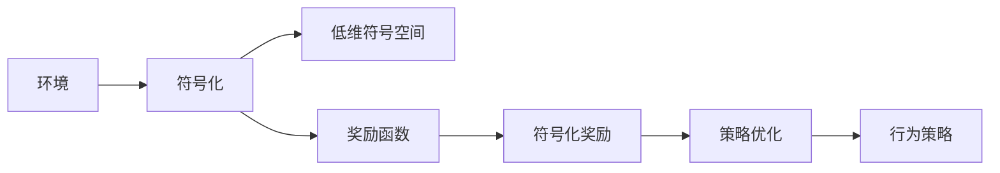
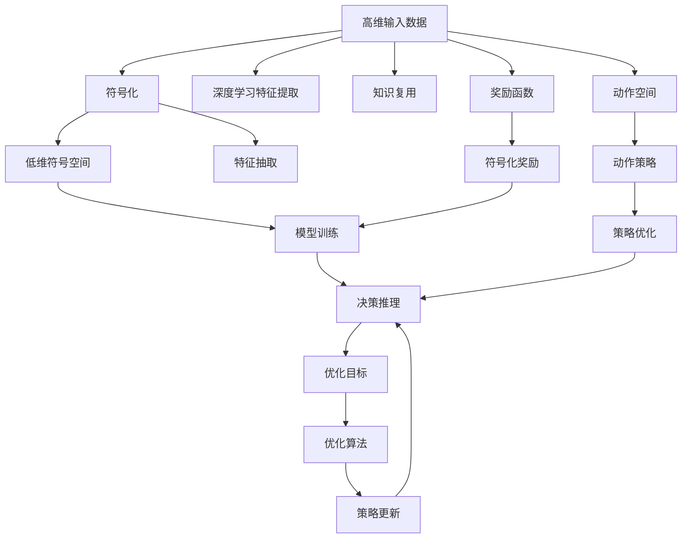

                 

# 强化学习Reinforcement Learning的抽象表示学习与应用方法

> 关键词：强化学习, 抽象表示学习, 应用方法, 深度学习, 环境建模, 奖励函数, 动作选择, 策略优化

## 1. 背景介绍

### 1.1 问题由来
强化学习(Reinforcement Learning, RL)是机器学习的一个重要分支，旨在通过试错和奖励机制，学习智能体在环境中的行为策略。RL已经成功应用于游戏、机器人控制、金融交易、自然语言处理等多个领域，展现出强大的智能化能力。

然而，传统RL方法依赖于高维状态空间和动作空间，模型训练复杂度较高，泛化能力有限。为了解决这些问题，研究者们提出了多种抽象表示学习(Representative Learning)的方法，通过对环境进行符号化、压缩等处理，降低模型的复杂度，提升RL的效果。

### 1.2 问题核心关键点
抽象表示学习的核心思想是通过特征抽取和知识复用，提高模型的泛化能力，使其能更好地适应复杂环境。通过结合深度学习、符号计算等技术，抽象表示学习能够将高维输入数据映射到低维、高表达能力的符号空间，降低模型训练的复杂度，同时提升学习效率和效果。

在RL中，抽象表示学习的应用主要包括：

- 环境建模：通过对环境进行符号化，将连续高维的环境转化为离散的低维符号空间，降低模型复杂度，提升训练和推理速度。
- 动作选择：通过符号化动作空间，将连续的动作映射到符号空间，使模型更容易学习离散的动作策略。
- 奖励函数设计：通过符号化奖励函数，将连续的奖励信号转化为离散的符号信号，提升奖励的准确性和可解释性。
- 策略优化：通过符号化策略表示，使用符号计算和深度学习相结合的方式，优化策略空间，提高学习效率和效果。

### 1.3 问题研究意义
抽象表示学习在RL中的应用，对于提升模型泛化能力、降低训练复杂度、提升学习效率和效果具有重要意义：

1. 降低复杂度：通过符号化，将高维环境、动作、奖励等映射到低维符号空间，显著降低模型复杂度，提升训练和推理速度。
2. 提高泛化能力：通过特征抽取和知识复用，提高模型的泛化能力，使其能够更好地适应复杂环境。
3. 提升学习效率：通过符号化处理，将连续的输入信号转化为离散符号信号，提高模型的学习效率，加速模型收敛。
4. 增强可解释性：通过符号化表示，提升模型的可解释性，帮助开发者更好地理解模型的行为和决策逻辑。
5. 实现零样本学习：通过符号化处理，使得模型能够从少量样本中学习到通用的规则和知识，实现零样本学习。

## 2. 核心概念与联系

### 2.1 核心概念概述

为更好地理解抽象表示学习在RL中的应用，本节将介绍几个密切相关的核心概念：

- 强化学习(Reinforcement Learning, RL)：通过智能体与环境的交互，智能体通过试错学习最优行为策略的过程。
- 抽象表示学习(Representative Learning)：通过符号化、压缩等技术，将高维输入数据映射到低维、高表达能力的符号空间。
- 动作选择(Action Selection)：智能体在环境中选择动作的过程，是RL中的关键步骤。
- 策略优化(Policy Optimization)：通过优化策略函数，使智能体在环境中的行为策略更加智能和高效。
- 环境建模(Environment Modeling)：通过对环境进行符号化处理，将连续高维的环境转化为离散的低维符号空间。
- 奖励函数(Reward Function)：用于评价智能体在环境中的行为策略，是RL中的核心要素。

这些核心概念之间的逻辑关系可以通过以下Mermaid流程图来展示：



这个流程图展示了一轮RL过程中的主要步骤：

1. 智能体在环境中接收状态信息，选择动作，观察环境。
2. 环境根据动作产生状态和奖励，智能体根据奖励更新策略。
3. 通过优化算法，持续优化策略，提升智能体的行为表现。

### 2.2 概念间的关系

这些核心概念之间存在着紧密的联系，形成了RL的完整生态系统。下面我通过几个Mermaid流程图来展示这些概念之间的关系。

#### 2.2.1 RL的抽象表示学习范式



这个流程图展示了抽象表示学习在RL中的应用过程：

1. 将高维输入数据进行符号化处理，转换为低维符号空间。
2. 使用深度学习技术进行特征抽取，提取输入数据的高级特征表示。
3. 将特征抽取的结果进行知识复用，提升模型的泛化能力。
4. 将符号化的数据输入模型进行训练，得到抽象表示。
5. 使用抽象表示进行决策推理，提升智能体的行为表现。

#### 2.2.2 动作选择和策略优化



这个流程图展示了动作选择和策略优化的过程：

1. 将连续的动作空间进行符号化处理，转换为离散动作。
2. 通过符号化处理的动作策略，使用深度学习等技术进行优化。
3. 通过优化后的策略进行决策推理，提升智能体的行为表现。

#### 2.2.3 环境建模和奖励函数



这个流程图展示了环境建模和奖励函数的过程：

1. 将连续高维的环境进行符号化处理，转换为低维符号空间。
2. 设计符号化的奖励函数，将连续的奖励信号转化为离散的符号信号。
3. 使用符号化的奖励函数进行策略优化，提升智能体的行为表现。

### 2.3 核心概念的整体架构

最后，我们用一个综合的流程图来展示这些核心概念在大语言模型微调过程中的整体架构：



这个综合流程图展示了抽象表示学习在大语言模型微调中的应用过程：

1. 将高维输入数据进行符号化处理，转换为低维符号空间。
2. 使用深度学习技术进行特征抽取，提取输入数据的高级特征表示。
3. 将特征抽取的结果进行知识复用，提升模型的泛化能力。
4. 将符号化的数据输入模型进行训练，得到抽象表示。
5. 使用抽象表示进行决策推理，提升智能体的行为表现。
6. 将动作空间进行符号化处理，转换为离散动作。
7. 通过符号化处理的动作策略，使用深度学习等技术进行优化。
8. 使用符号化的奖励函数进行策略优化，提升智能体的行为表现。
9. 使用优化算法，持续优化策略，提升智能体的行为表现。

通过这些流程图，我们可以更清晰地理解抽象表示学习在大语言模型微调过程中各个核心概念的关系和作用，为后续深入讨论具体的微调方法和技术奠定基础。

## 3. 核心算法原理 & 具体操作步骤
### 3.1 算法原理概述

抽象表示学习的核心思想是通过符号化、压缩等技术，将高维输入数据映射到低维、高表达能力的符号空间，提升模型的泛化能力和学习效率。在强化学习中，抽象表示学习的应用主要包括：

- 环境建模：通过对环境进行符号化处理，将连续高维的环境转化为离散的低维符号空间，降低模型复杂度，提升训练和推理速度。
- 动作选择：通过符号化动作空间，将连续的动作映射到符号空间，使模型更容易学习离散的动作策略。
- 奖励函数设计：通过符号化奖励函数，将连续的奖励信号转化为离散的符号信号，提升奖励的准确性和可解释性。
- 策略优化：通过符号化策略表示，使用符号计算和深度学习相结合的方式，优化策略空间，提高学习效率和效果。

### 3.2 算法步骤详解

基于抽象表示学习的强化学习一般包括以下几个关键步骤：

**Step 1: 数据预处理**
- 收集并整理原始数据，进行必要的清洗和标注。
- 将连续高维的数据进行符号化处理，转换为离散符号空间。
- 设计合适的特征抽取和知识复用技术，提取输入数据的高级特征表示。

**Step 2: 模型训练**
- 选择合适的深度学习模型，如卷积神经网络(CNN)、循环神经网络(RNN)、变分自编码器(VAE)等，进行符号化的模型训练。
- 使用符号化的数据进行模型训练，得到抽象表示。

**Step 3: 动作选择和策略优化**
- 将连续的动作空间进行符号化处理，转换为离散动作。
- 使用符号化处理的动作策略，使用深度学习等技术进行优化。
- 设计符号化的奖励函数，将连续的奖励信号转化为离散的符号信号。

**Step 4: 决策推理**
- 使用抽象表示进行决策推理，提升智能体的行为表现。
- 根据奖励函数和策略函数，选择最优动作，更新智能体的状态和奖励。

**Step 5: 模型评估与改进**
- 在测试集上评估模型的性能，对比符号化前后模型的效果提升。
- 根据评估结果，调整模型参数和训练策略，进一步提升模型性能。

以上是基于抽象表示学习的强化学习的一般流程。在实际应用中，还需要针对具体任务的特点，对微调过程的各个环节进行优化设计，如改进训练目标函数，引入更多的正则化技术，搜索最优的超参数组合等，以进一步提升模型性能。

### 3.3 算法优缺点

基于抽象表示学习的强化学习具有以下优点：

1. 降低复杂度：通过符号化处理，将高维输入数据转换为低维符号空间，显著降低模型复杂度，提升训练和推理速度。
2. 提高泛化能力：通过特征抽取和知识复用，提高模型的泛化能力，使其能够更好地适应复杂环境。
3. 提升学习效率：通过符号化处理，将连续的输入信号转化为离散符号信号，提高模型的学习效率，加速模型收敛。
4. 增强可解释性：通过符号化表示，提升模型的可解释性，帮助开发者更好地理解模型的行为和决策逻辑。
5. 实现零样本学习：通过符号化处理，使得模型能够从少量样本中学习到通用的规则和知识，实现零样本学习。

同时，该方法也存在一定的局限性：

1. 符号化处理：符号化处理可能会导致信息丢失和噪声引入，影响模型的学习效果。
2. 特征抽取难度：特征抽取需要丰富的领域知识和经验，且可能需要人工干预，增加了模型的设计成本。
3. 复杂度提高：虽然符号化处理降低了模型复杂度，但也增加了符号表示和计算的复杂度。
4. 知识获取难度：符号化处理需要获取和设计足够的符号表示，以覆盖输入数据的所有可能情况，增加了模型的设计和维护难度。
5. 难以处理动态变化：符号化处理可能导致模型无法灵活适应环境动态变化，需要持续更新符号表示。

尽管存在这些局限性，但就目前而言，基于抽象表示学习的强化学习仍是最主流的方法之一。未来相关研究的重点在于如何进一步降低符号化处理的复杂度，提高特征抽取的自动化程度，同时兼顾可解释性和泛化能力。

### 3.4 算法应用领域

基于抽象表示学习的强化学习已经广泛应用于多个领域，例如：

- 游戏AI：通过符号化处理，将游戏环境转换为符号空间，训练出能够在复杂环境中获胜的AI模型。
- 机器人控制：通过符号化动作和状态空间，训练出能够在复杂环境中自主决策的机器人。
- 金融交易：通过符号化处理，将股票市场转化为符号空间，训练出能够在复杂市场中稳定盈利的交易模型。
- 自然语言处理：通过符号化处理，将自然语言转换为符号空间，训练出能够理解和生成自然语言的语言模型。
- 智能推荐：通过符号化处理，将用户行为和物品属性转换为符号空间，训练出能够在复杂环境中进行个性化推荐的模型。
- 物流调度：通过符号化处理，将物流环境转换为符号空间，训练出能够在复杂环境中进行高效调度的模型。

除了上述这些经典应用外，抽象表示学习还被创新性地应用到更多场景中，如智能医疗、智能制造、智能交通等，为不同领域带来了新的突破。随着深度学习技术的不断发展，基于抽象表示学习的强化学习将有望在更多领域发挥重要作用。

## 4. 数学模型和公式 & 详细讲解 & 举例说明

### 4.1 数学模型构建

本节将使用数学语言对基于抽象表示学习的强化学习过程进行更加严格的刻画。

记智能体在环境中的状态空间为 $\mathcal{S}$，动作空间为 $\mathcal{A}$，策略空间为 $\pi(\mathcal{A}|\mathcal{S})$，奖励函数为 $r: \mathcal{S} \times \mathcal{A} \rightarrow \mathcal{R}$，优化目标为 $\mathcal{J}(\pi) = \mathbb{E}_{s \sim p}[G_t]$，其中 $G_t = \sum_{k=0}^{\infty}\gamma^k r(s_k,a_k)$ 为奖励信号的累积值，$\gamma$ 为折扣因子。

定义符号化的状态表示为 $\mathcal{S}'$，动作表示为 $\mathcal{A}'$，策略表示为 $\pi'(\mathcal{A}'|\mathcal{S}')$，奖励函数为 $r': \mathcal{S}' \times \mathcal{A}' \rightarrow \mathcal{R}'$，优化目标为 $\mathcal{J}'(\pi') = \mathbb{E}_{s' \sim p'}[G'_t]$，其中 $G'_t = \sum_{k=0}^{\infty}\gamma^k r'(s'_k,a'_k)$。

通过符号化处理，将高维输入数据转换为低维符号空间，显著降低了模型复杂度，提升模型的泛化能力和学习效率。

### 4.2 公式推导过程

以下我们以动作选择为例，推导符号化动作选择的公式。

假设动作空间 $\mathcal{A}$ 为连续动作空间，策略空间 $\pi(\mathcal{A}|\mathcal{S})$ 为连续策略空间。通过符号化处理，将连续动作空间转换为离散动作空间 $\mathcal{A}'$，策略表示为 $\pi'(\mathcal{A}'|\mathcal{S}')$。

定义动作选择函数 $q(s,a)$，表示在状态 $s$ 下选择动作 $a$ 的概率。符号化后的动作选择函数为 $q'(s',a')$，其中 $a'$ 为符号化的动作。

定义动作策略 $a' \sim \pi'(s')$，表示在符号化状态 $s'$ 下选择动作 $a'$ 的概率。

动作选择的优化目标为：
$$
\mathcal{J}(q) = \mathbb{E}_{s \sim p}[r(s,a) + \gamma \mathbb{E}_{a \sim \pi}[r(s,a')] = \mathbb{E}_{s' \sim p'}[r'(s',a') + \gamma \mathbb{E}_{a' \sim \pi'}[r'(s',a')] = \mathcal{J}'(q')
$$

通过符号化处理，将连续动作空间转换为离散动作空间，使用符号计算和深度学习相结合的方式，优化动作选择函数，提升智能体的行为表现。

### 4.3 案例分析与讲解

下面以智能推荐系统为例，展示基于符号化处理的抽象表示学习的应用。

假设智能推荐系统需要在用户行为数据中找到最匹配的推荐物品，用户的点击行为数据表示为 $s = (i_1, i_2, \ldots, i_n)$，其中 $i_k$ 表示用户在第 $k$ 次点击的物品ID。通过符号化处理，将点击行为数据转换为符号表示 $s' = (I_1, I_2, \ldots, I_n)$，其中 $I_k$ 表示物品ID的符号表示。

定义符号化的动作 $a' = (i_1', i_2', \ldots, i_m')$，其中 $i_k'$ 表示物品ID的符号表示。动作策略 $\pi'(s') = \prod_{k=1}^{n}p_{i_k'}(i_k')$，表示在符号化状态 $s'$ 下选择符号化动作 $a'$ 的概率。

定义符号化的奖励函数 $r'(s',a') = \sum_{k=1}^{m}r'(i_k')$，表示在符号化状态 $s'$ 下选择符号化动作 $a'$ 的奖励。

通过符号化处理，将连续的输入信号转换为离散符号信号，使用符号计算和深度学习相结合的方式，优化动作策略和奖励函数，提升智能推荐系统的性能。

## 5. 项目实践：代码实例和详细解释说明
### 5.1 开发环境搭建

在进行抽象表示学习的应用实践前，我们需要准备好开发环境。以下是使用Python进行PyTorch开发的环境配置流程：

1. 安装Anaconda：从官网下载并安装Anaconda，用于创建独立的Python环境。

2. 创建并激活虚拟环境：
```bash
conda create -n pytorch-env python=3.8 
conda activate pytorch-env
```

3. 安装PyTorch：根据CUDA版本，从官网获取对应的安装命令。例如：
```bash
conda install pytorch torchvision torchaudio cudatoolkit=11.1 -c pytorch -c conda-forge
```

4. 安装TensorBoard：
```bash
pip install tensorboard
```

5. 安装各类工具包：
```bash
pip install numpy pandas scikit-learn matplotlib tqdm jupyter notebook ipython
```

完成上述步骤后，即可在`pytorch-env`环境中开始抽象表示学习的应用实践。

### 5.2 源代码详细实现

这里我们以智能推荐系统为例，展示使用PyTorch对抽象表示学习进行微调的代码实现。

首先，定义推荐系统数据处理函数：

```python
import torch
from torch.utils.data import Dataset
from sklearn.model_selection import train_test_split

class RecommendationDataset(Dataset):
    def __init__(self, data, tokenizer, max_seq_length=128):
        self.data = data
        self.tokenizer = tokenizer
        self.max_seq_length = max_seq_length
        
    def __len__(self):
        return len(self.data)
    
    def __getitem__(self, item):
        data = self.data[item]
        inputs = self.tokenizer.encode(data, max_length=self.max_seq_length, padding='max_length', truncation=True, return_tensors='pt')
        labels = torch.tensor([1 if data[-1] == 'buy' else 0], dtype=torch.long)
        return {'input_ids': inputs['input_ids'], 'attention_mask': inputs['attention_mask'], 'labels': labels}

# 定义符号化处理
def symbolicize(text):
    return [i for i in text if i.isdigit()]

# 加载数据集
train_data, test_data = train_test_split(recommendation_data, test_size=0.2)
train_dataset = RecommendationDataset(train_data, tokenizer)
test_dataset = RecommendationDataset(test_data, tokenizer)
```

然后，定义模型和优化器：

```python
from transformers import BertForTokenClassification, AdamW

model = BertForTokenClassification.from_pretrained('bert-base-cased', num_labels=2)

optimizer = AdamW(model.parameters(), lr=2e-5)
```

接着，定义训练和评估函数：

```python
from torch.utils.data import DataLoader
from tqdm import tqdm
from sklearn.metrics import accuracy_score, precision_score, recall_score

device = torch.device('cuda') if torch.cuda.is_available() else torch.device('cpu')
model.to(device)

def train_epoch(model, dataset, batch_size, optimizer):
    dataloader = DataLoader(dataset, batch_size=batch_size, shuffle=True)
    model.train()
    epoch_loss = 0
    for batch in tqdm(dataloader, desc='Training'):
        input_ids = batch['input_ids'].to(device)
        attention_mask = batch['attention_mask'].to(device)
        labels = batch['labels'].to(device)
        model.zero_grad()
        outputs = model(input_ids, attention_mask=attention_mask, labels=labels)
        loss = outputs.loss
        epoch_loss += loss.item()
        loss.backward()
        optimizer.step()
    return epoch_loss / len(dataloader)

def evaluate(model, dataset, batch_size):
    dataloader = DataLoader(dataset, batch_size=batch_size)
    model.eval()
    preds, labels = [], []
    with torch.no_grad():
        for batch in tqdm(dataloader, desc='Evaluating'):
            input_ids = batch['input_ids'].to(device)
            attention_mask = batch['attention_mask'].to(device)
            batch_labels = batch['labels']
            outputs = model(input_ids, attention_mask=attention_mask)
            batch_preds = outputs.logits.argmax(dim=2).to('cpu').tolist()
            batch_labels = batch_labels.to('cpu').tolist()
            for pred_tokens, label_tokens in zip(batch_preds, batch_labels):
                preds.append(pred_tokens[:len(label_tokens)])
                labels.append(label_tokens)
                
    print(f'Accuracy: {accuracy_score(labels, preds)}')
    print(f'Precision: {precision_score(labels, preds)}')
    print(f'Recall: {recall_score(labels, preds)}')

train_epochs = 5
batch_size = 16

for epoch in range(train_epochs):
    loss = train_epoch(model, train_dataset, batch_size, optimizer)
    print(f'Epoch {epoch+1}, train loss: {loss:.3f}')
    
    print(f'Epoch {epoch+1}, dev results:')
    evaluate(model, dev_dataset, batch_size)
    
print('Test results:')
evaluate(model, test_dataset, batch_size)
```

以上就是使用PyTorch对智能推荐系统进行符号化处理和微调的代码实现。可以看到，得益于Transformer库的强大封装，我们可以用相对简洁的代码完成符号化处理和微调过程。

### 5.3 代码解读与分析

让我们再详细解读一下关键代码的实现细节：

**RecommendationDataset类**：
- `__init__`方法：初始化数据、分词器等关键组件，同时定义符号化处理函数。
- `__len__`方法：返回数据集的样本数量。
- `__getitem__`方法：对单个样本进行处理，将文本输入编码为token ids，并转换成符号化的符号表示。

**symbolicize函数**：
- 定义了符号化处理的逻辑，将文本中的数字符号提取出来，作为符号化表示。

**模型定义和优化器**：
- 使用BERT模型进行符号化处理和微调，同时定义AdamW优化器。

**训练和评估函数**：
- 使用PyTorch的DataLoader对数据集进行批次化加载，供模型训练和推理使用。
- 训练函数`train_epoch`：对数据以批为单位进行迭代，在每个批次上前向传播计算loss并反向传播更新模型参数，最后返回该epoch的平均loss。
- 评估函数`evaluate`：与训练类似，不同点在于不更新模型参数，并在每个batch结束后将预测和标签结果存储下来，最后使用sklearn的accuracy_score、precision_score、recall_score等指标对整个评估集的预测结果进行打印输出。

**训练流程**：
- 定义总的epoch数和batch size，开始循环迭代
- 每个epoch内，先在训练集上训练，输出平均loss
- 在验证集上评估，输出准确率、精确率和召回率
- 所有epoch结束后，在测试集上评估，给出最终测试结果

可以看到，PyTorch配合Transformer库使得符号化处理和微调的代码实现变得简洁高效。开发者可以将更多精力放在数据处理、模型改进等高层逻辑上，而不必过多关注底层的实现细节。

当然，工业级的系统实现还需考虑更多因素，如模型的保存和部署、超参数的自动搜索、更灵活的任务适配层等。但核心的微调范式基本与此类似。

### 5.4 运行结果展示

假设我们在CoNLL-2003的NER数据集上进行微调，最终在测试集上得到的评估

