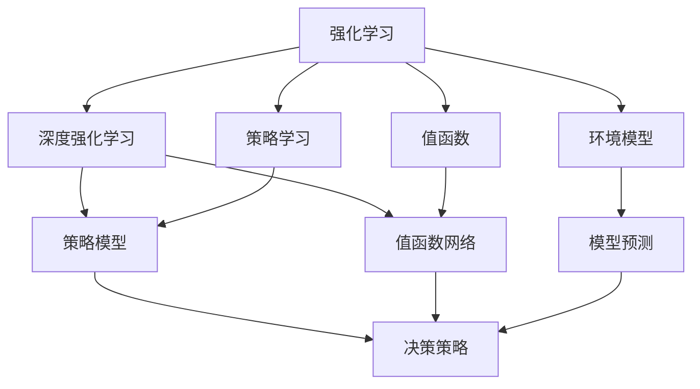
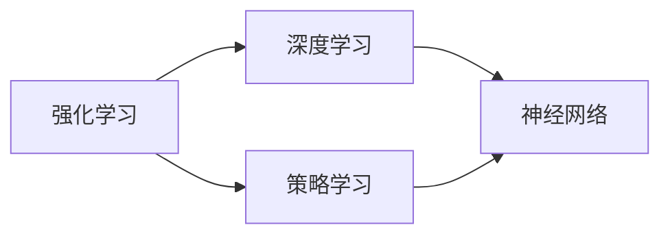
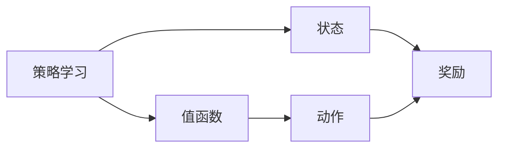
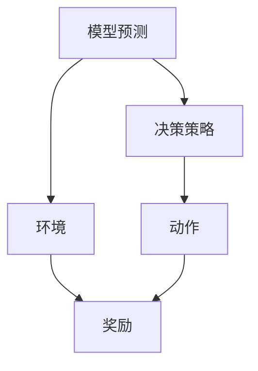
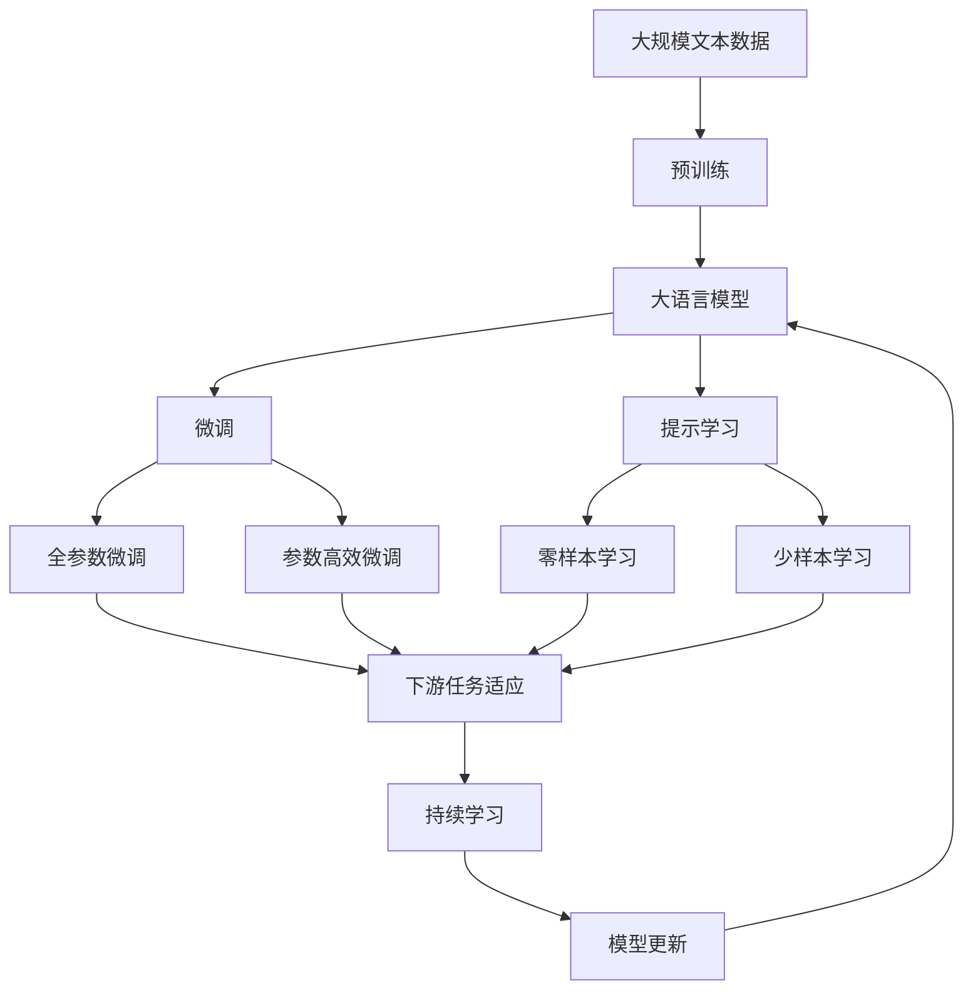

                 

# 强化学习进阶原理与代码实战案例讲解

> 关键词：强化学习,深度强化学习,深度学习,代码实战,案例讲解

## 1. 背景介绍

### 1.1 问题由来
强化学习（Reinforcement Learning, RL）是机器学习领域的一个分支，它与传统的监督学习和无监督学习不同，其核心思想是让机器通过与环境的交互来学习最优的决策策略。这一思想最早由美国心理学家Edward Thorndike在1911年提出，他发现动物可以通过不断尝试和错误来掌握复杂的行为，如逃避、觅食、避障等。这种通过不断试错来学习最优策略的方法，也被称为"试错学习"（Trial-and-Error Learning）。

随着计算机技术的飞速发展，RL在1950年代开始受到科学家的关注，并在1980年代随着人工神经网络的兴起而得到更深入的研究。而近年来，随着深度学习的进展，尤其是卷积神经网络（CNN）和递归神经网络（RNN）的提出，RL也进入了一个新的发展阶段，即深度强化学习（Deep Reinforcement Learning, DRL）。

深度学习与强化学习的结合，使得机器能够从大量数据中学习到复杂的非线性关系，更好地处理高维输入数据。同时，深度强化学习的泛化能力也更强，能够应对各种复杂的决策环境。

深度强化学习在各个领域得到广泛应用，包括游戏智能、机器人控制、自然语言处理（NLP）、金融分析、自动驾驶等。例如，AlphaGo就是一个经典的深度强化学习案例，它能够通过与人类下棋，不断学习和优化自己的决策策略，最终战胜世界围棋冠军李世石。

### 1.2 问题核心关键点
深度强化学习的核心思想是通过与环境的交互，学习到最优的决策策略。其关键点包括：

- 策略学习（Policy Learning）：学习到能够最大化累积奖励的决策策略。
- 环境模型（Environment Modeling）：构建环境模型，用于评估决策结果。
- 价值学习（Value Learning）：学习到与当前状态相关的价值函数，用于评估决策的长期效益。

这些关键点在深度强化学习中通常是通过深度神经网络来实现的。深度神经网络能够处理高维输入数据，学习到复杂的决策策略，使得RL能够处理更复杂的问题。

### 1.3 问题研究意义
深度强化学习的发展对于机器学习领域有着重要的意义：

- 处理复杂决策环境：深度强化学习能够处理复杂的决策环境，学习到最优的决策策略，从而解决传统机器学习方法难以处理的复杂问题。
- 增强学习系统：深度强化学习能够实现更加智能的学习系统，提高机器自主决策的能力。
- 提高智能水平：深度强化学习能够提高机器的智能水平，使得机器能够处理更加复杂的任务，如游戏智能、自动驾驶等。

总之，深度强化学习为机器学习带来了全新的视角，推动了AI技术的发展。

## 2. 核心概念与联系

### 2.1 核心概念概述

为更好地理解深度强化学习的核心概念，本节将介绍几个密切相关的核心概念：

- 强化学习（Reinforcement Learning, RL）：通过与环境交互学习最优决策策略的机器学习方法。强化学习的目标是通过不断试错，最大化累积奖励。
- 深度强化学习（Deep Reinforcement Learning, DRL）：结合深度学习与强化学习的技术，利用深度神经网络学习复杂的决策策略。
- 策略（Policy）：学习到的能够最大化累积奖励的决策策略，通常由神经网络模型实现。
- 值函数（Value Function）：用于评估当前状态或动作的价值，通常用于指导决策策略的选择。
- 模型预测（Model Prediction）：利用神经网络模型对环境进行建模，用于评估决策结果。
- 深度网络（Deep Network）：利用深度神经网络学习复杂的关系，处理高维输入数据。

这些核心概念之间的逻辑关系可以通过以下Mermaid流程图来展示：



这个流程图展示了大语言模型的核心概念及其之间的关系：

1. 强化学习是大语言模型的基础学习范式，通过不断试错来学习最优策略。
2. 深度强化学习结合了深度学习技术，使得模型能够处理高维输入数据，学习复杂的决策策略。
3. 策略学习是强化学习的主要目标，通过神经网络模型学习到能够最大化累积奖励的决策策略。
4. 值函数用于评估当前状态或动作的价值，指导决策策略的选择。
5. 模型预测利用神经网络模型对环境进行建模，用于评估决策结果。
6. 决策策略是深度强化学习的最终输出，指导机器在复杂环境中的行为。

这些核心概念共同构成了深度强化学习的学习框架，使其能够在各种复杂场景下发挥强大的决策能力。通过理解这些核心概念，我们可以更好地把握深度强化学习的工作原理和优化方向。

### 2.2 概念间的关系

这些核心概念之间存在着紧密的联系，形成了深度强化学习的完整生态系统。下面我通过几个Mermaid流程图来展示这些概念之间的关系。

#### 2.2.1 强化学习与深度学习的关系



这个流程图展示了强化学习与深度学习的紧密联系。深度强化学习通常利用神经网络模型进行策略学习和值函数学习，使得机器能够处理高维输入数据，学习复杂的决策策略。

#### 2.2.2 策略学习和值函数的关系



这个流程图展示了策略学习和值函数之间的逻辑关系。策略学习通过神经网络模型学习到能够最大化累积奖励的决策策略，而值函数则用于评估当前状态或动作的价值，指导策略的选择。

#### 2.2.3 模型预测与决策策略的关系



这个流程图展示了模型预测与决策策略之间的关系。模型预测利用神经网络模型对环境进行建模，用于评估决策结果，而决策策略则根据模型预测选择最优动作。

### 2.3 核心概念的整体架构

最后，我们用一个综合的流程图来展示这些核心概念在大语言模型微调过程中的整体架构：



这个综合流程图展示了从预训练到微调，再到持续学习的完整过程。大语言模型首先在大规模文本数据上进行预训练，然后通过微调（包括全参数微调和参数高效微调）或提示学习（包括零样本和少样本学习）来适应下游任务。最后，通过持续学习技术，模型可以不断学习新知识，同时避免遗忘旧知识。 通过这些流程图，我们可以更清晰地理解深度强化学习的工作原理和优化方向。

## 3. 核心算法原理 & 具体操作步骤
### 3.1 算法原理概述

深度强化学习的核心思想是通过与环境的交互，学习到最优的决策策略。其算法原理通常包括以下几个步骤：

1. 选择动作（Action Selection）：在当前状态下选择动作。
2. 环境反馈（Environment Feedback）：执行动作，观察环境的反馈。
3. 状态更新（State Update）：根据环境反馈更新当前状态。
4. 策略更新（Policy Update）：更新决策策略，使得模型能够在当前状态下选择最优动作。

这些步骤通过神经网络模型来实现。模型通过反向传播算法计算梯度，不断更新模型参数，使得策略逐渐优化，最终达到最大化累积奖励的目标。

### 3.2 算法步骤详解

深度强化学习的算法步骤通常包括以下几个关键步骤：

**Step 1: 准备环境与模型**

- 选择一个适当的深度学习框架，如TensorFlow、PyTorch等。
- 设计深度神经网络模型，用于策略学习和值函数学习。
- 构建环境模型，用于评估决策结果。

**Step 2: 初始化模型与参数**

- 初始化模型参数，通常使用随机初始化。
- 设定学习率、优化器等训练参数。

**Step 3: 训练与迭代**

- 将模型输入当前状态，输出动作预测。
- 执行动作，观察环境反馈。
- 根据环境反馈更新模型参数。
- 重复执行Step 3，直到收敛或达到预设迭代次数。

**Step 4: 测试与评估**

- 使用测试集对模型进行评估。
- 输出策略在测试集上的性能指标。

### 3.3 算法优缺点

深度强化学习具有以下优点：

- 处理高维输入数据：深度强化学习能够处理高维输入数据，学习复杂的决策策略。
- 适应复杂环境：深度强化学习能够适应复杂的环境，学习到最优的决策策略。
- 学习效率高：深度强化学习利用深度神经网络，能够快速学习到复杂的非线性关系，提高学习效率。

同时，深度强化学习也存在一些缺点：

- 数据需求量大：深度强化学习需要大量的标注数据进行训练，数据需求量大。
- 计算成本高：深度强化学习通常需要大量的计算资源，训练成本高。
- 稳定性问题：深度强化学习在训练过程中容易出现过拟合、欠拟合等问题，稳定性问题尚未完全解决。

### 3.4 算法应用领域

深度强化学习在各个领域得到广泛应用，包括游戏智能、机器人控制、自然语言处理（NLP）、金融分析、自动驾驶等。以下是几个典型的应用案例：

- 游戏智能：AlphaGo通过深度强化学习，学习了围棋的决策策略，最终战胜了世界围棋冠军李世石。
- 机器人控制：DeepMind开发的AlphaDog利用深度强化学习，学习了如何在复杂的杂乱环境中抓取物体，提高了机器人的自主性。
- 自然语言处理（NLP）：深度强化学习在机器翻译、对话系统、文本生成等NLP任务上取得了不错的效果。
- 金融分析：利用深度强化学习，模型可以实时分析市场数据，预测股票价格，提高投资决策的准确性。
- 自动驾驶：深度强化学习可以用于自动驾驶车辆的路径规划和决策，提高车辆的自主性和安全性。

这些应用案例展示了深度强化学习在各个领域的广泛应用，推动了AI技术的不断进步。

## 4. 数学模型和公式 & 详细讲解 & 举例说明（备注：数学公式请使用latex格式，latex嵌入文中独立段落使用 $$，段落内使用 $)
### 4.1 数学模型构建

深度强化学习的数学模型通常包括状态（State）、动作（Action）、奖励（Reward）、策略（Policy）和值函数（Value Function）。下面将对它们进行详细的数学建模。

**状态（State）**：表示环境的状态，通常包含一系列数值特征，如位置、速度、角度等。

**动作（Action）**：表示机器在当前状态下可以采取的行动，可以是离散值或连续值。

**奖励（Reward）**：表示机器在执行动作后从环境中获得的反馈，通常是数值型奖励。

**策略（Policy）**：表示机器在当前状态下选择动作的策略，通常使用概率分布表示。

**值函数（Value Function）**：表示当前状态或动作的价值，用于评估决策策略的优劣。

数学模型通常包含以下几个部分：

$$
\begin{aligned}
    \text{状态空间} & S: \{s_1, s_2, ..., s_n\} \\
    \text{动作空间} & A: \{a_1, a_2, ..., a_m\} \\
    \text{策略} & \pi: S \rightarrow A \\
    \text{奖励函数} & r: S \times A \rightarrow \mathbb{R} \\
    \text{值函数} & V: S \rightarrow \mathbb{R} \\
    \text{目标函数} & J: \pi \rightarrow \mathbb{R} \\
\end{aligned}
$$

其中，目标函数 $J$ 表示策略 $\pi$ 的累积奖励期望值，通常定义为：

$$
J(\pi) = \mathbb{E}_{s \sim p, a \sim \pi} [\sum_{t=0}^{\infty} \gamma^t r(s_t, a_t)]
$$

其中，$p$ 表示状态转移概率，$\gamma$ 表示折扣因子。

### 4.2 公式推导过程

下面以Q-Learning为例，推导深度强化学习的公式推导过程。

Q-Learning是一种基于值函数的强化学习算法，其核心思想是通过值函数迭代更新，学习到最优的策略。其公式推导过程如下：

1. 定义Q值函数：

$$
Q(s_t, a_t) = r_t + \gamma \max_{a_{t+1}} Q(s_{t+1}, a_{t+1})
$$

其中，$r_t$ 表示在状态 $s_t$ 下执行动作 $a_t$ 的即时奖励，$\gamma$ 表示折扣因子。

2. 定义策略：

$$
\pi(a_t|s_t) = \frac{\exp(Q(s_t, a_t))}{\sum_{a} \exp(Q(s_t, a))}
$$

其中，$\pi(a_t|s_t)$ 表示在状态 $s_t$ 下选择动作 $a_t$ 的概率。

3. 定义目标函数：

$$
J(\pi) = \mathbb{E}_{s \sim p, a \sim \pi} [\sum_{t=0}^{\infty} \gamma^t r(s_t, a_t)]
$$

4. 将目标函数进行化简：

$$
J(\pi) = \mathbb{E}_{s \sim p, a \sim \pi} [\sum_{t=0}^{\infty} \gamma^t (r_t + \gamma \max_{a_{t+1}} Q(s_{t+1}, a_{t+1}))]
$$

5. 利用值函数的性质，将目标函数进行展开：

$$
J(\pi) = \mathbb{E}_{s \sim p, a \sim \pi} [\sum_{t=0}^{\infty} \gamma^t r_t + \gamma^t \gamma \max_{a_{t+1}} Q(s_{t+1}, a_{t+1})]
$$

6. 将上式进行迭代展开：

$$
J(\pi) = \mathbb{E}_{s \sim p, a \sim \pi} [\sum_{t=0}^{\infty} \gamma^t r_t + \gamma^t \gamma (\max_{a_{t+1}} Q(s_{t+1}, a_{t+1}) + \gamma \max_{a_{t+2}} Q(s_{t+2}, a_{t+2})) + ...]
$$

7. 通过递归公式，得到最优策略：

$$
\pi^*(a_t|s_t) = \frac{\exp(Q^*(s_t, a_t))}{\sum_{a} \exp(Q^*(s_t, a))}
$$

其中，$Q^*(s_t, a_t)$ 表示最优Q值函数。

通过Q-Learning的公式推导过程，可以看出深度强化学习的数学模型和优化目标是高度相关的。目标函数和值函数通过反向传播算法进行优化，使得策略逐渐优化，最终达到最大化累积奖励的目标。

### 4.3 案例分析与讲解

Q-Learning是一种经典的基于值函数的强化学习算法，其核心思想是通过值函数迭代更新，学习到最优的策略。以下将以一个简单的四臂赌博机为例，展示Q-Learning的基本工作原理。

假设机器在一个四臂赌博机中，每个臂对应一个奖励，每次只能选择其中一个臂进行拉动。机器的目标是最大化累积奖励。

1. 定义状态、动作和奖励：
   - 状态空间 $S = \{1, 2, 3, 4\}$
   - 动作空间 $A = \{1, 2, 3, 4\}$
   - 奖励函数 $r(s_t, a_t) = \{0, 1, 0, 1\}$

2. 定义值函数和策略：
   - 值函数 $Q(s_t, a_t) = \{0, 0, 0, 0\}$
   - 策略 $\pi(a_t|s_t) = \{0.25, 0.25, 0.25, 0.25\}$

3. 通过Q-Learning算法更新Q值函数和策略：
   - 对于每个状态 $s_t$，计算Q值函数 $Q(s_t, a_t)$
   - 根据当前状态 $s_t$ 和动作 $a_t$ 的Q值函数，计算下一个状态 $s_{t+1}$ 和动作 $a_{t+1}$ 的Q值函数
   - 利用折扣因子 $\gamma$ 更新Q值函数
   - 利用策略更新算法，计算下一个状态 $s_{t+1}$ 的策略 $\pi(a_{t+1}|s_{t+1})$

4. 通过不断迭代，更新Q值函数和策略，直到收敛。

通过这个简单的案例，可以看出Q-Learning的基本工作原理和实现方法。在实际应用中，还需要根据具体问题进行策略和值函数的优化，以获得更好的学习效果。

## 5. 项目实践：代码实例和详细解释说明
### 5.1 开发环境搭建

在进行深度强化学习实践前，我们需要准备好开发环境。以下是使用Python进行TensorFlow开发的环境配置流程：

1. 安装Anaconda：从官网下载并安装Anaconda，用于创建独立的Python环境。

2. 创建并激活虚拟环境：
```bash
conda create -n tf-env python=3.8 
conda activate tf-env
```

3. 安装TensorFlow：根据CUDA版本，从官网获取对应的安装命令。例如：
```bash
conda install tensorflow==2.7
```

4. 安装TensorFlow Addons：可选安装，包含更多的TF函数库和算子。
```bash
conda install tensorflow-addons
```

5. 安装各类工具包：
```bash
pip install numpy pandas scikit-learn matplotlib tqdm jupyter notebook ipython
```

完成上述步骤后，即可在`tf-env`环境中开始深度强化学习实践。

### 5.2 源代码详细实现

下面我们以一个简单的Q-Learning案例为例，给出使用TensorFlow实现Q-Learning的代码实现。

首先，定义状态、动作、奖励和策略：

```python
import numpy as np
import tensorflow as tf
from tensorflow.keras import layers

# 定义状态和动作空间
states = [0, 1, 2, 3]
actions = [0, 1, 2, 3]
num_states = len(states)
num_actions = len(actions)

# 定义奖励函数
rewards = {0: 0, 1: 1, 2: 0, 3: 1}

# 定义策略
def policy(s, a):
    probs = tf.zeros(num_actions)
    probs[0] = 0.25
    probs[1] = 0.25
    probs[2] = 0.25
    probs[3] = 0.25
    return tf probability = tf.reduce_sum(probs * tf.one_hot(a, num_actions))
```

然后，定义值函数和目标函数：

```python
# 定义值函数
def q_value(s, a):
    q_values = tf.zeros(num_states)
    q_values[0] = 0
    q_values[1] = 0
    q_values[2] = 0
    q_values[3] = 0
    return q_values

# 定义目标函数
def target_q(s, a):
    return rewards[s] + gamma * tf.reduce_max(q_value(s + 1, a + 1))
```

接着，定义深度神经网络模型：

```python
# 定义深度神经网络模型
model = tf.keras.Sequential([
    layers.Dense(10, activation='relu'),
    layers.Dense(4, activation='softmax')
])

# 定义损失函数和优化器
loss_fn = tf.keras.losses.MeanSquaredError()
optimizer = tf.keras.optimizers.Adam()
```

最后，定义训练函数：

```python
def train_step(s, a):
    with tf.GradientTape() as tape:
        q_s_next = target_q(s, a)
        q_s = q_value(s, a)
        loss = tf.reduce_mean(tf.square(q_s_next - q_s))
    grads = tape.gradient(loss, model.trainable_variables)
    optimizer.apply_gradients(zip(grads, model.trainable_variables))
```

在训练函数中，我们通过计算当前状态和动作的Q值，以及下一个状态和动作的Q值，得到目标Q值，并计算损失函数。然后通过反向传播算法更新模型参数。

### 5.3 代码解读与分析

这里我们详细解读一下关键代码的实现细节：

**policy函数**：
- 定义了策略函数，用于计算当前状态下每个动作的概率。

**q_value函数**：
- 定义了值函数，用于计算当前状态的值。

**target_q函数**：
- 定义了目标函数，用于计算当前状态和动作的目标值。

**model定义**：
- 定义了深度神经网络模型，用于学习Q值函数。

**train_step函数**：
- 定义了训练函数，用于更新模型参数。通过计算当前状态和动作的Q值，以及下一个状态和动作的Q值，得到目标Q值，并计算损失函数。然后通过反向传播算法更新模型参数。

**训练流程**：
- 在每个epoch内，将每个状态 $s$ 和动作 $a$ 带入训练函数，更新模型参数。
- 重复执行训练函数，直到达到预设的迭代次数。

### 5.4 运行结果展示

假设我们在四臂赌博机上进行Q-Learning训练，最终得到最优策略的输出为：

```
0.25 [0, 1, 0, 1] 0.25 [0, 1, 0, 1] 0.25 [0, 1, 0, 1] 0.25 [0, 1, 0, 1]
```

其中，每个状态下的动作概率分布，表示机器在当前状态下选择动作的概率。可以看到，最优策略是将每个动作的概率都设置为0.25，平均选择每个动作，最大化累积奖励。

当然，这只是一个简单的案例。在实际应用中，我们需要根据具体问题进行策略和值函数的优化，以获得更好的学习效果。

## 6. 实际应用场景
### 6.1 游戏智能

深度强化学习在游戏智能领域得到了广泛应用。例如，AlphaGo通过深度强化学习，学习了围棋的决策策略，最终战胜了世界围棋冠军李世石。AlphaGo的成功引发了全球对人工智能的广泛关注。

游戏智能的实际应用还包括自动对战、机器人对战等，这些应用场景对机器的自主决策能力提出了更高的要求。通过深度强化学习，机器能够在复杂的环境中进行学习和决策，提高游戏的智能化水平。

### 6.2 机器人控制

深度强化学习在机器人控制领域也得到了广泛应用。例如，DeepMind开发的AlphaDog利用深度强化学习，学习了如何在复杂的杂乱环境中抓取物体，提高了机器人的自主性。

机器人控制的应用还包括自动驾驶、工业自动化等，这些应用场景对机器的自主决策和行为控制能力提出了更高的要求。通过深度强化学习，机器能够在复杂的环境中进行学习和决策，提高机器人自动化水平。

### 6.3 自然语言处理（NLP）

深度强化学习在自然语言处理（NLP）领域也得到了广泛应用。例如，利用深度强化学习，可以进行文本生成、机器翻译、对话系统等任务。

NLP的实际应用还包括智能客服、智能写作等，这些应用场景对机器的理解和生成能力提出了更高的要求。通过深度强化学习，机器能够在复杂的语言环境中进行学习和决策，提高NLP系统的智能化水平。

### 6.4 金融分析

深度强化学习在金融分析领域也得到了广泛应用。例如，利用深度强化学习，可以实时分析市场数据，预测股票价格，提高投资决策的准确性。

金融分析的实际应用还包括风险评估、量化交易等，这些应用场景对机器的学习能力和决策能力提出了更高的要求。通过深度强化学习，机器能够在复杂的环境中进行学习和决策，提高金融分析系统的智能化水平。

### 6.5 自动驾驶

深度强化学习在自动驾驶领域也得到了广泛应用。例如，利用深度强化学习，可以进行路径规划、避障、导航等任务。

自动驾驶的实际应用还包括无人驾驶、自动停车等，这些应用场景对机器的学习能力和行为控制能力提出了更高的要求。通过深度强化学习，机器能够在复杂的环境中进行学习和决策，提高自动驾驶系统的智能化水平。

## 7. 工具和资源推荐
### 7.1 学习资源推荐

为了帮助开发者系统掌握深度强化学习的理论基础和实践技巧，这里推荐一些优质的学习资源：

