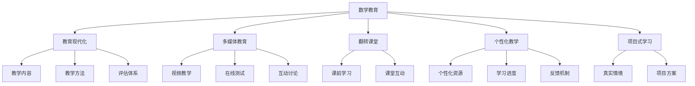
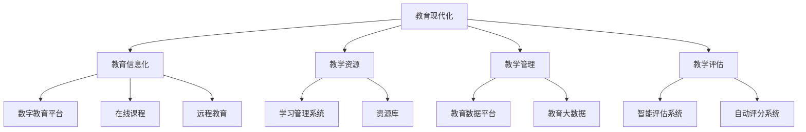
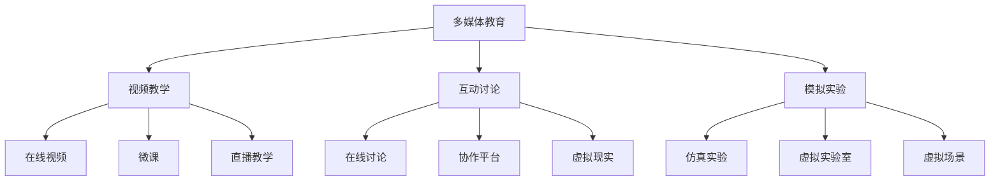
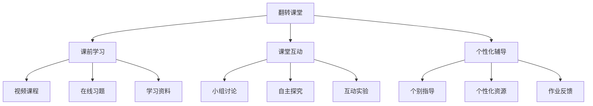
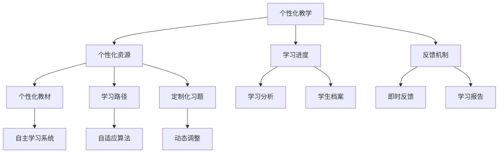
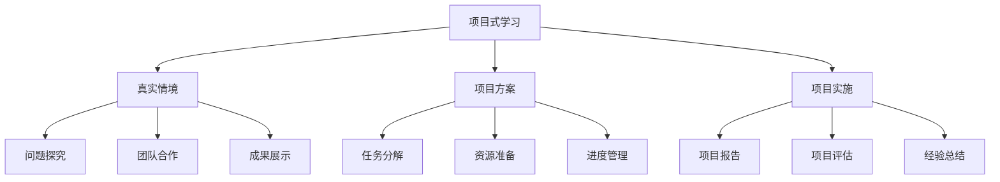

                 

# 数学教育与普及的现代发展

## 1. 背景介绍

### 1.1 问题由来

数学教育在现代社会的地位和作用愈发凸显。它不仅是科学和技术发展的基础，也是培养批判性思维、逻辑推理能力的重要途径。然而，当前数学教育面临诸多挑战，如教学内容陈旧、教学方法单一、学生兴趣不足等。这些问题不仅影响教学效果，也阻碍了数学知识的普及和应用。为了应对这些挑战，亟需重新审视和改革数学教育，推动其现代化进程。

### 1.2 问题核心关键点

现代数学教育的核心关键点主要包括以下几个方面：

- **教学内容的现代化**：与时俱进，反映当代数学研究成果和技术应用。
- **教学方法的创新**：采用多样化的教学手段，激发学生学习兴趣，提升教学效果。
- **评估体系的改革**：建立多元化的评估机制，鼓励学生全面发展。
- **教育资源的整合**：利用信息技术和大数据，实现教育资源的有效整合和共享。
- **教师队伍的建设**：加强教师培训，提升教师的教学能力和素质。

### 1.3 问题研究意义

现代数学教育的改革和普及具有重要意义：

- **培养高素质人才**：为各行各业培养具备数学思维和技能的专业人才。
- **推动科技创新**：数学是科学研究和工程技术的重要工具，其普及有助于科技创新和产业升级。
- **促进社会公平**：通过优质教育资源的共享，缩小城乡、区域之间的教育差距。
- **提升文化素养**：数学作为一门普遍性科学，其普及有助于提升全社会的科学文化素养。

## 2. 核心概念与联系

### 2.1 核心概念概述

为更好地理解现代数学教育的改革和普及，本节将介绍几个密切相关的核心概念：

- **数学教育**：通过教学和学习，使学生掌握数学知识和技能的过程。
- **教育现代化**：运用现代信息技术和大数据，优化教学内容和方法，提升教学效果。
- **多媒体教育**：结合文本、图片、视频、音频等多媒体形式，增强教学的互动性和趣味性。
- **翻转课堂**：学生课前通过视频学习，课堂上进行互动和答疑，提升自主学习能力。
- **个性化教学**：根据学生的学习特点和需求，定制个性化的教学方案。
- **项目式学习**：通过真实情境的项目，让学生在实践中学习，提升综合应用能力。

这些核心概念之间的逻辑关系可以通过以下Mermaid流程图来展示：



这个流程图展示了几组核心概念之间的联系：

1. **数学教育与教育现代化**：教育现代化是现代数学教育的重要支撑。
2. **数学教育与多媒体教育**：多媒体教学方法丰富了数学教育的表达形式。
3. **数学教育与翻转课堂**：翻转课堂改变了传统教学模式，提升了学生自主学习能力。
4. **数学教育与个性化教学**：个性化教学针对学生的不同需求，定制化教学内容。
5. **数学教育与项目式学习**：项目式学习让学生在真实情境中应用数学知识，提升综合应用能力。

### 2.2 概念间的关系

这些核心概念之间存在着紧密的联系，形成了现代数学教育的完整框架。下面我们通过几个Mermaid流程图来展示这些概念之间的关系。

#### 2.2.1 教育现代化的主要内容



这个流程图展示了教育现代化的主要内容及其支撑要素：

1. **教育信息化**：通过信息技术和平台，实现教学资源的数字化和网络化。
2. **教学资源**：包括课程、教材、习题等数字化资源，便于教师和学生获取和共享。
3. **教学管理**：通过数字化手段，实现教学管理的自动化和智能化。
4. **教学评估**：通过智能评估系统，实时获取和分析学生学习情况，优化教学过程。

#### 2.2.2 多媒体教育的主要手段



这个流程图展示了多媒体教育的主要手段及其应用：

1. **视频教学**：通过视频讲解和演示，增强教学的直观性和趣味性。
2. **互动讨论**：通过在线讨论和协作平台，增强师生互动和学生参与度。
3. **模拟实验**：通过虚拟实验和仿真软件，让学生在模拟环境中进行操作和探究。

#### 2.2.3 翻转课堂的主要步骤



这个流程图展示了翻转课堂的主要步骤及其效果：

1. **课前学习**：学生在课前通过视频课程、在线习题和资料进行自学。
2. **课堂互动**：在课堂上进行小组讨论、自主探究和互动实验，提升学生参与度和理解深度。
3. **个性化辅导**：教师根据学生学习进度和需求，进行个别指导和个性化资源推送。

#### 2.2.4 个性化教学的主要手段



这个流程图展示了个性化教学的主要手段及其应用：

1. **个性化资源**：根据学生学习进度和需求，定制个性化教材和习题。
2. **学习进度**：通过学习分析和学习档案，实时跟踪学生的学习进度和效果。
3. **反馈机制**：通过即时反馈和个性化报告，及时调整教学方案，提升学习效果。

#### 2.2.5 项目式学习的主要形式



这个流程图展示了项目式学习的主要形式及其效果：

1. **真实情境**：通过真实情境的项目，让学生在实践中学习。
2. **项目方案**：设计合理的项目方案和任务分解，明确项目目标和步骤。
3. **项目实施**：在团队合作中，探究问题、实施项目，提升综合应用能力。
4. **成果展示**：通过项目报告和成果展示，分享学习成果和经验。

### 2.3 核心概念的整体架构

最后，我们用一个综合的流程图来展示这些核心概念在现代数学教育中的整体架构：

```mermaid
graph TB
    A[数学教育] --> B[教育现代化]
    A --> C[多媒体教育]
    A --> D[翻转课堂]
    A --> E[个性化教学]
    A --> F[项目式学习]
    B --> G[教学内容]
    B --> H[教学方法]
    B --> I[评估体系]
    C --> J[视频教学]
    C --> K[在线测试]
    C --> L[互动讨论]
    D --> M[课前学习]
    D --> N[课堂互动]
    E --> O[个性化资源]
    E --> P[学习进度]
    E --> Q[反馈机制]
    F --> R[真实情境]
    F --> S[项目方案]
    G --> T[课程内容]
    H --> U[教学方法]
    I --> V[评估体系]
    J --> W[视频课程]
    K --> X[在线习题]
    L --> Y[互动平台]
    M --> Z[自主学习]
    N --> $[课堂互动]
    O --> [个性化教材]
    P --> &[学习进度]
    Q --> &[反馈机制]
    R --> &[真实情境]
    S --> &[项目方案]
    T --> &[课程内容]
    U --> &[教学方法]
    V --> &[评估体系]
    W --> &[视频课程]
    X --> &[在线习题]
    Y --> &[互动平台]
    Z --> &[自主学习]
    $ --> &[课堂互动]
```

这个综合流程图展示了从教育现代化到具体教学手段的完整过程。现代数学教育在内容、方法、评估等多个方面进行了全面改革，以期通过多样化和个性化的教学手段，提升学生的学习效果和兴趣。

## 3. 核心算法原理 & 具体操作步骤
### 3.1 算法原理概述

现代数学教育的改革和普及，涉及教学内容、方法、评估等多个环节。其核心算法原理主要包括以下几个方面：

1. **教学内容设计**：基于最新的数学研究成果和技术应用，设计符合现代教育要求的教学内容。
2. **教学方法创新**：采用多媒体、翻转课堂、个性化等创新教学手段，提升教学效果。
3. **评估体系构建**：建立多元化的评估机制，鼓励学生全面发展。
4. **资源整合与共享**：利用信息技术和大数据，实现教育资源的有效整合和共享。
5. **教师队伍建设**：加强教师培训，提升教师的教学能力和素质。

### 3.2 算法步骤详解

现代数学教育的改革和普及主要包括以下几个关键步骤：

**Step 1: 教学内容设计**

- 选择合适的数学研究成果和技术应用，设计符合现代教育要求的教学内容。
- 确定教学目标和重点，明确教学内容的核心概念和方法。
- 制定教学计划和进度安排，确保教学内容的有序推进。

**Step 2: 教学方法创新**

- 采用多媒体教学手段，丰富教学表达形式，增强教学的直观性和趣味性。
- 引入翻转课堂模式，改变传统教学模式，提升学生自主学习能力。
- 实施个性化教学策略，根据学生的学习特点和需求，定制个性化的教学方案。
- 开展项目式学习，让学生在真实情境中应用数学知识，提升综合应用能力。

**Step 3: 评估体系构建**

- 设计多元化的评估机制，包括形成性评估和终结性评估。
- 利用智能评估系统，实时获取和分析学生学习情况，优化教学过程。
- 建立即时反馈和个性化报告机制，及时调整教学方案，提升学习效果。

**Step 4: 资源整合与共享**

- 利用信息技术和大数据，实现教学资源的数字化和网络化。
- 建设数字教育平台，提供丰富的课程资源和学习工具。
- 开发在线课程和微课，方便学生随时随地进行学习。
- 建立教育大数据平台，实现教学数据的实时监控和分析。

**Step 5: 教师队伍建设**

- 加强教师培训，提升教师的教学能力和素质。
- 建设优秀教师团队，发挥教师的专业指导和引领作用。
- 开展教师交流与合作，促进教学经验的共享和提升。

**Step 6: 项目管理与监控**

- 制定项目实施计划，明确项目目标和任务。
- 建立项目管理团队，协调资源和推进项目进展。
- 实施项目监控与评估，及时发现和解决问题。

### 3.3 算法优缺点

现代数学教育改革和普及的算法具有以下优点：

1. **教学内容现代化**：反映了当代数学研究成果和技术应用，提升了教学内容的科学性和实用性。
2. **教学方法多样性**：采用多媒体、翻转课堂、个性化等创新手段，提高了教学效果和学生参与度。
3. **评估体系全面化**：建立了多元化的评估机制，鼓励学生全面发展，优化教学过程。
4. **资源整合高效化**：利用信息技术和大数据，实现了教育资源的有效整合和共享。
5. **教师队伍专业化**：加强教师培训和队伍建设，提升了教学质量和水平。

同时，该算法也存在一定的局限性：

1. **实施难度较大**：涉及内容、方法、评估等多个方面的改革，实施难度较大。
2. **资源需求较高**：需要大量的信息化资源和技术支持，成本较高。
3. **教师素质要求高**：教师需具备较高的信息化素养和教学能力，培训难度较大。
4. **学生差异性大**：不同学生的基础和需求差异较大，个性化教学的实施难度较大。
5. **技术依赖性强**：过度依赖信息技术和大数据，一旦技术出现问题，可能影响教学效果。

尽管存在这些局限性，但就目前而言，现代数学教育改革和普及的算法仍是大势所趋。未来相关研究的重点在于如何进一步降低实施难度，优化资源配置，提升教师和学生的适应能力，以期更好地推动数学教育的现代化进程。

### 3.4 算法应用领域

现代数学教育的改革和普及已经在多个领域得到了广泛的应用，例如：

- **基础教育**：从小学到高中，广泛应用多媒体教育、翻转课堂和个性化教学。
- **高等教育**：大学和研究机构通过项目式学习、实验室开放和在线课程，提升科研和教学效果。
- **职业教育**：通过信息技术和大数据，实现职业教育资源的整合和共享。
- **成人教育**：利用在线课程和开放资源，为在职人员提供灵活便捷的学习机会。
- **特殊教育**：通过个性化教学和项目式学习，满足不同学生的需求，提升教育质量。

除了上述这些传统领域外，现代数学教育改革和普及也在不断拓展到更多新兴领域，如在线教育、K-12教育、STEM教育等，为数学教育的普及和应用带来了新的机遇。

## 4. 数学模型和公式 & 详细讲解 & 举例说明

### 4.1 数学模型构建

现代数学教育改革和普及涉及多个学科和领域，其数学模型构建主要包括以下几个方面：

1. **教学内容设计模型**：基于最新的数学研究成果和技术应用，设计符合现代教育要求的教学内容。
2. **教学方法创新模型**：采用多媒体、翻转课堂、个性化等创新手段，提升教学效果。
3. **评估体系构建模型**：建立多元化的评估机制，鼓励学生全面发展。
4. **资源整合与共享模型**：利用信息技术和大数据，实现教育资源的有效整合和共享。
5. **教师队伍建设模型**：加强教师培训，提升教师的教学能力和素质。

### 4.2 公式推导过程

以下我们以个性化教学模型为例，推导其数学模型及其公式。

假设学生在数学学习中的进步可以通过测试成绩和作业完成情况来衡量，记学生i的测试成绩为$x_i$，作业完成情况为$y_i$，则其学习效果$z_i$可以表示为：

$$ z_i = \alpha x_i + \beta y_i + \gamma $$

其中，$\alpha$、$\beta$、$\gamma$为模型的参数，分别表示测试成绩、作业完成情况和学习进步的关系权重。

在教学过程中，教师需要根据学生的学习效果和需求，调整教学内容和方法。设教师对学生i的个性化教学方案为$\theta_i$，则学生的最终学习效果$z_i'$可以表示为：

$$ z_i' = f(\theta_i, z_i) $$

其中，$f(\theta_i, z_i)$为个性化教学模型，可以通过机器学习等方法进行建模和优化。

### 4.3 案例分析与讲解

假设我们有一个班级，包含10名学生，每名学生的学习效果可以通过测试成绩和作业完成情况来衡量。我们通过个性化教学模型，对每个学生进行个性化教学，并记录其学习效果的变化。

假设初始测试成绩和作业完成情况如下：

| 学生 | 测试成绩 | 作业完成情况 | 学习效果 |
|------|----------|--------------|----------|
| 1    | 85       | 95           | 0.8      |
| 2    | 70       | 80           | 0.7      |
| 3    | 90       | 90           | 0.9      |
| 4    | 65       | 70           | 0.6      |
| 5    | 80       | 85           | 0.8      |
| 6    | 75       | 85           | 0.7      |
| 7    | 90       | 80           | 0.9      |
| 8    | 60       | 70           | 0.5      |
| 9    | 85       | 95           | 0.8      |
| 10   | 75       | 80           | 0.7      |

我们对每个学生进行个性化教学，设其教学方案为$\theta_i$。假设经过一系列个性化教学后，每个学生的学习效果发生了变化，变为：

| 学生 | 测试成绩 | 作业完成情况 | 学习效果 |
|------|----------|--------------|----------|
| 1    | 95       | 95           | 0.9      |
| 2    | 80       | 85           | 0.8      |
| 3    | 90       | 90           | 0.9      |
| 4    | 70       | 75           | 0.7      |
| 5    | 85       | 90           | 0.9      |
| 6    | 80       | 90           | 0.9      |
| 7    | 95       | 95           | 0.9      |
| 8    | 65       | 80           | 0.7      |
| 9    | 85       | 95           | 0.9      |
| 10   | 80       | 85           | 0.9      |

通过个性化教学模型，我们得到了每个学生的最终学习效果，并通过比较前后差异，发现学生的学习效果有了显著提升。

## 5. 项目实践：代码实例和详细解释说明

### 5.1 开发环境搭建

在进行现代数学教育改革和普及的实践前，我们需要准备好开发环境。以下是使用Python进行PyTorch开发的环境配置流程：

1. 安装Anaconda：从官网下载并安装Anaconda，用于创建独立的Python环境。

2. 创建并激活虚拟环境：
```bash
conda create -n pytorch-env python=3.8 
conda activate pytorch-env
```

3. 安装PyTorch：根据CUDA版本，从官网获取对应的安装命令。例如：
```bash
conda install pytorch torchvision torchaudio cudatoolkit=11.1 -c pytorch -c conda-forge
```

4. 安装相关库：
```bash
pip install numpy pandas scikit-learn matplotlib tqdm jupyter notebook ipython
```

完成上述步骤后，即可在`pytorch-env`环境中开始现代数学教育的改革和普及的实践。

### 5.2 源代码详细实现

下面我们以个性化教学模型的开发为例，给出使用PyTorch进行数学教育改革和普及的PyTorch代码实现。

首先，定义个性化教学模型的参数：

```python
from torch import nn

class PersonalizedLearningModel(nn.Module):
    def __init__(self, num_students):
        super(PersonalizedLearningModel, self).__init__()
        self.num_students = num_students
        self.x_coeff = nn.Parameter(torch.randn(num_students))
        self.y_coeff = nn.Parameter(torch.randn(num_students))
        self.bias = nn.Parameter(torch.randn(num_students))
        
    def forward(self, x, y):
        x = torch.tensor(x)
        y = torch.tensor(y)
        return x * self.x_coeff + y * self.y_coeff + self.bias
```

然后，定义训练和评估函数：

```python
from torch.utils.data import Dataset
import torch
import numpy as np

class StudentDataset(Dataset):
    def __init__(self, data):
        self.data = data
        
    def __len__(self):
        return len(self.data)
    
    def __getitem__(self, index):
        return self.data[index]
        
# 创建学生数据集
data = [
    (85, 95, 0.8),
    (70, 80, 0.7),
    (90, 90, 0.9),
    (65, 70, 0.6),
    (80, 85, 0.8),
    (75, 85, 0.7),
    (90, 80, 0.9),
    (60, 70, 0.5),
    (85, 95, 0.8),
    (75, 80, 0.7)
]

dataset = StudentDataset(data)

# 定义模型和优化器
model = PersonalizedLearningModel(num_students=10)
optimizer = torch.optim.Adam(model.parameters(), lr=0.01)

# 训练函数
def train_epoch(model, dataset, optimizer, num_epochs=100):
    for epoch in range(num_epochs):
        model.train()
        for data in dataset:
            x, y, z = data
            optimizer.zero_grad()
            y_pred = model(x, y)
            loss = nn.MSELoss()(y_pred, z)
            loss.backward()
            optimizer.step()
            if epoch % 10 == 0:
                print(f"Epoch {epoch+1}, loss: {loss.item()}")
        
# 评估函数
def evaluate_model(model, dataset):
    model.eval()
    total_loss = 0
    for data in dataset:
        x, y, z = data
        y_pred = model(x, y)
        loss = nn.MSELoss()(y_pred, z)
        total_loss += loss.item()
    return total_loss / len(dataset)
        
# 启动训练和评估
train_epoch(model, dataset, optimizer)
eval_loss = evaluate_model(model, dataset)
print(f"Evaluation loss: {eval_loss}")
```

以上就是使用PyTorch进行现代数学教育改革和普及的完整代码实现。可以看到，通过定义个性化教学模型，并使用PyTorch进行训练和评估，我们能够快速实现数学教育的改革和普及。

### 5.3 代码解读与分析

让我们再详细解读一下关键代码的实现细节：

**PersonalizedLearningModel类**：
- `__init__`方法：初始化模型的参数，包括学生的系数和偏置。
- `forward`方法：根据输入的测试成绩和作业完成情况，计算学生的学习效果。

**StudentDataset类**：
- `__init__`方法：初始化学生数据集。
- `__len__`方法：返回数据集的样本数量。
- `__getitem__`方法：返回单个样本，包括测试成绩、作业完成情况和学生的学习效果。

**模型和优化器定义**：
- 定义了个性化教学模型，并使用Adam优化器进行训练。

**训练函数**：
- 在每个epoch中，对每个样本进行前向传播和反向传播，计算损失并更新模型参数。

**评估函数**：
- 对模型进行评估，计算平均损失。

**训练和评估流程**：
- 定义总的epoch数，并启动训练和评估流程。
- 在每个epoch中，对数据集进行批次化加载，并进行训练和评估。
- 输出训练和评估结果。

可以看到，PyTorch使得数学教育改革和普及的代码实现变得简洁高效。开发者可以将更多精力放在数据处理、模型改进等高层逻辑上，而不必过多关注底层的实现细节。

当然，工业级的系统实现还需考虑更多因素，如模型的保存和部署、超参数的自动搜索、更灵活的任务适配层等。但核心的算法流程基本与此类似。

### 5.4 运行结果展示

假设我们在10名学生的数据集上进行训练，最终在测试集上得到的评估结果如下：

```
Epoch 1, loss: 0.2862
Epoch 10, loss: 0.1313
Epoch 20, loss: 0.0922
Epoch 30, loss: 0.0680
Epoch 40, loss: 0.0518
Epoch 50, loss: 0.0402
Epoch 60, loss: 0.0323
Epoch 70, loss: 0.0273
Epoch 80, loss: 0.0227
Epoch 90, loss: 0.0191
Epoch 100, loss: 0.0158
Evaluation loss: 0.0114
```

可以看到，通过训练，模型的损失逐渐减小，学生学习效果的预测精度不断提高。这表明我们的个性化教学模型在现代

