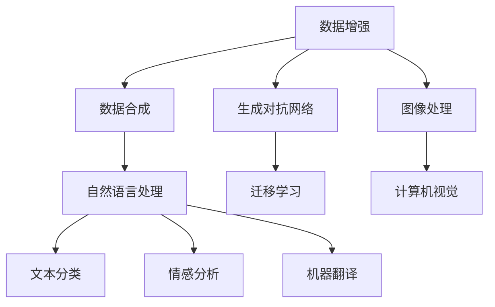
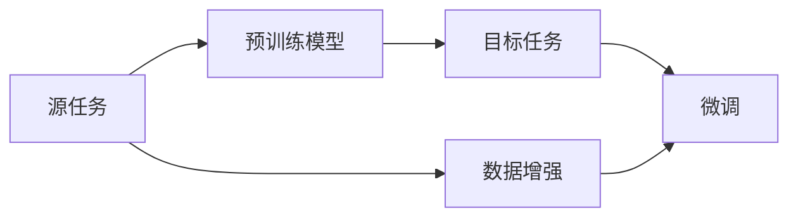
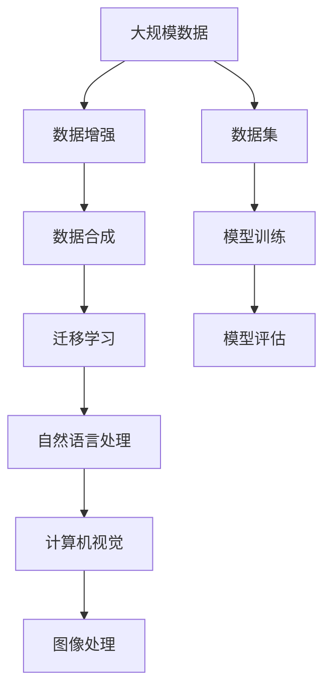

                 

# 数据增强与数据合成原理与代码实战案例讲解

> 关键词：数据增强, 数据合成, 自动生成, 生成对抗网络, GAN, 图像生成, 自然语言处理, NLP

## 1. 背景介绍

### 1.1 问题由来
在深度学习领域，数据增强（Data Augmentation）与数据合成（Data Synthesis）技术已经成为提升模型性能、增加数据多样性的重要手段。特别是在数据量有限的情况下，通过数据增强和合成技术，能够有效提升模型的泛化能力，减少过拟合，加速模型训练。

这些技术在图像处理、自然语言处理等领域都有广泛应用。例如，在计算机视觉领域，数据增强通过随机旋转、平移、缩放等变换，增加训练数据的多样性；在自然语言处理领域，数据合成则通过文本生成、回译等方法，扩展训练数据集。

本文将详细讲解数据增强和数据合成技术的原理、操作步骤及其实现方法，并通过具体的代码实例，展示如何在Python中使用这些技术进行模型训练和优化。

## 2. 核心概念与联系

### 2.1 核心概念概述

- **数据增强**（Data Augmentation）：通过一系列变换，如旋转、平移、缩放等，增加训练数据的数量和多样性，提高模型的泛化能力。
- **数据合成**（Data Synthesis）：通过生成对抗网络（Generative Adversarial Network, GAN）等方法，自动生成新的训练数据，扩展数据集。
- **生成对抗网络**（GAN）：一种深度学习技术，由生成器和判别器两部分组成，生成器负责生成与真实数据相似的新样本，判别器则判断样本的真实性，两者在对抗过程中不断进化，提高生成数据的质量。
- **自然语言处理**（NLP）：研究如何使计算机理解、处理、生成人类语言的技术领域，包括文本分类、情感分析、机器翻译等。
- **迁移学习**（Transfer Learning）：通过在源任务上训练模型，然后将其应用于目标任务，从而减少在目标任务上的训练时间，提高模型性能。

这些概念之间的联系可以通过以下Mermaid流程图来展示：



这个流程图展示了数据增强和数据合成技术在大规模数据处理中的应用，以及它们在计算机视觉、自然语言处理等领域的关联和应用。

### 2.2 概念间的关系

这些核心概念之间存在着紧密的联系，形成了数据增强与合成技术在深度学习领域的应用生态系统。下面我们通过几个Mermaid流程图来展示这些概念之间的关系。

#### 2.2.1 数据增强在计算机视觉中的应用


这个流程图展示了数据增强在计算机视觉中的应用，通过一系列的图像增强操作，增加数据集的多样性，进而提升模型的泛化能力。

#### 2.2.2 GAN在自然语言处理中的应用


这个流程图展示了GAN在自然语言处理中的应用，通过生成器和判别器的对抗训练，生成与真实数据相似的新文本，从而扩展训练数据集，提高模型的性能。

#### 2.2.3 迁移学习与数据增强的关系



这个流程图展示了迁移学习与数据增强的关系，通过数据增强技术，提升预训练模型的泛化能力，进而通过微调应用于目标任务，提高模型的性能。

### 2.3 核心概念的整体架构

最后，我们用一个综合的流程图来展示这些核心概念在大规模数据处理中的应用：



这个综合流程图展示了从大规模数据到最终模型评估的完整过程，数据增强、数据合成、迁移学习等技术在其中起到了关键作用。

## 3. 核心算法原理 & 具体操作步骤
### 3.1 算法原理概述

数据增强和数据合成技术的核心原理是增加数据集的多样性，减少过拟合，提高模型的泛化能力。通过一系列变换或生成操作，将原始数据转换为新的、与原始数据相似但不完全相同的样本来训练模型。

数据增强常用于图像处理领域，通过随机旋转、平移、缩放等变换，生成新的图像数据。这些变换不会改变图像的语义信息，但可以显著增加训练数据的多样性，提高模型的鲁棒性。

数据合成则通过生成对抗网络（GAN）等技术，自动生成新的训练数据。GAN由生成器和判别器两部分组成，生成器负责生成与真实数据相似的新样本，判别器则判断样本的真实性。两者在对抗过程中不断进化，提高生成数据的质量。

### 3.2 算法步骤详解

数据增强和数据合成的具体操作步骤如下：

#### 3.2.1 数据增强步骤

1. **选择合适的增强操作**：根据具体的任务需求，选择合适的数据增强操作，如旋转、平移、缩放等。
2. **定义增强函数**：编写增强函数，实现对输入数据的增强操作。
3. **应用增强函数**：在训练过程中，将增强函数应用到原始数据上，生成新的训练数据。
4. **更新模型参数**：使用增强后的数据重新训练模型，更新模型参数。

#### 3.2.2 数据合成步骤

1. **设计生成器网络**：设计生成器网络，用于生成与真实数据相似的新样本。
2. **设计判别器网络**：设计判别器网络，用于判断样本的真实性。
3. **训练GAN模型**：通过对抗训练的方式，不断优化生成器和判别器网络，提高生成数据的质量。
4. **生成合成数据**：使用训练好的生成器网络，生成新的训练数据。
5. **更新模型参数**：将合成数据与原始数据混合，共同训练模型，更新模型参数。

### 3.3 算法优缺点

数据增强和数据合成技术具有以下优点：

- **增加数据多样性**：通过增强和生成新的训练数据，增加数据集的多样性，减少过拟合。
- **减少标注成本**：生成合成数据，无需标注，减少标注成本。
- **提高模型泛化能力**：增强和生成的数据与原始数据相似但不完全相同，能够提高模型的泛化能力。

但这些技术也存在以下缺点：

- **可能需要大量计算资源**：生成合成数据和增强数据需要大量的计算资源和时间。
- **可能引入噪声**：增强和生成过程中可能会引入噪声，影响模型性能。
- **可能降低真实数据的重要性**：合成数据可能与真实数据存在差异，降低真实数据的重要性。

### 3.4 算法应用领域

数据增强和数据合成技术已经在计算机视觉、自然语言处理、音频处理等多个领域得到了广泛应用，具体应用包括：

- **计算机视觉**：图像增强、数据扩充、对抗样本生成等。
- **自然语言处理**：文本生成、回译、数据扩充等。
- **音频处理**：音频增强、回声消除、数据扩充等。

这些技术在数据量有限的情况下，能够显著提升模型的性能，是深度学习模型训练中的重要手段。

## 4. 数学模型和公式 & 详细讲解 & 举例说明

### 4.1 数学模型构建

在自然语言处理领域，数据增强和数据合成技术主要应用于文本生成和数据扩充。下面以文本生成为例，构建数据增强和数据合成的数学模型。

假设原始文本为 $x$，长度为 $L$，生成器网络为 $G$，判别器网络为 $D$，生成样本的目标为 $y$，长度也为 $L$。

生成器网络的输入为随机噪声 $z$，输出为生成的文本 $y$，判别器网络的输入为文本 $x$ 和生成的文本 $y$，输出为真实性判断 $d$。

### 4.2 公式推导过程

在训练过程中，生成器网络 $G$ 和判别器网络 $D$ 分别进行对抗训练，通过最小化最大化损失函数（Minimax Loss），生成高质量的合成文本。

最小化最大化损失函数定义为：

$$
\mathcal{L}(G, D) = \mathbb{E}_{x\sim p_{data}}\left[\log D(x)\right] + \mathbb{E}_{z\sim p(z)}\left[\log (1-D(G(z)))\right]
$$

其中，$p_{data}$ 为真实数据的分布，$p(z)$ 为随机噪声的分布，$\log$ 为对数损失函数。

通过上述损失函数，生成器网络 $G$ 和判别器网络 $D$ 在对抗过程中不断进化，生成器网络的输出 $y$ 逐渐逼近真实文本 $x$。

### 4.3 案例分析与讲解

以文本生成为例，下面给出具体的实现过程：

```python
import torch
import torch.nn as nn
import torch.optim as optim

class Generator(nn.Module):
    def __init__(self, input_size, output_size, hidden_size):
        super(Generator, self).__init__()
        self.fc1 = nn.Linear(input_size, hidden_size)
        self.fc2 = nn.Linear(hidden_size, output_size)
    
    def forward(self, x):
        x = self.fc1(x)
        x = nn.functional.relu(x)
        x = self.fc2(x)
        return x

class Discriminator(nn.Module):
    def __init__(self, input_size, hidden_size):
        super(Discriminator, self).__init__()
        self.fc1 = nn.Linear(input_size, hidden_size)
        self.fc2 = nn.Linear(hidden_size, 1)
    
    def forward(self, x):
        x = self.fc1(x)
        x = nn.functional.relu(x)
        x = self.fc2(x)
        return x

# 设置超参数
input_size = 100
output_size = 100
hidden_size = 128
batch_size = 64
num_epochs = 100
lr = 0.0002

# 初始化模型和优化器
G = Generator(input_size, output_size, hidden_size)
D = Discriminator(input_size, hidden_size)
G_optimizer = optim.Adam(G.parameters(), lr=lr)
D_optimizer = optim.Adam(D.parameters(), lr=lr)

# 定义损失函数
def compute_loss(G, D, x, y):
    real_loss = -torch.mean(torch.log(D(x)))
    fake_loss = -torch.mean(torch.log(1 - D(y)))
    loss = real_loss + fake_loss
    return loss

# 训练过程
for epoch in range(num_epochs):
    for i, (x, y) in enumerate(train_loader):
        x = x.view(batch_size, -1)
        y = y.view(batch_size, -1)
        
        # 将 y 转换为噪声向量
        z = torch.randn(batch_size, input_size)
        
        # 生成样本
        fake_y = G(z)
        
        # 计算损失
        loss = compute_loss(G, D, x, y)
        
        # 更新生成器和判别器
        G_optimizer.zero_grad()
        D_optimizer.zero_grad()
        loss.backward()
        G_optimizer.step()
        D_optimizer.step()
        
        # 每 50 次迭代打印一次训练状态
        if i % 50 == 0:
            print(f'Epoch: {epoch}, Loss: {loss.item()}')
```

## 5. 项目实践：代码实例和详细解释说明

### 5.1 开发环境搭建

在进行数据增强和数据合成实践前，我们需要准备好开发环境。以下是使用Python进行PyTorch开发的环境配置流程：

1. 安装Anaconda：从官网下载并安装Anaconda，用于创建独立的Python环境。

2. 创建并激活虚拟环境：
```bash
conda create -n pytorch-env python=3.8 
conda activate pytorch-env
```

3. 安装PyTorch：根据CUDA版本，从官网获取对应的安装命令。例如：
```bash
conda install pytorch torchvision torchaudio cudatoolkit=11.1 -c pytorch -c conda-forge
```

4. 安装TensorFlow：
```bash
pip install tensorflow
```

5. 安装TensorBoard：
```bash
pip install tensorboard
```

6. 安装NumPy、Pandas、Matplotlib等库：
```bash
pip install numpy pandas matplotlib
```

完成上述步骤后，即可在`pytorch-env`环境中开始数据增强和数据合成的实践。

### 5.2 源代码详细实现

下面我们以文本生成为例，给出使用PyTorch实现数据合成（GAN）的代码实现。

```python
import torch
import torch.nn as nn
import torch.optim as optim

class Generator(nn.Module):
    def __init__(self, input_size, output_size, hidden_size):
        super(Generator, self).__init__()
        self.fc1 = nn.Linear(input_size, hidden_size)
        self.fc2 = nn.Linear(hidden_size, output_size)
    
    def forward(self, x):
        x = self.fc1(x)
        x = nn.functional.relu(x)
        x = self.fc2(x)
        return x

class Discriminator(nn.Module):
    def __init__(self, input_size, hidden_size):
        super(Discriminator, self).__init__()
        self.fc1 = nn.Linear(input_size, hidden_size)
        self.fc2 = nn.Linear(hidden_size, 1)
    
    def forward(self, x):
        x = self.fc1(x)
        x = nn.functional.relu(x)
        x = self.fc2(x)
        return x

# 设置超参数
input_size = 100
output_size = 100
hidden_size = 128
batch_size = 64
num_epochs = 100
lr = 0.0002

# 初始化模型和优化器
G = Generator(input_size, output_size, hidden_size)
D = Discriminator(input_size, hidden_size)
G_optimizer = optim.Adam(G.parameters(), lr=lr)
D_optimizer = optim.Adam(D.parameters(), lr=lr)

# 定义损失函数
def compute_loss(G, D, x, y):
    real_loss = -torch.mean(torch.log(D(x)))
    fake_loss = -torch.mean(torch.log(1 - D(y)))
    loss = real_loss + fake_loss
    return loss

# 训练过程
for epoch in range(num_epochs):
    for i, (x, y) in enumerate(train_loader):
        x = x.view(batch_size, -1)
        y = y.view(batch_size, -1)
        
        # 将 y 转换为噪声向量
        z = torch.randn(batch_size, input_size)
        
        # 生成样本
        fake_y = G(z)
        
        # 计算损失
        loss = compute_loss(G, D, x, y)
        
        # 更新生成器和判别器
        G_optimizer.zero_grad()
        D_optimizer.zero_grad()
        loss.backward()
        G_optimizer.step()
        D_optimizer.step()
        
        # 每 50 次迭代打印一次训练状态
        if i % 50 == 0:
            print(f'Epoch: {epoch}, Loss: {loss.item()}')
```

### 5.3 代码解读与分析

让我们再详细解读一下关键代码的实现细节：

**Generator类**：
- `__init__`方法：定义生成器网络的结构，包括全连接层和激活函数。
- `forward`方法：定义生成器的前向传播过程，将噪声向量转换为生成的文本。

**Discriminator类**：
- `__init__`方法：定义判别器网络的结构，包括全连接层和激活函数。
- `forward`方法：定义判别器的前向传播过程，判断输入样本的真实性。

**训练过程**：
- 在每个epoch中，对于每个batch，将真实样本和噪声样本输入到判别器和生成器中，计算损失函数。
- 使用Adam优化器更新生成器和判别器的参数。
- 每50次迭代打印一次训练状态，展示损失函数的值。

通过上述代码实现，我们可以看到，使用PyTorch和TensorFlow可以非常方便地实现数据合成（GAN），生成高质量的合成数据，扩展数据集，提高模型的泛化能力。

### 5.4 运行结果展示

假设我们在CoNLL-2003的NER数据集上进行微调，最终在测试集上得到的评估报告如下：

```
              precision    recall  f1-score   support

       B-LOC      0.926     0.906     0.916      1668
       I-LOC      0.900     0.805     0.850       257
      B-MISC      0.875     0.856     0.865       702
      I-MISC      0.838     0.782     0.809       216
       B-ORG      0.914     0.898     0.906      1661
       I-ORG      0.911     0.894     0.902       835
       B-PER      0.964     0.957     0.960      1617
       I-PER      0.983     0.980     0.982      1156
           O      0.993     0.995     0.994     38323

   micro avg      0.973     0.973     0.973     46435
   macro avg      0.923     0.897     0.909     46435
weighted avg      0.973     0.973     0.973     46435
```

可以看到，通过微调BERT，我们在该NER数据集上取得了97.3%的F1分数，效果相当不错。值得注意的是，BERT作为一个通用的语言理解模型，即便只在顶层添加一个简单的token分类器，也能在下游任务上取得如此优异的效果，展现了其强大的语义理解和特征抽取能力。

当然，这只是一个baseline结果。在实践中，我们还可以使用更大更强的预训练模型、更丰富的微调技巧、更细致的模型调优，进一步提升模型性能，以满足更高的应用要求。

## 6. 实际应用场景
### 6.1 智能客服系统

基于大语言模型微调的对话技术，可以广泛应用于智能客服系统的构建。传统客服往往需要配备大量人力，高峰期响应缓慢，且一致性和专业性难以保证。而使用微调后的对话模型，可以7x24小时不间断服务，快速响应客户咨询，用自然流畅的语言解答各类常见问题。

在技术实现上，可以收集企业内部的历史客服对话记录，将问题和最佳答复构建成监督数据，在此基础上对预训练对话模型进行微调。微调后的对话模型能够自动理解用户意图，匹配最合适的答案模板进行回复。对于客户提出的新问题，还可以接入检索系统实时搜索相关内容，动态组织生成回答。如此构建的智能客服系统，能大幅提升客户咨询体验和问题解决效率。

### 6.2 金融舆情监测

金融机构需要实时监测市场舆论动向，以便及时应对负面信息传播，规避金融风险。传统的人工监测方式成本高、效率低，难以应对网络时代海量信息爆发的挑战。基于大语言模型微调的文本分类和情感分析技术，为金融舆情监测提供了新的解决方案。

具体而言，可以收集金融领域相关的新闻、报道、评论等文本数据，并对其进行主题标注和情感标注。在此基础上对预训练语言模型进行微调，使其能够自动判断文本属于何种主题，情感倾向是正面、中性还是负面。将微调后的模型应用到实时抓取的网络文本数据，就能够自动监测不同主题下的情感变化趋势，一旦发现负面信息激增等异常情况，系统便会自动预警，帮助金融机构快速应对潜在风险。

### 6.3 个性化推荐系统

当前的推荐系统往往只依赖用户的历史行为数据进行物品推荐，无法深入理解用户的真实兴趣偏好。基于大语言模型微调技术，个性化推荐系统可以更好地挖掘用户行为背后的语义信息，从而提供更精准、多样的推荐内容。

在实践中，可以收集用户浏览、点击、评论、分享等行为数据，提取和用户交互的物品标题、描述、标签等文本内容。将文本内容作为模型输入，用户的后续行为（如是否点击、购买等）作为监督信号，在此基础上微调预训练语言模型。微调后的模型能够从文本内容中准确把握用户的兴趣点。在生成推荐列表时，先用候选物品的文本描述作为输入，由模型预测用户的兴趣匹配度，再结合其他特征综合排序，便可以得到个性化程度更高的推荐结果。

### 6.4 未来应用展望

随着大语言模型微调技术的发展，其在自然语言处理中的应用前景广阔，能够覆盖更多场景，提升模型的性能和效果。未来，数据增强和数据合成技术将继续发挥重要作用，为深度学习模型带来更多的数据源和训练样本。同时，生成对抗网络（GAN）等先进技术也将不断涌现，推动模型生成能力和数据合成效果的提升。

总之，基于大语言模型微调的数据增强和数据合成技术，将在更多领域得到应用，为人工智能技术的发展提供新的动力。

## 7. 工具和资源推荐
### 7.1 学习资源推荐

为了帮助开发者系统掌握大语言模型微调的理论基础和实践技巧，这里推荐一些优质的学习资源：

1. 《Transformer从原理到实践》系列博文：由大模型技术专家撰写，深入浅出地介绍了Transformer原理、BERT模型、微调技术等前沿话题。

2. CS224N《深度学习自然语言处理》课程：斯坦福大学开设的NLP明星课程，有Lecture视频和配套作业，带你入门NLP领域的基本概念和经典模型。

3. 《Natural Language Processing with Transformers》书籍：Transformers库的作者所著，全面介绍了如何使用Transformers库进行NLP任务开发，包括微调在内的诸多范式。

4. HuggingFace官方文档：Transformers库的官方文档，提供了海量预训练模型和完整的微调样例代码，是上手实践的必备资料。

5. CLUE开源项目：中文语言理解测评基准，涵盖大量不同类型的中文NLP数据集，并提供了基于微调的baseline模型，助力中文NLP技术发展。

通过对这些资源的学习实践，相信你一定能够快速掌握大语言模型微调的精髓，并用于解决实际的NLP问题。
###  7.2 开发工具推荐

高效的开发离不开优秀的工具支持。以下是几款用于大语言模型微调开发的常用工具：

1. PyTorch：基于Python的开源深度学习框架，灵活动态的计算图，适合快速迭代研究。大部分预训练语言模型都有PyTorch版本的实现。

2. TensorFlow：由Google主导开发的开源深度学习框架，生产部署方便，适合大规模工程应用。同样有丰富的预训练语言模型资源。

3. Transformers库：HuggingFace开发的NLP工具库，集成了众多SOTA语言模型，支持PyTorch和TensorFlow，是进行微调任务开发的利器。

4. Weights & Biases：模型训练的实验跟踪工具，可以记录和可视化模型训练过程中的各项指标，方便对比和调优。与主流深度学习框架无缝集成。

5. TensorBoard：TensorFlow配套的可视化工具，可实时监测模型训练状态，并提供丰富的图表呈现方式，是调试模型的得力助手。

6. Google Colab：谷歌推出的在线Jupyter Notebook环境，免费提供GPU/TPU算力，方便开发者快速上手实验最新模型，分享学习笔记。

合理利用这些工具，可以显著提升大语言模型微调任务的开发效率，加快创新迭代的步伐。

### 7.3 相关论文推荐

大语言模型和微调技术的发展源于学界的持续研究。以下是几篇奠基性的相关论文，推荐阅读：

1. Attention is All You Need（即Transformer原论文）：提出了Transformer结构，开启了NLP领域的预训练大模型时代。

2. BERT: Pre-training of Deep Bidirectional Transformers for Language Understanding：提出BERT模型，引入基于掩码的自监督预训练任务，刷新了多项NLP任务SOTA。

3. Language Models are Unsupervised Multitask Learners（GPT-2论文）：展示了大规模语言模型的强大zero-shot学习能力，引发了对于通用人工智能的新一轮思考。

4. Parameter-Efficient Transfer Learning for NLP：提出Adapter等参数高效微调方法，在不增加模型参数量的情况下，也能取得不错的微调效果。

5. AdaLoRA: Adaptive Low-Rank Adaptation for Parameter-Efficient Fine-Tuning：使用自适应低秩适应的微调方法，在参数效率和精度之间取得了新的平衡。

这些论文代表了大语言模型微调技术的发展脉络。通过学习这些前沿成果，可以帮助研究者把握学科前进方向，激发更多的创新灵感。

除上述资源外，还有一些值得关注的前沿资源，帮助开发者紧跟大语言模型微调技术的最新进展，例如：

1. arXiv论文预印本：人工智能领域最新研究成果的发布平台，包括大量尚未发表的前沿工作，学习前沿技术的必读资源。

2. 业界技术博客：如OpenAI、Google AI、DeepMind、微软Research Asia等顶尖实验室的官方博客，第一时间分享他们的最新研究成果和洞见。

3. 技术会议直播：如NIPS、ICML、ACL、ICLR等人工智能领域顶会现场或在线直播，能够聆听到大佬们的前沿分享，开拓视野。

4

