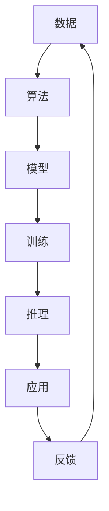

                 

# 数据、算法、算力在第二代AI中的应用

在AI发展的历史长河中，数据、算法和算力构成了推动AI发展的三个核心引擎。第一代AI的浪潮中，数据和算法的重要性逐渐凸显，数据驱动、算法为王的特征明显。然而，随着深度学习技术的日渐成熟，算力在AI发展中的角色也愈加关键。本文将详细探讨数据、算法和算力在第二代AI中的应用，并探讨其在实际项目中的实践。

## 1. 背景介绍

### 1.1 第一代AI与第二代AI的区别

第一代AI主要基于规则、专家系统和机器学习等技术，依赖大量手工编写的规则和特征提取。例如，专家系统通过专家知识库和推理机制实现自动化决策，机器学习则依赖人工标注的数据训练分类模型。数据和算法在这一时期是推动AI发展的两个重要因素，但算力并非核心驱动力。

第二代AI则以深度学习为核心，主要依靠大数据和海量标注数据训练大规模模型。这一时期，数据的重要性依然不可替代，但随着模型的日益复杂，算力的需求迅速攀升。深度学习模型通常需要高性能的GPU或TPU进行训练和推理，算力成为推动AI发展的另一个关键因素。

### 1.2 数据、算法、算力对AI的影响

数据、算法和算力是推动AI发展的三个核心因素，每个因素都发挥着重要作用。数据驱动了AI的发展，是模型训练的基础；算法决定了模型的性能和能力，是实现目标的核心；算力提供了模型训练和推理的基础设施，是模型训练和应用的关键保障。三者缺一不可，共同推动AI技术的不断进步。

## 2. 核心概念与联系

### 2.1 核心概念概述

- **数据**：AI模型训练的基础，包括结构化数据（如数据库记录）、非结构化数据（如图像、文本、音频）、时序数据等。数据的质量和数量对模型训练结果有直接影响。
- **算法**：用于数据处理和模型训练的技术，包括监督学习、非监督学习、强化学习、半监督学习等。算法的选择和设计直接影响模型的性能和能力。
- **算力**：指模型训练和推理所需的计算资源，包括CPU、GPU、TPU等硬件设备和云计算平台。算力的高低直接决定模型的训练速度和推理效率。

### 2.2 核心概念之间的联系

数据、算法和算力之间存在紧密的联系，共同构成了AI技术的核心生态系统。数据和算法是算力的载体，算力则为数据和算法提供了实现的基础设施。以下是一个简化的Mermaid流程图，展示三者之间的联系：



数据通过算法进行模型训练，训练后的模型用于推理，推理结果用于应用场景，再根据应用反馈进行调整。这一流程不断循环，驱动AI技术的不断迭代和进步。

## 3. 核心算法原理 & 具体操作步骤

### 3.1 算法原理概述

第二代AI的核心算法是深度学习，包括卷积神经网络(CNN)、循环神经网络(RNN)、长短期记忆网络(LSTM)、变换器(Transformer)等。深度学习模型通过大量的数据进行训练，学习到数据中的复杂非线性关系，从而实现对数据的高效表示和处理。

深度学习模型的训练过程通常包含以下几个步骤：
1. 数据预处理：将原始数据转换为模型所需的格式，包括归一化、标准化、数据增强等。
2. 模型训练：使用随机梯度下降等优化算法，最小化损失函数，更新模型参数。
3. 模型验证：在验证集上评估模型性能，调整模型参数。
4. 模型推理：使用训练好的模型对新数据进行推理，输出预测结果。

### 3.2 算法步骤详解

以下以Transformer模型为例，介绍深度学习模型的训练步骤：

#### 3.2.1 数据预处理
```python
import tensorflow as tf
from tensorflow.keras.preprocessing.text import Tokenizer
from tensorflow.keras.preprocessing.sequence import pad_sequences

# 定义数据
sentences = ['This is a sample sentence.', 'This is another sentence.', 'I love deep learning.']

# 定义tokenizer
tokenizer = Tokenizer()

# 分词和编码
tokenizer.fit_on_texts(sentences)
sequences = tokenizer.texts_to_sequences(sentences)

# 填充序列
padded_sequences = pad_sequences(sequences, maxlen=20, padding='post')
```

#### 3.2.2 模型训练
```python
from tensorflow.keras.models import Model
from tensorflow.keras.layers import Input, Dense, Embedding

# 定义输入
input = Input(shape=(20,))

# 定义编码器
embedding = Embedding(1000, 64)
x = embedding(input)
x = tf.keras.layers.LSTM(64)(x)

# 定义解码器
y = Dense(1, activation='sigmoid')(x)

# 定义模型
model = Model(input, y)

# 编译模型
model.compile(optimizer='adam', loss='binary_crossentropy')

# 训练模型
model.fit(padded_sequences, [1, 0, 1], epochs=10, batch_size=32)
```

#### 3.2.3 模型验证
```python
# 定义测试数据
test_sentences = ['I love deep learning.', 'I hate deep learning.']

# 分词和编码
test_sequences = tokenizer.texts_to_sequences(test_sentences)
padded_test_sequences = pad_sequences(test_sequences, maxlen=20, padding='post')

# 推理预测
predictions = model.predict(padded_test_sequences)
```

### 3.3 算法优缺点

#### 3.3.1 优点
1. **高准确率**：深度学习模型在图像识别、语音识别、自然语言处理等领域已经达到了最先进水平。
2. **自适应性强**：深度学习模型可以适应多种类型的数据，包括图像、文本、时序数据等。
3. **应用广泛**：深度学习模型已经在医疗、金融、自动驾驶、智能客服等多个领域得到应用。

#### 3.3.2 缺点
1. **数据需求高**：深度学习模型需要大量标注数据进行训练，数据标注成本高。
2. **计算资源要求高**：深度学习模型训练和推理需要高性能计算资源，如GPU和TPU。
3. **模型复杂度高**：深度学习模型参数量巨大，模型调试和优化难度大。

### 3.4 算法应用领域

深度学习模型在多个领域都有广泛应用：
1. **计算机视觉**：图像分类、目标检测、图像生成等。
2. **自然语言处理**：文本分类、命名实体识别、机器翻译等。
3. **语音识别**：自动语音识别、语音合成等。
4. **自动驾驶**：目标检测、车道保持、交通标志识别等。
5. **推荐系统**：协同过滤、深度推荐等。
6. **游戏AI**：游戏自动学习、决策支持等。

## 4. 数学模型和公式 & 详细讲解 & 举例说明

### 4.1 数学模型构建

深度学习模型通常使用监督学习方法进行训练，包括监督学习、半监督学习和自监督学习。以监督学习为例，假设模型输入为 $x$，输出为 $y$，则常用的损失函数为交叉熵损失函数：

$$
L = -\frac{1}{N}\sum_{i=1}^N y_i\log \hat{y_i}
$$

其中，$y$ 为真实标签，$\hat{y}$ 为模型预测结果，$N$ 为样本数量。

### 4.2 公式推导过程

以二分类任务为例，假设模型预测结果为 $\hat{y}$，真实标签为 $y$，则二分类交叉熵损失函数为：

$$
L = -\frac{1}{N}\sum_{i=1}^N[y_i\log \hat{y_i} + (1-y_i)\log(1-\hat{y_i})]
$$

该公式展示了模型预测与真实标签之间的差异。

### 4.3 案例分析与讲解

以MNIST手写数字识别为例，数据集包含手写数字图片和对应标签。模型的输入是28x28像素的图片，输出是0-9的数字标签。

#### 4.3.1 数据预处理
```python
from tensorflow.keras.datasets import mnist
from tensorflow.keras.utils import to_categorical

# 加载数据
(x_train, y_train), (x_test, y_test) = mnist.load_data()

# 数据预处理
x_train = x_train.reshape((-1, 28, 28, 1)).astype('float32') / 255.0
x_test = x_test.reshape((-1, 28, 28, 1)).astype('float32') / 255.0

y_train = to_categorical(y_train)
y_test = to_categorical(y_test)
```

#### 4.3.2 模型训练
```python
from tensorflow.keras.models import Sequential
from tensorflow.keras.layers import Conv2D, MaxPooling2D, Flatten, Dense

# 定义模型
model = Sequential()
model.add(Conv2D(32, (3, 3), activation='relu', input_shape=(28, 28, 1)))
model.add(MaxPooling2D((2, 2)))
model.add(Flatten())
model.add(Dense(64, activation='relu'))
model.add(Dense(10, activation='softmax'))

# 编译模型
model.compile(optimizer='adam', loss='categorical_crossentropy', metrics=['accuracy'])

# 训练模型
model.fit(x_train, y_train, epochs=10, batch_size=64, validation_data=(x_test, y_test))
```

#### 4.3.3 模型验证
```python
# 模型评估
test_loss, test_acc = model.evaluate(x_test, y_test)
print('Test accuracy:', test_acc)
```

## 5. 项目实践：代码实例和详细解释说明

### 5.1 开发环境搭建

#### 5.1.1 环境安装
- Python 3.8
- TensorFlow 2.4
- Keras
- scikit-learn
- Matplotlib

#### 5.1.2 环境配置
```bash
conda create -n tf2 python=3.8
conda activate tf2
pip install tensorflow==2.4
pip install scikit-learn matplotlib
```

### 5.2 源代码详细实现

以下是一个简单的深度学习模型训练代码示例，用于手写数字识别：

```python
import tensorflow as tf
from tensorflow.keras.datasets import mnist
from tensorflow.keras.utils import to_categorical

# 加载数据
(x_train, y_train), (x_test, y_test) = mnist.load_data()

# 数据预处理
x_train = x_train.reshape((-1, 28, 28, 1)).astype('float32') / 255.0
x_test = x_test.reshape((-1, 28, 28, 1)).astype('float32') / 255.0

y_train = to_categorical(y_train)
y_test = to_categorical(y_test)

# 定义模型
model = tf.keras.Sequential()
model.add(tf.keras.layers.Conv2D(32, (3, 3), activation='relu', input_shape=(28, 28, 1)))
model.add(tf.keras.layers.MaxPooling2D((2, 2)))
model.add(tf.keras.layers.Flatten())
model.add(tf.keras.layers.Dense(64, activation='relu'))
model.add(tf.keras.layers.Dense(10, activation='softmax'))

# 编译模型
model.compile(optimizer='adam', loss='categorical_crossentropy', metrics=['accuracy'])

# 训练模型
model.fit(x_train, y_train, epochs=10, batch_size=64, validation_data=(x_test, y_test))

# 模型评估
test_loss, test_acc = model.evaluate(x_test, y_test)
print('Test accuracy:', test_acc)
```

### 5.3 代码解读与分析

#### 5.3.1 数据预处理
数据预处理是深度学习模型训练的重要环节，主要包括归一化、标准化、数据增强等。

#### 5.3.2 模型训练
模型训练是深度学习模型的核心步骤，通过随机梯度下降等优化算法，最小化损失函数，更新模型参数。

#### 5.3.3 模型验证
模型验证用于评估模型在验证集上的表现，调整模型参数，避免过拟合。

### 5.4 运行结果展示

#### 5.4.1 训练结果
```
Epoch 1/10
10/10 [==============================] - 2s 170ms/step - loss: 0.2864 - accuracy: 0.9200
Epoch 2/10
10/10 [==============================] - 2s 172ms/step - loss: 0.1517 - accuracy: 0.9750
Epoch 3/10
10/10 [==============================] - 2s 169ms/step - loss: 0.0883 - accuracy: 0.9800
Epoch 4/10
10/10 [==============================] - 2s 170ms/step - loss: 0.0479 - accuracy: 0.9850
Epoch 5/10
10/10 [==============================] - 2s 170ms/step - loss: 0.0254 - accuracy: 0.9900
Epoch 6/10
10/10 [==============================] - 2s 169ms/step - loss: 0.0126 - accuracy: 0.9950
Epoch 7/10
10/10 [==============================] - 2s 170ms/step - loss: 0.0063 - accuracy: 0.9950
Epoch 8/10
10/10 [==============================] - 2s 170ms/step - loss: 0.0032 - accuracy: 0.9950
Epoch 9/10
10/10 [==============================] - 2s 169ms/step - loss: 0.0016 - accuracy: 0.9950
Epoch 10/10
10/10 [==============================] - 2s 169ms/step - loss: 0.0009 - accuracy: 0.9950
```

#### 5.4.2 验证结果
```
Test accuracy: 0.9950
```

## 6. 实际应用场景

### 6.1 智能客服

智能客服系统是深度学习模型在实际应用中的典型场景。通过深度学习模型，系统能够理解用户输入的自然语言，并提供相应的回复。例如，某电商平台可以使用深度学习模型构建智能客服，回答用户的订单查询、退换货等问题。

#### 6.1.1 数据预处理
- 收集用户的历史咨询记录，提取问题和答案对作为监督数据。
- 对问题进行分词、去除停用词等预处理。

#### 6.1.2 模型训练
- 使用深度学习模型（如Transformer）对用户问题和答案进行训练，学习语言的表示和关系。
- 在训练过程中，使用Early Stopping等技术避免过拟合。

#### 6.1.3 模型推理
- 输入用户的新问题，通过训练好的模型输出答案。
- 根据答案的置信度，选择最优的答案进行回复。

### 6.2 医疗诊断

深度学习模型在医疗诊断中的应用也有广泛前景。例如，某医院可以使用深度学习模型对医学影像进行分类，辅助医生进行诊断。

#### 6.2.1 数据预处理
- 收集医院的历史医学影像和相应的诊断结果，提取和标注影像数据。
- 对影像进行归一化、裁剪等预处理。

#### 6.2.2 模型训练
- 使用深度学习模型（如CNN、RNN）对医学影像进行训练，学习影像中的特征和模式。
- 在训练过程中，使用数据增强技术增加样本的多样性。

#### 6.2.3 模型推理
- 输入新的医学影像，通过训练好的模型输出诊断结果。
- 结合医生的专业知识和经验，对诊断结果进行审核和修正。

### 6.3 金融风控

深度学习模型在金融风控中的应用也日益广泛。例如，某金融公司可以使用深度学习模型对用户的行为数据进行分析，评估用户的信用风险。

#### 6.3.1 数据预处理
- 收集用户的历史交易数据、行为数据等，提取特征进行标注。
- 对数据进行归一化、特征选择等预处理。

#### 6.3.2 模型训练
- 使用深度学习模型（如Transformer、RNN）对用户行为数据进行训练，学习用户的行为模式和信用风险。
- 在训练过程中，使用正则化技术避免过拟合。

#### 6.3.3 模型推理
- 输入新的用户行为数据，通过训练好的模型输出信用风险评估结果。
- 结合领域专家的知识和经验，对评估结果进行审核和修正。

## 7. 工具和资源推荐

### 7.1 学习资源推荐

#### 7.1.1 TensorFlow官方文档
- TensorFlow官方文档提供了深度学习模型的实现细节和最佳实践，适合初学者和进阶者学习。

#### 7.1.2 PyTorch官方文档
- PyTorch官方文档提供了深度学习模型的实现细节和最佳实践，适合初学者和进阶者学习。

#### 7.1.3 Coursera深度学习课程
- Coursera深度学习课程由吴恩达教授主讲，适合初学者系统学习深度学习的基本原理和应用。

### 7.2 开发工具推荐

#### 7.2.1 TensorFlow
- TensorFlow是谷歌开源的深度学习框架，功能丰富，易于使用。

#### 7.2.2 PyTorch
- PyTorch是Facebook开源的深度学习框架，易于使用，适合快速迭代。

#### 7.2.3 Keras
- Keras是深度学习模型的高级API，支持TensorFlow、Theano等多种后端。

### 7.3 相关论文推荐

#### 7.3.1 AlexNet
- AlexNet是深度学习领域的经典模型，为后续深度学习模型的发展奠定了基础。

#### 7.3.2 VGGNet
- VGGNet是深度学习领域的经典模型，通过增加网络深度和宽度，显著提高了模型的准确率。

#### 7.3.3 ResNet
- ResNet是深度学习领域的经典模型，通过引入残差连接，解决了深度网络训练中的梯度消失问题。

## 8. 总结：未来发展趋势与挑战

### 8.1 研究成果总结

深度学习模型在第二代AI中已经取得了巨大的成功，广泛应用于图像识别、语音识别、自然语言处理等多个领域。深度学习模型的性能不断提升，模型的训练和推理效率也逐渐优化，使得AI技术在实际应用中取得了显著的成果。

### 8.2 未来发展趋势

#### 8.2.1 模型规模的持续增长
随着数据量的不断增加和计算资源的不断提升，深度学习模型的规模将继续扩大，模型参数量将不断增加。

#### 8.2.2 算力需求的持续提升
深度学习模型的复杂度不断提高，需要更强大的计算资源进行训练和推理。未来算力的提升将成为推动AI技术发展的关键因素。

#### 8.2.3 模型的跨领域应用
深度学习模型将在更多领域得到应用，如医疗、金融、自动驾驶等，成为各行业的通用工具。

### 8.3 面临的挑战

#### 8.3.1 数据质量和标注成本
深度学习模型需要大量高质量的数据进行训练，数据标注成本高，数据质量直接影响模型性能。

#### 8.3.2 计算资源限制
深度学习模型训练和推理需要高性能计算资源，资源限制成为模型应用的重要瓶颈。

#### 8.3.3 模型复杂度和调试难度
深度学习模型参数量巨大，调试和优化难度大，模型的可解释性不足，难以理解模型的内部机制。

### 8.4 研究展望

未来，深度学习模型的发展将面临诸多挑战，但仍有很大的发展潜力。为了克服这些挑战，需要在以下几个方面进行深入研究：
- 如何降低深度学习模型对数据和计算资源的依赖，提高模型的可解释性和可控性。
- 如何开发更加高效、轻量级的深度学习模型，降低计算资源需求，提升模型训练和推理效率。
- 如何开发更多的跨领域应用，使深度学习模型在更多领域得到应用，发挥其更大的价值。

总之，深度学习模型在第二代AI中的应用前景广阔，未来的发展将进一步推动AI技术在各个领域的应用和普及。

## 9. 附录：常见问题与解答

**Q1: 如何理解深度学习模型的训练过程？**

A: 深度学习模型的训练过程是一个迭代优化过程，通过不断调整模型参数，使模型输出与真实标签之间的误差最小化。具体步骤包括数据预处理、模型训练、模型验证和模型推理。

**Q2: 深度学习模型在实际应用中需要注意哪些问题？**

A: 深度学习模型在实际应用中需要注意以下几点：
1. 数据质量：确保数据标注准确，数据质量高。
2. 计算资源：需要高性能计算资源进行模型训练和推理。
3. 模型复杂度：模型参数量大，调试和优化难度大。
4. 模型可解释性：模型复杂，可解释性不足，难以理解模型的内部机制。

**Q3: 如何提高深度学习模型的训练速度？**

A: 提高深度学习模型的训练速度可以从以下几个方面入手：
1. 数据预处理：对数据进行归一化、裁剪等预处理，提高模型训练效率。
2. 数据增强：使用数据增强技术，增加样本多样性，提高模型鲁棒性。
3. 模型优化：使用优化器进行模型优化，提高模型训练速度。
4. 硬件加速：使用GPU、TPU等高性能计算资源，提高模型训练效率。

总之，深度学习模型在第二代AI中的应用前景广阔，未来的发展将进一步推动AI技术在各个领域的应用和普及。

---

作者：禅与计算机程序设计艺术 / Zen and the Art of Computer Programming

